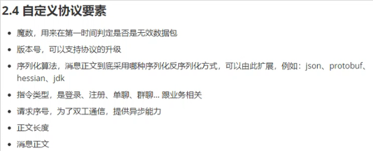

# NIO

## 三大组件

* channel
* buffer
* selector

### 服务器设计

* 多线程设计

  * 内存占用高

  * 线程上下文切换成本高

  * 只适合连接数少的场景

* 线程池设计
  * 阻塞模式下，线程仅能处理一个socket链接
  * 仅适合短链接场景
* selector设计
  * selector的select()会阻塞直到channel发生了读写就绪事件，事件发生后会返回这些时间交给thread处理

## ByteBuffer

### 基本使用

```java
@Slf4j
public class TestByteBuffer {
    public static void main(String[] args) {

        try (FileChannel channel = new FileInputStream("data.txt").getChannel()) {

            ByteBuffer buffer = ByteBuffer.allocate(10);

            channel.read(buffer);

            while(true) {
                int len = channel.read(buffer);
                log.info("读取到的字节{}", len);
                if (len == -1) {
                    break;
                }

                buffer.flip(); // 切换到读模式
                while (buffer.hasRemaining()) {
                    byte b = buffer.get();
                    log.info("实际字节: {}", (char) b);
                }
                buffer.clear(); // 切换到写模式
            }
        } catch (IOException e) {
            e.printStackTrace();
        }
    }
}
```

### 内部结构

* ByteBuffer重要属性
  * capacity
  * position
  * limit
* 一开始position指向开头，limit指向结尾
* 写模式下，position指向写入的位置，limit等于容量
* flip动作后，position切换为读取位置，limit切换为读取限制
* clear动作后，pisition重新指向开头位置，limit指向写入限制等于容量
* compact方法，是把未读完的部分向前压缩，然后切换至写模式

### ByteBuffer常见方法

* 分配空间

  可以使用allocate方法为ByteBuffer分配空间，其他buffer类也有该方法

  `ByteBuffer buffer = ByteBuffer.allocate(16);`

  > 使用allocate创建的是HeapByteBuffer，Java堆内存，读写效率较低，收到GC影响
  >
  > 使用allocateDirect创建的是DirectByteBuffer，直接内存，读写效率高，不受到GC影响

* 向buffer写入数据

  * 调用channel的read方法
  * 调用buffer的put方法

  `int readBytes = channel.read(buffer);`

  `buffer.put((byte)127);`

* 向buffer读取数据

  * 调用channel的write方法
  * 调用buffer的get方法

  `int writeBytes = channel.write(buffer);`

  `byte b = buffer.get();`

  get方法会让position读指针向后走，如果想要重复读取数据

  * 可以调用rewind方法将position重新置为0
  * 也可以调用get(int index)方法获取索引i位置的内容，他不会移动指针

* mark&reset

  mark做一标记，记录position的位置，reset是将position重置到mark位置

* 字符串转ByteBuffer

  * 字符串转为ButeBuffer（读模式）

  ```java
  ByteBuffer buffer = ByteBuffer.allocate(16);
  buffer.put("hello".getBytes());
  ```

  * Charset

    ```java
    ByteBuffer buffer = StandardCharsets.UTF_8.encode("hello");
    ```

  * wrap

    ```java
    ByteBuffer buffer = ByteBuffer.wrap("hello".getBytes);
    ```

* ByteBuffer转字符串

  ```java
   String str = StandardCharsets.UTF_8.decode(buffer).toString();
  ```

### 粘包、半包问题

```java
public class TestByteBufferExam {
    public static void main(String[] args) {
        ByteBuffer source = ByteBuffer.allocate(32);
        source.put("Hello, world\nI'm zhangsan\nHo".getBytes());
        split(source);
        source.put("w are you?\n".getBytes());
        split(source);
    }
    
    private static void split(ByteBuffer buffer) {
        buffer.flip();
        for (int i = 0; i < buffer.limit(); ++i) {
            if (buffer.get(i) == '\n') {
                int length = i - buffer.position() + 1;
                ByteBuffer target = ByteBuffer.allocate(length);
                for (int j = 0; j < length; ++j) {
                    target.put(buffer.get());
                }
            }
        }
        buffer.compact();
    }
}
```

## 文件编程

### FileChannel

**FileChannel只能工作在阻塞模式下**

#### 获取

不能直接打开FileChannel，必须通过FileInputStream、FileOutputStream或者RandomAccessFile来获取FileChannel，他们都有getChannel方法

* 通过FileInputStream获取的Channel只读
* 通过FileOutputStream获取的Channel只写
* 通过RandomAccessFile是否能读写根据构造RandomAccessFile时的读写模式决定

#### 读取

会从Channel中读取数据填充ByteBuffer，返回值表示读到多少字节，-1表示到达了文件末尾

`int readBytes = channel.read(buffer);`

#### 写入

```java
ByteBuffer buffer = ...;
buffer.put(...);
buffer.flip();

while (buffer.hasRemaining()) {
    channel.write(buffer);
}
```

#### 关闭

channel必须关闭，不过调用了close方法会间接调用channel的close方法

#### 位置

获取当前位置

`long pos = channel.position();`

设置当前位置

```java
long newPos = ...;
channel.position(newPos);
```

设置当前位置时，如果设置为文件的末尾

* 这是读取会返回-1
* 这是写入，会追加内容，但是注意如果position超过了文件末尾，再写入在新内容和原末尾之间就会有空洞

#### 大小

size获取文件大小

#### 强制写入

操作系统出于性能的考虑，会将数据缓存，不是立刻写入磁盘，可以调用force(true)方法将文件内容和元数据（文件的权限等信息）立刻写入磁盘

### 两个Channel传输数据

```java
public class TestFileChannelTransferTo {
    public static void main(String[] args) {
        try (
                FileChannel from = new FileInputStream("data.txt").getChannel();
                FileChannel to =  new FileOutputStream("to.txt").getChannel();
        ) {
            from.transferTo(0, from.size(), to);
        } catch (IOException e) {
            e.printStackTrace();
        }
    }
}
```

效率高，底层会利用操作系统的零拷贝进行优化

最高可以每次传送2g的数据

### Path

* Path用来表示文件路径

* Paths是工具类，用来获取Path实例

* 通过Paths的get方法可以获得Path对象，允许使用绝对路径，也可以使用相对路径

  `Path source = Paths.get("xxoo.txt");`

* 可以使用.代表当前路径..代表上一级路径
* 通过调用path的normalize方法可以正常化路径

### Files

* 检查文件是否存在

  ```java
  Path path = Path.get("helloword/data.txt");
  System.out.println(Files.exists(path));
  ```

* 创建一级目录

  ```java
  Path path = Paths.get("helloword/d1");
  Files.createDCirectory(path);
  ```

  * 如果目录已存在，抛出FileAlreadyExistsException
  * 不能一次创建多级目录，否则会抛出NoSuchFileException

* 创建多级目录

  ```java
  Path path = Paths.get("helloworld/d1/d2");
  Files.createDirectories(path);
  ```

* 拷贝文件

  ```java
  Path source = Paths.get("helloworld/data.txt");
  Path target = Paths.get("helloworld/target.txt");
  Files.copy(source, target);
  ```

  * 如果文件已存在，抛出FileAlreadyExistsException
  * 如果希望source覆盖target，需要用StandardCopyOption来控制

  `Files.copy(source, target, StandardCopyOption.REPLACE_EXISTING)`

* 移动文件

  ```java
  Path source = Paths.get("helloworld/data.txt");
  Path target = Paths.get("helloworld/target.txt");
  Files.move(source, target);
  ```

  * StandardCopyOption.ATOMIC_MOVE保证文件移动的原子性

* 删除文件

  ```java
  Path target = Paths.get("Helloworld/target.txt");
  Files.delete(target);
  ```

* 删除目录

  ```java
  Path target = Paths.get("Helloworld/d1");
  Files.delete(target);
  ```

  * 只能删除空目录

* 使用walkFileTree遍历路径

  ```java
  public class TestFilesWalkFileTree {
      public static void main(String[] args) throws IOException {
          AtomicInteger dirCount = new AtomicInteger();
          AtomicInteger fileCount = new AtomicInteger();
          Files.walkFileTree(Paths.get("D:\\WorkSpace\\Note"), new SimpleFileVisitor<Path>(){
              @Override
              public FileVisitResult preVisitDirectory(Path dir, BasicFileAttributes attrs) throws IOException {
                  System.out.println("--->" + dir);
                  dirCount.incrementAndGet();
                  return super.preVisitDirectory(dir, attrs);
              }
  
              @Override
              public FileVisitResult visitFile(Path file, BasicFileAttributes attrs) throws IOException {
                  System.out.println(file);
                  fileCount.incrementAndGet();
                  return super.visitFile(file, attrs);
              }
          });
          System.out.println(dirCount);
          System.out.println(fileCount);
      }
  }
  ```

## 网络编程

### 非阻塞 vs 阻塞

* 阻塞

  ```java
  @Slf4j
  public class Server {
      public static void main(String[] args) throws IOException {
          ServerSocketChannel ssc = ServerSocketChannel.open();
          ByteBuffer buffer = ByteBuffer.allocate(16);
  
          ssc.bind(new InetSocketAddress(8080));
  
          List<SocketChannel> channels = new ArrayList<>();
          while (true) {
              log.debug("connection...");
              SocketChannel sc = ssc.accept();
              log.debug("connected...");
              channels.add(sc);
              for (SocketChannel channel : channels) {
                  log.debug("读取数据前...{}", channel);
                  channel.read(buffer);
                  buffer.flip();
                  debugRead(buffer);
                  buffer.clear();
                  log.debug("读取数据后...{}", channel);
              }
          }
      }
  }
  ```

  ```java
  public class Client {
      public static void main(String[] args) throws IOException {
          SocketChannel sc = SocketChannel.open();
          sc.connect(new InetSocketAddress("localhost", 8080));
          System.out.println("waiting...");
      }
  }
  ```

* 非阻塞

  ```java
  @Slf4j
  public class Server {
      public static void main(String[] args) throws IOException {
          ServerSocketChannel ssc = ServerSocketChannel.open();
          ByteBuffer buffer = ByteBuffer.allocate(16);
          ssc.configureBlocking(false);
  
          ssc.bind(new InetSocketAddress(8080));
  
          List<SocketChannel> channels = new ArrayList<>();
          while (true) {
              log.debug("connection...");
              SocketChannel sc = ssc.accept();
              log.debug("connected...");
              channels.add(sc);
              for (SocketChannel channel : channels) {
                  log.debug("读取数据前...{}", channel);
                  channel.read(buffer);
                  buffer.flip();
                  debugRead(buffer);
                  buffer.clear();
                  log.debug("读取数据后...{}", channel);
              }
          }
      }
  }
  ```

  ```java
  public class Client {
      public static void main(String[] args) throws IOException {
          SocketChannel sc = SocketChannel.open();
          sc.connect(new InetSocketAddress("localhost", 8080));
          System.out.println("waiting...");
      }
  }
  ```

### Selector

单线程可以配合 Selector 完成对多个 Channel 可读写事件的监控，这称之为多路复用

* **多路复用仅针对网络 IO**，普通文件 IO **无法**利用多路复用
* 如果不用 Selector 的非阻塞模式，线程大部分时间都在做无用功，而 Selector 能够保证
  * 有可连接事件时才去连接
  * 有可读事件才去读取
  * 有可写事件才去写入

### 使用Accept事件

要使用Selector实现多路复用，服务端代码如下改进

```java
public class SelectServer {
    public static void main(String[] args) {
        ByteBuffer buffer = ByteBuffer.allocate(16);
        // 获得服务器通道
        try(ServerSocketChannel server = ServerSocketChannel.open()) {
            server.bind(new InetSocketAddress(8080));
            // 创建选择器
            Selector selector = Selector.open();
            
            // 通道必须设置为非阻塞模式
            server.configureBlocking(false);
            // 将通道注册到选择器中，并设置感兴趣的事件
            server.register(selector, SelectionKey.OP_ACCEPT);
            while (true) {
                // 若没有事件就绪，线程会被阻塞，反之不会被阻塞。从而避免了CPU空转
                // 返回值为就绪的事件个数
                int ready = selector.select();
                System.out.println("selector ready counts : " + ready);
                
                // 获取所有事件
                Set<SelectionKey> selectionKeys = selector.selectedKeys();
                
                // 使用迭代器遍历事件
                Iterator<SelectionKey> iterator = selectionKeys.iterator();
                while (iterator.hasNext()) {
                    SelectionKey key = iterator.next();
                    
                    // 判断key的类型
                    if(key.isAcceptable()) {
                        // 获得key对应的channel
                        ServerSocketChannel channel = (ServerSocketChannel) key.channel();
                        System.out.println("before accepting...");
                        
        				// 获取连接并处理，而且是必须处理，否则需要取消
                        SocketChannel socketChannel = channel.accept();
                        System.out.println("after accepting...");
                        
                        // 处理完毕后移除
                        iterator.remove();
                    }
                }
            }
        } catch (IOException e) {
            e.printStackTrace();
        }
    }
}
```

- 将通道设置为非阻塞模式，并注册到选择器中，并设置感兴趣的事件
  - channel 必须工作在非阻塞模式
  - FileChannel 没有非阻塞模式，因此不能配合 selector 一起使用
  - 绑定的事件类型可以有
    - connect - 客户端连接成功时触发
    - accept - 服务器端成功接受连接时触发
    - read - 数据可读入时触发，有因为接收能力弱，数据暂不能读入的情况
    - write - 数据可写出时触发，有因为发送能力弱，数据暂不能写出的情况

### 使用read事件

```java
public class SelectServer {
    public static void main(String[] args) {
        ByteBuffer buffer = ByteBuffer.allocate(16);
        // 获得服务器通道
        try(ServerSocketChannel server = ServerSocketChannel.open()) {
            server.bind(new InetSocketAddress(8080));
            // 创建选择器
            Selector selector = Selector.open();
            // 通道必须设置为非阻塞模式
            server.configureBlocking(false);
            // 将通道注册到选择器中，并设置感兴趣的实践
            server.register(selector, SelectionKey.OP_ACCEPT);
            // 为serverKey设置感兴趣的事件
            while (true) {
                // 若没有事件就绪，线程会被阻塞，反之不会被阻塞。从而避免了CPU空转
                // 返回值为就绪的事件个数
                int ready = selector.select();
                System.out.println("selector ready counts : " + ready);
                // 获取所有事件
                Set<SelectionKey> selectionKeys = selector.selectedKeys();
                // 使用迭代器遍历事件
                Iterator<SelectionKey> iterator = selectionKeys.iterator();
                while (iterator.hasNext()) {
                    SelectionKey key = iterator.next();
                    // 判断key的类型
                    if(key.isAcceptable()) {
                        // 获得key对应的channel
                        ServerSocketChannel channel = (ServerSocketChannel) key.channel();
                        System.out.println("before accepting...");
                        // 获取连接
                        SocketChannel socketChannel = channel.accept();
                        System.out.println("after accepting...");
                        // 设置为非阻塞模式，同时将连接的通道也注册到选择其中
                        socketChannel.configureBlocking(false);
                        socketChannel.register(selector, SelectionKey.OP_READ);
                        // 处理完毕后移除
                        iterator.remove();
                    } else if (key.isReadable()) {
                        SocketChannel channel = (SocketChannel) key.channel();
                        System.out.println("before reading...");
                        channel.read(buffer);
                        System.out.println("after reading...");
                        buffer.flip();
                        ByteBufferUtil.debugRead(buffer);
                        buffer.clear();
                        // 处理完毕后移除
                        iterator.remove();
                    }
                }
            }
        } catch (IOException e) {
            e.printStackTrace();
        }
    }
}
```

#### 删除事件

**当处理完一个事件后，一定要调用迭代器的remove方法移除对应事件，否则会出现错误**

#### 断开处理

* 正常断开

  正常断开时，服务器端的channel.read(buffer)方法的返回值为-1，**所以当结束到返回值为-1时，需要调用key的cancel方法取消此事件，并在取消后移除该事件**

- 异常断开

  异常断开时，会抛出IOException异常， 在try-catch的**catch块中捕获异常并调用key的cancel方法即可**

#### 处理消息边界

* 一种思路是固定消息长度，数据包大小一样，服务器按预定长度读取，确定浪费带宽
* 另一种思路是按分隔符拆分，缺点效率低
* TLV格式，即Type类型、Length长度、Value数据，类型和长度已知的情况下，就可以方便获取消息大小分配合适的buffer，缺点是buffer需要提前分配，如果内容过大，则影响server吞吐量

* 给channel注册selector时可以指定buffer作为附件，那么每个不同的channel就有自己的buffer，再通过调用attachment方法获取channel中的附件

#### ByteBuffer大小分配

* 每个channel都需要记录可能被切分的消息，因为ByteBuffer不能被多个channel共同使用，因此需要为每个channel维护一个独立的ByteBuffer
* ByteBuffer不能太大，比如一个ByteBuffer 1Mb的话，要支持百万链接就要1Tb内存，因此需要设计大小可变的ByteBuffer
  * 一种思路是首先分配一个较小的buffer，如果数据不够了，再分配一个8k的buffer，将4k的buffer内容拷贝至8k的buffer中，优点是消息来纳许容易处理，缺点是数据拷贝消耗性能
  * 另一种思路是用多个数组组成buffer，一个数组不够，把多出来的内容写入新的数组，与前面的区别在于消息存储不连续解析复杂，优点是避免了拷贝引起的性能消耗

### 使用write事件

```java
public class WriteServer {
    public static void main(String[] args) throws IOException {
        ServerSocketChannel ssc = ServerSocketChannel.open();
        ssc.configureBlocking(false);

        Selector selector = Selector.open();
        ssc.register(selector, SelectionKey.OP_ACCEPT);

        ssc.bind(new InetSocketAddress(8080));

        while (true) {
            selector.select();
            Iterator<SelectionKey> iterator = selector.selectedKeys().iterator();
            while (iterator.hasNext()) {
                SelectionKey key = iterator.next();
                iterator.remove();
                if (key.isAcceptable()) {
                    SocketChannel sc = ssc.accept();
                    sc.configureBlocking(false);
                    SelectionKey sckey = sc.register(selector, 0, null);

                    StringBuilder sb = new StringBuilder();
                    for (int i = 0; i < 30000000; ++i) {
                        sb.append("a");
                    }

                    ByteBuffer buffer = Charset.defaultCharset().encode(sb.toString());

                    int write = sc.write(buffer);
                    System.out.println(write);

                    // 返回值代表实际写入的字节数
                    if (buffer.hasRemaining()) {
                        // 关注可写事件
                        sckey.interestOps(sckey.interestOps() + SelectionKey.OP_WRITE);
                        // 将未写完的数据挂到sckey上
                        sckey.attach(buffer);
                    }
                } else if (key.isWritable()) {
                    ByteBuffer buffer = (ByteBuffer) key.attachment();
                    SocketChannel sc = (SocketChannel) key.channel();
                    int write = sc.write(buffer);
                    System.out.println(write);

                    // 清理操作
                    if (!buffer.hasRemaining()) {
                        key.attach(null);
                        key.interestOps(key.interestOps() - SelectionKey.OP_WRITE);
                    }
                }
            }
        }
    }
}
```

#### 多线程优化

walker类

```java
public class MultiThreadServer {
    public static void main(String[] args) throws IOException {
        Thread.currentThread().setName("boss");

        ServerSocketChannel ssc = ServerSocketChannel.open();
        ssc.configureBlocking(false);

        Selector boss = Selector.open();
        SelectionKey bossKey = ssc.register(boss, 0, null);
        bossKey.interestOps(SelectionKey.OP_ACCEPT);

        ssc.bind(new InetSocketAddress(8080));

        Worker worker = new Worker("worker-0");

        while (true) {
            boss.select();
            Iterator<SelectionKey> iterator = boss.selectedKeys().iterator();
            while (iterator.hasNext()) {
                SelectionKey key = iterator.next();
                iterator.remove();

                if (key.isAcceptable()) {
                    SocketChannel sc = ssc.accept();
                    sc.configureBlocking(false);

                    worker.register(sc);
                }
            }
        }
    }

    static class Worker implements Runnable {
        private Thread thread;
        private Selector selector;
        private String name;
        private volatile boolean start = false;
        private ConcurrentLinkedQueue<Runnable> queue = new ConcurrentLinkedQueue<>();

        public Worker(String name) {
            this.name = name;
        }

        public void register(SocketChannel sc) throws IOException {
            if (!start) {
                this.thread = new Thread(this, name);
                this.selector = Selector.open();
                thread.start();

                start = !start;
            }
            queue.add(() -> {
                try {
                    sc.register(this. selector, SelectionKey.OP_READ, null);
                } catch (ClosedChannelException e) {
                    throw new RuntimeException(e);
                }
            });
            selector.wakeup();
        }

        @Override
        public void run() {
            while (true) {
                try {
                    selector.select();
                    Runnable task = queue.poll();
                    if (task != null) {
                        task.run();
                    }
                    Iterator<SelectionKey> iterator = selector.selectedKeys().iterator();
                    while (iterator.hasNext()) {
                        SelectionKey key = iterator.next();
                        iterator.remove();
                        if (key.isReadable()) {
                            ByteBuffer buffer = ByteBuffer.allocate(16);
                            SocketChannel channel = (SocketChannel) key.channel();
                            channel.read(buffer);
                            buffer.flip();
                            debugAll(buffer);
                        }
                    }
                } catch (IOException e) {
                    throw new RuntimeException(e);
                }
            }
        }
    }
}
```

## NIO vs BIO

### 区别

* Stream不会自动缓冲数据，Channel会利用系统提供的发送缓冲区，接收缓冲区（更为底层）
* Stream仅支持阻塞API，Channel同时支持阻塞、非阻塞API，网络Channel可以配合Selector实现多路复用
* 二者均为全双工，即读写可以同时进行

### IO模型

同步阻塞、同步非阻塞、多路复用、异步阻塞、异步非阻塞

当调用channel.read或stream.read后，会切换至操作系统内核态来完成真正数据读取，而读取又分为两个阶段

* 等待数据阶段
* 复制数据阶段

### 零拷贝

* java调用transferTo方法后，要从程序的用户态切换到内核态，使用DMA将数据读入内核缓冲区，不会使用cpu
* 只会将一些offset和length信息考入socket缓冲区，几乎无消耗
* 使用DMA将内核缓冲区的数据写入网卡，不会使用cpu

整个过程仅只使用一次用户态到内核态的切换，数据拷贝了两次，所谓的零拷贝，并不是真正的零拷贝，二十再不会拷贝重要数据到jvm内存中，零拷贝的优点有

* 更少的用户态与内核态的切换
* 不利用cpu计算，减少cpu缓存伪共享
* 零拷贝适合小文件传输

### AIO

AIO用来解决数据复制阶段的阻塞问题

* 同步意味着，在进行读写操作时，线程需要等待结果，还是相当于闲置
* 异步意味着，在进行读写操作时，线程不必等待结果，而是将来由操作系统来通过回调方式由另外的线程获得结果

> 对window操作系统有性能提升、对linux操作系统没有性能提升

# Netty入门

## Hello wrold

### 服务端

```java
public class HelloServer {
    public static void main(String[] args) {
        // 1.启动器负责组装netty组件
        new ServerBootstrap()
                // 2.添加组件EventLoop由Selector和Thread组成, 添加了一个EventLoop组
                .group(new NioEventLoopGroup())
                // 3.选择服务器的ServerSocketChannel实现
                .channel(NioServerSocketChannel.class)
                // 4.worker（child）负责读写，具体逻辑，具体干什么事情处理哪些操作
                .childHandler(
                        // 5.channel代表和客户端进行数据读写，Initializer初始化，负责添加别的handler
                        new ChannelInitializer<NioSocketChannel>() {
                            // 6.添加别的具体handler
                    @Override
                    protected void initChannel(NioSocketChannel nioSocketChannel) throws Exception {
                        nioSocketChannel.pipeline().addLast(new StringDecoder()); // 将ByteBuffer转换为String字符串
                        // 自定义Handler
                        nioSocketChannel.pipeline().addLast(new ChannelInboundHandlerAdapter() {
                            // 读事件
                            @Override
                            public void channelRead(ChannelHandlerContext ctx, Object msg) throws Exception {
                                // 打印上一步转换好的字符串
                                System.out.println(msg);
                            }
                        });
                    }
                })
                // 7.绑定接听端口
                .bind(8080);
    }
}
```

### 客户端

```java
public class HelloClient {
    public static void main(String[] args) throws InterruptedException {
        // 1.启动类
        new Bootstrap()
                // 2.添加EventLoop
                .group(new NioEventLoopGroup())
                // 3.选择客户端的Channel
                .channel(NioSocketChannel.class)
                // 4.添加处理器
                .handler(new ChannelInitializer<NioSocketChannel>() {
                    @Override
                    protected void initChannel(NioSocketChannel nioSocketChannel) throws Exception {
                        nioSocketChannel.pipeline().addLast(new StringEncoder());
                    }
                })
                // 5.连接服务器
                .connect(new InetSocketAddress("localhost", 8080))
                .sync()
                .channel()
                // 6.向服务器发送数据
                .writeAndFlush("hello world");
    }
}
```

## 组件

### EventLoop

EventLoop本质是一个单线程执行器（同时维护了一个Selector），里面有run方法处理Channel上的IO事件

* 继承自j.u.c.ScheduledExecutorExecutor
* 继承自netty自己的OrderedEventExecutor
  * 提供了boolean inEventLoop(Thread thread)方法判断一个线程是否属于此EventLoop
  * 提供了parent方法来看啊可能自己属于那个EventLoopGroup

EventLoop是一组EventLoop，Channel一般会调用EventLoopGroup的register方法来绑定其中一个EventLoop，后续这个Channel上的io事件由此EventLoop来处理（保证了io事件处理时的线程安全）

* 继承自netty自己的EventExecutorGroup
  * 实现了iterable接口提供遍历EventLoop的能力
  * next方法获取集合中的下一个Event Loop

#### 客户端

```java
public class EventLoopClient {
    public static void main(String[] args) throws InterruptedException {
        // 1.启动类
        Channel channel = new Bootstrap()
                // 2.添加EventLoop
                .group(new NioEventLoopGroup())
                // 3.选择客户端的Channel
                .channel(NioSocketChannel.class)
                // 4.添加处理器
                .handler(new ChannelInitializer<NioSocketChannel>() {
                    @Override
                    protected void initChannel(NioSocketChannel nioSocketChannel) throws Exception {
                        nioSocketChannel.pipeline().addLast(new StringEncoder());
                    }
                })
                // 5.连接服务器
                .connect(new InetSocketAddress("localhost", 8080))
                .sync()
                .channel();

        System.out.println(channel);
        System.out.println("");
    }
}
```

#### 服务端

```java
@Slf4j
public class TestEventLoop {
    public static void main(String[] args) {
        // 默认为系统的cpu线程数 * 2
        EventLoopGroup group = new NioEventLoopGroup(2); // io事件，普通任务，定时任务
//        EventLoopGroup group = new DefaultEventLoopGroup(); // 普通任务，定时任务

        // 循环轮询
        /*System.out.println(group.next());
        System.out.println(group.next());
        System.out.println(group.next());*/

        // 执行普通任务
        /*group.next().submit(() -> {
            try {
                Thread.sleep(1000);
            } catch (InterruptedException e) {
                throw new RuntimeException(e);
            }
            log.debug("ok");
        });
        log.debug("main");*/

        // 执行定时任务 第一个参数Runnable 第二个参数起始事件，多少事件后执行 第三个参数间隔事件，第四个参数时间类型
        /*group.next().scheduleAtFixedRate(() -> {
            log.debug("ok");
        }, 3, 1, TimeUnit.SECONDS);*/

        // io任务
        new ServerBootstrap()
                .group(new NioEventLoopGroup())
                .channel(NioServerSocketChannel.class)
                .childHandler(new ChannelInitializer<NioSocketChannel>() {
                    @Override
                    protected void initChannel(NioSocketChannel nioSocketChannel) throws Exception {
                        nioSocketChannel.pipeline().addLast(new ChannelInboundHandlerAdapter(){
                            @Override
                            public void channelRead(ChannelHandlerContext ctx, Object msg) throws Exception {
                                ByteBuf buf = (ByteBuf) msg;
                                log.debug(buf.toString(StandardCharsets.UTF_8));
                            }
                        });
                    }
                })
                .bind(8080);
    }
}
```

#### 分工细化

```java
      new ServerBootstrap()
                // boss  worker 第一个参数只负责accept事件，第二负责读写操作
                .group(new NioEventLoopGroup(), new NioEventLoopGroup(2))
```

* 让第一个EventLoop指控accept事件
* 让第二个参数作为worker控制读写操作

```java
nioSocketChannel.pipeline().addLast("handler2", new ChannelInboundHandlerAdapter(){
                            @Override
                            public void channelRead(ChannelHandlerContext ctx, Object msg) throws Exception {
                                ByteBuf buf = (ByteBuf) msg;
                                log.debug(buf.toString(StandardCharsets.UTF_8));
                                ctx.fireChannelRead(msg); // 将消息传递给下一个handler
                            }
                        }).addLast(eventGroup, "handler1", new ChannelInboundHandlerAdapter(){
                            @Override
                            public void channelRead(ChannelHandlerContext ctx, Object msg) throws Exception {
                                ByteBuf buf = (ByteBuf) msg;
                                log.debug(buf.toString(StandardCharsets.UTF_8));
                            }
                        });
```

* 将耗时的操作交个另一个eventLoop完成
* 通过fireChannelRead可以将消息传递给另外的handler

#### 切换线程

```java
	
static void invokeChannelRead(final AbstractChannelHandlerContext next, Object msg) {
        final Object m = next.pipeline.touch(ObjectUtil.checkNotNull(msg, "msg"), next);
        EventExecutor executor = next.executor(); // 返回下一个handler的EventLoop
        if (executor.inEventLoop()) { // 当前handler中的线程，是否与eventloop是同一个线程
            next.invokeChannelRead(m);
        } else {
            executor.execute(new Runnable() {
                public void run() {
                    next.invokeChannelRead(m);
                }
            });
        }
    }
```

* 如果两个handler绑定的同一个线程，那么就会直接执行
* 如果两个handler绑定的不是同一个线程，那么就将调用封装为一个Runnable对象，由下一个线程来执行

### Channel

* close()可以用来关闭channel
* closeFuture()用来处理channel的关闭
  * sync方法作用是同步等待channel关闭
  * 而addListener方法是异步等待channel关闭
* pipeline()方法添加处理器
* write()方法将数据写入
* writeAndFlush()方法将数据写入并刷出

#### 结果处理

```java
@Slf4j
public class ChannelClient {
    public static void main(String[] args) throws InterruptedException {
        // 带有Future，Promise的类型都是和异步方法配套使用的，用来处理结果
        ChannelFuture channelFuture = new Bootstrap()
                .group(new NioEventLoopGroup())
                .channel(NioSocketChannel.class)
                .handler(new ChannelInitializer<NioSocketChannel>() {
                    @Override
                    protected void initChannel(NioSocketChannel nioSocketChannel) throws Exception {
                        nioSocketChannel.pipeline().addLast(new StringEncoder());
                    }
                })
                // 1. 连接到服务器
                // 异步非阻塞方法 main发起调用，真正执行connect的是nio线程
                .connect(new InetSocketAddress("localhost", 8080));

        // 如果没有sync方法，那么就会直接执行channel()方法，但是链接没有建立好
        /*channelFuture.sync(); // 阻塞当前线程，知道nio线程创建好链接为止
        Channel channel = channelFuture.channel();
        log.debug("{}", channel);
        channel.writeAndFlush("Hello world");*/

        // 使用addListener（回调对象）方法异步处理结果
        channelFuture.addListener((future) -> {
            ChannelFuture cFuture = (ChannelFuture) future;
            Channel channel = cFuture.channel();
            log.info("{}", channel);
            channel.writeAndFlush("Hello world");
        });
    }
}
```

```java
public class Server {
    public static void main(String[] args) {
        new ServerBootstrap()
                .group(new NioEventLoopGroup())
                .channel(NioServerSocketChannel.class)
                .childHandler(new ChannelInitializer<NioSocketChannel>() {
                    @Override
                    protected void initChannel(NioSocketChannel nioSocketChannel) throws Exception {
                        nioSocketChannel.pipeline().addLast(new ChannelInboundHandlerAdapter() {
                            @Override
                            public void channelRead(ChannelHandlerContext ctx, Object msg) throws Exception {
                                ByteBuf buf = (ByteBuf) msg;
                                System.out.println(buf.toString(StandardCharsets.UTF_8));
                            }
                        });
                    }
                })
                .bind(8080);
    }
}
```

#### 关闭问题

```java
@Slf4j
public class CloseClient {
    public static void main(String[] args) throws InterruptedException {
        NioEventLoopGroup group = new NioEventLoopGroup();
        ChannelFuture channelFuture = new Bootstrap()
                .group(group)
                .channel(NioSocketChannel.class)
                .handler(new ChannelInitializer<NioSocketChannel>() {
                    @Override
                    protected void initChannel(NioSocketChannel nioSocketChannel) throws Exception {
                        nioSocketChannel.pipeline().addLast(new LoggingHandler(LogLevel.DEBUG));
                        nioSocketChannel.pipeline().addLast(new StringEncoder());
                    }
                })
                .connect(new InetSocketAddress("localhost", 8080));

        channelFuture.sync();
        Channel channel = channelFuture.channel();
        new Thread(() -> {
            Scanner scanner = new Scanner(System.in);
            while (true) {
                String line = scanner.nextLine();
                if ("q".equals(line)) {
                    channel.close();
                    break;
                }
                channel.writeAndFlush(line);
            }
        }, "input").start();

        // 获取closeFuture对象 1）同步处理关闭 2）异步处理关闭
        ChannelFuture closeFuture = channel.closeFuture();
        /*log.debug("waiting close...");
        closeFuture.sync();
        log.debug("处理关闭");*/
        closeFuture.addListener((future -> {
            ChannelFuture cf = (ChannelFuture) future;
            log.debug("处理关闭");
            group.shutdownGracefully();
        }));
    }
}
```

#### 异步操作原因

* 单线程没法异步提高效率，必须配合多线程、多核cpu才能发挥异步的优势
* 异步并灭有缩短响应时间，反而有所增加
* 合理进行任务拆分，也是利用异步的关键

### Future&Promise

netty的Future继承自jdk的Future，而Promise又对nettyFuture进行扩展

* jdkFuture只能同步等待任务结束才嗯那个得到结果
* nettyFuture可以同步等待任务结束的到结果，也可以通过异步方式得到结果，但都要等任务结束
* nettyPromise不仅有nettyFuture的功能，而且脱离了任务独立存在，只作用两个线程间传递结果的容器

| 功能/名称    | jdk Future                     | netty Future                                                 | Promise      |
| ------------ | ------------------------------ | ------------------------------------------------------------ | ------------ |
| cancel       | 取消任务                       | -                                                            | -            |
| isCanceled   | 任务是否取消                   | -                                                            | -            |
| isDone       | 任务是否完成，不能区分成功失败 | -                                                            | -            |
| get          | 获取任务结果，阻塞等待         | -                                                            | -            |
| getNow       | -                              | 获取任务结果，非阻塞，还未产生结果时返回 null                | -            |
| await        | -                              | 等待任务结束，如果任务失败，**不会抛异常**，而是通过 isSuccess 判断 | -            |
| sync         | -                              | 等待任务结束，如果任务失败，抛出异常                         | -            |
| isSuccess    | -                              | 判断任务是否成功                                             | -            |
| cause        | -                              | 获取失败信息，非阻塞，如果没有失败，返回null                 | -            |
| addLinstener | -                              | 添加回调，异步接收结果                                       | -            |
| setSuccess   | -                              | -                                                            | 设置成功结果 |
| setFailure   | -                              | -                                                            | 设置失败结果 |

#### jdk future

```java
@Slf4j
public class JdkFuture {
    public static void main(String[] args) throws ExecutionException, InterruptedException {
        ExecutorService service = Executors.newFixedThreadPool(2);

        Future<Integer> future = service.submit(new Callable<Integer>() {

            @Override
            public Integer call() throws Exception {
                log.debug("执行计算");
                Thread.sleep(1000);
                return 50;
            }
        });

        // 阻塞方法
        log.debug("等待结果");
        log.debug("{}" + future.get());
    }
}
```

#### netty future

```java
@Slf4j
public class NettyFuture {
    public static void main(String[] args) throws ExecutionException, InterruptedException {
        NioEventLoopGroup group = new NioEventLoopGroup();
        EventLoop eventLoop = group.next();
        Future<Integer> future = eventLoop.submit(new Callable<Integer>() {
            @Override
            public Integer call() throws Exception {
                log.debug("执行计算");
                Thread.sleep(1000);
                return 8;
            }
        });
        // 同步
        /*log.debug("等待结果");
        log.debug("{}", future.get());*/
        // 异步
        future.addListener(f -> {
            log.debug("等待结果{}", f.getNow());
        });
    }
}
```

#### netty promise

```java
@Slf4j
public class NettyPromise {
    public static void main(String[] args) throws ExecutionException, InterruptedException {
        //准备EventLoop对象
        EventLoop next = new NioEventLoopGroup().next();
        // 可以主动创建Promise
        DefaultPromise<Integer> promise = new DefaultPromise<>(next);

        new Thread(() -> {
            // 任意线程执行计算，计算完毕后想promise填充结果
            try {
                Thread.sleep(1000);
            } catch (InterruptedException e) {
                throw new RuntimeException(e);
            }
            promise.setSuccess(80);
        }).start();

        log.debug("等待结果");
        log.debug("{}", promise.get());
    }
}
```

### Handler & Pipeline

ChannelHandler用来处理Channel中的各种事件，分为入站、出站两种。所有Channel Handler被连成一串，就是Pipeline

* 入站处理器通常是ChannelInboundHandlerAdapter的子类，主要用来读取客户端数据，写回结果
* 出站处理器通常是ChannelOutboundHandlerAdapter的子类，主要对写回结果进行加工

必须执行write方法写出才能执行出站执行器

入站，顺序执行，出站，倒序执行

#### inBoundHandler

```java
@Slf4j
public class TestInBondHandler {
    public static void main(String[] args) {
        new ServerBootstrap()
                .group(new NioEventLoopGroup())
                .channel(NioServerSocketChannel.class)
                .childHandler(new ChannelInitializer<NioSocketChannel>() {
                    @Override
                    protected void initChannel(NioSocketChannel nioSocketChannel) throws Exception {
                        nioSocketChannel.pipeline().addLast(new ChannelInboundHandlerAdapter() {
                            @Override
                            public void channelRead(ChannelHandlerContext ctx, Object msg) throws Exception {
                                ByteBuf buf = (ByteBuf) msg;
                                String name = buf.toString(Charset.defaultCharset());
                                super.channelRead(ctx, name);
                            }
                        });
                        nioSocketChannel.pipeline().addLast(new ChannelInboundHandlerAdapter() {
                            @Override
                            public void channelRead(ChannelHandlerContext ctx, Object msg) throws Exception {
                                Student student = new Student(msg.toString());
                                super.channelRead(ctx, student);
                            }
                        });
                        nioSocketChannel.pipeline().addLast(new ChannelInboundHandlerAdapter() {
                            @Override
                            public void channelRead(ChannelHandlerContext ctx, Object msg) throws Exception {
                                log.debug("{} 类型: {}", msg, msg.getClass());
                                nioSocketChannel.writeAndFlush(ctx.alloc().buffer().writeBytes("server...".getBytes()));
                            }
                        });
                        nioSocketChannel.pipeline().addLast(new ChannelOutboundHandlerAdapter() {
                            @Override
                            public void write(ChannelHandlerContext ctx, Object msg, ChannelPromise promise) throws Exception {
                                super.write(ctx, msg, promise);
                            }
                        });
                        nioSocketChannel.pipeline().addLast(new ChannelOutboundHandlerAdapter() {
                            @Override
                            public void write(ChannelHandlerContext ctx, Object msg, ChannelPromise promise) throws Exception {
                                super.write(ctx, msg, promise);
                            }
                        });
                        nioSocketChannel.pipeline().addLast(new ChannelOutboundHandlerAdapter() {
                            @Override
                            public void write(ChannelHandlerContext ctx, Object msg, ChannelPromise promise) throws Exception {
                                super.write(ctx, msg, promise);
                            }
                        });
                    }
                })
                .bind(8080);
    }

    @Data
    @AllArgsConstructor
    static class Student {
        String name;
    }
}
```

```java
public class Client {
    public static void main(String[] args) throws InterruptedException {
        new Bootstrap()
                .group(new NioEventLoopGroup())
                .channel(NioSocketChannel.class)
                .handler(new ChannelInitializer<NioSocketChannel>() {
                    @Override
                    protected void initChannel(NioSocketChannel nioSocketChannel) throws Exception {
                        nioSocketChannel.pipeline().addLast(new StringEncoder());
                    }
                })
                .connect(new InetSocketAddress("localhost", 8080))
                .sync()
                .channel()
                .writeAndFlush("大爹王");
    }
}
```

#### outBoundHandler

* 出站处理器，通过channel调用是从末尾开始执行，但是如果通过ctx就是从当前节点找上一个出战处理器执行

#### EmbeddedChannel

```java
@Slf4j
public class TestEmbeddedChannel {
    public static void main(String[] args) {
        ChannelInboundHandlerAdapter h1 = new ChannelInboundHandlerAdapter() {
            @Override
            public void channelRead(ChannelHandlerContext ctx, Object msg) throws Exception {
                log.debug("1");
                super.channelRead(ctx, msg);
            }
        };

        ChannelInboundHandlerAdapter h2 = new ChannelInboundHandlerAdapter() {
            @Override
            public void channelRead(ChannelHandlerContext ctx, Object msg) throws Exception {
                log.debug("2");
                super.channelRead(ctx, msg);
            }
        };

        ChannelInboundHandlerAdapter h3 = new ChannelInboundHandlerAdapter() {
            @Override
            public void channelRead(ChannelHandlerContext ctx, Object msg) throws Exception {
                log.debug("3");
                super.channelRead(ctx, msg);
            }
        };

        ChannelInboundHandlerAdapter h4 = new ChannelInboundHandlerAdapter() {
            @Override
            public void channelRead(ChannelHandlerContext ctx, Object msg) throws Exception {
                log.debug("4");
                super.channelRead(ctx, msg);
            }
        };

        EmbeddedChannel embeddedChannel = new EmbeddedChannel(h1, h2, h3, h4);
        embeddedChannel.writeInbound(ByteBufAllocator.DEFAULT.buffer().writeBytes("hello".getBytes()));
        embeddedChannel.writeOutbound(ByteBufAllocator.DEFAULT.buffer().writeBytes("word".getBytes()));
    }
}
```

### ByteBuf

#### 创建

```java
public class ByteBufStudy {
    public static void main(String[] args) {
        // 创建ByteBuf
        ByteBuf buffer = ByteBufAllocator.DEFAULT.buffer(16);
        ByteBufUtil.log(buffer);

        // 向buffer中写入数据
        StringBuilder sb = new StringBuilder();
        for(int i = 0; i < 20; i++) {
            sb.append("a");
        }
        buffer.writeBytes(sb.toString().getBytes(StandardCharsets.UTF_8));

        // 查看写入结果
        ByteBufUtil.log(buffer);
    }
}
```

```java
public class ByteBufUtil {
    public static void log(ByteBuf buffer) {
        int length = buffer.readableBytes();
        int rows = length / 16 + (length % 15 == 0 ? 0 : 1) + 4;
        StringBuilder buf = new StringBuilder(rows * 80 * 2)
                .append("read index:").append(buffer.readerIndex())
                .append(" write index:").append(buffer.writerIndex())
                .append(" capacity:").append(buffer.capacity())
                .append(NEWLINE);
        appendPrettyHexDump(buf, buffer);
        System.out.println(buf.toString());
    }
}
```

#### 直接内存与堆内存

通过该方法创建的ByteBuf，使用的是**基于直接内存**的ByteBuf

```java
ByteBuf buffer = ByteBufAllocator.DEFAULT.buffer(16);
```

可以使用下面的代码来创建池化**基于堆**的 ByteBuf

```java
ByteBuf buffer = ByteBufAllocator.DEFAULT.heapBuffer(16);
```

也可以使用下面的代码来创建池化**基于直接内存**的 ByteBuf

```java
ByteBuf buffer = ByteBufAllocator.DEFAULT.directBuffer(16);
```

- 直接内存创建和销毁的代价昂贵，但读写性能高（少一次内存复制），适合配合池化功能一起用
- 直接内存对 GC 压力小，因为这部分内存不受 JVM 垃圾回收的管理，但也要注意及时主动释放

#### 池化与非池化

池化的最大意义在于可以**重用** ByteBuf，优点有

- 没有池化，则每次都得创建新的 ByteBuf 实例，这个操作对直接内存代价昂贵，就算是堆内存，也会增加 GC 压力
- 有了池化，则可以重用池中 ByteBuf 实例，并且采用了与 jemalloc 类似的内存分配算法提升分配效率
- 高并发时，池化功能更节约内存，减少内存溢出的可能

池化功能是否开启，可以通过下面的系统环境变量来设置

```java
-Dio.netty.allocator.type={unpooled|pooled}
```

- 4.1 以后，**非 Android 平台默认启用池化实现**，Android 平台启用非池化实现
- 4.1 之前，池化功能还不成熟，默认是非池化实现

#### 写入

| 方法签名                                                     | 含义                       | 备注                                                    |
| ------------------------------------------------------------ | -------------------------- | ------------------------------------------------------- |
| writeBoolean(boolean value)                                  | 写入 boolean 值            | **用一字节 01\|00 代表 true\|false**                    |
| writeByte(int value)                                         | 写入 byte 值               |                                                         |
| writeShort(int value)                                        | 写入 short 值              |                                                         |
| writeInt(int value)                                          | 写入 int 值                | Big Endian（大端写入），即 0x250，写入后 00 00 02 50    |
| writeIntLE(int value)                                        | 写入 int 值                | Little Endian（小端写入），即 0x250，写入后 50 02 00 00 |
| writeLong(long value)                                        | 写入 long 值               |                                                         |
| writeChar(int value)                                         | 写入 char 值               |                                                         |
| writeFloat(float value)                                      | 写入 float 值              |                                                         |
| writeDouble(double value)                                    | 写入 double 值             |                                                         |
| writeBytes(ByteBuf src)                                      | 写入 netty 的 ByteBuf      |                                                         |
| writeBytes(byte[] src)                                       | 写入 byte[]                |                                                         |
| writeBytes(ByteBuffer src)                                   | 写入 nio 的 **ByteBuffer** |                                                         |
| int writeCharSequence(CharSequence sequence, Charset charset) | 写入字符串                 | CharSequence为字符串类的父类，第二个参数为对应的字符集  |

#### 扩容

- 如何写入后数据大小未超过 512 字节，则选择下一个 16 的整数倍进行扩容
  - 例如写入后大小为 12 字节，则扩容后 capacity 是 16 字节
- 如果写入后数据大小超过 512 字节，则选择下一个 2^n
  - 例如写入后大小为 513 字节，则扩容后 capacity 是 210=1024 字节（29=512 已经不够了）
- 扩容**不能超过** maxCapacity，否则会抛出`java.lang.IndexOutOfBoundsException`异常

#### 读取

读取主要是通过一系列read方法进行读取，读取时会根据读取数据的字节数移动读指针

如果需要**重复读取**，需要调用`buffer.markReaderIndex()`对读指针进行标记，并通过`buffer.resetReaderIndex()`将读指针恢复到mark标记的位置

```java
public class ByteBufStudy {
    public static void main(String[] args) {
        // 创建ByteBuf
        ByteBuf buffer = ByteBufAllocator.DEFAULT.buffer(16, 20);

        // 向buffer中写入数据
        buffer.writeBytes(new byte[]{1, 2, 3, 4});
        buffer.writeInt(5);

        // 读取4个字节
        System.out.println(buffer.readByte());
        System.out.println(buffer.readByte());
        System.out.println(buffer.readByte());
        System.out.println(buffer.readByte());
        ByteBufUtil.log(buffer);

        // 通过mark与reset实现重复读取
        buffer.markReaderIndex();
        System.out.println(buffer.readInt());
        ByteBufUtil.log(buffer);

        // 恢复到mark标记处
        buffer.resetReaderIndex();
        ByteBufUtil.log(buffer);
    }
}
```

#### 内存释放

由于 Netty 中有堆外内存（直接内存）的 ByteBuf 实现，**堆外内存最好是手动来释放**，而不是等 GC 垃圾回收。

- UnpooledHeapByteBuf 使用的是 JVM 内存，只需等 GC 回收内存即可
- UnpooledDirectByteBuf 使用的就是直接内存了，需要特殊的方法来回收内存
- PooledByteBuf 和它的子类使用了池化机制，需要更复杂的规则来回收内存

Netty 这里采用了引用计数法来控制回收内存，每个 ByteBuf 都实现了 ReferenceCounted 接口

- 每个 ByteBuf 对象的初始计数为 1
- 调用 release 方法计数减 1，如果计数为 0，ByteBuf 内存被回收
- 调用 retain 方法计数加 1，表示调用者没用完之前，其它 handler 即使调用了 release 也不会造成回收
- 当计数为 0 时，底层内存会被回收，这时即使 ByteBuf 对象还在，其各个方法均无法正常使用

**基本规则是，谁是最后使用者，谁负责 release**

#### slice零拷贝

```java
public class TestSlice {
    public static void main(String[] args) {
        ByteBuf buf = ByteBufAllocator.DEFAULT.buffer(10);
        buf.writeBytes(new byte[]{'a', 'b', 'c', 'd', 'e', 'f', 'g', 'h', 'i', 'j'});
        log(buf);

        ByteBuf f1 = buf.slice(0, 5);
        ByteBuf f2 = buf.slice(5, 5);
        log(f1);
        log(f2);

        f1.setByte(0, 'b');
        log(f1);
        log(buf);
    }
}
```

```java
public class TestSlice {
    public static void main(String[] args) {
        ByteBuf buf = ByteBufAllocator.DEFAULT.buffer(10);
        buf.writeBytes(new byte[]{'a', 'b', 'c', 'd', 'e', 'f', 'g', 'h', 'i', 'j'});
        log(buf);

        ByteBuf f1 = buf.slice(0, 5);
        f1.retain();
        ByteBuf f2 = buf.slice(5, 5);
        f2.retain();
        log(f1);
        log(f2);

        f1.setByte(0, 'b');
        log(f1);
        log(buf);
    }
}
```

每一个切片都应该调用一次retain，自己释放使用的内存

#### composite零拷贝

```java
public class Test {
    public static void main(String[] args) {
        ByteBuf buf1 = ByteBufAllocator.DEFAULT.buffer();
        buf1.writeBytes(new byte[]{1, 2, 3, 4, 5});

        ByteBuf buf2 = ByteBufAllocator.DEFAULT.buffer();
        buf2.writeBytes(new byte[]{6, 7, 8, 9, 10});

        CompositeByteBuf buffer = ByteBufAllocator.DEFAULT.compositeBuffer();
        buffer.addComponents(true, buf1, buf2);
        log(buffer);
    }
}
```

#### 优势

- 池化思想 - 可以重用池中 ByteBuf 实例，更节约内存，减少内存溢出的可能
- **读写指针分离**，不需要像 ByteBuffer 一样切换读写模式
- 可以**自动扩容**
- 支持链式调用，使用更流畅
- 很多地方体现零拷贝，例如
  - slice、duplicate、CompositeByteBuf

# Netty进阶

## 粘包与半包

### 服务器

```java
public class StudyServer {
    static final Logger log = LoggerFactory.getLogger(StudyServer.class);
    void start() {
        NioEventLoopGroup boss = new NioEventLoopGroup(1);
        NioEventLoopGroup worker = new NioEventLoopGroup();
        try {
            ServerBootstrap serverBootstrap = new ServerBootstrap();
            serverBootstrap.channel(NioServerSocketChannel.class);
            serverBootstrap.group(boss, worker);
            serverBootstrap.childHandler(new ChannelInitializer<SocketChannel>() {
                @Override
                protected void initChannel(SocketChannel ch) {
                    ch.pipeline().addLast(new LoggingHandler(LogLevel.DEBUG));
                    ch.pipeline().addLast(new ChannelInboundHandlerAdapter() {
                        @Override
                        public void channelActive(ChannelHandlerContext ctx) throws Exception {
                            // 连接建立时会执行该方法
                            log.debug("connected {}", ctx.channel());
                            super.channelActive(ctx);
                        }

                        @Override
                        public void channelInactive(ChannelHandlerContext ctx) throws Exception {
                            // 连接断开时会执行该方法
                            log.debug("disconnect {}", ctx.channel());
                            super.channelInactive(ctx);
                        }
                    });
                }
            });
            ChannelFuture channelFuture = serverBootstrap.bind(8080);
            log.debug("{} binding...", channelFuture.channel());
            channelFuture.sync();
            log.debug("{} bound...", channelFuture.channel());
            // 关闭channel
            channelFuture.channel().closeFuture().sync();
        } catch (InterruptedException e) {
            log.error("server error", e);
        } finally {
            boss.shutdownGracefully();
            worker.shutdownGracefully();
            log.debug("stopped");
        }
    }

    public static void main(String[] args) {
        new StudyServer().start();
    }
}
```

### 客户端

```java
public class StudyClient {
    static final Logger log = LoggerFactory.getLogger(StudyClient.class);
    public static void main(String[] args) {
        NioEventLoopGroup worker = new NioEventLoopGroup();
        try {
            Bootstrap bootstrap = new Bootstrap();
            bootstrap.channel(NioSocketChannel.class);
            bootstrap.group(worker);
            bootstrap.handler(new ChannelInitializer<SocketChannel>() {
                @Override
                protected void initChannel(SocketChannel ch) throws Exception {
                    log.debug("connected...");
                    ch.pipeline().addLast(new ChannelInboundHandlerAdapter() {
                        @Override
                        public void channelActive(ChannelHandlerContext ctx) throws Exception {
                            log.debug("sending...");
                            // 每次发送16个字节的数据，共发送10次
                            for (int i = 0; i < 10; i++) {
                                ByteBuf buffer = ctx.alloc().buffer();
                                buffer.writeBytes(new byte[]{0, 1, 2, 3, 4, 5, 6, 7, 8, 9, 10, 11, 12, 13, 14, 15});
                                ctx.writeAndFlush(buffer);
                            }
                        }
                    });
                }
            });
            ChannelFuture channelFuture = bootstrap.connect("127.0.0.1", 8080).sync();
            channelFuture.channel().closeFuture().sync();

        } catch (InterruptedException e) {
            log.error("client error", e);
        } finally {
            worker.shutdownGracefully();
        }
    }
}
```

### 现象分析

粘包

- 现象
  - 发送 abc def，接收 abcdef
- 原因
  - 应用层
    - 接收方 ByteBuf 设置太大（Netty 默认 1024）
  - 传输层-网络层
    - 滑动窗口：假设发送方 256 bytes 表示一个完整报文，但由于接收方处理不及时且**窗口大小足够大（大于256 bytes），这 256 bytes 字节就会缓冲在接收方的滑动窗口中，**当滑动窗口中缓冲了多个报文就会粘包
    - Nagle 算法：会造成粘包

半包

- 现象
  - 发送 abcdef，接收 abc def
- 原因
  - 应用层
    - 接收方 ByteBuf 小于实际发送数据量
  - 传输层-网络层
    - 滑动窗口：假设接收方的窗口只剩了 128 bytes，发送方的报文大小是 256 bytes，这时**接收方窗口中无法容纳发送方的全部报文，发送方只能先发送前 128 bytes，等待 ack 后才能发送剩余部分，这就造成了半包**
  - 数据链路层
    - MSS 限制：当发送的数据超过 MSS 限制后，会将数据切分发送，就会造成半包

### 解决方案

* 短链接

  **客户端每次向服务器发送数据以后，就与服务器断开连接，此时的消息边界为连接建立到连接断开**。这时便无需使用滑动窗口等技术来缓冲数据，则不会发生粘包现象。但如果一次性数据发送过多，接收方无法一次性容纳所有数据，还是会发生半包现象，所以**短链接无法解决半包现象**

  ```java
  public void channelActive(ChannelHandlerContext ctx) throws Exception {
      log.debug("sending...");
      ByteBuf buffer = ctx.alloc().buffer(16);
      buffer.writeBytes(new byte[]{0, 1, 2, 3, 4, 5, 6, 7, 8, 9, 10, 11, 12, 13, 14, 15});
      ctx.writeAndFlush(buffer);
      // 使用短链接，每次发送完毕后就断开连接
      ctx.channel().close();
  }
  ```

* 定长解码器

  客户端于服务器**约定一个最大长度，保证客户端每次发送的数据长度都不会大于该长度**。若发送数据长度不足则需要**补齐**至该长度

  服务器接收数据时，**将接收到的数据按照约定的最大长度进行拆分**，即使发送过程中产生了粘包，也可以通过定长解码器将数据正确地进行拆分。

  **客户端**

  ```java
  // 约定最大长度为16
  final int maxLength = 16;
  // 被发送的数据
  char c = 'a';
  // 向服务器发送10个报文
  for (int i = 0; i < 10; i++) {
      ByteBuf buffer = ctx.alloc().buffer(maxLength);
      // 定长byte数组，未使用部分会以0进行填充
      byte[] bytes = new byte[maxLength];
      // 生成长度为0~15的数据
      for (int j = 0; j < (int)(Math.random()*(maxLength-1)); j++) {
          bytes[j] = (byte) c;
      }
      buffer.writeBytes(bytes);
      c++;
      // 将数据发送给服务器
      ctx.writeAndFlush(buffer);
  }
  ```

  **服务器端**

  ```java
  // 通过定长解码器对粘包数据进行拆分
  ch.pipeline().addLast(new FixedLengthFrameDecoder(16));
  ch.pipeline().addLast(new LoggingHandler(LogLevel.DEBUG));
  ```

* 行解码器

  行解码器的是**通过分隔符对数据进行拆分**来解决粘包半包问题的

  **客户端**

  ```java
  // 约定最大长度为 64
  final int maxLength = 64;
  // 被发送的数据
  char c = 'a';
  for (int i = 0; i < 10; i++) {
      ByteBuf buffer = ctx.alloc().buffer(maxLength);
      // 生成长度为0~62的数据
      Random random = new Random();
      StringBuilder sb = new StringBuilder();
      for (int j = 0; j < (int)(random.nextInt(maxLength-2)); j++) {
          sb.append(c);
      }
      // 数据以 \n 结尾
      sb.append("\n");
      buffer.writeBytes(sb.toString().getBytes(StandardCharsets.UTF_8));
      c++;
      // 将数据发送给服务器
      ctx.writeAndFlush(buffer);
  }
  ```

  **服务器端**

  ```java
  // 通过行解码器对粘包数据进行拆分，以 \n 为分隔符
  // 需要指定最大长度
  ch.pipeline().addLast(new DelimiterBasedFrameDecoder(64));
  ch.pipeline().addLast(new LoggingHandler(LogLevel.DEBUG));
  ```

  >自定义分隔符
  >
  >```java
  >// 将分隔符放入ByteBuf中
  >ByteBuf bufSet = ch.alloc().buffer().writeBytes("\\c".getBytes(StandardCharsets.UTF_8));
  >// 通过行解码器对粘包数据进行拆分，以 \c 为分隔符
  >ch.pipeline().addLast(new DelimiterBasedFrameDecoder(64, ch.alloc().buffer().writeBytes(bufSet)));
  >ch.pipeline().addLast(new LoggingHandler(LogLevel.DEBUG));
  >```

### LTC解码器

在传送数据时可以在数据中**添加一个用于表示有用数据长度的字段**，在解码时读取出这个用于表明长度的字段，同时读取其他相关参数，即可知道最终需要的数据是什么样子的

```java
public LengthFieldBasedFrameDecoder(
    int maxFrameLength,
    int lengthFieldOffset, int lengthFieldLength,
    int lengthAdjustment, int initialBytesToStrip)
```

**参数解析**

- maxFrameLength 数据最大长度
  - 表示数据的最大长度（包括附加信息、长度标识等内容）
- lengthFieldOffset **数据长度标识的起始偏移量**
  - 用于指明数据第几个字节开始是用于标识有用字节长度的，因为前面可能还有其他附加信息
- lengthFieldLength **数据长度标识所占字节数**（用于指明有用数据的长度）
  - 数据中用于表示有用数据长度的标识所占的字节数
- lengthAdjustment **长度表示与有用数据的偏移量**
  - 用于指明数据长度标识和有用数据之间的距离，因为两者之间还可能有附加信息
- initialBytesToStrip **数据读取起点**
  - 读取起点，**不读取** 0 ~ initialBytesToStrip 之间的数据


```java
lengthFieldOffset   = 0
lengthFieldLength   = 2
lengthAdjustment    = 0
initialBytesToStrip = 0 (= do not strip header)
  
BEFORE DECODE (14 bytes)         AFTER DECODE (14 bytes)
+--------+----------------+      +--------+----------------+
| Length | Actual Content |----->| Length | Actual Content |
| 0x000C | "HELLO, WORLD" |      | 0x000C | "HELLO, WORLD" |
+--------+----------------+      +--------+----------------+
```

```java
public class EncoderStudy {
    public static void main(String[] args) {
        // 模拟服务器
        // 使用EmbeddedChannel测试handler
        EmbeddedChannel channel = new EmbeddedChannel(
                // 数据最大长度为1KB，长度标识前后各有1个字节的附加信息，长度标识长度为4个字节（int）
                new LengthFieldBasedFrameDecoder(1024, 1, 4, 1, 0),
                new LoggingHandler(LogLevel.DEBUG)
        );

        // 模拟客户端，写入数据
        ByteBuf buffer = ByteBufAllocator.DEFAULT.buffer();
        send(buffer, "Hello");
        channel.writeInbound(buffer);
        send(buffer, "World");
        channel.writeInbound(buffer);
    }

    private static void send(ByteBuf buf, String msg) {
        // 得到数据的长度
        int length = msg.length();
        byte[] bytes = msg.getBytes(StandardCharsets.UTF_8);
        // 将数据信息写入buf
        // 写入长度标识前的其他信息
        buf.writeByte(0xCA);
        // 写入数据长度标识
        buf.writeInt(length);
        // 写入长度标识后的其他信息
        buf.writeByte(0xFE);
        // 写入具体的数据
        buf.writeBytes(bytes);
    }
}
```

## 协议设计与解析

### Redis

```java
public class TestRedisProtocol {
    public static void main(String[] args) {
        final byte[] LINE = {13, 10};
        NioEventLoopGroup worker = new NioEventLoopGroup();
        try {
            new Bootstrap()
                    .channel(NioSocketChannel.class)
                    .group(worker)
                    .handler(new ChannelInitializer<NioSocketChannel>() {
                        @Override
                        protected void initChannel(NioSocketChannel nioSocketChannel) throws Exception {
                            nioSocketChannel.pipeline().addLast(new LoggingHandler());
                            nioSocketChannel.pipeline().addLast(new ChannelInboundHandlerAdapter() {
                                @Override
                                public void channelActive(ChannelHandlerContext ctx) throws Exception {
                                    ByteBuf buf = ctx.alloc().buffer();
                                    buf.writeBytes("*3".getBytes());
                                    buf.writeBytes(LINE);
                                    buf.writeBytes("$3".getBytes());
                                    buf.writeBytes(LINE);
                                    buf.writeBytes("set".getBytes());
                                    buf.writeBytes(LINE);
                                    buf.writeBytes("$4".getBytes());
                                    buf.writeBytes(LINE);
                                    buf.writeBytes("name".getBytes());
                                    buf.writeBytes(LINE);
                                    buf.writeBytes("$8".getBytes());
                                    buf.writeBytes(LINE);
                                    buf.writeBytes("zhangsan".getBytes());
                                    buf.writeBytes(LINE);
                                    ctx.writeAndFlush(buf);
                                }

                                @Override
                                public void channelRead(ChannelHandlerContext ctx, Object msg) throws Exception {
                                    ByteBuf buf = (ByteBuf) msg;
                                    System.out.println(buf.toString(Charset.defaultCharset()));
                                }
                            });
                        }
                    })
                    .connect("192.168.32.129", 6379)
                    .sync()
                    .channel()
                    .closeFuture()
                    .sync();
        } catch (InterruptedException e) {
            throw new RuntimeException(e);
        } finally {
            worker.shutdownGracefully();
        }
    }
}
```

### Http

```java
public class TestHttpServer {
    public static void main(String[] args) {
        NioEventLoopGroup boss = new NioEventLoopGroup();
        NioEventLoopGroup worker = new NioEventLoopGroup();
        try {
            new ServerBootstrap()
                    .channel(NioServerSocketChannel.class)
                    .group(boss, worker)
                    .childHandler(new ChannelInitializer<SocketChannel>() {
                        @Override
                        protected void initChannel(SocketChannel socketChannel) throws Exception {
                            socketChannel.pipeline().addLast(new LoggingHandler(LogLevel.DEBUG));
                            socketChannel.pipeline().addLast(new HttpServerCodec());
                            socketChannel.pipeline().addLast(new SimpleChannelInboundHandler<HttpRequest>() {
                                @Override
                                protected void channelRead0(ChannelHandlerContext channelHandlerContext, HttpRequest httpRequest) throws Exception {
                                    System.out.println(httpRequest.headers());

                                    DefaultFullHttpResponse response = new DefaultFullHttpResponse(httpRequest.protocolVersion(), HttpResponseStatus.OK);
                                    byte[] bytes = "<h1>Hello, world!</h1>".getBytes();
                                    response.headers().setInt(CONTENT_LENGTH, bytes.length);
                                    response.content().writeBytes(bytes);

                                    channelHandlerContext.writeAndFlush(response);
                                }
                            });
                            /*socketChannel.pipeline().addLast(new ChannelInboundHandlerAdapter() {
                                @Override
                                public void channelRead(ChannelHandlerContext ctx, Object msg) throws Exception {
                                    if (msg instanceof HttpRequest) {

                                    } else if (msg instanceof HttpContent) {

                                    }
                                }
                            });*/
                        }
                    })
                    .bind(8080)
                    .sync()
                    .channel()
                    .closeFuture()
                    .sync();
        } catch (InterruptedException e) {
            throw new RuntimeException(e);
        } finally {
            boss.shutdownGracefully();
            worker.shutdownGracefully();
        }
    }
}
```

### 自定义协议



```java
@Slf4j
public class MessageCodec extends ByteToMessageCodec<Message> {
    @Override
    protected void encode(ChannelHandlerContext channelHandlerContext, Message message, ByteBuf byteBuf) throws Exception {
        // 魔数
        byteBuf.writeBytes(new byte[]{'m', 'n', 's', 'x'});
        // 版本
        byteBuf.writeByte(1);
        // 序列化方式——0 jdk 1 json
        byteBuf.writeByte(0);
        // 指令类型
        byteBuf.writeByte(message.getMessageType());
        // 请求序号
        byteBuf.writeInt(message.getSequenceId());
        // 无意义，对齐填充
        byteBuf.writeByte(0xff);
        // 正文
        ByteArrayOutputStream baos = new ByteArrayOutputStream();
        ObjectOutputStream oos = new ObjectOutputStream(baos);
        oos.writeObject(message);
        byte[] bytes = baos.toByteArray();
        // 长度
        byteBuf.writeInt(bytes.length);
        // 写入内容
        byteBuf.writeBytes(bytes);
    }

    @Override
    protected void decode(ChannelHandlerContext channelHandlerContext, ByteBuf byteBuf, List<Object> list) throws Exception {
        int magicNum = byteBuf.readInt();
        byte version = byteBuf.readByte();
        byte serializerType = byteBuf.readByte();
        byte messageType = byteBuf.readByte();
        int sequenceId = byteBuf.readInt();
        byteBuf.readByte();
        int length = byteBuf.readInt();
        byte[] bytes = new byte[length];
        byteBuf.readBytes(bytes, 0, length);
        ByteArrayInputStream bais = new ByteArrayInputStream(bytes);
        ObjectInputStream ois = new ObjectInputStream(bais);
        Message message = (Message) ois.readObject();

        log.debug("{}, {}, {}, {}, {}, {}", magicNum, version, serializerType, messageType, length, sequenceId);
        log.debug("{}", message);
        list.add(message);
    }
}
```

```java
public class TestMessageCodec {
    public static void main(String[] args) throws Exception {
        LengthFieldBasedFrameDecoder PRAME_DECODER = new LengthFieldBasedFrameDecoder(1024, 12, 4, 0, 0);
        EmbeddedChannel channel = new EmbeddedChannel(
                PRAME_DECODER,
                new LoggingHandler(),
                new MessageCodec());

        // encode
        LoginRequestMessage message = new LoginRequestMessage("zhangsan", "123");
        channel.writeOutbound(message);

        // decode
        ByteBuf buffer = ByteBufAllocator.DEFAULT.buffer();
        new MessageCodec().encode(null, message, buffer);

        channel.writeAndFlush(buffer);
    }
}
```

### 聊天室项目

[项目地址](https://github.com/Mnsx/Netty_Talk_Room)

