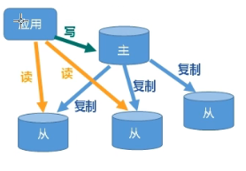
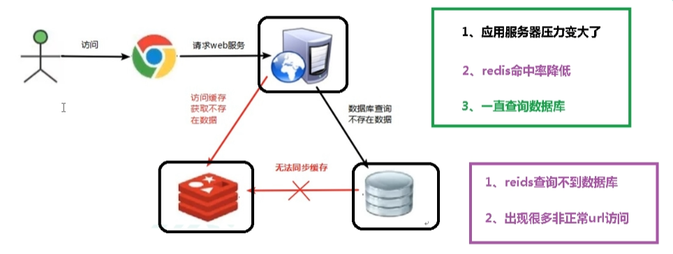
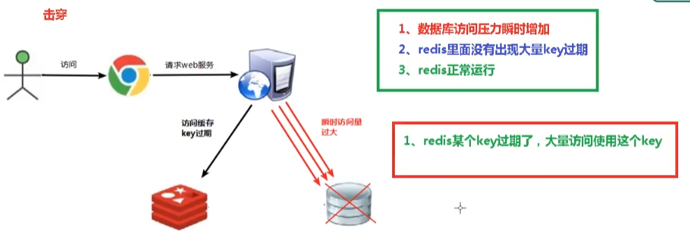
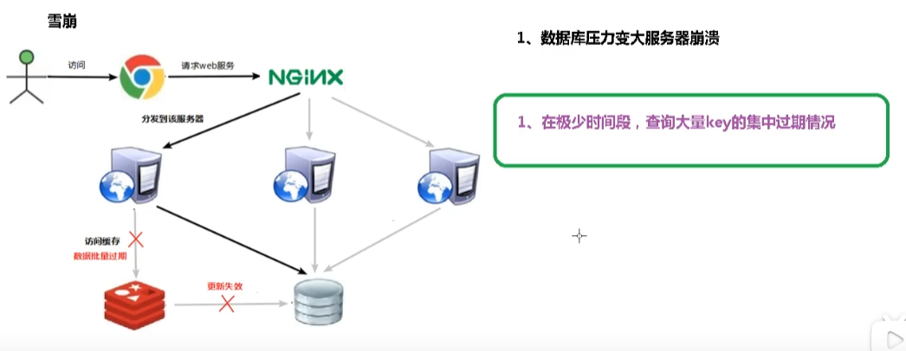
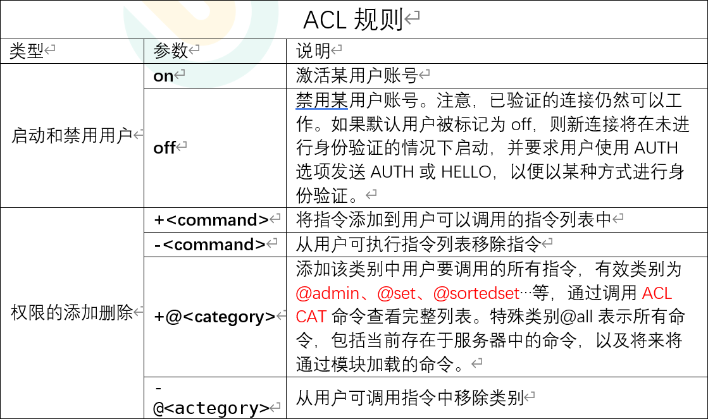
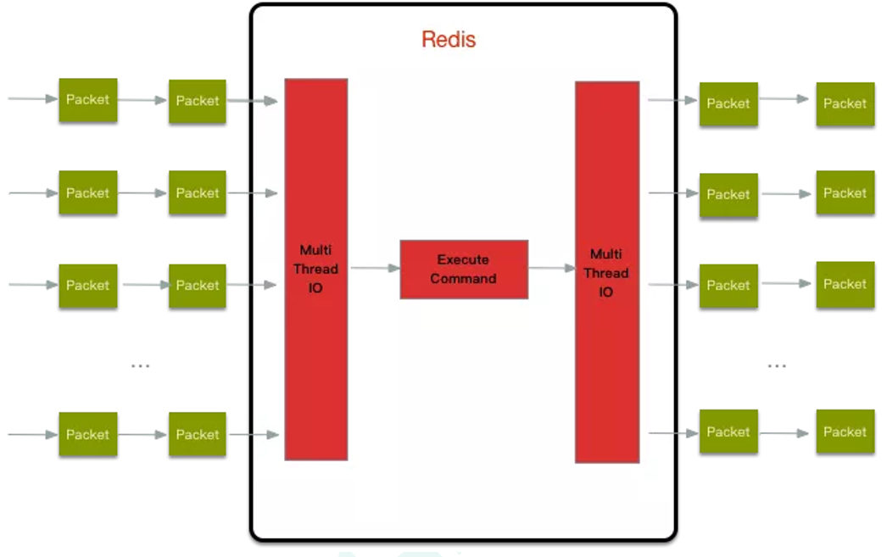

# 安装redis

## 使用环境

CentOS7.6

redis 7.0

## 安装步骤

1. 官网下载redis.tar.gz文件
2. 通过xftp传输文件
3. 将redis文件移动到/opt目录下
4. `tar -xzvf redis文件名`
5. `yum install gcc`安装C语言编译环境
6. 进入redis目录中，`make`编译
7. 编译完成后，使用`make install`完成安装

## 启动方式

* 前台启动（不推荐）

  在/usr/local/bin下使用`redis-server`

* 后台启动（推荐）

  进入/opt中的redis文件中，将redis.conf复制到/etc目录下，`vim /etc/redis.conf`
  ，通过vim指令搜索daemonize，将no改为yes，进入/usr/local/bin中使用`redis-server /etc/redis.conf`

    * 可以通过`redis-cli`对其进行管理
    * 关闭——
        * 可以在redis-cli中使用`shutdown`
        * 可以使用`ps -ef | grep redis`搜索redis使用的端口再使用`kill -9 端口号`关闭

# 常用五大类型数据

## key操作

| 命令                   | 功能                               |
| ---------------------- | ---------------------------------- |
| keys \*                | 查询所有的key                      |
| set 键名称 值          | 添加键值对                         |
| exists 键名称          | 判断键是否存在                     |
| type 键名称            | 返回改键对应的值的类型             |
| del 键名称             | 删除键值对                         |
| unlink 键名称          | 删除键值对，但是通过异步非阻塞删除 |
| expire 键名称 过期时间 | 设置该键值对存在时间（单位s）      |
| ttl 过期时间           | 查看键值对，还能存过的时间         |
| select [0-15]          | 切换数据库                         |
| dbsize                 | 查看当前数据库中的key的数量        |
| flushdb                | 清空当前库                         |
| flushall               | 清空所有的库                       |

## Redis字符串（String）

### 简介

String是Redis最基本的类型，它是二进制安全的。意味着Redis的String可以包含任何数据。比如jpg图片或者是序列化对象。一个Redis字符串value最多可以是512M

### 常用命令

| 命令                              | 功能                                             |
| --------------------------------- | ------------------------------------------------ |
| set 键名称 值                     | 向redis库中添加键值对                            |
| get 键名称                        | 通过键名称获取redis库中的值                      |
| append 键名称 值                  | 将指定的值追加到之前的值的末尾                   |
| strlen 键名称                     | 获取值的长度                                     |
| setnx 键名称 值                   | 只有再key不存在时设置key对应的值                 |
| incr 键名称                       | 将key中储存的数字值增加1                         |
| decr 键名称                       | 将key中储存的数字值减少1                         |
| incrby/decr 键名称 步长           | 将key中储存的数字值增加/减少指定步长             |
| mset 多个键值对                   | 同时设置多个键名称的值                           |
| mget 多个键名称                   | 同时获取多个键名称对应的值                       |
| msetnx 多个键值对                 | 同时设置多个键名称的值（前提是之前键名称不存在） |
| getrange 键名称 开始索引 结束索引 | 获取键名称对应值开始索引到结束索引范围的值       |
| setrange 键名称 开始索引 值       | 在键名称对应的值的开始索引位置添加指定值         |
| setex 键名称 过期时间 值          | 在添加新的键值对时添加过期时间（单位为s）        |
| getset 键名称 值                  | 使用新的值替换键名称对应的旧值                   |

### 数据结构

String的数据结构为简单动态字符串。是可以修改的字符串，内部结构实现类似于Java的ArrayList，采用预分配冗余空间的方式来减少内存的频繁分配问题

## Redis列表（List）

### 简介

单键多值，Redis列表是简单的字符串列表，按照插入顺序排序，你可以添加一个元素到列表的头部或者尾部。它的底层实际是一个双向链表，对两端的操作性能很高，通过索引下标的操作中间的节点的性能较差

### 常用命令

| 命令                            | 功能                                                         |
| ------------------------------- | ------------------------------------------------------------ |
| lpush/rpush 键名称 值1 值2...   | 从左边、右边插入一个或多个值                                 |
| lpop/rpop 键名称                | 从左边、右边吐出一个值                                       |
| rpoplpush 键名称1 键名称2       | 从键1列表右边吐出一个值，插入到键2列表右边                   |
| lrange 键名称 开始索引 结束索引 | 展示键名称对应列表的开始到结束索引中的值（0 -1）表示获取所有 |
| lindex 键名称 索引              | 获取对应索引位置的值                                         |
| llen 键名称                     | 获取列表长度                                                 |
| linsert 键名称 before 值1 值2   | 在值1的后面加上一个值2                                       |
| lrem 键名称 数量 值             | 将对应列表中的指定数量的与指定值相同的键值对删除             |
| iset 键名称 索引 值             | 将列表key下标为index的值替换成指定的值                       |

### 数据结构

首先在列表元素极少的情况下会使用一块连续的内存存储，这个结构是ziplist，也即时压缩列表

它将所有的元素紧挨着一起存储，分配的是一块连续的内存

当元素量比较多的时候才会改成quicklist

因为普通的链表需要的附加指针空间太大，会比较浪费时间

## Redis集合（Set）

### 简介

Redis set对外提供的功能与list类似是一个列表的功能，特殊之处在于set是可以自动排重的，当你需要存储一个列表数据，又不希望出现重复数据时，set是一个很好的选择。

Redis的set时String类型的无序集合，它底层其实是一个value为null的hash表，所以添加、删除、查找都是O(1)

### 常用命令

| 命令                       | 功能                                                         |
| -------------------------- | ------------------------------------------------------------ |
| sadd 键名称 值1 值2 值3... | 将一个或多个member元素加入到集合key中，已经存在的member将被自动忽略 |
<<<<<<< HEAD
| smember 键名称             | 去除该集合中所有的值                                         |
=======
<<<<<<< HEAD
| smember 键名称             | 去除该集合中所有的值                                         |
=======
| smember 键名称             | 查看集合中所有值                                             |
>>>>>>> b7a0c11 ()
>>>>>>> e11d919 ()
| sismember 键名称 值        | 判断与键名称的集合是否含有该值                               |
| scard 键名称               | 返回该集合的元素个数                                         |
| srem 键名称 值1 值2        | 删除集合中某个元素                                           |
| spop 键名称                | 随机从该集合中吐出一个值                                     |
| srandmember 键名称 数量    | 随机从该集合中取出n个值，不会从集合中删除                    |
| smove 键名称1 键名称2 值   | 将集合中一个值从一个集合移动到另一个集合中                   |
| sinter 键名称1 键名称2     | 返回两个集合的交集元素                                       |
| sunion 键名称1 键名称2     | 返回两个集合的并集元素                                       |
| sdiff 键名称1 键名称2      | 返回两个集合的差集元素（key1中有，key2中没有）               |

### 数据结构

Set数据结构是dict字典，字典是用哈希表实现的

## Redis哈希（Hash）

### 简介

Redis Hash是一个String类型的field和value的映射表，hash特别适合用于存储对象吗，类似于java里面的Map<String, Object>

通过key（用户ID）+field（属性标签）就可以操作对应属性数据了， 既不需要重复存储数据，也不会带来序列化和并发修改控制的问题

### 常用命令

| 命令                                     | 功能                                                       |
| ---------------------------------------- | ---------------------------------------------------------- |
| hset key field value                     | 给key集合中的field键赋值value                              |
| hget key field                           | 从key集合field取出value                                    |
| hmset key filed1 value1 filed2 value2... | 批量设置hash的值                                           |
| hexists key1 field                       | 查看哈希表k中，给定域field是否存在                         |
| hkeys key                                | 列出该hash集合的所有field                                  |
| hvals key                                | 列出该hash集合的所有value                                  |
| hincrby key field increment              | 为哈希表key中的域field的值上加上增量                       |
| hsetnx key field value                   | 将哈希表key中的域field的值设置为value，当且仅当field不存在 |

### 数据结构

Hash类型对应的数据结构有两种：ziplist（压缩列表），hashtable（哈希表）。当field-value长度较短且个数较少时，使用ziplist，否则使用hashtable

## Redis有序集合（ZSet）

Redis有序集合zset与普通集合set非常相似，是一个没有重复元素的字符串集合

不同之处是有序集合的每个成员都关联了一个评分，这个评分被来按照从最低分到最高分的方式排序集合中的成员。**集合的成员是唯一的，但是评分可以是重复的**

因为元素有序，所以你也可以很快的根据评分或者次序来获取一个范围的元素

访问有序集合的中间元素也是非常快的，因此你能够使用有序集合作为一个没有重复成员的智能链表

### 常用命令

| 命令                                                         | 功能                                                         |
| ------------------------------------------------------------ | ------------------------------------------------------------ |
| zadd key score1 value1 score2 value2                         | 将一个或多个member元素及其score值加入有序集合key中           |
| zrange key start stop [withscores]                           | 返回有序集合key中，下标在start到stop之间的元素，加上【..】可以让分数一起和值返回到结果集中 |
| zrangebyscore key minmax  [withscores] [limit offset count]  | 返回有续集key中，所有score值介于min和max之间（包含min和max）的成员 |
| zrevrangebyscore key maxmin [withscores] [limit offset count] | 同上改为从大到小排序                                         |
| zincrby key increment value                                  | 为元素的score增加值                                          |
| zrem key value                                               | 删除该集合下的指定值的元素                                   |
| zcount key min max                                           | 统计该集合，指定值的元素                                     |
| zrank key value                                              | 返回该值在集合中的排名，从0开始                              |

### 数据结构

* hash，hash的作用就是关联数据value和权重score，保障元素value的唯一性，可以通过元素value找到相应的score
* 跳跃表，跳跃表的目的在于给元素value排序，根据score的范围获取元素列表

# 配置文件详解

略

# 发布和订阅

Redis发布订阅（pub/sub）是一种消息通信模式：发送者（pub）发送消息，订阅者（sub）接受消息

Redis客户端可以订阅任意数量的频道

**订阅指令**`SUBSCRIBE channel1`

**发布指令**`push channel1 message`

# 新数据类型

## Bitmaps

### 简介

Redis提供了Bitmaps这个给”数据类型“可以实现对位的操作

1. Bitmaps本身不是一种数据类型，实际上它就是字符串（key-value），但是它可以对字符串的位进行操作
2. Bitmaps单独提供了一套指令，所以在Redis中使用Bitmaps和使用字符串的方法不太相同。可以把Bitmaps想象成一个以位为单位的数组，数组的每个单位只能存储0和1，数组的下标在Bitmaps中叫做偏移量

### 常用命令

| 命令                                   | 功能                                                         |
| -------------------------------------- | ------------------------------------------------------------ |
| setbit key offset value                | 设置Bitmaps中某个偏移量的值（0或1）                          |
| getbit key offset                      | 获取对应偏移量的值                                           |
| bitcount key start end                 | 统计字符串从start到end中比特值位1的数量                      |
| bitop and(or/not/xor) destkey [key...] | 符合操作，可以做多个bitmaps的交集、并集、非、异或操作并将结果保存在destkey中 |

## HyperLogLog

用户求基数的操作

* `pfadd key vlaue1 value2 value3`

  将所有元素添加到指定HyperLogLog数据结构中，如果执行命令后，HLL估计近似技术发生变化，则返回1，否则返回0

* `pfcount key`

  计算HLL的近似基数，基数数量

* `pfmerge destkey sourcekey [sourcekey ...]`

  将一个或多个HLL合并后的结果存储在另一个HLL中

## Geospatial

* `geoadd key 经度 维度 地名`
* `geopos key 地名`
* `geodis key memer1 member2 [m|km|ft|mi]`获取两个位置之间 的直线距离
* `georadius key longitude latitude radius m|km|ft|mi`以给定的经纬度为中心，找出某一半径内的元素
* `georadiusbymember key 地名 范围 [m|km|ft|mi]`
* `geohash key diming`
# Jedis操作Redis

1. 引入依赖

   ```xml
           <dependency>
               <groupId>redis.clients</groupId>
               <artifactId>jedis</artifactId>
               <version>4.2.2</version>
           </dependency>
   ```

2. 测试方法

   ```java
   public class JedisDemo1 {
       public static void main(String[] args) {
           Jedis jedis = new Jedis("192.168.187.129", 6379);
           System.out.println(jedis.ping());
       }
   
       @Test
       public void demo1() {
           Jedis jedis = new Jedis("192.168.187.129", 6379);
           Set<String> keys = jedis.keys("*");
           for (String key : keys) {
               System.out.println(key);
           }
       }
   
       @Test
       public void demo2() {
           Jedis jedis = new Jedis("192.168.187.129", 6379);
           jedis.set("name", "lucy");
           System.out.println(jedis.get("name"));
       }
   
       @Test
       public void demo3() {
           Jedis jedis = new Jedis("192.168.187.129", 6379);
           jedis.mset("k1", "v1", "k2", "v2");
           List<String> mget = jedis.mget("k1", "k2");
           System.out.println(mget);
       }
   
       @Test
       public void demo4() {
           Jedis jedis = new Jedis("192.168.187.129", 6379);
           jedis.lpush("key1", "1ucy", "lucy", "mary");
           List<String> key1 = jedis.lrange("key1", 0, -1);
           System.out.println(key1);
       }
   
       @Test
       public void demo5() {
           Jedis jedis = new Jedis("192.168.187.129", 6379);
           jedis.sadd("names", "lucy");
           jedis.sadd("names", "jack");
           System.out.println(jedis.smembers("names"));
       }
   
       @Test
       public void demo6() {
           Jedis jedis = new Jedis("192.168.187.129", 6379);
           jedis.hset("users", "age", "20");
           System.out.println(jedis.hget("users", "age"));
       }
   
       @Test
       public void demo7() {
           Jedis jedis = new Jedis("192.168.187.129", 6379);
           jedis.zadd("china", 100d, "shanghai");
           System.out.println(jedis.zrange("china", 0, -1));
       }
   }
   ```

   ## 发送手机验证码案例

```java
public class PhoneCode {
    public static void main(String[] args) {
        verifyCode("112");

//        getRedisCode("112", "580962");
    }

    // 生成6位数字
    public static String getCode() {
        Random random = new Random();
        StringBuffer sb = new StringBuffer();
        for (int i = 0; i < 6; ++i) {
            sb.append(random.nextInt(10));
        }
        return sb.toString();
    }

    // 每个手机每天只能发送三次，验证吗放到redis中，设置过期时间
    public static void verifyCode(String phone) {
        // 连接redis
        Jedis jedis = new Jedis("192.168.187.129", 6379);

        // 手机发送次数key
        String countKey = "VerifyCode" + phone + ":count";
        // 验证码key
        String codeKey = "VerifyCode" + phone + ":code";

        // 每个手机每天只能发送三次
        String count = jedis.get(countKey);
        if (count == null) {
            jedis.setex(countKey, 24*60*60, "1");
        } else if (Integer.parseInt(count) <= 2) {
            jedis.incr(countKey);
        } else {
            System.out.println("今天发送次数超过三次不能继续发送");
            jedis.close();
            return;
        }

        // 发送他验证码到redis中
        String vcode = getCode();
        jedis.setex(codeKey, 120, vcode);
        jedis.close();
    }

    // 验证吗校验
    public static void getRedisCode(String phone, String code) {
        Jedis jedis = new Jedis("192.168.187.129", 6379);
        String codeKey = "VerifyCode" + phone + ":code";
        String redisCode = jedis.get(codeKey);
        if (redisCode.equals(code)) {
            System.out.println("成功");
        } else {
            System.out.println("失败");
        }
        jedis.close();
    }
}
```

# Redis事务操作

Redis事务是一个单独的隔离操作：事务中的所有命令都会序列化、按顺序地执行。事务在执行的过程中，不会被其他客户端发送来的命令请求打断。

Redis事务的主要作用就是串联多个命令防止别的命令插队

## Multi、Exec、discard

从输入Multi命令开始，输入的命令都会一次进入命令队列中，但不会执行，直到输入Exec后，Redis会将之前的命令队列中的命令一次执行

组队的过程中可以通过discard来放弃组队

**组队中有错误，不会执行**

**组队中没有错误，执行中出错，那么有错的不会执行，没有错的没有影响**

* 乐观锁

  乐观锁适用于多读的应用类型，这样可以提高吞吐量。Redis就是里哟能够这种check-and-set机制实现事务

* 悲观锁

  传统的关系型数据库就用到了很多这种锁机制

## Watch

在执行multi之前，先执行watch key1 [key2]，可以监视一个（或多个）key，如果在事务执行之前这个（或这些）key被其他命令所改动，那么事务将被打断

## Redis事务三特性

* 单独的隔离操作

  事务中的所有命令都会序列化、按顺序地执行。事务在执行的过程中，不会被其他客户端发送来的命令请求所打断

* 没有隔离级别的概念

  队列中的命令没有提交之前都不会实际被执行，因为事务提交前任何命令都不会被实际执行

* 不保证原子性

  事务中如果有一条命令执行失败，气候的命令仍旧会被执行，没有回滚

## 秒杀案例

> 通过ad测试
>
> 1. 下载工具
     >
     >    `yum install httpd-tools`
>
> 2. 模拟表单数据提交参数，以&符号结尾
>
> 3. 使用ad工具模拟
     >
     >    `ab -n 1000 -c 100 -p postfile -T 'application/x-www-form-urlencoded‘ http://192.168.140.1:8080/seckill/doseckill`

### 核心代码

```java
public class SecKill_redis {

	public static void main(String[] args) {
		Jedis jedis =new Jedis("192.168.44.168",6379);
		System.out.println(jedis.ping());
		jedis.close();
	}

	//秒杀过程
	public static boolean doSecKill(String uid,String prodid) throws IOException {
		//1 uid和prodid非空判断
		if(uid == null || prodid == null) {
			return false;
		}

		//2 连接redis
		//Jedis jedis = new Jedis("192.168.44.168",6379);
		//通过连接池得到jedis对象
		JedisPool jedisPoolInstance = JedisPoolUtil.getJedisPoolInstance();
		Jedis jedis = jedisPoolInstance.getResource();

		//3 拼接key
		// 3.1 库存key
		String kcKey = "sk:"+prodid+":qt";
		// 3.2 秒杀成功用户key
		String userKey = "sk:"+prodid+":user";

		//监视库存
		jedis.watch(kcKey);

		//4 获取库存，如果库存null，秒杀还没有开始
		String kc = jedis.get(kcKey);
		if(kc == null) {
			System.out.println("秒杀还没有开始，请等待");
			jedis.close();
			return false;
		}

		// 5 判断用户是否重复秒杀操作
		if(jedis.sismember(userKey, uid)) {
			System.out.println("已经秒杀成功了，不能重复秒杀");
			jedis.close();
			return false;
		}

		//6 判断如果商品数量，库存数量小于1，秒杀结束
		if(Integer.parseInt(kc)<=0) {
			System.out.println("秒杀已经结束了");
			jedis.close();
			return false;
		}

		//7 秒杀过程
		//使用事务
		Transaction multi = jedis.multi();

		//组队操作
		multi.decr(kcKey);
		multi.sadd(userKey,uid);

		//执行
		List<Object> results = multi.exec();

		if(results == null || results.size()==0) {
			System.out.println("秒杀失败了....");
			jedis.close();
			return false;
		}

		//7.1 库存-1
		//jedis.decr(kcKey);
		//7.2 把秒杀成功用户添加清单里面
		//jedis.sadd(userKey,uid);

		System.out.println("秒杀成功了..");
		jedis.close();
		return true;
	}
}
```

### 连接超时问题

解决方法——连接池

节省每次链接redis服务带来的消耗，把连接好的实例反复利用

通过参数管理连接的行为

```java
public class JedisPoolUtil {
	private static volatile JedisPool jedisPool = null;

	private JedisPoolUtil() {
	}

	public static JedisPool getJedisPoolInstance() {
		if (null == jedisPool) {
			synchronized (JedisPoolUtil.class) {
				if (null == jedisPool) {
					JedisPoolConfig poolConfig = new JedisPoolConfig();
					poolConfig.setMaxTotal(200);
					poolConfig.setMaxIdle(32);
					poolConfig.setMaxWaitMillis(100*1000);
					poolConfig.setBlockWhenExhausted(true);
					poolConfig.setTestOnBorrow(true);  // ping  PONG
				 
					jedisPool = new JedisPool(poolConfig, "192.168.44.168", 6379, 60000 );
				}
			}
		}
		return jedisPool;
	}

	public static void release(JedisPool jedisPool, Jedis jedis) {
		if (null != jedis) {
			jedisPool.returnResource(jedis);
		}
	}

}
```

连接池参数

* MaxTotal：控制一个pool可分配多少个jedis实例，通过pool.getResource()来获取看，如果复制唯一，则表示不限制，如果pool已经分配了MaxTotal个jedis实例，则此时pool的状态为exhausted
* MaxIdle：控制一个pool最多有多少个状态为idel（空闲）的jedis实例
* MaxWaitMillis：表示当borrow一个jedis实例时，最大的等待毫秒数，如果超过等待时间，则直接抛出JedisConnectionException

### 超卖问题

使用乐观锁

```java
		//监视库存
		jedis.watch(kcKey);

		//7 秒杀过程
		//使用事务
		Transaction multi = jedis.multi();

		//组队操作
		multi.decr(kcKey);
		multi.sadd(userKey,uid);

		//执行
		List<Object> results = multi.exec();

		if(results == null || results.size()==0) {
			System.out.println("秒杀失败了....");
			jedis.close();
			return false;
		}
```

### 库存遗留

使用lua脚本语言解决库存遗留问题

```java
public class SecKill_redisByScript {
	
	private static final  org.slf4j.Logger logger =LoggerFactory.getLogger(SecKill_redisByScript.class) ;

	public static void main(String[] args) {
		JedisPool jedispool =  JedisPoolUtil.getJedisPoolInstance();
 
		Jedis jedis=jedispool.getResource();
		System.out.println(jedis.ping());
		
		Set<HostAndPort> set=new HashSet<HostAndPort>();

	//	doSecKill("201","sk:0101");
	}
	
	static String secKillScript ="local userid=KEYS[1];\r\n" + 
			"local prodid=KEYS[2];\r\n" + 
			"local qtkey='sk:'..prodid..\":qt\";\r\n" + 
			"local usersKey='sk:'..prodid..\":usr\";\r\n" + 
			"local userExists=redis.call(\"sismember\",usersKey,userid);\r\n" + 
			"if tonumber(userExists)==1 then \r\n" + 
			"   return 2;\r\n" + 
			"end\r\n" + 
			"local num= redis.call(\"get\" ,qtkey);\r\n" + 
			"if tonumber(num)<=0 then \r\n" + 
			"   return 0;\r\n" + 
			"else \r\n" + 
			"   redis.call(\"decr\",qtkey);\r\n" + 
			"   redis.call(\"sadd\",usersKey,userid);\r\n" + 
			"end\r\n" + 
			"return 1" ;
			 
	static String secKillScript2 = 
			"local userExists=redis.call(\"sismember\",\"{sk}:0101:usr\",userid);\r\n" +
			" return 1";

	public static boolean doSecKill(String uid,String prodid) throws IOException {

		JedisPool jedispool =  JedisPoolUtil.getJedisPoolInstance();
		Jedis jedis=jedispool.getResource();

		 //String sha1=  .secKillScript;
		String sha1=  jedis.scriptLoad(secKillScript);
		Object result= jedis.evalsha(sha1, 2, uid,prodid);

		  String reString=String.valueOf(result);
		if ("0".equals( reString )  ) {
			System.err.println("已抢空！！");
		}else if("1".equals( reString )  )  {
			System.out.println("抢购成功！！！！");
		}else if("2".equals( reString )  )  {
			System.err.println("该用户已抢过！！");
		}else{
			System.err.println("抢购异常！！");
		}
		jedis.close();
		return true;
	}
}
```

# Reids持久化操作

## RDB

1. RDB简介

   在指定的时间间隔内将内存中的数据集快照写入磁盘，也就是行话讲的Snapshot快照，他恢复时将快照文件直接读到内存中

2. 如何进行持久化

   Redis会单独创建（fork）一个子进程来进行持久化，会先将数据写入到一个临时文件中，待持久化过程都结束了，再用这个临时文件替换上次持久化好的文件。整个过程中，主进程时不进行任何IO操作的，这就保证了极高的性能如果需要进行大规模数据的恢复，且对于数据恢复的完整性不是非常敏感，那RDB方式要比AOF方式更加有效。**
   RDB缺点是最后一次持久化后的数据可能丢失**

3. Fork

   Fork的作用是复制一个与当前进程一样的进程。新进程的所有数据（变量、环境变量、程序计数器等）数值都和原进程一致，但是是一个全新的进程，并作为原进程的子进程

   在Linux程序中，fork()会产生一个和父进程完全相同的子进程，但子进程在此后多会exec系统调用，出于效率考虑，Linux中引入了“**写时复制技术**”

   **一般情况父进程和子进程会共用同一段物理内存**，只有进程空间的各段的内容要发生变化时，才会将父进程的内容复制一份给子进程

4. 优势

    * 适合大规模的数据恢复
    * 对数据完整性和一致性要求不高更适合使用
    * 节省磁盘空间
    * 恢复速度快

5. 劣势

    * fork的时候，内存中的数据被克隆了一份，大概2倍的膨胀性需要考虑
    * 虽然Redis在fork时使用了写时拷贝技术，但是如果数据庞大时还是比较消耗性能
    * 在备份周期在一定间隔时间做一次备份，所以如果Redis意外down掉的话，就会丢失最后一次快照后的所有修改

## AOF

1. AOF简介

   **以日志的形式来记录每个写操作（增量保存）**
   ，将Redis执行过的所有写指令记录下来（读操作不记录），只许追加文件但不可以改写文件，reids启动之初会读取该文件重新构建数据，换言之，redis重启的话就根据日志文件的内容将写指令之前到后执行一次以完成数据的恢复工作

2. AOF持久化流程

    1. 客户端的请求写命令会被append追加到AOF缓冲区内
    2. AOF缓冲区根据AOF持久化策略[always,everysec,no]将操作sync同步到磁盘AOF文件中
    3. AOF文件大小超过重写策略或手动重写时，会对AOF文件rewrite重写，压缩AOF文件含量
    4. Redis服务重启时，会重新load加载AOF文件中的写操作达到数据恢复的目的

3. AOF默认不开启

   可以在redis.conf中配置文件名称，默认为appendonly.aof

   AOF文件的保存路径同RDB的路径一致

4. AOF和RDB同时开启

   AOF和RDB同时开启，系统默认取AOF的数据（数据不会存在丢失）

5. AOF启动/修复/恢复

   AOF的备份机制和性能虽然和RDB不同，但是备份的恢复的操作同RDB一样，都是拷贝备份文件，需要恢复时在拷贝到Redis工作目录下，启动系统即加载

   正常恢复：

    * 修改默认的appendonly no，改为yes
    * 将有数据的aof文件复制一份保存到对应目录
    * 恢复：重启redis然后重新加载

   异常恢复：

    * 修改默认的appendonly no 改为yes
    * 如遇到AOF文件损坏，通过/usr/local/bin/redis-check-aof--fix-appendonly.aof进行恢复
    * 备份被写坏的AOF文件
    * 恢复：重启redis，然后重新加载

6. AOF同步频率设置

   appendfsync always

   始终同步，每次redis的写入都会立刻记入日志；性能较差但数据完整性较好

   appendfsync everysec

   每秒同步，每秒计入日志一次，如果宕机，本秒的数据可能丢失

   appendfsync no

   redis不要主动进行同步，把同步时机交给操作系统

7. 优势

    * 备份机制更稳健，第十数据概率低
    * 可读的日志文本，通过操作AOF稳健，可以处理误操作

8. 劣势

    * 比起RDB占用更多的磁盘空间
    * 恢复备份速度要慢
    * 每次读写都同步的话，有一定的性能压力
    * 存在个别Bug，造成恢复不能

## 总结

* 官方推荐两个都启用
* 如果对数据不敏感，可以选单独使用RDB
* 不建议单独使用AOF，因为可能出现bug
* 如果只是做纯内存缓存，可以都不用

# 主从复制



## 简介

* 读写分离，性能扩展
* 容灾的快速恢复

## 搭建一主多从

1. 创建/myredis文件夹

2. 复制redis.conf配置文件到文件夹中

3. 配置一主两从，创建三个配置文件

4. 填写配置内容

   ```
   include /myredis/redis.conf
   pidfile /var/run/redis_6379.pid
   port 6379
   dbfilename dump6379.rdb
   ```

   appendonly 改为no

5. 启动三个redis服务

   查看当前主机运行情况

   在从机上执行`slaveof 主机ip 端口号`

## 常用三招

### 一主两从

* 从服务器如果挂掉了，那么重启后需要重新将其，设置为从服务器，设置为从服务器后，它自动的将主服务器中的数据复制到从服务器中
* 主服务器挂掉后，从服务器依旧是从服务器，而当主服务器重启后，仍旧是主服务器

### 薪火相传


### 反客为主

* 当主服务器挂掉之后，使用指令`slaveof no one`即可将从服务器改为主服务器

## 复制原理

1. 当从连接上主服务器后，从服务器向主服务器发送进行数据同步的消息
2. 主服务器街道从服务器发送过来的同步消息后，把主服务器数据进行持久化，rdb文件，把rdb文件发送从服务器，从服务器拿到rdb进行读取
3. 每次主服务器进行写操作之后，和从服务器进行数据同步

## 哨兵模式

* 反客为主的自动版，能够后台监控主机是否故障，如果故障了根据投票数自动嫁给你从库转换为主库

### 创建步骤

1. 创建哨兵配置文件sentinel.conf文件，**名字不能出错**

2. 配置哨兵，填写配置内容

   `sentinel monitor mymaster 127.0.0.1 6379 1`

   其中mymaster为监控对象起的服务器名称，1为至少有多少个哨兵同意迁移的数量

3. 启动哨兵

   `redis-sentinel sentinel.conf`

### 原理

* 新王登基——从下线的主服务的所有从服务里面挑选一个从服务，将其转成主服务

  选择条件——

    1. 选择优先级靠前的
    2. 选择偏移量最大的
    3. 选择runid最小的从服务

  优先级在redis.conf中默认：replica-priority 100，值越小优先级越高

  偏移量是指获得主机数据最全的

  每个redis实例启动后都会随机生成一个40位的runid

* 群仆俯首——挑选出新的主服务之后sentinel向援助服务的从服务发送slaveof新主服务的命令，复制新master

* 旧主俯首

  当已下线的服务重新上线，sentinel会向其发送slaveof命令，让其成为新主的从服务

# 集群


## 集群介绍

Rdis集群实现了对Redis的水平扩容，即启动N个redis节点，将整个数据库分布存储在这N个节点中，每个节点存储总数居的1 / N

Redis集群通过分区（partition）来提供一定程度的可用性：及时集群中有一部分节点失效或者无法进行通讯，集群也可以继续处理命令请求

## 创建集群

1. 配置基本信息

   ```java
   include /myredis/redis.conf
   pidfile "/var/run/redis_6379.pid"
   port 6379
   dbfilename "dump6379.rdb"
   ```

2. redis cluster 配置修改

   ```
   cluster-enabled yes 打开集群模式
   cluster-config-file nodes-6379.conf 设置节点配置文件名
   cluster-node-timeout 15000 设置节点失联时间，超过该时间（毫秒），集群自动进行主从切换
   ```

3. 将六个节点合成一个集群

   组合之前，需要确保所有redis实例启动后，nodes-xxxx.conf文件都生成正常

   `redis-cli --cluster create --cluster-replicas 1 192.168.187.131:6379 192.168.187.131:6380 192.168.187.131:6381 192.168.187.131:6389 192.168.187.131:6390 192.168.187.131:6391`
   启动集群模式**只能使用ip地址不能使用127.0.0.1**

## 如何分配六个节点

一个集群至少需要三个主节点

选项 `--cluster-replicas 1`表示我们希望为集群中的每个主节点创建一个从节点

分配原则尽量保证每个主数据库运行在不同的IP地址，每个从库和主库不在一个IP地址上

## Slots

> [OK] All nodes agree about slots configuration.
>
> Check for open slots...
>
> Check slots coverage...
>
> [OK] All 16384 slots covered.

一个Redis集群包含16284个插槽（hash slot），数据库中的每个键都属于这16384个插槽的其中一个

集群使用公式`CRC6(kee) % 16384`来计算键key属于哪个槽，其中`CRC16(key)`语句用于计算键key的CRC16校验和

**向集群中加入多个值——`mset name{user} lucy age{user} 20`**

| 命令                           | 功能                       |
| ------------------------------ | -------------------------- |
| cluster keyslot cust           | 返回该服务器中有多少个插槽 |
| cluster countkeysinslot xxx    | 返回对应插槽中有多少键     |
| cluster getkeysinslot xxxx xxx | 返回对应插槽中指定数量的键 |

## 故障恢复

类似于哨兵模式，主机挂掉后，推举新的从机成为主机，主机恢复后会成为新主机的从机

如果某一段插槽的主从都挂掉，而cluster-require-full-coverage为yes，那么，整个集群都挂掉

如果某一段插槽的主从都挂掉，而cluster-require-full-coverage为no，那么，该插槽数据全都不能使用，也无法存储

### 集群的Jedis开发

```java
public class JedisClusterTest {
    public static void main(String[] arg) {
        Set<HostAndPort> set = new HashSet<>();
        set.add(new HostAndPort("192.168.187.211", 6379));
        JedisCluster jedisCluster = new JedisCluster(set);
        jedisCluster.set("k1", "v1");
        System.out.println(jedisCluster.get("k1"));
    }
}
```

## 集群的优势

* 实现扩容
* 分摊压力
* 无中心配置相对简单

## 集群的不足

多键操作是不被支持的

多键的Redis事务是不被支持的。lua脚本不被支持

由于集群方案出现较晚，很多公司已经采用了其他的集群方案，而代理或者客户端分片的方案想要迁移到redis cluster，需要整体迁移而不是逐步过渡，复杂度较大

# Redis应用问题解决

## 缓存穿透



**一般是有黑客恶意攻击**

一个一定不能存在缓存及查询不到的数据，由于缓存时不命中时被动写的，并且处于容错考虑，如果存储层查询不到数据则不写入缓存，浙江导致这个不存在的数据每次请求都要到存储层查询，失去了缓存的意义

**解决方法**

1. **对空值缓存**：如果一个查询返回的数据为空（不管是数据是否不存在），我们仍然把这个空结果进行缓存，设置空结果的过期时间会很短，最长不超过五分钟
2. **设置可访问白名单**：使用bitmaps类型定义一个可以访问的名单，名单id作为bitmaps的偏移量，每次访问和bitmap里的id进行比较，如果访问id不在bitmaps中，进行拦截不允许访问
3. **采用布隆过滤器**：它实际上是一个很长的二进制向量（位图）和一些列随机映射函数（哈希函数）
4. **进行实时监控**：当发现Redis的命中率开始急速降低，需要排查访问对象和访问数据，和运维人员配合，可以设置黑名单限制服务

## 缓存击穿



key可能会在某个时间点被超高并发地访问，是一种非常”热点“的数据。这个时候，需要考虑一个问题：缓存被击穿的问题

**解决方法**

1. 预先设置热门数据：在Redis高峰访问之前，把一些热门数据提前存入到redis里面，加大这些热门数据key的时长
2. 实时调整：现场监控哪些数据热门，实时调整key的过期时长
3. 使用锁：
    1. 就是在缓存失效的时候（判断拿出来的值为空），不是立即去load db
    2. 先使用缓存工具的某些带成功操作的返回值的操作（比如Redis的SETNX）去set一个mutex key
    3. 当操作返回成功时，再进行load db的操作，并回设缓存，最后删除mutex key
    4. 当操作失败，证明有线程再load db，当前线程睡眠一段时间再重试整个get缓存的方法

## 缓存雪崩



key对应的数据存在，但是再redis中过期，此时若有大量的请求过来，这些请求发现缓存过期一般都会从后端DB加载数据并回设到缓存，这个时候大并发的请求可能会瞬间把后端DB压垮

**缓存雪崩和缓存击穿的区别在于这里针对很多key缓存，前者则是某个key**

**解决方案**

1. 构建多级缓存架构：nginx缓存+redis缓存+其他缓存

2. 使用锁或者队列：

   用加锁或者队列的方式保证不会有大量的线程对数据库一次性进行读写，从而避免失效时大量的并发请求落到底层存储系统中。不适用高并发的情况

3. 设置过期标志更新缓存

   记录缓存数据是否过期（设置提前量），如果过期会出发通知另外的线程再后台去更新实际key的缓存

4. 将缓存失效时间分散开

   比如我们可以再原有的失效时间基础上增加一个随机值，这样每一个缓存的过期时间的重复率就会降低，就很难引发集体失效的时间

## 分布式锁

分布式架构的出现，使得单体锁不能够满足需求。为了解决这个问题就需要一种跨JVM的互斥机制来控制共享资源的访问，这就是分布式锁要解决的问题

### 设置锁的过期时间

使用setnx上锁，通过del释放锁

`setnx users 10 `设置key过期时间，自动释放

上锁后突然出现异常——上锁的同时设置过期时间

### 设置uuid防止误删

1. 通过uuid来标识不同的操作
2. 释放锁的时候，首先判断当前uuid和要释放锁的uuid是否一样

### 使用LUA保证删除的原子性

不懂

# Redis6.0新功能

## ACL

Redis ACL是Access Control List（访问控制列表）的缩写，该功能允许根据可以执行的命令和可以访问的键来限制某些连接

在Redis5之前，Redsi安全规则只有密码控制还有通过rename来调整高危命令。Redis6则提供了ACL的功能对用户进行更细粒度的权限控制

1. 接入权限：用户名和密码
2. 可以执行的命令
3. 可以操作的key

### 命令

1.

| 命令       | 功能             |
| ---------- | ---------------- |
| `acl list` | 展示用户权限列表 |


2.

| 命令             | 功能                               |
| ---------------- | ---------------------------------- |
| `acl cat`        | 查看添加权限指令类别               |
| `acl cat string` | 加参数类型名可以查看类型下具体命令 |
| `acl whoami`     | 查看当前用户                       |

3.




* 设置用户默认权限

  `acl setuser user1`

* 设置用户的用户名、密码、ACL权限、启动用户

  `acl setuser user2 on >password ~cached:* +get`

* 切换用户

  `auth user2 password`

## IO多线程

IO多线程其实指**客户端交互部分**的**网络IO**交互处理模块**多线程**，而非**执行命令多线程**。Redis6执行命令依然是单线程

**原理架构**

Redis 6 加入多线程,但跟 Memcached 这种从 IO处理到数据访问多线程的实现模式有些差异。Redis
的多线程部分只是用来处理网络数据的读写和协议解析，执行命令仍然是单线程。之所以这么设计是不想因为多线程而变得复杂，需要去控制 key、lua、事务，LPUSH/LPOP 等等的并发问题。整体的设计大体如下:



### 开启IO多线程

**默认情况IO多线程是不开启的**

`io-threads-do-reads yes`

`io-threads 4`

## Cluster工具支持

略
