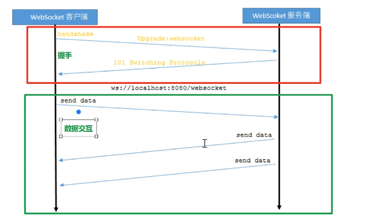
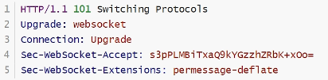

# WebSocket介绍

WebSocket是一种网络通信协议。RFC6455定义了它的通信标准

WebSocket是HTML5开始提供的一种在单个TCP连接上进行全双工通讯的协议

HTTP协议是一种无状态的、无连接的、单向的应用层协议。它采用了请求/响应模型。通信请求只能由客户端发起，服务端对请求做出应答处理。

这种通信模型有一个弊端：HTTP协议无法实现服务器主动向客户端发起消息

这种单向请求的特点，注定了如果服务器由连续的状态变化，客户端要获知就非常麻烦。大多数Web应用程序将通过频繁的异步AJAX请求实现长轮询。轮询的效率低，非常浪费资源（因此必须不停连接，或者HTTP连接始终打开）



# WebSocket协议

本协议由两部分：握手和数据传输

握手时基于http协议的




| 头名称                    | 说明                                                         |
| ------------------------- | ------------------------------------------------------------ |
| Connection: Upgrade       | 标识该Http请求是一个协议升级请求                             |
| Upgrade: WebSocket        | 协议升级为WebSocket协议                                      |
| Sec-WebSocket-Version: 13 | 客户端支持webSocket的版本                                    |
| Sec-WebSocket-key：       | 客户端次啊用base64编码的24位随机字符序列，服务器接受客户端HTTP协议升级的证明。要求服务端响应一个对应加密的Sec-WebSocket-Accept头信息作为应答 |
| Sec-WebSocket-Extensions  | 协议扩展类型                                                 |

# 客户端（浏览器）实现

## websocket对象

实现WebSocket的Web浏览器通过WebSocket对象公开所有必需的客户端功能（主要指支持Html5的浏览器）

`var ws = new WebSocket(url);`

> 参数url格式说明：ws://ip地址:端口号/资源名称

## WebSocket事件

| 事件    | 事件处理程序            | 描述                       |
| ------- | ----------------------- | -------------------------- |
| open    | WebSocket对象.onopen    | 连接建立时出发             |
| message | WebSocket对象.onmessage | 客户端接收服务端数据时触发 |
| error   | WebSocket对象.onerror   | 通信发生错误时触发         |
| close   | WebSocket对象.onclose   | 连接关闭时触发             |

## WebSocket方法

| 方法   | 描述             |
| ------ | ---------------- |
| send() | 使用连接发送数据 |

# 服务端实现

Tomcat的7.0.5版本开始支持WebSocket，并且实现了Java WebSocket规范（JSR356）

Java WebSocket应用由一系列的WebSocketEndpoint组成。Endipoint是一个java对象，代表WebSocket链接的一端，对于我们可以通过两种方式定义Endpoint

* 第一种是编程式，即继承类javax.websocket.Endpoint并实现其方法
* 第二种是注解式，即定义一个POJO，并添加@ServerEndpoint相关注解

Endpoint实例在WebSocket握手时创建，并且在客户端于服务端链接过程中有效，最后在链接关闭时结束。在EndPoint接口中明确定义了与其声明周期相关的方法，规范实现者确保生命周期的各个阶段调用实例相关方法。

| 方法    | 含义秒速                                                     | 注解     |
| ------- | ------------------------------------------------------------ | -------- |
| onClose | 当会话关闭时调用                                             | @OnClose |
| onOpen  | 当开启一个新的会话时调用，该方法是客户端与服务端握手成功后调用的方法 | @OnOpen  |
| onError | 当链接过程中异常时调用                                       | @OnError |

**服务端如何接收客户端发送的数据**

通过为Session添加MessageHandler消息处理器来接收消息，当采用注解方式定义Endpoint时，我们还可以通过@OnMessage注解指定接收消息的方法

**服务端如何推送数据给客户端**

发送消息则由RemoteEndpoint完成，其实例由Sesssion维护，根据使用情况，我们可以通过Session.getBasicRemote获取同步消息发送的实例，然后调用其sendXxx()
方法就可以发送消息，可以通过Session.getAsyncRemote获取异步消息发送实例

```java
@ServerEndpoint("/robin")
public class ChatEndPoint {
    private static Set<Chat> webSocketSet = new HashSet<>();
    
    private Session session;
    
    @OnMessage
    public void onMessage(String message, Session session) throws IOException {
        System.out.println("接收的消息是：" + message);
        System.out.println(session);
        
        for (Chat chat : webSocketSet) {
            if (chat != this) {
                chat.session.getBasicRemote().sendText(message);
            }
        }
    }
    
    @OnOpen
    public void onOpen(Session session) {
        this.session = session;
        webSocketSet.add(this);
    }
    
    @OnClose
    public void onClose(Session session) {
        System.out.println("连接关闭");
    }
    
    @OnError
    public void onError(Session session, Throwable error) {
        System.out.println("出错了" + error.getMessage());
    }
}
```

# 消息格式

* 客户端 ---》 服务端

  {"toName":"xxx", "message":"xxx"}

* 服务端 ---》 客户端

    * 系统消息格式：{"isSystem":true,"fromName":null,"message":["xxx","yyy"]}
    * 推给指定用户的消息格式：{"isSystem":true,"fromName":"xxx","message":"xxx"}

# 功能实现

## 引入公共资源

* POJO类

  ```java
  @Data
  public class Message {
      private String toName;
      private String message;
  }
  ```

  ```java
  @Data
  public class ResultMessage {
      private boolean isSystem;
      private String fromName;
      private Object message;
  }
  ```

  ```java
  @Data
  public class Result {
      private boolean flag;
      private String message;
  }
  ```

  ```java
  public class MessageUtils {
      public static String getMessage(boolean isSystemMessage, String fromName, Object message) {
          try {
              ResultMessage result = new ResultMessage();
              result.setIsSystem(isSystemMessage);
              result.setMessage(message);
              if (fromName != null) {
                  result.setFromName(fromName);
              }
              String json = JSON.toJSONString(result);
          } catch (JsonProcessException e) {
          	e.printStackTrace();
          }
          return null;
      }
  }
  ```