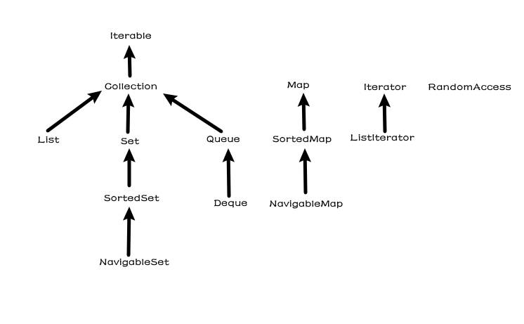
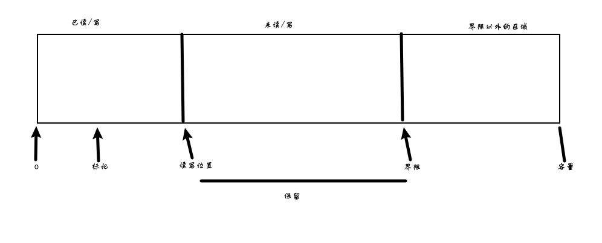

# Java的基本程序设计结构

## 简单的Java应用程序

* Java区分大小写
* 类名是以大写字母开头的名词。如果名字由多个单词组成，每个单词的第一个字母都应该大写（这种在一个单词中使用大写字母的方式称为驼峰命名法）
* 在Java中，每个句子必须用分号结束。回车不是语句的结束标志，因此，如果需要可以将一条语句写在多行中
* Java中的方法可以没有参数，也可以有一个或多个参数。即使一个方法没有参数，也需要使用空括号

## 注释

* 最常用的方式是是哟哪个//，其注释内容从//开始到本行结束
* 当需要更长的注释时，既可以在每行的注释前面标记//，也可以使用/\*和/\*注释界定符讲一段比较长的注释括起来
* 第三种注释可以用来自动地生成文档。这种注释以/\**开始，以\*/结束

## 数据类型

Java是一种强类型语言。必须为每一个变量声明一种类型。

### 整型

* 整型用于表示没有小数部分的数值，允许是负数

  | 类型  | 存储需求 | 取值范围                                           |
  | ----- | -------- | -------------------------------------------------- |
  | int   | 4字节    | -2147483648 - 2147483647（10位）                   |
  | short | 2字节    | -32768 - 32767（5位）                              |
  | long  | 8字节    | -9223372036854775808 - 9223372036854775807（20位） |
  | byte  | 1字节    | -128-127（3位）                                    |

* 长整型数值有一个后缀L或l，十六进制数值有一个前缀0x或0X，八进制有一个前缀0，二进制加上前缀0b或0B

* 数值中间可以加上下划线，这些下划线只是为了让人更易读。Java编译器会去除这些下划线

### 浮点类型

* 浮点类型用于表示有小鼠部分的数值

  | 类型   | 存储需求 | 取值范围      |
  | ------ | -------- | ------------- |
  | float  | 4字节    | 有效位数6-7位 |
  | double | 8字节    | 有效位数15位  |

* double表示这种类型的数值精度是float类型的两倍

* 实际上，只有很少的情况适合使用float类型

* float类型的数值有一个后缀F或f，没有后缀默认就是double类型

* 常量表示特殊浮点类型

  * Double.POSITIVE_INFINITY					正无穷大
  * Double.NEGATIVE_INFINITY                  负无穷大
  * Double.NaN                                             NaN（不是一个数字）

### char类型

* char类型原本用于表示单个字符

* 有些Unicode字符可以用一个char值描述，另外一些Unicode字符则需要两个char值

  | 转义序列 | 名称   | Unicode值 |
  | -------- | ------ | --------- |
  | \b       | 退格   | \u0008    |
  | \t       | 制表   | \u0009    |
  | \n       | 换行   | \u000a    |
  | \r       | 回车   | \u000d    |
  | \\"      | 双引号 | \u0022    |
  | \\'      | 单引号 | \u0027    |
  | \\\      | 反斜杠 | \u005c    |

* 强雷额建议不要在程序中使用char类型，除非确实需要处理UTF-16代码单元。最好将字符串作为抽象数据类型处理

### boolean类型

boolean类型有两个值：false和true，用来判定逻辑条件。整型值和布尔值之间不能进行相互转换

## 变量和常量

* 声明一个变量后，必须用复制语句对便令进行显示初始化，千万不要使用未初始化的变量值

* 在java中使用关键字final指示常量

* 关键字final表示这个变量只能被赋值一次，一旦被赋值之后，就不能够在更改了

* 常量名使用全大写

* 在Java中经常希望某个常量可以在一个类的多个方法中使用，通常将这些常量称为类常量。可以使用static final设置一个类常量

* 可以自定义枚举类型，枚举类型包括有限个命名的值

  `enum Size {SMALL, MEDIUM, LARGE, EXTRA_LARGE}`

## 运算符

### 算术运算符

* 使用算术运算符+、-、\*、/表示加减乘除运算。整数的求余操作用%表示
* 整数被0除将会产生一个异常，而浮点数被0除将会得到无穷大或NaN

### 数学函数和常量

* 在Math类中，包含了各种各样的数学函数

* 计算一个数值的平方根

  `Math.sqrt(x)`

* 幂运算

  `Math.pow(x, a)`

* floorMode方法的目的是解决一个长期存在的有关整数余数的问题

  如果n是偶数，这个表达式为0

  如果n是奇数，这个表达式为1

  如果n是负数，这个表达式为-1

* Math提供了一些常用的三角函数

  `Math.sin`

  `Math.cos`

  `Math.tan`

  `Math.atan`

  `Math.atan2`

* 指数函数以及它的反函数——自然对数以及以10为底的对数

  `Math.exp`

  `Math.log`

  `Math.log10`

* Java提供两个用于表示Π、e常量的最接近的近似值

  `Math.PI`

  `Math.E`

### 数值类型之间的转换


* 图中6个实线箭头，表示无信息丢失的转换

  另外三个虚线箭头，表示可能有精度损失的转换

* 当用一个二元运算符连接两个值时，先要将两个操作数转换为同一类型，然后再进行计算
  * 如果两个操作数中有一个double类型，另一个操作数就会转换成double类型
  * 否则，如果其中一个操作数是float类型，另一个操作数将会转换成float类型
  * 否则，如果其中一个操作数是long类型，另一个操作数就会转换成long类型
  * 否则，两个操作数都将被转换成int类型

### 强制类型转换

* 这种可能损失信息的转换要通过强制类型转换来完成，强制类型转换的语法格式是再圆括号中给出想要转换的目标类型，后面紧跟待转换的变量
* 如果想要对浮点数进行舍入运算，以便得到最接近的整数，那就可以使用Math.round()方法，其返回值类型为long，通过强制类型转换，将long型转换为int类型

## 结合赋值和运算符

* 可以在赋值中使用二元运算符，只是一种很方便的简写形式+=、\*=、/=...

### 自增和自减运算符

* 前缀形式会先完成加1，而后缀形式会使用变量原来的值
* 建议不要在表达式中使用++，因为这样的代码很容易让人困惑，而且会带来烦人的bug

### 关系和boolean运算符

* ==、!=、<、>、<=、>=

* &&表达式已经计算得到第一个表达式的真值为false，那么结果就不可能为true
* ||表达式第一个表达式为true时，那么结果的值就自动为true
* 三元表达式?:，这个操作符有时很有用，如果条件为true，就为第一个表达式的值，否则计算为第二个表达式的值

### 位运算符

* |、&、^、~、>>、<<、>>>（最高位用0填充）

### 括号与运算符级别

* 如果不适用圆括号，就按照给出的元素安抚优先级次序进行计算。

* 同一级别的运算符按照从左到右的次序进行计算（有i金额和运算符除外）

  | 运算符                                                       | 结核性   |
  | ------------------------------------------------------------ | -------- |
  | [] . ()（方法调用）                                          | 从左向右 |
  | ! ~ ++ -- +（一元运算符） -（一元运算符） ()（强制类型转换） new | 从右向左 |
  | \* / %                                                       | 从左向右 |
  | + -                                                          | 从左向右 |
  | << >> >>>                                                    | 从左向右 |
  | == !=                                                        | 从左向右 |
  | &                                                            | 从左向右 |
  | ^                                                            | 从左向右 |
  | \|                                                           | 从左向右 |
  | &&                                                           | 从左向右 |
  | \|\|                                                         | 从左向右 |
  | ?:                                                           | 从右向左 |
  | = += -= \*= /= %=  \|= ^= <<= >>= >>>=                       | 从右向左 |

## 字符串

* 从概念上看，Java字符串就是Unicode字符序列

### 子串

* String类的substring方法可以从一个较大的字符串提取出一个子串
* substring方法的第二个参数时不想复制的第一个位置
* substring工作方式有一个优点：容易计算子串的长度

### 拼接

* Java语言允许使用+号连接两个字符串

* 当将一个字符串与一个非字符串的值进行拼接时，后者会转换成字符串

* 如果需要把多个字符串放在一起，用一个界定符分隔，可以使用静态join方法

  `String all = String.join("/", "S", "M", "L", "XL"); //"S/M/L/XL"`

* >java11中提供了repeat方法：
  >
  >`String repeated = "Java".repeat(3); //"JavaJavaJava"`

### 不可变字符串

* String类没有提供修改字符串某个字符的方法
* 由于不能修改Java字符串中的单个字符，所以在Java文档中加功能String类对象称为不可变的
* 字符串变量指向存储池中相应的位置。如果复制一个字符串变量，原始字符串与复制字符串共享相同的字符

### 检测字符串是否相等

* 可以使用equals方法检测两个字符串是否相等
* 如果字符串s与字符串t相等，则返回true；否则返回false
* 想要检测两个字符串是否相等，而不去分大小写，可以使用equalsIgnoreCase方法
* ==运算符只能够确定两个字符串是否存放在同一位置
* 实际上只有字符串字面量是共享的，而+或substring等操作得到的字符串并不共享

### 空串和Null串

* 空串“”是长度为0的字符串，空串是一个Java对象，有自己的串长度和内容
* String变量还可以存放一个特殊的值，名为null，表示目前没有任何对象与该变量关联

### 构建字符串

* 使用StringBuilder类可以构建一个新的String对象，相较于拼接字符串时，既省时，又节省空间
* 在字符串构建完成时就调用toString方法，将可以得到一个String对象，其中包含了构建器中的字符序列

## 输入与输出

 ### 读取输入

* 想要通过控制台进行输入，首先需要构造一个与“结构输入流”System.in关联的Scanner对象
* 使用nextLine方法时可以读取一行输入
* 使用nextLine方法时因为输入行中有可能包含空格，想要读取一个单词可以调用next方法
* 整型可以使用nextInt，浮点型可以使用nextDouble

### 格式化输出

* System.out.println()

* System.out.print()

* System.out.printf()

  | 转换符 | 类型                           | 实例     |
  | ------ | ------------------------------ | -------- |
  | d      | 十进制整数                     | 159      |
  | x      | 十六进制整数                   | 9f       |
  | o      | 八进制整数                     | 237      |
  | f      | 定点浮点数                     | 15.9     |
  | e      | 指数浮点数                     | 1.59e+01 |
  | g      | 通用浮点数（e和f中较短的一个） | ——       |
  | a      | 十六进制浮点数                 | 01.ccdp3 |
  | s      | 字符串                         | Hello    |
  | c      | 字符                           | H        |
  | b      | 布尔                           | true     |
  | h      | 散列码                         | 42628b2  |
  | tx或Tx | 日期时间（T强制大写）          | 已经过时 |
  | %      | 百分号                         | %        |
  | n      | 与平台有段的行分割符           | ——       |

  | 标志              | 目的                   | 实例         |
  | ----------------- | ---------------------- | ------------ |
  | +                 | 打印正数和负数的符号   | +3333.33     |
  | 空格              | 在正数之前添加空格     | \| 3333.33\| |
  | 0                 | 数字前面补0            | 003333.33    |
  | -                 | 左对齐                 | \|3333.33 \| |
  | (                 | 将符号括在括号内       | （3333.33）  |
  | ,                 | 添加分组分隔符         | 3,333.33     |
  | #（对于f格式）    | 包含小数点             | 3,333.       |
  | #（对于x或0格式） | 添加前缀0x或0          | 0xcafe       |
  | $                 | 指定要格式化的参数索引 | 159 9F       |
  | <                 | 格式化前面说明的数值   | 159 9F       |

* 可以使用静态String.format方法的创建一个格式化的字符串，而不打印输出

### 文件输入与输出

* 读取一个文件，需要构造一个Scanner对象

  `Scanner in = new Scanner(Path.of("myfile.txt"), StandardCharset.UTF_8)`

* 写入文件需要构造一个PrintWriter对象

  `PrintWriter out = new PrintWriter("myfile.txt", StandardCharsets.UTF_8)`

## 控制流程

### 块作用域

* 块是指由若干条Java语句组成的语句，并用一对大括号括起来。块确定了变量的作用域了。一个块可以嵌套在另一个块中
* 但是，不能在嵌套的两个块中声明同名的变量

### 条件语句

```java
if (condition) {
	statement;
}

if (condition) {
    statement1;
} else {
    statement2;
}

if (condition1) {
    statement1;
} else if (condition2) {
    statement2;
} else {
    statement3;
}
```

### 循环

```java
while (condition) {
    statement;
}

do {
    statement;
} while (condition);

for (int i = 0; i < length; ++i) {
    statement;
}
```

### 多重选择：switch语句

```java
switch (choice) {
    case 1:
        statement;
        break;
    case 2:
        statement;
        break;
    case 3:
        statement;
        break;
    default:
        statement;
        break;
}
```

* switch语句将从与选项值像匹配的case标签开始执行，直到遇到break语句，或者执行到switch语句的结束处为止
* 如果没有相匹配的case标签，而有default子句，就执行这个子句
* case标签可以是：
  * 类型为char、byte、short或int的常量表达式
  * 枚举常量
  * 字符串字面量

### 中断控制流程的语句

> goto不建议使用

## 大数

* 如果基本的整数和浮点数精度不能够满足需求，那么可以使用java.math包中两个很有用的类：BigInteger和BigDecimal

* 这两个类可以处理包含任意长度数字序列的数值

* 使用静态的valueOf方法可以将普通的数值转换为大数

  `BigInteger a = BigIntetger.valueOf(100)`

* 对于更大的数，可以使用一个带字符串参数的构造器

  `BigInteger b = new BigInteger("22222222222222")`

* 大数常量：BigInteger.ZERO、BigInteger.ONE、BigInteger.TEN

  > Java9中添加了BigInteger.TWO

* 大数中没有算术运算符处理大数，需要使用大数类中的add和multiply方法

## 数组

### 声明数组

* 数组是一种数据类型，用来存储同一类型值得集合。通过一个整型下标可以访问数组中得每一个值

* 声明了变量后需要初始化才能使用，使用new操作符创建数组

* 一旦创建了数组，就不能改变它得长度

* Java中还提供了一种创建数组对象并且提供初始值得简写形式

  `int[] arr = {2, 3, 5}`

### 访问数组元素

* 创建一个数字数组时，所有元素都初始化为0，boolean数组得元素初始化为false，对象数组得元素初始化为一个null值，表示这些元素为存放任何对象
* 通过arr.length可以获取数组中得元素个数

### for each循环

`for (variable : collection) statement`

collection这一集合表达式必须是一个数组或者是一个实现了iterable接口得类对象

### 数组拷贝

* 在java中，允许将一个数组变量拷贝到另一个数组变量。两个变量将引用同一个数组

* 可以使用Arrays.copyOf方法将一个数组地所有值拷贝到一个新的数组中

  `int[] copyArr = Arrays.copyOf(arr, arr.length)`

  第二个参数是新数组地长度，**这个方法通过用来增加数组的大小**

### 数组排序

* 通过Arrays.sort(int[] arr)将数组进行排序
* 这个方法使用了优化的快速排序

### 多维数组

* 多维数组将使用多个下标访问数组元素，它适用于表示表格或者更加复杂的排序形式

# 对象与类

## 面向对象程序设计概述

### 类

* 类是构造对象的模板或蓝图
* 由类构造对象的过程称为创建类的实例
* 封装就是将数据和行为组成在一个包中，并对对象的使用者隐藏具体的实现方式
* 对象中的数据称为实例字段，操作数据的过程称为方法
* 所有其他类都扩展自Object类
* 扩展后的心累具有被扩展类的全部属性和方法
* 面向对象三大特征
  * 对象的行为
  * 对象的状态
  * 对象的标识

### 类之间的关系

* 类中常见的关系
  * 依赖——如果一个类的方法使用或操作另一个类的对象，我们就说一个类依赖另一个类
  * 聚合——类A对象包含类B对象
  * 继承——如果类A扩展类B，类A不但包含从类B继承的方法，还会有一些额外的功能
* 我们应该尽可能地将相互依赖地类减至最少，尽可能减少类之间的耦合

## 使用预定义类

### 对象与对象变量

* 要想使用对象，首先必须构造对象，并指定其初始状态
* 构造器是一种特殊的方法，用来构造并初始化对象
* 构造器的名字应该与类名相同
* 对象变量并没有实际包含一个对象，它只是引用一个对象

### LocalDate类

* 不要使用构造器来构造LocalDate类的对象，实际上应当使用静态工厂方法，它会代表你调用构造器

  `LocalDate.now()`

* 可以提供年、月和日来构造对应一个特定日期的对象

  `LocalDate.of(1999, 12, 31)`

* 一旦有一个LocalDate对象，可以用方法`getYear`、`getMonthValue`、`getDayOfMonth`得到年月日

### 更改器方法和访问器方法

* 调用更改器方法后，对象的状态会发生改变
* 只访问对象而不修改对象的方法有时称为访问器方法

## 用户自定义类

* 构造器和其他方法有一个重要的不同，构造器总是结合new运算符来调用，不能对一个已经存在的对象调用构造器来达到重新设置实例字段的目的
  * 构造器与类同名
  * 每个类可以有一个以上的构造器
  * 构造器可以有0个、1个或多个参数
  * 构造器没有返回值
  * 构造器总是伴随着new操作符一起调用

> * 在Java10中，如果可以从变量的初始值推到出它们的类型，那么可以用var关键字声明局部变量，而无需指定类型，那么可以用var关机子声明局部变量，而无需指定类型
> * var关键字只能用于方法中局部变量，参数和字段的类型必须声明

* 对null值应用一个方法，就会产生一个NullPointException异常

> * Java9中，Object类对此提供了一个方法Object.requireNonNullElse(n, "xxx")

* 如果需要获得或设置实例字段的值，那么需要提供三个内容：
  * 一个私有的数据字段
  * 一个公共的字段访问器方法
  * 一个公共的字段更改器方法
* 在实现一个类时，由于公共数据非常危险，所以应该将所有的数据字段都设置为私有的
* 将实例字段定义为final，这样的字段给必须在构造对象时初始化，必须确保在每一个构造器执行之后，这个字段的值已经设置，并且以后不能再修改这个字段

## 静态字段和静态方法

### 静态字段

* 设置了static修饰符之后，这个属性或者方法就属于类而不是属于任何单个的对象

### 静态常量

* 声明变量时，添加final、static

### 静态方法

* 静态方法是不在对象上执行的方法
* 方法不需要访问对象状态时，因为它需要的所有参数都通过显示参数提供
* 方法只需要访问类的静态字段

### 工厂方法

* 静态方法还有另一个常用的用途，使用静态工厂方法来构造对象
* 不适用构造器而使用工厂方法的原因：
  * 无法命名构造器。构造器的名字必须与类名相同
  * 使用构造器时，无法改变所构造对象的类型。

### main方法

* main方法不对任何对象进行操作

## 方法参数

* 按值调用表示方法接收的是调用者提供的值，而按需调用表示方法接收的是调用者提供的变量地址
* 方法可以修改按需调用的值，但是不能修改按值调用的值
* 对象引用是按值传递的
  * 方法不能修改基本数据类型的参数
  * 方法可以改变对象参数的状态
  * 方法不能让一个对象参数引用一个新的对象

## 对象构造

### 重载

* 如果多个方法有相同的名字、不同的参数，便出现了重载
* 它用各个方法首部中参数类型与特定方法调用中所使用的值类型进行匹配，来选出正确的方法

### 无参数的构造器

* 如果写一个类时没有编写构造器，就会为你提供一个无参构造器，这个构造器将所有的实例字段设置为默认值
* 如果类中提供了至少一个构造器，但是没有提供无参数的构造器，那么构造对象时如果不提供参数就是不合法的

### 调用另一个构造器

* 通过this方法调用另一个构造器

### 初始化块

* 三种初始化数据字段的方法
  * 在构造器中设置值
  * 在声明中赋值
  * 初始化块
* 只要构造这个类的对象，这些块就会被执行
* 首先运行初始化块，然后才运行构造器的主体部分
* 调用构造器的具体处理步骤
  * 如果构造器的第一行调用了另外的一个构造器，则基于所提供的参数值执行第二个构造器
  * 否则
    * 所有数据字段初始化为其默认值（0、false、null）
    * 按照在类声明中出现的顺序，执行所有字段初始化方法和初始化块
  * 执行构造器主体代码
* 如果类的静态字段需要很复杂的初始化代码，那么可以使用静态初始化块
* 在类第一次加载的时候将会进行静态字段的初始化
* 所有静态字段初始化方法以及静态初始化块都依照类声明中出现的顺序执行

### 对象析构与finalize方法

* java会完成自动的垃圾回收，不需要人工回收内存，所以Java不支持析构器

> java9中，可以使用Cleaner类注册一个动作，当对象不在可达时，就会完成这个动作

* 不要使用finalize方法来完成清理。这个方法原本要在垃圾回收器清理对象之前调用
* 文件或者使用了系统资源的另一个对象的句柄，这种情况下，当资源不再需要时，俺么应当提供一个close方法来完成必要的清理工作

## 包

### 包名

* 为了保证包名的绝对唯一性，要勇于给因特网域名（这显然是唯一的）以逆序的形式作为包名，然而对于不同的工程使用不同的子包

### 类的导入

* 一个类可以使用所属包中的所有类，以及其他包中的公共类
* 使用完全限定名：就是包名后面跟着类名
* 使用import语句，一但使用了import语句，在使用类时，就不必写出类的全名
* 可以使用`import java.time.*`导入java.time包中的所有类

### 静态导入

* import语句允许导入静态方法和静态字段

  `import static java.lang.System.*`

  这样就可以使用System类的静态方法和静态字段，而不必加类名前缀

### 在包中增加类

* 在代码最开头加上package语句，代表向这个包中添加一个类

* 如果没有在源文件中放置package语句，这个源文件中的类就属于无名包

## 包访问

* 如果没有添加修饰符，这个部分可以被统一包中的所有方法访问

### 类路径

* 类路径（classpath），类路径是所有包类文件的路径的集合

### 设置类路径

* 最好使用-classpath选项指定类路径

## JAR文件

* 在将应用程序打包时，你一定希望只想用户提供一个单独的文件，而不是一个包含大量类文件的目录结构，java归档文件就是为此目的为设计的

* 创建一个新JAR文件最常用的命令

  `jar cvf jarFileName file1 file2`

  | 选项 | 说明                                                         |
  | ---- | ------------------------------------------------------------ |
  | c    | 创建一个新的或者空的存档文件并加入文件，如果指定的文件名时目录，jar程序将会对他们进行递归处理 |
  | C    | 临时改变目录切换到classes子目录以便增加类文件                |
  | e    | 在清单文件中创建一个入口点                                   |
  | f    | 指定jar文件名作为第二个命令行参数。如果没有这个参数，jar命令将结果写至标准输出或者从标准输入读取 |
  | i    | 建立索引文件                                                 |
  | m    | 将一个清单文件添加到JAR文件中，清单是对归档内容和来源的一个说明。每个归档有一个默认的清单文件。但是，如果像验证归档文件的内容，可以提供自己的清单文件 |
  | t    | 显示内容表                                                   |
  | u    | 更新一个已有的JAR文件                                        |
  | v    | 生成详细的输出结果                                           |
  | x    | 解压文件。如果提供一个或多个文件名，只解压这些文件；否则，解压所有文件 |
  | 0    | 存储，但不进行ZIP压缩                                        |

## 文档注释

### 注释的插入

* javadoc实用工具从下面几项中抽取信息
  * 模块
  * 包
  * 公共类和接口
  * 公共的和受保护的字段
  * 公共的和受保护的构造器及方法

### 方法注释

* @param variable descriptioon

  这个标记将给当前方法的”paramters“部分添加一个条目

* @return description

  这个标记将给当前方法添加”return是“部分

* @throws class description

  这个标记将添加一个注释，表示这个方法有可能抛出异常

### 通用注释

* @author name

  这个标记将会产生一个author条目

* @version text

  这个标记将会产生一个version条目

* @since text

  会建立一个since条目

* @see 和 @link标记，可以使用超链接

## 类设计技巧

* 一定要保证数据私有
* 一定要对数据进行初始化
* 不要在类中使用过多的基本类型
* 不是所有的字段都需要单独的字段访问器和字段更新器
* 分解有过多职责的类
* 类名分方法名要能够体现他们的职责
* 优先使用不可变的类

# 继承

* 继承的基本思想是，可以基于已有的类创建新的类，继承已存在的类就是复用这些类的方法，而且可以增加一些新的方法和字段，是新类能够适应新的情况

## 类、超类、子类

### 定义子类

* 关键字extends表明正在构造的新类派生于一个已存在的类，新类称为子类，已存在的类称为父类
* 通过扩展超类定义子类时，只需要指出子类和超类的不同之处

### 覆盖方法

* 当父类中的方法在子类中并不适用时，需要提供一个新的方法来**覆盖**超类中的这个方法
* 只有父类能够访问父类的私有字段，子类无法访问父类的私有字段
* super关键字代表父类对象，可以通过super来调用父类的方法和构造器

### 子类构造器

* 语句`super(xxx)`时调用超类中的构造器的意思
* 因为子类无法访问父类的私有字段，所以需要通过构造器方法来初始化这些私有字段
* 使用super调用构造器的语句必须是子类构造器的第一条语句
* 如果子类构造器没有显式调用超类的构造器，将自动地调用超类的无参构造器
* 如果超类没有无参数的构造器，并且在子类的构造器中有没有显式地调用超类的其他构造器，Java编译器就会报告一个错误
* 一个变量可以只是多种实际类型的现象称为多态
* 在运行时能够自动地选择适当的方法，称为动态绑定

### 继承层次

* 由一个公共超类派生出来的所有类的集合称为继承层次
* 在继承层次中，从某个特定的类到其祖先的路径称为该类的继承链

### 多态

* 判断是否应该将数据设计为继承关系，可以通过”is-a“规则，也成为替换原则，他指出程序中出现超类对象的任何地方都可以使用子类对象替换
* 不能将超类引用赋给子类变量

### 理解方法调用

* 编译器查看对象声明类型和方法名，编译器将会一一列举该类中所有对应名称的方法和其超类中所有对应名称的而且可以访问的方法
* 编译器要确定方法调用中提供的参数类型，如果方法中存在一个于所提供参数类型完全匹配的方法，就选择这个方法，这个过程称为重载解析
* 如果是private方法、static方法、final方法或者构造器，那么编译器将可以准确地直到应该调用哪个方法，这称为静态绑定
* 程序运行别切采用动态绑定调用方法，虚拟机必须调用于指定类所引用的对象的实际类型相对应的哪个方法
* 每次调用方法都需要搜索时间开销相当大，所以虚拟机会预先为每个类计算一个方法表，其中列出了所有的方法的签名发和要调用的实际方法

### 阻止继承：final类和方法

* 不允许扩展的类别成为final类，如果在定义类的时候使用了final修饰符就表明这个类是final类
* 类中的某个特定方法也可以声明为final，这样，子类就不能覆盖这个方法
* 将方法或类声明为final的主要原因是：确保它们不会再子类中改变语义

### 强制类型转换

* 进行强制类型转换的唯一原因是：要在暂时护士对象的实际类型之后使用对象的全部功能
* 在进行强制类型转换之前，先查看是否能够成功地转换，为此需要使用instanceof操作符就可以实现
* 只能在继承层次内进行强制类型转换
* 在将超类强制转换成子类之前，应该使用instanceof进行检查

### 抽象类

* 对方法使用了abstract修饰符，就可以安全不需要实现这个方法
* 为了提高程序的清晰度，包含一个或多个抽象方法的类本身必须被声明为抽象
* 除了抽象方法之前，抽象类还可以包含字段和具体方法
* 扩展抽象类有两种方法：
  * 在子类中保留抽象类中的部分或所有抽象方法任未定义，这样必须将子类也标记为抽象类
  * 定义全部方法，子类就不再是抽象方法
* 即使不含抽象方法，也可以将类声明为抽象方法
* 抽象类不能实例化，如果将一个类声明为abstract，就不能创建这个类的对象
* 可以定义一个抽象类的对象变量，但这样一个变量只能引用非抽象子类的对象

### 受保护访问

* 设置受保护（protected）修饰类方法和字段，这样可以限制超类的某个方法只允许子类访问
* 访问控制修饰符总结：
  * 仅对本类可见——private
  * 对外部完全可见——public
  * 对本包和所有子类可见——protected
  * 对本包可见——默认，不需要修饰符

## Object：所有类的超类

* Object类是java中所有类的始祖，在java中每个类都扩展了Object

### Object类型变量

* 可以使用Object类型的变量引用任何类型的对象

### equals方法

* Object类中的equals方法用于检测一个对象是否等于另外一个对象，Object类中是心啊的equals方法将确定两个对象的引用是否相等

### 相等测试和继承

* Java语言规范要求equals方法具有下面的特性

  * 自反性：对于任何非空引用x，x.equals(x)返回true
  * 对称性：对任何引用x和y，当且仅当y.equals(x)返回true时，x.equals(y)返回true
  * 传递性：对于任何引用x，y和z，如果x.equals(y)返回true，y.equals(z)返回true，x.equals(z)也应该返回true
  * 一致性：如果x和y引用对象没有发生变化，反复调用x.equals(y)应该返回同样的结果
  * 对任意非空引用x，x.equals(null)应该返回false

* 如果子类可以有自己的相等性概念，则对称性需求将强制使用getClass检测

* 如果由超类决定相等性概念，那么就可以使用instanceof检测，这样可以在不同子类的对象那个之间进行相等性比较

* 编写equals方法的建议：

  * 显示参数命名为otherObject，稍后需要将它强制转换成另一个名为other的变量

  * 检测this与otherObjec是否相等

    `if (this == otherObject) return true`

  * 检测otherObject是否为null，如果为null，返回false

    `if (otherObject == null) return false`

  * 比较this与otherObject类，如果equals的语义可以在子类中改变，基于可以使用getClass检测

    `if (getClass() != otherObject.getClass()) return false`

    如果所有的子类都有相同的相等性语义，可以使用instanceof检测

    `if (!(otherObject instanceof ClassName)) return false`

  * 将otherObject强制装换为相对应类类型的变量

    `ClassName other = (ClassName)otherObject`

  * 现在根据相等性概念的要求来比较字段。使用==比较基本类型字段，使用Object.equals比较对象字段。如果所有的字段都匹配，就返回true，否则返回false

    `return field = ohter.field1 && Object.equals(field2, other.field2) && ....`

### hashCode方法

* 散列码是由对象导出的一个整型值，散列码是没有规律的，如果x和y是两个不同的对象，x.hashCode()与y.hashCode()基本上不会相同
* Object类的默认hashCode方法会从对象的存储地址得出散列码
* 如果重新定义了equals方法，就必须为用户可能插入散列表的对象重新定义hashCode方法

### toString方法

* toString方法，它回安徽白哦是对象值的一个字符串

## 泛型数组列表

### 声明数组列表

* <>称为菱形语法，因为空间括号像个菱形，如果赋值给一个变量，或传递给某个方法，或者从某个方法返回，编译器会检查这个变量、参数或方法的泛型类型，然后将这个类型放在<>中
* 使用add方法可以将元素添加到数组例表中
* 如果调用add而内部数组已经满了，数组列表就会自动地创建一个更大的数组
* 如果已经知道或能够估计出数组可能存储的元素数量，就可以在填充数组之前调用ensureCapacity方法
* 还可以把初始容量传递给ArrayList构造器
* size方法返回数组列表中包含的实际元素个数
* 一旦消减了数组列表的大小，添加新元素就需要花时间再次移动存储块，所以应该再确认不会再向数组列表添加你家任何元素时再调用trimToSIze

### 访问数组列表元素

* 使用get和set方法访问和修改数组列表中的元素
* 使用toArray方法将数组元素拷贝到一个数组中
* 如果需要再数组列表中间插入元素，可以使用add方法并且提供一个索引参数
* 使用remove删除元素

## 对象包装器和自动装箱

* 所有的基本类都有一个与之对应的包装器类
* 包装器类是不可变的，即一旦构造了包装器，就不再允许更改包装再其中的值了
* 包装器类还是final，因此不能派生它们的子类
* 尖括号中的类型参数不允许是基本类型
* `Integer.valueOf(2)`自动装箱机制
* `obj.intValue()`自动拆箱机制
* 比较两个包装器类不能使用==而使用equals
* 装箱和拆箱是编译器要做的工作而不是虚拟机

## 参数数量可变方法

* 省略号...是Java代码的一部分，它表明这份方法可以接收任意数量的对象

## 枚举类

`public enum Size {SMALL, MEDIUM, LARGE, EXTRA_LARGE}`

* 比较两个枚举类型的值时，并不需要调用equals，直接使用==就可以了
* 枚举的构造器总是私有的
* toString返回枚举的常量名
* toString方法的逆方法时valueOf
* 每个枚举类型都有一个静态的values方法，它将返回一个包含全部枚举值的数组

## 反射

* 在运行时分析类的能力
* 在运行时检查对象
* 实现泛型数组操作代码
* 利用Method对象

### Class类

* 在程序运行期间，Java运行时系统始终为所有对象维护一个运行时类型标识。这个信息会跟踪每个对象所属类，虚拟机利用运行时类型信息选择要执行的正确方法
* Object类中的getClass()方法将会返回一个Class类的实例
* Class类的getName方法就返回类的名字
* 还可以使用静态方法forName获取类名对应的class对象
* 如果T是任意的Java类型，T.class将代表匹配的类对象
* 虚拟机为每个类型管理一个唯一的Class对象，因此可以利用==运算符实现两个类对象的比较
* 调用getConstructor方法将会得到一个Constructor类型对象，然后使用newInstance方法来构造一个实例

### 声明异常入门

* 抛出异常比终止程序要灵活的多，这是因为可以提供一个处理器“捕获“这个异常并进行处理
* 异常有两种类型：非检查型异常和检查型异常

### 资源

* Class类提供了一个很有用的服务可以查找资源文件
  * 获得拥有资源的类的class对象
  * 如果有方法接收描述资源位置的URL那么就调用getResource()
  * 否则，使用getResourceAsStream方法得到一个输入流来读取文件中的数据

### 利用反射分析类的能力

* 在java.lang.reflect包中由三个类Field、Method、Constructor分别用于描述类的字段、方法和构造器
* 这三个类都有一个叫做getName的方法，用来返回字段、方法或构造器的名称
* Field类有一个getType方法，用来返回描述字段类型的一个对象，这个对象的类型同样是Class
* Method和Constructor类有报告参数类型的方法
* Method类有一个报告返回类型的方法、
* 这三个类都有一个名为getModifiers的方法，它将返回一个整数，用不同的0/1位描述所使用的修饰符
* 还可以利用Modifier类的静态方法分析getModifiers返回的这个整数（isPublic\isPrivate\ifFinal）
* Modifier.toString能够将修饰符打印出来
* Class类中getFields、getMethods、getConstructors返回这个类支持的公共字段、方法和构造器，包括超类中的所有成员，getDeclareFields、getDeclareMethods、getDeclareConstructor方法将返回类中声明的全部字段、方法和构造器，其中不包括超类

### 利用反射在运行时分析对象

* Field类中的get方法，f.get(obj)将返回一个对象，其值为obj的当前字段值
* 调用f.set(obj, value)把对象obj的f表示的字段设置为新值
* 如果字段为一个私有字段，get和set方法就会抛出IllegalAccessException异常
* 可以调用Field、Method、Constructor对象的setAccessible方法覆盖Java的访问控制

### 使用反射编写泛型数组代码

* Array类的静态方法newInstance，这个方法能够构造一个新数组，调用这个方法时必须提供两个参数，一个是数组的类型，一个是数组的长度

  `Object newArray = Array.newInstance(componentType, newLength)`

* 通过调用Array.getLength(a)获得数组的长度

### 调用任意方法和构造器

* Method方法有一个invoke方法，允许调用包装在当前Method对象中的方法

## 继承的设计技巧

* 将公共操作和字段放在超类中
* 不要使用受保护的字段
* 使用继承实现“is-a“关系
* 除非所有继承的方法都有意义，否则不要使用继承
* 在覆盖方法时，不要改变预期的行为
* 使用多态，而不要使用类型信息
* 不要滥用反射

# 接口、lambda表达式和内部类

## 接口

### 接口的概念

* 在Java程序中，接口不是类，而是对希望复合这个接口的类的一组需求
* 接口中的所有方法都自动是public方法
* 接口不会有实例字段，在Java8之前，接口中不会实现方法
* 让一个类实现一个接口：
  * 将类声明为实现给定的接口
  * 对接口中的所有方法提供定义
* 需要使用关键字implements将类声明为实现某个接口

### 接口的属性

* 接口不是类，不能使用new运算符实例化一个接口，但是可以声明接口的变量，接口的变量必须引用实现了这个接口的类对象
* 可以使用instanceof检查一个对象是否实现了某个特定的接口
* 允许有多条接口链，从通用性较高的接口扩展到专用性较高的接口
* 接口中可以包含常量，接口中的字段总是public static final
* 可以使用逗号将想要实现的各个接口分隔开

### 接口与抽象类

* 每个类只能扩展一个类，但是每个类可以实现多个接口

### 静态和私有方法

* 在java8中，允许在接口中增加静态方法
* 所以，实现自己的接口时，没有必要再为实用工具方法另外提供一个伴随类

> * 在java9中，接口中的方法可以是private，private方法可以是静态方法或实例方法，由于私有方法只能在接口本身的方法中使用，所以它们的用法很有限，只能作为接口中的其他方法的辅助方法

### 默认方法

* 可以为接口方法提供一个默认实现，必须用default修饰符标记这样的一个方法
* 在已经被实现的接口中增加默认方法不会报错
* 可以直接通过接口名加方法名，调用这个方法

### 解决默认方法冲突

* 如果在一个接口中将一个方法定义为默认方法，然后又在超类或者另一个接口中定义了同样的方法：
  * 超类优先，如果超类提供了一个具体方法，同名而且有相同参数类型的默认方法会被忽略
  *  接口冲突，如果一个接口提供了一个默认方法，另外一个接口提供了一个同名而且参数类型相同的方法，必须覆盖这个方法来解决冲突

### 接口与回调

* 回调是一种常见的程序设计模式，可以指定某个特定事件时应该采取的动作

### Comparator接口

* 对一个对象数组进行排序，前提是这些对象是实现了Comparable接口的类的实例
* Arrays.sort，需要一个数组和一个比较器作为参数，比较器是实现了Comparator接口的类的实例

### 对象克隆

* Cloneable接口，这个接口指示一个类提供了一个安全的clone方法
* 为一个包含对象引用的变量建立副本时，原变量和副本都是同一个对象的引用，任何一个变量改变都会影响另一个变量
* clone方法是Object的一个protected方法，这说明你的代码不能直接调用这个方法
* 默认的克隆操作是”浅拷贝“，并没有克隆对象中引用的其他对象
* 如果源对象和浅克隆对象共享的子对象是不可变的，那么这种共享就是安全的
* 通常子对象都是可变的，必须重新定义clone方法来建立一个深拷贝，同时克隆所有子对象

## lambda表达式

* lambda表达式是一个可传递的代码，可以在以后执行一次或多次

### lambda表达式的语法

* lambda表达式就是一个代码块，以及必须传入代码的变量规范
* 一种lambda表达式形式：参数，箭头（->）以及一个表达式
* 如果代码要完成的计算无法方法在一个表达式中，就可以像写方法一样，把这些代码放在{}中，并包含显式的return语句
* 即使lambda表达式没有参数，仍然要提供空括号，就像无参数方法一样
* 如果可以推导出一个lambda表达式的参数类型，则可以忽略其类型
* 如果方法只有一个参数，而且这个参数类型可以推导出来，那么甚至可以省略小括号
* 无需指定lambda表达式的返回类型。lambda表达式的返回类型总是会由上下文推导得出

### 函数式接口

* 对于只有一个抽象方法的接口，需要这种接口的对象时，就可以提供一个lambda表达式，这种接口称为函数式接口

### 方法引用

* 方法引用，只是编译器生成一个函数式接口的实例，覆盖这个接口的抽象方法来调用给定的方法
* 要用::运算符分割方法名和对象或类名，主要有3中情况：
  * object::instanceMethod，方法引用等价于想方法传递参数的lambda表达式
  * Class::instanceMethod， 第一个参数会成为方法的隐式参数
  * Class::staticMethod，所有参数都传递到静态方法
* 只有当lambda表达式的体只调用一个方法而不做其他操作时，才能把lambda表达式重写为方法引用
* 可以在方法引用中使用this参数，使用super也是合法的

### 构造器的使用

* 构造器引用与方法引用很类似，只不过方法名为new
* Java有一个限制，无法构建泛型类型T的数组

### 变量作用域

* lambda表达式有3个部分

  * 一个代码块
  * 参数
  * 自由变量的值，这是指非参数而且不在代码中定义的变量

* lambda表达式可以捕获外围作用域中变量的值，在lambda表达式中，只能引用值不会改变的变量

* 如果在lambda表达式中更改变量，并发执行多动作时就会不安全

* 如果在lambda表达式中引用一个变量，而这个变量可能在外部改变，这也是不合法的

* lambda表达式中捕获的变量必须实际上是事实最终变量（这个变量初始化之后就不会再为它赋新值）

* 在lambda表达式中声明与一个局部变量同名的参数或局部变量是不合法的

* 在一个lambda表达式中使用this关键字时，是指创建这个lambda表达式的方法的this参数

  > 闭包就是在一个函数中引用了外部的变量，导致该变量不会被GC回收

### 处理lambda表达式

* 使用lambda表达式的重点是延迟执行

* 使用lambda表达式的原因

  * 在一个单独的线程中运行代码
  * 多次运行代码
  * 在算法的适当位置运行代码
  * 发生某种情况时执行代码
  * 只在必要时才运行代码

  | 函数式接口          | 参数类型 | 返回类型 | 抽象方法 | 描述                         | 其他方法                   |
  | ------------------- | -------- | -------- | -------- | ---------------------------- | -------------------------- |
  | Runnable            | 无       | void     | run      | 作为无参数或返回值的动作运行 |                            |
  | Supplier<T>         | 无       | T        | get      | 提供一个T类型的值            |                            |
  | Consumer<T>         | T        | void     | accept   | 处理一个T类型的值            | andThen                    |
  | BiConsumer<T, U>    | T，U     | void     | accept   | 处理T和U类型的值             | andThen                    |
  | Function<T, R>      | T        | R        | apply    | 有一个T类型参数的函数        | compose，andThen，identity |
  | BiFunction<T, U, R> | T，U     | R        | apply    | 有T和U类型参数的函数         | andThen                    |
  | UnaryOperator<T>    | T        | T        | apply    | 类型T上的一元操作符          | compose，andThen，identity |
  | BinaryOperator<T>   | T，T     | T        | apply    | 类型T上的二元操作符          | andThen，maxBy，minBy      |
  | Predicate<T>        | T        | boolean  | test     | 布尔值函数                   | and，or，negate，isEqual   |
  | BiPredicate<T, U>   | T，U     | boolean  | test     | 有两个参数的布尔值函数       | and，or，negate            |

### 再谈Comparator

* Comparator接口包含很多方便的静态方法来创建比较器
* 静态comparing方法去一个”键提取器“函数，它将类型T隐射为一个可比较的类型，对要比较的对象应用这个函数，然后对返回的键完成比较
* 可以把比较器与thenComparing方法串起来，来处理比较结果相同的情况

## 内部类

* 内部类是定义在另一个类中的类
  * 内部类可以对同一个包中的其他类隐藏
  * 内部类方法可以访问定义这个类的作用域中的数据，包括原本私有的数据

### 使用内部类访问对象状态

* 一个内部类方法可以访问自己的数据字段，也可以访问创建它的外部类对象的数据字段
* 内部类的对象总有一个隐式引用，指向创建它的外部类对象

### 内部类的特殊语法规则

* 在外围类的作用域之外，可以这样引用内部类

  OuterClass.InnerClass

### 内部类是否有用、必要和安全

* 内部类是一个编译器现象，与虚拟机无关
* 编译器将会把内部类转换为常规类文件，用$分隔外部类名与内部类名，而虚拟机对此一无所知
* 编译器会生成一个额外的实例字段this$0，对应外围类引用
* 内部内拥有更大的访问权限，所以太女生就比常规类功能更加强大

### 局部内部类

* 声明局部类时不能有访问说明符，局部类的作用域被限定在声明这个局部类的块中

### 由外部方法访问变量

* 局部类还有一个优点，它们不仅能够访问外部类的字段，还可以访问局部变量，不过局部变量必须时事实最终变量

### 匿名内部类

* 创建这个类的一个对象，甚至不需要为类指定名字，这样一个类被称为匿名内部类
* 由于构造器的名字必须与类名相同，而匿名内部类没有类名，所以，匿名内部类不能有构造器
* 尽管匿名类不能有构造器，但可以提供一个对象初始化块
* 相比于使用内部类，更加好的做法是使用lambda表达式

### 静态内部类

* 使用内部类只是为了把一个类隐藏在另外一个类的内部，并不需要内部类有外围类对象的一个引用，为此可以将内部类声明为static
* 只要内部类不需要访问外围类对象，就应该使用静态内部类
* 与常规内部类不同，静态内部类可以有静态字段和方法
* 在接口中声明的内部类自动是static和public

## 代理

### 何时使用代理

* 需要在运行的程序中定义一个新类

* 代理类可以在运行时创建全新的类，这样的代理类能够实现你指定的接口

  * 指定接口所需的全部方法
  * Object类中的全部方法

* 在运行时定义新代码，必须提供一个调用处理器，调用处理器是实现了InvocationHandler接口的类的对象，这个接口只有一个方法

  `Object invoke(Object proxy, Method method, Object[] args)`

* 无论何时调用代理对象的方法，调用处理器的invoke方法都会被调用，并向其传递Method对象和原调用的参数，之后调用处理器必须确定如何处理这个调用

### 创建代理对象

* 想要创建一个代理对象需要使用Proxy类的newProxyInstance方法
  * 一个类加载器
  * 一个Class对象数组，每个元素对应需要实现的各个接口
  * 一个调用处理器

### 代理类的特性

* 代理类是在程序运行过程中创建的
* 一个扩展类只有一个实例字段——即调用处理器
* 所有的代理类都要覆盖Object类的toString、equals和hashCode方法

### 代理实例

动态代理对象不需要实现接口，但是要求目标对象必须实现接口，否则不能使用动态代理。

* 接口类

  ```java
  public interface IUserDao {
      public void save();
  }
  ```

* 目标对象

  ```java
  public class UserDao implements IUserDao {
  	@Override
      public void save() {
          System.out.println("...");
      }
  }
  ```

* 动态代理对象

  ```java
  public class UserProxyFactory {
      private Object target;
      
      public ProxyFactory(Object target) {
          this.target = target;
      }
      
      public Object getProxyInstance() {
          return Proxy.newProxyInstance(target.getClass().getClassLoader(), target.getClass().getInterfaces(),
                                    new InvocationHandler() {
                                        @Override
                                        public Object invoke(Object proxy, Method method, Object[] args) throws Throwable {
                                            System.out.println("开启事务");
                                            
                                            Object returnValue = method.invoke(target, args);
                                            
                                            System.out.println("提交事务");
                                            
                                            return null;
                                        }
                                    });
      }
  }
  ```

* 测试类

  ```java
  public class TestProxy {
      @Test
      public void testDynamicProxy() {
          IUserDao target = new UserDao();
          System.out.println(target.getClass());
          IUserDao proxy = (IUserDao)new ProxyFactory(target).getPRoxyInstance();
          System,out.println(proxy.getClass());
          proxy.save();
      }
  }
  ```

CGLIB代理

* 目标类

  ```java
  public class Test {
      private final String a = "x";
  
      public void test() {
          System.out.println(a);
      }
  }
  ```

* 代理类

  ```java
  public class ProxyTest {
      private Object target;
  
      public ProxyTest(Object target) {
          this.target = target;
      }
  
      public Object getProxyInstance() {
          Enhancer enhancer = new Enhancer();
          enhancer.setSuperclass(Test.class);
          enhancer.setCallback(new MethodInterceptor() {
              @Override
              public Object intercept(Object o, Method method, Object[] objects, MethodProxy methodProxy) throws Throwable {
                  System.out.println("前置通知");
                  Object invoke = methodProxy.invokeSuper(o, objects);
                  System.out.println("后置通知");
                  return invoke;
              }
          });
          return enhancer.create();
      }
  }
  ```

* 测试类

  ```java
  public class Test {
      public static void main(String[] args) {
          Test test = new Test();
          ProxyTest proxyTest = new ProxyTest(test);
          Test proxyInstance = (Test) proxyTest.getProxyInstance();
          proxyInstance.test();
      }
  }
  ```

# 异常、断言和日志

## 处理错误

* 用户期望在出错误时，程序能够采取合理的行为。如果由于出现错误而使得某些操作灭有完成，程序应该：
  * 返回到一个安全状态，并能够让用户执行其他的命令
  * 允许用户保存所有工作的结果，并以妥善的方式终止程序
* 程序中可能存在的问题
  * 用户输入错误，除了那些不可避免地键盘输错误外，有些用户不准收程序的要求
  * 设备错误
  * 物理限制，磁盘已满，可能用尽了所有可用地存储空间
  * 代码错误，程序方法有可能没有正确地完成工作
* 如果不能采用正常的途径完成他的任务，可以通过另外一个路径退出方法，这种情况下，方法并不返回任何值，而是抛出一个封装了错误信息的对象
* 遇到异常后，这个方法将会立刻退出，并不返回正常值，也不会从调用这个方法的代码继续执行，取而代之的是，异常机制开始搜索能够处理这种异常状况的异常处理器

### 异常分类

* 异常对象都是派生于Throwable类的一个类实例，下一层立即分解为两个分支：Error和Exception
* Error类层次结构描述了Java运行时的系统的内部错误和资源耗尽错误
* Exception层次结构，又分为两个分支，一个分支派生于RuntimeException，另一个分支包含其他异常
* 一般规则：由于变成错误的异常属于RuntimeException，如果程序本身没有问题，但是由其他错误导致的异常属于其他异常
* Java语言规范将派生于Error类或RuntimeException类的所有异常称为非检查型异常，所有其他的异常称为检查性异常
* 需要抛出异常的情况：
  * 调用了一个抛出检查型异常的方法
  * 检测到一个错误，并且利用throw语句抛出一个检查型异常
  * 程序出现错误
  * Java虚拟机或运行时库出现内部错误
* 如果一个方法有可能抛出多个检查型异常类型，那么就必须在方法首部列出所有的异常类，每个异常类之间用逗号隔开
* 不应该声明从RuntimeException继承的那些非检查型异常
* 一个方法必须声明所有可能抛出的检查型异常，而非检查型异常要么在控制之外，要么从一开始就避免这种情况的发生

### 如何抛出异常

* 一旦方法抛出了异常，这个方法就不会返回到调用者，不必操心创建一个默认的返回值或错误码

### 创建异常类

* 创建异常类，需要定义一个派生于Exception的类，或者派生Exception的某个子类，自定义的这个类应该包含两个构造器，一个是默认的构造器，另一个是包含详细描述信息的构造器（超类Throwable的toString方法会返回一个字符串，其中包含这个详细信息）

## 创建异常

### 捕获异常

* 如果发生了某个异常，但没有在任何地方捕获这个异常，程序就会终止，并在控制台上打印一个消息，其中包含这个异常的类型和一个堆栈轨迹

* 要想捕获一个异常，需要设置try/catch语句块

  ```java
  try {
      code
  } catch (ExceptionType e) {
      handler for this type
  }
  ```

* 如果try语句块中的任何代码抛出了catch子句指定的一个异常类

  * 程序将跳过try语句块的其余代码
  * 程序将执行catch子句中的处理器代码

* 如果try语句块中没有抛出任何异常，那么程序将跳过catch子句

* 如果方法中的任意代码抛出了catch子句没有声明的一个异常类型，那么这个方法就会立即退出

* 如果调用了一个抛出检查型异常的方法，就必须执行这个异常，或者继续传递这个异常

* 一般来说，要捕获那些知如何处理的异常，而继续传播那些不知道怎么处理的异常

* 如果想传播一个异常，就必须在方法的首部添加一个throws说明符，提醒调用者这个方法可能会抛出异常

* 如果编写一个方法覆盖超累方法，而这个超类方法没有抛出异常，你就必须捕获你的方法代码中出现的每一个检查型异常

* 不允许在子类的throws说明符中出现超类方法未列出的异常类

### 捕获多个异常

* 在一个try语句块中可以捕获多个异常类型，并对不同类型的异常做出不同的处理，要为每个异常类型使用一个单独的catch语句
* 想要获得这个对象的更多信息，可以尝试使用e.getMessage()方法
* 在Java7中，同一个catch子句中可以捕获多个异常类型（只有当捕获的异常类型彼此之间不存在子类关系时才需要这个特性）

### 再次抛出异常与异常链

* 可以在catch子句中抛出一个异常，通常希望改变异常的类型时胡这样做
* 捕获到新抛出的异常时，可以使用getCause获取原始异常
* 强烈建议使用这种包装技术，这样可以在子系统中抛出高层异常，而不会丢失原始异常的细节

### finally子句

* 代码抛出一个异常时，就会停止处理这个方法中剩余的代码，并退出这个方法
* 不管是否有异常被捕获，finally子句中的diamagnetic都会执行

### try-with-Resources语句

* 在java7中提供了一种方法

  ```java
  try (Resource res = ...) {
      work with res
  }
  ```

  他将自动关闭try语句段中资源

* 这个块正常退出时，或者存在一个异常时，都会调用close这个资源

> * 在java9中，可以在try首部中提供之前声明的事实最终变量

* try-with-Resources语句本身也可以youcatch子句，甚至还可以有一个finally子句，这些子句会在关闭资源之后执行

### 分析堆栈轨迹元素

* 堆栈轨迹是程序执行过程中某个特定点上所有挂起的方法调用的一个列表
* 可以调用Throwable类的printStackTrace方法访问贵站轨迹的文本描述信息
* 一种更灵活的方法是使用StackWalker类，它会生成要给StackWalker.StackFrame实例流，其中每个实例分别描述一个栈帧
* 使用异常的技巧
  * 异常处理不能代替简单测试
  * 不要过分地细化异常
  * 充分利用异常层次结构
  * 不要压制异常
  * 在检测错误时，“苛刻”总比放任好
  * 不要羞于传递异常

## 使用断言

### 断言的概念

* 使用常规的测试完毕后，这个代码还会一直保留在程序中，如果程序中含有大量这种检查，程序将会运行起来慢很多

* 断言机制允许在测试期间向代码中插入一些检查，而在生产代码中会自动删除这些检查

* assert关键字，有两种形式：

  `assert condition;`

  和

  `assert condition : expression;`

  如果结果为false，则抛出一个AssertionError异常，第二个表达式中会将expression传入AssertionError对象的构造器，并且转换成一个消息字符串

### 启用和禁用断言

* 在默认情况下断言是禁止的，可以在运行程序时用-enableassertions或-ea选项启用断言

### 使用断言完成参数检查

* 什么时候使用断言
  * 断言失败是致命的，不可恢复的错误
  * 断言检查只是在开发和测试阶段打开
* 不应该使用断言向程序的其他部分通知发生了可恢复性的错误，或者，不应该利用断言与程序用户沟通问题
* 断言只应该用于在测试阶段确定程序内部错误的位置

## 日志

* 日志API为了解决代码中随处出现的System.out方法
  * 可以很容易的取消全部日志记录，或者仅仅取消某个级别以下的日志，而且可以很容易地再次打开日志开关
  * 可以很简单地禁止日志记录，因此，将这些日志代码留在程序中的开销很小
  * 日志记录可以被定向到不同的处理器
  * 日志记录器和处理器都可以对记录进行过滤。过滤器可以根据过滤器实现器指定的标准丢弃那些无用的记录项
  * 日志记录可以采用不同的方法格式化
  * 应用程序可以使用多个日志记录器，它们使用与报名类似的有层次结构的名字
  * 日志系统的配置有配置文件控制

### 基本日志

* 要完成简单的日志记录，可以使用全局日志记录器并调用其info方法

  `Logger.getGlobal().info(...)`

* 使用 `Logger.getGlobal().setLevel(Level.OFF)`将会取消所有日志

### 高级日志

* 可以调用getLogger方法创建或获取日志记录器

  `private static final Logger myLogger = Logger.getLogger("top.mnsx")`

* 与包名类似，日志记录器也具有层次结构，日志记录器的层次性更强

* 日志等级有7级：

  * SEVERE
  * WARNING
  * INFO
  * CONFIG
  * FINE
  * FINER
  * FINEST

* 在默认情况下，实际上只记录前3个级别

* 使用`logger.setLevel(Level.FINE)`，FINE以及所有更高级别的日志都会记录

* 可以使用Level.ALL开启所有级别的日志记录，或者使用Level.OFF关闭所有级别的日志记录

* 默认的日志记录将显示根据调用堆栈得出的包含日志调用的类名和方法名

* 如果虚拟机对执行过程进行了优化，就得不到准确的调用信息

* 可以使用logp方法获得调用类和方法的确切位置

  `void logp(Level l, String className, String methodName, String message)`

* 用来跟踪执行流的便利方法

  `void entering(String className, String methodName)`
  `void entering(String className, String methodName, Object param)`

  `void entering(String className, String methodName, Object[] params)`

  `void exiting(String className, String methodName)`

  `void exiting(String className, String methodName, Object result)`

* 记录日志的常见用途是记录那些预料之外的异常，可以使用下面两个便利方法在日志记录中包含异常的描述

  `void throwing(String className, String methodName, Throwable t)`

  `void log(Level l, String message, Throwable t)`

### 修改日志管理器配置

* 可以通过编辑配置文件来修改日志系统的各个属性，默认情况下，配置文件位于conf/logging.properties（或者在java9之前，位于jre/lib/logging.properties)

* 想要使用另一个配置文件，就要将java.util.logging.config.file属性设置为哪个文件的位置，为此将要用命令启动应用程序

  `java -Djava.utl.logging.config.file=configFile Main`

* 想要修改默认的日志级别，就需要编辑配置文件，并修改以下命令行

  `.level=INFO`

* 可以通过日志记录器名后面追加后缀.level来指定自定义日志记录器的日志级别

### 处理器

* 与日志记录器一样，处理器也有日志级别，对于一个要记录的日志记录，他的日志级别必须高于日志记录器和处理器二者的阈值

* 日志管理器配置文件将默认的控制台处理器的日志级别设置为`java.util.logging.ConsoleHandler.level=INFO`

* 想要记录更低级别的日志，就必须修改配置文件中的默认日志记录器级别和处理器级别，另外还可以绕过配置文件，安装你自己的处理器

  ```java
  Logger logger = Logger.getLogger("top.mnsx");
  logger.setLevel(Level.FINE);
  logger.setUseParentHandlers(false);
  ConsoleHandler handler = new ConsoleHandler();
  handler.setLevel(Level.FINE);
  logger.addHandler(handler);
  ```

* FileHandler是文件处理器，SocketHandler将记录发送到指定的主机和端口

* 使用FileHandler，这些记录被发送到用户主目录的javan.log文件中，n是保证文件唯一的一个编号（windows在C:\Windows)

  | 配置属性                                | 描述                                                         | 默认值                                                       |
  | --------------------------------------- | ------------------------------------------------------------ | ------------------------------------------------------------ |
  | java.util.logging.FileHandler.level     | 处理器级别                                                   | Level.ALL                                                    |
  | java.util.logging.FileHandler.append    | 控制处理器应该追加到一个已经存在的文件末尾，还是应该为每个运行的程序打开一个新文件 | false                                                        |
  | Java.util.logging.FileHandler.limit     | 在打开另一个文件之前允许写入一个文件的近似最大字节数（0表示无限） | 在FileHandler类中为0（表示无限制）在默认的日志管理器配置文件中为50000 |
  | java.util.logging.FIleHandler.pattern   | 日志文件名的模式                                             | %h/java%u.log                                                |
  | java.util.logging.FileHandler.count     | 循环序列中的日志记录数量                                     | 1                                                            |
  | java.util.logging.FileHandler.filter    | 要使用的过滤器类                                             | 不过滤                                                       |
  | java.util.logging.FileHandler.encoding  | 要使用的字符编码                                             | 平台的编码                                                   |
  | java.util.logging.FileHandler.formatter | 记录格式器                                                   | java.util.logging.XMLFormatter                               |

* 日志记录文件模式变量

  | 变量 | 描述                   |
  | ---- | ---------------------- |
  | %h   | 系统属性user.home的值  |
  | %t   | 系统临时目录           |
  | %u   | 用于解决冲突的唯一编号 |
  | %g   | 循环日志的生成号       |
  | %%   | %字符                  |

### 过滤器

* 在默认情况下，会根据日志记录的级别进行过滤，每个日志记录器和处理器都有一个可选的过滤器来完成附加的过滤，要定义一个过滤器，需要实现filter接口并定义以下方法

  `boolean isLoggable(LogRecord record)`

* 要想将一个过滤器安装到一个日志记录器或处理器中，只需要调用setFilter方法就可以，但是同一时刻最多只能有一个过滤器

### 格式化器

* 需要扩展Formatter类并覆盖`String format(LogRecord record)`方法
* `String formatMessage(LogRecord record)`这个方法对记录中的消息部分进行格式化，将替换参数并应用本地化处理

### 日志技巧

* 对一个简单的应用选择一个日志记录器，可以把日志记录器命名为与主应用包一样的名字
* 默认日志配置会把级别等于或高于INFO的所有消息记录到控制台，用户可以覆盖这个默认配置，但是过程非常复杂，最好在你的应用中安装一个更合适的默认配置
* 所有的级别为INFO、WARNING和SEVERE的消息都将显示在控制台上将想要的日志消息设置为FINE级别是一个很好的选择

## 调式技巧

* 在自定义类中应该重构toString方法来显示this对象的状态

* 可以在每一个类中放置一个单独的main方法，这样就可以提供一个单元测试桩，能够独立地测试类

* 可议使用JUnit单元测试框架

* 日志代理是一个子类对象，他可以截获方法调用，记录日志，然后调用超类中的方法

* 利用Throwable类的printStackTrace方法，可以从任意的异常对象获得堆栈轨迹

* 可以记录堆栈轨迹

  ```java
  StringWriter out = new StringWriter();
  new Throwable().printStackTrace(new PrintWriter(out));
  String description = out.toString();
  ```

* 在System.err中显示未捕获的异常的堆栈轨迹并不是一个理想的方法

* 要想观察类的加载过程，启动java虚拟机时可以使用-verbose标记

* -Xlint选项告诉编译器找出常见的代码问题

* Java虚拟机增加了对Java应用程序的监控和管理支持，允许在虚拟机中安装代理来跟踪内存消耗、线程使用、类加载等情况

# 泛型程序设计

## 为什么要使用泛型程序设计

* 泛型程序设计意味着编写的代码可以对多种不同类型的对象重用

### 类型参数的好处

* 泛型提供了一个更好的解决方法：类型参数

  `List<String> files = new ArrayList<>()`

* 编译器也可以充分利用这个类型信息，调用get的时候，不需要进行强制类型转换

* 使用类型参数，编译器可以检查，防止你插入错误类型的对象

### 使用泛型编程

* 泛型编程基本水平是，仅仅使用泛型类，而不考虑它们如何工作以及为什么这样做

## 定义简单泛型类

* 泛型类就是有一个或多个类型变量的类
* 泛型类引入一个类型变量T，用尖括号括起来，放在类名的后面
* 泛型类可以有多个类型变量
* 类型变量在整个类定义中用于指定方法的返回类型以及字段和局部变量的类型
* 可以用具体的类型替换类型变量来实例化泛型类型
* 泛型类相当于普通类的工厂

## 泛型方法

* 泛型方法可以在普通类中定义的，也可以在在泛型类中，类型放在放在修饰符的后面，并在返回类型的前面
* 当调用一个泛型方法时，可以把具体类型包围在尖括号中，放在方法名前面
* 编译器有时有足够的信息能够推断出你想要的泛型类型，它将参数的类型与泛型类型T进行匹配，推断出T的类型

## 类型变量的限定

* 可以对类型变量通过extends关键字进行限定

  `public static <T extends Comparable> T min(T[] a)`

* 限定类型通过&分隔，而逗号用来分隔类型变量

* 在Java继承中，可以根据需要拥有多个接口超类型，但最多有一个限定可以是类，如果有一个类作为限定，它必须是限定列表中的第一个限定

## 泛型代码和虚拟机

* 虚拟机没有泛型类型对象——所有对象都属于普通类

### 类型擦除

* 无论何时定义一个泛型类型，都会自动提供一个相应的原型类型
* 这个原始类型的名字就是去掉类型参数后的泛型类型名
* 类型变量会被擦除，并替换为其限定类型
* 因为T是一个无限顶的变量，所以直接用Object替换
* 原始类型用第一个限定来替换类型变量，或者，如果没有给定限定，就替换为Object

### 转换泛型表达式

* 编写一个泛型方法调用时，如果擦除了返回类型，编译器会插入强制类型转换

### 转换泛型方法

* 类型擦除与多态发生了冲突，所以编译器在类中生成一个桥方法

  `pulbic void setSecond(Object second)`

* Java泛型转换

  * 虚拟机中没有泛型，只有普通类和方法
  * 所有的类型参数都会替换为它们的限定类型
  * 会合成桥方法来保持多态
  * 为保持类型安全性，必要时会插入强制类型转换

## 限制与局限性

[博客参考](https://blog.csdn.net/li0978/article/details/55193150)

### 不能用基本类型实例化类型参数

* 因为擦除后类型会变成Object类型，而Object不能存储基本类型

### 运行时类型查询只适合于原始类型

* 虚拟机中的对象总是有一个特定的非泛型类型，所有类型查询只产生原始类型

### 不能创建参数化类型的数组

* 因为擦除类型会被擦除为Object，所以数组中就能够放置多种类型，会被编译器报错

### Varargs警告

* 不能为可变数量参数设置泛型，因为其本质为数组
* 可以采用两种方法来抑制这个警告
  * 一种方法是为包含调用的方法增加注解@SuppressWarning("unchecked")
  * 或者在Java7中，还可以用@SafeVarargs直接注解在方法上
* @SafeVarargs只能声明在static、final或（Java9中）private的构造器和方法中

### 不能实例化类型变量

* 不能再类似new T(...)的表达式中使用类型变量

* 类型擦除将T变成Object，而你肯定不希望调用new Object()

* 解决方法

  * 在Java8之后，最好的解决方法是让调用者提供一个构造器表达式

    `Pair<String> p = Pair.makePair(String::new)`

    ```java
    public static <T> Pair<T> makePair(Supplier<T> constr) {
        return new Pair<>(constr.get(), constr.get());
    }
    ```

  * 比较传统的解决方法是通过反射调用Constructor.newInstance方法来构造泛型对象

### 不能构造泛型数组

* 数组本身也带有类型，用来监控虚拟机中的数组存储，这个类型将会被擦除。
* 如果数组仅仅作为一个类的私有实例字段，那么可以将这个数组的元素类型声明为擦除的类型并使用强制类型转换

### 泛型类的静态上下文类型变量无效

* 不能再静态字段或方法中引用类型变量
* 擦除后，所有泛型类型都会变成Object，子类变量不允许引用父类对象，必须要有强制类型转换，但是方法不知道应该返回什么类型，所以无法进行强制类型转换

### 不能抛出或捕获泛型类的实例

* 既不能抛出也不能捕获泛型类对象

### 可以取消对检查性异常的检查

* Java异常处理的一个基本原则是，必须为所有检查型异常提供了一个处理器

### 注意擦除后的冲突

* 当泛型类型被擦除后，不允许创建引用冲突的条件

## 泛型类型的继承规则


## 通配符类型

### 通配符概念

* 在通配符类型中，允许类型参数发生变化

### 通配符的超类型限定

* 通过`? super xxx`可以指定一个超类型限定
* 使用超类限定的作用，可以为方法提供参数，但是不能使用返回值
* 带有超类型限定的通配符允许你写入一个泛型对象，而带有子类型限定的通配符允许你读取一个泛型对象

### 无限定通配符

* 还可以使用根本没有限定的通配符？
* 使用了无限定通配符可以使得任意Object对象调用无限定通配符方法

### 通配符捕获

* 无法使用？来声明变量，但是可以通过捕获通配符，来用？声明变量

  ```java
  public static <T> void swapHelper(Pair<T> p) {
      T t = ...
  }
  ```

* 通配符捕获只有在非常限定的情况下才是合法的，编译器必须能够保证通配符表示单个确定的类型

## 反射和泛型

### 泛型Class类

* Class类是泛型的
* 类型参数非常有用，这是因为允许Class<T>方法的返回类型更加具有特定性

### 虚拟机中的泛型类型信息

* Java泛型的突出特性之一是在虚拟机中擦除泛型类型
* 可以通过反射API确定：
  * 这个泛型方法有一个名为T的类型参数
  * 这个类型参数有一个子类型限定，其自身又是一个泛型类型
  * 这个限定类型有一个通配符参数
  * 这个通配符参数有一个超类型限定
  * 这个泛型方法有一个泛型数组参数
* 这个接口包含以下子类型：
  * Class类型，描述具体类型
  * TypeVariable接口，描述类型便来给你
  * WildcardType接口，描述通配符
  * ParameterizedType接口， 描述泛型类或接口类型
  * GenericArrayType接口，描述泛型数组

# 集合

## Java集合框架

### 集合接口与实现分离

* 与现代的数据结构类库的常见做法一样，Java集合类库也将接口与实现分离
* 只有在构造集合对象时，才会使用具体的类，可以使用接口类型存放集合引用
* 利用这种接口存放集合引用的方法，一旦改变了想法，就可以很轻松地使用另一种不同的实现

### Collection接口

* 在Java类库中，集合类的基本接口是Collection接口

  ```java
  public interface Collection<E> {
      boolean add(E element);
      Iterator<E> iterator();
  }
  ```

### 迭代器

* 迭代器可以依次访问集合中的元素

  ```java
  public interface Iterator<E> {
      E next();
      boolean hasNext();
      void remove();
      default void forEachRemaining(Consumer<? super E> action);
  }
  ```

* for each循环可以处理任何实现了Iterable接口的对象，这个接口只包括一个抽象方法

  ```java
  public interface Iterable<E> {
      Iterator<E> iterator();
  }
  ```

* Collection接口扩展了Iterable接口，因此，对于标准类库中的任意集合都可以使用for each循环

* 访问元素的顺序取决于集合类型

  * ArrayList是从索引0开始，没迭代一次，索引值加1
  * HashSet保证每个元素都能够被访问，但是访问顺序是随机的

* 可以认为Java迭代器位于两个元素之间，当调用next时，迭代器就越过下一个元素，并返回刚刚越过的元素的索引

* next方法与remove方法调用之间存在依赖性，如果调用remove之前没有调用next，将是不合法的，如果这样做，将会抛出一个IllegalStateException

### 泛型实用方法

* 由于Collection和Iterator都是泛型接口，这意味着你可以编写处理任何集合类型的实用方法
* Java类库提供了一个类AbstractCollection，它保持基础方法size和iterator认为抽象方法，但是为实现者实现了其他例行方法

## 集合框架中的接口

* Java集合框架为不同类型的集合定义了大量接口

  

* 访问List的两种方式

  * 使用迭代器访问
  * 使用一个整数索引来访问

* Java6引入了接口NavigableSet和NavigableMap，其中包含了一些用于搜索和遍历有序集和映射的方法，TreeSet和TreeMap实现了这些接口

## 具体集合

| 集合类型        | 描述                                         |
| --------------- | -------------------------------------------- |
| ArrayList       | 可以动态增长和缩减的一个索引序列             |
| LinkedList      | 可以在任何位置高效插入何删除的一个有序序列   |
| ArrayDeque      | 实现为循环数组的一个双端队列                 |
| HashSet         | 没有重复元素的无序集合                       |
| TreeSet         | 一个有序集                                   |
| EnumSet         | 一个包含枚举类型的集                         |
| LinkedHashSet   | 一个可以记住元素插入次序的集                 |
| PriorityQueue   | 允许高效删除最小元素的一个集合               |
| HashMap         | 存储键值关联的一个映射                       |
| TreeMap         | 键有序的一个映射                             |
| EnumMap         | 键属于枚举类型的一个映射                     |
| linkedHashMap   | 可以记住键值项添加次序的一个映射             |
| WeakHashMap     | 值不会在别处使用时就可以被垃圾回收的一个映射 |
| IdentityHashMap | 用==而不是用equals比较键的一个映射           |

### 链表

* 链表则是将每个对象存放在单独的链接中，每个连接存放着序列中下一个链接的引用
* 在Java程序设计语言中，所有链表实际上都是双向链表的即每个连接还存放着其前驱的引用
* 链表常常需要将元素插入到中间位置，ListIterator提供了add方法可以在遍历的过程中添加元素，另外ListIterator还允许反向遍历链表
* ListIterator还提供了set方法用一个新元素替换调用next或previous方法返回的上一个元素
* 为了避免发生并发修改异常：可以根据需要为一个集合关联多个迭代器，前提是这些迭代器只能读取集合，或者可以在关联一个能同时读写的迭代器
* 有一个简单的方法可以检测到并发修改，集合可以跟踪更改操作的次数，每个迭代器都会为它负责的更改操作维护一个单独的更改操作数，每个迭代器方法的开始处，迭代器会检查他自己的更改操作是否与集合的更改操作数相等，如果不一致，就抛出一个ConcurrentModificationException
* LinkedList也有一个get方法但是这是一种非常低效的方法，每次查找一个元素都要从列表头部重新开始搜索
* 为list.listIterator(n)方法将返回一个迭代器，这个迭代器指向索引为n的元素前面的位置，但是效率也比使用next低
* 使用链表的唯一理由尽可能地减少在列表中间插入或删除元素地开销，如果类表中中只有很少的几个元素，那么完全可以使用ArrayList

### 数组列表

* List接口有两种访问元素的方法
  * 通过迭代器
  * 通过get和set方法随机地访问每个元素

### 散列集

* 散列表为每个对象计算一个整数，称为散列码，散列码是由对象地实例字段得出一个整数，不同数据地对象将产生不同地散列码
* 在Java中，散列表用链表数组实现，每个列表称为桶，想要查找表中对象地位置，就要先计算它的散列码，然后与桶地总数取余，所得到地结果就是保存这个元素地桶地索引
* 有时候会遇到桶已经被填充地情况，这中现象被称为散列冲突，如果散列码合理地随机分布，痛的数目也足够大，需要比较的次数就会很少
* 为了更多的控制散列表的性能，可以指定一个初始的桶数，桶数是指用于收集有相同散列值的桶的数目，如果插入到散列表中的元素太多，就会增加冲突数量，降低检索性能
* 如果知道最终会有多少个元素要插入到散列表中，就可以设置桶数，通常将桶数设置为预计元素个数的75%-150%，标准库使用的桶数是2的幂默认值为16
* 如果散列表太满，就需要再散列，要对散列表在散列，就需要创建一个桶数更多的表，并将所有元素插入到这个表中，然后丢弃原来的表
* 装填因子可以确定何时对散列表进行再散列，散列因子默认为0.75，如果超过，表明表中已经填满了75%，就会自动再散列，新表中的桶数是原来的两倍

### 树集

* 树集是一个有序集合，可以以任意顺序将元素插入到集合中，对集合进行遍历时，值将自动的按照排序后的顺序呈现
* TreeSet目前是根据红黑树数据结构完成的，每次将一个元素添加到树中时，都会将其放置再正确的排序位置上，因此迭代器总是以有序的顺序访问每个元素
* 将一个元素添加到树中要比添加到散列表中慢，但是与检查数组或链表中的重复元素相比，使用树会快很多

### 队列与双端队列

* Java6中引入了Deque接口，ArrayDeque和LinkedList类实现了这个接口，这来给你个类都可以提供双端队列，其大小可以根据需要扩展

### 优先队列

* 优先队列中的元素可以按照任意的顺序插入，但是按照有序的顺序进行检索
* 无论何时调用remove方法，总会得到当前优先队列中最小的元素
* 优先队列使用了一个精巧且高效的数据结构，称为堆，对是一个可以自组织的二叉树，其添加和删除操作可以让最小的元素移动到根，而不必花费时间对元素进行排序
* 优先队列的典型用法时任务调度，每个任务有一个优先级，任务以随即顺序添加到队列中

## 映射

### 基本映射操作

* 散列映射对键进行散列，树映射根据键的顺序将元素组织为一个搜索树
* 散列稍微快一些，如果不需要按照有序的顺序访问键，最好选择散列
* 键必须是唯一的，不能对同一个键存放两个值。如果对同一个键调用两次put方法，第二个值就会取代第一个值

### 更新映射条目

* 更新映射条目时需要考虑如果键第一次出现的情况：
  * 使用getOrDefault方法获取原先的值或者默认值，然后再更行到映射中
  * 使用putIfAbsent只有当键原先存在（或者映射到null）时才会放入一个值
  * 还可以通过merger方法，`xxx.merge(yyy, 1, lambda)`，将yyy和1关联，否则使用lambda表达式将原值和1进行操作后放入

### 映射视图

* 映射可以通过方法得到映射的视图，视图是实现了Collection接口或者某个子接口的对象
* 可以得到三个视图：键集、值集合、键值对集合
  * `Set<K> keySet()`
  * `Collection<V> valus()`
  * `Set<Map.Entry<k, v>> entrySet()`

### 弱散列映射

* 正常情况下，如果垃圾回收器发现某个特定的对象已经没有他人引用了，那就将其回收
* 然而如果某个对象只能由WeakReference引用，垃圾回收器也会将其回收，但会将引用这个对象的弱引用放入一个队列中
* WeakHashMap将周期性的检查队列，以便找出新添加的弱引用，一个弱引用放入队列就意味着这个键不再被他人引用，并且已经被回收，WeakHashMap将删除相关的映射条目

### 链接散列集与映射

* LinkedHashSet和LinkedHashMap类会记住插入元素项的顺序

### 枚举集与映射

* EnumSet是一个枚举类型元素集的高效实现

* 由于枚举类型只有有限个实例，所以EnumSet内部用位序列实现
* EnumSet没有公共的构造器，要使用静态工厂方法构造这个集

### 标识散列映射

* IdentityHashMap有特殊用途，在这个类中，键的散列值不是用hashcode函数计算的，而是用System.identityHashCode方法计算，这是Object.hashCode根据对象的内存地址计算散列码所使用的方法
* 再对两个对象进行比较时，IdentityHashMap类使用==，而不是使用equals

## 视图与包装器

### 小集合

> * Java9引入了一些静态方法，可以生成给定元素的集或列表，以及给定键值对的映射
>
>   `List<String> list = List.of(...)`
>
>   `Set<Integer> set = Set.of(...)`
>
>   `Map<String, Integer> map = Map.of(xxx, yyy)`
>
>   Map接口还提供了一个静态方法ofEntries方法，能够接收多个Map.Entry<k, v>对象
>
>   这些集合对象是不可修改的

### 子范围

* 可以通过subList方法来获得这个列表的子范围视图
* 可以对子范围应用任何操作，而且操作会自动反映到整个列表中

### 不可修改的视图

* Colletions类还有几个方法，可以生成集合的不可修改视图
* 可以使用8个方法获得不可修改视图
  * `Collectons.unmodifiableCollection`
  * `Collectons.unmodifiableList`
  * `Collectons.unmodifiableSet`
  * `Collectons.unmodifiableSortedSet`
  * `Collectons.unmodifiableNavigableSet`
  * `Collectons.unmodifiableMap`
  * `Collectons.unmodifiableSortedMap`
  * `Collectons.unmodifiableNavigableMap`
* 不可修改的视图并不是集合本身不可更改，仍然可以通过集合的原始引用对集合进行修改，并且任然可以对集合的元素调用更改器方法

### 同步视图

* 类库设计者使用视图机制来确保常规集合是线程安全的，而没有实现线程安全的集合类

### 检查型视图

* 检查型视图用来对泛型类型而可能出现的问题提供调式支持

* 检查型视图可以探测是否为指定类型

  `LIst<String> safeString = Collections.checkedList(strings, String.class)`

* 这个试图的add方法将检查插入的对象是否属于给定类型，如果不属于给定的类，就立即抛出一个ClassCastException

## 遗留的集合

### HashTable类

* 与HashMap类一样，接口也基本相同，HashTable是同步的
* 如果需要并发访问，则要使用ConcurrentHashMap

### 枚举

* Enumeration接口遍历序列

### 属性映射

* 属性映射是一个特殊类型的映射结构

  * 键与值都是字符串
  * 这个映射可以很容易地保存到文件以及从文件加载
  * 有一个两级表存放默认值

* 实现属性映射的Java平台类名为Properties

* 从文件加载属性的方法是

  ```java
  FileInputStream in = new FileInputSteam("xxx.proerties");
  Properties setting = new Properties();
  setting.load(in);
  ```

* System.getProperties方法会生成Properties对象描述系统信息

### 栈

* Stack类扩展了Vector类，Vector类并不太令人满意

### 位集

* Java平台的BitSet类用于存储一个位序列
* 如果需要高效地存储位序列，就可以使用位集
* 使用位集比使用Booelan对象的ArrayList高效的多

# 并发

## 什么是线程

* 将执行这个任务的代码放在一个类中的run方法中，这个类要实现Runnable接口中
* 由于Runnable是一个函数式接口，可以用一个lambda表达式创建一个实例
* 使用Runnable创建一个Thread对象，调用start方法

## 线程状态

* 线程有以下六个状态
  * New（新建）
  * Runnable（可运行）
  * Blocked（阻塞）
  * Waiting（等待）
  * Timed waiting（计时等待）
  * Terminated（终止）
* 可以调用getState方法获得当前状态

### 新建线程

* 当用new操作符创建一个新线程时，这个线程还没有开始运行，这意味着它的状态是新建
* 再吸纳成运行之前还有一个些基础工作要做

### 可运行线程

* 一旦调用start方法，线程就处于可运行状态
* 一个可运行的线程可能正在运行也可能正在运行也可能没有运行，要由操作系统为线程提供具体的运行时间
* 一旦一个线程开始运行，他不一定始终保持运行
* 线程调度的细节依赖于操作系统提供的服务，抢占式调度系统给每一个可运行线程一个时间片来执行任务，当时间片用完时，操作系统剥夺该线程的运行权，并给另一个线程一个机会来运行
* 一个线程只有在调度yield方法或者被阻塞或等待时才失去控制权
* 在多个处理器的机器中，每一个处理器运行一个线程，可以有多个线程并行运行，当然如果线程的数目多于处理器的数目，调度器还是需要分配时间片

### 阻塞与等待线程

* 当线程处于阻塞或等待状态时，它暂时是不活动的

* 他不运行任何代码，而且消耗最少的资源

* 要由线程调度器重新激活这个线程，具体细节取决于他是如何到达非活动状态

  * 当一个线程试图获取一个内部的对象锁，而这个锁目前被其他线程占有，该线程就会被阻塞，当其他线程都释放了这个锁，并且线程调度器允许该线程持有这个锁时，它将变成非阻塞状态
  * 当线程等待另一个线程通知调度器出现一个条件时，这个线程会进入等待状态，调用Object.await方法或者Thread.join方法，或者是等待java.util.concurrent库中的Lock或Condition实际上阻塞状态和等待状态并灭有太大区别
  * 有几个方法有超时参数，调用这些方法会让线程进入计时等待状态，这一状态将一直保持到超时期满或者接收到适当的通知，带有超时参数的方法有Thread.sleep和计时版的Object.wait、Thread.join、Lock、tryLock以及Condition.await

* 当一个线程阻塞或等待时（或终止时），可以调用另一个线程运行，当一个线程被重新激活，调度器检查它是否具有比当前运行线程更高的优先级，如果是这样，调度器会剥夺某个当前运行线程的执行权，选择一个新的线程运行

  

### 终止线程

* 线程会由于以下两个原因之一而终止
  * run方法正常退出，线程自然终止
  * 因为一个没有捕获的异常终止了run方法，使线程意外终止
* 具体来说可以调用线程的stop方法杀死一个线程，该方法抛出一个ThreadDeath错误对象，这会杀死线程
* 不过stop方法已经废弃，不要在你的代码中调用这个方法

## 线程属性

### 中断线程

* 当线程的run方法执行方法体中最后一条语句后再执行return语句返回时，或者出现了方法中没有捕获的异常时，线程将终止
* interrupt方法可以用来请求终止一个线程
* 当对一个线程调用interrupt方法时，就会设置线程的中断状态，这是每个线程都有的boolean标签，每个线程都应该不时检查这个标签，以判断线程是否被中断
* 想要得出是否设置了中断状态，首先调用静态的Thread.currentThread方法获得当前线程然后调用isInterrupt方法
* 如果线程被阻塞，就无法检查中断状态，这里就要引入InterruptedException异常，当在一个被sleep或wait调用阻塞的线程上调用interrupt方法时，那个阻塞调用将被一个InterruptedException异常中断
* 建议再代码底层抑制了InterruptExceptionyichang 
  * 在catch子句中调用Thread.currentThread().interrupt()来设置中断状态，这样一来调用者就可以检测中断状态
  * 用throws InterruptException标记你的方法，去掉try语句块这样一个来调用者可以捕获这个异常

### 守护线程

* 可以通过`t.setDaemon(true);`将一个线程转换成守护线程
* 如果只剩下守护线程时，虚拟机就会退出

### 线程名

* 默认情况下，线程有容易记住的名字
* 可以用setName方法以线程设置任何名字，这在线程转储时可能很有用

### 未捕获异常的处理器

* 线程的run方法不能抛出任何检查型异常，但是，非检查型异常可能会导致线程终止，在这种情况下，线程会死亡

* 对于可以传播的异常，并没有任何子句，实际上，在线程死亡后，异常会传递到一个用于处理未捕获异常的处理器

* 这个处理器必须属于一个实现了Thread.UncaughtExceptionHandler接口类，这个接口只有一个方法

  `void uncaughtException(Thread t, Throwable e)`

* 可以用setUncaughtExcepiton为所有线程安装一个处理器，也可以用Thread类的静态方法setDefaultUncaughtExceptionHanler为所有线程安装一个默认的处理器。替代处理器可以使用日志API将未捕获的报告发送到一个日志文件

* 如果没有安装默认处理器，默认处理器就是null，但是如果没有为单个线程安装处理器，那么处理器就是该线程的ThreadGroup对象

* ThreadGroup类实现了Threa.UncaughtExceptionHandler接口，他的uncaughtException方法执行以下操作：

  * 如果该新阿成组有父线程组，那么调用父线程组的uncaughtException方法
  * 否则，如果Thread.getDefaultExceptionHandler方法返回一个非null的处理器，则调用该处理器
  * 否则，如果Throwable是ThreadDeath的一个实例，什么都不做
  * 否则，将线程的名字以及Throwable的栈轨迹输出到System.err

### 线程优先级

* 在Java程序设计种，没有线程有一个优先级
* 默认情况下，一个线程继承构造它的那个线程的优先级
* 可以使用setPriority方法提高或降低任何一个线程的优先级
* 可以将优先级设置为MIN_PRIORITY（1）与MAX_PRIORITY（10）之间的任何值，NORM_PRIORITY定义为5
* 每当线程调度器有机会选择新线程时，它首先选择具有较高优先级的线程，但是，线程优先级高度依赖于系统

## 同步

* 在多数实际的多线程应用中，两个或两个以上的程序需要共享对同一数据的存取

### 静态条件详解

* 静态条件出现的主要问题在于操作不是原子操作

### 锁对象

* 有两种机制可防止并发访问代码块

  * Java语言提供了一个synchronized关键字来达到这一目的
  * 另外Java5引入了一个ReetrantLock类

* synchronized关机子会自动提供一个锁以及相关条件，对于大多数需要显式锁的情况，这种机制功能非常强大

* java.util.concurrent框架为这些基础机制提供了单独的类

* 使用ReetrantLock保护代码的基本结构如下

  ```java
  myLock.lock();
  try {
      critical section
  } finally {
      mylock.unlock();
  }
  ```

* 这个结构确保任何时刻只有一个线程进入临界区，一旦一个线程锁定了锁对象，其他任何线程都无法通过lock语句，当其他线程调用lock时，它们会暂停，知道第一个线程释放这个锁对象

* 这个锁称为重入锁，因为线程可以反复获得已拥有的锁。锁有一个持有计数来跟踪对lock方法的嵌套调用

* 线程每一次调用lock后都要调用unlock来释放锁

* 由于这个特性，被一个锁保护的代码可以调用另一个使用相同锁的方法

### 条件对象

* 可以使用一个条件对象来管理那些已经获得一个锁却不能做有用工作的线程
* 一个锁对象可以有一个或多个相关联的条件对象，可以通过newCondition方法获得一个条件对象
* 通过condition对象可以使用await方法，当前线程现在暂停，并放锁，这就允许另一个线程执行
* 使用了await方法，就会进入这个条件的等待集，当锁可用时，该线程并不会变为可运行状态，实际上，它仍保持非活动状态，直到另一个线程在同一条件上调用signalAll方法
* 这个调用会重新激活等待这个条件的所有线程，当这些线程从等待集中移除时，它们再次称为可运行的线程，调度器最终将再次将它们激活，一旦锁可用，它们中的某个线程将从await调用返回，得到这个锁，并从之前暂停的地方继续执行
* signalAll方法仅仅通知等待的线程，现在有可能满足条件，值得再次检查条件
* 当一个线程调用await方法时，它没有办法重新自行激活，它寄希望于其他线程，如果没有其他线程来重新激活等待的线程，它就永远不在运行了，这就是导致死锁的现象

### synchronized关键字

* 锁用来保护代码片段，一次只能有一个线程执行被保存的代码
* 锁可以管理试图进入被保护代码段的线程
* 一个锁可以有一个或多个相关联的条件对象
* 每个条件对象管理那些已经进入被保护代码段但还不能运行的线程
* 如果一个方法声明时有synchronized关键字，那么对象的锁将保护整个方法，也就是，要调用这个方法，线程必须获得内部对象锁
* 将静态方法声明为同步也是合法的
* 内部锁和条件存在一些限制：
  * 不能中断一个正在尝试获得锁的线程
  * 不能指定尝试获得锁时的超时时间
  * 每个锁仅有一个条件可能是不够的
* synchronized能够满足需求就是用这个，不行才使用Lock/Condition结构提供的额外能力

### 同步块

* 线程可以通过调用同步方法获得锁，还有另一种机制可以获得锁，即进入一个同步块

  ```java
  synchronized (obj) {
      critical section
  }
  ```

### 监视器概念

* 监视器是只包含私有字段的类
* 监视器类的每个对象有一个关联的锁
* 所有方法由这个锁锁定
* 锁可以有任意多个相关联的条件

### volatile字段

* volatile字段的作用
  * 保证不同线程对每个变量进行操作具备可见性
  * 禁止进行指令重排序
* volatile不保证原子性

### final变量

* 将一个字段变量声明为final时，可以安全访问这个共享字段
* 其他线程会在构造器完成构造之后才看到这个共享变量
* 对这个映射的操作并不是线程安全的，如果有多个线程更改和读取这个映射，仍然需要进行同步

### 原子性

* 假设对共享变量除了赋值之外不做其他操作，那么可以将这些共享变量声明为volatile
* java.util.concurrent.atomic包中有很多类使用了很高效的机器指令来保证其他操作的原子性
  * AtomicInteger类提供了方法
    * incrementAndGet和deCrementAndGet，它们分别以原子方法将一个整数进行自增或自减，这个方法将返回变化后的值，该操作不会间断
    * 如果希望完成更复杂的更新，需要使用compareAndSet方法
    * accumulateAndGet方法利用一个二元操作符来合并原子值和所有提供的参数

* 如果有大量线程要访问相同的原子值，性能会大幅下降，因为乐观更新需要太多次重试，LongAdder和LongAccumulator类解决了这个问题
* 如果预期可能存在大量竞争，只需要使用longAdder而不是AtomicLong
  * 可以调用increment让计数器改变，或者调用add来增加一个值，调用sum来获取综合

* 由于longAdder的increment方法为了提升性能不能够返回值，LongAccumulator将这种思想推广到累加操作
  * 在构造器总，可以提供这个操作以及它的零元素，要加入新的值，可以调用accumulate方法，或者通过调用get来获得当前值


### 死锁

* 因为每一个线程要等待condition条件满足导致所有线程全部被阻塞，这种状态就是死锁状态
* 不能将signalAll换成signal，因为signal只会随机接触一个线程的阻塞
* 很遗憾，Java编程语言中没有任何东西可以避免或打破这种死锁，必须仔细设计程序，确保不会出现死锁

### 线程局部变量

* 使用ThreadLocal辅助类为各个线程提供各自的实例

  `ThreadLocal<xxx> yyy = ThreadLocal.withInitial(() -> new xxxz())`

* 通过xxx.get()方法可以得到这个实例对象

* 在一个给定线程中首次调用get时，会调用构造器中的lambda表达式，在此之后，get方法会返回属于当前线程的那个实例

### stop和suspend方法

* 已被废弃
* 通过调用stop会终止所有未结束的方法，当线程被终止，他会立即释放被它锁定的所有对象的锁，对象状态可能被破坏
* 如果suspend挂起一个持有锁的线程，那么，在线程恢复运行之前这个锁是不可用的，如果调用suspend方法的线程视图获得同一个锁，那么线程死锁

## 线程安全的集合

### 阻塞队列

* 很多线程问题可以使用一个或多个队列以优雅而安全的方式来描述，生产者线程向队列插入元素，消费者线程则获取元素

* 当视图向队列添加元素而队列已满，或者想从队列移除元素而队列为空时，阻塞队列将导致线程阻塞，在协调多个线程之间的合作时

* 阻塞队列是一个有用的工具，工作线程可以周期性地将中间结果存储在阻塞队列中

  | 方法    | 正常动作               | 特殊情况下的动作                             |
  | ------- | ---------------------- | -------------------------------------------- |
  | add     | 添加一个元素           | 如果队列满，则抛出IllegalStatementException  |
  | element | 返回队头元素           | 如果队列为空，则抛出NoSuchElementException   |
  | offer   | 添加一个元素并返回true | 如果队列满，则返回false                      |
  | peek    | 返回队头元素           | 如果队列为空，则返回null                     |
  | poll    | 移除并返回队头元素     | 如果队列为空，则返回null                     |
  | put     | 添加一个元素           | 如果队列满，则阻塞                           |
  | remove  | 移除并返回队列元素     | 如果队列空，则抛出NoSuchElementException异常 |
  | take    | 移除并返回队头元素     | 如果队列空，则阻塞                           |

* 阻塞队列有三种使用方式

  * 如果使用队列作为线程管理工具，将要用到put和take方法
  * 当视图向满队列添加元素或者想从空队列得到队头元素时，add、remove和element操作回抛出异常
  * 在一个多线程程序中，队列可能会在任意时候变空或变满，因此，应当使用offer、poll和peek方法作为替代，如果不能完成任务，这些方法只是给出一个错误提示而不会抛出异常

* offer、poll方法可以添加超时操作

  `x.offer(y, z, TimeUnit.MILLISECONDS)`

* java.util.concurrent包提供了阻塞队列的几个变体

  * 默认情况下，LinkedBlockingQueue的容量没有上界，但是也可以选择指定一个最大容量
  * LinkedBlockingDeque是一个双端队列
  * ArrayBlockingQueue在构造时需要指定容量，并且返回要给可选参数来指定是否需要公平性，若设置公平参数， 那么等待了最长时间的线程会优先得到处理，通常公平性会降低性能，只有在确实非常需要时才使用公平参数
  * PriorityBlockingQueue是一个优先队列，而不是先进先出队列，元素按照它们的优先级顺序移除，这个队列没有容量上限，但是如果队列为空的，获取元素的操作会阻塞
    * getDelay方法返回对象剩余的延迟，负值表示延迟已经结束，严肃只有在延迟结束的情况下才能从DelayQueue移除，还需要实现compareTo方法
  * Java7增加了一个TransferQueue接口，允许生产者线程等待，直到消费者准备就绪可以接收元素，生产者调用`x.transfer(item)`这个调用会阻塞，直到另一个线程将元素删除，LinkedTransferQueue类实现了这个接口

### 高效的映射、集和队列

* java.util.concurrent包提供了映射、有序集、队列的高效实现：ConcurrentHashMap、ConcurrentSkipListMap、ConcurrentSkipListSet和ConcurrentLinkedQueue
* 与大多数集合不同，这些类的size方法不一定在常量时间内完成操作，确定这些集合的当前大小通常需要遍历
* 集合返回弱一致性的迭代器，这意味着迭代器不一定能反映出它们构造之后的所有更改，但是，它们不会将同一值返回两次，也不会抛出ConcurrentModificationException异常

### 映射条目的原子更新

* Java提供了一些新方法，可以更方便地完成原子更新，调用compute方法时可以提供一个键和一个计算新值的函数，这个函数接收键和相关联的值，它会计算新值
* computeIfPresent和computeIfAbsend方法，它们分别只在已经有原值的情况下计算新值或者旨在没有原值的情况下计算新值
* merge方法有一个参数表示键不存在时使用的初始值。否则，就会调用你提供的函数来结合原值和初始值

### 对并发散列映射的批操作

* 对于并发散列映射有三类操作

  * search——为每个键或值应用一个函数，知道函数生成一个非null的结果，然后搜索终止，返回这个函数的结果
  * reduce——组合所有键或值，这里要使用所提供的一个累加函数
  * forEach——为所有键或值应用一个函数

* 每个操作都有四个版本

  * operationKeys：处理键
  * operationValues：处理值
  * operation：处理键和值
  * operationEntries：处理Map.Entry对象

* 对上述各个操作，需要指定一个参数化阈值，如果映射包含的元素多余这个阈值，就会并行完成批操作

  * search方法

    ```java
    U searchKeys(long threhold, BiFunction<? super K, ? extends U> f);
    U searchValues(long threshold, BiFunction<? super V, ? extends U> f);
    U search(long threshold, BiFunction<? super K, ? super V, ? extends U> f);
    U searchEntries(long threshold, BiFunction<Map.Entry<K, v>, ? extends U> f);
    ```

  * forEach方法

    * 第一种形式只对各个映射条目应用一个消费者函数
    * 第二种形式还有一个额外的转换器函数作为参数，要先应用这个函数，其结果会传递到消费者，转换器可以作为一个过滤器。只要转换器返回null，这个值将会被跳过

  * reduce操作用一个累加函数组合其输出

    * 可以提供一个转换器函数，同样可以作为一个过滤器，通过返回null来排除不想要的输入
    * 对于int、long、double输出还有相应的特殊化操作，分别有后缀ToInt、ToLong和ToDouble。需要把输入转换为一个基本类型值，并指定一个默认值和一个累加器函数，映射为空时返回默认值

### 并发集视图

* 静态newKeSet方法会生成一个Set<K>，这实际上是ConcurrentHashMap的一个包装器
* ConcurrentHashMap还有第二个keySet方法，它包含一个默认值，为集增加元素时可以使用这个方法

### 写数组的拷贝

* CopyWriteArrayList和CopyOnWriteArraySet是线程安全安全的，其中所有更改器会创建底层数组的一个副本

### 并行数组算法

* Arrays类提供了大量并行化操作
* 静态Arrays。parallerSort方法可以对一个基本类型值或对相关的数组排序，可以提供一个Comparator
* parallelSetAll方法会用由一个函数计算得到的值填充一个数组
* parallelPrefix方法，他会用一个给定结合操作的相应前缀的累加结果替换各个数组元素

##  任务和线程池

* 线程池中包含许多准备运行的程序，为线程池提供一个Runnable，就会有一个线程调用run方法。当run方法退出时，这个线程不会死亡，而是留在池中准备为下一个请求提供服务

### Callable与Future

* Runnable封装一个异步运行的任务，可以把它想象成一个没有参数和返回值的异步方法

* Callable与Runnable类似，但是有返回值，Callable接口是一个参数化的类型，只有一个方法call

* 类型参数时返回值类型

* Future保存异步计算的结果

  ```java
  V get();
  V get(long timeout, TimeUnit unit);
  void cancel(boolean mayInterrupt);
  boolean isCancelled();
  boolean isDone();
  ```

  * 第一个get方法的调用会阻塞，直到计算完成
  * 第二个get方法也会阻塞，不过如果在计算完成之后调用超时，会抛出一个TimeoutException异常
  * 如果运行该计算的线程被中断，这两个方法将抛出InterruptedException
  * 如果计算已经完成，那么get方法立即返回
  * 如果计算还在进行，isDone方法返回false，如果已经完成，则返回true
  * 可以使用cancel方法取消计算，如果计算还没有开始 ，它会被取消而且不再开始，如果正在进行，那么如果mayInterrupt参数为true，他就会被中断

* 执行Callable的一种方法是使用FutureTask，它实现了Future和Runnable接口，所以可以构造一个线程来运行这个任务

  ```java
  Callable<Integer> task = ...;
  FutureTask<Integer> futureTask = new FutureTask<>(task);
  Thread t = new Thread(futureTask);
  t.start();
  ...
  Integer result = futureTask.get();
  ```

* 最常见的情况是，将一个callable传递到一个执行器

### 执行器

* 执行器类有许多静态工厂方法，用来构造线程池

  | 方法                             | 描述                                                         |
  | -------------------------------- | ------------------------------------------------------------ |
  | newCachedThreadPool              | 必要时创建新线程；空闲线程会保留60秒                         |
  | newFixedThreadPool               | 池中包含固定数目的线程；空闲线程会一直保留                   |
  | newWorkStealingPool              | 一种适合“fork-join”任务的线程池，其中复杂的任务会分解为更简单的任务，空闲线程会“密取”较简单的任务 |
  | newSingleThreadExecutor          | 只有一个线程的“池”，会顺序地执行所提交的任务                 |
  | newScheduledThreadPool           | 用于调度执行的固定线程池                                     |
  | newSingleThreadScheduledExecutor | 用于调度执行单线程“池”                                       |

* 如果线程生存期很短，或者大量时间都在阻塞，那么可以使用一个缓存线程池

* 为了得到最优的运行速度，并发线程数等于处理器内核数，这种情况下，就应当使用固定线程池，即并发线程总数有一个上限

*  单线程执行器对于性能分析很有帮助，如果临时用一个单线程池途欢缓存或固定线程池，就能测量不适用并发的情况下应用的运行速度会慢多少

* 可以使用submit方法将Runnable或Callable对象提交给ExecutorService

  ```java
  Future<T> submit(Callable<T> task);
  Future<T> submit(Runnable task);
  Future<T> submit(Runnable task, T result);
  ```

  * 调用submit时，会得到一个Future对象，可用来得到结果或者取消任务
  * 第二个submit方法返回一个看起来很奇怪的Future<?>，可以使用一个对象来调用isDone、cancel或isCancelled，但是get方法在完成的时候只是简单地返回null
  * 第三个submit方法也会生成一个Future，他的get方法在完成的时候返回指定的result对象

* 使用完一个线程池时，调用shutdown，这个方法启动线程池的关闭序列。被关闭的执行器不再接受新的任务，当所有任务都完成时，线程池中的线程死亡

* 另一个方法是调用shutdownNow，线程池会取消所有尚未开始的任务

* 使用连接池的过程

  * 调用Executors类的静态方法newCachedThreadPool或newFixedThreadPool
  * 调用submit提交Runnable或Callable对象
  * 保存好返回的Future对象，以便得到结果或者取消任务
  * 当不想再提交任何任务时，调用shutdown

### 控制任务组

* invokeAny方法提交一个Callable对象集合的所有对象，并返回某个已完成任务的结果
* invokeAll方法提交一个Callable对象集合中的所有对象，这个方法会阻塞，直到所有任务都完成，并返回表示所有任务答案的一个Future对象列表
* 在for循环中，第一个result.get()调用会阻塞，直到第一个结果可用，如果所有任务几乎同时完成，这不会有问题，不过，很有必要按照计算出结果的顺序得到这些结果

### fork-join框架

* 要采用框架可用的一种方式完成这种递归计算，需要提供一个扩展RecursiveTask<T>的类或者提供一个扩展RecursiveAction的类
* 再覆盖compute方法来生成并调用子任务
* fork-join框架主要思想是将一个大的任务分解成小的任务
* 在后台，fork-join框架使用了一种有效的智能方法来平衡可用线程的工作负载，这种方法称为工作密取

## 异步计算

### 可完成Future

* 使用Future对象时，需要调用get来获得值，这个方法会阻塞，直到值可用

* CompletableFutrue类是心啊了Future接口，它提供了获得结果的另一种机制，需要注册一个回调，一旦结果可用，就会利用这个结果调用这个回调

* 可以通过调用CompletableFuture.supplyAsync方法获取一个CompletableFuture并异步运行任务

  ```java
  public CompletableFuture<xxx> yyy(...) {
     return CompletableFuture.supplyAsync(() -> {
         ...
     }, executor);
  }
  ```

* 如果省略执行器，任务会在意给默认值星期（ForkJoinPool.commonPool()返回的执行器）上运行

* CompletableFuture可以采用两种方式完成

  * 得到一个结果
  * 有一个未捕获的异常

* 要处理这两种情况，可以使用whenComplete方法

  ```java
  f.whenComplete((s, t) -> {
      if (t == null) {
          ...
      } else {
          ...
      }
  })
  ```

### 组合可完成Future

* 非阻塞调用通过回调来实现

* CompletableFuture类提供了一种机制来解决问题，可以将异步任务组合成一个处理管线

* thenApply方法不会阻塞，它会返回另一个future

  | 方法              | 参数                      | 描述                                   |
  | ----------------- | ------------------------- | -------------------------------------- |
  | thenApply         | T -> U                    | 对结果应用一个函数                     |
  | thenAccept        | T -> void                 | 类似于thenApply，不过结果为void        |
  | thenCompose       | T -> CompletableFuture<U> | 对结果调用函数并执行返回的future       |
  | handle            | (T, Throwable) -> U       | 处理结果或错误，生成一个新结果         |
  | whenComplete      | (T, Throwable) -> void    | 类似于handle，不过结果为void           |
  | exceptionally     | Throwable -> T            | 如果超时，生成给定值作为结果           |
  | completeOnTimeout | T, long, TimeUnit         | 如果超时，生成给定值作为结果           |
  | orTimeout         | long, TimeUnit            | 如果超时，生成一个TimeOutException异常 |
  | thenRun           | Runnable                  | 执行Runnable，结果为void               |

  | 方法           | 参数                                 | 描述                                     |
  | -------------- | ------------------------------------ | ---------------------------------------- |
  | thenCombine    | CompletableFuture<U>， （T, U) -> V  | 执行来给你个动作并用给定函数组合结果     |
  | thenAcceptBoth | CompletableFuture<U>, (T, U) -> void | 与thenCombine类似，不过结果为void        |
  | runAfterBoth   | CompletableFuture<U>, Runanble       | 两个都完成后执行runnable                 |
  | applyToEither  | CompletableFuture<U>, T -> V         | 得到其中一个的结果时，传入给定的函数     |
  | acceptEither   | CompletableFuture<U>, T -> void      | 与applyToEither类似，不过结果为void      |
  | runAfterEither | CompletableFuture<U>, Runnable       | 其中一个完成后执行runnable               |
  | static allOf   | CompletableFuture<U>...              | 所有给定future都完成后完成，结果为void   |
  | static anyOf   | CompletableFuture<U>...              | 任意给定future都完成后则完成，结果为void |

## 进程

* Process类在一个单独的操作系统进程种执行一个命令，允许我们与标准输入、输出和错误流交互
* ProcessBuilder类则允许我们配置Process对象

# Java8流库

## 从迭代到流的操作

* 流却能够以想要的任何方式来调度这些操作，只要结果是正确的即可
* 流与集合都可以转换和获取数据，但是他们之间存在差异
  * 流并不存储其元素，这些元素可能存储在底层的集合中，或者是按需生成
  * 流的操作不会修改其数据源
  * 流操作是尽可能惰性执行的，这意味着直到需要其结果时，操作才会执行，因此可以操作无限流
* 操作流的流程：
  * 创建一个流
  * 指定将初始流转换为其他流的中间操作，可能包含多个步骤
  * 应用终止操作，从而产生结果，这个操作会强制执行之前的惰性操作，从此之后，这个流就再也不能用了

## 流的创建

* 可以用Collection接口的stream方法将任意集合转换为一个流

* 可以通过Stream类的静态方法of，来将一个数组转换为一个流

* of方法具有可变长的参数，因此可以构建具有任意数量引元的流

* 使用Array.stream(array, from, to)可以用数组中的一部分元素来创建一个流

* 为了创建不包含任意元素的流，可以使用静态方法Stream.empty方法

* Stream接口有两个用于创建无限流的静态方法

  * generate方法会接受一个不包含任何引元的函数（或者从技术上讲，是一个Supplier<T>接口的对象）

  * 使用iterate方法，能够产生一个像0，1，2，3...这样的序列，它会接受一个种子值，以及一个函数（从技术上讲，是一个UnaryOperation<T>），并且会反复地将该函数应用到之前的结果上

    使用iterate方法产生一个有限序列，则需要添加一个谓词来描述迭代如何结束，只要该为此拒绝了迭代生成的值，这个流结束

    ```java
    BigInteger limit = new BigInteger("1000000");
    Stream<BigInteger> integers = Stream.iterate(BigInteger.ZERO, n -> n.compareTo(limit) > 0, n - > n.add(BigInteger.ONE))
    ```

* Stream.ofNullable方法会用一个对象来创建一个非常短的流，如果对象为null，那么这个流的长度就为0，否则，这个流的长度为1，只包含该对象

## filter、map和flatMap方法

* 流的装换会产生一个新的流，它的元素派生自另一个流中的元素

* filter的引元时Predicate<T>，从T到boolean的函数

* 按照某种方式来转换流中的值，此时，可以使用map方法并传递执行该转换的函数

* 将一个包含流的流摊平为单个流，可以使用flatMap方法而不是map方法

  ```java
  Stream<String> flatResult = words.stream().flatMap(w -> codePoints(w))
  ```

## 抽取子流和组合流

* 调用stream.limit(n)会返回一个新的流，它在n个元素之后结束（如果原来的流比n短，那么就会在该流结束时结束）
* 调用stream.skip(n)正好相反，它会丢弃前n个元素
* stream.takeWhile(predicate)调用会在谓词为真时获取流中的所有元素，然后停止
* dropWhile方法的做法正好相反，它会在条件为真时丢弃元素，产生一个由第一个使该条件为假的字符开始的所有元素构成的流
* 可以使用Stream类的静态方法concat方法将两个流连接起来

## 其他的流转换

* distinct方法会返回一个流，它的元素是从原有流中产生的，即原来的元素按照同样的顺序剔除重复元素后产生的
* 对于流的排序，有多种sorted方法的变体可用，其中一种用于操作Comparable元素的流，而另一种可以接受一个Comparator
* peek方法会产生另一个流，它的元素与原来流中的元素相同，但是在每次获取一个元素时，都会调用要给函数

## 简单约简

* 约简是一种终结操作，它们会将流约简为可以在程序中使用非流值
* count方法会返回流中元素的数量
* 其他简约还有max和min，他们分别返回最大值和最小值
* 这些方法返回的是一个类型Optional<T>的值，它要么其中包装了答案，要么表示没有任何值
* findFirst返回的是非空集合中的第一个值，它通常在与filter组合使用时很有用
* 如果不强调使用第一个匹配，而是使用任意的匹配都可以，那么就可以使用findAny方法，这个方法在并行流处理时很有效，因为流可以报告任何它找到的匹配而不是被限制为必须报告第一个匹配
* 如果想要知道是否存在匹配，那么可以使用anyMatch，这个方法会接受一个断言引元，因此不需要使用filter
* 还有allMatch和noneMatch方法，它们分别在所有元素和没有任何元素匹配谓词的情况下返回true

## Optional类型

### 获取Optional值

* 通常，在没有任何匹配时，我们希望使用某种默认值，可能是空字符串

  `String result = opetionalString.orElse("")`

* 还可以调用代码来计算默认值

  `String result = optionalString.orElseGet(() -> System.getProperty("myapp.default"))`

* 可以在没有任何值时抛出异常

  `String result = opetionalString.orElseThrow(IllegalStateException::new)`

### 消费Optional值

* ifPresent方法会接受一个函数，如果可选值存在，那么它会被传递给该函数，否则，不会发生任何事情
* 如果想要在可选值存在时执行一种动作，在可选值不存在时执行另一种动作，可以使用ifPresentOrElse

### 管道化Optional值

* 另一种有用的策略是保持Optional完整，使用map方法来转换Optional内部的值
* 可以使用filter方法来只处理那些在转换它你之前或之后满足某种特定属性的Optional值，如果不满足该属性，那么管道会产生空的结果
* 用or方法将空Optional替换为一个可替代的Optional，这个可替代值将以惰性方式计算

### 不适合使用Optional值得方式

* get方法会在Optional值存在的情况下获得其中包装的元素，或者在不存在的情况下抛出一个NoSuchElementException异常
* Optional类型正确的提示：
  * Optional类型的变量永远都不应该为null
  * 不要使用Optional类型的域，因为其代价是额外多出来一个对象，在类的内部，使用null表示确实的域更易于操作
  * 不要在集合中放置Optional对象，并且不要将它们用作map的键，应该直接收集其中的值

### 创建Optional值

* Optional.of(result)和Optional.empty()方法可以创建Optional值
* ofNullable方法被用来作为可能出现的null值和可选值之间的桥梁，Optional.ofNullable(obj)会在obj不为null的情况下返回Optional.of(obj)，否则返回Optional.empty()

### 用flatMap构建Optional值的函数

* flatMap方法，如果Optional存在，产生将mapper应用在当前Optional值所产生的结果，或者在当前Optional为空时，返回一个空Optional

### 将Optional转换为流

* stream方法会将一个Optional<T>对象转换为一个具有0ge或者1个元素的Stream<T>对象
* 每一个对stream的调用都会返回一个具有0个或1个元素的流，flatMap方法将这些方法组合在一起，这意味着不存在的会被直接丢弃

## 收集结果

* 调用iterator方法，它会产生用来访问元素的旧式风格的迭代器

* 可以调用forEach方法，将某个函数应用于每个元素

* 在并行流中，forEach方法会以任意顺序遍历各个元素，如果想要按照流中的顺序来处理，可以调用forEachOrdered方法，但是这个方法会丧失并行处理的部分甚至全部优势

* 通过调用toArray方法，可以获得由流的元素构成的数组

* 因为无法在运行时创建泛型数组，所以表达式会返回一个Object[]数组，如果想要让数组具有正确的类型，可以将其传递到数组构造器上

  `String[] result = stream.toArray(String[]::new)`

* 针对将流中的元素收集到另一个目标中，有一个便捷方法collect可用，她会接受一个collector接口实例

* 接收器是一种收集众多元素并产生单一结果的对象，collectors类提供了大量用于生成常见收集器的工厂方法

  * 要想将流的元素收集到一个列表中，应该使用Collectors.toList()方法产生的收集器

    `List<String> result = stream.collect(Collectors.toList())`

  * 将流收集到一个集中

    `Set<String> result = stream.collect(Collectors.toSet())`

  * 如果想要控制获得的集的种类

    `TreeSet<String> result = stream.collect(Collectors.toCollection(TreeSet::new))`

  * 通过连接操作来收集流中的所有字符串

    `String result = stream.collect(Collectors.joining())`

  * 如果想要在元素之间增加分隔符，可以将分隔符传递给joining方法

    `String result = stream.collect(Collectors.joinning(", "))`

* 想要将流的结果约简为总和、数量、平均值、最大值或最小值，可有使用summarizing（Int|Long|Double）方法中的某一个，这些方法接受一个将流对象映射为数值的函数，产生类型为（Int|Long|Double）SummaryStatistics的结果

## 收集到映射表中

* Collectors.toMap方法有两个函数引元，它们用来产生映射表的键和值
* 通常情况下，值应该时实际的元素，因此第二个函数可以使用Fucntion.identity()
* 如果有多个元素具有相同的键，就会存在冲突，收集器将会抛出一个IllegalStateException异常
* 可以通过提供第三个函数引元来覆盖这种行为，该函数会针对给定的已有值和新值来解决冲突并确定键对应的值
* 如果想要得到TreeMap，那么可以将构造器作为第四个引元来提供

## 群组和分区

* 将具有相同特性的值群聚成组时非常常见的，并且groupingBy方法直接支持它
* 当分类元素时断言函数时，流的元素可以分为两个列表，该函数返回true的元素和其他的元素
* 使用partitioningBy比使用groupingBy更高效

## 下游收集器

* groupingBy方法会产生一个映射表，它的每个值都是一个列表，如果想要以某种方式来处理这些列表，就需要提供一个“下游处理器”

  `Map<String, SetK<Local>> xxx = locales.collect(grupingBy(Locale::getCountry, toSet()))`

* Java提供了多种可以将收集到的元素约简为数字的收集器

  * counting会产生收集到的元素个数
  * Summing（Int|Long|Double）会接受一个函数作为引元，将该函数应用到下游元素中，并产生它们的和
  * maxBy和minBy会接受一个比较器，并分别产生下游元素中的最大值和最小值

* collectingAndThen收集器，在收集器后面添加了一个最终处理步骤

* mapping收集器的做法正好相反，它会将一个函数应用于收集到的每个元素，并将结果传递给下游收集器

* flatMapping方法，可以与返回流的函数一起使用

* 如果群组和映射函数的返回值为int、long或都变了，那么可以将怨怒收集到汇总统计对象中，然后，可以从每个组的汇总统计对象中获取这些函数值的总和、数量、平均值、最小值和最大值

* filtering收集器会将一个过滤器应用到每个组上

## 约简操作

* reduce方法是一种用于从流中计算某个值的通用机制，最简单的形式将接受一个二元函数，并从前两个元素开始持续应用它
* 如果流为空，那么该方法会返回一个Optional，因为没有任何有效的结果
* 通常，会有一个幺元值e使得e op x = x，可以使用这个元素作为计算的起点
* 如果流为空，则会返回幺元值，你就再也不需要处理Optional类

## 基本类型流

* 流库中具有专门的类型IntStream、LongStream、DoubleStream，用来直接存储基础类型值，而无需使用包装器
* 为了创建基本类型流，可以调用IntStream.of和Arrays.stream方法
* 与对象流一样，我们可以使用静态方法的generate和iterate方法
* 基本类型流有静态方法range和rangeClose，可以生成步长为1的整数范围
* 当你伊欧一个对象流时，可以用mapToInt、mapToLong或mapToDouble将其转换为基本类型流
* 为了将基本类型流转换为对象流可以使用boxed方法
* toArray方法返回基本类型数组
* 产生可选结果的方法会返回一个OptionalInt、OptionalLong或OptionalDouble，与Optional类似，但是具有getAsInt、getAsLong、getAsDouble方法
* 具有分别返回总和、平均值、最大值和最小值的方法
* summary Statistic会产生一个类型为IntSummaryStatistics、longxxx、doublexxx的对象，它们可以同时报告总和、数量、平均值、最大值和最小值

## 并行流

* 使用Collection.parallelStream()方法哦才能够任何集合中获取一个并行流
* parallel方法可以将任意的顺序六转换为并行流
* 只要在终结方法执行时流处于并行模式，所有的中间流操作就都将被并行化
* 当流操作并行运行时，其目标是让其返回结果与顺序执行时返回的结果相同
* 通过在流上调用Stream.unordered方法，就可以明确表示我们堆排序不感兴趣
* 还可以通过放弃排序要求来提高limit方法的速度
* 并行化会导致大量的开销，只有面对非常大的数据集才划算
* 只有在底层的数据源可以被有效的分割为多个部分时，将流并行化才由意义
* 并行流使用的线程池可能会因诸如文件I/O或网络访问这样的操作被阻塞而饿死

# 输入与输出

## 输入/输出流

* 在JavaAPI中，可以从其中读入一个字节序列额对象称作输入流，而可以向其中写入一个字节序列的对象称为输出流
* 抽象类InputStream和OutputStream构成了输入/输出类层次结构的基础
* 抽象类Reader和Writer中继承出来了一个专门用于处理Unicode字符的单独的类层次结构
* 这些类拥有的读入和写出操作都是基于两字节的char值得，而不是基于byte值得

### 读写字节

* InputStream类有一个抽象方法

  `abstract int read()`

* 这个方法将读入一个字节，并返回读入得字节，或者在遇到输入源结尾时返回-1

> * 从Java9开始，有了一个非常有用得可以读取流中所有字节得方法
>
>   `byte[] bytes = in.readAllBytes()`

* OutputStream类定义了一个抽象方法

  `abstrat void write(int b)`

* transferTo方法可以将所有字节从一个输入流传递到一个输出流

  `in.transferTo(out)`

* read和write方法在执行时都将阻塞，直至字节确实被读入或写出

* available方法是我们可以去检查当前可读入得字节数量

* 当你完成对输入/输出流得读写时，应该通过调用close方法来关闭它，这个调用会释放掉十分优先得操作系统资源

* close方法会关闭一个输出流的同时还会冲刷用于该输出流的缓冲区

* 还可以使用flush方法来人为地冲刷这些输出

### 完整的流家族

* 输入流与输出流的层次结构

  

* Reader和Writer的层次结构

  

* InputStream、OutputStream、Reader和Writer都实现了Closeable接口

* outputStream和Writer还实现了Flushable接口

* Readable接口只有一个方法

  `int read(CharBuffer cb)`

  CharBuffer类拥有按顺序和随机地进行读写访问的方法，它表示一个内存中的缓冲区或者一个内存映像的文件

* Appendable接口有两个用于添加单个字符和字符序列的方法

  `Appendable append(char c)`

  `Appendable append(CharSequence s)`

  CharSequence接口描述了一个char值序列的基础属性，String、CharBuffer、StringBuilder和String Buffer都实现了它

### 组合输入/输出流过滤器

* FileInputStream和FileOutputStream可以提供附着在一个磁盘文件上的输入流和输出流，而你只需向其构造器提供文件名或文件的完整路径名
* 某些输入流可以从文件和其他更外部的位置上获取字节，而其他的输入流可以将字节组装到更有用的数据结构中
* 可以通过嵌套过滤器来添加多重功能，相比之下，请求一个数据块并将其至于缓冲区中会显得更加高效
* 当读入输入时，可以预览下一个字节，Java提供了用于刺目的的PushbackInputStream
* Java必须将多个流过滤器组合起来，这种混合并匹配过滤器类以构建真正有用的输入/输出流序列的嗯呢力，将带来极大的灵活性

### 文本输入与输出

* OutputStreamWriter类将使用选定的字符编码方式，把Unicode码元的输出流转换为字节流，而InputStreamReader类将包含字节的输入流转换为可以产生Unicode码元的读入器
* 输入流读入其会假定使用主机系统所使用的默认字符编码方式，所以应该在InputStreamReader的构造器中选择一种具体的编码方式

### 如何写出文本输出

* 对于文本输出，可以使用PrintWriter，这个类拥有以文本格式打印字符串和数字的方法，为了打印文件，需要用文件名和字符编码方式构造一个PrintStream对象

  `PrintWriter out = new PrintWriter("xxx.txt", StandardCharsets.UTF_8)`

* 为了输出到打印写出器，需要使用与使用System.out相同的print、println和printf方法

* 如果写出器设置为自动冲刷模式，那么只要println被调用，缓冲区中的所有字符都会被发送倒塌的目的地

* 默认情况下，自动冲刷机制是禁用的，你要通过使用PrintWriter(Writer writer, booolean autoFlush)来启用或禁用自动冲刷机制

* print方法不抛出异常，你可以调用checkError方法来查看输出流是否出现了某些错误

### 如何读入文件输入

* 最简单的处理任何文本的方式就是使用Scanner类

* 想要将一个文件一行行地读入，那么可以调用

  `List<String> lines = Files.readAllLines(path, charset)`

* 如果文件太大，那么可以将行惰性处理为一个Stream<String>对象

  ```java
  try (Stream<String> lines = Files.lines(path, charset)) {
  	...
  }
  ```

* 还可以通过BufferedReader类进行文本输入处理，它的readLine方法会产生一行文本，或者在无法获得更多输入时返回null

* BufferedReader类又有一个lines方法，可以产生一个Stream<String>对象，但是BufferedReader没有用于任何读入数字的方法

### 字符编码方式

* 输入和输出流都是用于字节序列的，但是在许多情况下，我们希望操作的是文本

* Java针对字符使用的是Unicode标准

* 每个字符或编码点都具有一个21位的整数，有多种不同的字符编码方式，也就是说，将这些21位数字包装成字节的方式有多种

* 最常见的编码方式就是UTF-8，它会将每个Unicode编码点编码位1到4各字节的序列

* 另一个种常见的编码方式是UTF-16，它会将每个Unicode编码点编码为1个或两个16位值

* StandardCharsets类具有类型为Charset的静态变量，用于表示每种Java虚拟机都必须支持的字符编码方式

* 为了获取编码方式，可以使用静态方法forName方法

  `Charset shiftJIS = Charset.forName("Shift-JIS")`

## 读写二进制数据

### DataInput和DataOutput接口

* DataOutput接口定义了下面的以二进制格式写数组、字符、Boolean值和字符串的方法

  | writeChars | writeFloat   |
  | ---------- | ------------ |
  | writeByte  | writeDouble  |
  | writeInt   | writeChar    |
  | writeShort | writeBoolean |
  | writeLong  | writeUTF     |

* DataInput接口中定义的下列方法来读回数据

  | readInt   | readDouble  |
  | --------- | ----------- |
  | readShort | readChar    |
  | readLong  | readBoolean |
  | readFloat | readUTF     |

* DataInputStream类实现了DataInput接口，为了从文件中读入二进制数据看，可以将DataInputStream与某个字节源相组合

### 随机访问文件

* RandomAccessFile类可以在文件中的任何位置查找或写入数据
* 你可以打开一个随机访问文件，只用于读入或者同时用于读写，你可以通过使用字符串“r“或者”rw“作为构造器的第二个参数来指定这个选项
* 当你将已有文件作为RandomAccessFile打开时，这个文件并不会被删除
* 随机访问文件有一个表示下一个将被读入或写出的字节所处位置的文件指针，seek方法可以用来将这个文件指针设置到文件中的任意字节位置，seek的参数是一个long类型的整数，它的值位于0到文件按照字节来度量的长度之间
* getFilePointer方法返回文件指针的当前位置

### ZIP文档

* ZIP文档以压缩格式存储了一个或多个文件，每个ZIP文档都有一个头包含诸如每个文件名字和所使用的压缩方法等信息
* 在Java中，可以使用ZipInputStream来读入ZIP文档，你可能需要浏览文档中每个单独的项，getNextEntry方法就可以返回一个描述这些项的ZipEntry类型对象，该方法会从流中读入数据直至末尾，实际上这里的末尾是指正在读入的项的末尾，人或调用closeEntry来读入下一项，在读入最后一项之前，不要关闭zip
* 可以调用putNextEntry方法来写出新文件，并将文件数据发送daoZIP输出流中

## 对象输入/输出流与序列化

### 保存和加载序列化对象

* 为了保存对象数据，首先需要打开一个ObjectOutputStream独享

  `OutputStream out = new ObjectOutputStream(new FileOutputStream("xxx.dat"))`

* 为了保存对象i，可以直接使用ObjectOutputStream的writeObject方法

  `out.writeObject(xxx)`

* 为了将对象读回，首先需要获得一个ObjectInputStream对象

  `InputStream in = new ObjectInputStream(new FileInputStream("xxx.data"))`

* 然后调用readObject方法以这些对象被写出时的顺序获得他们

  `Object o = in.readObject()`

* 对希望在对象输出流中存储或从对象输入流中恢复的所有类都应进行一下修改，这个类必须实现Serilizable接口

* 当对象被重新加载时，他可能占据的是与原来完全不同的内存地址

* 每个对象都是用一个序列号保存的，这就是这个机制之所以称为对象寻猎话的原因

  * 对你遇到的每一个对象引用都关联一个序列号
  * 对于每个对象，当第一次遇到时，保存其对象那数据到输出流中
  * 如果某个对象之前已经被保存过，那么只写出“与之前保存过的序列号为X的对象相同”

* 读回对象时，整个过程是反过来的

  * 对于对象输入流中的对象，在第一次遇到其序列号时，构造它，并使用流中数据来初始化它，然后记录这个顺序号与新对象之间的关联
  * 当遇到“与之前保存过的序列号为x的对象相同”这一标记时，获取与这个序列号相关联的对象引用

## 操作文件

### Path

* Path表示的是一个目录名序列，其后还可以跟着一个文件名
* 路径中的第一个部件可以是根部件，而允许访问的根部件取决于文件系统
* 以根部件开始的路径时绝对路径，否则，就是相对路径
* 静态的Paths.get方法接受一个或多个字符串，并将它们用默认文件系统的路径分隔符连接起来
* 组合或解析路径是司空见惯的操作，调用path.resolve(x)将按照下列规则返回一个路径
  * 如果x是绝对路径，则结果就是x
  * 否则，根据文件系统的规则，将path后面跟着x作为结果

### 读写文件

* Files类可以使得普通文件操作变得快捷

  `byte[] bytes = Files.readAllBytes(path)`

* 如果希望将文件当作寒旭烈读入，那么可以调用

  `List<String> lines = Files.readAllLines(path, charset)`

* 希望写出一个字符串到文件中，可以调用

  `Files.writeString(path, content, charset)`

* 项指定文件追加内容，可以调用

  `Files.wirte(path, content.getBytes(charset), StandardOpenOption.APPEND)`

* 将一个行的集合写出到文件中

  `Files.write(path, lines,charset)`

### 创建文件和目录

* 创建新目录可以调用

  `Files.createDirectory(path)`

* 要求路径中除最后一个部件外，其他部分都必须是已存在的

* 要创建路径中的中间目录应该使用

  `Files.createDirectories(path)`

* 可以使用下面的语句创建一个空文件

  `Files.createFile(path)`

* 如果文件已经存在了，那么这个调用就会抛出异常，检查文件是否存在和创建文件是原子性的，如果文件不存在，该文件就会被创建，并且其他程序在此过程中是无法执行文件创建操作的

### 复制、移动和删除文件

* 将文件从一个位置复制到另一个位置可以直接调用

  `Files.copy(fromPath, toPath)`

* 移动文件可以调用

  `Files.move(fromPath, toPath)`

* 如果目标路径已经存在，那么复制或移动将失败。

* 如果想要覆盖已有的目标路径，可以使用REPLACE_EXISTING选项

* 如果想要复制所有问及那的属性，可以使用COPY_ATTRIBUTES选项

* 可以通过ATOMIC_MOVE选项来讲移动操作定义为原子性，这样就可以保证要么操作成功完成，要么源文件继续保持在原来的位置

* 删除文件可以调用

  `Files.delete(path)`

* 如果要删除的文件不存在，这个方法就会抛出异常，因此，可转而使用下面的方法

  `boolean deleted = Files.deleteIfExists(path)`

  该删除方法还可以用来移除空目录

* 用于文件操作的标准选项

  | 选项               | 描述                                                         |
  | ------------------ | ------------------------------------------------------------ |
  | StandardOpenOption | 与newBufferedWriter、newInputStream、newOutputStream、write一起使用 |
  | READ               | 用于读取而打开                                               |
  | WRITE              | 用于写入而打开                                               |
  | APPEND             | 如果用于写入而打开，那么在文件末尾追加                       |
  | TRUNCATE_EXISTING  | 如果用于写入而打开，那么移除已有内容                         |
  | CREATE_NEW         | 创建新文件并且在文件已存在情况下会创建失败                   |
  | CREATE             | 自动在文件不存在的情况下创建新文件                           |
  | DELETE_ON_CLOSE    | 当文件被关闭时，尽可能地删除该文件                           |
  | SPARSE             | 给文件系统一个提示，表示该文件是稀疏的                       |
  | DSYNC或SYNC        | 要求对文件数据\|数据和原数据的每次更新都必须同步地写入到存储设备中 |
  | StandardCopyOption | 与copy和move一起使用                                         |
  | ATOMIC_MOVE        | 原子性地移动文件                                             |
  | COPY_ATTRIBUTES    | 复制文件的属性                                               |
  | REPLACE_EXISTING   | 如果目标已存在，则替换他                                     |
  | LinkOption         | 与上面所有方法以及exists、isDirectory、isRegularFIle等一起使用 |
  | NOFOLLOW_LINKS     | 不要跟踪符号链接                                             |
  | FileVisitOption    | 与find、walk、walkFileTree一起使用                           |
  | FOLLOW_LINKS       | 跟踪符号链接                                                 |

### 获取文件信息

* 下面的静态方法都将返回一个boolean值，表示检查路径的某个属性结果

  * exists
  * isHidden
  * isReadable, isWritable, isExecutable
  * isRegularFile, isDirectory, isSymbolicLink

* size方法将返回文件的字节数

* getOwner方法将文件的拥有者作为一个实例返回

* 所有文件系统都会报告一个基本属性集，它们被封装在BasicFileAttributes接口中，这些属性与上述信息有部分重叠

* 基本文件属性包括：

  * 创建文件、最后一次访问以及最后一次修改文件的时间，这些时间都表示成java.nio.file.attribute.FileTime
  * 文件是常规文件、目录还是符号链接，异或这三者都不是
  * 文件尺寸
  * 文件主键，这是某种类对象，具体所属类与文件系统相关，有可能是文件的唯一标识符，也可能不是

* 获取文件属性可以调用

  `BasicFileAttributes attributes = Files.readAttributes(path, BasicFileAttributes.class)`;

### 访问目录中的项

* 静态的Files.list方法会返回一个可以读取目录中各个项的Stream<path>对象
* 目录是被惰性读取的，这使得处理具有大量项的目录可以变得更高效
* 为了处理目录中的所有子目录，需要使用File.walk方法
* 可以通过调用File.walk(pathToRoot, depth)来限制想要访问的树的深度

### 使用目录流

* 使用Files.newDirectoryStream对象，可以对遍历过程进行更加细粒度的控制，它会产生一个DirectoryStream

* 它是Iterable的子接口，以哦那次可以在增强的for循环中使用目录流

* 可以用glob模式来过滤文件

  | 模式  | 描述                                     |
  | ----- | ---------------------------------------- |
  | \*    | 匹配路径组成部分中0个或多个字符          |
  | \*\*  | 匹配跨目录边界的0个或多个字符            |
  | ?     | 匹配一个字符                             |
  | [...] | 匹配一个字符集合，可以使用连线符和取反符 |
  | {...} | 匹配由逗号隔开的多个可选项之一           |
  | \     | 转义上述任意模式中的字符以及\字符        |

* 如果想要访问某个目录的所有子孙成员，可以转而调用walkFileTree方法，并向其传递一个FileVisitor类型的对象，这个对象会得到下列通知

  * 在遇到一个文件或目录时

    `FileVisitResult visitFile(T path, BasicFileAttributes attrs)`

  * 在一个目录被处理前

    `FileVisitResult preVisitDirectory(T dir, IOException ex)`

  * 在一个目录被处理后

    `FileVisitResult postVisitDirecotry(T dir, IOException ex)`

  * 在视图访问文件或目录时发生错误

    `FileVisitResult visitFileFailed(path, IOEXception)`

  上述情况还可以指定是否希望执行下面操作

  * 继续访问下一个文件：FileVisitResult.CONTINUE
  * 继续访问，但是不在访问这个目录下的任何项：FileVisitResult.SKIP_SUBTREE
  * 继续访问，但是不在访问这个文件的兄弟文件：FileBisitResult.SKIP_SIBLINGS
  * 终止访问：FileVisitResult.TERMINATE

### ZIP文件系统

* Paths类会在默认文件系统中查找路径，也可以支持在其他文件系统中使用，其中最有用的之一就是ZIP文件系统

  `FileSystem fs = FileSystems.newFileSystem(Paths.get(zipName), null)`

* 要创建一个文件系统，它包含ZIP文档中的所有文件

* fs.getPath方法对于任意文件系统来说都是与Paths.get类似

## 内存映射文件

### 内存映射文件的性能

| 方法           | 时间 |
| -------------- | ---- |
| 普通输入流     | 110s |
| 带缓冲的输入流 | 9.9s |
| 随机访问文件   | 162s |
| 内存映射文件   | 7.2s |

* java.nio包使内存映射变得十分简单

  * 首先，从文件中获得一个通道，通道是用于磁盘文件的一种抽象，它使我们可以访问诸如内存映射、文件加锁机制以及文件间快速数据传递等操作系统特性

    `FileChannel channel = FileChannel.open(path, opetions)`

  * 然后，通过调用FileChannel类的map方法从这个通道中获得一个ByteBuffer

  * 你可以指定想要映射的文件区域与映射模式，支持的模式有三种

    * FileChannel.MapMode.READ_ONLY：所产生的缓冲区是只读的，任何对该缓冲区写入的尝试都会导致ReadOnlyBufferException异常
    * FileChannel.MapMode.READ_WRITE：所产生的缓冲区是可写的，任何修改都会在某个时候会到文件中，其他映射同一个文件的程序可能不能立即看到这些修改，多个程序同时进行文件映射的确切行为是依赖于操作系统的
    * FileChannel.MapMode.PRIVATE：所产生的缓冲区是可写的，但是任何修改对这个缓冲区来说都是私有的，不会传播到文件中

### 缓冲区数据结构

* 缓冲区是由具有相同类型的数值构成的数组，Buffer类是一个抽象类，它有众多的具体子类

* 最常用的将会是ByteBuffer和CharBuffer

  * 一个容量，他永远不会改变
  * 一个读写位置，下一个值将在此进行读写
  * 一个界限，超过它进行读写是没有意义的
  * 一个可选的标记，用于重复读入或写入操作

  

* 调用flip方法将界限设置到当前位置，并把位置复位到0

* remaining方法返回正数时（他返回值是界限-位置）

* 调用get将缓冲区中所有的值都读入

* 调用clear方法使缓冲区为下一次写循环做好准备，clear方法将位置复位到0，并将界限复位到容量

* 如果想要重读缓冲区，可以使用rewind或mark/reset方法

* 想要获取缓冲区，可以调用ByteBuffer.allocate或ByteBuffer.wrap

## 文件加锁机制

* FileLock lock()——在整个文件上获得一个独占的锁，这个方法降阻塞直至获得锁
* FileLock tryLock()——在整个文件上获得要给独占的锁，或者在无法获得锁的情况下返回null
* void close()——释放这个锁

## 正则表达式

* 正则表达式用于指定字符串的模式
* 可以在任何需要定位匹配某种特定模式的字符串的情况下使用正则表达式

### 正则表达式语法

| 表达式                                                 | 描述                                                         |
| ------------------------------------------------------ | ------------------------------------------------------------ |
| c, 除.\*+?{\|()[\\^$之外                               | 字符c                                                        |
| .                                                      | 任何除行终止符之外的字符，或者在DOTALL标志被设置时表示任何字符 |
| \\x{p}                                                 | 十六进制码为p的Unicode码点                                   |
| \uhhhh,\xhh,\0o,\0oo,\0ooo                             | 具有给定十六进制或八进制的码元                               |
| \a,\e,\f,\n,\r,\t                                      | 转义字符                                                     |
| \cc，其中c在[A-Z]的范围内或者时@[\\]^\_?之一           | 对应于字符c的控制字符                                        |
| \c，其中c不在[A-Za-z0-9]的范围                         | 字符c                                                        |
| \Q...\E                                                | 在左引号和右引号之间的所有字符                               |
| [C1C2...]，其中C1是多个字符，其范围从c-d，或者是字符类 | 任何由C1，C3，...表示的字符                                  |
| [^...]                                                 | 某个字符类的补集                                             |
| [...&&...]                                             | 字符集的交集                                                 |
| \p{...}，\P{...}                                       | 某个预定义字符类；它的补集                                   |
| \d，\D                                                 | 数字；它的补集                                               |
| \w，\W                                                 | 单词字符；它的补集                                           |
| \s，\S                                                 | 空格；它的补集                                               |
| \h，\v，\H，\V                                         | 水平空白字符、垂直空白字符；它们的补集                       |
| XY                                                     | 任何X中的字符串，后面跟追随任意Y中的字符串                   |
| X\|Y                                                   | 任何X或者Y中的字符串                                         |
| (X)                                                    | 捕获X的匹配                                                  |
| \n                                                     | 第n组                                                        |
| (?<name>X)                                             | 捕获于给定名字匹配的X                                        |
| \k<name>                                               | 具有给定名字的组                                             |
| (?:X)                                                  | 使用括号但是不捕获X                                          |
| X?                                                     | 可选X                                                        |
| X*，X+                                                 | 0或多个X，1或多个X                                           |
| X{n}，X{n,}，X{m, n}                                   | n个X，至少n个X，m到n个X                                      |
| ^，$                                                   | 输入的开头和结尾                                             |
| \A，\Z，\z                                             | 输入的开头、输入的结尾、输入的绝对结尾                       |
| \b，\B                                                 | 单词边界，非单词边界                                         |
| \R                                                     | Unicode行分隔符                                              |
| \G                                                     | 前一个匹配的结尾                                             |

* 大部分字符都可以与它们自身匹配
* .符号剋以匹配任何字符
* 使用\作为转义字符
* ^和$分别匹配一行的开头和结尾
* 如果X和Y是正则表达式，那么XY表示“任何X的匹配后面跟随Y的匹配”，X|Y表示“任何X或Y的匹配”
* 可以将量词运用到表达式X：X+、X*与X?
* 默认情况下，量词要匹配能够使整个匹配成功的最大可能的重复次数。可以修改这个默认行为，方法是使用后缀?（使用勉强或吝啬匹配，也就是匹配最小的重复次数）或者使用后缀+（使用占有或贪婪匹配，也就是及时让整个匹配失败，也要匹配最大的次数）
* 使用群组来定义子表达式，其中群组用括号()括起来

### 匹配字符串

* 首先用表示正则表达式的字符串构建一个Pattern对象，然后从这个表达式中获得一个Matcher，并调用它的matches方法

  ```java
  Pattern pattern = Pattern.compile(patternString):
  Matcher matcher = pattern.matcher(input)
  ```

* 在编译过程中，可以设置一个或多个标志

  ```java
  Pattern pattern = Pattern.compile(expression, 标志)
  ```

  * Pattern.CASE_INSENSITIVE或i：匹配字符时忽略字母的大小写，默认情况下，这个标志只考虑US ASCII字符
  * Pattern.UNICODE_CASE或u：当与CASE_INSENSITIVE组合使用时，用Unicode字母的大小写来匹配
  * Pattern.MULTILINE或m：^和$匹配行的开头和结尾，而不是整个输入的开头和结尾
  * Pattern.UNIX_LINES或d：在多行模式中匹配^和$时，只有‘\n’被识别成行终止符
  * Pattern.DOTALL或s：当使用这个标志时，.符号匹配所有字符，包括行终止符
  * Pattern.COMMENTS或x：空白字符和注释将被忽略
  * Pattern.CANON_EQ：考虑Unicode字符规范的等价性

  最后两个标志不能在正则表达式内部指定

* 如果想要在流中匹配元素，可以将模式转换为谓词

  ```
  Stream<String> strings = ...;
  Stream<String> result = strings.filter(pattern.asPredicate());
  ```

* 如果正则表达式包含群组，那么Matcher对象可以揭示群组的边界

  ```java
  int start(int groupIndex);
  int end(int groupIndex);
  ```

* 可以直接调用`String group(int groupIndex)`抽取匹配的字符串

### 找出多个匹配

* 想找出输入中一个或多个匹配的子字符串，这是可以使用Matcher类的find方法来查找匹配内容，如果返回true，在使用start和end方法来查找匹配内容，或者使用不带引元的group方法来获取匹配的字符串
* 可以调用results方法获取一个Stream<MatchResult>
* 如果处理的是文件中的数据，那么可以使用Scanner.findAll方法来获取一个Stream<MatchResult>，这样就无需先将内容读取到一个字符串中

### 用分隔符来分割

* 需要将输入按照匹配的分隔符断开，而其他部分保持不变，Pattern.split方法可以自动完成这项任务

* 如果有多个标记，那么可以惰性获取它们

  `Stream<String> tokens = xxx.splitAsStream(input)`

### 替换匹配

* Matcher类的replaceAll方法将正则表达式出现的所有地方都用替换字符串来替换
* replaceFirst方法将只替换模式的第一次出现

# 日期和时间API

## 日期线

* Java的Date和Time API规范要求Java使用的时间尺度为
  * 每天86400秒
  * 每天正午与官方时间精确匹配
  * 在其他时间点上，以精确定义的方式与官方时间接近匹配
* 静态方法调用Instant.now()会给出当前的时刻，可以使用equals和compareTo方法来比较两个Instant对象，因此可以将Instant对象用作时间戳
* Duration是两个时刻之间的时间量，你可以通过调用toNanos、toMillis、getSeconds、toMinutes、toHours和toDays来获得Duration按照传统单位度量的时间长度
* Instant和Duration类都是不可修改的类，所以其方法都会返回一个新的实例

## 本地日期

* LocalDate是带有年、月、日的日期，为了构建LocalDate对象，可以使用now或of静态方法
* 用于本地日期的等价物是Period，他表示的是流逝的年、月或日的数量

### 日期调整器

* TemporalAdjusters类提供了大量用于常见调整的静态方法
* 还可以通过实现TemporalAdjuster类来创建自己的调整器
* 使用with方法会返回一个新的LocalDate对象，而不会修改原来的对象，with加上调整器能够生成新的LocalDate
* lambda表达式的参数类型为Temporal，它必须被强制转型为LocalDate
* 可以用ofDateAdjuster方法来避免这种强制转型，该方法期望得到的参数是类型为UnaryOperator<LocalDate>的lambda表达式

## 本地时间

* LocalTime表示当日时刻，可以用now或of方法创建其实例
* API说明展示了常见的对本地时间的操作，plus和minus操作是按照一天24小时循环操作的
* LocalDateTime类表示日期和时间，这个类适合存储固定时区的时间点
* 如果计算需要跨越夏令时，或者需要处理不同失去的用户，那么可以使用ZonedDateTime

## 时区时间

* 给定一个时区Id，静态方法ZoneId.of(id)可以产生一个ZoneId对象
* 可以通过调用local.atZone(zoneId)用这个对象将LocalDateTime转换为ZonedDateTime对象，或者可以通过调用静态方法ZonedDateTime.of(year, month, day, hour, minute, second, nano, zoneId)来构造一个ZonedDateTime对象

## 格式化和解析

* DateTimeFormatter类提供了三种用于打印日期/时间值的格式器

  * 预定义的格式器
  * locale相关的格式器
  * 带有定制模式的格式器

* 预定义的格式器

  | 格式器                                                 | 描述                                                         |
  | ------------------------------------------------------ | ------------------------------------------------------------ |
  | BASIC_ISO_DATE                                         | 年、月、日、时区偏移量，中间没有分隔符                       |
  | ISO_LOCAL_DATE, ISO_LOCAL_TIME, ISO_LOCAL_DATE_TIME    | 分隔符为-、:、T                                              |
  | ISO_OFFSET_DATE, ISO_OFFSET_TIME, ISO_OFFSET_DATE_TIME | 类似ISO_LOCAL_XXX，但是有时区偏移量                          |
  | ISO_ZONED_DATE_TIME                                    | 有时区偏移量和时区ID                                         |
  | ISO_INSTANT                                            | 在UTC中，用z时区ID来表示                                     |
  | ISO_DATE, ISO_TIME, ISO_DATE_TIME                      | 类似ISO_OFFSET_DATE，ISO_OFFSET_TIME和ISO_ZONED_DATE_TIME，但是时区信息可选 |
  | ISO_ORDINAL_DATE                                       | LocalDate的年和年日期                                        |
  | ISO_WEEK_DATE                                          | LocalDate的年、星期和星期日期                                |
  | RFC_1123_DATE_TIME                                     | 用于邮件时间戳的标准，编纂于RFC822、并在RFC1123中将年份更新到4位 |

* 要使用标准的格式器，可以直接调用其format方法

  `String formatted = DateTimeFormatter.ISO_OFFSET_DATE_TIME.format(app)`

* 标准格式器主要是为了机器可读的使劲啊戳而设计，为了向人类读者表示日期和时间，可以使用Locale相关的格式器

  | 风格   | 日期                     | 时间           |
  | ------ | ------------------------ | -------------- |
  | SHORT  | 7/16/69                  | 9:32 AM        |
  | MEDIUM | Jul 16, 1969             | 9:32:00 AM     |
  | LONG   | July 16, 1969            | 9:32:00 AM EDT |
  | FULL   | Wednesday, July 16, 1969 | 9:32:00 AM EDT |

* 静态方法ofLocalizedDate、ofLocalizedTime和ofLocalizedDateTime可以创建这个格式器

  ```java
  DateTimeFormatter formatter = DateTimeFormatter.ofLocalizedDateTime(ForMatStyle.LONG);
  String formatted = formatter.format(app);
  ```

* 可以通过指定模式来定制自己的日期格式

  `formatter = DateTimeFormatter.ofPattern("xxx")`

# Java注解

## 内置的注解

* 作用在代码的注解

  * @Override-检查该方法是否是重写方法，如果发现其父类，或者是引用的接口并没有该方法时，会报编译错误

  * @Deprecated-标记过时方法，如果使用该方法，会报编译错误

  * @SuppressWarnings-指示编译器去忽略注释中声明的警告

* 作用在其他注解的注解（元注解）
  * @Retention-标识这个注解怎么保存，是只在代码中，还是编入class文件中，或者是在运行时可以通过反射访问
  * @Documented-标记这些注解是否包含在用户文档中
  * @Target-标记这个注解应该是那种Java成员
  * @Inherited-标记这个注解是继承于那个注解类（默认 注解并没有继承于任何子类）
* 在Java7开始，额外添加了3个注解
  * @SafeVarargs-Java7开始支持，忽略任何使用参数为范型变量的方法或构造函数调用产生的警告
  * @FunctionalInterface-Java8开始支持，标识一个匿名函数或函数式接口
  * @Repeatable-Java8开始支持，标识某注解可以在同一声明上使用多次

## Annotation架构


* 1个Annotation和1个RetentionPolicy关联，可以理解为：每个Annotation对象，都会有唯一的RetentionPolicy
* 1个Annotation和1-n个ElementType关联，可以理解为：每个Annotation对象，可以有若干个ElementType属性
* Annotation有许多实现类，包括Deprecated、Documented、Inherited、Override等

## Annotation组成部分

* Java Annotation的组成中，有3个非常重要的主干类

  ```java
  package java.lang.annotation;
  
  public interface Annotation {
      boolean equals(Object obj);
      
      int hashCode();
      
      String toString();
      
      Class<? extends Annotation> annotationType();
  }
  ```

  ```java
  package java.lang.annotation;
  
  public enum ElementType {
      TYPE, // 类、接口（包含注释类型）或枚举声明
      FIELD, //字段声明（包含枚举常量）
      METHOD, //方法声明
      PARAMETER, //参数声明
      CONSTRUCTOR, //构造器声明
      LOCAL_VARIABLE, //局部变量声明
      ANNOTATION_TYPE, //注解类型声明
      PACKAGE //包声明
  }
  ```

  ```java
  package java.lang.annotation;
  
  public enum RetentionPolicy {
      SOURCE, //Annotation信息仅存在于编译器处理期间，遍历器处理完之后就没有该Annotation信息了
      CLASS, //编译器将Annotation存储于类对应的class文件中，默认行为
      RUNTIME, //编译器将Annotation存储在class文件中，并且可以由JVM读入
  }
  ```

* Annotation就是个接口

* ElementType时Enum枚举类型，它用来指定Annotation的类型

* RetentionPolicy时Enum枚举类型，它用来指定Annotation的策略，通俗的说，就是不同的RetentionPolicy类型的Annotation的作用域不同

  * 若Annotation的类型时SOURCE，则以为着：Annotation仅存在于编译器处理期间，编译器处理完之后，该Annotation就没有用了
  * 若Annotation的类型为CLASS，则意味着：编译器将Annotation存储在类对应的class文件中，他是Annotation的默认行为
  * 若Annotation的类型为RUNTIME，则意味着：编译器将Annotation存储于class文件中，并且可由JVM读入

## java自带的Annotation

### Annotation通用定义

```java
@Documented
@Target(ElementType.TYPE)
@Retention(RetentionPolicy.RUNTIME)
public @interface MyAnnotation1 {
}
```

* @interface

  使用@interface定义注解时，意味着它实现了java.annotation.Annotation接口

  定义Annotation时，@interface时必须的

  **他和我们通常的implements实现接口的方法不同，Annotation接口的实现细节都有编译器完成，通过@interface定义注解后，该注解不能继承其他的注解或接口**

* @Documented

  类和方法的Annotation的缺省情况下是不出现在javadoc中的

* @Target(ElementType.TYPE)

  @Target的作用，就是用来指定Annotation的类型属性

  若由@Target，则该Annotation只能用于它所指定的地方，若没有@Target，则该Annotation可以用于任何地方

* @Retention(RetentionPolicy.RUNTIME)

  @Retention的作用，就是指定Annotation的策略属性

### java自带的Annotation

* java常用的Annotation

  ```java
  @Deprecated  -- @Deprecated 所标注内容，不再被建议使用。
  @Override    -- @Override 只能标注方法，表示该方法覆盖父类中的方法。
  @Documented  -- @Documented 所标注内容，可以出现在javadoc中。
  @Inherited   -- @Inherited只能被用来标注“Annotation类型”，它所标注的Annotation具有继承性。
  @Retention   -- @Retention只能被用来标注“Annotation类型”，而且它被用来指定Annotation的RetentionPolicy属性。
  @Target      -- @Target只能被用来标注“Annotation类型”，而且它被用来指定Annotation的ElementType属性。
  @SuppressWarnings -- @SuppressWarnings 所标注内容产生的警告，编译器会对这些警告保持静默。
  ```

## Annotation的作用

* 编译检查

  * @SuppressWarnnings和@Deprecated

  * 若某个方法被@Override的标注，则意味着该方法会覆盖父类中的同名方法，如果方法被@Override标识，但父类灭有被@Override标注的同名方法，则编译器会报错

* 在反射中使用Annotation
* 根据Annotation生成帮助文档


