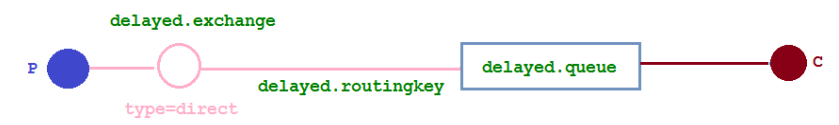

# 2.0 客户端开发向导

## 连接RabbitMQ

如果在使用Channel的时候其已经处于关闭状态，那么程序将会抛出`ShutdownSignalException`异常，或者通过捕获IOException或者SocketException来防止Connection意外关闭

## 使用交换机和队列

```java
Channel channel = connection.createChannel();
channel.exchangeDeclare("ex1", "direct", true);
String queueName = channel.queueDeclare().getQueue();
channel.queueBind(queueName, "ex1", "r1");
```

这里创建了**一个持久化的，非自动删除的，绑定类型为direct的交换机**

同时创建了**一个非持久化、排他的、自动删除的队列**

**同一个Connection的不同Channel可公用，并且会在应用连接断开时自动删除**

```java
Channel channel = connection.createChannel();
channel.exchangeDeclare("ex1", "direct", true);
channel.queueDeclare("queue1", true, false, false, null);
channel.queueBind("queue1", "ex1", "r1");
```

这个队列是**持久化的、非排他的、非自动删除的**

### exchangeDeclare方法详解

```java
Exchange.DeclareOk exchangeDeclare(String exchange,
                                   String type,
                                   boolean durable,
                                   boolean autoDelete,
                                   boolean internal,
                                   Map<String, Object> arguments) throws IOException;
```

返回值是**Exchange.DeclareOK**，用来**标识成功声明了一个交换机**

参数介绍——

* exchange：交换机名称

* type：交换机类型

* durable：设置是否持久化

  > 持久化可以将交换机存盘，**在服务器重启的时候**不会丢失相关信息

* autoDelete：设置是否自动删除

  > 自动删除的前提是**至少有一个队列或者交换机**于这个交换机绑定，如果这些队列和交换机取消绑定后，**自动删除这个交换机**

* internal：设置是否是内置的

  > 内置的交换机，客户端程序**无法直接发消息到这个交换机**，只能通过**交换机路由到交换机**这种方式

* argument：其他一些结构化参数

```java
void exchangeDeclareNoWait(String exchange,
                           String type,
                           boolean durable,
                           boolean autoDelete,
                           boolean internal,
                           Map<String, Object> arguments) throws IOException;
```

这个exchangeDeclareNoWait多设置一个nowait参数，意思是**不需要服务器返回，这个方法返回的是void**

因为没有返回值，如果用户声明完一个交换机之后（**实际服务器还并没有完成交换机的创建**），那么必然会发生异常

```java
Exchange.DeleteOk exchangeDelete(String exchange, boolean ifUnused) throws IOException;

void exchangeDeleteNoWait(String exchange, boolean ifUnused) throws IOException;
```

参数ifUnused表示**是否在交换机没有被使用时删除**

```java
Exchange.DeclareOk exchangeDeclarePassive(String name) throws IOException;
```

### queueDeclare方法详解

```java
Queue.DeclareOk queueDeclare() throws IOException;

Queue.DeclareOk queueDeclare(String queue, boolean durable, boolean exclusive, boolean autoDelete,
                             Map<String, Object> arguments) throws IOException;
```

不带参数的queueDeclare方法**默认**创建一个**由RabbitMQ命名的、排他的、自动删除的、非持久化的队列**

参数介绍——

* queue：队列名称

* durable：设置是否持久化

* exclusive：设置是否排他

  > 如果一个队列被声明为排他队列，该队列**仅对首次声明它的连接可见**，并在**连接断开时自动删除**
  >
  > 首次指如果一个连接已经声明了一个排他队列，**其他连接不允许建立同名的排他队列**，这与普通队列
  >
  > 即使该队列是持久化的，**一旦连接关闭或者客户端退出，该排他队列都会被自动删除**

* autoDelete：设置是否自动删除

* arguments：设置队列其他参数

```java
void queueDeclareNoWait(String queue, boolean durable, boolean exclusive, boolean autoDelete,
                        Map<String, Object> arguments) throws IOException;
```

```java
Queue.DeclareOk queueDeclarePassive(String queue) throws IOException;
```

```java
Queue.DeleteOk queueDelete(String queue, boolean ifUnused, boolean ifEmpty) throws IOException;

void queueDeleteNoWait(String queue, boolean ifUnused, boolean ifEmpty) throws IOException;
```

**queuePurge可以清空队列中的所有信息但是不删除这个队列**

```java
Queue.PurgeOk queuePurge(String queue) throws IOException;
```

### queueBind方法详解

```java
Queue.BindOk queueBind(String queue, String exchange, String routingKey, Map<String, Object> arguments) throws IOException;

void queueBindNoWait(String queue, String exchange, String routingKey, Map<String, Object> arguments) throws IOException;
```

参数介绍——

* queue：队列名称
* exchange：交换机的名称
* routingKey：用来绑定队列和交换机的路由键
* argument：定义绑定的一些参数

```java
Queue.UnbindOk queueUnbind(String queue, String exchange, String routingKey, Map<String, Object> arguments) throws IOException;
```

### exchangeBind方法详解

```java
Exchange.BindOk exchangeBind(String destination, String source, String routingKey, Map<String, Object> arguments) throws IOException;

void exchangeBindNoWait(String destination, String source, String routingKey, Map<String, Object> arguments) throws IOException;
```

destination——>source，将两个交换机绑定

## 何时创建

RabbitMQ的消息存储队列中，交换机的使用**并不真正的消耗服务器的性能**，而**队列会**

衡量RabbitMQ**当前的QPS只需要看队列即可**

## 发送消息

```java
byte[] bytes = "Hello world!".getBytes(StandardCharsets.UTF_8);
channel.basicPublish("ex1", "r1", null, bytes);
```

```java
channel.basicPublish("ex1", "r1", false, MessageProperties.PERSISTENT_TEXT_PLAIN, bytes);
```

```java
channel.basicPublish("ex1", "r1", new AMQP.BasicProperties().builder()
                     .contentType("text/plain")
                     .deliveryMode(2)
                     .priority(1)
                     .userId("hidden")
                     .build(), bytes);
```

```java
Map<String, Object> headers = new HashMap<>();
        headers.put("location", "here");
        headers.put("time", "now");
        channel.basicPublish("ex1", "r1", new AMQP.BasicProperties().builder()
                .headers(headers).build(), bytes);
```

```java
channel.basicPublish("ex1", "r1", new AMQP.BasicProperties().builder().expiration("60000").build(), bytes );
```

参数介绍——

* exchange：交换机的名称

* routingKey：路由键

* props：消息的基本属性集

  > contentType\contentEncoding\headers\deliveryMode\priority\correlationId\replyTo\expiration\messageId\timestamp\type\userId\appId\clusterId

* body：消息体

* mandatory和immediate

## 消费消息

RabbitMQ的消费模式分两种：推（push）模式和拉（pull）模式

### 推模式

接收消息一般通过**实现Consumer接口或者集成DefualtConsumer类**来实现

```java
boolean autoAck = false;
channel.basicQos(64);
channel.basicConsume("queue1", autoAck, "ct1", 
                     new DefaultConsumer(channel) {
                         @Override
                         public void handleDelivery(String consumerTag, Envelope envelope, AMQP.BasicProperties properties, byte[] body) throws IOException {
                             String routingKey = envelope.getRoutingKey();
                             String contentType = properties.getContentType();
                             long deliveryTag = envelope.getDeliveryTag();
                             channel.basicAck(deliveryTag, false);
                         }
                     });
```

参数介绍——

* queue：队列名称
* autoAck：设置是否自动确认
* comsumerTag：消费者标签，**用来区分多个消费者**
* noLocal：设置为true则表示**不能将同一个Connection中生产者发送的信息传送给这个Connection中的消费者**
* exclusive：设置是否排他
* arguments：设置消费者的其他参数
* callback：设置消费者的回调函数，用来处理RabbitMQ推送过来的消息

### 拉模式

通过`channel.basicGet`可以单条获取消息

```java
GetResponse basicGet(String queue, boolean autoAck) throws IOException;
```

返回值是GetResponse


如果想要从队列中获取单条消息，那么必须通过Basic.Get方法来获取，**但是不能通过循环批量获取，这样严重损耗RabbitMQ性能**

## 消费端的确认与拒绝

当autoAck参数设置为false，对于RabbitMQ服务端而言，队列中的消息分成了两个部分，**一部分是等待投递给消费者的消息**，**一部分是已经投递给消费者，但是没有收到消费者确认信号的消息**

如果RabbitMQ**一直收不到消费者的确认信号**，并且**消费此消息的消费者已经断开连接**，则RabbitMQ会**安排此消息重新进入队列**

```java
void basicReject(long deliveryTag, boolean requeue) throws IOException;
```

参数介绍——

deliveryTag：消息编号64位长整型

requeue：设置是否重新入队

```java
void basicNack(long deliveryTag, boolean multiple, boolean requeue)
    throws IOException;
```

批量拒绝消息

# RabbitMQ进阶

## 消息何去何从

### mandatory参数

当mandatory参数设置为true时，**交换机无法根据自身的类型和路由键找到一个符合条件的队列**，那么RabbitMQ就会调用**Basic.Return**命令**将消息返回给生产者**

```java
public class MandatoryDemo {
    public static void main(String[] args) throws IOException, TimeoutException {
        ConnectionFactory connectionFactory = new ConnectionFactory();
        connectionFactory.setUsername("root");
        connectionFactory.setPassword("123123");
        connectionFactory.setVirtualHost("center");
        connectionFactory.setHost("mnsx.top");
        connectionFactory.setPort(5672);
        Connection connection = connectionFactory.newConnection();
        Channel channel = connection.createChannel();

        channel.exchangeDeclare("ex1", "direct", false, false, false, null);
        channel.basicPublish("ex1", "", true, MessageProperties.PERSISTENT_TEXT_PLAIN, "mandatory test".getBytes(StandardCharsets.UTF_8));
        channel.addReturnListener(new ReturnListener() {
            @Override
            public void handleReturn(int replyCode, String replyText, String exchange, String routingKey, AMQP.BasicProperties properties, byte[] body) throws IOException {
                String message = new String(body);
                System.out.println("Basic.Return返回的结果是：" + message);
            }
        });
    }
}
```

### immediate参数

当immediate参数被设为true时，如果**交换机在将消息路由到队列时**发现队列上**不存在任何消费者**，那么这条消息将不会存入队列中

RabbitMQ3.0开始去掉了immediate参数的支持，对此RabbitMQ官方解释，**immediate参数会影响镜像队列的性能，增加代码复杂性，建议采用TTL和DLX的方法替代**

### 备份交换机

备份交换机也被称为AE，它会将**未被路由的消息存储在RabbitMQ中**，再在需要的时候去处理这些信息

可以通过声明交换机的时候，添加`alternate-excahgne`参数来实现，也可以通过策略（跳过）的方式实现，如果两者同时使用，**前者优先级更高**

```java
public class AlternateExchange {
    public static void main(String[] args) throws IOException, TimeoutException {
        ConnectionFactory connectionFactory = new ConnectionFactory();
        connectionFactory.setUsername("root");
        connectionFactory.setPassword("123123");
        connectionFactory.setVirtualHost("center");
        connectionFactory.setHost("mnsx.top");
        connectionFactory.setPort(5672);
        Connection connection = connectionFactory.newConnection();
        Channel channel = connection.createChannel();

        Map<String, Object> arg = new HashMap<>();
        arg.put("alternate-exchange", "ae1");
        channel.exchangeDeclare("ex1", "direct", true, false, arg);
        channel.exchangeDeclare("ae1", "fanout", false, false, null);
        channel.queueDeclare("queue1", true, false, false, null);
        channel.queueBind("queue1", "ex1", "key1");
        channel.queueDeclare("aeQueue", true, false, false, null);
        channel.queueBind("aeQueue", "ae1", "");

        channel.basicPublish("ex1", "key2", MessageProperties.PERSISTENT_TEXT_PLAIN, "hello world".getBytes(StandardCharsets.UTF_8));
    }
}
```

* 如果设置的备份交换机不存在，客户端和RabbitMQ服务端都不会由异常出现，此时消息会丢失
* 如果备份交换机没有绑定任何队列，客户端和RabbitMQ服务端都不会有异常出现，此时消息会丢失

* 如果备份交换机没有任何匹配的队列，客户端和RabbitMQ服务端都不会有异常小狐仙此时消息会丢失
* 如果备份交换机和mandatory一起使用，那么mandatory参数无效

## 过期时间

### 设置消息的TTL

两种方法可以设置消息的TTL

* 通过队列属性设置，队列中所有的消息都有相同的过期时间
* 对消息本身进行单独设置，每条消息的TTL可以不同

如果两个都设置，那么以两个中数值最小的为准

通过队列属性设置消息TTL的方法在queueuDeclare中，通过x-message-ttl参数实现，单位是ms

```java
public class TTLQueueDemo {
    public static void main(String[] args) throws IOException, TimeoutException {
        Channel channel = MqInit.getChannel();
        Map<String, Object> arg = new HashMap<>();
        arg.put("x-message-ttl", 6000);
        channel.queueDeclare("queue1", false, false, false, arg);
    }
}
```

消息过期后就会成为死信队列

针对每条消息设置TTL的方法是在basicPublish中加入expiration属性参数，单位ms

```java
public class TtlMessageDemo {
    public static void main(String[] args) throws IOException, TimeoutException {
        Channel channel = MqInit.getChannel();
        AMQP.BasicProperties build = new AMQP.BasicProperties.Builder().deliveryMode(2).expiration("6000").build();
//        builder.deliveryMode(2); // 持久化消息
//        builder.expiration("6000");
//        AMQP.BasicProperties build = builder.build();
        channel.basicPublish("ex1", "key1", false, build, "ttl".getBytes(StandardCharsets.UTF_8));
    }
}
```

第一种方法如果过期，那么队列中的消息将会被删除，第二种方法如果过期，不会立即删除，会在被消费者消费之前才进行删除

### 设置队列的TTL

通过queueDeclare方法中x-expires参数可以空置队列被自动删除前未使用状态的时间

用于表示过期时间的x-expires参数以ms为单位，不能设置为0

```java
public class QueueTtlDemo {
    public static void main(String[] args) throws IOException, TimeoutException {
        Channel channel = MqInit.getChannel();
        Map<String, Object> arg = new HashMap<>();
        arg.put("x-expires", 1800000);
        channel.queueDeclare("queue1", false, false, false, arg);
    }
}
```

## 死信队列

DLX，Dead-Letter-Exchange，可以称之为私信交换机

当一个消息在一个队列中变成死信之后，他能被重新发送到另一个交换机中，这个交换机就是DLX，绑定DLX的队列就是死信队列

* 消息被拒绝，并设置了requeue参数为false
* 消息过期
* 队列长度达到最大值

通过在queueDeclare方法中设置x-dead-letter-exchange参数来为这个队列添加DLX

```java
public class DlxDemo {
    public static void main(String[] args) throws IOException, TimeoutException {
        Channel channel = MqInit.getChannel();
        channel.exchangeDeclare("de", "direct");
        HashMap<String, Object> arg = new HashMap<>();
        arg.put("x-dead-letter-exchange", "dx");
        channel.queueDeclare("queue1", false, false, false, arg);
    }
}
```

也可以为这个DLX指定路由键，如果没有特殊指定，则使用原队列的路由键

```java
args.put("x-dead-letter-routing-key", "drk")
```

```java
public class DlxTtlDemo {
    public static void main(String[] args) throws IOException, TimeoutException {
        Channel channel = MqInit.getChannel();
        channel.exchangeDeclare("dlx", "direct", true);
        channel.exchangeDeclare("ex1", "fanout", true);
        HashMap<String, Object> arg = new HashMap<>();
        arg.put("x-message-ttl", 1000);
        arg.put("x-dead-letter-exchange", "dlx");
        arg.put("x-dead-letter-routing-key", "key1");
        channel.queueDeclare("queue1", true, false, false, arg);
        channel.queueDeclare("dlq", true, false, false, null);
        channel.queueBind("queue1", "ex1", "");
        channel.queueBind("dlq", "dlx", "key1");
        channel.basicPublish("ex1", "xx", MessageProperties.PERSISTENT_TEXT_PLAIN, "test".getBytes());
    }
}
```

## 优先级队列

具有高优先级的队列具有高的优先权，优先级高的消息具备优先被消费的特权

可以通过**设置x-max-pririty参数来实现**

```java
public class PriorityDemo {
    public static void main(String[] args) throws IOException, TimeoutException {
        Channel channel = MqInit.getChannel();
        HashMap<String, Object> arg = new HashMap<>();
        arg.put("x-max-priority", 10);
        channel.queueDeclare("queue1", true, false, false, arg);
    }
}
```

还可以通过参数设置消息优先级

```java
public class PriorityDemo {
    public static void main(String[] args) throws IOException, TimeoutException {
        Channel channel = MqInit.getChannel();
        AMQP.BasicProperties properties = new AMQP.BasicProperties.Builder().priority(5).build();
        channel.basicPublish("ex1", "key1", properties, "xxx".getBytes(StandardCharsets.UTF_8));
    }
}
```

## 持久化

* 交换机持久化

  声明交换机时，将durable参数设置为true

* 队列持久化

  声明队列将durable参数设置为true

* 消息持久化

  通过将消息的投递模式改为2即可实现消息持久化，PERSISITENT_TEXT_PLAIN实际上时封装了这个属性

## 生产者确认

### 事务机制

```java
public class Transaction {
    public static void main(String[] args) throws IOException, TimeoutException {
        Channel channel = null;
       try {
           channel = MqInit.getChannel();
           channel.txSelect();
           channel.basicPublish("ex1", "key1", MessageProperties.PERSISTENT_TEXT_PLAIN, "test".getBytes(StandardCharsets.UTF_8));
           channel.txCommit();
       } catch (Exception e) {
           e.printStackTrace();
           channel.txRollback();
       }
    }
}
```

**使用事务会耗尽RabbitMQ的性能**

# 1.0 MQ的相关概念

## MQ介绍

MQ(message queue)，从字面意思上看，本质是个队列，FIFO 先入先出，只不过队列中存放的内容是 message 而已，还是一种跨进程的通信机制，用于上下游传递消息。在互联网架构中，MQ 是一种非常常
见的上下游“逻辑解耦+物理解耦”的消息通信服务。使用了 MQ 之后，消息发送上游只需要依赖 MQ，不 用依赖其他服务。

## MQ的优势

1. 流量消峰

   举个例子，如果订单系统最多能处理一万次订单，这个处理能力应付正常时段的下单时绰绰有余，正常时段我们下单一秒后就能返回结果。但是在高峰期，如果有两万次下单操作系统是处理不了的，只能限制订单超过一万后不允许用户下单。使用消息队列做缓冲，我们可以取消这个限制，把一秒内下的订单分散成一段时间来处理，这时有些用户可能在下单十几秒后才能收到下单成功的操作，但是比不能下单的体验要好。

2. 应用解耦

   以电商应用为例，应用中有订单系统、库存系统、物流系统、支付系统。用户创建订单后，如果耦合调用库存系统、物流系统、支付系统，任何一个子系统出了故障，都会造成下单操作异常。当转变成基于消息队列的方式后，系统间调用的问题会减少很多，比如物流系统因为发生故障，需要几分钟来修复。在这几分钟的时间里，物流系统要处理的内存被缓存在消息队列中，用户的下单操作可以正常完成。当物流系统恢复后，继续处理订单信息即可，中单用户感受不到物流系统的故障，提升系统的可用性。

3. 异步处理

   有些服务间调用是异步的，例如 A 调用 B，B 需要花费很长时间执行，但是 A 需要知道 B 什么时候可以执行完，以前一般有两种方式，A 过一段时间去调用 B 的查询 api 查询。或者 A 提供一个 callback api， B
   执行完之后调用 api 通知 A 服务。这两种方式都不是很优雅，使用消息总线，可以很方便解决这个问题，A 调用 B 服务后，只需要监听 B 处理完成的消息，当 B 处理完成后，会发送一条消息给 MQ，MQ 会将此消息转发给 A
   服务。这样 A 服务既不用循环调用 B 的查询 api，也不用提供 callback api。同样 B 服务也不用做这些操作。A 服务还能及时的得到异步处理成功的消息。

## MQ的分类

* ActiveMQ

  优点：单机吞吐量万级，时效性 ms 级，可用性高，基于主从架构实现高可用性，消息可靠性较 低的概率丢失数据 缺点:官方社区现在对 ActiveMQ 5.x 维护越来越少，高吞吐量场景较少使用。

* kafka

  大数据的杀手锏，谈到大数据领域内的消息传输，则绕不开 Kafka，这款为大数据而生的消息中间件，以其百万级 TPS 的吞吐量名声大噪，迅速成为大数据领域的宠儿，在数据采集、传输、存储的过程中发挥着举足轻重的作用。目前已经被
  LinkedIn，Uber, Twitter, Netflix 等大公司所采纳。 优点: 性能卓越，单机写入 TPS 约在百万条/秒，最大的优点，就是吞吐量高。时效性 ms 级可用性非常高，kafka
  是分布式的，一个数据多个副本，少数机器宕机，不会丢失数据，不会导致不可用,消费者采用 Pull 方式获取消息, 消息有序, 通过控制能够保证所有消息被消费且仅被消费一次;有优秀的第三方Kafka Web 管理界面
  Kafka-Manager；在日志领域比较成熟，被多家公司和多个开源项目使用；功能支持：功能较为简单，主要支持简单的 MQ 功能，在大数据领域的实时计算以及日志采集被大规模使用 缺点：Kafka 单机超过 64 个队列/分区，Load
  会发生明显的飙高现象，队列越多，load 越高，发送消息响应时间变长，使用短轮询方式，实时性取决于轮询间隔时间，消费失败不支持重试；支持消息顺序，但是一台代理宕机后，就会产生消息乱序，社区更新较慢；

* RocketMQ

  RocketMQ 出自阿里巴巴的开源产品，用 Java 语言实现，在设计时参考了 Kafka，并做出了自己的一些改进。被阿里巴巴广泛应用在订单，交易，充值，流计算，消息推送，日志流式处理，binglog 分发等场景。

  优点:**单机吞吐量十万级**,可用性非常高，分布式架构,**消息可以做到** **0** **丢失****,**MQ 功能较为完善，还是分布式的，扩展性好,**支持** **10** **亿级别的消息堆积**
  ，不会因为堆积导致性能下降,源码是 java 我们可以自己阅读源码，定制自己公司的 MQ

  缺点：**支持的客户端语言不多**，目前是 java 及 c++，其中 c++不成熟；社区活跃度一般,没有在 MQ核心中去实现 JMS 等接口,有些系统要迁移需要修改大量代码

* RabbitMQ

  2007 年发布，是一个在 AMQP(高级消息队列协议)基础上完成的，可复用的企业消息系统，是**当前最****主流的消息中间件之一**。

  优点:由于 erlang 语言的**高并发特性**，性能较好；**吞吐量到万级**，MQ 功能比较完备,健壮、稳定、易用、跨平台、**支持多种语言**
  如：Python、Ruby、.NET、Java、JMS、C、PHP、ActionScript、XMPP、STOMP等，支持 AJAX 文档齐全；开源提供的管理界面非常棒，用起来很好用,**社区活跃度高**；更新频率相当高

  缺点：商业版需要收费,学习成本较高

# RabbitMQ

## RabbitMQ的概念

RabbitMQ 是一个消息中间件：它接受并转发消息。你可以把它当做一个快递站点，当你要发送一个包裹时，你把你的包裹放到快递站，快递员最终会把你的快递送到收件人那里，按照这种逻辑 RabbitMQ
是一个快递站，一个快递员帮你传递快件。RabbitMQ 与快递站的主要区别在于，它不处理快件而是接收，存储和转发消息数据。

## 四大核心概念

* 生产者

  产生数据发送消息的程序是生产者

* 交换机

  交换机是 RabbitMQ
  非常重要的一个部件，一方面它接收来自生产者的消息，另一方面它将消息推送到队列中。交换机必须确切知道如何处理它接收到的消息，是将这些消息推送到特定队列还是推送到多个队列，亦或者是把消息丢弃，这个得有交换机类型决定

* 队列

  队列是 RabbitMQ 内部使用的一种数据结构，尽管消息流经 RabbitMQ
  和应用程序，但它们只能存储在队列中。队列仅受主机的内存和磁盘限制的约束，本质上是一个大的消息缓冲区。许多生产者可以将消息发送到一个队列，许多消费者可以尝试从一个队列接收数据。这就是我们使用队列的方式

* 消费者

  消费与接收具有相似的含义。消费者大多时候是一个等待接收消息的程序。请注意生产者，消费者和消息中间件很多时候并不在同一机器上。同一个应用程序既可以是生产者又是可以是消费者。

## Rabbit核心部分


## 常用名词解释


* **Broker**：接收和分发消息的应用，RabbitMQ Server 就是 Message Broker
* **Virtual host**：出于多租户和安全因素设计的，把 AMQP 的基本组件划分到一个虚拟的分组中，类似于网络中的 namespace 概念。当多个不同的用户使用同一个 RabbitMQ server
  提供的服务时，可以划分出多个 vhost，每个用户在自己的 vhost 创建 exchange／queue 等
* **Connection**：publisher／consumer 和 broker 之间的 TCP 连接
* **Channel**：如果每一次访问 RabbitMQ 都建立一个 Connection，在消息量大的时候建立 TCP Connection 的开销将是巨大的，效率也较低。Channel 是在 connection
  内部建立的逻辑连接，如果应用程序支持多线程，通常每个 thread 创建单独的 channel 进行通讯，AMQP method 包含了 channel id 帮助客户端和 message broker 识别 channel，所以
  channel 之间是完全隔离的。**Channel 作为轻量级的Connection 极大减少了操作系统建立 TCP connection 的开销**
* **Exchange**：message 到达 broker 的第一站，根据分发规则，匹配查询表中的 routing key，分发消息到 queue 中去。常用的类型有：direct (point-to-point), topic (
  publish-subscribe) and fanout (multicast)
* **Queue**：消息最终被送到这里等待 consumer 取走
* **Binding**：exchange 和 queue 之间的虚拟连接，binding 中可以包含 routing key，Binding 信息被保存到 exchange 中的查询表中，用于 message 的分发依据

## 安装


开启web管理插件

`rabbitmq-plugins enable rabbitmq_management`

添加一个新的用户

* 创建账号

  `rabbitmqctl add_user mnsx 123123`

* 设置用户角色

  `rabbitmqctl set_user_tags admin administrator`

* 设置用户权限

  `set_permissions [-p <vhostpath>] <user> <conf> <write> <read>`

  `rabbitctl set_permissions -p "/" admin ".*" ".*" ".*"`

  用户user_admin具有/vhost1这个virtual host中所有的配置、写、读权限

* 展示当前用户和角色

  `rabbitmqctl list_users`

重置命令

* 关闭应用

  `rabbitmqctl stop_app`

* 清楚命令

  `rabbitmqctl reset`

* 重新启动命令

  `rabbitmqctl start_app`

# 默认模式

在下图中，“ P”是我们的生产者，“ C”是我们的消费者。中间的框是一个队列-RabbitMQ 代 表使用者保留的消息缓冲区


* 添加依赖

  ```xml
  <!--指定 jdk 编译版本-->
  <build>
   <plugins>
   <plugin>
   <groupId>org.apache.maven.plugins</groupId>
   <artifactId>maven-compiler-plugin</artifactId>
   <configuration>
   <source>8</source>
   <target>8</target>
   </configuration>
   </plugin>
   </plugins>
  </build>
  <dependencies>
   <!--rabbitmq 依赖客户端-->
   <dependency>
   <groupId>com.rabbitmq</groupId>
   <artifactId>amqp-client</artifactId>
   <version>5.8.0</version>
   </dependency>
   <!--操作文件流的一个依赖-->
   <dependency>
   <groupId>commons-io</groupId>
   <artifactId>commons-io</artifactId>
   <version>2.6</version>
   </dependency>
  </dependencies>
  ```

* 消息生产者

  ```java
  public class Producer {
   private final static String QUEUE_NAME = "hello";
   public static void main(String[] args) throws Exception {
   //创建一个连接工厂
   ConnectionFactory factory = new ConnectionFactory();
   factory.setHost("182.92.234.71");
   factory.setUsername("admin");
   factory.setPassword("123");
   //channel 实现了自动 close 接口 自动关闭 不需要显示关闭
   try(Connection connection = factory.newConnection();Channel channel = 
  connection.createChannel()) {
   /**
   * 生成一个队列
   * 1.队列名称
   * 2.队列里面的消息是否持久化 默认消息存储在内存中
   * 3.该队列是否只供一个消费者进行消费 是否进行共享 true 可以多个消费者消费
   * 4.是否自动删除 最后一个消费者端开连接以后 该队列是否自动删除 true 自动删除
   * 5.其他参数
   */
   channel.queueDeclare(QUEUE_NAME,false,false,false,null);
   String message="hello world";
   /**
   * 发送一个消息
   * 1.发送到那个交换机
   * 2.路由的 key 是哪个
   * 3.其他的参数信息
   * 4.发送消息的消息体
   */
   channel.basicPublish("",QUEUE_NAME,null,message.getBytes());
   System.out.println("消息发送完毕");
   }
   }
  }
  ```

* 消息消费者

  ```java
  public class Consumer {
   private final static String QUEUE_NAME = "hello";
   public static void main(String[] args) throws Exception {
   ConnectionFactory factory = new ConnectionFactory();
   factory.setHost("182.92.234.71");
   factory.setUsername("admin");
   factory.setPassword("123");
   Connection connection = factory.newConnection();
   Channel channel = connection.createChannel();
   System.out.println("等待接收消息....");
   //推送的消息如何进行消费的接口回调
   DeliverCallback deliverCallback=(consumerTag,delivery)->{
   String message= new String(delivery.getBody());
   System.out.println(message);
   };
   //取消消费的一个回调接口 如在消费的时候队列被删除掉了
   CancelCallback cancelCallback=(consumerTag)->{
   System.out.println("消息消费被中断");
   };
       /**
   * 消费者消费消息
   * 1.消费哪个队列
   * 2.消费成功之后是否要自动应答 true 代表自动应答 false 手动应答
   * 3.消费者未成功消费的回调
   */
   channel.basicConsume(QUEUE_NAME,true,deliverCallback,cancelCallback);
   }
  }
  ```

# 工作队列

工作队列(又称任务队列)的主要思想是避免立即执行资源密集型任务，而不得不等待它完成。 相反我们安排任务在之后执行。我们把任务封装为消息并将其发送到队列。在后台运行的工作进
程将弹出任务并最终执行作业。当有多个工作线程时，这些工作线程将一起处理这些任务。

## 轮询分发消息

* 抽取工具类

  ```java
  public class RabbitMqUtils {
   //得到一个连接的 channel
   public static Channel getChannel() throws Exception{
   //创建一个连接工厂
   ConnectionFactory factory = new ConnectionFactory();
   factory.setHost("182.92.234.71");
   factory.setUsername("admin");
   factory.setPassword("123");
   Connection connection = factory.newConnection();
   Channel channel = connection.createChannel();
   return channel;
   }
  }
  ```

* 启动两个消费者（工作线程）

  ```java
  public class Worker01 {
   private static final String QUEUE_NAME="hello";
   public static void main(String[] args) throws Exception {
   Channel channel = RabbitMqUtils.getChannel();
   DeliverCallback deliverCallback=(consumerTag,delivery)->{
   String receivedMessage = new String(delivery.getBody());
   System.out.println("接收到消息:"+receivedMessage);
   };
   CancelCallback cancelCallback=(consumerTag)->{
   System.out.println(consumerTag+"消费者取消消费接口回调逻辑");
   };
   System.out.println("C2 消费者启动等待消费......");
   channel.basicConsume(QUEUE_NAME,true,deliverCallback,cancelCallback);
   }
  }
  ```

* 启动一个生产者线程

  ```java
  public class Task01 {
   private static final String QUEUE_NAME="hello";
   public static void main(String[] args) throws Exception {
   try(Channel channel=RabbitMqUtils.getChannel();) {
   channel.queueDeclare(QUEUE_NAME,false,false,false,null);
   //从控制台当中接受信息
   Scanner scanner = new Scanner(System.in);
   while (scanner.hasNext()){
   String message = scanner.next();
   channel.basicPublish("",QUEUE_NAME,null,message.getBytes());
   System.out.println("发送消息完成:"+message);
   }
   }
   }
  }
  ```

* 结果展示

  通过程序执行发现生产者总共发送 4 个消息，消费者 1 和消费者 2 分别分得两个消息，并且 是按照有序的一个接收一次消息

  

# 消息应答

## 概念

消费者完成一个任务可能需要一段时间，如果其中一个消费者处理一个长的任务并仅只完成 了部分突然它挂掉了，会发生什么情况。RabbitMQ 一旦向消费者传递了一条消息，便立即将该消
息标记为删除。在这种情况下，突然有个消费者挂掉了，我们将丢失正在处理的消息。以及后续 发送给该消费这的消息，因为它无法接收到。

为了保证消息在发送过程中不丢失，rabbitmq 引入消息应答机制，消息应答就是:**消费者在接 收到消息并且处理该消息之后，告诉 rabbitmq 它已经处理了，rabbitmq 可以把该消息删除了。**

## 自动应答

消息发送后立即被认为已经传送成功，这种模式需要在**高吞吐量和数据传输安全性方面做权 衡**,因为这种模式如果消息在接收到之前，消费者那边出现连接或者 channel 关闭，那么消息就丢
失了,当然另一方面这种模式消费者那边可以传递过载的消息，**没有对传递的消息数量进行限制**， 当然这样有可能使得消费者这边由于接收太多还来不及处理的消息，导致这些消息的积压，最终 使得内存耗尽，最终这些消费者线程被操作系统杀死，**
所以这种模式仅适用在消费者可以高效并 以某种速率能够处理这些消息的情况下使用**。

## 消息应答的方法

1. `Channel.basicAck`（用于肯定确认）

   RabbitMQ已经知道并且成功的处理消息，可以将其丢弃了

2. `Channel.basicNack`（用于否定确认）

3. `Channel.basicReject`（用于否定确认）

   与Channel.basicNack相比少了一个参数，不处理该消息了直接拒绝可以将其丢弃

## Multiple的解释

**手动应答的好处是可以批量应答并且减少网络拥堵**


multiple 的 true 和 false 代表不同意思

* true 代表批量应答 channel 上未应答的消息

  > 比如说 channel 上有传送 tag 的消息 5,6,7,8 当前 tag 是 8 那么此时 5-8 的这些还未应答的消息都会被确认收到消息应答

* false 同上面相比

  > 只会应答 tag=8 的消息 5,6,7 这三个消息依然不会被确认收到消息应答

## 消息自动重新入队

如果消费者由于某些原因失去连接(其通道已关闭，连接已关闭或 TCP 连接丢失)，导致消息 未发送 ACK 确认，RabbitMQ 将了解到消息未完全处理，并将对其重新排队。如果此时其他消费者
可以处理，它将很快将其重新分发给另一个消费者。这样，即使某个消费者偶尔死亡，也可以确 保不会丢失任何消息。


## 消息手动应答代码

默认消息采用的是自动应答，所以我们要想实现消息消费过程中不丢失，需要把自动应答改 为手动应答，消费者在上面代码的基础上增加下面画红色部分代码。

1. 消费生产者

   ```java
   public class Producers {
   
       private static final String QUEUE_NAME = "hello";
   
       public static void main(String[] args) throws Exception {
           try (Channel channel = RabbitMQUtils.getChannel()) {
               channel.queueDeclare(QUEUE_NAME, false, false, false, null);
   
               Scanner scanner = new Scanner(System.in);
               System.out.println("请输入信息：");
               while (scanner.hasNext()) {
                   String message = scanner.next();
                   channel.basicPublish("", QUEUE_NAME, null, message.getBytes(StandardCharsets.UTF_8));
                   System.out.println("生产者发出消息");
               }
           }
   
   
       }
   }
   ```

2. 消费者1

   ```java
   public class Consumers1 {
       private static final String QUEUE_NAME = "hello";
   
       public static void main(String[] args) throws Exception {
           Channel channel = RabbitMQUtils.getChannel();
   
           System.out.println("c1等待接受消息处理时间较长");
   
           boolean autoAck = false;
           channel.basicConsume(QUEUE_NAME, autoAck, (consumerTag, delivery) -> {
               String message = new String(delivery.getBody());
               SleepUtils.sleep(1);
               System.out.println("接受消息：" + message);
               channel.basicAck(delivery.getEnvelope().getDeliveryTag(), false);
           }, (consumerTag) -> {
               System.out.println(consumerTag + "消费者回调逻辑");
           });
       }
   }
   ```

3. 消费者2

   ```java
   public class Consumers2 {
       private static final String QUEUE_NAME = "hello";
   
       public static void main(String[] args) throws Exception {
           Channel channel = RabbitMQUtils.getChannel();
   
           System.out.println("c2等待接受消息处理时间较短");
   
           boolean autoAck = false;
           channel.basicConsume(QUEUE_NAME, autoAck, (consumerTag, delivery) -> {
               String message = new String(delivery.getBody());
               SleepUtils.sleep(10);
               System.out.println("接受消息：" + message);
               channel.basicAck(delivery.getEnvelope().getDeliveryTag(), false);
           }, (consumerTag) -> {
               System.out.println(consumerTag + "消费者回调逻辑");
           });
       }
   }
   ```

4. 睡眠工具类

   ```java
   public class SleepUtils {
       public static void sleep(int second) {
           try {
               Thread.sleep(second * 1000);
           } catch (InterruptedException e) {
               Thread.currentThread().interrupt();
           }
       }
   }
   ```

# RabbitMQ持久化

## 概念

刚刚我们已经看到了如何处理任务不丢失的情况，但是如何保障当 RabbitMQ 服务停掉以后消 息生产者发送过来的消息不丢失。默认情况下 RabbitMQ 退出或由于某种原因崩溃时，它忽视队列
和消息，除非告知它不要这样做。确保消息不会丢失需要做两件事：我们需要将队列和消息都标 记为持久化。

## 队列实现持久化

之前我们创建的队列都是非持久化的，rabbitmq 如果重启的化，该队列就会被删除掉，如果 要队列实现持久化 需要在声明队列的时候把 durable 参数设置为持久化


但是需要注意的就是如果之前声明的队列不是持久化的，需要把原先队列先删除，或者重新 创建一个持久化的队列，不然就会出现错误


## 消息实现持久化

要想让消息实现持久化需要在消息生产者修改代码，MessageProperties.PERSISTENT_TEXT_PLAIN 添 加这个属性。


将消息标记为持久化并不能完全保证不会丢失消息。尽管它告诉 RabbitMQ 将消息保存到磁盘，但是 这里依然存在当消息刚准备存储在磁盘的时候 但是还没有存储完，消息还在缓存的一个间隔点。此时并没
有真正写入磁盘。持久性保证并不强，但是对于我们的简单任务队列而言，这已经绰绰有余了。如果需要 更强有力的持久化策略：发布确认

```java
public class Producers {

    private static final String QUEUE_NAME = "hello";

    public static void main(String[] args) throws Exception {
        try (Channel channel = RabbitMQUtils.getChannel()) {
            boolean durable = true;
            channel.queueDeclare(QUEUE_NAME, durable, false, false, null);

            Scanner scanner = new Scanner(System.in);
            System.out.println("请输入信息：");
            while (scanner.hasNext()) {
                String message = scanner.next();
                channel.basicPublish("", QUEUE_NAME, MessageProperties.PERSISTENT_TEXT_PLAIN, message.getBytes(StandardCharsets.UTF_8));
                System.out.println("生产者发出消息");
            }
        }


    }
}
```

# 不公平分发

在最开始的时候我们学习到 RabbitMQ 分发消息采用的轮训分发，但是在某种场景下这种策略并不是 很好，比方说有两个消费者在处理任务，其中有个消费者 1 处理任务的速度非常快，而另外一个消费者 2
处理速度却很慢，这个时候我们还是采用轮训分发的化就会到这处理速度快的这个消费者很大一部分时间 处于空闲状态，而处理慢的那个消费者一直在干活，这种分配方式在这种情况下其实就不太好，但是 RabbitMQ
并不知道这种情况它依然很公平的进行分发。

为了避免这种情况，我们可以设置参数 channel.basicQos(1);


意思就是如果这个任务我还没有处理完或者我还没有应答你，你先别分配给我，我目前只能处理一个 任务，然后 rabbitmq 就会把该任务分配给没有那么忙的那个空闲消费者，当然如果所有的消费者都没有完
成手上任务，队列还在不停的添加新任务，队列有可能就会遇到队列被撑满的情况，这个时候就只能添加 新的 worker 或者改变其他存储任务的策略。

```java
public class Consumers1 {
    private static final String QUEUE_NAME = "hello";

    public static void main(String[] args) throws Exception {
        Channel channel = RabbitMQUtils.getChannel();

        System.out.println("c1等待接受消息处理时间较长");

        int prefetchCount = 1;
        channel.basicQos(prefetchCount);

        boolean autoAck = false;
        channel.basicConsume(QUEUE_NAME, autoAck, (consumerTag, delivery) -> {
            String message = new String(delivery.getBody());
            SleepUtils.sleep(1);
            System.out.println("接受消息：" + message);
            channel.basicAck(delivery.getEnvelope().getDeliveryTag(), false);
        }, (consumerTag) -> {
            System.out.println(consumerTag + "消费者回调逻辑");
        });
    }
}
```

```java
public class Consumers2 {
    private static final String QUEUE_NAME = "hello";

    public static void main(String[] args) throws Exception {
        Channel channel = RabbitMQUtils.getChannel();

        System.out.println("c2等待接受消息处理时间较短");

        int prefetchCount = 1;
        channel.basicQos(prefetchCount);

        boolean autoAck = false;
        channel.basicConsume(QUEUE_NAME, autoAck, (consumerTag, delivery) -> {
            String message = new String(delivery.getBody());
            SleepUtils.sleep(10);
            System.out.println("接受消息：" + message);
            channel.basicAck(delivery.getEnvelope().getDeliveryTag(), false);
        }, (consumerTag) -> {
            System.out.println(consumerTag + "消费者回调逻辑");
        });
    }
}
```

# 预取值

> 本身消息的发送就是异步发送的，所以在任何时候，channel 上肯定不止只有一个消息另外来自消费 者的手动确认本质上也是异步的。因此这里就存在一个未确认的消息缓冲区，因此希望开发人员能限制此 缓冲区的大小，以避免缓冲区里面无限制的未确认消息问题。这个时候就可以通过使用 basic.qos 方法设 置“预取计数”值来完成的。该值定义通道上允许的未确认消息的最大数量。一旦数量达到配置的数量， RabbitMQ 将停止在通道上传递更多消息，除非至少有一个未处理的消息被确认，例如，假设在通道上有 未确认的消息 5、6、7，8，并且通道的预取计数设置为 4，此时 RabbitMQ 将不会在该通道上再传递任何 消息，除非至少有一个未应答的消息被 ack。比方说 tag=6 这个消息刚刚被确认 ACK，RabbitMQ 将会感知 这个情况到并再发送一条消息。消息应答和 QoS 预取值对用户吞吐量有重大影响。通常，增加预取将提高 向消费者传递消息的速度。虽然自动应答传输消息速率是最佳的，但是，在这种情况下已传递但尚未处理 的消息的数量也会增加，从而增加了消费者的 RAM 消耗(随机存取存储器)应该小心使用具有无限预处理 的自动确认模式或手动确认模式，消费者消费了大量的消息如果没有确认的话，会导致消费者连接节点的 内存消耗变大，所以找到合适的预取值是一个反复试验的过程，不同的负载该值取值也不同 100 到 300 范 围内的值通常可提供最佳的吞吐量，并且不会给消费者带来太大的风险。预取值为 1 是最保守的。当然这 将使吞吐量变得很低，特别是消费者连接延迟很严重的情况下，特别是在消费者连接等待时间较长的环境 中。对于大多数应用来说，稍微高一点的值将是最佳的。


个人感觉类似于权值的含义

```java
public class Consumers1 {
    private static final String QUEUE_NAME = "hello";

    public static void main(String[] args) throws Exception {
        Channel channel = RabbitMQUtils.getChannel();

        System.out.println("c1等待接受消息处理时间较长");

        int prefetchCount = 2;
        channel.basicQos(prefetchCount);

        boolean autoAck = false;
        channel.basicConsume(QUEUE_NAME, autoAck, (consumerTag, delivery) -> {
            String message = new String(delivery.getBody());
            SleepUtils.sleep(1);
            System.out.println("接受消息：" + message);
            channel.basicAck(delivery.getEnvelope().getDeliveryTag(), false);
        }, (consumerTag) -> {
            System.out.println(consumerTag + "消费者回调逻辑");
        });
    }
}
```

```java
public class Consumers2 {
    private static final String QUEUE_NAME = "hello";

    public static void main(String[] args) throws Exception {
        Channel channel = RabbitMQUtils.getChannel();

        System.out.println("c2等待接受消息处理时间较短");

        int prefetchCount = 5;
        channel.basicQos(prefetchCount);

        boolean autoAck = false;
        channel.basicConsume(QUEUE_NAME, autoAck, (consumerTag, delivery) -> {
            String message = new String(delivery.getBody());
            SleepUtils.sleep(10);
            System.out.println("接受消息：" + message);
            channel.basicAck(delivery.getEnvelope().getDeliveryTag(), false);
        }, (consumerTag) -> {
            System.out.println(consumerTag + "消费者回调逻辑");
        });
    }
}
```

# 确认发布

## 确认发布原理

生产者将信道设置成 confirm 模式，一旦信道进入 confirm 模式，**所有在该信道上面发布的 消息都将会被指派一个唯一的 ID(从 1 开始)**，一旦消息被投递到所有匹配的队列之后，broker 就会发送一个确认给生产者(
包含消息的唯一 ID)，这就使得生产者知道消息已经正确到达目的队 列了，如果消息和队列是可持久化的，那么确认消息会在将消息写入磁盘之后发出，broker 回传 给生产者的确认消息中 delivery-tag 域包含了确认消息的序列号，此外
broker 也可以设置 basic.ack 的 multiple 域，表示到这个序列号之前的所有消息都已经得到了处理。

confirm 模式最大的好处在于他是异步的，一旦发布一条消息，生产者应用程序就可以在等信 道返回确认的同时继续发送下一条消息，当消息最终得到确认之后，生产者应用便可以通过回调 方法来处理该确认消息，如果 RabbitMQ
因为自身内部错误导致消息丢失，就会发送一条 nack 消 息，生产者应用程序同样可以在回调方法中处理该 nack 消息。

## 发布确认策略

发布确认默认是没有开启的，如果要开启需要调用方法 confirmSelect，每当你要想使用发布 确认，都需要在 channel 上调用该方法


### 单个确认发布

这是一种简单的确认方式，它是一种同步确认发布的方式，也就是发布一个消息之后只有它 被确认发布，后续的消息才能继续发布,waitForConfirmsOrDie(long)这个方法只有在消息被确认
的时候才返回，如果在指定时间范围内这个消息没有被确认那么它将抛出异常。

这种确认方式有一个最大的缺点就是:**发布速度特别的慢**，因为如果没有确认发布的消息就会 阻塞所有后续消息的发布，这种方式最多提供每秒不超过数百条发布消息的吞吐量。当然对于某 些应用程序来说这可能已经足够了。

```java
public class Producer1 {

    private final static int MESSAGE_COUNT = 1000;

    public static void main(String[] args) throws Exception {
        try (Channel channel = RabbitMQUtils.getChannel()) {
            boolean durable = true;
            String queueName = UUID.randomUUID().toString();

            channel.queueDeclare(queueName, durable, false, false, null);
            channel.confirmSelect();

            long begin = System.currentTimeMillis();

            for (int i = 0; i < MESSAGE_COUNT; i++) {
                String message = i + "";
                channel.basicPublish("", queueName, MessageProperties.PERSISTENT_TEXT_PLAIN, message.getBytes(StandardCharsets.UTF_8));
                boolean flag = channel.waitForConfirms();
                if (flag) {
                    System.out.println("消息发送成功");
                }
            }

            long end = System.currentTimeMillis();

            System.out.println("发布" + MESSAGE_COUNT + "个单独确认消息，耗时" + (end - begin) + "ms");
        }


    }
}
```

### 批量确认发布

上面那种方式非常慢，与单个等待确认消息相比，先发布一批消息然后一起确认可以极大地 提高吞吐量，当然这种方式的缺点就是:当发生故障导致发布出现问题时，不知道是哪个消息出现
问题了，我们必须将整个批处理保存在内存中，以记录重要的信息而后重新发布消息。当然这种 方案仍然是同步的，也一样阻塞消息的发布。

```java
public class Producer2 {

    private final static int MESSAGE_COUNT = 1000;

    public static void main(String[] args) throws Exception {
        try (Channel channel = RabbitMQUtils.getChannel()) {
            boolean durable = true;
            String queueName = UUID.randomUUID().toString();

            channel.queueDeclare(queueName, durable, false, false, null);
            channel.confirmSelect();

            long begin = System.currentTimeMillis();

            int batchSize = 100;
            int outStandingMessageCount = 0;

            for (int i = 0; i < MESSAGE_COUNT; i++) {
                String message = i + "";
                channel.basicPublish("", queueName, MessageProperties.PERSISTENT_TEXT_PLAIN, message.getBytes(StandardCharsets.UTF_8));
                outStandingMessageCount++;

                if (outStandingMessageCount == batchSize) {
                    channel.waitForConfirms();
                    outStandingMessageCount = 0;
                }
            }

            if (outStandingMessageCount > 0) {
                channel.waitForConfirms();
            }

            long end = System.currentTimeMillis();

            System.out.println("发布" + MESSAGE_COUNT + "个批量确认消息，耗时" + (end - begin) + "ms");
        }


    }
}
```

### 异步确认发布

异步确认虽然编程逻辑比上两个要复杂，但是性价比最高，无论是可靠性还是效率都没得说， 他是利用回调函数来达到消息可靠性传递的，这个中间件也是通过函数回调来保证是否投递成功， 下面就让我们来详细讲解异步确认是怎么实现的。


* 如何处理异步未确定消息

  最好的解决的解决方案就是把未确认的消息放到一个基于内存的能被发布线程访问的队列， 比如说用 ConcurrentLinkedQueue 这个队列在 confirm callbacks 与发布线程之间进行消息的传 递。

```java
public class Producer3 {

    private final static int MESSAGE_COUNT = 1000;

    public static void main(String[] args) throws Exception {
        try (Channel channel = RabbitMQUtils.getChannel()) {
            boolean durable = true;
            String queueName = UUID.randomUUID().toString();

            channel.queueDeclare(queueName, durable, false, false, null);
            channel.confirmSelect();

            ConcurrentSkipListMap<Long, String> map = new ConcurrentSkipListMap<>();

            ConfirmCallback ackCallBack = (sequenceNumber, multiple) -> {
                if (multiple) {
                    ConcurrentNavigableMap<Long, String> outStandingMessageMap = map.headMap(sequenceNumber, true);
                    outStandingMessageMap.clear();
                } else {
                    map.remove(sequenceNumber);
                }
            };

            ConfirmCallback nackCallBack = (sequenceNumber, multiple) -> {
                String message = map.get(sequenceNumber);
                System.out.println("发布消息" + message + "未被确认，序列号" + sequenceNumber);
            };

            channel.addConfirmListener(ackCallBack, nackCallBack);

            long begin = System.currentTimeMillis();

            for (int i = 0; i < MESSAGE_COUNT; i++) {
                String message = i + "";
                map.put(channel.getNextPublishSeqNo(), message);
                channel.basicPublish("", queueName, MessageProperties.PERSISTENT_TEXT_PLAIN, message.getBytes(StandardCharsets.UTF_8));
            }

            long end = System.currentTimeMillis();

            System.out.println("发布" + MESSAGE_COUNT + "个异步确认消息，耗时" + (end - begin) + "ms");
        }


    }
}
```

## 对比三种发布确认速度对比

* 单独发布消息

  同步等待确认，简单，但吞吐量非常有限

* 批量发布消息

  批量同步等待确认，简单，合理的吞吐量，一旦出现问题但很难推断出是哪个消息出现问题

* 异步处理

  最佳性能和资源使用，在出现错误的情况下可以很好地控制，但是实现起来稍微有点难

# 交换机

在上一节中，我们创建了一个工作队列。我们假设的是工作队列背后，每个任务都恰好交付给一个消 费者(工作进程)。在这一部分中，我们将做一些完全不同的事情-我们将消息传达给多个消费者。这种模式 称为 ”发布/订阅”

为了说明这种模式，我们将构建一个简单的日志系统。它将由两个程序组成:第一个程序将发出日志消
息，第二个程序是消费者。其中我们会启动两个消费者，其中一个消费者接收到消息后把日志存储在磁盘，另外一个消费者接收到消息后把消息打印在屏幕上，事实上第一个程序发出的日志消息将广播给所有消费 者者

## Exchanges

### 概念

RabbitMQ 消息传递模型的核心思想是: 生产者生产的消息从不会直接发送到队列。实际上，通常生产 者甚至都不知道这些消息传递传递到了哪些队列中。

相反，生产者只能将消息发送到交换机(exchange)，交换机工作的内容非常简单，一方面它接收来 自生产者的消息，另一方面将它们推入队列。交换机必须确切知道如何处理收到的消息。是应该把这些消
息放到特定队列还是说把他们到许多队列中还是说应该丢弃它们。这就的由交换机的类型来决定。


### Exchange的类型

* 直接（direct）
* 主题（topic）
* 标题（headers）
* 扇出（fanout）

### 无名exchange

在本教程的前面部分我们对 exchange 一无所知，但仍然能够将消息发送到队列。之前能实现的 原因是因为我们使用的是默认交换，我们通过空字符串(“”)进行标识。


第一个参数是交换机的名称。空字符串表示默认或无名称交换机：消息能路由发送到队列中其实 是由 routingKey(bindingkey)绑定 key 指定的，如果它存在的话

## 临时队列

之前的章节我们使用的是具有特定名称的队列(还记得 hello 和 ack_queue 吗？)。队列的名称我们 来说至关重要-我们需要指定我们的消费者去消费哪个队列的消息。

每当我们连接到 Rabbit 时，我们都需要一个全新的空队列，为此我们可以创建一个具有随机名称 的队列，或者能让服务器为我们选择一个随机队列名称那就更好了。其次一旦我们断开了消费者的连 接，队列将被自动删除。

创建临时队列的方式如下:

`String queueName = channel.queueDeclare().getQueue()`


## 绑定

什么是 bingding 呢，binding 其实是 exchange 和 queue 之间的桥梁，它告诉我们 exchange 和那个队 列进行了绑定关系。比如说下面这张图告诉我们的就是 X 与 Q1 和 Q2 进行了绑定


## Fanout

### 简介

Fanout这种类型非常简单，正如从名称中猜到的那样，它是将接收到的所有消息广播到它知道的 所有队列中。系统中默认有些 exchange 类型

```java
public class Producers {

    private static final String EXCHANGE_NAME = "logs";

    public static void main(String[] args) throws Exception {
        try (Channel channel = RabbitMQUtils.getChannel()) {
            channel.exchangeDeclare(EXCHANGE_NAME, "fanout");
            Scanner scanner = new Scanner(System.in);
            System.out.println("请输入信息");
            while (scanner.hasNext()) {
                String message = scanner.nextLine();
                channel.basicPublish(EXCHANGE_NAME, "", null, message.getBytes(StandardCharsets.UTF_8));
                System.out.println("生产者发出消息" + message);
            }
        }
    }
}
```

```java
public class Consumers1 {

    private static final String EXCHANGE_NAME = "logs";

    public static void main(String[] args) throws Exception {
        Channel channel = RabbitMQUtils.getChannel();

        channel.exchangeDeclare(EXCHANGE_NAME, "fanout");

        String queueName = channel.queueDeclare().getQueue();

        channel.queueBind(queueName, EXCHANGE_NAME, "");

        System.out.println("启动成功等待接收消息");

        channel.basicConsume(queueName, true, (consumerTag, delivery) -> {
            String message = new String(delivery.getBody(), "UTF-8");
            System.out.println("Consumers1控制台打印接收到的消息：" + message);
        }, consumerTag -> {});
    }
}
```

```java
public class Consumers2 {

    private static final String EXCHANGE_NAME = "logs";

    public static void main(String[] args) throws Exception {
        Channel channel = RabbitMQUtils.getChannel();

        channel.exchangeDeclare(EXCHANGE_NAME, "fanout");

        String queueName = channel.queueDeclare().getQueue();

        channel.queueBind(queueName, EXCHANGE_NAME, "");

        System.out.println("启动成功等待接收消息");

        channel.basicConsume(queueName, true, (consumerTag, delivery) -> {
            String message = new String(delivery.getBody(), "UTF-8");
            System.out.println("Consum er2控制台打印接收到的消息：" + message);
        }, consumerTag -> {});
    }
}
```

## Direct

### 回顾

在上一节中，我们构建了一个简单的日志记录系统。我们能够向许多接收者广播日志消息。在本 节我们将向其中添加一些特别的功能-比方说我们只让某个消费者订阅发布的部分消息。例如我们只把 严重错误消息定向存储到日志文件(以节省磁盘空间)
，同时仍然能够在控制台上打印所有日志消息。

我们再次来回顾一下什么是 bindings，绑定是交换机和队列之间的桥梁关系。也可以这么理解： **队列只对它绑定的交换机的消息感兴趣**。绑定用参数：routingKey 来表示也可称该参数为 binding key，
创建绑定我们用代码:channel.queueBind(queueName, EXCHANGE_NAME, "routingKey");**绑定之后的 意义由其交换类型决定**。

### 简介

上一节中的我们的日志系统将所有消息广播给所有消费者，对此我们想做一些改变，例如我们希 望将日志消息写入磁盘的程序仅接收严重错误(errros)，而不存储哪些警告(warning)或信息(info)日志 消息避免浪费磁盘空间。Fanout
这种交换类型并不能给我们带来很大的灵活性-它只能进行无意识的 广播，在这里我们将使用 direct 这种类型来进行替换，这种类型的工作方式是，消息只去到它绑定的 routingKey 队列中去。


在上面这张图中，我们可以看到 X 绑定了两个队列，绑定类型是 direct。队列 Q1 绑定键为 orange， 队列 Q2 绑定键有两个:一个绑定键为 black，另一个绑定键为 green.

在这种绑定情况下，生产者发布消息到 exchange 上，绑定键为 orange 的消息会被发布到队列 Q1。绑定键为 blackgreen 和的消息会被发布到队列 Q2，其他消息类型的消息将被丢弃。

### 多从绑定


当然如果 exchange 的绑定类型是 direct，但是它绑定的多个队列的 key 如果都相同，在这种情 况下虽然绑定类型是 direct 但是它表现的就和 fanout 有点类似了，就跟广播差不多，如上图所示。

```java
public class Consumers1 {
    public static final String EXCHANGE_NAME = "direct_logs";

    public static void main(String[] args) throws Exception {
        Channel channel = RabbitMQUtils.getChannel();
        channel.exchangeDeclare(EXCHANGE_NAME, BuiltinExchangeType.DIRECT);
        String queueName = "disk";
        channel.queueDeclare(queueName, false, false, false, null);
        channel.queueBind(queueName, EXCHANGE_NAME, "error");
        System.out.println("等待接收消息");
        channel.basicConsume(queueName, true, (consumerTag, delivery) -> {
            String message = new String(delivery.getBody());
            System.out.println("接受绑定键：" + delivery.getEnvelope().getRoutingKey() + "，消息：" + message);
        }, consumerTag -> {});
    }
}
```

```java
public class Consumers2 {
    public static final String EXCHANGE_NAME = "direct_logs";

    public static void main(String[] args) throws Exception {
        Channel channel = RabbitMQUtils.getChannel();
        channel.exchangeDeclare(EXCHANGE_NAME, BuiltinExchangeType.DIRECT);
        String queueName = "console";
        channel.queueDeclare(queueName, false, false, false, null);
        channel.queueBind(queueName, EXCHANGE_NAME, "info");
        channel.queueBind(queueName, EXCHANGE_NAME, "warning");
        System.out.println("等待接收消息");
        channel.basicConsume(queueName, true, (consumerTag, delivery) -> {
            String message = new String(delivery.getBody());
            System.out.println("接受绑定键：" + delivery.getEnvelope().getRoutingKey() + "，消息：" + message);
        }, consumerTag -> {});
    }
}
```

```java
public class Producers {
    public static final String EXCHANGE_NAME = "direct_logs";

    public static void main(String[] args) throws Exception {
        try (Channel channel = RabbitMQUtils.getChannel()) {
            channel.exchangeDeclare(EXCHANGE_NAME, BuiltinExchangeType.DIRECT);

            Map<String, String> bindingKeyMap = new HashMap<>();
            bindingKeyMap.put("info", "普通info信息");
            bindingKeyMap.put("warning", "警告warning信息");
            bindingKeyMap.put("error", "错误error信息");

            for (Map.Entry<String, String> bindingKeyEntry : bindingKeyMap.entrySet()) {
                String bindingKey = bindingKeyEntry.getKey();
                String message = bindingKeyEntry.getValue();
                channel.basicPublish(EXCHANGE_NAME, bindingKey, null, message.getBytes(StandardCharsets.UTF_8));
                System.out.println("生产者发出消息：" + message);
            }
        }
    }
}
```

## Topics

### 回顾

在上一个小节中，我们改进了日志记录系统。我们没有使用只能进行随意广播的 fanout 交换机，而是 使用了 direct 交换机，从而有能实现有选择性地接收日志。

尽管使用 direct 交换机改进了我们的系统，但是它仍然存在局限性-比方说我们想接收的日志类型有 info.base 和 info.advantage，某个队列只想 info.base 的消息，那这个时候 direct
就办不到了。这个时候 就只能使用 topic 类型

### Topic的要求

发送到类型是 topic 交换机的消息的 routing_key 不能随意写，必须满足一定的要求，**它必须是一个单 词列表，以点号分隔开**。这些单词可以是任意单词，比如说："stock.usd.nyse", "nyse.vmw", "
quick.orange.rabbit".这种类型的。当然这个单词列表最多不能超过 255 个字节。

在这个规则列表中，其中有两个替换符是大家需要注意的

* \*(星号)可以代替一个单词

* # (井号)可以替代零个或多个单词

```java
public class Producers {
    private static final String EXCHANGE_NAME = "topic_logs";

    public static void main(String[] args) throws Exception {
        try (Channel channel = RabbitMQUtils.getChannel()) {
            channel.exchangeDeclare(EXCHANGE_NAME, BuiltinExchangeType.TOPIC);
            Map<String, String> bindingKeyMap = new HashMap<>();
            bindingKeyMap.put("quick.orange.rabbit", "被队列 Q1Q2 接收到");
            bindingKeyMap.put("lazy.orange.elephant", "被队列 Q1Q2 接收到");
            bindingKeyMap.put("quick.orange.fox", "被队列 Q1 接收到");
            bindingKeyMap.put("lazy.brown.fox", "被队列 Q2 接收到");
            bindingKeyMap.put("lazy.pink.rabbit", "虽然满足两个绑定但只被队列 Q2 接收一次");
            bindingKeyMap.put("quick.brown.fox", "不匹配任何绑定不会被任何队列接收到会被丢弃");
            bindingKeyMap.put("quick.orange.male.rabbit", "是四个单词不匹配任何绑定会被丢弃");
            bindingKeyMap.put("lazy.orange.male.rabbit", "是四个单词但匹配 Q2");
            for (Map.Entry<String, String> bindingKeyEntry : bindingKeyMap.entrySet()) {
                String bindingKey = bindingKeyEntry.getKey();
                String message = bindingKeyEntry.getValue();
                channel.basicPublish(EXCHANGE_NAME, bindingKey, null,
                        message.getBytes("UTF-8"));
            }
            System.out.println("生产者发出消息");
        }
    }
}
```

```java
public class Consumers1 {
    private static final String EXCHANGE_NAME = "topic_logs";
    private static final String QUEUE_NAME = "q1";

    public static void main(String[] args) throws Exception {
        Channel channel = RabbitMQUtils.getChannel();
        channel.exchangeDeclare(QUEUE_NAME, BuiltinExchangeType.TOPIC);

        channel.queueDeclare(QUEUE_NAME, false, false, false, null);
        channel.queueBind(QUEUE_NAME, EXCHANGE_NAME, "*.orange.*");

        System.out.println("等待接受消息...");
        channel.basicConsume(QUEUE_NAME, true, (consumerTag, delivery) -> {
            String message = new String(delivery.getBody());
            System.out.println("接受绑定键：" + delivery.getEnvelope().getRoutingKey() + "，消息：" + message);
        }, consumerTag -> {});
    }
}
```

```java
public class Consumers2 {
    private static final String EXCHANGE_NAME = "topic_logs";
    private static final String QUEUE_NAME = "q2";

    public static void main(String[] args) throws Exception {
        Channel channel = RabbitMQUtils.getChannel();
        channel.exchangeDeclare(QUEUE_NAME, BuiltinExchangeType.TOPIC);

        channel.queueDeclare(QUEUE_NAME, false, false, false, null);
        channel.queueBind(QUEUE_NAME, EXCHANGE_NAME, "*.*.rabbit");
        channel.queueBind(QUEUE_NAME, EXCHANGE_NAME, "lazy.#");

        System.out.println("等待接受消息...");
        channel.basicConsume(QUEUE_NAME, true, (consumerTag, delivery) -> {
            String message = new String(delivery.getBody());
            System.out.println("接受绑定键：" + delivery.getEnvelope().getRoutingKey() + "，消息：" + message);
        }, consumerTag -> {});
    }
}
```

# 死信队列

## 死信的概念

先从概念解释上搞清楚这个定义，死信，顾名思义就是无法被消费的消息，字面意思可以这样理 解，一般来说，producer 将消息投递到 broker 或者直接到 queue 里了，consumer 从 queue 取出消息
进行消费，但某些时候由于特定的原因导致 queue 中的某些消息无法被消费，这样的消息如果没有 后续的处理，就变成了死信，有死信自然就有了死信队列。

应用场景:为了保证订单业务的消息数据不丢失，需要使用到 RabbitMQ 的死信队列机制，当消息 消费发生异常时，将消息投入死信队列中.还有比如说: 用户在商城下单成功并点击去支付后在指定时 间未支付时自动失效

## 死信的来源

* 消息 TTL 过期
* 队列达到最大长度(队列满了，无法再添加数据到 mq 中)
* 消息被拒绝(basic.reject 或 basic.nack)并且 requeue=false.

## 消息过期

* 死信队列展示

  ```java
  public class Producer {
      private static final String NORMAL_EXCHANGE = "normal_exchange";
  
      public static void main(String[] args) throws Exception {
          try (Channel channel = RabbitMQUtils.getChannel()) {
              channel.exchangeDeclare(NORMAL_EXCHANGE, BuiltinExchangeType.DIRECT);
  
              AMQP.BasicProperties properties = new AMQP.BasicProperties().builder().expiration("10000").build();
  
              for (int i = 1; i < 11; ++i) {
                  String message = "info" + i;
                  channel.basicPublish(NORMAL_EXCHANGE, "host", properties, message.getBytes(StandardCharsets.UTF_8));
                  System.out.println("生产者发送消息：" + message);
              }
          }
      }
  }
  ```

  ```java
  public class Consumers11 {
  
      private static final String NORMAL_EXCHANGE = "normal_exchange";
      private static final String DEAD_EXCHANGE = "dead_exchange";
  
      public static void main(String[] args) throws Exception {
          Channel channel = RabbitMQUtils.getChannel();
  
          channel.exchangeDeclare(NORMAL_EXCHANGE, BuiltinExchangeType.DIRECT);
          channel.exchangeDeclare(DEAD_EXCHANGE, BuiltinExchangeType.DIRECT);
  
          String deadQueue = "dead-queue";
          channel.queueDeclare(deadQueue, false, false, false, null);
          channel.queueBind(deadQueue, DEAD_EXCHANGE, "dead");
  
          Map<String, Object> params = new HashMap<>();
          params.put("x-dead-letter-exchange", DEAD_EXCHANGE);
          params.put("x-dead-letter-routing-key", "dead");
  
          String normalQueue = "normal-queue";
          channel.queueDeclare(normalQueue, false, false, false, params);
          channel.queueBind(normalQueue, NORMAL_EXCHANGE, "host");
  
          System.out.println("等待接受消息...");
          channel.basicConsume(normalQueue, true, (consumerTag, delivery) -> {
              String message = new String(delivery.getBody());
              System.out.println("Consumer11接收到数据：" + message);
          }, consumerTag -> {});
      }
  }
  ```

* 消费死信队列中的数据

  ```java
  public class Consumers21 {
      private static final String DEAD_EXCHANGE = "dead_exchange";
  
      public static void main(String[] args) throws Exception {
          Channel channel = RabbitMQUtils.getChannel();
          channel.exchangeDeclare(DEAD_EXCHANGE, BuiltinExchangeType.DIRECT);
          String deadQueue = "dead-queue";
          channel.queueDeclare(deadQueue, false, false, false, null);
          channel.queueBind(deadQueue, DEAD_EXCHANGE, "dead");
          System.out.println("等待死信队列发送信息");
          channel.basicConsume(deadQueue, true, (consumerTag, delivery) -> {
              String message = new String(delivery.getBody());
              System.out.println("Consumer21接收到数据：" + message);
          }, consumerTag -> {});
      }
  }
  ```

## 长度超过队列长度

```java
public class Consumers21 {
    private static final String DEAD_EXCHANGE = "dead_exchange";

    public static void main(String[] args) throws Exception {
        Channel channel = RabbitMQUtils.getChannel();
        channel.exchangeDeclare(DEAD_EXCHANGE, BuiltinExchangeType.DIRECT);
        String deadQueue = "dead-queue";
        channel.queueDeclare(deadQueue, false, false, false, null);
        channel.queueBind(deadQueue, DEAD_EXCHANGE, "dead");
        System.out.println("等待死信队列发送信息");
        channel.basicConsume(deadQueue, true, (consumerTag, delivery) -> {
            String message = new String(delivery.getBody());
            System.out.println("Consumer21接收到数据：" + message);
        }, consumerTag -> {});
    }
}
```

```java
public class Consumers11 {

    private static final String NORMAL_EXCHANGE = "normal_exchange";
    private static final String DEAD_EXCHANGE = "dead_exchange";

    public static void main(String[] args) throws Exception {
        Channel channel = RabbitMQUtils.getChannel();

        channel.exchangeDeclare(NORMAL_EXCHANGE, BuiltinExchangeType.DIRECT);
        channel.exchangeDeclare(DEAD_EXCHANGE, BuiltinExchangeType.DIRECT);

        String deadQueue = "dead-queue";
        channel.queueDeclare(deadQueue, false, false, false, null);
        channel.queueBind(deadQueue, DEAD_EXCHANGE, "dead");

        Map<String, Object> params = new HashMap<>();
        params.put("x-dead-letter-exchange", DEAD_EXCHANGE);
        params.put("x-dead-letter-routing-key", "dead");
        params.put("x-max-length", 6);

        String normalQueue = "normal-queue";
        channel.queueDeclare(normalQueue, false, false, false, params);
        channel.queueBind(normalQueue, NORMAL_EXCHANGE, "host");

        System.out.println("等待接受消息...");
        channel.basicConsume(normalQueue, true, (consumerTag, delivery) -> {
            String message = new String(delivery.getBody());
            System.out.println("Consumer11接收到数据：" + message);
        }, consumerTag -> {});
    }
}
```

```java
public class Producer {
    private static final String NORMAL_EXCHANGE = "normal_exchange";

    public static void main(String[] args) throws Exception {
        try (Channel channel = RabbitMQUtils.getChannel()) {
            channel.exchangeDeclare(NORMAL_EXCHANGE, BuiltinExchangeType.DIRECT);

//            AMQP.BasicProperties properties = new AMQP.BasicProperties().builder().expiration("10000").build();

            for (int i = 1; i < 11; ++i) {
                String message = "info" + i;
                channel.basicPublish(NORMAL_EXCHANGE, "host", null, message.getBytes(StandardCharsets.UTF_8));
                System.out.println("生产者发送消息：" + message);
            }
        }
    }
}
```

## 拒绝签收消息

```java
public class Producer {
    private static final String NORMAL_EXCHANGE = "normal_exchange";

    public static void main(String[] args) throws Exception {
        try (Channel channel = RabbitMQUtils.getChannel()) {
            channel.exchangeDeclare(NORMAL_EXCHANGE, BuiltinExchangeType.DIRECT);

//            AMQP.BasicProperties properties = new AMQP.BasicProperties().builder().expiration("10000").build();

            for (int i = 1; i < 11; ++i) {
                String message = "info" + i;
                channel.basicPublish(NORMAL_EXCHANGE, "host", null, message.getBytes(StandardCharsets.UTF_8));
                System.out.println("生产者发送消息：" + message);
            }
        }
    }
}
```

```java
public class Consumers11 {

    private static final String NORMAL_EXCHANGE = "normal_exchange";
    private static final String DEAD_EXCHANGE = "dead_exchange";

    public static void main(String[] args) throws Exception {
        Channel channel = RabbitMQUtils.getChannel();

        channel.exchangeDeclare(NORMAL_EXCHANGE, BuiltinExchangeType.DIRECT);
        channel.exchangeDeclare(DEAD_EXCHANGE, BuiltinExchangeType.DIRECT);

        String deadQueue = "dead-queue";
        channel.queueDeclare(deadQueue, false, false, false, null);
        channel.queueBind(deadQueue, DEAD_EXCHANGE, "dead");

        Map<String, Object> params = new HashMap<>();
        params.put("x-dead-letter-exchange", DEAD_EXCHANGE);
        params.put("x-dead-letter-routing-key", "dead");
//        params.put("x-max-length", 6);

        String normalQueue = "normal-queue";
        channel.queueDeclare(normalQueue, false, false, false, params);
        channel.queueBind(normalQueue, NORMAL_EXCHANGE, "host");

        System.out.println("等待接受消息...");
        channel.basicConsume(normalQueue, false, (consumerTag, delivery) -> {
            String message = new String(delivery.getBody());
            if (message.equals("info5")) {
                System.out.println("Consumer11接收到数据：" + message + "并拒绝签收该消息");
                channel.basicReject(delivery.getEnvelope().getDeliveryTag(), false);
            } else {
                System.out.println("Consumer11接收到数据：" + message);
                channel.basicAck(delivery.getEnvelope().getDeliveryTag(), false);
            }
        }, consumerTag -> {});
    }
}
```

```java
public class Consumers21 {
    private static final String DEAD_EXCHANGE = "dead_exchange";

    public static void main(String[] args) throws Exception {
        Channel channel = RabbitMQUtils.getChannel();
        channel.exchangeDeclare(DEAD_EXCHANGE, BuiltinExchangeType.DIRECT);
        String deadQueue = "dead-queue";
        channel.queueDeclare(deadQueue, false, false, false, null);
        channel.queueBind(deadQueue, DEAD_EXCHANGE, "dead");
        System.out.println("等待死信队列发送信息");
        channel.basicConsume(deadQueue, true, (consumerTag, delivery) -> {
            String message = new String(delivery.getBody());
            System.out.println("Consumer21接收到数据：" + message);
        }, consumerTag -> {});
    }
}
```

# 延迟队列

## 概念

延时队列,队列内部是有序的，最重要的特性就体现在它的延时属性上，延时队列中的元素是希望 在指定时间到了以后或之前取出和处理，简单来说，延时队列就是用来存放需要在指定时间被处理的 元素的队列。

## 延迟队列使用场景

这些场景都有一个特点，需要在某个事件发生之后或者之前的指定时间点完成某一项任务，如： 发生订单生成事件，在十分钟之后检查该订单支付状态，然后将未支付的订单进行关闭；看起来似乎
使用定时任务，一直轮询数据，每秒查一次，取出需要被处理的数据，然后处理不就完事了吗？如果 数据量比较少，确实可以这样做，比如：对于“如果账单一周内未支付则进行自动结算”这样的需求，
如果对于时间不是严格限制，而是宽松意义上的一周，那么每天晚上跑个定时任务检查一下所有未支 付的账单，确实也是一个可行的方案。但对于数据量比较大，并且时效性较强的场景，如：“订单十
分钟内未支付则关闭“，短期内未支付的订单数据可能会有很多，活动期间甚至会达到百万甚至千万 级别，对这么庞大的数据量仍旧使用轮询的方式显然是不可取的，很可能在一秒内无法完成所有订单
的检查，同时会给数据库带来很大压力，无法满足业务要求而且性能低下。


## RabbitMQ 中的 TTL

TTL 是 RabbitMQ 中一个消息或者队列的属性，表明一条消息或者该队列中的所有 消息的最大存活时间，单位是毫秒。换句话说，如果一条消息设置了 TTL 属性或者进入了设置 TTL 属性的队列，那么这 条消息如果在 TTL
设置的时间内没有被消费，则会成为"死信"。如果同时配置了队列的 TTL 和消息的 TTL，那么较小的那个值将会被使用，有两种方式设置 TTL。

### 消息设置 TTL

另一种方式便是针对每条消息设置 TTL

```java
rabbitTemplate.convertAndSend("X", "XC", message, correlationData -> {
    correlationData.getMessageProperties().setExpireation(ttlTime);
    return correlationData;
})
```

### 队列设置 TTL

第一种是在创建队列的时候设置队列的“x-message-ttl”属性

```java
args.put("x-message-ttl", 5000);
return QueueBuilder.durable(QUEUE_A).withArguments(args).build();
```

### 两者的区别

如果设置了队列的 TTL 属性，那么一旦消息过期，就会被队列丢弃(如果配置了死信队列被丢到死信队 列中)，而第二种方式，消息即使过期，也不一定会被马上丢弃，因为消息是否过期是在即将投递到消费者
之前判定的，如果当前队列有严重的消息积压情况，则已过期的消息也许还能存活较长时间；另外，还需 要注意的一点是，如果不设置 TTL，表示消息永远不会过期，如果将 TTL 设置为 0，则表示除非此时可以
直接投递该消息到消费者，否则该消息将会被丢弃。

前一小节我们介绍了死信队列，刚刚又介绍了 TTL，至此利用 RabbitMQ 实现延时队列的两大要素已 经集齐，接下来只需要将它们进行融合，再加入一点点调味料，延时队列就可以新鲜出炉了。想想看，延
时队列，不就是想要消息延迟多久被处理吗，TTL 则刚好能让消息在延迟多久之后成为死信，另一方面， 成为死信的消息都会被投递到死信队列里，这样只需要消费者一直消费死信队列里的消息就完事了，因为 里面的消息都是希望被立即处理的消息。

## 队列TTL


```java
@Configuration
public class TtlQueueConfig {
    public static final String X_EXCHANGE = "X";
    public static final String QUEUE_A = "QA";
    public static final String QUEUE_B = "QB";

    public static final String DEAD_LETTER_EXCHANGE = "Y";
    public static final String DEAD_LETTER_QUEUE = "QD";

    @Bean("xExchange")
    public DirectExchange xExchange() {
        return new DirectExchange(X_EXCHANGE);
    }

    @Bean("yExchange")
    public DirectExchange yExchange() {
        return new DirectExchange(DEAD_LETTER_EXCHANGE);
    }

    @Bean("queueA")
    public Queue queueA() {
        Map<String, Object> args = new HashMap<>(3);
        args.put("x-dead-letter-exchange", DEAD_LETTER_EXCHANGE);
        args.put("x-dead-letter-routing-key", "YD");
        args.put("x-message-ttl", 10000);
        return QueueBuilder.durable(QUEUE_A).withArguments(args).build();
    }

    @Bean
    public Binding queueABindingX(@Qualifier("queueA") Queue queueA, @Qualifier("xExchange") DirectExchange xExchange) {
        return BindingBuilder.bind(queueA).to(xExchange).with("XA");
    }

    @Bean("queueB")
    public Queue queueB() {
        Map<String, Object> args = new HashMap<>(3);
        args.put("x-dead-letter-exchange", DEAD_LETTER_EXCHANGE);
        args.put("x-dead-letter-routing-key", "YD");
        args.put("x-message-ttl", 40000);
        return QueueBuilder.durable(QUEUE_B).withArguments(args).build();
    }

    @Bean
    public Binding queueBBindingX(@Qualifier("queueB") Queue queueB, @Qualifier("xExchange") DirectExchange xExchange) {
        return BindingBuilder.bind(queueB).to(xExchange).with("XB");
    }

    @Bean("queueD")
    public Queue queueD() {
        return new Queue(DEAD_LETTER_QUEUE);
    }

    @Bean
    public Binding deadLetterBindingQAD(@Qualifier("queueD") Queue queueD, @Qualifier("yExchange") DirectExchange yExchange) {
        return BindingBuilder.bind(queueD).to(yExchange).with("YD");
    }
}
```

```java
@Slf4j
@RestController
@RequestMapping("/ttl")
public class SendMsgController {
    @Autowired
    private RabbitTemplate rabbitTemplate;

    @GetMapping("/sendMsg/{message}")
    public void sendMsg(@PathVariable String message) {
        log.info("当前时间：{}，发送一条消息给两个ttl队列：{}", new Date().toString(), message);
        rabbitTemplate.convertAndSend("X", "XA", "消息来自ttl为10s的队列");
        rabbitTemplate.convertAndSend("X", "XB", "消息来自ttl为40s的队列");
    }
}
```

```java
@Slf4j
@Component
public class DeadLetterQueueConsumer {
    @RabbitListener(queues = "QD")
    public void receiveD(Message message, Channel channel) throws Exception {
        String msg = new String(message.getBody());
        log.info("当前时间：{}，收到死信队列信息{}：", new Date().toString(), msg);
    }
}
```

第一条消息在 10S 后变成了死信消息，然后被消费者消费掉，第二条消息在 40S 之后变成了死信消息， 然后被消费掉，这样一个延时队列就打造完成了。

不过，如果这样使用的话，岂不是每增加一个新的时间需求，就要新增一个队列，这里只有 10S 和 40S 两个时间选项，如果需要一个小时后处理，那么就需要增加 TTL 为一个小时的队列，如果是预定会议室然
后提前通知这样的场景，岂不是要增加无数个队列才能满足需求？

## 延迟队列优化

给消息添加ttl，来实现能够根据生产者确定ttl的延迟队列


```java
@Bean("queueC")
public Queue queueC() {
    Map<String, Object> args = new HashMap<>(3);
    args.put("x-dead-letter-exchange", DEAD_LETTER_EXCHANGE);
    args.put("x-dead-letter-routing-key", "YD");
    return QueueBuilder.durable(QUEUE_C).withArguments(args).build();
}

@Bean
public Binding queueCBindingX(@Qualifier("xExchange") DirectExchange xExchange, @Qualifier("queueC") Queue queueC) {
    return BindingBuilder.bind(queueC).to(xExchange).with("XC");
}
```

```java
@GetMapping("/sendPlus/{message}/{time}")
public void sendPlus(@PathVariable("message") String message, @PathVariable("time") String time) {
    rabbitTemplate.convertAndSend("X", "XA", message, msg -> {
        msg.getMessageProperties().setExpiration(time);
        return msg;
    });
    log.info("当前时间：{}，发送一条延迟为{}ms的消息给两个ttl队列：{}", new Date().toString(), time, message);
}
```

看起来似乎没什么问题，但是在最开始的时候，就介绍过如果使用在消息属性上设置 TTL 的方式，消 息可能并不会按时“死亡“，因为 RabbitMQ 只会检查第一个消息是否过期，如果过期则丢到死信队列，
如果第一个消息的延时时长很长，而第二个消息的延时时长很短，第二个消息并不会优先得到执行。

## RabbitMQ插件实现延迟队列

上文中提到的问题，确实是一个问题，如果不能实现在消息粒度上的 TTL，并使其在设置的 TTL 时间 及时死亡，就无法设计成一个通用的延时队列。那如何解决呢，接下来我们就去解决该问题。

### 安装延时队列插件

在官网上下载 https://www.rabbitmq.com/community-plugins.html，下载 rabbitmq_delayed_message_exchange 插件，然后解压放置到 RabbitMQ 的插件目录。

进入 RabbitMQ 的安装目录下的 plgins 目录，执行下面命令让该插件生效，然后重启 RabbitMQ

/usr/lib/rabbitmq/lib/rabbitmq_server-3.8.8/plugins

`rabbitmq-plugins enable rabbitmq_delayed_message_exchange`




```java
@Configuration
public class DelayedQueueConfig {
    public static final String DELAYED_QUEUE_NAME = "delayed.queue";
    public static final String DELAYED_EXCHANGE_NAME = "delayed.exchange";
    public static final String DELAYED_ROUTING_KEY  = "delayedL.routingKey";

    @Bean
    public CustomExchange delayedExchange() {
        Map<String, Object> args = new HashMap<>();
        args.put("x-delayed-type", "direct");
        return new CustomExchange(DELAYED_EXCHANGE_NAME, "x-delayed-message", true, false, args);
    }

    @Bean
    public Queue delayedQueue() {
        return new Queue(DELAYED_QUEUE_NAME);
    }

    @Bean
    public Binding delayedQueueBindingDelayedExchange(@Qualifier("delayedExchange") CustomExchange exchange, @Qualifier("delayedQueue") Queue queue) {
        return BindingBuilder.bind(queue).to(exchange).with(DELAYED_ROUTING_KEY).noargs();
    }
}
```

```java
@GetMapping("/sendDelayMsg/{message}/{delayTime}")
public void sendMsg(@PathVariable("message") String message, @PathVariable("delayTime") Integer delayTime) {
    rabbitTemplate.convertAndSend(DelayedQueueConfig.DELAYED_EXCHANGE_NAME, DelayedQueueConfig.DELAYED_ROUTING_KEY, message, correlationData -> {
        correlationData.getMessageProperties().setDelay(delayTime);
        return correlationData;
    });
}
```

```java
@RabbitListener(queues = DelayedQueueConfig.DELAYED_QUEUE_NAME)
public void receiveDelayedQueue(Message message) {
    String msg = new String(message.getBody());
    log.info("当前时间：{}，收到延时队列的消息：{}", new Date(), msg);
}
```

# 发布确认高级

在生产环境中由于一些不明原因，导致 rabbitmq 重启，在 RabbitMQ 重启期间生产者消息投递失败， 导致消息丢失，需要手动处理和恢复。于是，我们开始思考，如何才能进行 RabbitMQ 的消息可靠投递呢？
特别是在这样比较极端的情况，RabbitMQ 集群不可用的时候，无法投递的消息该如何处理呢:

## 发布确认SpringBoot


## 配置文件

在配置文件中需要添加

`spring.rabbitmq.publisher-confirm-type=correlated`

* NONE

  禁用发布确认模式，是默认值

* CORRELATED

  发布消息成功到交换机后会出发回调方法

* SIMPLE

  经测试有两种效果，其一效果和 CORRELATED 值一样会触发回调方法，

  其二在发布消息成功后使用 rabbitTemplate 调用 waitForConfirms 或 waitForConfirmsOrDie 方法 等待 broker 节点返回发送结果，根据返回结果来判定下一步的逻辑，要注意的点是
  waitForConfirmsOrDie 方法如果返回 false 则会关闭 channel，则接下来无法发送消息到 broker

```java
@Configuration
public class ConfirmConfig {
    public static final String CONFIRM_EXCHANGE_NAME = "confirm.exchange";
    public static final String CONFIRM_QUEUE_NAME = "confirm.queue";

    @Bean("confirmExchange")
    public DirectExchange confirmExchange() {
        return new DirectExchange(CONFIRM_EXCHANGE_NAME);
    }

    @Bean("confirmQueue")
    public Queue confirmQueue() {
        return QueueBuilder.durable(CONFIRM_QUEUE_NAME).build();
    }

    @Bean
    public Binding queueBinding(@Qualifier("confirmExchange") DirectExchange confirmExchange, @Qualifier("confirmQueue") Queue confirmQueue) {
        return BindingBuilder.bind(confirmQueue).to(confirmExchange).with("key1");
    }
}
```

```java
@RestController
@Slf4j
@RequestMapping("/confirm")
public class Producer {
    public static final String CONFIRM_EXCHANGE_NAME = "confirm.exchange";

    @Autowired
    private RabbitTemplate rabbitTemplate;
    @Autowired
    private MyCallBack myCallBack;

    @PostConstruct
    public void init() {
        rabbitTemplate.setConfirmCallback((myCallBack));
    }

    @GetMapping("/sendMessage/{message}")
    public void sendMessage(@PathVariable String message) {
        CorrelationData correlationData1 = new CorrelationData("1");
        String routingKey = "key1";

        rabbitTemplate.convertAndSend(CONFIRM_EXCHANGE_NAME, routingKey, message + routingKey, correlationData1);

        log.info("发送消息内容：{}，routingKey为：{}", message, routingKey);

        CorrelationData correlationData2 = new CorrelationData("2");
        routingKey = "key2";

        rabbitTemplate.convertAndSend(CONFIRM_EXCHANGE_NAME + 123, routingKey, message + routingKey, correlationData2);

        log.info("发送消息内容：{}，routingKey为：{}", message, routingKey);
    }
}
```

```java
@Slf4j
@Component
public class MyCallBack implements RabbitTemplate.ConfirmCallback {

    @Override
    public void confirm(CorrelationData correlationData, boolean b, String s) {
        String id = correlationData != null ? correlationData.getId() : "";
        if (b) {
            log.info("交换机已经收到id为{}的消息", id);
        } else {
            log.info("交换机未收到id为{}的消息，原因是{}", id, s);
        }
    }
}
```

```java
@Slf4j
@Component
public class confirmConsumer {
    public static final String CONFIRM_QUEUE_NAME = "confirm.queue";

    @RabbitListener(queues = CONFIRM_QUEUE_NAME)
    public void receiveMsg(Message message) {
        String msg = new String(message.getBody());
        log.info("接收到队列confirm.queue消息：{}", msg);
    }
}
```

可以看到，发送了两条消息，第一条消息的 RoutingKey 为 "key1"，第二条消息的 RoutingKey 为 "key2"，两条消息都成功被交换机接收，也收到了交换机的确认回调，但消费者只收到了一条消息，因为 第二条消息的
RoutingKey 与队列的 BindingKey 不一致，也没有其它队列能接收这个消息，所有第二条 消息被直接丢弃了。

## 回退消息

### Mandatory参数

在仅开启了生产者确认机制的情况下，交换机接收到消息后，会直接给消息生产者发送确认消息，如 果发现该消息不可路由，那么消息会被直接丢弃，此时生产者是不知道消息被丢弃这个事件的。那么如何
让无法被路由的消息帮我想办法处理一下？最起码通知我一声，我好自己处理啊。通过设置 mandatory 参 数可以在当消息传递过程中不可达目的地时将消息返回给生产者。

```java
@PostConstruct
public void init() {
    rabbitTemplate.setConfirmCallback((myCallBack));
    rabbitTemplate.setReturnsCallback(returnedMessage -> {
        log.info("消 息 {}, 被交换机 {} 退回，退回原因 :{}, 路 由 key:{}", returnedMessage.getMessage(), returnedMessage.getExchange(), returnedMessage.getReplyText(), returnedMessage.getRoutingKey());
    });
}
```

`publisher-returns: true`

## 备份交换机

有了 mandatory 参数和回退消息，我们获得了对无法投递消息的感知能力，有机会在生产者的消息 无法被投递时发现并处理。但有时候，我们并不知道该如何处理这些无法路由的消息，最多打个日志，然
后触发报警，再来手动处理。而通过日志来处理这些无法路由的消息是很不优雅的做法，特别是当生产者 所在的服务有多台机器的时候，手动复制日志会更加麻烦而且容易出错。而且设置 mandatory 参数会增
加生产者的复杂性，需要添加处理这些被退回的消息的逻辑。如果既不想丢失消息，又不想增加生产者的 复杂性，该怎么做呢？前面在设置死信队列的文章中，我们提到，可以为队列设置死信交换机来存储那些
处理失败的消息，可是这些不可路由消息根本没有机会进入到队列，因此无法使用死信队列来保存消息。 在 RabbitMQ 中，有一种备份交换机的机制存在，可以很好的应对这个问题。什么是备份交换机呢？备份 交换机可以理解为 RabbitMQ
中交换机的“备胎”，当我们为某一个交换机声明一个对应的备份交换机时， 就是为它创建一个备胎，当交换机接收到一条不可路由消息时，将会把这条消息转发到备份交换机中，由 备份交换机来进行转发和处理，通常备份交换机的类型为 Fanout
，这样就能把所有消息都投递到与其绑 定的队列中，然后我们在备份交换机下绑定一个队列，这样所有那些原交换机无法被路由的消息，就会都 进入这个队列了。当然，我们还可以建立一个报警队列，用独立的消费者来进行监测和报警。


**重新启动项目的时候需要把原来的 confirm.exchange 删除因为我们修改了其绑定属性**

```java
@Configuration
public class ConfirmConfig {
    public static final String BACKUP_EXCHANGE_NAME = "backup.exchange";
    public static final String BACKUP_QUEUE_NAME = "backup.queue";
    public static final String WARNING_QUEUE_NAME = "warning.queue";
    public static final String CONFIRM_EXCHANGE_NAME = "confirm.exchange";
    public static final String CONFIRM_QUEUE_NAME = "confirm.queue";

    @Bean("confirmQueue")
    public Queue confirmQueue() {
        return QueueBuilder.durable(CONFIRM_QUEUE_NAME).build();
    }

    @Bean("backupExchange")
    public FanoutExchange backupExchange() {
        return ExchangeBuilder.fanoutExchange(BACKUP_EXCHANGE_NAME).build();
    }

    @Bean
    public Binding queueBinding(@Qualifier("confirmExchange") DirectExchange confirmExchange, @Qualifier("confirmQueue") Queue confirmQueue) {
        return BindingBuilder.bind(confirmQueue).to(confirmExchange).with("key1");
    }

    @Bean("confirmExchange")
    public DirectExchange confirmExchange() {
        ExchangeBuilder exchangeBuilder =
                ExchangeBuilder.directExchange(CONFIRM_EXCHANGE_NAME)
                        .durable(true)
                        .withArgument("alternate-exchange", BACKUP_EXCHANGE_NAME);
        return (DirectExchange)exchangeBuilder.build();
    }

    @Bean("warningQueue")
    public Queue warningQueue() {
        return QueueBuilder.durable(WARNING_QUEUE_NAME).build();
    }

    @Bean
    public Binding warningBinding(@Qualifier("warningQueue") Queue queue,
                                  @Qualifier("backupExchange") FanoutExchange
                                          backupExchange){
        return BindingBuilder.bind(queue).to(backupExchange);
    }

    @Bean("backQueue")
    public Queue backQueue(){
        return QueueBuilder.durable(BACKUP_QUEUE_NAME).build();
    }

    @Bean
    public Binding backupBinding(@Qualifier("backQueue") Queue queue,
                                 @Qualifier("backupExchange") FanoutExchange backupExchange){
        return BindingBuilder.bind(queue).to(backupExchange);
    }
}
```

```java
@Component
@Slf4j
public class WarningConsumer {
    public static final String WARNING_QUEUE_NAME = "warning.queue";
    @RabbitListener(queues = WARNING_QUEUE_NAME)
    public void receiveWarningMsg(Message message) {
        String msg = new String(message.getBody());
        log.error("报警发现不可路由消息：{}", msg);
    }
}
```

mandatory 参数与备份交换机可以一起使用的时候，如果两者同时开启，消息究竟何去何从？谁优先 级高，**经过上面结果显示答案是备份交换机优先级高**。

# 其他问题

## 幂等性

### 概念

用户对于同一操作发起的一次请求或者多次请求的结果是一致的，不会因为多次点击而产生了副作用。 举个最简单的例子，那就是支付，用户购买商品后支付，支付扣款成功，但是返回结果的时候网络异常，
此时钱已经扣了，用户再次点击按钮，此时会进行第二次扣款，返回结果成功，用户查询余额发现多扣钱 了，流水记录也变成了两条。在以前的单应用系统中，我们只需要把数据操作放入事务中即可，发生错误
立即回滚，但是再响应客户端的时候也有可能出现网络中断或者异常等等

### 消息重复消费

消费者在消费 MQ 中的消息时，MQ 已把消息发送给消费者，消费者在给 MQ 返回 ack 时网络中断， 故 MQ 未收到确认信息，该条消息会重新发给其他的消费者，或者在网络重连后再次发送给该消费者，但
实际上该消费者已成功消费了该条消息，造成消费者消费了重复的消息。

### 解决思路

MQ 消费者的幂等性的解决一般使用全局 ID 或者写个唯一标识比如时间戳 或者 UUID 或者订单消费 者消费 MQ 中的消息也可利用 MQ 的该 id 来判断，或者可按自己的规则生成一个全局唯一 id，每次消费消 息时用该 id
先判断该消息是否已消费过。

### 消费端的幂等性保障

在海量订单生成的业务高峰期，生产端有可能就会重复发生了消息，这时候消费端就要实现幂等性， 这就意味着我们的消息永远不会被消费多次，即使我们收到了一样的消息。业界主流的幂等性有两种操作:a. 唯一 ID+指纹码机制,利用数据库主键去重,
b.利用 redis 的原子性去实现

### 唯一 ID+指纹码机制

指纹码:我们的一些规则或者时间戳加别的服务给到的唯一信息码,它并不一定是我们系统生成的，基 本都是由我们的业务规则拼接而来，但是一定要保证唯一性，然后就利用查询语句进行判断这个 id 是否存
在数据库中,优势就是实现简单就一个拼接，然后查询判断是否重复；劣势就是在高并发时，如果是单个数 据库就会有写入性能瓶颈当然也可以采用分库分表提升性能，但也不是我们最推荐的方式。

### Redis原子性

利用 redis 执行 setnx 命令，天然具有幂等性。从而实现不重复消费

## 优先级队列

### 使用场景

在我们系统中有一个订单催付的场景，我们的客户在天猫下的订单,淘宝会及时将订单推送给我们，如 果在用户设定的时间内未付款那么就会给用户推送一条短信提醒，很简单的一个功能对吧，但是，tmall
商家对我们来说，肯定是要分大客户和小客户的对吧，比如像苹果，小米这样大商家一年起码能给我们创 造很大的利润，所以理应当然，他们的订单必须得到优先处理，而曾经我们的后端系统是使用 redis 来存 放的定时轮询，大家都知道 redis 只能用
List 做一个简简单单的消息队列，并不能实现一个优先级的场景， 所以订单量大了后采用 RabbitMQ 进行改造和优化,如果发现是大客户的订单给一个相对比较高的优先级， 否则就是默认优先级。

1. 队列中添加参数`x-max-priority = 10`
2. 生产者中添加消息优先级`priority(5)`

**要让队列实现优先级需要做的事情有如下事情:队列需要设置为优先级队列，消息需要设置消息的优先 级，消费者需要等待消息已经发送到队列中才去消费因为，这样才有机会对消息进行排序**

## 惰性队列

### 使用场景

RabbitMQ 从 3.6.0 版本开始引入了惰性队列的概念。惰性队列会尽可能的将消息存入磁盘中，而在消 费者消费到相应的消息时才会被加载到内存中，它的一个重要的设计目标是能够支持更长的队列，即支持
更多的消息存储。当消费者由于各种各样的原因(比如消费者下线、宕机亦或者是由于维护而关闭等)而致 使长时间内不能消费消息造成堆积时，惰性队列就很有必要了。

默认情况下，当生产者将消息发送到 RabbitMQ 的时候，队列中的消息会尽可能的存储在内存之中， 这样可以更加快速的将消息发送给消费者。即使是持久化的消息，在被写入磁盘的同时也会在内存中驻留 一份备份。当 RabbitMQ
需要释放内存的时候，会将内存中的消息换页至磁盘中，这个操作会耗费较长的 时间，也会阻塞队列的操作，进而无法接收新的消息。虽然 RabbitMQ 的开发者们一直在升级相关的算法， 但是效果始终不太理想，尤其是在消息量特别大的时候。

### 两种模式

队列具备两种模式：default 和 lazy。默认的为 default 模式，在 3.6.0 之前的版本无需做任何变更。lazy 模式即为惰性队列的模式，可以通过调用 channel.queueDeclare
方法的时候在参数中设置，也可以通过 Policy 的方式设置，如果一个队列同时使用这两种方式设置的话，那么 Policy 的方式具备更高的优先级。 如果要通过声明的方式改变已有队列的模式的话，那么只能先删除队列，然后再重新声明一个新的。

**在队列声明的时候可以通过“x-queue-mode”参数来设置队列的模式，取值为“default”和“lazy”。下面示 例中演示了一个惰性队列的声明细节：**

```java
Map<String, Object> args = new HashMap<String, Object>();
args.put("x-queue-mode", "lazy");
channel.queueDeclare("myqueue", false, false, false, args);
```

# RabbitMQ集群

https://www.bilibili.com/video/BV1cb4y1o7zz?p=83

参考文档教程进行
