# 4.0 Spring IoC

## 常见Spring容器

* **BeanFactory接口**

  Spring容器中具有代表性的容器就是BeanFactory接口，这个是spring容器的**顶层接口**，提供了容器最基本的功能

  ```java
  org.springframework.beans.factory.BeanFactory
  
  //按bean的id或者别名查找容器中的bean
  Object getBean(String name) throws BeansException
  //这个是一个泛型方法，按照bean的id或者别名查找指定类型的bean，返回指定类型的bean对象
  <T> T getBean(String name, Class<T> requiredType) throws BeansException;
  //返回容器中指定类型的bean对象
  <T> T getBean(Class<T> requiredType) throws BeansException;
  //获取指定类型bean对象的获取器
  <T> ObjectProvider<T> getBeanProvider(Class<T> requiredType);
  ```

* **ApplicationContext接口**

  ```java
  org.springframework.context.ApplicationContext
  ```

  这个接口继承了BeanFactory接口，所以内部包含了BeanFactory所有的功能，并且在其上进行了扩展，增加了很多企业级的功能

* **ClassPathXmlApplicationContext类**

  ```java
  org.springframework.context.support.ClassPathXmlApplicationContext
  ```

  这个类实现了ApplicationContext接口，类名包含了ClassPath、Xml，说明这个类可以从classPath中加载bean的XML配置文件，然后创建bean对象

* **AnnotationConfigApplicationContext类**

  ```java
  org.springframework.context.annotation.AnnotationConfigApplicationContext
  ```

  这个类也实现了ApplicationContext接口，类名包含了Annotation和Config，可以看出这个类内部会解析注解来构建和管理需要的bean

## 容器创建bean实例的方法

* **通过反射调用构造方法创建bean对象**

  调用类的构造方法获取对应的bean实例，是使用最多的方式，**spring容器内部会自动调用该类型的构造方法来创建bean对象**，将其放在容器中以供使用

* **通过静态工厂方法创建bean对象**

  @Bean标注静态方法，Bean对象作为方法返回值，这个对象将被加入Spring容器中

* **通过实例工厂方法创建bean对象**

  @Bean标注一个普通方法，类似静态工厂

* **通过FactoryBean来创建Bean对象**

  **从Spring3.0开始，支持泛型FactoryBean**

  ```java
  rg.springframework.beans.factory.FactoryBean
  
  public interface FactoryBean<T> {
      /**
       * 返回创建好的对象
       */
      @Nullable
      T getObject() throws Exception;
      /**
       * 返回需要创建的对象的类型
       */
      @Nullable
      Class<?> getObjectType();
      /**
      * bean是否是单例的
      **/
      default boolean isSingleton() {
          return true;
      }
  }
  ```

## Bean作用域scope

```java
org.springframework.context.annotation.Scope

@Target({ElementType.TYPE, ElementType.METHOD})
@Retention(RetentionPolicy.RUNTIME)
@Documented
public @interface Scope {

    /**
     * 选择作用域类型
     */
	@AliasFor("scopeName")
	String value() default "";
	@AliasFor("value")
	String scopeName() default "";

	/**
	 * 指定否给Bean配置为代理作用域
	 * ScopedProxyMode有四个值，DEFAULT、NO、INTERFACES、TARGET_CLASS
	 * INTERFACES——>指定JDK代理
	 * TARGET_CLASS-->指定CGLIB代理
	 * 给Bean创建代理对象，调用代理对象的任何方法，都会通过Scope中的get方法获取bean对象
	 */
	ScopedProxyMode proxyMode() default ScopedProxyMode.DEFAULT;

}
```

* **Singleton**

  当scope的值设置为singleton时，**整个Spring容器中只会存在一个bean实例**，Singleton是scope的**默认值**

  Singleton实例在**容器启动过程中就创建完毕**

  单例Bean是整个应用共享的，所有**需要考虑到线程安全问题**

* **Prototype**

  如果scope被设置为prototype类型，表示这个bean是多例的

  多例Bean**每次获取的时候都会重新创建**，如果这个Bean比较复杂，创建时间比较长，会影响系统的性能

* **Request**

  如果scope被设置为request，表示在一次http请求中，一个bean对应一个实例

  request作用域用于在Spring容器的web环境，Spring中有个Web容器接口WebApplicationContext，这里面对Request作用域提供了支持

* **Session**

  和request相似，session级别共享bean，每个会话对应一个bean实例

* **Application**

  在Web环境中使用，一个Web应用程序对应一个Bean实例

  **通常情况与Singleton效果类似，但是一个应用程序中可以创建多个spring容器，不同的容器中可以存在同名的bean**

* **自定义scope**

  ```java
  org.springframework.beans.factory.config.Scope
  
  public interface Scope {
  
      /**
       * 返回当前作用域中name对应的bean对象
       * name：需要检索的bean的名称
       * objectFactory：如果name对应的bean在当前操作域中没有找到，那么可以调用这个objectFactory来创建这个对象
       */
  	Object get(String name, ObjectFactory<?> objectFactory);
  
  	/**
  	 * 将name对应的bean从当前作用域中删除
  	 */
  	@Nullable
  	Object remove(String name);
  
  	/**
  	 * 用于注册注销回调，如果想要销毁对应的对象，则由Spring容器注册相应的销毁回调，而由自定义作用域选择是不是要销毁对应的对象
  	 */
  	void registerDestructionCallback(String name, Runnable callback);
  
  	/**
  	 * 用于解析相应的上下文数据
  	 */
  	@Nullable
  	Object resolveContextualObject(String key);
  
  	/**
  	 * 作用域的会话标识
  	 */
  	@Nullable
  	String getConversationId();
  
  }
  ```

  将自定义的scope注册到容器，需要调用registerScope方法

  ```java
  org.springframework.beans.factory.config.ConfigurableBeanFactory#registerScope
      
  /**
   * 向容器中注册自定义的Scope
   * scopeName：作用域名称
   * scope：作用域对象
  **/
  void registerScope(String scopeName, Scope scope);
  ```

  **或者通过创建CustomScopeConfigurer类型的Bean，Bean对象调用setScope**

  ```java
  @Bean
  public CustomScopeConfigurer customScopeConfigurer() {
      CustomScopeConfigurer customScopeConfigurer = new CustomScopeConfigurer();
  
      Map<String, Object> map = new HashMap<>();
      map.put("custom", new CustomScope());
  
      customScopeConfigurer.setScopes(map);
      return customScopeConfigurer;
  }
  ```

  **案例**

  实现线程级别的作用域

  ```java
  @Component
  public class ThreadScope implements Scope {
  
      public static final String THREAD_SCOPE = "thread";
  
      private ThreadLocal<Map<String, Object>> beanMap = ThreadLocal.withInitial(HashMap::new);
  
      @Override
      public Object get(String name, ObjectFactory<?> objectFactory) {
          Object bean = beanMap.get().get(name);
          if (Objects.isNull(bean)) {
              bean = objectFactory.getObject();
              beanMap.get().put(name, bean);
          }
          return bean;
      }
  
      @Override
      public Object remove(String name) {
          return this.beanMap.get().remove(name);
      }
  
      @Override
      public void registerDestructionCallback(String name, Runnable callback) {
          // bean作用域范围结束的时候调用这个方法，用于bean清理
      }
  
      @Override
      public Object resolveContextualObject(String key) {
          return null;
      }
  
      @Override
      public String getConversationId() {
          return Thread.currentThread().getName();
      }
  }
  ```

## @DepndOn作用

**通过depend-on可以干预bean创建和销毁顺序**

创建顺序与销毁顺序刚好相反

## @Primary作用

**通过类型自动注入依赖时，使用@Primary修饰的Bean，能够优先被注入**

## @Lazy作用

**使用@Lazy注解可以将Bean对象的创建延迟到第一次使用Bean的时候**

## 单例Bean中使用多例Bean

> 单例BeanA中依赖多例BeanB，但是**调用单例BeanA中的BeanB总是同一个**，如何在BeanA中每次调用的BeanB都是新的？

在BeanA中，主动从容器中获取BeanB，**实现接口ApplicationContextAware**可以在Bean中获取容器

```java
org.springframework.context.ApplicationContextAware
 
public interface ApplicationContextAware extends Aware {
    void setApplicationContext(ApplicationContext applicationContext) throws BeansException;
}
```

## Java注解详解

### 注解参数注意事项

* 访问修饰符**必须为public**，不写默认为public
* 该元素的类型只能是**基本数据类型、String、Class、枚举类型、注解类型、上述类型的数组**
* 该元素名称一般定义为名词，**如果注解中只有一个元素，将名字起为value**
* 参数名称后面的**()**不是定义方法参数的地方，不能在括号中定义任何参数，**仅仅是一个特殊的语法**
* **default代表默认值**
* 没有默认值，代表后续使用注解时必须给该类型元素赋值

### @Targe指定注解使用范围

不主动声明注解的使用范围的话，**默认标配是可以用在任何地方**

```java
java.lang.annotation.Target

@Documented
@Retention(RetentionPolicy.RUNTIME)
@Target(ElementType.ANNOTATION_TYPE)
public @interface Target {
    ElementType[] value();
}
```

参数ElementType是一个枚举类

```java
java.lang.annotation.ElementType
    
public enum ElementType {
    /*类、接口、枚举、注解上面*/
    TYPE,
    /*字段上*/
    FIELD,
    /*方法上*/
    METHOD,
    /*方法的参数上*/
    PARAMETER,
    /*构造函数上*/
    CONSTRUCTOR,
    /*本地变量上*/
    LOCAL_VARIABLE,
    /*注解上*/
    ANNOTATION_TYPE,
    /*包上*/
    PACKAGE,
    /*类型参数上*/
    TYPE_PARAMETER,
    /*类型名称上*/
    TYPE_USE
}
```

> **TYPE_PARAMETER**
>
> 表示被修饰的注解，可以被使用在自定义类型参数的声明语句上
>
> **TYPE_USE**
>
> 表示被修饰的注解，可以被使用在使用类型的任何语句上

### @Retention指定注解保留策略

```java
java.lang.annotation.Retention

@Documented
@Retention(RetentionPolicy.RUNTIME)
@Target({ElementType.ANNOTATION_TYPE})
public @interface Retention {
    RetentionPolicy value();
}
```

注解参数为RetentionPolicy枚举类

```java
java.lang.annotation.RetentionPolicy

    public enum RetentionPolicy {
    /*注解只保留在源码中，编译为字节码之后就丢失了，也就是class文件中就不存在了*/
    SOURCE,
    /*注解只保留在源码和字节码中，运行阶段会丢失*/
    CLASS,
    /*源码、字节码、运行期间都存在*/
    RUNTIME
        private RetentionPolicy() {
    }
}
```

### @Inherited实现类之间的注解继承

让子类可以继承父类被@Inherit修饰的注解，**接口和实现类无法使用**

```java
java.lang.annotation.Inherited

@Documented
@Retention(RetentionPolicy.RUNTIME)
@Target({ElementType.ANNOTATION_TYPE})
public @interface Inherited {
}
```

### @Repeatable重复使用注解

```java
java.lang.annotation.Repeatable

@Documented
@Retention(RetentionPolicy.RUNTIME)
@Target({ElementType.ANNOTATION_TYPE})
public @interface Repeatable {
    Class<? extends Annotation> value();
}
```

**重复使用注解两种方式**

1. 使用@Repeatable后直接修饰

2. 创建一个容器注解，来存放子注解

   **容器注解中必须有个value类型的参数，参数类型为子注解类型的数组**

### Spring注解@AliasFfor

@AliasFor可以为注解的属性指定别名属性

```java
org.springframework.core.annotation.AliasFor

@Retention(RetentionPolicy.RUNTIME)
@Target(ElementType.METHOD)
@Documented
public @interface AliasFor {

	@AliasFor("attribute")
	String value() default "";

	@AliasFor("value")
	String attribute() default "";

	Class<? extends Annotation> annotation() default Annotation.class;

}
```

@Alias如果不指定annotation参数，那么**默认指定当前注解**

**value和attribute互为别名**，两者将被设置相同的值

如果@AliasFor不指定value和attribute，那么自动设置修饰的属性作为其值

> **问题记录**
>
> 想要通过反射获取通过@AliasFor修改的属性值失败
>
> **因为@AliasFor是Spring的特殊注解，不是Java原生支持，因此要使用Spring的工具类取值**
>
> ```java
> AnnotatedElementUtils.getMergedAnnotation(目标对象.class, 目标注解.class)
> ```

## @Configuration注解

使用@Configuration修饰类，这个类将作为bean.xml文件

```java
org.springframework.cglib.core.Configuration

@Target(ElementType.TYPE)
@Retention(RetentionPolicy.RUNTIME)
@Documented
@Component
public @interface Configuration {

	@AliasFor(annotation = Component.class)
	String value() default "";

	boolean proxyBeanMethods() default true;

}
```

> 不添加@Configuration区别
>
> 1. 有没有@Configuration，@Bean都会生效，只需要将配置类放入Spring容器中即可
> 2. @Configuration修饰的bean会被CGLIB处理，名称带有EnhancerBySpringCGLIB，会变成一个代理对象
> 3. 被CGLIB代理的配置bean，会拦截@Bean修饰的方法，产生的都是同一个Bean

## @Bean注解

类似于bean.xml中的bean标签，用来注册bean

@Bean修饰在方法上，通过方法定义bean，**默认将方法名作为bean名称**，方法返回bean对象

```java
org.springframework.context.annotation.Bean

@Target({ElementType.METHOD, ElementType.ANNOTATION_TYPE})
@Retention(RetentionPolicy.RUNTIME)
@Documented
public @interface Bean {

    /**
     * Bean名称属性
     */
	@AliasFor("name")
	String[] value() default {};
	@AliasFor("value")
	String[] name() default {};

	@Deprecated
	Autowire autowire() default Autowire.NO;

    /**
     * 按照类型注入Bean时，如果存在两个就会报错
     * 将autowireCandidate设置为false，这个bean，将不会作为候选bean
     */
	boolean autowireCandidate() default true;
    
    /**
     * bean的初始化方法
     */
    String initMethod() default "";

    /**
     * bean的销毁方法
     */
	String destroyMethod() default AbstractBeanDefinition.INFER_METHOD;

}
```

## @Import注解

```java
org.springframework.context.annotation.Import

@Target(ElementType.TYPE)
@Retention(RetentionPolicy.RUNTIME)
@Documented
public @interface Import {

	Class<?>[] value();

}
```

### value参数常见用法

* **value为普通类**

  将value指定的类加入到Spring容器中

* **value为@Configuration标注的类**

  将指定的配置类中的Bean加入到Spring容器中

* **value为@ComponentScan标注的类**

  将@ComponentScan能够扫描的类添加到Spring容器中

* **value为ImportBeanDefinitionRegistrar接口类型**

  这个接口提供向Spring容器添加Bean的API方式

  ```java
  org.springframework.context.annotation.ImportBeanDefinitionRegistrar
  
  public interface ImportBeanDefinitionRegistrar {
  
      /**
       * AnnotationMetadata 通过这个可以获取@Import修饰的类的所有注解的信息
       * BeanDefinitionRegistry 提供了注册bean的各种方法的接口
       * BeanNameGenerator Bean名称生成器
       */
  	default void registerBeanDefinitions(AnnotationMetadata importingClassMetadata, BeanDefinitionRegistry registry,
  			BeanNameGenerator importBeanNameGenerator) {
  
  		registerBeanDefinitions(importingClassMetadata, registry);
  	}
  
  	default void registerBeanDefinitions(AnnotationMetadata importingClassMetadata, BeanDefinitionRegistry registry) {
  	}
  
  }
  ```

  * **AnnotationMetadata类**

    ```java
    org.springframework.core.type.AnnotationMetadata
    
    public interface AnnotationMetadata extends ClassMetadata, AnnotatedTypeMetadata {
    
    	/**
    	 * 获取基础类上存在的所有注释类型的完全限定类名
    	 */
    	default Set<String> getAnnotationTypes() {
    		return getAnnotations().stream()
    				.filter(MergedAnnotation::isDirectlyPresent)
    				.map(annotation -> annotation.getType().getName())
    				.collect(Collectors.toCollection(LinkedHashSet::new));
    	}
    
    	/**
    	 * 获取基础类上给定注释类型上存在的所有元注释类型的完全限定类名（参数不明白）
    	 */
    	default Set<String> getMetaAnnotationTypes(String annotationName) {
    		MergedAnnotation<?> annotation = getAnnotations().get(annotationName, MergedAnnotation::isDirectlyPresent);
    		if (!annotation.isPresent()) {
    			return Collections.emptySet();
    		}
    		return MergedAnnotations.from(annotation.getType(), SearchStrategy.INHERITED_ANNOTATIONS).stream()
    				.map(mergedAnnotation -> mergedAnnotation.getType().getName())
    				.collect(Collectors.toCollection(LinkedHashSet::new));
    	}
    
    	/**
    	 * 确定基础类上是否存在给定类型的注释
    	 */
    	default boolean hasAnnotation(String annotationName) {
    		return getAnnotations().isDirectlyPresent(annotationName);
    	}
    
    	/**
    	 * 确定基础类上是否存在给定类型的元注解（参数不明白）
    	 */
    	default boolean hasMetaAnnotation(String metaAnnotationName) {
    		return getAnnotations().get(metaAnnotationName,
    				MergedAnnotation::isMetaPresent).isPresent();
    	}
    
    	/**
    	 * 确定基础类是否具有使用给定注释类型进行注释（或元注释）的任何方法
    	 */
    	default boolean hasAnnotatedMethods(String annotationName) {
    		return !getAnnotatedMethods(annotationName).isEmpty();
    	}
    
    	/**
    	 * 检索使用给定注释类型进行注释（或元注释）的所有方法的方法元数据
    	 */
    	Set<MethodMetadata> getAnnotatedMethods(String annotationName);
    
    
    	/**
    	 * 使用标准反射为给定类创建新的注释元数据实例的工厂方法
    	 */
    	static AnnotationMetadata introspect(Class<?> type) {
    		return StandardAnnotationMetadata.from(type);
    	}
    
    }
    ```

  * **BeanDefinitionRegistry接口**

    ```java
    org.springframework.core.type.AnnotationMetadata
    
    public interface AnnotationMetadata extends ClassMetadata, AnnotatedTypeMetadata {
    
    	/**
    	 * 获取基础类上存在的所有注释类型的完全限定类名
    	 */
    	default Set<String> getAnnotationTypes() {
    		return getAnnotations().stream()
    				.filter(MergedAnnotation::isDirectlyPresent)
    				.map(annotation -> annotation.getType().getName())
    				.collect(Collectors.toCollection(LinkedHashSet::new));
    	}
    
    	/**
    	 * 获取基础类上给定注释类型上存在的所有元注释类型的完全限定类名（参数不明白）
    	 */
    	default Set<String> getMetaAnnotationTypes(String annotationName) {
    		MergedAnnotation<?> annotation = getAnnotations().get(annotationName, MergedAnnotation::isDirectlyPresent);
    		if (!annotation.isPresent()) {
    			return Collections.emptySet();
    		}
    		return MergedAnnotations.from(annotation.getType(), SearchStrategy.INHERITED_ANNOTATIONS).stream()
    				.map(mergedAnnotation -> mergedAnnotation.getType().getName())
    				.collect(Collectors.toCollection(LinkedHashSet::new));
    	}
    
    	/**
    	 * 确定基础类上是否存在给定类型的注释
    	 */
    	default boolean hasAnnotation(String annotationName) {
    		return getAnnotations().isDirectlyPresent(annotationName);
    	}
    
    	/**
    	 * 确定基础类上是否存在给定类型的元注解（参数不明白）
    	 */
    	default boolean hasMetaAnnotation(String metaAnnotationName) {
    		return getAnnotations().get(metaAnnotationName,
    				MergedAnnotation::isMetaPresent).isPresent();
    	}
    
    	/**
    	 * 确定基础类是否具有使用给定注释类型进行注释（或元注释）的任何方法
    	 */
    	default boolean hasAnnotatedMethods(String annotationName) {
    		return !getAnnotatedMethods(annotationName).isEmpty();
    	}
    
    	/**
    	 * 检索使用给定注释类型进行注释（或元注释）的所有方法的方法元数据
    	 */
    	Set<MethodMetadata> getAnnotatedMethods(String annotationName);
    
    
    	/**
    	 * 使用标准反射为给定类创建新的注释元数据实例的工厂方法
    	 */
    	static AnnotationMetadata introspect(Class<?> type) {
    		return StandardAnnotationMetadata.from(type);
    	}
    
    }
    ```

    **基本上所有Bean工厂都实现了这个接口**，让工厂拥有bean注册的各种功能

  * **BeanNameGenerator接口**

    ```java
    org.springframework.beans.factory.support.BeanNameGenerator
    
    public interface BeanNameGenerator {
    
    	/**
    	 * 给给定Bean生成beanName
    	 */
    	String generateBeanName(BeanDefinition definition, BeanDefinitionRegistry registry);
    
    }
    ```

    **DefaultBeanNameGenerator**

    默认Bean名称生成器，XML中Bean指定名称时，使用这个生成器，默认为**完整的类名#bean编号**

    **AnnotationBeanNameGenerator**

    注解方式指定Bean名称，如果不指定名称，默认会**将完整的类名作为bean名称**

    **FullyQualifiedAnnotationBeanNameGenerator**

    **将完整的类作为bean的名称**

* **value为ImportSelector接口类型**

  ```java
  org.springframework.context.annotation.ImportSelector
      
  public interface ImportSelector {
  
  	/**
  	 * 返回需要导入的类名数组
  	 */
  	String[] selectImports(AnnotationMetadata importingClassMetadata);
  
  	/**
  	 * 返回一个谓词，用于从导入候选项中，进行筛选
  	 * 如果返回true，则该类将不被视为Bean被导入
  	 */
  	@Nullable
  	default Predicate<String> getExclusionFilter() {
  		return null;
  	}
  
  }    
  ```

* **value为DeferredImportSelector接口类型**

  SpringBoot核心功能**@EnableAutoConfiguration**主要依靠DeferredImportSelector接口实现的

  DefferedImportSelector是ImportSelector的子接口

  **特点**

  * 延迟导入

  * 指定导入类的处理顺序

    当@Import中有多个DeferredImportSelector实现类，可以指定顺序

    **通过实现Ordered接口或者通过@Order修饰**，value值越小，优先级越高

### ImportAware接口作用

```java
org.springframework.context.annotation.ImportAware

public interface ImportAware extends Aware {

	/**
	 * 设置导入@Configuration类的注释元数据
	 */
	void setImportMetadata(AnnotationMetadata importMetadata);

}
```

@Import注入Bean的方式中，**基于ImportSelector接口和ImportBeanDefinitionRegistrar接口的都可以从方法获取AnnotationMetadata**，基于Configuration类只能通过实现ImportAware接口

```java
@Configuration
public class ProxyConfiguration implements ImportAware {
    
    private AnnotationAttributes info;

    @Override
    public void setImportMetadata(AnnotationMetadata importMetadata) {
       this.info = AnnotationAttributes.fromMap(
               importMetadata.getAnnotationAttributes(目标注解.class.getName(), false)
       );
    }
}
```

**主要是在ConfigurationClassPostProcessor中注入了一个ImportAwareBeanPostProcessor**

## @ComponentScan注解

这个注解会扫描某些包及其子包中的所有类，满足条件注册到容器中

```java
org.springframework.context.annotation.ComponentScan

    @Retention(RetentionPolicy.RUNTIME)
    @Target(ElementType.TYPE)
    @Documented
    @Repeatable(ComponentScans.class)
    public @interface ComponentScan {

    // 指定需要扫描的包
    @AliasFor("basePackages")
    String[] value() default {};
    @AliasFor("value")
    String[] basePackages() default {};

    // 指定Spring容器会扫描这些类所在的包及其子包中的类
    Class<?>[] basePackageClasses() default {};

    // 指定名称生成器
    Class<? extends BeanNameGenerator> nameGenerator() default BeanNameGenerator.class;

    Class<? extends ScopeMetadataResolver> scopeResolver() default AnnotationScopeMetadataResolver.class;
    ScopedProxyMode scopedProxy() default ScopedProxyMode.DEFAULT;

    // 指定需要扫描包中资源的匹配方式
    String resourcePattern() default "**/*.class";

    // 对扫描的包是否启用默认过滤器
    boolean useDefaultFilters() default true;

    // 用来指定哪些类会作为组件注册到容器中
    Filter[] includeFilters() default {};

    // 用来指定那些类不会被注册到容器中
    Filter[] excludeFilters() default {};

    // 是否延迟初始化被注册的bean
    boolean lazyInit() default false;

    @Retention(RetentionPolicy.RUNTIME)
    @Target({})
    @interface Filter {

        /**
     	 * 过滤器类型，是一个枚举类型
     	 * ANNOTATION：通过注解的方式来筛选候选者，即判断候选者是否有指定的注解
     	 * ASSIGNABLE_TYPE：通过指定的类型来筛选后选择，判断候选者是否为指定的类
     	 * ASPECTJ：ASPECTJ表达式，判断是否匹配ASPECTJ表达式
     	 * REGEX：正则表达式，判断是否匹配RegEx表达式
     	 * CUSTOM：用户自定义过滤器来筛选候选者
     	 */
         FilterType type() default FilterType.ANNOTATION;

        /**
	 	 * 当type为ANNOTATION时，class指定注解，用来判断被扫描的类上是否有classes参数指定的注解
		 * 当type为ASSIGNABLE_TYPE时，classes指定类型，用来判断被扫描的类是否是classes参数指定的类型
		 * 当type为CUSTOM时，表示过滤器是自定义，classes指定自定义过滤器
		 * 自定义过滤器需要实现org.springframework.core.type.filter.TypeFilter接口
		 */
         @AliasFor("classes")
         Class<?>[] value() default {};
         @AliasFor("value")
         Class<?>[] classes() default {};

        /**
		 * 当type=FilterType.ASPCETJ时，通过pattern来指定需要匹配ASPECTJ表达式的值
		 * 当type=FilterType.REGEX时，通过pattern来指定需要的正则表达式值
		 */
         String[] pattern() default {};

    }

}    
```

将Filter的type属性设置为FilterType.CUSTOM类型，class属性需要指定自定义过滤器

**自定义过滤器需要实现TypeFilter接口**

```java
org.springframework.core.type.filter.TypeFilter
    
@FunctionalInterface
public interface TypeFilter {

	/**
	 * 确定此筛选器是否与给定元数据描述的类匹配
	 */
	boolean match(MetadataReader metadataReader, MetadataReaderFactory metadataReaderFactory)
			throws IOException;

}
```

* **MetadataReader接口**

  ```java
  org.springframework.core.type.classreading.MetadataReader
      
  public interface MetadataReader {
  
  	/**
  	 * 返回类文件的资源索引
  	 */
  	Resource getResource();
  
  	/**
  	 * 返回一个ClassMetadata对象，可以获取类的一些元素据信息
  	 */
  	ClassMetadata getClassMetadata();
  
  	/**
  	 * 获取类上所有的注解信息
  	 */
  	AnnotationMetadata getAnnotationMetadata();
  
  }
  ```

* **MetadataReaderFactory接口**

  通过类元数据读取器工厂，可以通过这个类**获取任意一个类MetadataReader对象**

  ```java
  org.springframework.core.type.classreading.MetadataReaderFactory
      
  public interface MetadataReaderFactory {
  
  	/**
  	 * 返回给定类名的MetadataReader对象
  	 */
  	MetadataReader getMetadataReader(String className) throws IOException;
  
  	/**
  	 * 返回指定资源的MetadataRreader对象
  	 */
  	MetadataReader getMetadataReader(Resource resource) throws IOException;
  
  }
  ```

## @ComponentScans注解

将多个@ComponentScan修饰在同一个类上有两种方式

**@ComponentScan注解被@Repetable注解修饰**

```java
org.springframework.context.annotation.ComponentScans
    
@Retention(RetentionPolicy.RUNTIME)
@Target(ElementType.TYPE)
@Documented
public @interface ComponentScans {

	ComponentScan[] value();

}
```

* 直接使用多个@ComponentScan修饰

* 使用@ComponentScans，包装多个@ComponentScan

## @Conditional注解

@Conditional可以配置条件判断，所有条件满足，目标才会被Spring容器处理

```java
org.springframework.context.annotation.Conditional

@Target({ElementType.TYPE, ElementType.METHOD})
@Retention(RetentionPolicy.RUNTIME)
@Documented
public @interface Conditional {

	/**
	 * 条件类集合
	 */
	Class<? extends Condition>[] value();

}
```

Condition是函数式接口，表示一个条件判断

```java
org.springframework.context.annotation.Condition

@FunctionalInterface
public interface Condition {

	/**
	 * 判断条件是否匹配
	 * ConditionContext
	 * AnnotatedTypeMetadata 用来获取被@conditional标注的对象上的所有注释信息
	 */
	boolean matches(ConditionContext context, AnnotatedTypeMetadata metadata);

}
```

ConditionContext接口提供方法获取Spring容器中的各种信息

```java
org.springframework.context.annotation.ConditionContext

public interface ConditionContext {

	/**
	 * 获取Bean信息注册器，通过注册器获取bean定义的各种配置信息
	 */
	BeanDefinitionRegistry getRegistry();

	/**
	 * 获取BeanFactory
	 */
	@Nullable
	ConfigurableListableBeanFactory getBeanFactory();

	/**
	 * 返回当前Spring容器的环境配置信息对象
	 */
	Environment getEnvironment();

	/**
	 * 返回资源加载器
	 */
	ResourceLoader getResourceLoader();

	/**
	 * 返回类加载器
	 */
	@Nullable
	ClassLoader getClassLoader();

}
```

### ConfigurationCondition

条件判断主要在两个阶段进行

* **配置类解析阶段**

  获取配置类的信息和需要注册的Bean

* **Bean注册阶段**

  将配置类解析阶段获取的配置类和需要注册的Bean注册到Spring容器中

如果将Condition的实现类配置到@Conditional中，**此时无法精确的控制某个阶段**

ConfigurationCondition接口的实现类就可以控制某个阶段

```java
org.springframework.context.annotation.ConfigurationCondition

public interface ConfigurationCondition extends Condition {

	/**
	 * 返回条件针对的阶段
	 */
	ConfigurationPhase getConfigurationPhase();

	enum ConfigurationPhase {

		/**
		 * 配置类解析阶段，如果条件为false，配置类不会被解析
		 */
		PARSE_CONFIGURATION,

		/**
		 * Bean注册阶段，如果条件为false，Bean不会被注册
		 */
		REGISTER_BEAN
	}

}
```

## @Value注解

```java
org.springframework.beans.factory.annotation.Value

@Target({ElementType.FIELD, ElementType.METHOD, ElementType.PARAMETER, ElementType.ANNOTATION_TYPE})
@Retention(RetentionPolicy.RUNTIME)
@Documented
public @interface Value {

	String value();

}
```

使用@Value注解可以获取配置文件中的字段

**使用@PropertySource来指定外部的自定义Properties配置文件**

```java
org.springframework.context.annotation.PropertySource

@Target(ElementType.TYPE)
@Retention(RetentionPolicy.RUNTIME)
@Documented
@Repeatable(PropertySources.class)
public @interface PropertySource {

	/**
	 * 指定属性源名称
	 */
	String name() default "";

	/**
	 * 指定要加载的属性文件的资源位置
	 * 支持classpath:...和file:...
	 * 不允许使用资源通配符
	 * 每一个值，都按声明的顺序添加
	 */
	String[] value();

	/**
	 * 返回是否忽略找不到属性资源的问题，如果属性文件是可选的，那么应设置为true
	 */
	boolean ignoreResourceNotFound() default false;

	/**
	 * 设置字符编码
	 */
	String encoding() default "";

	/**
	 * 指定自定义属性源工厂，默认情况下，将使用标准资源文件的默认工厂
	 */
	Class<? extends PropertySourceFactory> factory() default PropertySourceFactory.class;

}
```

@Value数据来源可以理解为一个PropertySource类

```java
org.springframework.core.env.PropertySource
    
public abstract class PropertySource<T> {
    
    // 配置源关联的名称
	protected final String name;
	// 配置源源对象
	protected final T source;

	/**
	 * 返回此属性源是否包含给定的名称
	 */
	public boolean containsProperty(String name) {
		return (getProperty(name) != null);
	}

	/**
	 * 根据名称返回源
	 */
	@Nullable
	public abstract Object getProperty(String name);


	/**
	 * 根据名称生成一个PropertySource，用作在集合中进行比较
	 */
	public static PropertySource<?> named(String name) {
		return new ComparisonPropertySource(name);
	}
    
}
```

配置源相关有一个重要的接口

```java
org.springframework.core.env.Environment

public interface Environment extends PropertyResolver {

	/**
	 * 返回此环境显示激活的配置文件集合（如设置spring.profiles.active）
	 * 如果没有将任何配置文件显示指定为活动，那么自动激活默认配置文件
	 */
	String[] getActiveProfiles();

	/**
	 * 当未显式设置活动配置文件时，返回默认处于活动状态的配置文件集合
	 */
	String[] getDefaultProfiles();

	@Deprecated
	boolean acceptsProfiles(String... profiles);

	/**
	 * 返回活动配置文件是否于给定的 配置文件谓词匹配 
	 */
	boolean acceptsProfiles(Profiles profiles);

}
```

Environment中主要的方法来自接口PropertyResolver

```java
org.springframework.core.env.PropertyResolver
    
public interface PropertyResolver {

	/**
	 * 判断是否包含key对应的属性源
	 */
	boolean containsProperty(String key);

	/**
	 * 获取属性源，可以为空
	 */
	@Nullable
	String getProperty(String key);

	/**
	 * 获取属性源，如果不存在，返回指定默认值
	 */
	String getProperty(String key, String defaultValue);

	/**
	 * 获取指定类型的属性源，可以为空
	 */
	@Nullable
	<T> T getProperty(String key, Class<T> targetType);

	/**
	 * 获取指定类型的属性源，否则返回指定默认值
	 */
	<T> T getProperty(String key, Class<T> targetType, T defaultValue);

	/**
	 * 获取属性值，否则报错
	 */
	String getRequiredProperty(String key) throws IllegalStateException;

	/**
	 * 获取指定类型属性值，否则报错
	 */
	<T> T getRequiredProperty(String key, Class<T> targetType) throws IllegalStateException;

	/**
	 * 解析${...}字段
	 */
	String resolvePlaceholders(String text);

	/**
	 * 解析${...}字段，如果字段不存在，报错
	 */
	String resolveRequiredPlaceholders(String text) throws IllegalArgumentException;

}
```

Environment中属性源**存放在**Environment中MutablePropertySource内部，**通过getPropertySources()获取**

改变@Value数据源，**只需要将配置信息包装为PropertySource对象，放到Environment中MutablePropertySource中**

**案例**

```java
MapPropertySource source = new MapPropertySource("map", map);
context.getEnvironment().getPropertySources().addFirst(source);
```

### @Value动态刷新

**主要依赖于@Scope中的ScopedProxyMode属性**

```java
public class BeanRefreshScope implements Scope {

    public static final String SCOPE_REFRESH = "refresh";

    private static final BeanRefreshScope INSTANCE = new BeanRefreshScope();

    private ConcurrentHashMap<String, Object> beanMap = new ConcurrentHashMap<>();

    private BeanRefreshScope() {
    }

    public static BeanRefreshScope getInstance() {
        return INSTANCE;
    }
    
    public static void clean() {
        INSTANCE.beanMap.clear();
    }

    @Override
    public Object get(String name, ObjectFactory<?> objectFactory) {
        Object bean = beanMap.get(name);
        if (bean == null) {
            bean = objectFactory.getObject();
            beanMap.put(name, bean);
        }
        return bean;
    }

    @Override
    public Object remove(String name) {
        return beanMap.remove(name);
    }

    @Override
    public void registerDestructionCallback(String name, Runnable callback) {

    }

    @Override
    public Object resolveContextualObject(String key) {
        return null;
    }

    @Override
    public String getConversationId() {
        return SCOPE_REFRESH;
    }
}
```

将注解修饰在配置类中，每次调用方法，都会获取新的配置属性源

## Bean生命周期


### Bean元信息配置阶段

* **API方式配置Bean元信息**

  其他几种方式底层都采用这种方式定义

  Spring容器启动过程中，会将Bean解析成BeanDefinition

  BeanFactory根据BeanDefinition，对Bean实例化、初始化...

  ```java
  org.springframework.beans.factory.config.BeanDefinition
  
  public interface BeanDefinition extends AttributeAccessor, BeanMetadataElement {
  
      // 作用域标识符
  	String SCOPE_SINGLETON = ConfigurableBeanFactory.SCOPE_SINGLETON;
  	String SCOPE_PROTOTYPE = ConfigurableBeanFactory.SCOPE_PROTOTYPE;
  
  	int ROLE_APPLICATION = 0;
  
  	int ROLE_SUPPORT = 1;
  
  	int ROLE_INFRASTRUCTURE = 2;
  
  	/**
  	 * 设置父定义名称
  	 */
  	void setParentName(@Nullable String parentName);
  	@Nullable
  	String getParentName();
  
  	/**
  	 * 设置Bean的类名
  	 */
  	void setBeanClassName(@Nullable String beanClassName);
  	@Nullable
  	String getBeanClassName();
  
  	/**
  	 * 设置Bean作用域
  	 */
  	void setScope(@Nullable String scope);
  	@Nullable
  	String getScope();
  
  	/**
  	 * 设置是否懒加载Bean
  	 */
  	void setLazyInit(boolean lazyInit);
  	boolean isLazyInit();
  
  	/**
  	 * 设置DependsOn
  	 */
  	void setDependsOn(@Nullable String... dependsOn);
  	@Nullable
  	String[] getDependsOn();
  
  	/**
  	 * 设置AutowireCandidate
  	 */
  	void setAutowireCandidate(boolean autowireCandidate);
  	boolean isAutowireCandidate();
  
  	/**
  	 * 设置Primary
  	 */
  	void setPrimary(boolean primary);
  	boolean isPrimary();
  
  	/**
  	 * 指定工厂Bean名称
  	 */
  	void setFactoryBeanName(@Nullable String factoryBeanName);
  	@Nullable
  	String getFactoryBeanName();
  
  	/**
  	 * 设置工厂方法名称
  	 */
  	void setFactoryMethodName(@Nullable String factoryMethodName);
  	@Nullable
  	String getFactoryMethodName();
  
  	/**
  	 * 获取构造器参数
  	 */
  	ConstructorArgumentValues getConstructorArgumentValues();
  
  	/**
  	 * 判断是有构造器参数
  	 */
  	default boolean hasConstructorArgumentValues() {
  		return !getConstructorArgumentValues().isEmpty();
  	}
  
  	/**
  	 * 返回Bean的属性值
  	 */
  	MutablePropertyValues getPropertyValues();
  	default boolean hasPropertyValues() {
  		return !getPropertyValues().isEmpty();
  	}
  
  	/**
  	 * 设置Bean初始化方法
  	 */
  	void setInitMethodName(@Nullable String initMethodName);
  	@Nullable
  	String getInitMethodName();
  
  	/**
  	 * 设置Bean销毁方法
  	 */
  	void setDestroyMethodName(@Nullable String destroyMethodName);
  	@Nullable
  	String getDestroyMethodName();
  
  	/**
  	 * 指定角色提示？？？
  	 */
  	void setRole(int role);
  	int getRole();
  
  	/**
  	 * 设置Bean介绍
  	 */
  	void setDescription(@Nullable String description);
  	@Nullable
  	String getDescription();
      
  	ResolvableType getResolvableType();
  
  	/**
  	 * 判断是否单例
  	 */
  	boolean isSingleton();
  
  	/**
  	 * 判断是否多例
  	 */
  	boolean isPrototype();
  
  	/**
  	 * 判断是否抽象Bean
  	 */
  	boolean isAbstract();
  
  	/**
  	 * 返回Bean定义来自的资源的描述（查错）
  	 */
  	@Nullable
  	String getResourceDescription();
  
  	/**
  	 * 返回原始BeanDefinition
  	 */
  	@Nullable
  	BeanDefinition getOriginatingBeanDefinition();
  
  }
  ```

  BeanDefinition接口继承了两个接口

  * **AttributeAccessor接口：属性访问接口**

    ```java
    org.springframework.core.AttibuteAccessor
    
    public interface AttributeAccessor {
     
        /**
         * 设置属性->值
         */
        void setAttribute(String name, @Nullable Object value);
     
        /**
         * 获取某个属性对应的值
         */
        @Nullable
        Object getAttribute(String name);
     
        /**
         * 移除某个属性
         */
        @Nullable
        Object removeAttribute(String name);
     
        /**
         * 是否包含某个属性
         */
        boolean hasAttribute(String name);
     
        /**
         * 返回所有的属性名称
         */
        String[] attributeNames();
     
    }
    ```

  * **BeanMetadataElement接口**

    ```java
    org.springframework.beans.BeanMetadataElement
    
    public interface BeanMetadataElement {
    
    	/**
    	 * 返回元数据的配置元对象
    	 */
    	@Nullable
    	default Object getSource() {
    		return null;
    	}
    
    }
    ```

  BeanDefinition常用的实现类

  * **RootBeanDefinition类：表示根Bean定义信息**

    通常Bean中没有父bean的使用这种BeanDefinition

  * **ChildBeanDefinition类：表示子Bean定义信息**

    如果需要指定父Bean，使用这个BeanDefinition定义子Bean的配置信息

  * **GenericBeanDefinition类：通用的Bean定义信息**

    有无父Bean都可以使用

  * **ConfigurationClassBeanDefinitionl类：表示通过配置类中@Bean创建的Bean定义信息**

  * **AnnotatedBeanDefinition接口：表示通过注解方式定义的Bean**

    其中`AnnotationMetadata getMetadata()`可以获取Bean上的注解信息

  * **BeanDefinitionBuilder：构建BeanDefinition工具**

* **读取XML配置文件的方式**

* **读取Properties配置文件的方式**

* **通过注解的方式**

### Bean元信息的解析阶段

将各种方式定义的Bean元信息转换成BeanDefinition

Bean元信息解析方式

* **XML配置Bean元信息解析**

  Spring提供XmlBeanDefinitionReader

  ```java
  DefaultListableBeanFactory factory = new DefaultListableBeanFactory();
  XmlBeanDefinitionReader reader = new XmlBeanDefinitionReader(factory);
  String location = "...";
  int countBean = reader.loadBeanDefinitions(location);
  ```

* **Properties配置Bean元信息解析**

  Spring提供PropertiesBeanDefinitionReader，与XML流程类似

* **注解方式配置Bean元信息解析**

  Spring提供AnnotatedBeanDefinitionReader

### Bean注册阶段

Bean的注册需要使用BeanDefinitionRegistry接口

```java
org.springframework.beans.factory.support.BeanDefinitionRegistry

public interface BeanDefinitionRegistry extends AliasRegistry {

	/**
	 * 向注册表注册一个新的BeanDefinition
	 */
	void registerBeanDefinition(String beanName, BeanDefinition beanDefinition)
			throws BeanDefinitionStoreException;

	/**
	 * 删除注册表中的BeanDefinition
	 */
	void removeBeanDefinition(String beanName) throws NoSuchBeanDefinitionException;

	/**
	 * 获取注册表中的BeanDefinition
	 */
	BeanDefinition getBeanDefinition(String beanName) throws NoSuchBeanDefinitionException;

	/**
	 * 检查是否存在指定的BeanDefinition
	 */
	boolean containsBeanDefinition(String beanName);

	/**
	 * 返回该注册表中的所有BeanDefinition
	 */
	String[] getBeanDefinitionNames();

	/**
	 * 返回注册表中的BeanDefinition数量
	 */
	int getBeanDefinitionCount();

	/**
	 * 检测指定beanName是否在注册表中已经使用
	 */
	boolean isBeanNameInUse(String beanName);

}
```

BeanDefinitionRegistry实现了接口

```java
org.springframework.core.AliasRegistry
    
public interface AliasRegistry {

	/**
	 * 給指定名称注册别名
	 */
	void registerAlias(String name, String alias);

	/**
	 * 删除别名
	 */
	void removeAlias(String alias);

	/**
	 * 判断名称是不是别名
	 */
	boolean isAlias(String name);

	/**
	 * 返回给定名称的别名
	 */
	String[] getAliases(String name);

}    
```

**DefaultListableBeanFactory**是BeanDefinitionRegistry的唯一实现类

### BeanDefinition合并阶段

这个阶段主要对应方法

```java
org.springframework.beans.factory.support.AbstractBeanFactory#getMergedBeanDefinition

protected RootBeanDefinition getMergedBeanDefinition(
    String beanName, BeanDefinition bd, @Nullable BeanDefinition containingBd)
    throws BeanDefinitionStoreException {

    synchronized (this.mergedBeanDefinitions) {
        RootBeanDefinition mbd = null;
        RootBeanDefinition previous = null;

        // 从已经合并的BeanDefinition集合中获取
        if (containingBd == null) {
            mbd = this.mergedBeanDefinitions.get(beanName);
        }

        // 已合并的集合中不存在
        if (mbd == null || mbd.stale) {
            previous = mbd;
            // 该BeanDefinition没有父信息
            if (bd.getParentName() == null) {
                
                if (bd instanceof RootBeanDefinition) {
                    mbd = ((RootBeanDefinition) bd).cloneBeanDefinition();
                }
                else {
                    mbd = new RootBeanDefinition(bd);
                }
            }
            // 有父信息，合并父子信息定义
            else {
                BeanDefinition pbd;
                try {
                    String parentBeanName = transformedBeanName(bd.getParentName());
                    // 父子名称不同
                    if (!beanName.equals(parentBeanName)) {
                        pbd = getMergedBeanDefinition(parentBeanName);
                    }
                    // 父子名称相同，父类如果是BeanFactotry则通过名字获取工厂中的合并信息，否则报错
                    else {
                        BeanFactory parent = getParentBeanFactory();
                        if (parent instanceof ConfigurableBeanFactory) {
                            pbd = ((ConfigurableBeanFactory) parent).getMergedBeanDefinition(parentBeanName);
                        }
                        else {
                            throw new NoSuchBeanDefinitionException(parentBeanName,
                                                                    "Parent name '" + parentBeanName + "' is equal to bean name '" + beanName +
                                                                    "': cannot be resolved without a ConfigurableBeanFactory parent");
                        }
                    }
                }
                catch (NoSuchBeanDefinitionException ex) {
                    throw new BeanDefinitionStoreException(bd.getResourceDescription(), beanName,
                                                           "Could not resolve parent bean definition '" + bd.getParentName() + "'", ex);
                }
                // 深度将子类的信息重写给父类，合并完成
                mbd = new RootBeanDefinition(pbd);
                mbd.overrideFrom(bd);
            }

            if (!StringUtils.hasLength(mbd.getScope())) {
                mbd.setScope(SCOPE_SINGLETON);
            }
            
            if (containingBd != null && !containingBd.isSingleton() && mbd.isSingleton()) {
                mbd.setScope(containingBd.getScope());
            }

            // 将合并信息放入缓存中
            if (containingBd == null && isCacheBeanMetadata()) {
                this.mergedBeanDefinitions.put(beanName, mbd);
            }
        }
        if (previous != null) {
            copyRelevantMergedBeanDefinitionCaches(previous, mbd);
        }
        return mbd;
    }
}
```

从上述流程中可以看出，合并之前使用的是GenericBeanDefinition，**合并之后使用的是RootBeanDefinition**，后续过程也是使用这个合成后的RootBeanDefinition

### Bean的Class加载阶段

> BeanPostProcessor接口，主要用于**在Bean生命周期不同阶段提供扩展**
>
> ```java
> org.springframework.beans.factory.config.BeanPostProcessor
> 
> public interface BeanPostProcessor {
> 
> 	/**
> 	 * Bean初始化前回调
> 	 */
> 	@Nullable
> 	default Object postProcessBeforeInitialization(Object bean, String beanName) throws BeansException {
> 		return bean;
> 	}
> 
> 	/**
> 	 * Bean初始化后回调
> 	 */
> 	@Nullable
> 	default Object postProcessAfterInitialization(Object bean, String beanName) throws BeansException {
> 		return bean;
> 	}
> 
> }
> ```

* **Bean实例化前操作**

  Bean实例化前会调用方法

  ```java
  org.springframework.beans.factory.support.AbstractAutowireCapableBeanFactory#applyBeanProcessorsBeforeInstantiation
  
  @Nullable
  protected Object applyBeanPostProcessorsBeforeInstantiation(Class<?> beanClass, String beanName) {
      for (BeanPostProcessor bp : getBeanPostProcessors()) {
          if (bp instanceof InstantiationAwareBeanPostProcessor) {
              InstantiationAwareBeanPostProcessor ibp = (InstantiationAwareBeanPostProcessor) bp;
              Object result = ibp.postProcessBeforeInstantiation(beanClass, beanName);
              if (result != null) {
                  return result;
              }
          }
      }
      return null;
  }
  ```

  这段代码可以直接手动创建Bean实例，**跳过Bean初始化操作**

  轮询beanDefinitionProcessor列表，如果类型是InstantiationAwareBeanPostProcessor，那么调用postProcessBeforeInstantiation获取bean的实例对象，**将返回值作为当前bean实例**

* **Bean实例化操作**

  通过反射调用Bean的**构造器**创建Bean实例

  Spring提供一个接口，用来判断使用哪个构造器

  ```java
  org.springframework.beans.factory.support.AbstractAutowireCapableBeanFactory#determineConstructorsFromBeanPostProcessors
  
  @Nullable
  protected Constructor<?>[] determineConstructorsFromBeanPostProcessors(@Nullable Class<?> beanClass, String beanName)
      throws BeansException {
  
      if (beanClass != null && hasInstantiationAwareBeanPostProcessors()) {
          for (BeanPostProcessor bp : getBeanPostProcessors()) {
              if (bp instanceof SmartInstantiationAwareBeanPostProcessor) {
                  SmartInstantiationAwareBeanPostProcessor ibp = (SmartInstantiationAwareBeanPostProcessor) bp;
                  Constructor<?>[] ctors = ibp.determineCandidateConstructors(beanClass, beanName);
                  if (ctors != null) {
                      return ctors;
                  }
              }
          }
      }
      return null;
  }
  ```

  调用SmartInstantiationAwareBeanPostProcessor的determineCandidateConstructor方法，**方法返回指定构造器列表**

  `org.springframework.beans.factory.annotation.AutowiredAnnotationBeanPostProcessor`实现类**可以将@Autowired标注的构造器作为候选构造器返回**

### 合并后Bean元信息处理阶段

```java
org.springframework.beans.factory.support.AbstractAutowireCapableBeanFactory
    
protected void applyMergedBeanDefinitionPostProcessors(RootBeanDefinition mbd, Class<?> beanType, String beanName) {
    for (BeanPostProcessor bp : getBeanPostProcessors()) {
        if (bp instanceof MergedBeanDefinitionPostProcessor) {
            MergedBeanDefinitionPostProcessor bdp = (MergedBeanDefinitionPostProcessor) bp;
            bdp.postProcessMergedBeanDefinition(mbd, beanType, beanName);
        }
    }
}
```

这个方法会调用MergedBeanDefinitionPostProcessor接口中的postProcessMergedBeanDefinition方法

**方法中RootBeanDefinition表示之前合并流程返回的元信息**

```java
org.springframework.beans.factory.annotation.AutowiredAnnotationBeanPostProcessor
在 postProcessMergedBeanDefinition 方法中对 @Autowired、@Value 标注的方法、字段进行缓存
 
org.springframework.context.annotation.CommonAnnotationBeanPostProcessor
在 postProcessMergedBeanDefinition 方法中对 @Resource 标注的字段、@Resource 标注的方法、 @PostConstruct 标注的字段、 @PreDestroy标注的方法进行缓存
```

### Bean属性设置阶段

* **实例后阶段**

  ```java
  org.springframework.beans.factory.support.AbstractAutowireCapableBeanFactory#populateBean
  
  protected void populateBean(String beanName, RootBeanDefinition mbd, @Nullable BeanWrapper bw) {
      
      ...
          
      if (!mbd.isSynthetic() && hasInstantiationAwareBeanPostProcessors()) {
          for (BeanPostProcessor bp : getBeanPostProcessors()) {
              if (bp instanceof InstantiationAwareBeanPostProcessor) {
                  InstantiationAwareBeanPostProcessor ibp = (InstantiationAwareBeanPostProcessor) bp;
                  if (!ibp.postProcessAfterInstantiation(bw.getWrappedInstance(), beanName)) {
                      return;
                  }
              }
          }
      }
      
      ...
  }
  ```

  主要会调用InstantiationAwareBeanPostProcessor中的postProcessAfterInstantiation方法

  如果postProcessAfterInstantiation返回false，**后续赋值前操作和赋值操作都会跳过**

* **Bean属性赋值前操作**

  ```java
  org.springframework.beans.factory.support.AbstractAutowireCapableBeanFactory#populateBean
  
  protected void populateBean(String beanName, RootBeanDefinition mbd, @Nullable BeanWrapper bw) {
      
      ...
          
          for (BeanPostProcessor bp : getBeanPostProcessors()) {
              if (bp instanceof InstantiationAwareBeanPostProcessor) {
                  InstantiationAwareBeanPostProcessor ibp = (InstantiationAwareBeanPostProcessor) bp;
                  PropertyValues pvsToUse = ibp.postProcessProperties(pvs, bw.getWrappedInstance(), beanName);
                  if (pvsToUse == null) {
                      if (filteredPds == null) {
                          filteredPds = filterPropertyDescriptorsForDependencyCheck(bw, mbd.allowCaching);
                      }
                      pvsToUse = ibp.postProcessPropertyValues(pvs, filteredPds, bw.getWrappedInstance(), beanName);
                      if (pvsToUse == null) {
                          return;
                      }
                  }
                  pvs = pvsToUse;
              }
          }
      
      ...
  }
  ```

  如果InstantiationAwareBeanPostProcessor中的**postProcessProperties和postProcessValues都返回空**，表示Bean不需要设置属性，**直接跳过Bean属性赋值操作**

  PropertyValues中**保存了bean实例化中所有的属性的设置**，可以在该方法中修改属性

* **Bean属性赋值操作**

  **循环处理PropertyValues**中的属性值信息，通过反射调用set方法将属性的值设置到Bean中

### Bean初始化阶段

* **BeanAware接口回调操作**

  如果Bean实现了BeanNameAware、BeanClassLoaderAware、BeanFactoryAware接口，会在此阶段执行回调

  ```java
  org.springframework.beans.factory.support.AbstractAutowireCapableBeanFactory#invokeAwareMethods
  
  private void invokeAwareMethods(String beanName, Object bean) {
      if (bean instanceof Aware) {
          if (bean instanceof BeanNameAware) {
              ((BeanNameAware) bean).setBeanName(beanName);
          }
          if (bean instanceof BeanClassLoaderAware) {
              ClassLoader bcl = getBeanClassLoader();
              if (bcl != null) {
                  ((BeanClassLoaderAware) bean).setBeanClassLoader(bcl);
              }
          }
          if (bean instanceof BeanFactoryAware) {
              ((BeanFactoryAware) bean).setBeanFactory(AbstractAutowireCapableBeanFactory.this);
          }
      }
  }
  ```

* **Bean初始化前操作**

  ```java
  org.springframework.beans.factory.support.AbstractAutowireCapableBeanFactory#applyBeanPostProcessorsBeforeInitialization
      
  @Override
  public Object applyBeanPostProcessorsBeforeInitialization(Object existingBean, String beanName)
      throws BeansException {
  
      Object result = existingBean;
      for (BeanPostProcessor processor : getBeanPostProcessors()) {
          Object current = processor.postProcessBeforeInitialization(result, beanName);
          if (current == null) {
              return result;
          }
          result = current;
      }
      return result;
  }
  ```

  方法会调用BeanPostProcessor中的postProcessBeforeInitialization方法，**返回null，跳过Bean实例化**

  这个类两个常用实现类

  * **org.springframework.context.support.ApplicationContextAwareProcessor**

    ```shell
    EnvironmentAware：注入Environment对象
    EmbeddedValueResolverAware：注入EmbeddedValueResolver对象
    ResourceLoaderAware：注入ResourceLoader对象
    ApplicationEventPublisherAware：注入ApplicationEventPublisher对象
    MessageSourceAware：注入MessageSource对象
    ApplicationContextAware：注入ApplicationContext对象
    ```

    ApplicationContextAwareProcessor会自动将自定对象注入

  * **org.springframework.context.annotation.CommonAnnotationBeanPostProcessor**

    会调用Bean中所标注的@PostConstruct注解的方法

* **Bean初始化操作**

  Bean必须实现InitializingBean接口才会在这个阶段调用

  ```java
  org.springframework.beans.factory.InitializingBean
  
  public interface InitializingBean {
      
  	void afterPropertiesSet() throws Exception;
  
  }
  ```

  这个阶段首先会调用InitializingBean中的afterPropertiesSet方法，然后会调用Bean的初始化方法

  > **Bean初始化方法设置**
  >
  > * XML方式
  >
  >   ```xml
  >   <bean init-method="bean中方法名称"/>
  >   ```
  >
  > * @Bean配置方式
  >
  >   ```java
  >   @Bean(initMethod = "初始化的方法")
  >   ```
  >
  > * API方式
  >
  >   ```java
  >   beanDefinition.setInitMethodName(methodName);
  >   ```

* **Bean初始化后操作**

  ```java
  org.springframework.beans.factory.support.AbstractAutowireCapableBeanFactory#applyBeanPostProcessorsAfterInitialization
      
  @Override
  public Object applyBeanPostProcessorsAfterInitialization
      (Object existingBean, String beanName)
      throws BeansException {
  
      Object result = existingBean;
      for (BeanPostProcessor processor : getBeanPostProcessors()) {
          Object current = processor.postProcessAfterInitialization(result, beanName);
          if (current == null) {
              return result;
          }
          result = current;
      }
      return result;
  }
  ```

  方法返回null会中断上面的操作

* **Bean初始化完成操作**

### 单例Bean初始化完成阶段

```java
org.springframework.beans.factory.support.DefaultListableBeanFactory#preInstantiateSingletons

@Override
public void preInstantiateSingletons() throws BeansException {
    
    ...
    
    for (String beanName : beanNames) {
        Object singletonInstance = getSingleton(beanName);
        if (singletonInstance instanceof SmartInitializingSingleton) {
            SmartInitializingSingleton smartSingleton = (SmartInitializingSingleton) singletonInstance;
            if (System.getSecurityManager() != null) {
                AccessController.doPrivileged((PrivilegedAction<Object>) () -> {
                    smartSingleton.afterSingletonsInstantiated();
                    return null;
                }, getAccessControlContext());
            }
            else {
                smartSingleton.afterSingletonsInstantiated();
            }
        }
    }
}
```

**所有单例Bean（除LazyBean）实例化完成后回调**SmartInitializingSingletion接口的afterSingletonsInstantiated方法

### Bean使用阶段

**省略**

### Bean销毁阶段

> **调用Bean销毁方法方式**
>
> * 调用`org.springframework.beans.factory.support.AbstractAutowireCapableBeanFactory#destroyBean`
> * 调用`org.springframework.beans.factory.config.ConfigurableBeanFactory#destroySingletons`
> * 调用ApplicationContext中的close方法

```java
org.springframework.beans.factory.config.DestructionAwareBeanPostProcessor

public interface DestructionAwareBeanPostProcessor extends BeanPostProcessor {
 
    /**
     * bean销毁前调用的方法
     */
    void postProcessBeforeDestruction(Object bean, String beanName) throws BeansException;
 
    /**
     * 用来判断bean是否需要触发postProcessBeforeDestruction方法
     */
    default boolean requiresDestruction(Object bean) {
        return true;
    }
 
}
```

Bean销毁阶段

首先轮询获取DestructionAwareBeanPostProcessor调用内部postProcessBeforeDestruction方法

之后如果实现了`org.springframework.beans.factory.DisposableBean`接口，会调用其中destory方法

```java
org.springframework.beans.factory.DisposableBean

public interface DisposableBean {

	void destroy() throws Exception;

}
```

最后调用Bean自定义的销毁方法

> **销毁方法执行顺序**
>
> 1. @PreDestroy标注的所有方法
> 2. DisposableBean接口中的destroy方法
> 3. 自定的销毁方法

## 注解实现依赖注入

### @Autowired依赖注入

```java
org.springframework.beans.factory.annotation.Autowired

@Target({ElementType.CONSTRUCTOR, ElementType.METHOD, ElementType.PARAMETER, ElementType.FIELD, ElementType.ANNOTATION_TYPE})
@Retention(RetentionPolicy.RUNTIME)
@Documented
public @interface Autowired {

	/**
	 * 表示这个依赖是否必须
	 */
	boolean required() default true;

}
```

**@Autowired查找候选者过程**

* **标注在字段上**

  

* **标注在方法上或者方法参数上**

  

@Autowired流程简化 -> **按类型找->通过限定符@Qualifier过滤->@Primary->@Priority->根据名称找（字段名称或者方法名称）**

### @Resource依赖注入

```java
javax.annotation.Resource
    
@Target({TYPE, FIELD, METHOD})
@Retention(RUNTIME)
@Repeatable(Resources.class)
public @interface Resource {
    String name() default "";
	
    ...
}
```

**@Resource注解修饰方法，该方法只能有一个参数**

**@Resource查找候选者的过程**

* **标注在字段上**

  

* **标注在方法上或者方法参数上**

  

@Resource流程简化 -> **先按name作为名称找->按名称找->按类型找->通过限定符@Qualifier过滤->@Primary->@Priority->根据名称找（字段名称或者方法参数名称）**

### @Qualifier限定符

可以在依赖注入查找候选者的过程中对候选者进行过滤

```java
org.springframework.beans.factory.annotation.Qualifier

@Target({ElementType.FIELD, ElementType.METHOD, ElementType.PARAMETER, ElementType.TYPE, ElementType.ANNOTATION_TYPE})
@Retention(RetentionPolicy.RUNTIME)
@Inherited
@Documented
public @interface Qualifier {

	String value() default "";

}
```

### @Primary设置优先候选

当存在多个候选者等待注入时，有@Primary修饰的作为优选候选

```java
org.springframework.context.annotation.Primary

@Target({ElementType.TYPE, ElementType.METHOD})
@Retention(RetentionPolicy.RUNTIME)
@Documented
public @interface Primary {

}
```

## Bean循环依赖

### Spring解决循环依赖情况

Spring解决循环依赖是有前置条件的

* **出现循环依赖的Bean必须是单例**
* **依赖注入的方式不能全是通过构造器注入**

| 依赖情况   | 依赖注入方式                                     | 循环依赖是否被解决 |
| ---------- | ------------------------------------------------ | ------------------ |
| AB相互依赖 | 均采用setter方式注入                             | 是                 |
| AB相互依赖 | 均采用构造器方式注入                             | 否                 |
| AB相互依赖 | A中注入B的方式为setter，B中注入A的方式是为构造器 | 是                 |
| AB相互依赖 | B中注入A的方式为setter，A中注入B的方式是为构造器 | 否                 |

### Spring解决循环依赖的方式

```java
@Component
public class A {
    // A中注入了B
    @Autowired
    private B b;
}

@Component
public class B {
    // B中也注入了A
    @Autowired
    private A a;
}
```

* **非AOP循环依赖**

  通过getBean获取A

  ```java
  org.springframework.beans.factory.support.AbstractBeanFactory#getBean
  
  @Override
  public Object getBean(String name) throws BeansException {
      return doGetBean(name, null, null, false);
  }
  
  @Override
  public <T> T getBean(String name, Class<T> requiredType) throws BeansException {
      return doGetBean(name, requiredType, null, false);
  }
  ```

  getBean内部会调用doGetBean方法

  ```java
  org.springframework.beans.factory.support.AbstractBeanFactory#doGetBean
  
  protected <T> T doGetBean(
      String name, @Nullable Class<T> requiredType, @Nullable Object[] args, boolean typeCheckOnly)
      throws BeansException {
  
      String beanName = transformedBeanName(name);
      Object bean;
  
      // 判断一级缓存中是否有这个bean
      Object sharedInstance = getSingleton(beanName);
      if (sharedInstance != null && args == null) {
          // 如果有直接获取这个bean
          bean = getObjectForBeanInstance(sharedInstance, name, beanName, null);
      } else {
  
          ...
  
              // 创建Bean实例
              if (mbd.isSingleton()) {
                  sharedInstance = getSingleton(beanName, () -> {
                      try {
                          return createBean(beanName, mbd, args);
                      }
                      catch (BeansException ex) {
                          destroySingleton(beanName);
                          throw ex;
                      }
                  });
                  bean = getObjectForBeanInstance(sharedInstance, name, beanName, mbd);
              }
  
          ...
      }
  }
  ```

  其中主要关注getSingleton和getSingleton中回调的createBean

  * **getSingleton方法**

    > 1. singletonObjects，一级缓存，存储的是所有创建好的单例Bean
    > 2. earlySingletonObjects，二级缓存，完成实例化，但是还未进行属性注入及初始化对象
    > 3. singletonFactories，提前暴露的一个单例工厂，二级缓存中存储的就是从这个工厂中获取到的对象

    ```java
    org.springframework.beans.factory.support.DefaultSingletonBeanRegistry#getSingletion
    
    @Nullable
    protected Object getSingleton(String beanName, boolean allowEarlyReference) {
        // 检查一级缓存中是否存在这个bean
        Object singletonObject = this.singletonObjects.get(beanName);
        if (singletonObject == null && isSingletonCurrentlyInCreation(beanName)) {
            // 检查二级缓存中是否存在这个bean
            singletonObject = this.earlySingletonObjects.get(beanName);
            if (singletonObject == null && allowEarlyReference) {
                synchronized (this.singletonObjects) {
                    上锁，并进行double-check
                        singletonObject = this.singletonObjects.get(beanName);
                    if (singletonObject == null) {
                        singletonObject = this.earlySingletonObjects.get(beanName);
                        if (singletonObject == null) {
                            // 如果allowEarlyReference为true，从三级缓存中获取这个bean
                            ObjectFactory<?> singletonFactory = this.singletonFactories.get(beanName);
                            if (singletonFactory != null) {
                                singletonObject = singletonFactory.getObject();
                                this.earlySingletonObjects.put(beanName, singletonObject);
                                this.singletonFactories.remove(beanName);
                            }
                        }
                    }
                }
            }
        }
        return singletonObject;
    }
    ```

  * **getSingle回调的createBean方法**

    ```java
    org.springframework.beans.factory.support.DefaultSingletonBeanRegistry#getSingletion
    
    public Object getSingleton(String beanName, ObjectFactory<?> singletonFactory) {
        synchronized (this.singletonObjects) {
            Object singletonObject = this.singletonObjects.get(beanName);
            if (singletonObject == null) {
                
                ...
                    
                // 检测是否循环依赖
                beforeSingletonCreation(beanName);
                
                ...
                    
                // 匿名函数的回调
                try {
                    singletonObject = singletonFactory.getObject();
                    newSingleton = true;
                }
                catch (IllegalStateException ex) {
                   	...
                }
                catch (BeanCreationException ex) {
                    ...
                }
                finally {
                    ...
                }
                if (newSingleton) {
                    addSingleton(beanName, singletonObject);
                }
            }
            return singletonObject;
        }
    }
    ```

  * **createBean方法**

    ```java
    org.springframework.beans.factory.support.AbstractAutowireCapableBeanFactory#createBean
    
    @Override
    protected Object createBean(String beanName, RootBeanDefinition mbd, @Nullable Object[] args)
        throws BeanCreationException {
    
        ...
    
        try {
            Object beanInstance = doCreateBean(beanName, mbdToUse, args);
            
            return beanInstance;
        }
        catch (BeanCreationException | ImplicitlyAppearedSingletonException ex) {
            ...
        }
        catch (Throwable ex) {
            ...
        }
    }
    ```

    createBean方法其中调用doCreateBean

    ```java
    org.springframework.beans.factory.support.AbstractAutowireCapableBeanFactory#doCreateBean
    
    protected Object doCreateBean(String beanName, RootBeanDefinition mbd, @Nullable Object[] args)
        throws BeanCreationException {
    
        ...
    
            //判断是否需要暴露早期的bean，条件为（是否是单例bean && 当前容器允许循环依赖 && bean名称存在于正在创建的bean名称清单中）
            boolean earlySingletonExposure = (mbd.isSingleton() && this.allowCircularReferences &&
                                              isSingletonCurrentlyInCreation(beanName));
        if (earlySingletonExposure) {
            
            // 将这个Bean暴露出去
            addSingletonFactory(beanName, () -> getEarlyBeanReference(beanName, mbd, bean));
        }
    
        ...
    
    }
    ```

    doCreateBean调用addSingletonFactory方法

    ```java
    org.springframework.beans.factory.support.DefaultSingletonBeanRegistry#addSingletonFactory
    
    protected void addSingletonFactory(String beanName, ObjectFactory<?> singletonFactory) {
        synchronized (this.singletonObjects) {
            //第1级缓存中不存在bean
            if (!this.singletonObjects.containsKey(beanName)) {
                //将其丢到第3级缓存中
                this.singletonFactories.put(beanName, singletonFactory);
                ...
            }
        }
    }
    ```

    这个方法只是将一个工厂添加到第三级缓存中，通过工厂的getObject方法可以得到一个对象，**这个方法通过getEarlyBeanReference创建**

    这时A需要一个B依赖，所以通过getBean获取B，又发现B中有A

    但是这次不是创建A，而是从第三级缓存中获取A，调用方法getEarlyBeanReference

    ```java
    org.springframework.beans.factory.support.AbstractAutowireCapableBeanFactory#doCreateBean
    
    protected Object getEarlyBeanReference(String beanName, RootBeanDefinition mbd, Object bean) {
        Object exposedObject = bean;
        if (!mbd.isSynthetic() && hasInstantiationAwareBeanPostProcessors()) {
            for (BeanPostProcessor bp : getBeanPostProcessors()) {
                if (bp instanceof SmartInstantiationAwareBeanPostProcessor) {
                    SmartInstantiationAwareBeanPostProcessor ibp = (SmartInstantiationAwareBeanPostProcessor) bp;
                    exposedObject = ibp.getEarlyBeanReference(exposedObject, beanName);
                }
            }
        }
        return exposedObject;
    }
    ```

    方法主要逻辑轮询遍历获取SmartInstantiationAwareBeanPostProcessor，调用getEarlyBeanReference

    **如果没有导入AOP，那么会使用默认的实现**

    ```java
    org.springframework.beans.factory.config.SmartInstantiationAwareBeanPostProcessor#getEarlyBeanReference
    
    default Object getEarlyBeanReference(Object bean, String beanName) throws BeansException {
        return bean;
    }
    ```

    **不考虑AOP，那么第三级缓存没有作用**

    > **B中提前注入了一个没有经过初始化的A类型对象不会有问题吗？**
    >
    > 虽然在创建B时会提前给B注入了一个还未初始化的A对象，但是在创建A的流程中一直使用的是注入到B中的A对象的引用，之后会根据这个引用对A进行初始化，所以这是没有问题的

* **AOP循环依赖**

  加入AOP依赖，通过@EnableAspectAutoProxy注解导入的AnnotationAwareAspectJAutoProxyCreator**其中实现了getEarlyBeanReference**

  ```java
  org.springframework.aop.framework.autoproxy.AbstractAutoProxyCreator
  
  @Override
  public Object getEarlyBeanReference(Object bean, String beanName) {
      Object cacheKey = getCacheKey(bean.getClass(), beanName);
      this.earlyProxyReferences.put(cacheKey, bean);
      // 如果需要代理，返回一个代理对象，不需要代理，直接返回当前传入的这个bean对象
      return wrapIfNecessary(bean, beanName, cacheKey);
  }
  ```

> **为什么要使用三级缓存**
>
> **三级缓存的目的在于延迟对实例化阶段生成的对象的代理，只有真正发生循环依赖的时候，才去提前生成代理对象，否则只会创建一个工厂并将其放入到三级缓存中，但是不会去通过这个工厂去真正创建对象**

## Spring上下文生命周期

### 创建Spring应用上下文

```java
org.springframework.context.annotation.AnnotationConfigApplicationContext
    
public class AnnotationConfigApplicationContext extends GenericApplicationContext implements AnnotationConfigRegistry {

	private final AnnotatedBeanDefinitionReader reader;

	private final ClassPathBeanDefinitionScanner scanner;
    
    public AnnotationConfigApplicationContext() {
		this.reader = new AnnotatedBeanDefinitionReader(this);
		this.scanner = new ClassPathBeanDefinitionScanner(this);
	}
    
    ...
}
```

其中创建AnnotatedBeanDefinitionReader类时，会调用构造器

```java
org.springframework.context.annotation.AnnotatedBeanDefinitionReader#AnnotatedBeanDefinitionReader

public AnnotatedBeanDefinitionReader(BeanDefinitionRegistry registry, Environment environment) {
    
    this.registry = registry;
    this.conditionEvaluator = new ConditionEvaluator(registry, environment, null);
    AnnotationConfigUtils.registerAnnotationConfigProcessors(this.registry);
}
```

在构造器中调用方法registerAnnotationConfigProcessors

```java
org.springframework.context.annotation.AnnotationConfigUtils#registerAnnotationConfigProcessors

public static Set<BeanDefinitionHolder> registerAnnotationConfigProcessors(
    BeanDefinitionRegistry registry, @Nullable Object source) {

    ...

    // 注册ConfigurationClassPostProcessor，实现了BeanDefinitionRegistryPostProcessor接口: 负责所有bean的注册
    if (!registry.containsBeanDefinition(CONFIGURATION_ANNOTATION_PROCESSOR_BEAN_NAME)) {
        RootBeanDefinition def = new RootBeanDefinition(ConfigurationClassPostProcessor.class);
        def.setSource(source);
        beanDefs.add(registerPostProcessor(registry, def, CONFIGURATION_ANNOTATION_PROCESSOR_BEAN_NAME));
    }
	
   	// 注册AutowiredAnnotationBeanPostProcessor: 负责处理@Autowire注解
    if (!registry.containsBeanDefinition(AUTOWIRED_ANNOTATION_PROCESSOR_BEAN_NAME)) {
        RootBeanDefinition def = new RootBeanDefinition(AutowiredAnnotationBeanPostProcessor.class);
        def.setSource(source);
        beanDefs.add(registerPostProcessor(registry, def, AUTOWIRED_ANNOTATION_PROCESSOR_BEAN_NAME));
    }

    // 注册CommonAnnotationBeanPostProcessor: 负责处理@Resource注解
    if (jsr250Present && !registry.containsBeanDefinition(COMMON_ANNOTATION_PROCESSOR_BEAN_NAME)) {
        RootBeanDefinition def = new RootBeanDefinition(CommonAnnotationBeanPostProcessor.class);
        def.setSource(source);
        beanDefs.add(registerPostProcessor(registry, def, COMMON_ANNOTATION_PROCESSOR_BEAN_NAME));
    }

    ...

    // 注册EventListenerMethodProcessor：负责处理@EventListener标注的方法，即事件处理器
    if (!registry.containsBeanDefinition(EVENT_LISTENER_PROCESSOR_BEAN_NAME)) {
        RootBeanDefinition def = new RootBeanDefinition(EventListenerMethodProcessor.class);
        def.setSource(source);
        beanDefs.add(registerPostProcessor(registry, def, EVENT_LISTENER_PROCESSOR_BEAN_NAME));
    }

    // 注册DefaultEventListenerFactory：负责将@EventListener标注的方法包装为ApplicationListener对象
    if (!registry.containsBeanDefinition(EVENT_LISTENER_FACTORY_BEAN_NAME)) {
        RootBeanDefinition def = new RootBeanDefinition(DefaultEventListenerFactory.class);
        def.setSource(source);
        beanDefs.add(registerPostProcessor(registry, def, EVENT_LISTENER_FACTORY_BEAN_NAME));
    }

    return beanDefs;
}
```

### Spring上下文启动准备阶段

```java
org.springframework.context.support.AbstractApplicationContext#refresh#prepareRefresh

protected void prepareRefresh() {
    // 标记启动时间
    this.startupDate = System.currentTimeMillis();
    this.closed.set(false);
    this.active.set(true);

    // 初始化PropertySource，留个子类去实现的，可以在这个方法中扩展属性配置信息，丢到this.environment中
    initPropertySources();

    // 验证环境配置中是否包含必须的配置参数信息
    getEnvironment().validateRequiredProperties();

    // earlyApplicationListeners用来存放早期的事件监听器
    if (this.earlyApplicationListeners == null) {
        this.earlyApplicationListeners = new LinkedHashSet<>(this.applicationListeners);
    }
    else {
        // 重置applicationListeners，并且更新集合
        this.applicationListeners.clear();
        this.applicationListeners.addAll(this.earlyApplicationListeners);
    }

    // earlyApplicationEvents用来存放早期的事件
    this.earlyApplicationEvents = new LinkedHashSet<>();
}
```

> 早期事件和早期事件监听器，针对相关组件没有准备就绪时，存放，待到组件初始化之后，发布添加存放的早期事件和监听器

### BeanFactory创建阶段

```java
org.springframework.context.support.AbstractApplicationContext#refresh#obtainFreshBeanFactory

protected ConfigurableListableBeanFactory obtainFreshBeanFactory() {
    // 刷新BeanFactory
    refreshBeanFactory();
    // 返回Spring上下文中创建好的BeanFactory
    return getBeanFactory();
}
```

### BeanFactory准备阶段

```java
org.springframework.context.support.AbstractApplicationContext#refresh#prepareBeanFactory

protected void prepareBeanFactory(ConfigurableListableBeanFactory beanFactory) {
	// 设置类加载器
    beanFactory.setBeanClassLoader(getClassLoader());
    // 设置spel表达式解析器
    beanFactory.setBeanExpressionResolver(new StandardBeanExpressionResolver(beanFactory.getBeanClassLoader()));
    // 设置属性编辑器注册器
    beanFactory.addPropertyEditorRegistrar(new ResourceEditorRegistrar(this, getEnvironment()));

    // 添加ApplicationContextAwareProcessor，当Bean继承了xxxAware接口，会自动回调，注入对象
    beanFactory.addBeanPostProcessor(new ApplicationContextAwareProcessor(this));
    beanFactory.ignoreDependencyInterface(EnvironmentAware.class);
    beanFactory.ignoreDependencyInterface(EmbeddedValueResolverAware.class);
    beanFactory.ignoreDependencyInterface(ResourceLoaderAware.class);
    beanFactory.ignoreDependencyInterface(ApplicationEventPublisherAware.class);
    beanFactory.ignoreDependencyInterface(MessageSourceAware.class);
    beanFactory.ignoreDependencyInterface(ApplicationContextAware.class);

    // 当需要指定类型属性时，自动注入
    beanFactory.registerResolvableDependency(BeanFactory.class, beanFactory);
    beanFactory.registerResolvableDependency(ResourceLoader.class, this);
    beanFactory.registerResolvableDependency(ApplicationEventPublisher.class, this);
    beanFactory.registerResolvableDependency(ApplicationContext.class, this);

    // 处理当Bean实现了ApplicationListener接口，会被放在容器监听列表
    beanFactory.addBeanPostProcessor(new ApplicationListenerDetector(this));

    if (beanFactory.containsBean(LOAD_TIME_WEAVER_BEAN_NAME)) {
        beanFactory.addBeanPostProcessor(new LoadTimeWeaverAwareProcessor(beanFactory));
        beanFactory.setTempClassLoader(new ContextTypeMatchClassLoader(beanFactory.getBeanClassLoader()));
    }

    // 注册默认环境到容器中，bean名称environment
    if (!beanFactory.containsLocalBean(ENVIRONMENT_BEAN_NAME)) {
        beanFactory.registerSingleton(ENVIRONMENT_BEAN_NAME, getEnvironment());
    }
    // 将系统属性注册到容器中，bean名称systemProperties
    if (!beanFactory.containsLocalBean(SYSTEM_PROPERTIES_BEAN_NAME)) {
        beanFactory.registerSingleton(SYSTEM_PROPERTIES_BEAN_NAME, getEnvironment().getSystemProperties());
    }
    // 将系统环境变量配置信息注册到容器中，bean名称systemEnvironment
    if (!beanFactory.containsLocalBean(SYSTEM_ENVIRONMENT_BEAN_NAME)) {
        beanFactory.registerSingleton(SYSTEM_ENVIRONMENT_BEAN_NAME, getEnvironment().getSystemEnvironment());
    }
}
```

### BeanFactor后置处理阶段

```java
org.springframework.context.support.AbstractApplicationContext#refresh#postProcessBeanFactory

protected void postProcessBeanFactory(ConfigurableListableBeanFactory beanFactory) {
}
```

这个方法主要留给子类进行实现，此阶段Bean还未实例化，**其中添加自定义的BeanPostProcessor**

### 注册BeanFactoryPostProcessor阶段

```java
org.springframework.context.support.AbstractApplicationContext#refresh#invokeBeanFactoryPostProcessors

protected void invokeBeanFactoryPostProcessors(ConfigurableListableBeanFactory beanFactory) {
    PostProcessorRegistrationDelegate.invokeBeanFactoryPostProcessors(beanFactory, getBeanFactoryPostProcessors());

    if (beanFactory.getTempClassLoader() == null && beanFactory.containsBean(LOAD_TIME_WEAVER_BEAN_NAME)) {
        beanFactory.addBeanPostProcessor(new LoadTimeWeaverAwareProcessor(beanFactory));
        beanFactory.setTempClassLoader(new ContextTypeMatchClassLoader(beanFactory.getBeanClassLoader()));
    }
}
```

此阶段主要就是从Spring容器中找到BeanFactoryPostProcessor接口的所有实现类，完成所有Bean注册功能

**仅仅是完成Bean注册**，即Bean的定义信息转换为BeanDefinition对象，注册到Spring容器中，此时Bean还未实例化

阶段一中创建的ConfigurationClassPostProcessor实现了BeanFactoryPostProcessor接口

```shell
@Configuration
@Component
@PropertySource
@PropertySources
@ComponentScan
@ComponentScans
@Import
@ImportResource
@Bean
```

上述注解修饰的类都将被注册为Bean

BeanDefinitionRegistryPostProcessor是BeanFactoryPostProcessor的子类，启动提供postProcessorBeanDefinitionRegistry方法，参数是一个Bean定义注册器，**可以内部提供方法用来向容器中注册bean**

```java
org.springframework.beans.factory.support.BeanDefinitionRegistryPostProcessor

public interface BeanDefinitionRegistryPostProcessor extends BeanFactoryPostProcessor {

	void postProcessBeanDefinitionRegistry(BeanDefinitionRegistry registry) throws BeansException;

}
```

还可以通过BeanFactoryPostProcessor类型的Bean调用其postProcessorBeanFactory对BeanFactory中的一些信息进行修改

```java
@FunctionalInterface
public interface BeanFactoryPostProcessor {

	void postProcessBeanFactory(ConfigurableListableBeanFactory beanFactory) throws BeansException;

}
```

**重要的BeanFactoryPostProcessor实现类**

* **PropertySourcePlaceHolderConfigurer**

  Spring就是在这个类中处理xml属性中的${xxx}并进行解析

* **CustomScopeConfigurer**

  向Spring容器中注册自定义的Scope对象

* **EventListenerMethodProcessor**

  处理@EventListener注解

### 注册BeanPostProcessor阶段

```java
org.springframework.context.support.AbstractApplicationContext#refresh#registerBeanPostProcessors

protected void registerBeanPostProcessors(ConfigurableListableBeanFactory beanFactory) {
    PostProcessorRegistrationDelegate.registerBeanPostProcessors(beanFactory, this);
}
```

这个阶段遍历容器中的BeanDefinition列表，将所有实现了BeanPostProcessor接口的Bean添加到BeanPostProcessor列表中

### 初始化MessageSource阶段

```java
org.springframework.context.support.AbstractApplicationContext#refresh#initMessageSource

protected void initMessageSource() {
    ConfigurableListableBeanFactory beanFactory = getBeanFactory();
    if (beanFactory.containsLocalBean(MESSAGE_SOURCE_BEAN_NAME)) {
        this.messageSource = beanFactory.getBean(MESSAGE_SOURCE_BEAN_NAME, MessageSource.class);
        // 设置父MessageSource
        if (this.parent != null && this.messageSource instanceof HierarchicalMessageSource) {
            HierarchicalMessageSource hms = (HierarchicalMessageSource) this.messageSource;
            if (hms.getParentMessageSource() == null) {
                // 如果没有父MessageSource，设置上下文作为父
                hms.setParentMessageSource(getInternalParentMessageSource());
            }
        }
    }
    else {
        // 创建一个空MessageSource
        DelegatingMessageSource dms = new DelegatingMessageSource();
        dms.setParentMessageSource(getInternalParentMessageSource());
        this.messageSource = dms;
        beanFactory.registerSingleton(MESSAGE_SOURCE_BEAN_NAME, this.messageSource);
    }
}
```

### 初始化Spring广播器阶段

```java
org.springframework.context.support.AbstractApplicationContext#refresh#initApplicationEventMulticaster

protected void initApplicationEventMulticaster() {
    ConfigurableListableBeanFactory beanFactory = getBeanFactory();
    if (beanFactory.containsLocalBean(APPLICATION_EVENT_MULTICASTER_BEAN_NAME)) {
        // 获取容器中已经存在的广播器
        this.applicationEventMulticaster =
            beanFactory.getBean(APPLICATION_EVENT_MULTICASTER_BEAN_NAME, ApplicationEventMulticaster.class);
    }
    else {
        // 创建默认广播器
        this.applicationEventMulticaster = new SimpleApplicationEventMulticaster(beanFactory);
        beanFactory.registerSingleton(APPLICATION_EVENT_MULTICASTER_BEAN_NAME, this.applicationEventMulticaster);
    }
}
```

### Spring上下文刷新阶段

```java
org.springframework.context.support.AbstractApplicationContext#refresh#onRefresh

protected void onRefresh() throws BeansException {
    // 子类实现
}
```

用来**初始化其他特殊Bean**，由子类实现

### 事件监听器注册阶段

```java
org.springframework.context.support.AbstractApplicationContext#refresh#onRefresh
    
protected void registerListeners() {
    // 注册静态指定的监听器
    for (ApplicationListener<?> listener : getApplicationListeners()) {
        getApplicationEventMulticaster().addApplicationListener(listener);
    }

    // 从容器中获取监听器bean
    String[] listenerBeanNames = getBeanNamesForType(ApplicationListener.class, true, false);
    for (String listenerBeanName : listenerBeanNames) {
        // 添加监听器
        getApplicationEventMulticaster().addApplicationListenerBean(listenerBeanName);
    }

    // 发布早期事件
    Set<ApplicationEvent> earlyEventsToProcess = this.earlyApplicationEvents;
    this.earlyApplicationEvents = null;
    if (!CollectionUtils.isEmpty(earlyEventsToProcess)) {
        for (ApplicationEvent earlyEvent : earlyEventsToProcess) {
            getApplicationEventMulticaster().multicastEvent(earlyEvent);
        }
    }
}
```

### 实例化所有单例（非Lazy）

```java
org.springframework.context.support.AbstractApplicationContext#refresh#finishBeanFactoryInitialization

protected void finishBeanFactoryInitialization(ConfigurableListableBeanFactory beanFactory) {
    ...
        
    // 添加${}表达式解析器
    if (!beanFactory.hasEmbeddedValueResolver()) {
        beanFactory.addEmbeddedValueResolver(strVal -> getEnvironment().resolvePlaceholders(strVal));
    }
    
    ...

    // 冻结所有Bean定义，表示已注册的Bean定义不会被进一步修改或处理
    beanFactory.freezeConfiguration();

    // 实例化所有单例Bean，通常scope=singleton的bean
    beanFactory.preInstantiateSingletons();
}
```

这里调用preInstantiationSingletons方法

```java
org.springframework.beans.factory.support.DefaultListableBeanFactory#preInstantiateSingletons

@Override
public void preInstantiateSingletons() throws BeansException {

    // beanDefinitionNames表示当前BeanFactory中定义的bean名称列表
    List<String> beanNames = new ArrayList<>(this.beanDefinitionNames);

    // 循环实例化bean
    for (String beanName : beanNames) {
        ...
    }

    // 变量bean，若bean实现了SmartInitializingSingleton接口，将调用其afterSingletonsInstantiated()方法
    for (String beanName : beanNames) {
        ...
    }
}
```

### 刷新完成阶段

```java
org.springframework.beans.factory.support.DefaultListableBeanFactory#finishRefresh

protected void finishRefresh() {
    // 清理资源缓存
    clearResourceCaches();

    // 为此上下文初始化生命周期处理器
    initLifecycleProcessor();

    // 首先将刷新传播到生命周期处理器
    getLifecycleProcessor().onRefresh();

    // 发布ContextRefreshedEvent事件
    publishEvent(new ContextRefreshedEvent(this));

    ...
}
```

需要关注初始化生命周期处理器

```java
org.springframework.beans.factory.support.DefaultListableBeanFactory#initLifecycleProcessor

protected void initLifecycleProcessor() {
    
    ConfigurableListableBeanFactory beanFactory = getBeanFactory();
    //spring容器中是否有名称为"lifecycleProcessor"的bean
    if (beanFactory.containsLocalBean("lifecycleProcessor")) {
        //从spring容器中找到LifecycleProcessor，赋给this.lifecycleProcessor
        this.lifecycleProcessor =
            beanFactory.getBean("lifecycleProcessor", LifecycleProcessor.class);
    }
    else {
        //如果spring容器中没有自定义lifecycleProcessor，那么创建一个默认的DefaultLifecycleProcessor
        DefaultLifecycleProcessor defaultProcessor = new DefaultLifecycleProcessor();
        defaultProcessor.setBeanFactory(beanFactory);
        //设置当前spring应用上下文的生命周期处理器
        this.lifecycleProcessor = defaultProcessor;
        //将其注册到spring容器中
        beanFactory.registerSingleton("lifecycleProcessor", this.lifecycleProcessor);
    }
}
```

生命周期处理器

```java
org.springframework.context.LifecycleProcessor

public interface LifecycleProcessor extends Lifecycle {

    /**
	 * 上下文刷新通知
	 */
    void onRefresh();

    /**
	 * 上下文关闭阶段的通知
	 */
    void onClose();

}
```

该阶段调用生命周期处理器的onRefresh方法

```java
org.springframework.context.support.DefaultLifecycleProcessor#onRefresh

@Override
public void onRefresh() {
    startBeans(true);
    this.running = true;
}
```

startBeans主要从容器中找到**所有实现Lifecycle接口的bean**，调用start方法

```java
org.springframework.context.support.DefaultLifecycleProcessor#startBeans

private void startBeans(boolean autoStartupOnly) {
    Map<String, Lifecycle> lifecycleBeans = getLifecycleBeans();
    Map<Integer, LifecycleGroup> phases = new HashMap<>();
    lifecycleBeans.forEach((beanName, bean) -> {
        if (!autoStartupOnly || (bean instanceof SmartLifecycle && ((SmartLifecycle) bean).isAutoStartup())) {
            int phase = getPhase(bean);
            LifecycleGroup group = phases.get(phase);
            if (group == null) {
                group = new LifecycleGroup(phase, this.timeoutPerShutdownPhase, lifecycleBeans, autoStartupOnly);
                phases.put(phase, group);
            }
            group.add(beanName, bean);
        }
    });
    if (!phases.isEmpty()) {
        List<Integer> keys = new ArrayList<>(phases.keySet());
        Collections.sort(keys);
        for (Integer key : keys) {
            phases.get(key).start();
        }
    }
}
```

### Spring上下文关闭阶段

```java
org.springframework.context.support.AbstractApplicationContext#doClose

protected void doClose() {
    // 判断是否需要关闭容器，通过判断active和cas设置close值
    if (this.active.get() && this.closed.compareAndSet(false, true)) {

        LiveBeansView.unregisterApplicationContext(this);

        try {
            // 发布关闭事件ContextClosedEvent
            publishEvent(new ContextClosedEvent(this));
        }
        catch (Throwable ex) {
            logger.warn("Exception thrown from ApplicationListener handling ContextClosedEvent", ex);
        }

        // 调用生命周期处理器的onClose方法与刷新的onRefresh相似
        if (this.lifecycleProcessor != null) {
            try {
                this.lifecycleProcessor.onClose();
            }
            catch (Throwable ex) {
                logger.warn("Exception thrown from LifecycleProcessor on context close", ex);
            }
        }

        // 销毁上下文的BeanFactory中所有缓存的单例
        // 实现了org.springframework.beans.factory.DisposableBean接口，此时会被调用
        // 实现标注了@PreDestroy注解方法
        destroyBeans();

        // 关闭BeanFactory本身
        closeBeanFactory();

        // 就给子类去扩展的
        onClose();

        // 恢复事件监听器列表至刷新之前的状态，即将早期的事件监听器还原
        if (this.earlyApplicationListeners != null) {
            this.applicationListeners.clear();
            this.applicationListeners.addAll(this.earlyApplicationListeners);
        }

        // 标记活动状态为：false
        this.active.set(false);
    }
}
```

关闭BeanFactory本身，**主要是还原当前上下文中BeanFactory属性**

```java
org.springframework.context.support.AbstractRefreshableApplicationContext#closeBeanFactory

@Override
protected final void closeBeanFactory() {
    DefaultListableBeanFactory beanFactory = this.beanFactory;
    if (beanFactory != null) {
        beanFactory.setSerializationId(null);
        this.beanFactory = null;
    }
}
```

## 父子容器

* **父子容器特点**

  1. 父容器和子容器是**相互隔离的**，内部**可以存在同名的Bean**

  2. **子容器可以访问父容器中的Bean**，而父容器**不可以**访问子容器中的Bean

  3. 调用子容器的getBean方法获取Bean时，**子容器会沿着当前容器向上面的容器查找**，直到找到对应的Bean为止

  4. 子容器中可以**通过任何注入方式注入父容器中的Bean**，而父容器中是**无法**注入子容器中的Bean

     > BeanFactory支持容器嵌套结构查询，即沿着当前容器向上面的容器查找，但是**ListableBeanFactory不支持**
     >
     > getBeanNamesForType是ListableBeanFactory中定义的，所以不支持嵌套结构查询
     >
     > 使用`org.springframework.beans.factory.BeanFactoryUtils`中所有名字**包含Ancestors**，这些都是支持嵌套查询的

* **SpringMVC父子容器**

  SpringMVC**只使用一个容器也是可以启动的**，不一定需要嵌套容器

  使用嵌套容器启动的原因——

  * 避免Service层中注入Controller层的bean，**导致结构混乱**
  * 父子容器需求不一样，**相互隔离**，父子容器加载速度提升

## Spring国际化

AbstractApplicationContext接口实现了国际化接口

1. **创建国际化文件**

   **国际化文件命名格式：名称_语言\_地区.properties**

   ```properties
   # 案例 message_en_GB.properties
   name=Full Name
   ```

2. **注册国际化配置Bean**

   ```java
   @Configuration	
   public class MainConfig {
       @Bean
       public ResourceBundleMessageSource messageSource() {
           ResourceBundleMessageSource result = new ResourceBundleMessageSource();
           result.setBasenames("message");
           return result;
       }
   }
   ```

3. **调用AbstractApplicationContext的getMessage来获取国际化信息，其内部将交给容器中的messageSource处理**

**动态参数设置**

在国际化文件中**使用`{index}`**来获取getMessage中携带的动态参数

使用`ReloadableResourceBundleMessageSource`作为MessageSource实现类，可以**监控国际化文件变化**

```java
/**
 * -1: 表示永远缓存
 * 0: 表示每次获取国际化信息的时候，都会重新读取国际化文件
 * 大于0：上次读取配置文件的时间距离当前时间超过了这个时间，重新读取国际化文件
 */
public void setCacheMillis(long cacheMillis);
public void setCacheSeconds(long cacheSeconds)
```

**线上环境，缓存时间最好设置大一点，性能会好一些**

**从DB中获取国际化信息**

使用`StaticMessageSource`接口，可以**编程方式添加国际化信息**

```java
public void addMessage(String code, Locale locale, String msg);
public void addMessages(Map<String, String> messages, Locale locale);
```

```java
public class MessageSourceFromDb extends StaticMessageSource implements InitializingBean {
    @Override
    public void afterPropertiesSet() throws Exception {
        this.addMessage("desc", Locale.UK, "from db");
    }
}
```

## Spring事务机制

* **硬编码方式实现**

  1. **定义事件**

     自定义事件，需要继承**ApplicationEvent**

     ```java
     org.springframework.context.ApplicationEvent
     
     public abstract class ApplicationEvent extends EventObject {
     
     	private static final long serialVersionUID = 7099057708183571937L;
     
         // 记录事件触发时间
     	private final long timestamp;
     
     	public ApplicationEvent(Object source) {
     		super(source);
     		this.timestamp = System.currentTimeMillis();
     	}
     	
         // 返回事件触发时间
     	public final long getTimestamp() {
     		return this.timestamp;
     	}
     
     }
     ```

  2. **定义监听器**

     自定义事件监听器，需要实现ApplicationListener接口

     ```java
     org.springframework.context.ApplicationListener
     
     @FunctionalInterface
     public interface ApplicationListener<E extends ApplicationEvent> extends EventListener {
     
     	/**
     	 * 处理ApplicationEvent
     	 */
     	void onApplicationEvent(E event);
     
     }
     ```

  3. **创建事件广播器**

     可以实现ApplicationEventMulticaster接口，也可以使用系统提供的SimpleApplicationEventMulticaster

     ```java
     org.springframework.context.event.ApplicationEventMulticaster
     
     public interface ApplicationEventMulticaster {
     
     	/**
     	 * 添加事件监听器
     	 */
     	void addApplicationListener(ApplicationListener<?> listener);
     
     	/**
     	 * 添加事件监听器Bean
     	 */
     	void addApplicationListenerBean(String listenerBeanName);
     
     	/**
     	 * 删除事件监听器
     	 */
     	void removeApplicationListener(ApplicationListener<?> listener);
     
     	/**
     	 * 删除事件监听器Bean通过beanName
     	 */
     	void removeApplicationListenerBean(String listenerBeanName);
     
     	/**
     	 * 删除所有事件监听器
     	 */
     	void removeAllListeners();
     
     	/**
     	 * 发布事件给所有事件监听器
     	 */
     	void multicastEvent(ApplicationEvent event);
     
     	/**
     	 * 发布指定类型的事件给所有事件监听器
     	 */
     	void multicastEvent(ApplicationEvent event, @Nullable ResolvableType eventType);
     
     }
     ```

  4. **向广播器中注册事件监听器**


  5. **通过广播器发布事件**

  AbstractApplicationContext**集成了事件广播器**

  AbstractApplicationContext中的**publishEvent方法也能实现广播事件的效果**，因为实现了ApplicationEventPublisher

  ```java
  org.springframework.context.ApplicationEventPublisher
  
  @FunctionalInterface
  public interface ApplicationEventPublisher {
  
  	default void publishEvent(ApplicationEvent event) {
  		publishEvent((Object) event);
  	}
  
  	void publishEvent(Object event);
  
  }
  
  ```

  通过ApplicationEventPublisherAware接口，可以获取ApplicationEventPublisher对象

  ```java
  org.springframework.context.ApplicationEventPublisherAware
  
  public interface ApplicationEventPublisherAware extends Aware {
  
  	void setApplicationEventPublisher(ApplicationEventPublisher applicationEventPublisher);
  
  }
  ```

* **面向接口方式实现**

  监听器需要实现ApplicationListener接口，Spring容器创建Bean过程中，**会判断是否有ApplicationListener**，就会将其添**加到容器自带的applicationEventMulticaster中**

  ```java
  org.springframework.context.support.ApplicationListenerDetector#postProcessAfterInitialization
  
  @Override
  public Object postProcessAfterInitialization(Object bean, String beanName) {
      if (bean instanceof ApplicationListener) {
          Boolean flag = this.singletonNames.get(beanName);
          if (Boolean.TRUE.equals(flag)) {
              // 将监听器添加到自带的广播器中
              this.applicationContext.addApplicationListener((ApplicationListener<?>) bean);
          }
          else if (Boolean.FALSE.equals(flag)) {
             	// 将监听器Bean删除
              this.singletonNames.remove(beanName);
          }
      }
      return bean;
  }
  ```


* **面向注解方式**

  直接使用@EventListener标注一个Bean方法即可

  **原理**

  EventListenerMethodProcessor实现了SmarInitializingSingleton接口，其中的afterSingletonsInstantiated方法**会在所有单例bean创建完成之后调用**

  ```java
  org.springframework.context.event.EventListenerMethodProcessor#afterSingletonsInstantiated
  
  @Override
  public void afterSingletonsInstantiated() {
      ConfigurableListableBeanFactory beanFactory = this.beanFactory;
  
      String[] beanNames = beanFactory.getBeanNamesForType(Object.class);
      for (String beanName : beanNames) {
          if (!ScopedProxyUtils.isScopedTarget(beanName)) {
              Class<?> type = null;
              try {
                  type = AutoProxyUtils.determineTargetClass(beanFactory, beanName);
              }
              catch (Throwable ex) {
                  ...
              }
              if (type != null) {
                  if (ScopedObject.class.isAssignableFrom(type)) {
                      try {
                          Class<?> targetClass = AutoProxyUtils.determineTargetClass(
                              beanFactory, ScopedProxyUtils.getTargetBeanName(beanName));
                          if (targetClass != null) {
                              type = targetClass;
                          }
                      }
                      catch (Throwable ex) {
                          ...
                      }
                  }
                  try {
                      // 最后调用addApplicationListener添加到容器中
                      processBean(beanName, type);
                  }
                  catch (Throwable ex) {
                      ...
                  }
              }
          }
      }
  }
  ```

* **监听支持排序**

* **监听器异步模式**

  默认**SimpleApplicationEventMulticaster支持监听器异步调用的**

  主要关于其中的`Executor`属性

  ```java
  org.springframework.context.event.SimpleApplicationEventMulticaster#multicastEvent
  
  @Override
  public void multicastEvent(final ApplicationEvent event, @Nullable ResolvableType eventType) {
      ResolvableType type = (eventType != null ? eventType : resolveDefaultEventType(event));
      Executor executor = getTaskExecutor();
      for (ApplicationListener<?> listener : getApplicationListeners(event, type)) {
          if (executor != null) { //@1
              executor.execute(() -> invokeListener(listener, event));
          }
          else {
              invokeListener(listener, event);
          }
      }
  }
  ```

  **如果当前executor不为空**，将挺起就会被异步调用，通过ivokeListener方法调用监听器

  创建广播器时，**设置参数executor**，开启异步调用

## @Async实现方法异步操作

**实现方式**

1. 给需要异步处理的方法添加@Async注解
2. 给配置类添加@EnableAsync

**获取异步执行结果**

```java
java.util.concurrent.Future

public interface Future<V> {
    boolean cancel(boolean var1);

    boolean isCancelled();

    boolean isDone();

    V get() throws InterruptedException, ExecutionException;

    V get(long var1, TimeUnit var3) throws InterruptedException, ExecutionException, TimeoutException;
}
```

* **返回类型不为Future**

  执行结束后，立即返回，无法获取方法返回值

* **返回类型为Future**

  若需要获取异步执行结果，返回值必须为Future，**使用Spring提供静态方法返回`AsyncResult.forValue(String)`**

**自定义异步执行的线程池**

默认情况下，**@EnableAsync使用内置线程池来异步调用方法**

```java
// 方法1：Spring容器中定义一个线程池类型的bean，bean名称必须为taskExecutor
@Bean
public Executor taskExecutor() {
    ThreadPoolTaskExecutor executor = new ThreadPoolTaskExecutor();
    executor.setCorePoolSize(10);
    executor.setMaxPoolSize(100);
    executor.setThreadNamePrefix("my-thread-");
    return executor;
}

// 方法2：定义实现AsyncConfigurer接口的Bean，getAsyncExecutor方法，返回自定义线程池
@Bean
public AsyncConfigurer asyncConfigurer(Executor executor) {
    return new AsyncConfigurer() {
        @Nullable
        @Override
        public Executor getAsyncExecutor() {
            return executor;
        }
    };
}
```

**自定义异常处理**

异步方法发生异常，**可以通过自定义异常处理**解决

* 当返回值为Future，方法内部有异常时，异常会向外抛出，可以**通过对Future.get采用try-catch捕获异常**
* 返回值不为Future，可以自定义Bean，**实现AsyncConfigurer接口中的getAsyncUncaughExceptionHandler方法**，返回自定义异常处理器

## @Scheduled定时器

**@Scheduled配置定时规则**

```java
org.springframework.scheduling.annotation.Scheduled

@Target({ElementType.METHOD, ElementType.ANNOTATION_TYPE})
@Retention(RetentionPolicy.RUNTIME)
@Documented
@Repeatable(Schedules.class)
public @interface Scheduled {
 
 String cron() default "";
 
 String zone() default "";
 
 long fixedDelay() default -1;
 
 String fixedDelayString() default "";
 
 long fixedRate() default -1;
 
 String fixedRateString() default "";
 
 long initialDelay() default -1;
 
 String initialDelayString() default "";
 
}
```

* **cron**

  该参数接受一个cron表达式，**字符串以5或6个空格隔开**，分开共6或7个域，每一个域表达一个含义

  ```shell
  [秒] [分] [小时] [日] [月] [周] [年]
  ```

  > 年不是必需要的域，可以省略年

  | 说明 | 允许使用的通配符 |
  | ---- | ---------------- |
  | 秒   | , - * /          |
  | 分   | , - * /          |
  | 时   | , - * /          |
  | 日   | ,  - * ? / L W   |
  | 月   | , - * /          |
  | 周   | , - * ? / L #    |
  | 年   | , - * /          |

  **通配符说明**

  * \*表示所有值
  * ?表示不指定值，使用场景不需要关心当前设置这个字段的值
  * -表示区间
  * ,表示多个值
  * /表示递增触发，例：5/15，从5秒开始，每15秒执行依次
  * L表示最后的意思
  * W表示例指定日期最近的工作日
  * #表示每个月的第几个周几，例：6#3，第三个周6

* **zone**

  时区，**接受一个java.util.TimeZone#ID**，cron表达式会基于时区分析，默认是取服务器所在地的时区，**该字段一般留空**

* **fixedDelay**

  上一次执行完毕时间点之后的多长时间再执行（单位为毫秒）

* **fixedDelayString**

  与fixedDelay相同，只是使用字符串的形式，唯一不同的是支持占位符

* **fixedRate**

  上一次开始执行时间之后多长时间再执行

* **fixedRateString**

  与fixedRate相同，唯一不同支持占位符

* **initialDelay**

  第一次延迟多长时间再执行

* **initialDelayString**

  与initialDelay意思相同，只是使用字符串的形式，唯一不同支持占位符

@Schedules是@Schedule注解的合集

```java
org.springframework.scheduling.annotation.Schedules

@Target({ElementType.METHOD, ElementType.ANNOTATION_TYPE})
@Retention(RetentionPolicy.RUNTIME)
@Documented
public @interface Schedules {
 Scheduled[] value();
}
```

**为定时器自定义线程池**

默认情况下使用`new ScheduledThreadPoolExecutor(1)`线程池执行定时任务

只有一个线程，如果需要定时执行的任务太多，只能排队执行

**定义一个ScheduleExecutorService类型的Bean，名称必须为taskScheduler**

# Spring AOP

## 常用代理模式

### Jdk动态代理

**代理对象类**

```java
java.lang.reflect.Proxy
    
public class Proxy implements Serializable {
 
    /**
     * 创建代理的实例对象
     * 当调用代理对象的任何方法时，会被InvocationHandler接口的invoke方法处理
     */
    public static Object newProxyInstance(ClassLoader loader, Class<?>[] interfaces, InvocationHandler h) {
     	...   
    }
    
    /**
     * 获取代理对象的InvocationHandler对象
     */
    public static InvocationHandler getInvocationHandler(Object proxy) throws IllegalArgumentException {
    	...
    }
}
```

**案例** 

```java
public class TestProxy<T> {
    private T target;

    public TestProxy(T target) {
        this.target = target;
    }

    public T getProxyObject() {
        return (T) Proxy.newProxyInstance(target.getClass().getClassLoader(), target.getClass().getInterfaces(), 
                                          (proxy, method, args) -> {
        
            Object result = method.invoke(target, args);

            return result;
        });
    }
}
```

### CGLIB动态代理

**本质上它动态的生成一个子类去覆盖所要代理的类**

Enhancer既能够代理普通的class，也能够代理接口

**Enhancer不能拦截final方法**

CGLIB会根据Callback和CallbackFilter生成二进制字节文件，通过ClassLoader生成对应类

#### 使用流程

1. 创建Enhancer对象
2. 通过setSuperclass设置父类型
3. 设置回调函数，需要实现`org.springframework.cglib.proxy.Callback`，MethodInterceptor实现了Callback接口，所有方法调用都会被intercept方法拦截
4. 获取代理对象，调用enhancer.create方法

#### Callback接口常用的实现类

* MethodInterceptor——动态获取返回值

  ```java
  org.springframework.cglib.proxy.MethodInterceptor
      
  public interface MethodInterceptor extends Callback {
      Object intercept(Object var1, Method var2, Object[] var3, MethodProxy var4) throws Throwable;
  }
  ```

* FixedValue——返回固定值

  ```java
  org.springframework.cglib.proxy.FixedValue
      
  public interface FixedValue extends Callback {
      Object loadObject() throws Exception;
  }
  ```

* NoOp.INSTANCE——不返回任何值

  ```java
  org.springframework.cglib.proxy.NoOp
  
  public interface NoOp extends Callback {
      NoOp INSTANCE = new NoOp() {
      };
  }
  ```

* LazyLoader——实现懒加载的Callback，初次调用时会触发返回对象，但是之后都会返回第一次调用生成的对象

  ```java
  org.springframework.cglib.proxy.LazyLoader
  
  public interface LazyLoader extends Callback {
      Object loadObject() throws Exception;
  }
  ```

* Dispatcher——与LazyLoader相同，懒加载，但是每次都会调用生成返回对象

  ```java
  org.springframework.cglib.proxy.Dispatcher
  
  public interface Dispatcher extends Callback {
      Object loadObject() throws Exception;
  }
  ```

#### 自定义代理对象类命名规则

可以通过自定义NamingPolicy接口实现类，修改生成代理对象类的命名规则

默认实现类是DefaultNamingPolicy

```java
org.springframework.cglib.core.DefaultNamingPolicy

public class DefaultNamingPolicy implements NamingPolicy {
    public static final DefaultNamingPolicy INSTANCE = new DefaultNamingPolicy();
    private static final boolean STRESS_HASH_CODE = Boolean.getBoolean("org.springframework.cglib.test.stressHashCodes");

    public DefaultNamingPolicy() {
    }

    public String getClassName(String prefix, String source, Object key, Predicate names) {
        if (prefix == null) {
            prefix = "org.springframework.cglib.empty.Object";
        } else if (prefix.startsWith("java")) {
            prefix = "$" + prefix;
        }

        String base = prefix + "$$" + source.substring(source.lastIndexOf(46) + 1) + this.getTag() + "$$" + Integer.toHexString(STRESS_HASH_CODE ? 0 : key.hashCode());
        String attempt = base;

        for(int var7 = 2; names.evaluate(attempt); attempt = base + "_" + var7++) {
        }

        return attempt;
    }

    protected String getTag() {
        return "ByCGLIB";
    }
	
    ...
}
```

自定义NamingPolicy，通常回继承DefalultNamingPolicy来实现，Spring中默认提供——

```java
public class SpringNamingPolicy extends DefaultNamingPolicy {

	public static final SpringNamingPolicy INSTANCE = new SpringNamingPolicy();

	@Override
	protected String getTag() {
		return "BySpringCGLIB";
	}

}
```

#### Objenesis：生成实例对象的方式

> 主要针对没有合适构造器的类

使用Objenesis**不会使用目标对象的构造器生成实例**

```java
org.springframework.objenesis.Objenesis

public interface Objenesis {
    <T> T newInstance(Class<T> var1);

    <T> ObjectInstantiator<T> getInstantiatorOf(Class<T> var1);
}
```

#### CallbackFilter

**可以使用CallbackFilter来判断使用不同的Callback实现类**

```java
org.springframework.cglib.proxy.CallbackFilter

public interface CallbackFilter {
    int accept(Method var1);

    boolean equals(Object var1);
}
```

使用CallbackHelper优化CGLIB动态代理

```java
org.springframework.cglib.proxy.CallbackHelper
    
public abstract class CallbackHelper implements CallbackFilter {
    
    /**
     * 返回Callback实例对象
     */
    protected abstract Object getCallback(Method var1);
   	
    ...
}
```

**可以通过CallbackHelper获取Callback，并且CallbackHelper实现了CallbackFilter**

## Spring中AOP对应实现

* **连接点（JoinPoint）**

  指定织入加强的位置，**最常见的JoinPoint就是方法调用**

  ```java
  org.aspectj.lang.Joinpoint
  
  public interface JoinPoint {
  	
      // 连接点所在位置的相关信息
      String toString();
  
      /**
       * 返回连接点所在位置简短的相关信息
       */
      String toShortString();
  
      /**
       * 返回连接点所在位置全部相关信息
       */
      String toLongString();
  
      /**
       * 返回当前的Aop代理对象
       */
      Object getThis();
  
      /**
       * 返回目标对象
       */
      Object getTarget();
  
      /**
       * 返回被加强的方法的参数列表
       */
      Object[] getArgs();
  
      /**
       * 获取连接点签名，这个对象可以获取目标方法的详细信息
       */
      Signature getSignature();
  
      /**
       * 返回连接点方法所在类文件中的位置
       */
      SourceLocation getSourceLocation();
  
      /** 
       * 返回连接点类型
       */
      String getKind();
  
      ...
  
  }
  ```

  proceedingJoinPoint是环绕通知连接点信息

  ```java
  org.aspectj.lang.ProceedingJoinPoint
      
  public interface ProceedingJoinPoint extends JoinPoint {
  
      void set$AroundClosure(AroundClosure arc);
  
       default void stack$AroundClosure(AroundClosure arc) {
      	 throw new UnsupportedOperationException();
       }
  
      /**
       * 继续执行下一个通知或者目标方法的调用
       */
  	Object proceed() throws Throwable;
  
      /**
       * 带参数的proceed
       */
  	Object proceed(Object[] args) throws Throwable;
  
  }
  ```

  Invocation接口继承了JoinPoin

  ```java
  org.aopalliance.intercept.Invocation
      
  public interface Invocation extends Joinpoint {
  
  	/**
  	 * 获取参数组成的数组
  	 */
  	Object[] getArguments();
  
  }
  ```

  用来表示连接点中方法的调用，可以获取调用过程中的目标方法

  ```java
  org.aopalliance.intercept.MethodInvocation
  
  public interface MethodInvocation extends Invocation {
  
  	/**
  	 * 获取被调用的方法，再方法调用时提供给拦截器
  	 */
  	Method getMethod();
  
  }
  ```

  表示代理方法的调用

  ```java
  org.springframework.aop.ProxyMethodInvocation
  
  public interface ProxyMethodInvocation extends MethodInvocation {
  
  	/**
  	 * 获取被调用的代理对象
  	 */
  	Object getProxy();
  
  	/**
  	 * 克隆一个MethodInvocation
  	 */
  	MethodInvocation invocableClone();
  
  	/**
  	 * 克隆一个MethodInvocation，并未Invocation指定参数
  	 */
  	MethodInvocation invocableClone(Object... arguments);
  
  	/**
  	 * 设置用于此链中通知的后续调用参数
  	 */
  	void setArguments(Object... arguments);
  
  	void setUserAttribute(String key, @Nullable Object value);
  
  	@Nullable
  	Object getUserAttribute(String key);
  
  }
  ```

  **具体实现类**

  * **ReflectiveMethodInvocation**

    ```java
    org.springframework.aop.framework.ReflectiveMethodInvocation
    ```

    **当代理对象是采用JDK动态代理创建**，通过代理对象来访问目标对象的方法的时，由这个类处理，**内部会通过递归调用方法拦截器**，最终会调用到目标方法

  * **CglibMethodInvocation**

    ```java
    org.springframework.aop.framework.CglibAopProxy.CglibMethodInvocation
    ```

    **当处理对象是采用CGLIB创建的**，通过代理对象来访问目标对象的方法，最终过程由这个类处理，**内部通过递归调用方法拦截器**，最终会调用到目标方法

* **通知（Advice）**

  **Advice定义了织入到连接点的逻辑**

  ```java
  org.aopalliance.aop.Advice
  
  public interface Advice {
  
  }
  ```

  前置通知标志性接口

  ```java
  org.springframework.aop.BeforeAdvice
      
  public interface BeforeAdvice extends Advice {
  
  }
  ```

  后置通知标志性接口

  ```java
  org.springframework.aop.AfterAdvice
  
  public interface AfterAdvice extends Advice {
  
  }
  ```

  此接口表示通用侦听器

  ```java
  org.aopalliance.intercept.Interceptor
  
  public interface Interceptor extends Advice {
  
  }
  ```

  MethodBeforeAdvice接口，**方法执行前通知**，可以执行方法前的逻辑

  ```java
  org.springframework.aop.MethodBeforeAdvice
  
  public interface MethodBeforeAdvice extends BeforeAdvice {
  
  	/**
  	 * 执行前置逻辑
  	 */
  	void before(Method method, Object[] args, @Nullable Object target) throws Throwable;
  
  }
  ```

  AfterReturningAdvice接口，方法执行后通知，**当目标方法有异常，那么通知会被跳过**

  ```java
  org.springframework.aop.AfterReturningAdvice
  
  public interface AfterReturningAdvice extends AfterAdvice {
  
  	/**
  	 * 执行后置逻辑，异常跳过
  	 */
  	void afterReturning(@Nullable Object returnValue, Method method, Object[] args, @Nullable Object target) throws Throwable;
  
  }
  ```

  异常触发接口，**方法执行过程中触发异常**，就会执行通知

  ```java
  org.springframework.aop.ThrowsAdvice
  
  public interface ThrowsAdvice extends AfterAdvice {
  
  }
  ```

  此接口没有任何方法，**因为方法由反射调用**，调用方法前三个参数是**可选**的，**最后一个参数是需要匹配的异常**

  ```java
  void afterThrowing([Method, args, target], ThrowableSubclass);
  ```

  方法拦截器，这个接口最强大，可以实现上面3种类型的通知，**上面三种通知，会通过适配器转换为Methodinterceptor**

  ```java
  org.aopalliance.intercept.MethodInterceptor
  
  @FunctionalInterface
  public interface MethodInterceptor extends Interceptor {
  
  	/**
  	 * Implement this method to perform extra treatments before and
  	 * after the invocation. Polite implementations would certainly
  	 * like to invoke {@link Joinpoint#proceed()}.
  	 * @param invocation the method invocation joinpoint
  	 * @return the result of the call to {@link Joinpoint#proceed()};
  	 * might be intercepted by the interceptor
  	 * @throws Throwable if the interceptors or the target object
  	 * throws an exception
  	 */
  	Object invoke(MethodInvocation invocation) throws Throwable;
  
  }org.aopalliance.intercept.MethodInterceptor
  ```

  **通知包装器**

  将各种Advice包装成MethodInterceptor类型，组成一个方法调用链

  以MethodBeforeAdviceInterceptor类演示，**关键方法就是invoke**

  ```java
  org.springframework.aop.framework.adapter.MethodBeforeAdviceInterceptor
  
  public class MethodBeforeAdviceInterceptor implements MethodInterceptor, BeforeAdvice, Serializable {
  
  	private final MethodBeforeAdvice advice;
  
  	public MethodBeforeAdviceInterceptor(MethodBeforeAdvice advice) {
  		Assert.notNull(advice, "Advice must not be null");
  		this.advice = advice;
  	}
  
  
  	@Override
  	public Object invoke(MethodInvocation mi) throws Throwable {
  		this.advice.before(mi.getMethod(), mi.getArguments(), mi.getThis());
  		return mi.proceed();
  	}
  
  }
  ```

* **切入点（Pointcut）**

  **代表一组JoinPoint中需要织入的逻辑**

  ```java
  org.springframework.aop.Pointcut
  
  public interface Pointcut {
  
  	/**
  	 * 返回类过滤器，可以指定需要拦截的类
  	 */
  	ClassFilter getClassFilter();
  
  	/**
  	 * 返回方法匹配器，可以指定需要拦截的方法
  	 */
  	MethodMatcher getMethodMatcher();
  
  	/**
  	 * 匹配所有对象的Poincut，内部两个过滤器默认都会返回true
  	 */
  	Pointcut TRUE = TruePointcut.INSTANCE;
  
  }
  ```

  ClassFilter接口，用来指定类过滤器

  ```java
  org.springframework.aop.ClassFilter
  
  @FunctionalInterface
  public interface ClassFilter {
  
  	/**
  	 * 用来判断目标类型是否匹配
  	 */
  	boolean matches(Class<?> clazz);
  
  
  	/**
  	 * 匹配满足所有类的实例
  	 */
  	ClassFilter TRUE = TrueClassFilter.INSTANCE;
  
  }
  ```

  MethodMatcher接口，用来过滤方法

  ```java
  org.springframework.aop.MethodMatcher
  
  public interface MethodMatcher {
  
  	/**
  	 * 执行静态检查过滤方法
  	 */
  	boolean matches(Method method, Class<?> targetClass);
  
  	/**
  	 * 是否动态匹配，即是否每次执行目标方法都验证一次
  	 */
  	boolean isRuntime();
  
  	/**
  	 * 动态匹配验证，可以传入调用目标方法的参数
  	 */
  	boolean matches(Method method, Class<?> targetClass, Object... args);
  
  
  	/**
  	 * 匹配所有方法的实例
  	 */
  	MethodMatcher TRUE = TrueMethodMatcher.INSTANCE;
  
  }
  ```

* **切面（Aspect）**

  Advisor是Pointcut和Advice的组合

  ```java
  org.springframework.aop
      
  public interface Advisor {
  
  	/**
  	 * 空的顾问实例
  	 */
  	Advice EMPTY_ADVICE = new Advice() {};
  
  
  	/**
  	 * 返回引用的通知
  	 */
  	Advice getAdvice();
  
  	boolean isPerInstance();
  
  }
  ```

  PointcutAdvisor，内部有方法获取Pointcut，**目标方法中实现各种增强功能基本上都通过PointcutAdvisor实现**

## SpringAOP代理创建原理

* **创建代理所需参数配置**

  创建代理所需参数配置主要通过AdvisedSupport实现

  ```java
  org.springframework.aop.framework.AdvisedSupport
      
  public class AdvisedSupport extends ProxyConfig implements Advised {
  
  	private static final long serialVersionUID = 2651364800145442165L;
  
  	public static final TargetSource EMPTY_TARGET_SOURCE = EmptyTargetSource.INSTANCE;
  
  	TargetSource targetSource = EMPTY_TARGET_SOURCE;
  
  	/** Whether the Advisors are already filtered for the specific target class. */
  	private boolean preFiltered = false;
  
  	/** 
       * 判断是否支持预过滤
       */
  	AdvisorChainFactory advisorChainFactory = new DefaultAdvisorChainFactory();
  
  	/** 
       * 调用链工厂，用来获取目标方法的调用链
       */
  	private transient Map<MethodCacheKey, List<Object>> methodCache;
  
  	/**
  	 * 代理对象需要实现的接口列表，保存在列表中以保持注册的顺序，以创建具有指定接口顺序的代理
  	 */
  	private List<Class<?>> interfaces = new ArrayList<>();
  
  	/**
  	 * 配置的切面列表，所有添加的Advise对象都会被包装成Advisor对象
  	 */
  	private List<Advisor> advisors = new ArrayList<>();
  
  	/**
  	 * 随advisors的修改而修改，为了更容易内部操作
  	 */
  	private Advisor[] advisorArray = new Advisor[0];
  
  	public AdvisedSupport() {
  		this.methodCache = new ConcurrentHashMap<>(32);
  	}
  
  	public AdvisedSupport(Class<?>... interfaces) {
  		this();
  		setInterfaces(interfaces);
  	}
  
      // 设置需要被代理的对象，目标对象会被包装为TargetSource格式的对象
  	public void setTarget(Object target) {
  		setTargetSource(new SingletonTargetSource(target));
  	}
  
      // 设置被代理的目标源
  	@Override
  	public void setTargetSource(@Nullable TargetSource targetSource) {
  		this.targetSource = (targetSource != null ? targetSource : EMPTY_TARGET_SOURCE);
  	}
      
  	@Override
  	public TargetSource getTargetSource() {
  		return this.targetSource;
  	}
  
  	/**
  	 * 设置被代理的目标类型
  	 */
  	public void setTargetClass(@Nullable Class<?> targetClass) {
  		this.targetSource = EmptyTargetSource.forClass(targetClass);
  	}
  	@Override
  	@Nullable
  	public Class<?> getTargetClass() {
  		return this.targetSource.getTargetClass();
  	}
  
      /**
       * 设置刺代理配置是否经过预筛选，通过目标对象调用代理的时候
       * 需要通过匹配的方式获取调用链列表，查找过程需要两个步骤
       * 1.类是否匹配
       * 2.方法是否匹配
       * 当这个属性被设置true时，会跳过第一步
       */
  	@Override
  	public void setPreFiltered(boolean preFiltered) {
  		this.preFiltered = preFiltered;
  	}
  	@Override
  	public boolean isPreFiltered() {
  		return this.preFiltered;
  	}
  
  	/**
  	 * 设置切片链工厂，当调用目标方法时，需要获取这个方法上匹配的切片列表
  	 * 获取目标方法上匹配的Advisor列表的功能就是AdvisorChainFactory负责
  	 */
  	public void setAdvisorChainFactory(AdvisorChainFactory advisorChainFactory) {
  		Assert.notNull(advisorChainFactory, "AdvisorChainFactory must not be null");
  		this.advisorChainFactory = advisorChainFactory;
  	}
  	public AdvisorChainFactory getAdvisorChainFactory() {
  		return this.advisorChainFactory;
  	}
  
  
  	/**
  	 * 设置需要被代理的接口
  	 */
  	public void setInterfaces(Class<?>... interfaces) {
  		Assert.notNull(interfaces, "Interfaces must not be null");
  		this.interfaces.clear();
  		for (Class<?> ifc : interfaces) {
  			addInterface(ifc);
  		}
  	}
  
  	/**
  	 * 为代理对象添加需要实现的接口
  	 */
  	public void addInterface(Class<?> intf) {
  		Assert.notNull(intf, "Interface must not be null");
  		if (!intf.isInterface()) {
  			throw new IllegalArgumentException("[" + intf.getName() + "] is not an interface");
  		}
  		if (!this.interfaces.contains(intf)) {
  			this.interfaces.add(intf);
  			adviceChanged();
  		}
  	}
  
  	/**
  	 * 删除需要被代理的接口
  	 */
  	public boolean removeInterface(Class<?> intf) {
  		return this.interfaces.remove(intf);
  	}
  	@Override
  	public Class<?>[] getProxiedInterfaces() {
  		return ClassUtils.toClassArray(this.interfaces);
  	}
  	@Override
  	public boolean isInterfaceProxied(Class<?> intf) {
  		for (Class<?> proxyIntf : this.interfaces) {
  			if (intf.isAssignableFrom(proxyIntf)) {
  				return true;
  			}
  		}
  		return false;
  	}
  
  	/**
  	 * 获取配置的所有切片列表
  	 */
  	@Override
  	public final Advisor[] getAdvisors() {
  		return this.advisorArray;
  	}
  	
      /**
       * 添加切片
       */
  	@Override
  	public void addAdvisor(Advisor advisor) {
  		int pos = this.advisors.size();
  		addAdvisor(pos, advisor);
  	}
  	@Override
  	public void addAdvisor(int pos, Advisor advisor) throws AopConfigException {
  		if (advisor instanceof IntroductionAdvisor) {
  			validateIntroductionAdvisor((IntroductionAdvisor) advisor);
  		}
  		addAdvisorInternal(pos, advisor);
  	}
  	@Override
  	public boolean removeAdvisor(Advisor advisor) {
  		int index = indexOf(advisor);
  		if (index == -1) {
  			return false;
  		}
  		else {
  			removeAdvisor(index);
  			return true;
  		}
  	}
  	@Override
  	public void removeAdvisor(int index) throws AopConfigException {
  		if (isFrozen()) {
  			throw new AopConfigException("Cannot remove Advisor: Configuration is frozen.");
  		}
  		if (index < 0 || index > this.advisors.size() - 1) {
  			throw new AopConfigException("Advisor index " + index + " is out of bounds: " +
  					"This configuration only has " + this.advisors.size() + " advisors.");
  		}
  
  		Advisor advisor = this.advisors.remove(index);
  		if (advisor instanceof IntroductionAdvisor) {
  			IntroductionAdvisor ia = (IntroductionAdvisor) advisor;
  			for (Class<?> ifc : ia.getInterfaces()) {
  				removeInterface(ifc);
  			}
  		}
  
  		updateAdvisorArray();
  		adviceChanged();
  	}
  	@Override
  	public int indexOf(Advisor advisor) {
  		Assert.notNull(advisor, "Advisor must not be null");
  		return this.advisors.indexOf(advisor);
  	}
  	@Override
  	public boolean replaceAdvisor(Advisor a, Advisor b) throws AopConfigException {
  		Assert.notNull(a, "Advisor a must not be null");
  		Assert.notNull(b, "Advisor b must not be null");
  		int index = indexOf(a);
  		if (index == -1) {
  			return false;
  		}
  		removeAdvisor(index);
  		addAdvisor(index, b);
  		return true;
  	}
  
  	public void addAdvisors(Advisor... advisors) {
  		addAdvisors(Arrays.asList(advisors));
  	}
  
  	public void addAdvisors(Collection<Advisor> advisors) {
  		if (isFrozen()) {
  			throw new AopConfigException("Cannot add advisor: Configuration is frozen.");
  		}
  		if (!CollectionUtils.isEmpty(advisors)) {
  			for (Advisor advisor : advisors) {
  				if (advisor instanceof IntroductionAdvisor) {
  					validateIntroductionAdvisor((IntroductionAdvisor) advisor);
  				}
  				Assert.notNull(advisor, "Advisor must not be null");
  				this.advisors.add(advisor);
  			}
  			updateAdvisorArray();
  			adviceChanged();
  		}
  	}
  
      // 省略
  	private void validateIntroductionAdvisor(IntroductionAdvisor advisor) {
  		advisor.validateInterfaces();
  		Class<?>[] ifcs = advisor.getInterfaces();
  		for (Class<?> ifc : ifcs) {
  			addInterface(ifc);
  		}
  	}
  
  	private void addAdvisorInternal(int pos, Advisor advisor) throws AopConfigException {
  		Assert.notNull(advisor, "Advisor must not be null");
  		if (isFrozen()) {
  			throw new AopConfigException("Cannot add advisor: Configuration is frozen.");
  		}
  		if (pos > this.advisors.size()) {
  			throw new IllegalArgumentException(
  					"Illegal position " + pos + " in advisor list with size " + this.advisors.size());
  		}
  		this.advisors.add(pos, advisor);
  		updateAdvisorArray();
  		adviceChanged();
  	}
  
  	/**
  	 * 保持advisorArray和advisors保持一致
  	 */
  	protected final void updateAdvisorArray() {
  		this.advisorArray = this.advisors.toArray(new Advisor[0]);
  	}
  
  	/**
  	 * 获取顾问列表
  	 */
  	protected final List<Advisor> getAdvisorsInternal() {
  		return this.advisors;
  	}
  
  	/**
  	 * 添加通知
  	 */
  	@Override
  	public void addAdvice(Advice advice) throws AopConfigException {
  		int pos = this.advisors.size();
  		addAdvice(pos, advice);
  	}
  
  	@Override
  	public void addAdvice(int pos, Advice advice) throws AopConfigException {
  		Assert.notNull(advice, "Advice must not be null");
  		if (advice instanceof IntroductionInfo) {
  
  			addAdvisor(pos, new DefaultIntroductionAdvisor(advice, (IntroductionInfo) advice));
  		}
  		else if (advice instanceof DynamicIntroductionAdvice) {
  			throw new AopConfigException("DynamicIntroductionAdvice may only be added as part of IntroductionAdvisor");
  		}
  		else {
  			addAdvisor(pos, new DefaultPointcutAdvisor(advice));
  		}
  	}
  
  	@Override
  	public boolean removeAdvice(Advice advice) throws AopConfigException {
  		int index = indexOf(advice);
  		if (index == -1) {
  			return false;
  		}
  		else {
  			removeAdvisor(index);
  			return true;
  		}
  	}
  
  	@Override
  	public int indexOf(Advice advice) {
  		Assert.notNull(advice, "Advice must not be null");
  		for (int i = 0; i < this.advisors.size(); i++) {
  			Advisor advisor = this.advisors.get(i);
  			if (advisor.getAdvice() == advice) {
  				return i;
  			}
  		}
  		return -1;
  	}
  
  	/**
  	 * 判断是否包含通知
  	 */
  	public boolean adviceIncluded(@Nullable Advice advice) {
  		if (advice != null) {
  			for (Advisor advisor : this.advisors) {
  				if (advisor.getAdvice() == advice) {
  					return true;
  				}
  			}
  		}
  		return false;
  	}
  
  	/**
  	 * 获取当前配置中某种类型通知的数量
  	 */
  	public int countAdvicesOfType(@Nullable Class<?> adviceClass) {
  		int count = 0;
  		if (adviceClass != null) {
  			for (Advisor advisor : this.advisors) {
  				if (adviceClass.isInstance(advisor.getAdvice())) {
  					count++;
  				}
  			}
  		}
  		return count;
  	}
  
  
  	/**
  	 * 基于当前配置，获取给定方法的方法调用链列表
  	 */
  	public List<Object> getInterceptorsAndDynamicInterceptionAdvice(Method method, @Nullable Class<?> targetClass) {
  		MethodCacheKey cacheKey = new MethodCacheKey(method);
  		List<Object> cached = this.methodCache.get(cacheKey);
  		if (cached == null) {
  			cached = this.advisorChainFactory.getInterceptorsAndDynamicInterceptionAdvice(
  					this, method, targetClass);
  			this.methodCache.put(cacheKey, cached);
  		}
  		return cached;
  	}
  
  	/**
  	 * 通知更改时，清空当前方法调用链缓存
  	 */
  	protected void adviceChanged() {
  		this.methodCache.clear();
  	}
  
  	/**
  	 * 复制配置信息到当前对象
  	 */
  	protected void copyConfigurationFrom(AdvisedSupport other) {
  		copyConfigurationFrom(other, other.targetSource, new ArrayList<>(other.advisors));
  	}
  
  	protected void copyConfigurationFrom(AdvisedSupport other, TargetSource targetSource, List<Advisor> advisors) {
  		copyFrom(other);
  		this.targetSource = targetSource;
  		this.advisorChainFactory = other.advisorChainFactory;
  		this.interfaces = new ArrayList<>(other.interfaces);
  		for (Advisor advisor : advisors) {
  			if (advisor instanceof IntroductionAdvisor) {
  				validateIntroductionAdvisor((IntroductionAdvisor) advisor);
  			}
  			Assert.notNull(advisor, "Advisor must not be null");
  			this.advisors.add(advisor);
  		}
  		updateAdvisorArray();
  		adviceChanged();
  	}
  
  	AdvisedSupport getConfigurationOnlyCopy() {
  		AdvisedSupport copy = new AdvisedSupport();
  		copy.copyFrom(this);
  		copy.targetSource = EmptyTargetSource.forClass(getTargetClass(), getTargetSource().isStatic());
  		copy.advisorChainFactory = this.advisorChainFactory;
  		copy.interfaces = this.interfaces;
  		copy.advisors = this.advisors;
  		copy.updateAdvisorArray();
  		return copy;
  	}
  
  	...
  }
  ```

  AdvisedSupport继承于ProxyConfig

  ```java
  org.springframework.aop.framework.ProxyConfig
  
  public class ProxyConfig implements Serializable {
  
  	private static final long serialVersionUID = -8409359707199703185L;
  
      // 是否直接对目标类进行代理，而不是通过接口生成代理（JDK/CGLIB）
  	private boolean proxyTargetClass = false;
  	// 是否对代理进行优化，设置为true，表示代理已经创建之后，通知更改将不会生效
      // 如果exposeProxy为true，那么optimize设置为true也会被忽略
  	private boolean optimize = false;
  	// 设置是否应阻止将配置创建的代理转换为advice
  	boolean opaque = false;
  	// 代理对象是否应该被AOP框架通过AopContext以ThreadLocal的形式暴露出去
  	boolean exposeProxy = false;
  	// 表示配置是否需要被冻结，冻结后无法修改增强的配置
  	private boolean frozen = false;
  
  	public void setProxyTargetClass(boolean proxyTargetClass) {
  		this.proxyTargetClass = proxyTargetClass;
  	}
  	public boolean isProxyTargetClass() {
  		return this.proxyTargetClass;
  	}
  
  	public void setOptimize(boolean optimize) {
  		this.optimize = optimize;
  	}
  	public boolean isOptimize() {
  		return this.optimize;
  	}
  
  	public void setOpaque(boolean opaque) {
  		this.opaque = opaque;
  	}
  	public boolean isOpaque() {
  		return this.opaque;
  	}
      
  	public void setExposeProxy(boolean exposeProxy) {
  		this.exposeProxy = exposeProxy;
  	}
  	public boolean isExposeProxy() {
  		return this.exposeProxy;
  	}
  
  	public void setFrozen(boolean frozen) {
  		this.frozen = frozen;
  	}
  	public boolean isFrozen() {
  		return this.frozen;
  	}
  
  	...
  
  }
  ```

  AdvicedSupport实现了Advised接口

  ```java
  org.springframework.aop.framework.Advised
      
  public interface Advised extends TargetClassAware {
  
  	/**
  	 * 返回配置是否已冻结，被冻结之后，无法修改Advisor
  	 */
  	boolean isFrozen();
  
  	/**
  	 * 判断是否为CGLIB创建代理
  	 */
  	boolean isProxyTargetClass();
  
  	/**
  	 * 获取配置类中需要代理的接口列表
  	 */
  	Class<?>[] getProxiedInterfaces();
  
  	/**
  	 * 判断接口是否被代理
  	 */
  	boolean isInterfaceProxied(Class<?> intf);
  
  	/**
  	 * 设置被代理的目标源，
  	 */
  	void setTargetSource(TargetSource targetSource);
      
  	TargetSource getTargetSource();
  
  	/**
  	 * 设置是否需要将代理暴露在ThreadLocal中
  	 */
  	void setExposeProxy(boolean exposeProxy);
  
  	boolean isExposeProxy();
  
  	/**
  	 * 设置是否需要预过滤
  	 */
  	void setPreFiltered(boolean preFiltered);
  
  	boolean isPreFiltered();
  
  	/**
  	 * 返回所有的切片列表
  	 */
  	Advisor[] getAdvisors();
  
  	void addAdvisor(Advisor advisor) throws AopConfigException;
  
  	/**
  	 * 添加切片
  	 */
  	void addAdvisor(int pos, Advisor advisor) throws AopConfigException;
  
  	boolean removeAdvisor(Advisor advisor);
  
  	void removeAdvisor(int index) throws AopConfigException;
  
  	int indexOf(Advisor advisor);
  
  	boolean replaceAdvisor(Advisor a, Advisor b) throws AopConfigException;
  
  	/**
  	 * 添加通知
  	 */
  	void addAdvice(Advice advice) throws AopConfigException;
  
  	void addAdvice(int pos, Advice advice) throws AopConfigException;
  
  	boolean removeAdvice(Advice advice);
  
  	int indexOf(Advice advice);
  
  	/**
  	 * toString
  	 */
  	String toProxyConfigString();
  
  }
  ```

  Adviced接口继承于TargetClassAware

  ```java
  org.springframework.aop.TargetClassAware
      
      
  public interface TargetClassAware {
  
  	/**
  	 * 返回目标对象类
  	 */
  	@Nullable
  	Class<?> getTargetClass();
  
  }
  ```

  **结论**

  1. 配置中添加的Advice**都会转换成DefaultPointcutAdvisor**，此时DefalutPointcutAdvisor**未指定pointcut**，**默认会匹配任意类的任意方法**
  2. 配置被冻结时，**Advisor列表不允许修改**
  3. `getInterceptorsAndDynamicInterceptionAdvice`，通过代理调用目标方法时，需要通过方法和目标类的类型，从配置中匹配方法拦截器列表，**获取方法拦截器列表是由AdvisorChainFactory负责**
  4. 目标方法和其关联的方法拦截器列表会缓存在methodCache中，**当切片列表发生变化时，methodCache缓存会被清除**

* **根据配置获取AopProxy**

  `aopProxyFactory.createAopProxy(advisedSupport)`

  此阶段根据AdvisedSupport中配置信息，**判断具体采用CGLIB还是JDK获取代理对象**

  ```java
  org.springframework.aop.framework.AopProxyFactory
  
  public interface AopProxyFactory {
  
  	/**
  	 * 创建Aop代理
  	 */
  	AopProxy createAopProxy(AdvisedSupport config) throws AopConfigException;
  
  }
  ```

  DefaultAopProxyFactory时AopProxyFactory的实现类

  ```java
  org.springframework.aop.framework.DefaultAopProxyFactory
  
  /**
   * 默认AopProxyFactory实现，创建CGLIB和JDK
   * 当optimize = true || proxyTargetClass = true || 未指定代理接口则创建CGLIB代理
   */
  public class DefaultAopProxyFactory implements AopProxyFactory, Serializable {
  
  	@Override
  	public AopProxy createAopProxy(AdvisedSupport config) throws AopConfigException {
  		if (config.isOptimize() || config.isProxyTargetClass() || hasNoUserSuppliedProxyInterfaces(config)) {
  			Class<?> targetClass = config.getTargetClass();
  			if (targetClass == null) {
  				throw new AopConfigException("TargetSource cannot determine target class: " +
  						"Either an interface or a target is required for proxy creation.");
  			}
  			if (targetClass.isInterface() || Proxy.isProxyClass(targetClass)) {
  				return new JdkDynamicAopProxy(config);
  			}
  			return new ObjenesisCglibAopProxy(config);
  		}
  		else {
  			return new JdkDynamicAopProxy(config);
  		}
  	}
  
  	/**
  	 * 确定提供的AdvisedSupport是否只指定了Spring Proxy接口
  	 */
  	private boolean hasNoUserSuppliedProxyInterfaces(AdvisedSupport config) {
  		Class<?>[] ifcs = config.getProxiedInterfaces();
  		return (ifcs.length == 0 || (ifcs.length == 1 && SpringProxy.class.isAssignableFrom(ifcs[0])));
  	}
  
  }
  ```

  AopProxy接口定义了创建最终代理对象的方法

  ```java
  org.springframework.aop.framework.AopProxy
   
  public interface AopProxy {
   
      /**
       * 创建一个新的代理对象
       */
      Object getProxy();
   
      /**
       * 创建一个新的代理对象
       */
      Object getProxy(@Nullable ClassLoader classLoader);
   
  }
  ```

* **通过AopProxy获取代理对象**

  通过调用AopProxy的**createAopProxy方法**返回结果

  * **JdkDynamicAopProxy**

    ```java
    org.springframework.aop.framework.JdkDynamicAopProxy
    
    final class JdkDynamicAopProxy implements AopProxy, InvocationHandler, Serializable {
    
            private static final long serialVersionUID = 5531744639992436476L;
    
            private static final Log logger = LogFactory.getLog(JdkDynamicAopProxy.class);
    
            /** 
         * 代理配置信息 
     	 */
            private final AdvisedSupport advised;
    
            /**
    	 * 代理对象是否定义了equals方法
    	 */
            private boolean equalsDefined;
    
            /**
    	 * 代理对象是否定义了hashCode方法
    	 */
            private boolean hashCodeDefined;
    
            public JdkDynamicAopProxy(AdvisedSupport config) throws AopConfigException {
                Assert.notNull(config, "AdvisedSupport must not be null");
                if (config.getAdvisors().length == 0 && config.getTargetSource() == AdvisedSupport.EMPTY_TARGET_SOURCE) {
                    throw new AopConfigException("No advisors and no TargetSource specified");
                }
                this.advised = config;
            }
    
            /**
    	 * 获取一个代理对象
    	 */
            @Override
            public Object getProxy() {
                return getProxy(ClassUtils.getDefaultClassLoader());
            }
            @Override
            public Object getProxy(@Nullable ClassLoader classLoader) {
                if (logger.isTraceEnabled()) {
                    logger.trace("Creating JDK dynamic proxy: " + this.advised.getTargetSource());
                }
                // 根据advised的信息获取需要被代理的所有接口
                Class<?>[] proxiedInterfaces = AopProxyUtils.completeProxiedInterfaces(this.advised, true);
                // 处理equals和hashCode方法
                findDefinedEqualsAndHashCodeMethods(proxiedInterfaces);
                // JDK代理模式
                return Proxy.newProxyInstance(classLoader, proxiedInterfaces, this);
            }
    
            /**
    	 * 判断需要判断的接口中是否定义了equals和hashCode
    	 */
            private void findDefinedEqualsAndHashCodeMethods(Class<?>[] proxiedInterfaces) {
                for (Class<?> proxiedInterface : proxiedInterfaces) {
                    Method[] methods = proxiedInterface.getDeclaredMethods();
                    for (Method method : methods) {
                        if (AopUtils.isEqualsMethod(method)) {
                            this.equalsDefined = true;
                        }
                        if (AopUtils.isHashCodeMethod(method)) {
                            this.hashCodeDefined = true;
                        }
                        if (this.equalsDefined && this.hashCodeDefined) {
                            return;
                        }
                    }
                }
            }
    
    
            /**
    	 * InvokeHandler主要方法，代理对象任何方法都会被这个方法拦截
    	 */
            @Override
            @Nullable
            public Object invoke(Object proxy, Method method, Object[] args) throws Throwable {
                Object oldProxy = null;
                // 判断是否需要将代理对象存放到ThreadLcoal中
                boolean setProxyContext = false;
    
                // 目标对象封装TargetSource
                TargetSource targetSource = this.advised.targetSource;
                // 目标对象
                Object target = null;
    
                try {
                    // 排除equals和hashCode方法
                    if (!this.equalsDefined && AopUtils.isEqualsMethod(method)) {
                        return equals(args[0]);
                    }
                    else if (!this.hashCodeDefined && AopUtils.isHashCodeMethod(method)) {
                        return hashCode();
                    }
                    // DecoratingProxy方法中，可以获取原始的被处理的目标对象
                    // 主要用在嵌套代理的情况下
                    else if (method.getDeclaringClass() == DecoratingProxy.class) {
                        // 内部通过循环遍历，找到最原始的被代理的目标类
                        return AopProxyUtils.ultimateTargetClass(this.advised);
                    }
                    // 代理对象默认会实现Adviced接口，可以同故宫代理对象动态添加通知
                    else if (!this.advised.opaque && method.getDeclaringClass().isInterface() &&
                             method.getDeclaringClass().isAssignableFrom(Advised.class)) {
                        // 通过反射将方法交给this.advised处理
                        return AopUtils.invokeJoinpointUsingReflection(this.advised, method, args);
                    }
    
                    Object retVal;
    
                    // 判断是否需要在ThreadLocal中暴露代理对象
                    if (this.advised.exposeProxy) {
                        // 设置当前代理对象到threadLocal中
                        oldProxy = AopContext.setCurrentProxy(proxy);
                        setProxyContext = true;
                    }
    
                    // 通过TargetSource获取目标对象
                    target = targetSource.getTarget();
                    Class<?> targetClass = (target != null ? target.getClass() : null);
    
                    // 根据方法类型和对象类型返回调用链
                    List<Object> chain = this.advised.getInterceptorsAndDynamicInterceptionAdvice(method, targetClass);
    
                    // 检测调用链是否为空
                    if (chain.isEmpty()) {
                        // 获取方法请求的参数，这个方法主要将可变参数适配成正常数组
                        Object[] argsToUse = AopProxyUtils.adaptArgumentsIfNecessary(method, args);
                        // 通过反射直接调用目标方法
                        retVal = AopUtils.invokeJoinpointUsingReflection(target, method, argsToUse);
                    }
                    else {
                        // 创建方法调用器（包含了代理对象、目标对象、调用的方法、参数、目标类型、方法拦截器链）
                        MethodInvocation invocation =
                            new ReflectiveMethodInvocation(proxy, target, method, args, targetClass, chain);
                        // 调用器执行目标方法调用
                        retVal = invocation.proceed();
                    }
    
                    // 获取方法返回类型
                    Class<?> returnType = method.getReturnType();
                    if (retVal != null && retVal == target &&
                        returnType != Object.class && returnType.isInstance(proxy) &&
                        !RawTargetAccess.class.isAssignableFrom(method.getDeclaringClass())) {
                        // 返回代理对象
                        retVal = proxy;
                    }
                    // 返回值未null或原始类型报错
                    else if (retVal == null && returnType != Void.TYPE && returnType.isPrimitive()) {
                        throw new AopInvocationException(
                            "Null return value from advice does not match primitive return type for: " + method);
                    }
                    return retVal;
                }
                finally {
                    if (target != null && !targetSource.isStatic()) {
                        // 必须释放TargetSource中的目标对象
                        targetSource.releaseTarget(target);
                    }
                    if (setProxyContext) {
                        // 将旧的代理放入ThreadLocal
                        AopContext.setCurrentProxy(oldProxy);
                    }
                }
            }
    
            ...
                
        }
    
    }
    ```

    `AopProxyUtils.completeProxiedInterfaces方法`从配置中获取代理类中所有需要实现的接口

    ```java
    org.springframework.aop.framework.AopProxyUtils#completeProxiedInterfaces
    
    static Class<?>[] completeProxiedInterfaces(AdvisedSupport advised, boolean decoratingProxy) {
        // 获取需要实现的所有接口
        Class<?>[] specifiedInterfaces = advised.getProxiedInterfaces();
        if (specifiedInterfaces.length == 0) {
            // 没有实现接口，获取目标对象类型
            Class<?> targetClass = advised.getTargetClass();
            if (targetClass != null) {
                // 目标对象类型为接口
                if (targetClass.isInterface()) {
                    advised.setInterfaces(targetClass);
                }
                // 目标对象类型是代理类型，获取代理对象中的所有需要实现的接口
                else if (Proxy.isProxyClass(targetClass)) {
                    advised.setInterfaces(targetClass.getInterfaces());
                }
                specifiedInterfaces = advised.getProxiedInterfaces();
            }
        }
        // 判断SpringProxy接口是否已经在接口集合中
        boolean addSpringProxy = !advised.isInterfaceProxied(SpringProxy.class);
        // 判断Advised接口是否已经在接口集合中
        boolean addAdvised = !advised.isOpaque() && !advised.isInterfaceProxied(Advised.class);
        // 判断DecoratingProxy接口是否已经在接口集合中
        boolean addDecoratingProxy = (decoratingProxy && !advised.isInterfaceProxied(DecoratingProxy.class));
        int nonUserIfcCount = 0;
        if (addSpringProxy) {
            nonUserIfcCount++;
        }
        if (addAdvised) {
            nonUserIfcCount++;
        }
        if (addDecoratingProxy) {
            nonUserIfcCount++;
        }
        // 添加三个接口
        Class<?>[] proxiedInterfaces = new Class<?>[specifiedInterfaces.length + nonUserIfcCount];
        System.arraycopy(specifiedInterfaces, 0, proxiedInterfaces, 0, specifiedInterfaces.length);
        int index = specifiedInterfaces.length;
        if (addSpringProxy) {
            proxiedInterfaces[index] = SpringProxy.class;
            index++;
        }
        if (addAdvised) {
            proxiedInterfaces[index] = Advised.class;
            index++;
        }
        if (addDecoratingProxy) {
            proxiedInterfaces[index] = DecoratingProxy.class;
        }
        return proxiedInterfaces;
    }
    ```

    **JdkDynamicAopProxy总结**

    1. 被创建的代理对象默认实现SpringProxy，Adviced，DecoratingProxy三个接口
    2. SpringProxy只是一个标记接口，**用来标记代理对象是SpringAop创建的**
    3. 通过Advised接口，**可以动态给代理对象中添加通知**
    4. DecoratingProxy接口中定义getDecoratedClass方法，**用来获取被代理的原始目标对象类型**

  * **CglibAopProxy**

    ```java
    org.springframework.aop.framework.CglibAopProxy#getProxy
    
    @Override
    public Object getProxy(@Nullable ClassLoader classLoader) {
    
        try {
            // 获取目标对象类型
            Class<?> rootClass = this.advised.getTargetClass();
    		// cglib是采用继承的方式是创建代理对象的，所以将被代理的类作为代理对象的父类
            Class<?> proxySuperClass = rootClass;
            // 判断目标对象是不是代理对象
            if (rootClass.getName().contains(ClassUtils.CGLIB_CLASS_SEPARATOR)) {
                // 将原始父类对象设置为此对象的父类
                proxySuperClass = rootClass.getSuperclass();
                // 获取方法上需要实现的接口
                Class<?>[] additionalInterfaces = rootClass.getInterfaces();
                for (Class<?> additionalInterface : additionalInterfaces) {
                    this.advised.addInterface(additionalInterface);
                }
            }
    
    		...
    
            // 配置CGLIB Enhancer
            Enhancer enhancer = createEnhancer();
            // 设置classLoader干嘛？生成代理对象？
            if (classLoader != null) {
                enhancer.setClassLoader(classLoader);
                if (classLoader instanceof SmartClassLoader &&
                    ((SmartClassLoader) classLoader).isClassReloadable(proxySuperClass)) {
                    enhancer.setUseCache(false);
                }
            }
            // 设置父类
            enhancer.setSuperclass(proxySuperClass);
           	// 设置需要实现的接口	     	
            enhancer.setInterfaces(AopProxyUtils.completeProxiedInterfaces(this.advised));
            // 设置命名策略
            enhancer.setNamingPolicy(SpringNamingPolicy.INSTANCE);
            // 设置字节码生成策略
            enhancer.setStrategy(new ClassLoaderAwareGeneratorStrategy(classLoader));
    
            // 获取callbacks
            Callback[] callbacks = getCallbacks(rootClass);
            Class<?>[] types = new Class<?>[callbacks.length];
            for (int x = 0; x < types.length; x++) {
                types[x] = callbacks[x].getClass();
            }
            
            // 设置callBackFilter
            enhancer.setCallbackFilter(new ProxyCallbackFilter(
                this.advised.getConfigurationOnlyCopy(), this.fixedInterceptorMap, this.fixedInterceptorOffset));
            // 设置callback类型
            enhancer.setCallbackTypes(types);
    
            // 获取代理对象
            return createProxyClassAndInstance(enhancer, callbacks);
        }
        catch (CodeGenerationException | IllegalArgumentException ex) {
            throw new AopConfigException("Could not generate CGLIB subclass of " + this.advised.getTargetClass() +
                                         ": Common causes of this problem include using a final class or a non-visible class",
                                         ex);
        }
        catch (Throwable ex) {
            throw new AopConfigException("Unexpected AOP exception", ex);
        }
    }
    ```

    通过getCallbacks获取所有Callback列表

    ```java
    org.springframework.aop.framework.CglibAopProxy#getCallbacks
    
    private Callback[] getCallbacks(Class<?> rootClass) throws Exception {
    		// 是否需要将代理暴露到ThreadLocal中
    		boolean exposeProxy = this.advised.isExposeProxy();
        	// 是否冻结
    		boolean isFrozen = this.advised.isFrozen();
        	// 被代理的目标对象是否是动态的（是否是单例的）
    		boolean isStatic = this.advised.getTargetSource().isStatic();
    
    		// 使用DynamicAdvisedInterceptor
    		Callback aopInterceptor = new DynamicAdvisedInterceptor(this.advised);
    
    		// 当方法上没有需要执行的拦截器时，会使用targetInterceptor来处理，内部通过反射调用目标对象中的方法
    		Callback targetInterceptor;
        	// 是否暴露，是否单例进行特别处理，不同方法有不同的回调方式
    		if (exposeProxy) {
    			targetInterceptor = (isStatic ?
    					new StaticUnadvisedExposedInterceptor(this.advised.getTargetSource().getTarget()) :
    					new DynamicUnadvisedExposedInterceptor(this.advised.getTargetSource()));
    		}
    		else {
    			targetInterceptor = (isStatic ?
    					new StaticUnadvisedInterceptor(this.advised.getTargetSource().getTarget()) :
    					new DynamicUnadvisedInterceptor(this.advised.getTargetSource()));
    		}
    		Callback targetDispatcher = (isStatic ?
    				new StaticDispatcher(this.advised.getTargetSource().getTarget()) : new SerializableNoOp());
    
        	
    		Callback[] mainCallbacks = new Callback[] {
    				aopInterceptor,  // 处理普通的通知
    				targetInterceptor,  // 如果经过优化，调用目标时不考虑通知
    				new SerializableNoOp(),  // 实现代理对象序列化？
    				targetDispatcher, this.advisedDispatcher, //？
    				new EqualsInterceptor(this.advised),
    				new HashCodeInterceptor(this.advised)
    		};
    
    		Callback[] callbacks;
    
    		// 如果被代理对象时单例&&配置冻结的，此时优化
        	// 配置冻结，生成哈的代理中通知是无法修改的，所以可以提前将方法对应的缓存器链找到缓存
        	// 调用方法时，直接从缓存中拿到方法对应的缓存
    		if (isStatic && isFrozen) {
    			Method[] methods = rootClass.getMethods();
    			Callback[] fixedCallbacks = new Callback[methods.length];
    			this.fixedInterceptorMap = new HashMap<>(methods.length);
    
    			// 获取每个方法的调用链，缓存到fixedInterceptorMap
    			for (int x = 0; x < methods.length; x++) {
    				Method method = methods[x];
    				List<Object> chain = this.advised.getInterceptorsAndDynamicInterceptionAdvice(method, rootClass);
    				fixedCallbacks[x] = new FixedChainStaticTargetInterceptor(
    						chain, this.advised.getTargetSource().getTarget(), this.advised.getTargetClass());
    				this.fixedInterceptorMap.put(method, x);
    			}
    
    			callbacks = new Callback[mainCallbacks.length + fixedCallbacks.length];
    			System.arraycopy(mainCallbacks, 0, callbacks, 0, mainCallbacks.length);
    			System.arraycopy(fixedCallbacks, 0, callbacks, mainCallbacks.length, fixedCallbacks.length);
    			this.fixedInterceptorOffset = mainCallbacks.length;
    		}
    		else {
    			callbacks = mainCallbacks;
    		}
    		return callbacks;
    	}
    ```

    通过`getInterceptorsAndDynamicInterceptionAdvice`方法可以获取调用链，如果缓存中没有调用链，**那么通过AdvisorChainFactory获取调用链**

    ```java
    org.springframework.aop.framework.AdvisorChainFactory
    
    public interface AdvisorChainFactory {
    
    	/**
    	 * 获取方法匹配的拦截器列表
    	 */
    	List<Object> getInterceptorsAndDynamicInterceptionAdvice(Advised config, Method method, @Nullable Class<?> targetClass);
    
    }
    ```

    AdvisorChainFactory接口的默认实现类

    ```java
    org.springframework.aop.framework.DefaultAdvisorChainFactory
    
    public class DefaultAdvisorChainFactory implements AdvisorChainFactory, Serializable {
    
    	@Override
    	public List<Object> getInterceptorsAndDynamicInterceptionAdvice(
    			Advised config, Method method, @Nullable Class<?> targetClass) {
    
    		// 获取Advisor适配器注册器
    		AdvisorAdapterRegistry registry = GlobalAdvisorAdapterRegistry.getInstance();
            // 获取Advisor列表
    		Advisor[] advisors = config.getAdvisors();
    		List<Object> interceptorList = new ArrayList<>(advisors.length);
            // 被调用方法所在类实际的类型
    		Class<?> actualClass = (targetClass != null ? targetClass : method.getDeclaringClass());
    		Boolean hasIntroductions = null;
    
            // 遍历Advisor列表，找到和actualClass和方法匹配的所有方法拦截器链列表
    		for (Advisor advisor : advisors) {
                // 判断是否时PointcutAdvisor，先看类是否匹配，然后再看方法是否匹配
    			if (advisor instanceof PointcutAdvisor) {
    				
    				PointcutAdvisor pointcutAdvisor = (PointcutAdvisor) advisor;
                    // 前置过滤||类匹配陈公公，进行方法匹配
    				if (config.isPreFiltered() || pointcutAdvisor.getPointcut().getClassFilter().matches(actualClass)) {
    					MethodMatcher mm = pointcutAdvisor.getPointcut().getMethodMatcher();
    					boolean match;
    					if (mm instanceof IntroductionAwareMethodMatcher) {
    						if (hasIntroductions == null) {
    							hasIntroductions = hasMatchingIntroductions(advisors, actualClass);
    						}
    						match = ((IntroductionAwareMethodMatcher) mm).matches(method, actualClass, hasIntroductions);
    					}
    					else {
    						match = mm.matches(method, actualClass);
    					}
    					if (match) {
                            // 将advisor转换成MethodInterceptor列表
    						MethodInterceptor[] interceptors = registry.getInterceptors(advisor);
                            
    						if (mm.isRuntime()) {
    							// 动态匹配
    							for (MethodInterceptor interceptor : interceptors) {
    								interceptorList.add(new InterceptorAndDynamicMethodMatcher(interceptor, mm));
    							}
    						}
    						else {
    							interceptorList.addAll(Arrays.asList(interceptors));
    						}
    					}
    				}
    			}
    			else if (advisor instanceof IntroductionAdvisor) {
    				IntroductionAdvisor ia = (IntroductionAdvisor) advisor;
    				if (config.isPreFiltered() || ia.getClassFilter().matches(actualClass)) {
    					Interceptor[] interceptors = registry.getInterceptors(advisor);
    					interceptorList.addAll(Arrays.asList(interceptors));
    				}
    			}
    			else {
    				Interceptor[] interceptors = registry.getInterceptors(advisor);
    				interceptorList.addAll(Arrays.asList(interceptors));
    			}
    		}
    
    		return interceptorList;
    	}
    
    	/**
    	 * ？ 
    	 */
    	private static boolean hasMatchingIntroductions(Advisor[] advisors, Class<?> actualClass) {
    		for (Advisor advisor : advisors) {
    			if (advisor instanceof IntroductionAdvisor) {
    				IntroductionAdvisor ia = (IntroductionAdvisor) advisor;
    				if (ia.getClassFilter().matches(actualClass)) {
    					return true;
    				}
    			}
    		}
    		return false;
    	}
    
    }
    ```

    AdvisorAdapterRegistry，切面适配器注册器

    ```java
    org.springframework.aop.framework.AdvisorAdapterRegistry
    
    public interface AdvisorAdapterRegistry {
    
    	/**
    	 * 将一个Advice包装为Advisor
    	 */
    	Advisor wrap(Object advice) throws UnknownAdviceTypeException;
    
    	/**
    	 * 根据Advisor获取MethodInterceptor
    	 */
    	MethodInterceptor[] getInterceptors(Advisor advisor) throws UnknownAdviceTypeException;
    
    	/**
    	 * 注册AdvisorAdapter
    	 */
    	void registerAdvisorAdapter(AdvisorAdapter adapter);
    
    }
    ```

    AdvisorAdapterRegistry的默认实现类

    ```java
    org.springframework.aop.framework.adapter.DefaultAdvisorAdapterRegistry
    
    public class DefaultAdvisorAdapterRegistry implements AdvisorAdapterRegistry, Serializable {
    
        //AdvisorAdapter转换器列表，AdvisorAdapter负责将Advisor中的Advice转换为MethodInterceptor类型的
    	private final List<AdvisorAdapter> adapters = new ArrayList<>(3);
    
    
    	//默认会注册3个AdvisorAdapter，这3个负责将前置通知，异常通知，后置通知转换为MethodInterceptor类型的
    	public DefaultAdvisorAdapterRegistry() {
    		registerAdvisorAdapter(new MethodBeforeAdviceAdapter());
    		registerAdvisorAdapter(new AfterReturningAdviceAdapter());
    		registerAdvisorAdapter(new ThrowsAdviceAdapter());
    	}
    
    
    	@Override
    	public Advisor wrap(Object adviceObject) throws UnknownAdviceTypeException {
            // advisor直接返回
    		if (adviceObject instanceof Advisor) {
    			return (Advisor) adviceObject;
    		}
            // 没有实现Advice，直接报错
    		if (!(adviceObject instanceof Advice)) {
    			throw new UnknownAdviceTypeException(adviceObject);
    		}
    		Advice advice = (Advice) adviceObject;
            // 方法拦截器
    		if (advice instanceof MethodInterceptor) {
    			// 封装直接返回
    			return new DefaultPointcutAdvisor(advice);
    		}
    		for (AdvisorAdapter adapter : this.adapters) {
    			// 检查适配器是否能够处理
    			if (adapter.supportsAdvice(advice)) {
    				return new DefaultPointcutAdvisor(advice);
    			}
    		}
    		throw new UnknownAdviceTypeException(advice);
    	}
    
    	@Override
    	public MethodInterceptor[] getInterceptors(Advisor advisor) throws UnknownAdviceTypeException {
    		List<MethodInterceptor> interceptors = new ArrayList<>(3);
    		Advice advice = advisor.getAdvice();
            // MethodInterceptor直接添加
    		if (advice instanceof MethodInterceptor) {
    			interceptors.add((MethodInterceptor) advice);
    		}
            // 轮询适配器，检查是否能够处理
    		for (AdvisorAdapter adapter : this.adapters) {
    			if (adapter.supportsAdvice(advice)) {
    				interceptors.add(adapter.getInterceptor(advisor));
    			}
    		}
    		if (interceptors.isEmpty()) {
    			throw new UnknownAdviceTypeException(advisor.getAdvice());
    		}
    		return interceptors.toArray(new MethodInterceptor[0]);
    	}
    
    	@Override
    	public void registerAdvisorAdapter(AdvisorAdapter adapter) {
    		this.adapters.add(adapter);
    	}
    }
    ```

    AdvisorAdapter接口是适配器接口

    ```java
    org.springframework.aop.framework.adapter.AdvisorAdapter
    
    public interface AdvisorAdapter {
    
    	/**
    	 * 判断通知类型是否支持
    	 */
    	boolean supportsAdvice(Advice advice);
    
    	/**
    	 * 获取Advisor对应的MethodInterceptor
    	 */
    	MethodInterceptor getInterceptor(Advisor advisor);
    
    }
    ```

## ProxyFactoryBean创建Aop代理

**ProxyFactoryBean使用步骤**

```shell
1.创建ProxyFactoryBean对象
2.通过ProxyFactoryBean.setTargetName设置目标对象的bean名称
3.通过ProxyFactoryBean。setInterceptorNames添加需要增强的通知
4.将ProxyFactoryBean注册到Spring容器，名称为proxyBean
5.从Spring查找名称为proxyBean的bean，这个bean就是生成好的代理对象
```

需要匹配的bean名称后面跟上一个\*，**此时Spring会从容器中找到bean名称以interceptor开头的将作为增强器**

```java
org.springframework.aop.framework.ProxyFactoryBean#getObject

@Override
@Nullable
public Object getObject() throws BeansException {
    // 初始化调用链
    initializeAdvisorChain();
    if (isSingleton()) {
        // 创建单例代理对象
        return getSingletonInstance();
    }
    else {
        if (this.targetName == null) {
            ...
        }
        // 创建多例代理对象
        return newPrototypeInstance();
    }
}
```

`initializeAdvisorChain`方法，用来初始化调用链，根据interceptorNames配置获取

```java
org.springframework.aop.framework.ProxyFactoryBean#initializeAdvisorChain

private synchronized void initializeAdvisorChain() throws AopConfigException, BeansException {
    // 已经初始化直接返回
    if (this.advisorChainInitialized) {
        return;
    }

    if (!ObjectUtils.isEmpty(this.interceptorNames)) {
        if (this.beanFactory == null) {
            throw new IllegalStateException("No BeanFactory available anymore (probably due to serialization) " +
                                            "- cannot resolve interceptor names " + Arrays.asList(this.interceptorNames));
        }

        if (this.interceptorNames[this.interceptorNames.length - 1].endsWith(GLOBAL_SUFFIX) &&
            this.targetName == null && this.targetSource == EMPTY_TARGET_SOURCE) {
            throw new AopConfigException("Target required after globals");
        }

        // 遍历拦截器名称集合，添加到调用链
        for (String name : this.interceptorNames) {
            // 批量注册的方式：判断name是否以*结尾
            if (name.endsWith(GLOBAL_SUFFIX)) {
                // 从容器中匹配查找匹配的增强器，将其添加到aop配置中
                if (!(this.beanFactory instanceof ListableBeanFactory)) {
                    throw new AopConfigException(
                        "Can only use global advisors or interceptors with a ListableBeanFactory");
                }
                addGlobalAdvisors((ListableBeanFactory) this.beanFactory,
                                  name.substring(0, name.length() - GLOBAL_SUFFIX.length()));
            }

            else {
                // 添加单例拦截器
                Object advice;
                if (this.singleton || this.beanFactory.isSingleton(name)) {

                    advice = this.beanFactory.getBean(name);
                }
                else {
                   	// 添加多例拦截器
                    advice = new PrototypePlaceholderAdvisor(name);
                }
                addAdvisorOnChainCreation(advice);
            }
        }
    }

    this.advisorChainInitialized = true;
}
```

批量添加全局拦截器

```java
org.springframework.aop.framework.ProxyFactoryBean#addGlobalAdvisors

private void addGlobalAdvisors(ListableBeanFactory beanFactory, String prefix) {
    // 获取所有类型为Advisor的bean
    String[] globalAdvisorNames =
        BeanFactoryUtils.beanNamesForTypeIncludingAncestors(beanFactory, Advisor.class);
    
    // 获取所有类型为Interceptor类型的bean
    String[] globalInterceptorNames =
        BeanFactoryUtils.beanNamesForTypeIncludingAncestors(beanFactory, Interceptor.class);
    if (globalAdvisorNames.length > 0 || globalInterceptorNames.length > 0) {
        List<Object> beans = new ArrayList<>(globalAdvisorNames.length + globalInterceptorNames.length);
        for (String name : globalAdvisorNames) {
            if (name.startsWith(prefix)) {
                beans.add(beanFactory.getBean(name));
            }
        }
        for (String name : globalInterceptorNames) {
            if (name.startsWith(prefix)) {
                beans.add(beanFactory.getBean(name));
            }
        }
        AnnotationAwareOrderComparator.sort(beans);
        for (Object bean : beans) {
            addAdvisorOnChainCreation(bean);
        }
    }
}
```

```java
org.springframework.aop.framework.ProxyFactoryBean#addAdvisorOnChainCreation

private void addAdvisorOnChainCreation(Object next) {
    // 添加切面
    addAdvisor(namedBeanToAdvisor(next));
}
```

使用namedBeanToAdvisor将bean转换为advisor

```java
org.springframework.aop.framework.ProxyFactoryBean#namedBeanToAdvisor

private Advisor namedBeanToAdvisor(Object next) {
    try {
        return this.advisorAdapterRegistry.wrap(next);
    }
    catch (UnknownAdviceTypeException ex) {
        ...
    }
}
```

## AspectJ创建Aop代理

**AspectJ创建步骤**

```shell
1.创建一个类，使用@Aspect标注
2.@Aspect标注的类中，通过@Pointcut定义切入点
3.@Aspect标注的类中，通过AspectJ提供的一些通知相关的注解定义通知
4.使用AspectJProxyFactory结合@Ascpect标注的类，来生成代理对象
```

### @Pointcut的12种用法

* **execution**

  用于匹配方法执行的连接点

  ```shell
  execution(modifiers-pattern? ret-type-pattern declaring-type-pattern? name-pattern(param-pattern) throws-pattern?)
  ```

  * 其中带?的modifiers-pattern?，declaring-type-pattern?，throws-pattern?是**可选项**
  * ret-type-pattern，name-pattern，parameters-pattern是**必选项**
  * modifier-pattern?修饰符匹配
  * ret-type-pattern返回匹配，*表示任何返回值
  * declaring-type-pattern?类路径匹配
  * name-pattern方法名匹配，\*代表所有
  * (param-pattern)参数匹配，指定方法参数（声明的类型），(..)代表所有参数，(*, xxx)代表第一个参数为任何值，(.., xxx)代表最后一个参数是xxx类型
  * throws-pattern?，异常类型匹配

* **within**

  **目标对象target的类型**是否和within种指定的类型匹配

* **this**

  **通过Aop创建的代理对象的类型**是否和this种指定的类型匹配，**必须是类型全限定名，不支持通配符**

  **匹配原则**

* **target**

  判断**目标对象的类型**是否和指定的类型匹配，**表达式必须式类型全限定名，不支持通配符**

* **args**

  匹配当前执行的方法**传入的参数**是否为args中指定的类型，注意是匹配传入的参数类型，**参数类型列表中的参数必须是类型全限定名，不支持通配符**，**这种切入点开销非常大**，

* **@within**

  **匹配指定的注解**是否和@within中指定值相同

* **@target**

  判断**目标对象target类型**上是否有指定的注解，**必须是全限定类型名**

* **@args**

  **方法参数**所属的类上有指定的注解

* **@annotation**

  匹配**被调用的方法**上有指定的注解

* **bean**

  这个用在spring环境中，匹配容器中**指定名称的bean**

* **reference pointcut**

  表示引用其他名称切入点

  ```java
  @Pointcut("完整包名类名.方法名称()")
  ```

* **组合型的pointcut**

  pointcut定义时，还可以使用&&、||、!运算符

### AspectJ五种通知

* **@Before：前置通知**

  ```java
  org.aspectj.lang.annotation.Before
  
  @Retention(RetentionPolicy.RUNTIME)
  @Target(ElementType.METHOD)
  public @interface Before {
  
      /**
       * pointcut表达式
       */
      String value();
  
      String argNames() default "";
  
  }
  ```

  Before修饰的方法参数添加JoinPoint类型，**但是必须放在第一位**，可以从JoinPoint获取signature

  ```java
  org.aspectj.lang.Signature
      
  public interface Signature {
      String toString();
  
      String toShortString();
  
      String toLongString();
  
  
      /**
       * 获取方法名
       */
      String getName();
  
      /**
       * 获取方法权限修饰符
       */
      int    getModifiers();
  
      /**
       * 返回声明此方法的类
       */
      Class  getDeclaringType();
  
      String getDeclaringTypeName();
  }
  ```

  通常情况下，Spring中AOP**都是对方法进行拦截**，所以连接点签名信息，可以转换为MethodSignature

  ```java
  org.aspectj.lang.reflect.MethodSignature
  
  public interface MethodSignature extends CodeSignature {
      /**
       * 获取返回值类型
       */
      Class getReturnType();  
      
      /**
       * 获取方法对象
       */
  	Method getMethod();
  }
  ```

* **@Around：环绕通知**

  环绕通知会包裹目标方法的执行

  ```java
  org.aspectj.lang.annotation.Around
  
  @Retention(RetentionPolicy.RUNTIME)
  @Target(ElementType.METHOD)
  public @interface Around {
  
      /**
       * 表达式
       */
      String value();
  
      String argNames() default "";
  
  }
  ```

* **@After：后置通知**

  **有异常也会触发**

  也可以通过将JoinPoint作为方法的第一个参数，获取连接点信息

  ```java
  org.aspectj.lang.annotation.After
  
  @Retention(RetentionPolicy.RUNTIME)
  @Target(ElementType.METHOD)
  public @interface After {
  
      String value();
  
      String argNames() default "";
  }
  ```

* **@AfterReturning：返回通知**

  **抛出异常，不会执行**

  @AfterReturning的第二个参数是retVal，表示返回值

  ```java
  org.aspectj.lang.annotation.AfterReturning
  
  @Retention(RetentionPolicy.RUNTIME)
  @Target(ElementType.METHOD)
  public @interface AfterReturning {
  
      String value() default "";
  
      /**
       * 会覆盖value
       */
      String pointcut() default "";
  
      /**
       * 设置返回值参数的名字
       */
      String returning() default "";
  
      String argNames() default "";
  
  }
  ```

* **@AfterThrowing：异常通知**

  @AfterThrowing方法可以指定异常参数，触发异常后回调，**不指定异常类型，匹配所有异常**

  ```java
  org.aspectj.lang.annotation.AfterThrowing
  
  @Retention(RetentionPolicy.RUNTIME)
  @Target(ElementType.METHOD)
  public @interface AfterThrowing {
  
      String value() default "";
  
      String pointcut() default "";
  
      /**
       * 指定异常参数的名称
       */
      String throwing() default "";
  
      String argNames() default "";
  
  }
  ```

**通知执行顺序**

```shell
@Around通知start
@Before通知
@Around绕通知end
@After通知
@AfterReturning通知
方法调用
```

### @EnableAspectJAutoProxy

```java
org.springframework.context.annotation.EnableAspectJAutoProxy

@Target(ElementType.TYPE)
@Retention(RetentionPolicy.RUNTIME)
@Documented
@Import(AspectJAutoProxyRegistrar.class)
public @interface EnableAspectJAutoProxy {

	/**
	 * 是否基于类创建代理，为true使用CGLIB，默认false，没有接口时使用CGLIB
	 */
	boolean proxyTargetClass() default false;

	/**
	 * 是否需要将代理对象暴露在ThreadLocal中
	 */
	boolean exposeProxy() default false;

}
```

# Spring Transaction

## Spring编程式事务

* **通过PlatformTransactionManager**

  最原始的方式，代理较大

  * **定义事务管理器**

    事务管理器就是用来管理事务

    Spring中使用PlatformTransactionManager表示事务管理器

    ```java
    org.springframework.transaction.PlatformTransactionManger
    
    public interface PlatformTransactionManager extends TransactionManager {
        
        // 获取一个事务（开启事务）
        TransactionStatus getTransaction(@Nullable TransactionDefinition var1) throws TransactionException;
    
        // 提交事务
        void commit(TransactionStatus var1) throws TransactionException;
    
        // 回滚事务
        void rollback(TransactionStatus var1) throws TransactionException;
    }
    ```

    PlatformTransactionManager有多个实现类，针对不同的环境使用

    * JpaTransactionManager：**用Jpa来操作DB**，需要这个管理器控制事务
    * DataSourceTransactionManager：指定数据源的方式，**JdbcTemplate、Mybatis、Ibatis**，使用这个管理器来控制事务
    * HibernateTransactionManager：**用Hibernate来操作DB**，需要用这个管理器控制事务
    * JtaTransactionManager：**使用JTA来操作DB**，这种通常是**分布式事务**，需要用这种管理器控制事务

  * **定义事务属性TransactionDefinition**

    Spring中使用TransactionDefinition接口来表示事务的定义信息

    ```java
    org.springframework.transaction.TransadctionDefinition
    
    public interface TransactionDefinition {
        // 传播方式
        int PROPAGATION_REQUIRED = 0;
        int PROPAGATION_SUPPORTS = 1;
        int PROPAGATION_MANDATORY = 2;
        int PROPAGATION_REQUIRES_NEW = 3;
        int PROPAGATION_NOT_SUPPORTED = 4;
        int PROPAGATION_NEVER = 5;
        int PROPAGATION_NESTED = 6;
        // 隔离级别
        int ISOLATION_DEFAULT = -1;
        int ISOLATION_READ_UNCOMMITTED = 1;
        int ISOLATION_READ_COMMITTED = 2;
        int ISOLATION_REPEATABLE_READ = 4;
        int ISOLATION_SERIALIZABLE = 8;
        int TIMEOUT_DEFAULT = -1;
    
        // 获取传播方式
        default int getPropagationBehavior() {
            return 0;
        }
    
        // 获取隔离级别
        default int getIsolationLevel() {
            return -1;
        }
    
        // 获取超时事件属性
        default int getTimeout() {
            return -1;
        }
    
        // 设置可读属性
        default boolean isReadOnly() {
            return false;
        }
    
        // 获取事务名称
        @Nullable
        default String getName() {
            return null;
        }
    
        // 获取默认事务定义
        static TransactionDefinition withDefaults() {
            return StaticTransactionDefinition.INSTANCE;
        }
    }
    ```

  * **开启事务**

    调用事务管理器的getTransaction开启一个事务

    这个方法会返回TransactionStatus表示事务状态，**通过TransactionStatus提供方法用来控制事务状态**

* **通过TransactionTemplate**

  Spring对方式1进行优化，**采用模板方法模式**进行封装，主要省区提交或回滚事务的代码

  TransactionTemplate提供方法执行业务

  * `executeWithoutResult(Consumer<TransactionStatus\> action)`没有返回值，传递Consumer对象**在accept方法中执行业务**
  * `<T\> T execute(TransactionCallback<T\> action)`有返回值，需要传递一个TransactionCallback对象，**在doInTransaction中执行业务**

  **导致回滚的情况**

  1. `transactionStatus.setRollbackOnly()`，将事务状态标注为回滚状态
  2. 方法内部抛出异常

## Spring声明式事务

* **启动Spring的事务管理驱动注解**

  当spring容器启动的时候，发现有@EnableTransactionMangement注解，此时会拦截所有bean的创建，扫描是否有@Transaction注释，如果有，**会通过AOP方式给bean生成代理对象**，代理对象中有拦截器，**拦截器会拦截bean中public方法**

  ```java
  org.springframework.transaction.annotation.EnableTransactionManagement
  
  @Target({ElementType.TYPE})
  @Retention(RetentionPolicy.RUNTIME)
  @Documented
  @Import({TransactionManagementConfigurationSelector.class})
  public @interface EnableTransactionManagement {
      /**
       * true，交给CGLIB处理
       */
      boolean proxyTargetClass() default false;
  
      /**
       * 使用jdk还是aspectJ
       */
      AdviceMode mode() default AdviceMode.PROXY;
  
      int order() default 2147483647;
  }
  ```

* **需要事务管理的目标上加@Transaction注解**

  * @Transaction放在接口上，接口的实现类中所有public都被事务管理
  * @Transaction放在类上，当前类下所有子类public方法被事务管理
  * @Transaction在public方法上，该方法被事务管理

  ```java
  org.springframework.transaction.annotation.Transactional
  
  @Target({ElementType.TYPE, ElementType.METHOD})
  @Retention(RetentionPolicy.RUNTIME)
  @Inherited
  @Documented
  public @interface Transactional {
      /**
       * 指定事务管理器bean
       */
      @AliasFor("transactionManager")
      String value() default "";
      @AliasFor("value")
      String transactionManager() default "";
  
      /**
       * 传播方式，默认REQUIRED
       */
      Propagation propagation() default Propagation.REQUIRED;
  
      /**
       * 隔离级别，默认看数据源
       */
      Isolation isolation() default Isolation.DEFAULT;
  
      /**
       * 超时时间
       */
      int timeout() default -1;
  
      /**
       * 是否只读事务
       */
      boolean readOnly() default false;
  
      /**
       * 指定回滚类型，必须式Trowable子类，抛出这些异常才会回滚
       */
      Class<? extends Throwable>[] rollbackFor() default {};
      String[] rollbackForClassName() default {};
  
      /**
       * 不回滚的异常
       */
      Class<? extends Throwable>[] noRollbackFor() default {};
      String[] noRollbackForClassName() default {};
  }
  ```

## Spring事务传播行为

```java
org.springframework.transaction.annotation.Propagation

public enum Propagation {
	// 如果事务管理器中有事务，那么加入这个事务中，如果没有那么就新建一个事务
	REQUIRED(TransactionDefinition.PROPAGATION_REQUIRED),
	// 如果事务管理器中有事务，那么加入这个事务中，如果没有那么以非事务执行
	SUPPORTS(TransactionDefinition.PROPAGATION_SUPPORTS),
	// 如果事务管理器中有事务，那么加入这个事务中，如果没有那么直接抛出异常
	MANDATORY(TransactionDefinition.PROPAGATION_MANDATORY),
	// 不管事务管理器中有没有事务，都会新建一个新的事务使用
	REQUIRES_NEW(TransactionDefinition.PROPAGATION_REQUIRES_NEW),
	// 不管事务管理器中有没有事务，都以非事务方式执行
	NOT_SUPPORTED(TransactionDefinition.PROPAGATION_NOT_SUPPORTED),
	// 事务管理器中没有事务，那么以非事务方式执行，有事务则抛出异常
	NEVER(TransactionDefinition.PROPAGATION_NEVER),
	// 如果事务管理器中有事务，那么以该事务的子事务执行，如果没有则新建一个事务
	NESTED(TransactionDefinition.PROPAGATION_NESTED);

	private final int value;

	Propagation(int value) {
		this.value = value;
	}

	public int value() {
		return this.value;
	}
}
```

* **REQUIRED**：外部开启事务，内部加入外部事务，外部未开启事务，内部新建事务
* **REQUIRED_NEW**：无论外部是否开启事务，内部都会新建事务
* **NESTED**：外部未开启事务，内部新建事务，外部开启事务，内部成为外部子事务（**外部回滚内部必须回滚**，**内部回滚外部不受影响**

## Spring事务失效常见情况

* **未启动Spring事务管理功能**

  没有使用@EnableTransactionManagement注解来启动Spring事务自动管理功能

* **方法不是public类型**

  @Transactional对非public方法无效

* **数据源未配置事务管理器**

  没有为每一个数据源配置事务管理器

* **自身调用问题**

  事务是通过AOP代理实现的，必须通过代理对象调用目标方法，事务才会生效

* **异常类型错误**

  捕获异常，但是并没有回滚或者处理异常，那么就会失效

* **异常被吞**

  方法内部将需要被捕获的异常处理了，Spring无法感知异常，事务失效

* **业务和事务必须在同一线程中**

  事务实现中使用ThreadLocal，如果不在一个线程，那么数据不能共享

# 3.0 IoC容器的实现

## Spring IoC容器概述

### IoC容器和依赖反转模式

**如果合作对象的引用或依赖关系的管理由具体对象来完成，会导致代码的高度耦合和可测试性降低**

在Spring中，IoC容器是实现依赖反转模式的载体

应用控制反转后，**当对象被创建时**，**有一个调控系统内的所有对象的外界实体**，将其所以依赖的对象的引用传递给它

## IoC容器系列的设计与实现

### Spring的IoC容器系列

**BeanFactory定义了IoC容器的功能基本规范**

Spring通过**定义BeanDefinition**来管理基于Spring的应用中的**各种对象以及它们之间的相互依赖的关系**

BeanDefinition抽象了对于Bean的定义，**对依赖反转模式中管理的对象依赖关系的数据抽象，也是容器实现依赖反转功能的核心数据结构**

### Spring IoC容器的设计

> BeanFactory——>HierarchicalBeanFactory——>ConfigurableBeanFactory

* BeanFactory**定义了基本的IoC容器的规范**，包含了getBean()这样的IoC容器的基本方法
* HierarchicalBeanFactory，增加了getParentBeanFactory()，**使BeanFactory具备了双亲IoC容器的管理功能**
* ConfigurableBeanFactory主要定义了一些**对BeanFactory的配置功能**，如setParentBeanFactory()设置双亲容器，通过addBeanPostProcessor()配置Bean后置处理器

> BeanFactory——>ListableBeanFactory——>ApplicationContext——>WebApplicationContext/ConfigurableApplicationContext

* ListableBeanFactory**细化了许多BeanFactory中的方法**，比如定义了getBeanDifinitionNames()
* ApplicationContext接口，**它通过继承MessageSource、ResourceLoader、ApplicationEventPublisher接口**

> ConfigurableBeanFactory——>DefaultListableBeanFactory

* DefaultListableBeanFactory是**最简单的IoC容器的实现**

#### BeanFactory的应用场景

使用容器时，**可以使用&来得到FactoryBean本身**，**用来区分通过容器来获取FactoryBean产生的对象和获取FactryBean本身**

> BeanFactory和FactoryBean
>
> * BeanFactory是一个Factory也就是IoC容器或对象工厂
> * FactoryBean是一个Bean，**Spring中所有Bean都是由BeanFactory进行管理**
>
> **FactoryBean，这个bean不是一个简单的Bean，而是一个能产生或修饰对象生成的工厂Bean**

如果通过getBean获得的对象是prototype，那么**允许指定Bean生成构造器的参数**


#### BeanFactory容器的设计原理

DefaultListableBeanFactory作为一个**默认的功能完整**的IoC容器

XmlBeanFactory是继承自DefaultListableBeanFactory，**初始化了应给XmlBeanDefinitionReader**，用来读取XML文件

构造XmlBeanFactory时，需要指定BeanDefinition的信息来源，**这个信息需要封装成Spring中Resource类**

**Resource时Spring用来封装I/O操作类**

这样就能定位到需要的BeanDefinition信息来对Bean完成容器的初始化和依赖注入的过程

**LoadBeanDefinition也是IoC容器初始化的重要组成部分**

```java
@Deprecated
@SuppressWarnings({"serial", "all"})
public class XmlBeanFactory extends DefaultListableBeanFactory {

	private final XmlBeanDefinitionReader reader = new XmlBeanDefinitionReader(this);

	public XmlBeanFactory(Resource resource) throws BeansException {
		this(resource, null);
	}

	public XmlBeanFactory(Resource resource, BeanFactory parentBeanFactory) throws BeansException {
		super(parentBeanFactory);
		this.reader.loadBeanDefinitions(resource);
	}

}
```

DefaultListableBeanFactory是一个非常重要的IoC实现，**很多其他IoC容器中，都是通过持有或扩展DefaultListableBeanFactory来获得基本的IoC容器的功能**

```java
// 编程式使用IoC容器
// 1.创建IoC配置文件的抽象资源，这个抽象资源包含了BeanDefinition的定义信息
ClassPathResource res = new ClassPathResource("beans.xml");
// 2.创建一个BeanFactory，这里使用DefaultListableBeanFactory
DefaultListableBeanFactory factory = new DefaultListableBeanFactory();
// 3.创建一个载入BeanDefinition的读取器，这里使用XmlBeanDefinitionReader来载入XML文件形式的BeanDefinition，通过一个回调配置给BeanFactory
XmlBeanDefinitionReader reader = new XmlBeanDefinitionReader(factory);
// 4. 从定义好的资源位置读入配置信息，具体解析过程由XmlBeanDefinitionReader完成
reader.loadBeanDefinitions(res);
```

#### ApplicationContext的应用场景


* **支持不同的信息源**，ApplicationContext扩展了MessageSource接口，这些信息员的扩展功能支持**国际化**的实现
* **访问资源**，Application扩展了ResourceLoader和Resource的支持，**可以从不同的地方获取Bean的定义资源**
* **支持应用时间**，ApplicationContext继承了ApplicationEventPublisher，**从而在上下文中引用事件机制**

#### ApplicationContext容器的设计原理

```java
public FileSystemXmlApplicationContext(
    String[] configLocations, boolean refresh, @Nullable ApplicationContext parent)
    throws BeansException {

    super(parent);
    setConfigLocations(configLocations);
    if (refresh) {
        // 最重要的操作，初始化容器
        refresh();
    }
}
```

**refresh牵扯IoC容启动的一系列复杂操作**，在不同的容器中实现类似，因此在基类中将它封装好

```java
@Override
protected Resource getResourceByPath(String path) {
    if (path.startsWith("/")) {
        path = path.substring(1);
    }
    return new FileSystemResource(path);
}
```

## IoC容器的初始化过程

### BeanDefinition的Resource定位

编程式的使用DefaultListableBeanFactory时，首先需要**定义一个Resource来定位容器使用的BeanDefinition**

`ClassPathResource res = new ClassPathResource("bean.xml");`

**定义的Resource并不能由DefaultListableBeanFactory直接使用**，需要通过BeanDefinitionReader来对这些信息进行处理

使用ApplicationContext，**提供了一系列加载不同Resource的读取器的实现**，不需要手动创建reader来读取Resource

**AbstractApplicationContext具备了ResourceLoader能够以Resource定义BeanDefinition的能力**，因为基类是DefaultResourceLoader

```java
public class FileSystemXmlApplicationContext extends AbstractXmlApplicationContext {

    public FileSystemXmlApplicationContext() {
    }

    public FileSystemXmlApplicationContext(ApplicationContext parent) {
        super(parent);
    }

    public FileSystemXmlApplicationContext(String configLocation) throws BeansException {
        this(new String[] {configLocation}, true, null);
    }

    public FileSystemXmlApplicationContext(String... configLocations) throws BeansException {
        this(configLocations, true, null);
    }

    public FileSystemXmlApplicationContext(String[] configLocations, ApplicationContext parent) throws BeansException {
        this(configLocations, true, parent);
    }

    public FileSystemXmlApplicationContext(String[] configLocations, boolean refresh) throws BeansException {
        this(configLocations, refresh, null);
    }

    // 最主要的构造器函数
    public FileSystemXmlApplicationContext(
        String[] configLocations, boolean refresh, @Nullable ApplicationContext parent)
        throws BeansException {

        super(parent);
        setConfigLocations(configLocations);
        if (refresh) {
            // 载入BeanDefinition方法
            refresh();
        }
    }
    
    @Override
	protected Resource getResourceByPath(String path) {
		if (path.startsWith("/")) {
			path = path.substring(1);
		}
		return new FileSystemResource(path);
	}
}
```

**getResourceByPath是再BeanDefinitionReader的loadBeanDefinition中被调用**

**loadBeanDefinition采用了模板模式**，具体的实现实际上由各个子类来完成

```java
// AbstractRefreshableApplicationContext
@Override
protected final void refreshBeanFactory() throws BeansException {
    if (hasBeanFactory()) {
        destroyBeans();
        closeBeanFactory();
    }
    try {
        DefaultListableBeanFactory beanFactory = createBeanFactory();
        beanFactory.setSerializationId(getId());
        customizeBeanFactory(beanFactory);
        loadBeanDefinitions(beanFactory);
        this.beanFactory = beanFactory;
    }
    catch (IOException ex) {
        throw new ApplicationContextException("I/O error parsing bean definition source for " + getDisplayName(), ex);
    }
}
```

**通过createBeanFactory()构建一个IoC容器给ApplicationContext使用**，这个IoC容器就是DefaultListableBeanFacotry

```java
// createBeanFactory()
protected DefaultListableBeanFactory createBeanFactory() {
    return new DefaultListableBeanFactory(getInternalParentBeanFactory());
}
```

**底层使用的就是DefaultListableBeanFactory**，getInternalParentBeanFactory会根据容器的双亲IoC容器的信息来生成DefaultListableBeanFactory的双亲容器

```java
protected abstract void loadBeanDefinitions(DefaultListableBeanFactory beanFactory)
    throws BeansException, IOException;
```

AbstractRefreshableApplicationContext只是提供了一个抽象方法

```java
// AbstractBeanDefinitionReader
public int loadBeanDefinitions(String location, @Nullable Set<Resource> actualResources) throws BeanDefinitionStoreException {
    ResourceLoader resourceLoader = getResourceLoader();
    if (resourceLoader == null) {
        throw new BeanDefinitionStoreException(
            "Cannot load bean definitions from location [" + location + "]: no ResourceLoader available");
    }

    if (resourceLoader instanceof ResourcePatternResolver) {
        // Resource pattern matching available.
        try {
            Resource[] resources = ((ResourcePatternResolver) resourceLoader).getResources(location);
            int count = loadBeanDefinitions(resources);
            if (actualResources != null) {
                Collections.addAll(actualResources, resources);
            }
            if (logger.isTraceEnabled()) {
                logger.trace("Loaded " + count + " bean definitions from location pattern [" + location + "]");
            }
            return count;
        }
        catch (IOException ex) {
            throw new BeanDefinitionStoreException(
                "Could not resolve bean definition resource pattern [" + location + "]", ex);
        }
    }
    else {
        // Can only load single resources by absolute URL.
        Resource resource = resourceLoader.getResource(location);
        int count = loadBeanDefinitions(resource);
        if (actualResources != null) {
            actualResources.add(resource);
        }
        if (logger.isTraceEnabled()) {
            logger.trace("Loaded " + count + " bean definitions from location [" + location + "]");
        }
        return count;
    }
}
```

**使用ResourceLaoder，使用的是DefaultResourceLoader**

```java
@Override
public Resource[] getResources(String locationPattern) throws IOException {
    Assert.notNull(locationPattern, "Location pattern must not be null");
    if (locationPattern.startsWith(CLASSPATH_ALL_URL_PREFIX)) {
        // a class path resource (multiple resources for same name possible)
        if (getPathMatcher().isPattern(locationPattern.substring(CLASSPATH_ALL_URL_PREFIX.length()))) {
            // a class path resource pattern
            return findPathMatchingResources(locationPattern);
        }
        else {
            // all class path resources with the given name
            return findAllClassPathResources(locationPattern.substring(CLASSPATH_ALL_URL_PREFIX.length()));
        }
    }
    else {
        // Generally only look for a pattern after a prefix here,
        // and on Tomcat only after the "*/" separator for its "war:" protocol.
        int prefixEnd = (locationPattern.startsWith("war:") ? locationPattern.indexOf("*/") + 1 :
                         locationPattern.indexOf(':') + 1);
        if (getPathMatcher().isPattern(locationPattern.substring(prefixEnd))) {
            // a file pattern
            return findPathMatchingResources(locationPattern);
        }
        else {
            // a single resource with the given name
            return new Resource[] {getResourceLoader().getResource(locationPattern)};
        }
    }
}
```

**如果资源开头是classpath*:那么创建一个ClassPathResource资源文件，其他资源通过UrlResource封装**

Application对于**Resouece资源的定位主要通过Resource接口实现**

### BeanDefinition的载入和解析

```JAVA
@Override
public void refresh() throws BeansException, IllegalStateException {
    synchronized (this.startupShutdownMonitor) {
        // Prepare this context for refreshing.
        prepareRefresh();

        // Tell the subclass to refresh the internal bean factory.
        ConfigurableListableBeanFactory beanFactory = obtainFreshBeanFactory();

        // Prepare the bean factory for use in this context.
        prepareBeanFactory(beanFactory);

        try {
            // Allows post-processing of the bean factory in context subclasses.
            postProcessBeanFactory(beanFactory);

            // Invoke factory processors registered as beans in the context.
            invokeBeanFactoryPostProcessors(beanFactory);

            // Register bean processors that intercept bean creation.
            registerBeanPostProcessors(beanFactory);

            // Initialize message source for this context.
            initMessageSource();

            // Initialize event multicaster for this context.
            initApplicationEventMulticaster();

            // Initialize other special beans in specific context subclasses.
            onRefresh();

            // Check for listener beans and register them.
            registerListeners();

            // Instantiate all remaining (non-lazy-init) singletons.
            finishBeanFactoryInitialization(beanFactory);

            // Last step: publish corresponding event.
            finishRefresh();
        }

        catch (BeansException ex) {
            if (logger.isWarnEnabled()) {
                logger.warn("Exception encountered during context initialization - " +
                            "cancelling refresh attempt: " + ex);
            }

            // Destroy already created singletons to avoid dangling resources.
            destroyBeans();

            // Reset 'active' flag.
            cancelRefresh(ex);

            // Propagate exception to caller.
            throw ex;
        }

        finally {
            // Reset common introspection caches in Spring's core, since we
            // might not ever need metadata for singleton beans anymore...
            resetCommonCaches();
        }
    }
}
```

refresh对Application进行初始化的模板或者执行提纲，**这个执行过程为Bean的生命周期提供了条件**

> **设置BeanFactory的后置处理**
>
> postProcessBeanFactory(beanFactory);
>
> **设置BeanFactory的后处理器，这些后处理器是再Bean定义中像容器中注册的** 
>
>
> invokeBeanFactoryPostProcessors(beanFactory);
>
> **注册Bean后处理器，再Bean创建过程中调用**
>
>
> registerBeanPostProcessors(beanFactory);
>
> **对上下文中的消息源进行初始化**
>
>
> initMessageSource();
>
> **初始化上下文的事件机制**
>
>
> initApplicationEventMulticaster();
>
> **初始化其他的特殊Bean**
>
>
> onRefresh();
>
> **检查监听Bean并将这些Bean向容器注入**
>
>
> registerListeners();
>
> **实例化所有非lazy-init的Bean**
> finishBeanFactoryInitialization(beanFactory);
>
> **发布容器事件，结束Refresh过程**
> finishRefresh();

**初始化时会将之前存在的容器，清除销毁**，保证每次refresh的容器都是新的容器

```java
@Override
protected final void refreshBeanFactory() throws BeansException {
    if (hasBeanFactory()) {
        destroyBeans();
        closeBeanFactory();
    }
    try {
        DefaultListableBeanFactory beanFactory = createBeanFactory();
        beanFactory.setSerializationId(getId());
        customizeBeanFactory(beanFactory);
        // 启动对BeanDefinition的加载
        loadBeanDefinitions(beanFactory);
        this.beanFactory = beanFactory;
    }
    catch (IOException ex) {
        throw new ApplicationContextException("I/O error parsing bean definition source for " + getDisplayName(), ex);
    }
}
```

loadBeanDefinitions是一个抽象方法，再其子类AbstractXmlApplicationContext中实现的

```java
public AbstractXmlApplicationContext() {
}

public AbstractXmlApplicationContext(@Nullable ApplicationContext parent) {
    super(parent);
}	
```

```java
@Override
protected void loadBeanDefinitions(DefaultListableBeanFactory beanFactory) throws BeansException, IOException {
    // Create a new XmlBeanDefinitionReader for the given BeanFactory.
    XmlBeanDefinitionReader beanDefinitionReader = new XmlBeanDefinitionReader(beanFactory);

    // Configure the bean definition reader with this context's
    // resource loading environment.
    beanDefinitionReader.setEnvironment(this.getEnvironment());
    beanDefinitionReader.setResourceLoader(this);
    beanDefinitionReader.setEntityResolver(new ResourceEntityResolver(this));

    // Allow a subclass to provide custom initialization of the reader,
    // then proceed with actually loading the bean definitions.
    initBeanDefinitionReader(beanDefinitionReader);
    loadBeanDefinitions(beanDefinitionReader);
}
```

**启动Bean定义信息载入过程**，初始化BeanDifinitionReader

```java
protected void initBeanDefinitionReader(XmlBeanDefinitionReader reader) {
    reader.setValidating(this.validating);
}
```

loadBeanDefinitions方法通过提供的**BeanDefinitionReader**读取Resource

```java
protected void loadBeanDefinitions(XmlBeanDefinitionReader reader) throws BeansException, IOException {
    Resource[] configResources = getConfigResources();
    if (configResources != null) {
        reader.loadBeanDefinitions(configResources);
    }
    String[] configLocations = getConfigLocations();
    if (configLocations != null) {
        reader.loadBeanDefinitions(configLocations);
    }
}
```

```java
@Nullable
protected Resource[] getConfigResources() {
    return null;
}
```

内部通过reader去载入Bean

```java
@Override
public int loadBeanDefinitions(String... locations) throws BeanDefinitionStoreException {
    Assert.notNull(locations, "Location array must not be null");
    int count = 0;
    for (String location : locations) {
        count += loadBeanDefinitions(location);
    }
    return count;
}
```

```java
@Override
public int loadBeanDefinitions(Resource resource) throws BeanDefinitionStoreException {
    return loadBeanDefinitions(new EncodedResource(resource));
}
```

```java
public int loadBeanDefinitions(EncodedResource encodedResource) throws BeanDefinitionStoreException {
    Assert.notNull(encodedResource, "EncodedResource must not be null");
    if (logger.isTraceEnabled()) {
        logger.trace("Loading XML bean definitions from " + encodedResource);
    }

    Set<EncodedResource> currentResources = this.resourcesCurrentlyBeingLoaded.get();

    if (!currentResources.add(encodedResource)) {
        throw new BeanDefinitionStoreException(
            "Detected cyclic loading of " + encodedResource + " - check your import definitions!");
    }

    try (InputStream inputStream = encodedResource.getResource().getInputStream()) {
        InputSource inputSource = new InputSource(inputStream);
        if (encodedResource.getEncoding() != null) {
            inputSource.setEncoding(encodedResource.getEncoding());
        }
        return doLoadBeanDefinitions(inputSource, encodedResource.getResource());
    }
    catch (IOException ex) {
        throw new BeanDefinitionStoreException(
            "IOException parsing XML document from " + encodedResource.getResource(), ex);
    }
    finally {
        currentResources.remove(encodedResource);
        if (currentResources.isEmpty()) {
            this.resourcesCurrentlyBeingLoaded.remove();
        }
    }
}
```

```java
protected int doLoadBeanDefinitions(InputSource inputSource, Resource resource)
    throws BeanDefinitionStoreException {

    try {
        Document doc = doLoadDocument(inputSource, resource);
        int count = registerBeanDefinitions(doc, resource);
        if (logger.isDebugEnabled()) {
            logger.debug("Loaded " + count + " bean definitions from " + resource);
        }
        return count;
    }
    catch (BeanDefinitionStoreException ex) {
        throw ex;
    }
    catch (SAXParseException ex) {
        throw new XmlBeanDefinitionStoreException(resource.getDescription(),
                                                  "Line " + ex.getLineNumber() + " in XML document from " + resource + " is invalid", ex);
    }
    catch (SAXException ex) {
        throw new XmlBeanDefinitionStoreException(resource.getDescription(),
                                                  "XML document from " + resource + " is invalid", ex);
    }
    catch (ParserConfigurationException ex) {
        throw new BeanDefinitionStoreException(resource.getDescription(),
                                               "Parser configuration exception parsing XML from " + resource, ex);
    }
    catch (IOException ex) {
        throw new BeanDefinitionStoreException(resource.getDescription(),
                                               "IOException parsing XML document from " + resource, ex);
    }
    catch (Throwable ex) {
        throw new BeanDefinitionStoreException(resource.getDescription(),
                                               "Unexpected exception parsing XML document from " + resource, ex);
    }
}
```

`InputStream inputStream = encodedResource.getResource().getInputStream()`

**通过IO后去文件中后获取XMl文件中的内容**

```java
protected int doLoadBeanDefinitions(InputSource inputSource, Resource resource)
    throws BeanDefinitionStoreException {

    try {
        Document doc = doLoadDocument(inputSource, resource);
        int count = registerBeanDefinitions(doc, resource);
        if (logger.isDebugEnabled()) {
            logger.debug("Loaded " + count + " bean definitions from " + resource);
        }
        return count;
    }
    catch (BeanDefinitionStoreException ex) {
        throw ex;
    }
    catch (SAXParseException ex) {
        throw new XmlBeanDefinitionStoreException(resource.getDescription(),
                                                  "Line " + ex.getLineNumber() + " in XML document from " + resource + " is invalid", ex);
    }
    catch (SAXException ex) {
        throw new XmlBeanDefinitionStoreException(resource.getDescription(),
                                                  "XML document from " + resource + " is invalid", ex);
    }
    catch (ParserConfigurationException ex) {
        throw new BeanDefinitionStoreException(resource.getDescription(),
                                               "Parser configuration exception parsing XML from " + resource, ex);
    }
    catch (IOException ex) {
        throw new BeanDefinitionStoreException(resource.getDescription(),
                                               "IOException parsing XML document from " + resource, ex);
    }
    catch (Throwable ex) {
        throw new BeanDefinitionStoreException(resource.getDescription(),
                                               "Unexpected exception parsing XML document from " + resource, ex);
    }
}
```

`Document doc = doLoadDocument(inputSource, resource);`

获取XML的Document对象，读取XML中的配置，BeanDefinition

```java
public int registerBeanDefinitions(Document doc, Resource resource) throws BeanDefinitionStoreException {
    BeanDefinitionDocumentReader documentReader = createBeanDefinitionDocumentReader();
    int countBefore = getRegistry().getBeanDefinitionCount();
    documentReader.registerBeanDefinitions(doc, createReaderContext(resource));
    return getRegistry().getBeanDefinitionCount() - countBefore;
}
```

首先通过调用XML的解析器得到document对象，**但是document对象并没有按照Spring的Bean规则进行解析**

通过正真的解析是在XML解析过后进行，**按照Spring的Bean规则进行解析的过程是在documentReader中进行的**

默认使用的是**DefaultBeanDefinitionDocumentReader**

对BeanDefinition的处理的结果由**BeanDefinitionHolder对象持有**

BeanDefinitionHolder的生成是通过对Document文档树的内容进行解析来完成的，**解析的过程通过BeanDefinitionParserDelegate实现**

```java
protected BeanDefinitionDocumentReader createBeanDefinitionDocumentReader() {
    return BeanUtils.instantiateClass(this.documentReaderClass);
}
```

生成BeanDefinitionDocumentReader

```java
protected void processBeanDefinition(Element ele, BeanDefinitionParserDelegate delegate) {
    BeanDefinitionHolder bdHolder = delegate.parseBeanDefinitionElement(ele);
    if (bdHolder != null) {
        bdHolder = delegate.decorateBeanDefinitionIfRequired(ele, bdHolder);
        try {
            // Register the final decorated instance.
            BeanDefinitionReaderUtils.registerBeanDefinition(bdHolder, getReaderContext().getRegistry());
        }
        catch (BeanDefinitionStoreException ex) {
            getReaderContext().error("Failed to register bean definition with name '" +
                                     bdHolder.getBeanName() + "'", ele, ex);
        }
        // Send registration event.
        getReaderContext().fireComponentRegistered(new BeanComponentDefinition(bdHolder));
    }
}
```

`registerBeanDefinition`这个方法就是**向IoC容器注册解析得到BeanDefiniton的地方**

`getReaderContext().fireComponentRegistered(new BeanComponentDefinition(bdHolder));`注册完成后发送消息

```java
@Nullable
public BeanDefinitionHolder parseBeanDefinitionElement(Element ele, @Nullable BeanDefinition containingBean) {
    String id = ele.getAttribute(ID_ATTRIBUTE);
    String nameAttr = ele.getAttribute(NAME_ATTRIBUTE);

    List<String> aliases = new ArrayList<>();
    if (StringUtils.hasLength(nameAttr)) {
        String[] nameArr = StringUtils.tokenizeToStringArray(nameAttr, MULTI_VALUE_ATTRIBUTE_DELIMITERS);
        aliases.addAll(Arrays.asList(nameArr));
    }

    String beanName = id;
    if (!StringUtils.hasText(beanName) && !aliases.isEmpty()) {
        beanName = aliases.remove(0);
        if (logger.isTraceEnabled()) {
            logger.trace("No XML 'id' specified - using '" + beanName +
                         "' as bean name and " + aliases + " as aliases");
        }
    }

    if (containingBean == null) {
        checkNameUniqueness(beanName, aliases, ele);
    }

    AbstractBeanDefinition beanDefinition = parseBeanDefinitionElement(ele, beanName, containingBean);
    if (beanDefinition != null) {
        if (!StringUtils.hasText(beanName)) {
            try {
                if (containingBean != null) {
                    beanName = BeanDefinitionReaderUtils.generateBeanName(
                        beanDefinition, this.readerContext.getRegistry(), true);
                }
                else {
                    beanName = this.readerContext.generateBeanName(beanDefinition);
                    // Register an alias for the plain bean class name, if still possible,
                    // if the generator returned the class name plus a suffix.
                    // This is expected for Spring 1.2/2.0 backwards compatibility.
                    String beanClassName = beanDefinition.getBeanClassName();
                    if (beanClassName != null &&
                        beanName.startsWith(beanClassName) && beanName.length() > beanClassName.length() &&
                        !this.readerContext.getRegistry().isBeanNameInUse(beanClassName)) {
                        aliases.add(beanClassName);
                    }
                }
                if (logger.isTraceEnabled()) {
                    logger.trace("Neither XML 'id' nor 'name' specified - " +
                                 "using generated bean name [" + beanName + "]");
                }
            }
            catch (Exception ex) {
                error(ex.getMessage(), ele);
                return null;
            }
        }
        String[] aliasesArray = StringUtils.toStringArray(aliases);
        return new BeanDefinitionHolder(beanDefinition, beanName, aliasesArray);
    }

    return null;
}
```

`parseBeanDefinitionElement(ele, beanName, containingBean)`对Bean元素的详细解析

```java
@Nullable
public AbstractBeanDefinition parseBeanDefinitionElement(
    Element ele, String beanName, @Nullable BeanDefinition containingBean) {

    this.parseState.push(new BeanEntry(beanName));

    String className = null;
    if (ele.hasAttribute(CLASS_ATTRIBUTE)) {
        className = ele.getAttribute(CLASS_ATTRIBUTE).trim();
    }
    String parent = null;
    if (ele.hasAttribute(PARENT_ATTRIBUTE)) {
        parent = ele.getAttribute(PARENT_ATTRIBUTE);
    }

    try {
        // 创建BeanDefinition
        AbstractBeanDefinition bd = createBeanDefinition(className, parent);

        // 设置description
        parseBeanDefinitionAttributes(ele, beanName, containingBean, bd);
        bd.setDescription(DomUtils.getChildElementValueByTagName(ele, DESCRIPTION_ELEMENT));
        
        // 对Bean的各种元素进行解析
        parseMetaElements(ele, bd);
        // 重写重载
        parseLookupOverrideSubElements(ele, bd.getMethodOverrides());
        parseReplacedMethodSubElements(ele, bd.getMethodOverrides());

        // 解析构造器
        parseConstructorArgElements(ele, bd);
        // 解析property
        parsePropertyElements(ele, bd);
        parseQualifierElements(ele, bd);

        bd.setResource(this.readerContext.getResource());
        bd.setSource(extractSource(ele));

        return bd;
    }
    catch (ClassNotFoundException ex) {
        error("Bean class [" + className + "] not found", ele, ex);
    }
    catch (NoClassDefFoundError err) {
        error("Class that bean class [" + className + "] depends on not found", ele, err);
    }
    catch (Throwable ex) {
        error("Unexpected failure during bean definition parsing", ele, ex);
    }
    finally {
        this.parseState.pop();
    }

    return null;
}
```

```java
public void parsePropertyElements(Element beanEle, BeanDefinition bd) {
    NodeList nl = beanEle.getChildNodes();
    for (int i = 0; i < nl.getLength(); i++) {
        Node node = nl.item(i);
        if (isCandidateElement(node) && nodeNameEquals(node, PROPERTY_ELEMENT)) {
            parsePropertyElement((Element) node, bd);
        }
    }
}
```

判断是property后，对property进行解析

```java
public void parsePropertyElement(Element ele, BeanDefinition bd) {
    String propertyName = ele.getAttribute(NAME_ATTRIBUTE);
    if (!StringUtils.hasLength(propertyName)) {
        error("Tag 'property' must have a 'name' attribute", ele);
        return;
    }
    this.parseState.push(new PropertyEntry(propertyName));
    try {
        if (bd.getPropertyValues().contains(propertyName)) {
            error("Multiple 'property' definitions for property '" + propertyName + "'", ele);
            return;
        }
        Object val = parsePropertyValue(ele, bd, propertyName);
        PropertyValue pv = new PropertyValue(propertyName, val);
        parseMetaElements(ele, pv);
        pv.setSource(extractSource(ele));
        bd.getPropertyValues().addPropertyValue(pv);
    }
    finally {
        this.parseState.pop();
    }
}
```

**如果同一个Bean中已经有同名的property存在，则不进行解析，直接返回**

解析property的地方，**返回的解析结果会封装到PropertyValue中**

```java
@Nullable
public Object parsePropertyValue(Element ele, BeanDefinition bd, @Nullable String propertyName) {
    String elementName = (propertyName != null ?
                          "<property> element for property '" + propertyName + "'" :
                          "<constructor-arg> element");

    // Should only have one child element: ref, value, list, etc.
    NodeList nl = ele.getChildNodes();
    Element subElement = null;
    for (int i = 0; i < nl.getLength(); i++) {
        Node node = nl.item(i);
        if (node instanceof Element && !nodeNameEquals(node, DESCRIPTION_ELEMENT) &&
            !nodeNameEquals(node, META_ELEMENT)) {
            // Child element is what we're looking for.
            if (subElement != null) {
                error(elementName + " must not contain more than one sub-element", ele);
            }
            else {
                subElement = (Element) node;
            }
        }
    }

    boolean hasRefAttribute = ele.hasAttribute(REF_ATTRIBUTE);
    boolean hasValueAttribute = ele.hasAttribute(VALUE_ATTRIBUTE);
    if ((hasRefAttribute && hasValueAttribute) ||
        ((hasRefAttribute || hasValueAttribute) && subElement != null)) {
        error(elementName +
              " is only allowed to contain either 'ref' attribute OR 'value' attribute OR sub-element", ele);
    }

    if (hasRefAttribute) {
        String refName = ele.getAttribute(REF_ATTRIBUTE);
        if (!StringUtils.hasText(refName)) {
            error(elementName + " contains empty 'ref' attribute", ele);
        }
        RuntimeBeanReference ref = new RuntimeBeanReference(refName);
        ref.setSource(extractSource(ele));
        return ref;
    }
    else if (hasValueAttribute) {
        TypedStringValue valueHolder = new TypedStringValue(ele.getAttribute(VALUE_ATTRIBUTE));
        valueHolder.setSource(extractSource(ele));
        return valueHolder;
    }
    else if (subElement != null) {
        return parsePropertySubElement(subElement, bd);
    }
    else {
        // Neither child element nor "ref" or "value" attribute found.
        error(elementName + " must specify a ref or value", ele);
        return null;
    }
}
```

判断是ref还是value，只能存在一个

**ref，创建一个ref的数据对象RuntimBeanReference**

**value，创建一个value的数据对象TypedStringValue**

如果还有子元素，触发对子元素的解析

> Array、List、Set、Map、Prop等各个元素都会再这里进行解析，生成对应的数据对象
>
> **Managed类是Spring对具体的BeanDefinition的数据封装**

```java
@Nullable
public Object parsePropertySubElement(Element ele, @Nullable BeanDefinition bd, @Nullable String defaultValueType) {
    if (!isDefaultNamespace(ele)) {
        return parseNestedCustomElement(ele, bd);
    }
    else if (nodeNameEquals(ele, BEAN_ELEMENT)) {
        BeanDefinitionHolder nestedBd = parseBeanDefinitionElement(ele, bd);
        if (nestedBd != null) {
            nestedBd = decorateBeanDefinitionIfRequired(ele, nestedBd, bd);
        }
        return nestedBd;
    }
    else if (nodeNameEquals(ele, REF_ELEMENT)) {
        // A generic reference to any name of any bean.
        String refName = ele.getAttribute(BEAN_REF_ATTRIBUTE);
        boolean toParent = false;
        if (!StringUtils.hasLength(refName)) {
            // A reference to the id of another bean in a parent context.
            refName = ele.getAttribute(PARENT_REF_ATTRIBUTE);
            toParent = true;
            if (!StringUtils.hasLength(refName)) {
                error("'bean' or 'parent' is required for <ref> element", ele);
                return null;
            }
        }
        if (!StringUtils.hasText(refName)) {
            error("<ref> element contains empty target attribute", ele);
            return null;
        }
        RuntimeBeanReference ref = new RuntimeBeanReference(refName, toParent);
        ref.setSource(extractSource(ele));
        return ref;
    }
    else if (nodeNameEquals(ele, IDREF_ELEMENT)) {
        return parseIdRefElement(ele);
    }
    else if (nodeNameEquals(ele, VALUE_ELEMENT)) {
        return parseValueElement(ele, defaultValueType);
    }
    else if (nodeNameEquals(ele, NULL_ELEMENT)) {
        // It's a distinguished null value. Let's wrap it in a TypedStringValue
        // object in order to preserve the source location.
        TypedStringValue nullHolder = new TypedStringValue(null);
        nullHolder.setSource(extractSource(ele));
        return nullHolder;
    }
    else if (nodeNameEquals(ele, ARRAY_ELEMENT)) {
        return parseArrayElement(ele, bd);
    }
    else if (nodeNameEquals(ele, LIST_ELEMENT)) {
        return parseListElement(ele, bd);
    }
    else if (nodeNameEquals(ele, SET_ELEMENT)) {
        return parseSetElement(ele, bd);
    }
    else if (nodeNameEquals(ele, MAP_ELEMENT)) {
        return parseMapElement(ele, bd);
    }
    else if (nodeNameEquals(ele, PROPS_ELEMENT)) {
        return parsePropsElement(ele);
    }
    else {
        error("Unknown property sub-element: [" + ele.getNodeName() + "]", ele);
        return null;
    }
}
```

```java
public List<Object> parseListElement(Element collectionEle, @Nullable BeanDefinition bd) {
    String defaultElementType = collectionEle.getAttribute(VALUE_TYPE_ATTRIBUTE);
    NodeList nl = collectionEle.getChildNodes();
    ManagedList<Object> target = new ManagedList<>(nl.getLength());
    target.setSource(extractSource(collectionEle));
    target.setElementTypeName(defaultElementType);
    target.setMergeEnabled(parseMergeAttribute(collectionEle));
    parseCollectionElements(nl, target, bd, defaultElementType);
    return target;
}
```

```java
protected void parseCollectionElements(
    NodeList elementNodes, Collection<Object> target, @Nullable BeanDefinition bd, String defaultElementType) {

    for (int i = 0; i < elementNodes.getLength(); i++) {
        Node node = elementNodes.item(i);
        if (node instanceof Element && !nodeNameEquals(node, DESCRIPTION_ELEMENT)) {
            // 递归调用
            target.add(parsePropertySubElement((Element) node, bd, defaultElementType));
        }
    }
}
```

经过这样的逐层解析，XML文件中定义的BeanDefinition就被整个载入到IoC容器中，IoC容器大致完成了管理Bean对象的数据准备，**在IoC容器BeanDefinition中存在的还只是一些静态的配置信息**

### BeanDefinition在IoC容器中注册

```java
public static void registerBeanDefinition(
    BeanDefinitionHolder definitionHolder, BeanDefinitionRegistry registry)
    throws BeanDefinitionStoreException {

    // Register bean definition under primary name.
    String beanName = definitionHolder.getBeanName();
    registry.registerBeanDefinition(beanName, definitionHolder.getBeanDefinition());

    // Register aliases for bean name, if any.
    String[] aliases = definitionHolder.getAliases();
    if (aliases != null) {
        for (String alias : aliases) {
            registry.registerAlias(beanName, alias);
        }
    }
}
```

```java
@Override
public void registerBeanDefinition(String beanName, BeanDefinition beanDefinition)
    throws BeanDefinitionStoreException {

    Assert.hasText(beanName, "Bean name must not be empty");
    Assert.notNull(beanDefinition, "BeanDefinition must not be null");

    if (beanDefinition instanceof AbstractBeanDefinition) {
        try {
            ((AbstractBeanDefinition) beanDefinition).validate();
        }
        catch (BeanDefinitionValidationException ex) {
            throw new BeanDefinitionStoreException(beanDefinition.getResourceDescription(), beanName,
                                                   "Validation of bean definition failed", ex);
        }
    }

    BeanDefinition existingDefinition = this.beanDefinitionMap.get(beanName);
    if (existingDefinition != null) {
        if (!isAllowBeanDefinitionOverriding()) {
            throw new BeanDefinitionOverrideException(beanName, beanDefinition, existingDefinition);
        }
        else if (existingDefinition.getRole() < beanDefinition.getRole()) {
            // e.g. was ROLE_APPLICATION, now overriding with ROLE_SUPPORT or ROLE_INFRASTRUCTURE
            if (logger.isInfoEnabled()) {
                logger.info("Overriding user-defined bean definition for bean '" + beanName +
                            "' with a framework-generated bean definition: replacing [" +
                            existingDefinition + "] with [" + beanDefinition + "]");
            }
        }
        else if (!beanDefinition.equals(existingDefinition)) {
            if (logger.isDebugEnabled()) {
                logger.debug("Overriding bean definition for bean '" + beanName +
                             "' with a different definition: replacing [" + existingDefinition +
                             "] with [" + beanDefinition + "]");
            }
        }
        else {
            if (logger.isTraceEnabled()) {
                logger.trace("Overriding bean definition for bean '" + beanName +
                             "' with an equivalent definition: replacing [" + existingDefinition +
                             "] with [" + beanDefinition + "]");
            }
        }
        this.beanDefinitionMap.put(beanName, beanDefinition);
    }
    else {
        if (hasBeanCreationStarted()) {
            // Cannot modify startup-time collection elements anymore (for stable iteration)
            synchronized (this.beanDefinitionMap) {
                this.beanDefinitionMap.put(beanName, beanDefinition);
                List<String> updatedDefinitions = new ArrayList<>(this.beanDefinitionNames.size() + 1);
                updatedDefinitions.addAll(this.beanDefinitionNames);
                updatedDefinitions.add(beanName);
                this.beanDefinitionNames = updatedDefinitions;
                removeManualSingletonName(beanName);
            }
        }
        else {
            // Still in startup registration phase
            this.beanDefinitionMap.put(beanName, beanDefinition);
            this.beanDefinitionNames.add(beanName);
            removeManualSingletonName(beanName);
        }
        this.frozenBeanDefinitionNames = null;
    }

    if (existingDefinition != null || containsSingleton(beanName)) {
        resetBeanDefinition(beanName);
    }
    else if (isConfigurationFrozen()) {
        clearByTypeCache();
    }
}
```

完成了BeanDefinition的注册，就完成了IoC容器的初始化过程

**使用IoC容器DefualtListableBeanFactory中已经建立了整个Bean的配置信息**

## IoC容器的依赖注入

依赖注入的过程是**用户第一次向IoC容器索要Bean时触发**，在BeanDefinition信息中通过**控制lazy-init属性**来让容器完成对Bean的**预实例化**(一个完整的依赖注入的过程)

第一次向容器中获取Bean，入口getBean()

```java
@Override
public Object getBean(String name) throws BeansException {
    return doGetBean(name, null, null, false);
}

@Override
public <T> T getBean(String name, Class<T> requiredType) throws BeansException {
    return doGetBean(name, requiredType, null, false);
}

@Override
public Object getBean(String name, Object... args) throws BeansException {
    return doGetBean(name, null, args, false);
}

public <T> T getBean(String name, @Nullable Class<T> requiredType, @Nullable Object... args)
    throws BeansException {

    return doGetBean(name, requiredType, args, false);
}

@SuppressWarnings("unchecked")
protected <T> T doGetBean(
    String name, @Nullable Class<T> requiredType, @Nullable Object[] args, boolean typeCheckOnly)
    throws BeansException {

    String beanName = transformedBeanName(name);
    Object bean;

    // Eagerly check singleton cache for manually registered singletons.
    Object sharedInstance = getSingleton(beanName);
    if (sharedInstance != null && args == null) {
        if (logger.isTraceEnabled()) {
            if (isSingletonCurrentlyInCreation(beanName)) {
                logger.trace("Returning eagerly cached instance of singleton bean '" + beanName +
                             "' that is not fully initialized yet - a consequence of a circular reference");
            }
            else {
                logger.trace("Returning cached instance of singleton bean '" + beanName + "'");
            }
        }
        bean = getObjectForBeanInstance(sharedInstance, name, beanName, null);
    }

    else {
        // Fail if we're already creating this bean instance:
        // We're assumably within a circular reference.
        if (isPrototypeCurrentlyInCreation(beanName)) {
            throw new BeanCurrentlyInCreationException(beanName);
        }

        // Check if bean definition exists in this factory.
        BeanFactory parentBeanFactory = getParentBeanFactory();
        if (parentBeanFactory != null && !containsBeanDefinition(beanName)) {
            // Not found -> check parent.
            String nameToLookup = originalBeanName(name);
            if (parentBeanFactory instanceof AbstractBeanFactory) {
                return ((AbstractBeanFactory) parentBeanFactory).doGetBean(
                    nameToLookup, requiredType, args, typeCheckOnly);
            }
            else if (args != null) {
                // Delegation to parent with explicit args.
                return (T) parentBeanFactory.getBean(nameToLookup, args);
            }
            else if (requiredType != null) {
                // No args -> delegate to standard getBean method.
                return parentBeanFactory.getBean(nameToLookup, requiredType);
            }
            else {
                return (T) parentBeanFactory.getBean(nameToLookup);
            }
        }

        if (!typeCheckOnly) {
            markBeanAsCreated(beanName);
        }

        try {
            RootBeanDefinition mbd = getMergedLocalBeanDefinition(beanName);
            checkMergedBeanDefinition(mbd, beanName, args);

            // Guarantee initialization of beans that the current bean depends on.
            String[] dependsOn = mbd.getDependsOn();
            if (dependsOn != null) {
                for (String dep : dependsOn) {
                    if (isDependent(beanName, dep)) {
                        throw new BeanCreationException(mbd.getResourceDescription(), beanName,
                                                        "Circular depends-on relationship between '" + beanName + "' and '" + dep + "'");
                    }
                    registerDependentBean(dep, beanName);
                    try {
                        getBean(dep);
                    }
                    catch (NoSuchBeanDefinitionException ex) {
                        throw new BeanCreationException(mbd.getResourceDescription(), beanName,
                                                        "'" + beanName + "' depends on missing bean '" + dep + "'", ex);
                    }
                }
            }

            // Create bean instance.
            if (mbd.isSingleton()) {
                sharedInstance = getSingleton(beanName, () -> {
                    try {
                        return createBean(beanName, mbd, args);
                    }
                    catch (BeansException ex) {
                        // Explicitly remove instance from singleton cache: It might have been put there
                        // eagerly by the creation process, to allow for circular reference resolution.
                        // Also remove any beans that received a temporary reference to the bean.
                        destroySingleton(beanName);
                        throw ex;
                    }
                });
                bean = getObjectForBeanInstance(sharedInstance, name, beanName, mbd);
            }

            else if (mbd.isPrototype()) {
                // It's a prototype -> create a new instance.
                Object prototypeInstance = null;
                try {
                    beforePrototypeCreation(beanName);
                    prototypeInstance = createBean(beanName, mbd, args);
                }
                finally {
                    afterPrototypeCreation(beanName);
                }
                bean = getObjectForBeanInstance(prototypeInstance, name, beanName, mbd);
            }

            else {
                String scopeName = mbd.getScope();
                if (!StringUtils.hasLength(scopeName)) {
                    throw new IllegalStateException("No scope name defined for bean ´" + beanName + "'");
                }
                Scope scope = this.scopes.get(scopeName);
                if (scope == null) {
                    throw new IllegalStateException("No Scope registered for scope name '" + scopeName + "'");
                }
                try {
                    Object scopedInstance = scope.get(beanName, () -> {
                        beforePrototypeCreation(beanName);
                        try {
                            return createBean(beanName, mbd, args);
                        }
                        finally {
                            afterPrototypeCreation(beanName);
                        }
                    });
                    bean = getObjectForBeanInstance(scopedInstance, name, beanName, mbd);
                }
                catch (IllegalStateException ex) {
                    throw new BeanCreationException(beanName,
                                                    "Scope '" + scopeName + "' is not active for the current thread; consider " +
                                                    "defining a scoped proxy for this bean if you intend to refer to it from a singleton",
                                                    ex);
                }
            }
        }
        catch (BeansException ex) {
            cleanupAfterBeanCreationFailure(beanName);
            throw ex;
        }
    }

    // Check if required type matches the type of the actual bean instance.
    if (requiredType != null && !requiredType.isInstance(bean)) {
        try {
            T convertedBean = getTypeConverter().convertIfNecessary(bean, requiredType);
            if (convertedBean == null) {
                throw new BeanNotOfRequiredTypeException(name, requiredType, bean.getClass());
            }
            return convertedBean;
        }
        catch (TypeMismatchException ex) {
            if (logger.isTraceEnabled()) {
                logger.trace("Failed to convert bean '" + name + "' to required type '" +
                             ClassUtils.getQualifiedName(requiredType) + "'", ex);
            }
            throw new BeanNotOfRequiredTypeException(name, requiredType, bean.getClass());
        }
    }
    return (T) bean;
}
```

`Object sharedInstance = getSingleton(beanName);`

从缓存中获取Bean，**处理那些已经创建过的单例模式的Bean**

> ```java
> public class BeanCurrentlyInCreationException extends BeanCreationException
> ```
>
> 在引用当前正在创建的Bean的情况下引发异常，**通常在构造函数自动装配匹配当前构造的Bean时发生**
>
> 相当于就是**循环依赖**时产生的异常
>
> 解决方法——
>
> 在类上添加一个@Lazy，让该Bean在第一次被获取时再进行依赖注入

通过**递归调用getBean()**获取该Bean所依赖的所有Bean

通过createBean方法创建Singleton Bean实例，这里有个**回调函数**getObject，**返回createBean的结果**

最后会对Bean的类型进行检查

getBean是依赖注入的**起点**，之后会**调用createBean**，**不仅生成了Bean，对Bean初始化进行了处理**

```java
// AbstractAutowireCapableBeanFactory
@Override
protected Object createBean(String beanName, RootBeanDefinition mbd, @Nullable Object[] args)
    throws BeanCreationException {

    if (logger.isTraceEnabled()) {
        logger.trace("Creating instance of bean '" + beanName + "'");
    }
    RootBeanDefinition mbdToUse = mbd;

    // Make sure bean class is actually resolved at this point, and
    // clone the bean definition in case of a dynamically resolved Class
    // which cannot be stored in the shared merged bean definition.
    Class<?> resolvedClass = resolveBeanClass(mbd, beanName);
    if (resolvedClass != null && !mbd.hasBeanClass() && mbd.getBeanClassName() != null) {
        mbdToUse = new RootBeanDefinition(mbd);
        mbdToUse.setBeanClass(resolvedClass);
    }

    // Prepare method overrides.
    try {
        mbdToUse.prepareMethodOverrides();
    }
    catch (BeanDefinitionValidationException ex) {
        throw new BeanDefinitionStoreException(mbdToUse.getResourceDescription(),
                                               beanName, "Validation of method overrides failed", ex);
    }

    try {
        // Give BeanPostProcessors a chance to return a proxy instead of the target bean instance.
        Object bean = resolveBeforeInstantiation(beanName, mbdToUse);
        if (bean != null) {
            return bean;
        }
    }
    catch (Throwable ex) {
        throw new BeanCreationException(mbdToUse.getResourceDescription(), beanName,
                                        "BeanPostProcessor before instantiation of bean failed", ex);
    }

    try {
        Object beanInstance = doCreateBean(beanName, mbdToUse, args);
        if (logger.isTraceEnabled()) {
            logger.trace("Finished creating instance of bean '" + beanName + "'");
        }
        return beanInstance;
    }
    catch (BeanCreationException | ImplicitlyAppearedSingletonException ex) {
        // A previously detected exception with proper bean creation context already,
        // or illegal singleton state to be communicated up to DefaultSingletonBeanRegistry.
        throw ex;
    }
    catch (Throwable ex) {
        throw new BeanCreationException(
            mbdToUse.getResourceDescription(), beanName, "Unexpected exception during bean creation", ex);
    }
}
```

如果Bean**配置了PostProcessor**，那么**返回一个proxy**

```java
protected Object doCreateBean(String beanName, RootBeanDefinition mbd, @Nullable Object[] args)
    throws BeanCreationException {

    // Instantiate the bean.
    BeanWrapper instanceWrapper = null;
    if (mbd.isSingleton()) {
        instanceWrapper = this.factoryBeanInstanceCache.remove(beanName);
    }
    if (instanceWrapper == null) {
        instanceWrapper = createBeanInstance(beanName, mbd, args);
    }
    Object bean = instanceWrapper.getWrappedInstance();
    Class<?> beanType = instanceWrapper.getWrappedClass();
    if (beanType != NullBean.class) {
        mbd.resolvedTargetType = beanType;
    }

    // Allow post-processors to modify the merged bean definition.
    synchronized (mbd.postProcessingLock) {
        if (!mbd.postProcessed) {
            try {
                applyMergedBeanDefinitionPostProcessors(mbd, beanType, beanName);
            }
            catch (Throwable ex) {
                throw new BeanCreationException(mbd.getResourceDescription(), beanName,
                                                "Post-processing of merged bean definition failed", ex);
            }
            mbd.postProcessed = true;
        }
    }

    // Eagerly cache singletons to be able to resolve circular references
    // even when triggered by lifecycle interfaces like BeanFactoryAware.
    boolean earlySingletonExposure = (mbd.isSingleton() && this.allowCircularReferences &&
                                      isSingletonCurrentlyInCreation(beanName));
    if (earlySingletonExposure) {
        if (logger.isTraceEnabled()) {
            logger.trace("Eagerly caching bean '" + beanName +
                         "' to allow for resolving potential circular references");
        }
        addSingletonFactory(beanName, () -> getEarlyBeanReference(beanName, mbd, bean));
    }

    // Initialize the bean instance.
    Object exposedObject = bean;
    try {
        populateBean(beanName, mbd, instanceWrapper);
        exposedObject = initializeBean(beanName, exposedObject, mbd);
    }
    catch (Throwable ex) {
        if (ex instanceof BeanCreationException && beanName.equals(((BeanCreationException) ex).getBeanName())) {
            throw (BeanCreationException) ex;
        }
        else {
            throw new BeanCreationException(
                mbd.getResourceDescription(), beanName, "Initialization of bean failed", ex);
        }
    }

    if (earlySingletonExposure) {
        Object earlySingletonReference = getSingleton(beanName, false);
        if (earlySingletonReference != null) {
            if (exposedObject == bean) {
                exposedObject = earlySingletonReference;
            }
            else if (!this.allowRawInjectionDespiteWrapping && hasDependentBean(beanName)) {
                String[] dependentBeans = getDependentBeans(beanName);
                Set<String> actualDependentBeans = new LinkedHashSet<>(dependentBeans.length);
                for (String dependentBean : dependentBeans) {
                    if (!removeSingletonIfCreatedForTypeCheckOnly(dependentBean)) {
                        actualDependentBeans.add(dependentBean);
                    }
                }
                if (!actualDependentBeans.isEmpty()) {
                    throw new BeanCurrentlyInCreationException(beanName,
                                                               "Bean with name '" + beanName + "' has been injected into other beans [" +
                                                               StringUtils.collectionToCommaDelimitedString(actualDependentBeans) +
                                                               "] in its raw version as part of a circular reference, but has eventually been " +
                                                               "wrapped. This means that said other beans do not use the final version of the " +
                                                               "bean. This is often the result of over-eager type matching - consider using " +
                                                               "'getBeanNamesForType' with the 'allowEagerInit' flag turned off, for example.");
                }
            }
        }
    }

    // Register bean as disposable.
    try {
        registerDisposableBeanIfNecessary(beanName, bean, mbd);
    }
    catch (BeanDefinitionValidationException ex) {
        throw new BeanCreationException(
            mbd.getResourceDescription(), beanName, "Invalid destruction signature", ex);
    }

    return exposedObject;
}
```

BeanWrapper是用来**持有创建出来的Bean对象的**

通过**createBeanInstance**创建Bean

earlySingletonExposure作用在于**解决循环依赖问题**

exposedObject再初始化完毕后会作为**依赖注入完成后的Bean**

createBeanInstance**生成了Bean所包含的Java对象**，这种生成有很多方式，**可以通过工厂方法生成，也可以通过容器的autowired特性生成**，又BeanDefinition指定

```java
protected BeanWrapper createBeanInstance(String beanName, RootBeanDefinition mbd, @Nullable Object[] args) {
    // Make sure bean class is actually resolved at this point.
    Class<?> beanClass = resolveBeanClass(mbd, beanName);

    if (beanClass != null && !Modifier.isPublic(beanClass.getModifiers()) && !mbd.isNonPublicAccessAllowed()) {
        throw new BeanCreationException(mbd.getResourceDescription(), beanName,
                                        "Bean class isn't public, and non-public access not allowed: " + beanClass.getName());
    }

    Supplier<?> instanceSupplier = mbd.getInstanceSupplier();
    if (instanceSupplier != null) {
        return obtainFromSupplier(instanceSupplier, beanName);
    }

    if (mbd.getFactoryMethodName() != null) {
        return instantiateUsingFactoryMethod(beanName, mbd, args);
    }

    // Shortcut when re-creating the same bean...
    boolean resolved = false;
    boolean autowireNecessary = false;
    if (args == null) {
        synchronized (mbd.constructorArgumentLock) {
            if (mbd.resolvedConstructorOrFactoryMethod != null) {
                resolved = true;
                autowireNecessary = mbd.constructorArgumentsResolved;
            }
        }
    }
    if (resolved) {
        if (autowireNecessary) {
            return autowireConstructor(beanName, mbd, null, null);
        }
        else {
            return instantiateBean(beanName, mbd);
        }
    }

    // Candidate constructors for autowiring?
    Constructor<?>[] ctors = determineConstructorsFromBeanPostProcessors(beanClass, beanName);
    if (ctors != null || mbd.getResolvedAutowireMode() == AUTOWIRE_CONSTRUCTOR ||
        mbd.hasConstructorArgumentValues() || !ObjectUtils.isEmpty(args)) {
        return autowireConstructor(beanName, mbd, ctors, args);
    }

    // Preferred constructors for default construction?
    ctors = mbd.getPreferredConstructors();
    if (ctors != null) {
        return autowireConstructor(beanName, mbd, ctors, null);
    }

    // No special handling: simply use no-arg constructor.
    return instantiateBean(beanName, mbd);
}
```

`instantiateUsingFactoryMethod(beanName, mbd, args)`通过工厂方法创建Bean

`determineConstructorsFromBeanPostProcessors`通过该方法获取该类的所有构造方法

如果没有特殊的处理方式，那么就是用默认的构造函数进行实例化

```java
protected BeanWrapper instantiateBean(String beanName, RootBeanDefinition mbd) {
    try {
        Object beanInstance;
        if (System.getSecurityManager() != null) {
            beanInstance = AccessController.doPrivileged(
                (PrivilegedAction<Object>) () -> getInstantiationStrategy().instantiate(mbd, beanName, this),
                getAccessControlContext());
        }
        else {
            beanInstance = getInstantiationStrategy().instantiate(mbd, beanName, this);
        }
        BeanWrapper bw = new BeanWrapperImpl(beanInstance);
        initBeanWrapper(bw);
        return bw;
    }
    catch (Throwable ex) {
        throw new BeanCreationException(
            mbd.getResourceDescription(), beanName, "Instantiation of bean failed", ex);
    }
}
```

这里使用**CGLIB对Bean进行实例化**

SimpleInstantiationStrategy类，是Spring用来生成Bean对象的默认类，它提供了两种实例化Jav对象的方法，**一种是通过BeanUtils，使用JVM反射功能，一种是通过CGLIB**

```java
@Override
public Object instantiate(RootBeanDefinition bd, @Nullable String beanName, BeanFactory owner) {
    // Don't override the class with CGLIB if no overrides.
    if (!bd.hasMethodOverrides()) {
        Constructor<?> constructorToUse;
        synchronized (bd.constructorArgumentLock) {
            constructorToUse = (Constructor<?>) bd.resolvedConstructorOrFactoryMethod;
            if (constructorToUse == null) {
                final Class<?> clazz = bd.getBeanClass();
                if (clazz.isInterface()) {
                    throw new BeanInstantiationException(clazz, "Specified class is an interface");
                }
                try {
                    if (System.getSecurityManager() != null) {
                        constructorToUse = AccessController.doPrivileged(
                            (PrivilegedExceptionAction<Constructor<?>>) clazz::getDeclaredConstructor);
                    }
                    else {
                        constructorToUse = clazz.getDeclaredConstructor();
                    }
                    bd.resolvedConstructorOrFactoryMethod = constructorToUse;
                }
                catch (Throwable ex) {
                    throw new BeanInstantiationException(clazz, "No default constructor found", ex);
                }
            }
        }
        return BeanUtils.instantiateClass(constructorToUse);
    }
    else {
        // Must generate CGLIB subclass.
        return instantiateWithMethodInjection(bd, beanName, owner);
    }
}
```

通过resolvedConstructorOrFacotryMehtod方法获取构造器，如果构造器不等于空，**通过反射完成Bean实例化**，如果构造器等于空，**通过CGLIB完成Bean实例化**

```java
public Object instantiate(@Nullable Constructor<?> ctor, Object... args) {
    Class<?> subclass = createEnhancedSubclass(this.beanDefinition);
    Object instance;
    if (ctor == null) {
        instance = BeanUtils.instantiateClass(subclass);
    }
    else {
        try {
            Constructor<?> enhancedSubclassConstructor = subclass.getConstructor(ctor.getParameterTypes());
            instance = enhancedSubclassConstructor.newInstance(args);
        }
        catch (Exception ex) {
            throw new BeanInstantiationException(this.beanDefinition.getBeanClass(),
                                                 "Failed to invoke constructor for CGLIB enhanced subclass [" + subclass.getName() + "]", ex);
        }
    }
    // SPR-10785: set callbacks directly on the instance instead of in the
    // enhanced class (via the Enhancer) in order to avoid memory leaks.
    Factory factory = (Factory) instance;
    factory.setCallbacks(new Callback[] {NoOp.INSTANCE,
                                         new LookupOverrideMethodInterceptor(this.beanDefinition, this.owner),
                                         new ReplaceOverrideMethodInterceptor(this.beanDefinition, this.owner)});
    return instance;
}
```

```java
protected void populateBean(String beanName, RootBeanDefinition mbd, @Nullable BeanWrapper bw) {
    if (bw == null) {
        if (mbd.hasPropertyValues()) {
            throw new BeanCreationException(
                mbd.getResourceDescription(), beanName, "Cannot apply property values to null instance");
        }
        else {
            // Skip property population phase for null instance.
            return;
        }
    }

    // Give any InstantiationAwareBeanPostProcessors the opportunity to modify the
    // state of the bean before properties are set. This can be used, for example,
    // to support styles of field injection.
    if (!mbd.isSynthetic() && hasInstantiationAwareBeanPostProcessors()) {
        for (BeanPostProcessor bp : getBeanPostProcessors()) {
            if (bp instanceof InstantiationAwareBeanPostProcessor) {
                InstantiationAwareBeanPostProcessor ibp = (InstantiationAwareBeanPostProcessor) bp;
                if (!ibp.postProcessAfterInstantiation(bw.getWrappedInstance(), beanName)) {
                    return;
                }
            }
        }
    }

    PropertyValues pvs = (mbd.hasPropertyValues() ? mbd.getPropertyValues() : null);

    int resolvedAutowireMode = mbd.getResolvedAutowireMode();
    if (resolvedAutowireMode == AUTOWIRE_BY_NAME || resolvedAutowireMode == AUTOWIRE_BY_TYPE) {
        MutablePropertyValues newPvs = new MutablePropertyValues(pvs);
        // Add property values based on autowire by name if applicable.
        if (resolvedAutowireMode == AUTOWIRE_BY_NAME) {
            autowireByName(beanName, mbd, bw, newPvs);
        }
        // Add property values based on autowire by type if applicable.
        if (resolvedAutowireMode == AUTOWIRE_BY_TYPE) {
            autowireByType(beanName, mbd, bw, newPvs);
        }
        pvs = newPvs;
    }

    boolean hasInstAwareBpps = hasInstantiationAwareBeanPostProcessors();
    boolean needsDepCheck = (mbd.getDependencyCheck() != AbstractBeanDefinition.DEPENDENCY_CHECK_NONE);

    PropertyDescriptor[] filteredPds = null;
    if (hasInstAwareBpps) {
        if (pvs == null) {
            pvs = mbd.getPropertyValues();
        }
        for (BeanPostProcessor bp : getBeanPostProcessors()) {
            if (bp instanceof InstantiationAwareBeanPostProcessor) {
                InstantiationAwareBeanPostProcessor ibp = (InstantiationAwareBeanPostProcessor) bp;
                PropertyValues pvsToUse = ibp.postProcessProperties(pvs, bw.getWrappedInstance(), beanName);
                if (pvsToUse == null) {
                    if (filteredPds == null) {
                        filteredPds = filterPropertyDescriptorsForDependencyCheck(bw, mbd.allowCaching);
                    }
                    pvsToUse = ibp.postProcessPropertyValues(pvs, filteredPds, bw.getWrappedInstance(), beanName);
                    if (pvsToUse == null) {
                        return;
                    }
                }
                pvs = pvsToUse;
            }
        }
    }
    if (needsDepCheck) {
        if (filteredPds == null) {
            filteredPds = filterPropertyDescriptorsForDependencyCheck(bw, mbd.allowCaching);
        }
        checkDependencies(beanName, mbd, filteredPds, pvs);
    }

    if (pvs != null) {
        applyPropertyValues(beanName, mbd, bw, pvs);
    }
}
```

autowireByName或者autowireByType分别是根据名称和类型注入

applyPropertyValues**对属性进行注入**

```java
protected void applyPropertyValues(String beanName, BeanDefinition mbd, BeanWrapper bw, PropertyValues pvs) {
    if (pvs.isEmpty()) {
        return;
    }

    if (System.getSecurityManager() != null && bw instanceof BeanWrapperImpl) {
        ((BeanWrapperImpl) bw).setSecurityContext(getAccessControlContext());
    }

    MutablePropertyValues mpvs = null;
    List<PropertyValue> original;

    if (pvs instanceof MutablePropertyValues) {
        mpvs = (MutablePropertyValues) pvs;
        if (mpvs.isConverted()) {
            // Shortcut: use the pre-converted values as-is.
            try {
                bw.setPropertyValues(mpvs);
                return;
            }
            catch (BeansException ex) {
                throw new BeanCreationException(
                    mbd.getResourceDescription(), beanName, "Error setting property values", ex);
            }
        }
        original = mpvs.getPropertyValueList();
    }
    else {
        original = Arrays.asList(pvs.getPropertyValues());
    }

    TypeConverter converter = getCustomTypeConverter();
    if (converter == null) {
        converter = bw;
    }
    BeanDefinitionValueResolver valueResolver = new BeanDefinitionValueResolver(this, beanName, mbd, converter);

    // Create a deep copy, resolving any references for values.
    List<PropertyValue> deepCopy = new ArrayList<>(original.size());
    boolean resolveNecessary = false;
    for (PropertyValue pv : original) {
        if (pv.isConverted()) {
            deepCopy.add(pv);
        }
        else {
            String propertyName = pv.getName();
            Object originalValue = pv.getValue();
            if (originalValue == AutowiredPropertyMarker.INSTANCE) {
                Method writeMethod = bw.getPropertyDescriptor(propertyName).getWriteMethod();
                if (writeMethod == null) {
                    throw new IllegalArgumentException("Autowire marker for property without write method: " + pv);
                }
                originalValue = new DependencyDescriptor(new MethodParameter(writeMethod, 0), true);
            }
            Object resolvedValue = valueResolver.resolveValueIfNecessary(pv, originalValue);
            Object convertedValue = resolvedValue;
            boolean convertible = bw.isWritableProperty(propertyName) &&
                !PropertyAccessorUtils.isNestedOrIndexedProperty(propertyName);
            if (convertible) {
                convertedValue = convertForProperty(resolvedValue, propertyName, bw, converter);
            }
            // Possibly store converted value in merged bean definition,
            // in order to avoid re-conversion for every created bean instance.
            if (resolvedValue == originalValue) {
                if (convertible) {
                    pv.setConvertedValue(convertedValue);
                }
                deepCopy.add(pv);
            }
            else if (convertible && originalValue instanceof TypedStringValue &&
                     !((TypedStringValue) originalValue).isDynamic() &&
                     !(convertedValue instanceof Collection || ObjectUtils.isArray(convertedValue))) {
                pv.setConvertedValue(convertedValue);
                deepCopy.add(pv);
            }
            else {
                resolveNecessary = true;
                deepCopy.add(new PropertyValue(pv, convertedValue));
            }
        }
    }
    if (mpvs != null && !resolveNecessary) {
        mpvs.setConverted();
    }

    // Set our (possibly massaged) deep copy.
    try {
        bw.setPropertyValues(new MutablePropertyValues(deepCopy));
    }
    catch (BeansException ex) {
        throw new BeanCreationException(
            mbd.getResourceDescription(), beanName, "Error setting property values", ex);
    }
}
```

通过使用BeanDefinitionResolver来对BeanDefinition进行解析，然后注入到property中

```java
@Nullable
private Object resolveReference(Object argName, RuntimeBeanReference ref) {
    try {
        Object bean;
        Class<?> beanType = ref.getBeanType();
        if (ref.isToParent()) {
            BeanFactory parent = this.beanFactory.getParentBeanFactory();
            if (parent == null) {
                throw new BeanCreationException(
                    this.beanDefinition.getResourceDescription(), this.beanName,
                    "Cannot resolve reference to bean " + ref +
                    " in parent factory: no parent factory available");
            }
            if (beanType != null) {
                bean = parent.getBean(beanType);
            }
            else {
                bean = parent.getBean(String.valueOf(doEvaluate(ref.getBeanName())));
            }
        }
        else {
            String resolvedName;
            if (beanType != null) {
                NamedBeanHolder<?> namedBean = this.beanFactory.resolveNamedBean(beanType);
                bean = namedBean.getBeanInstance();
                resolvedName = namedBean.getBeanName();
            }
            else {
                resolvedName = String.valueOf(doEvaluate(ref.getBeanName()));
                bean = this.beanFactory.getBean(resolvedName);
            }
            this.beanFactory.registerDependentBean(resolvedName, this.beanName);
        }
        if (bean instanceof NullBean) {
            bean = null;
        }
        return bean;
    }
    catch (BeansException ex) {
        throw new BeanCreationException(
            this.beanDefinition.getResourceDescription(), this.beanName,
            "Cannot resolve reference to bean '" + ref.getBeanName() + "' while setting " + argName, ex);
    }
}
```

参数RuntimBeanReference是在载入BeanDefinition时根据配置生成的

如果ref时再双亲IoC容器中，那么直接再双亲IoC容器中获取

```java
private Object resolveManagedArray(Object argName, List<?> ml, Class<?> elementType) {
    Object resolved = Array.newInstance(elementType, ml.size());
    for (int i = 0; i < ml.size(); i++) {
        Array.set(resolved, i, resolveValueIfNecessary(new KeyedArgName(argName, i), ml.get(i)));
    }
    return resolved;
}
```

```java
private List<?> resolveManagedList(Object argName, List<?> ml) {
    List<Object> resolved = new ArrayList<>(ml.size());
    for (int i = 0; i < ml.size(); i++) {
        resolved.add(resolveValueIfNecessary(new KeyedArgName(argName, i), ml.get(i)));
    }
    return resolved;
}
```

```java
@Nullable
public Object resolveValueIfNecessary(Object argName, @Nullable Object value) {
    // We must check each value to see whether it requires a runtime reference
    // to another bean to be resolved.
    if (value instanceof RuntimeBeanReference) {
        RuntimeBeanReference ref = (RuntimeBeanReference) value;
        return resolveReference(argName, ref);
    }
    else if (value instanceof RuntimeBeanNameReference) {
        String refName = ((RuntimeBeanNameReference) value).getBeanName();
        refName = String.valueOf(doEvaluate(refName));
        if (!this.beanFactory.containsBean(refName)) {
            throw new BeanDefinitionStoreException(
                "Invalid bean name '" + refName + "' in bean reference for " + argName);
        }
        return refName;
    }
    else if (value instanceof BeanDefinitionHolder) {
        // Resolve BeanDefinitionHolder: contains BeanDefinition with name and aliases.
        BeanDefinitionHolder bdHolder = (BeanDefinitionHolder) value;
        return resolveInnerBean(argName, bdHolder.getBeanName(), bdHolder.getBeanDefinition());
    }
    else if (value instanceof BeanDefinition) {
        // Resolve plain BeanDefinition, without contained name: use dummy name.
        BeanDefinition bd = (BeanDefinition) value;
        String innerBeanName = "(inner bean)" + BeanFactoryUtils.GENERATED_BEAN_NAME_SEPARATOR +
            ObjectUtils.getIdentityHexString(bd);
        return resolveInnerBean(argName, innerBeanName, bd);
    }
    else if (value instanceof DependencyDescriptor) {
        Set<String> autowiredBeanNames = new LinkedHashSet<>(4);
        Object result = this.beanFactory.resolveDependency(
            (DependencyDescriptor) value, this.beanName, autowiredBeanNames, this.typeConverter);
        for (String autowiredBeanName : autowiredBeanNames) {
            if (this.beanFactory.containsBean(autowiredBeanName)) {
                this.beanFactory.registerDependentBean(autowiredBeanName, this.beanName);
            }
        }
        return result;
    }
    else if (value instanceof ManagedArray) {
        // May need to resolve contained runtime references.
        ManagedArray array = (ManagedArray) value;
        Class<?> elementType = array.resolvedElementType;
        if (elementType == null) {
            String elementTypeName = array.getElementTypeName();
            if (StringUtils.hasText(elementTypeName)) {
                try {
                    elementType = ClassUtils.forName(elementTypeName, this.beanFactory.getBeanClassLoader());
                    array.resolvedElementType = elementType;
                }
                catch (Throwable ex) {
                    // Improve the message by showing the context.
                    throw new BeanCreationException(
                        this.beanDefinition.getResourceDescription(), this.beanName,
                        "Error resolving array type for " + argName, ex);
                }
            }
            else {
                elementType = Object.class;
            }
        }
        return resolveManagedArray(argName, (List<?>) value, elementType);
    }
    else if (value instanceof ManagedList) {
        // May need to resolve contained runtime references.
        return resolveManagedList(argName, (List<?>) value);
    }
    else if (value instanceof ManagedSet) {
        // May need to resolve contained runtime references.
        return resolveManagedSet(argName, (Set<?>) value);
    }
    else if (value instanceof ManagedMap) {
        // May need to resolve contained runtime references.
        return resolveManagedMap(argName, (Map<?, ?>) value);
    }
    else if (value instanceof ManagedProperties) {
        Properties original = (Properties) value;
        Properties copy = new Properties();
        original.forEach((propKey, propValue) -> {
            if (propKey instanceof TypedStringValue) {
                propKey = evaluate((TypedStringValue) propKey);
            }
            if (propValue instanceof TypedStringValue) {
                propValue = evaluate((TypedStringValue) propValue);
            }
            if (propKey == null || propValue == null) {
                throw new BeanCreationException(
                    this.beanDefinition.getResourceDescription(), this.beanName,
                    "Error converting Properties key/value pair for " + argName + ": resolved to null");
            }
            copy.put(propKey, propValue);
        });
        return copy;
    }
    else if (value instanceof TypedStringValue) {
        // Convert value to target type here.
        TypedStringValue typedStringValue = (TypedStringValue) value;
        Object valueObject = evaluate(typedStringValue);
        try {
            Class<?> resolvedTargetType = resolveTargetType(typedStringValue);
            if (resolvedTargetType != null) {
                return this.typeConverter.convertIfNecessary(valueObject, resolvedTargetType);
            }
            else {
                return valueObject;
            }
        }
        catch (Throwable ex) {
            // Improve the message by showing the context.
            throw new BeanCreationException(
                this.beanDefinition.getResourceDescription(), this.beanName,
                "Error converting typed String value for " + argName, ex);
        }
    }
    else if (value instanceof NullBean) {
        return null;
    }
    else {
        return evaluate(value);
    }
}
```

对运行时的引用进行解析

```java
@Nullable
private Object resolveReference(Object argName, RuntimeBeanReference ref) {
    try {
        Object bean;
        Class<?> beanType = ref.getBeanType();
        if (ref.isToParent()) {
            BeanFactory parent = this.beanFactory.getParentBeanFactory();
            if (parent == null) {
                throw new BeanCreationException(
                    this.beanDefinition.getResourceDescription(), this.beanName,
                    "Cannot resolve reference to bean " + ref +
                    " in parent factory: no parent factory available");
            }
            if (beanType != null) {
                bean = parent.getBean(beanType);
            }
            else {
                bean = parent.getBean(String.valueOf(doEvaluate(ref.getBeanName())));
            }
        }
        else {
            String resolvedName;
            if (beanType != null) {
                NamedBeanHolder<?> namedBean = this.beanFactory.resolveNamedBean(beanType);
                bean = namedBean.getBeanInstance();
                resolvedName = namedBean.getBeanName();
            }
            else {
                resolvedName = String.valueOf(doEvaluate(ref.getBeanName()));
                bean = this.beanFactory.getBean(resolvedName);
            }
            this.beanFactory.registerDependentBean(resolvedName, this.beanName);
        }
        if (bean instanceof NullBean) {
            bean = null;
        }
        return bean;
    }
    catch (BeansException ex) {
        throw new BeanCreationException(
            this.beanDefinition.getResourceDescription(), this.beanName,
            "Cannot resolve reference to bean '" + ref.getBeanName() + "' while setting " + argName, ex);
    }
}
```

以上完成了需要被注入的依赖的解析，通过applyPropertyValues中**调用BeanWrapper的setPropertyValues方法来完成依赖注入**

```java
@SuppressWarnings("unchecked")
private void processKeyedProperty(PropertyTokenHolder tokens, PropertyValue pv) {
    Object propValue = getPropertyHoldingValue(tokens);
    PropertyHandler ph = getLocalPropertyHandler(tokens.actualName);
    if (ph == null) {
        throw new InvalidPropertyException(
            getRootClass(), this.nestedPath + tokens.actualName, "No property handler found");
    }
    Assert.state(tokens.keys != null, "No token keys");
    String lastKey = tokens.keys[tokens.keys.length - 1];

    if (propValue.getClass().isArray()) {
        Class<?> requiredType = propValue.getClass().getComponentType();
        int arrayIndex = Integer.parseInt(lastKey);
        Object oldValue = null;
        try {
            if (isExtractOldValueForEditor() && arrayIndex < Array.getLength(propValue)) {
                oldValue = Array.get(propValue, arrayIndex);
            }
            Object convertedValue = convertIfNecessary(tokens.canonicalName, oldValue, pv.getValue(),
                                                       requiredType, ph.nested(tokens.keys.length));
            int length = Array.getLength(propValue);
            if (arrayIndex >= length && arrayIndex < this.autoGrowCollectionLimit) {
                Class<?> componentType = propValue.getClass().getComponentType();
                Object newArray = Array.newInstance(componentType, arrayIndex + 1);
                System.arraycopy(propValue, 0, newArray, 0, length);
                setPropertyValue(tokens.actualName, newArray);
                propValue = getPropertyValue(tokens.actualName);
            }
            Array.set(propValue, arrayIndex, convertedValue);
        }
        catch (IndexOutOfBoundsException ex) {
            throw new InvalidPropertyException(getRootClass(), this.nestedPath + tokens.canonicalName,
                                               "Invalid array index in property path '" + tokens.canonicalName + "'", ex);
        }
    }

    else if (propValue instanceof List) {
        Class<?> requiredType = ph.getCollectionType(tokens.keys.length);
        List<Object> list = (List<Object>) propValue;
        int index = Integer.parseInt(lastKey);
        Object oldValue = null;
        if (isExtractOldValueForEditor() && index < list.size()) {
            oldValue = list.get(index);
        }
        Object convertedValue = convertIfNecessary(tokens.canonicalName, oldValue, pv.getValue(),
                                                   requiredType, ph.nested(tokens.keys.length));
        int size = list.size();
        if (index >= size && index < this.autoGrowCollectionLimit) {
            for (int i = size; i < index; i++) {
                try {
                    list.add(null);
                }
                catch (NullPointerException ex) {
                    throw new InvalidPropertyException(getRootClass(), this.nestedPath + tokens.canonicalName,
                                                       "Cannot set element with index " + index + " in List of size " +
                                                       size + ", accessed using property path '" + tokens.canonicalName +
                                                       "': List does not support filling up gaps with null elements");
                }
            }
            list.add(convertedValue);
        }
        else {
            try {
                list.set(index, convertedValue);
            }
            catch (IndexOutOfBoundsException ex) {
                throw new InvalidPropertyException(getRootClass(), this.nestedPath + tokens.canonicalName,
                                                   "Invalid list index in property path '" + tokens.canonicalName + "'", ex);
            }
        }
    }

    else if (propValue instanceof Map) {
        Class<?> mapKeyType = ph.getMapKeyType(tokens.keys.length);
        Class<?> mapValueType = ph.getMapValueType(tokens.keys.length);
        Map<Object, Object> map = (Map<Object, Object>) propValue;
        // IMPORTANT: Do not pass full property name in here - property editors
        // must not kick in for map keys but rather only for map values.
        TypeDescriptor typeDescriptor = TypeDescriptor.valueOf(mapKeyType);
        Object convertedMapKey = convertIfNecessary(null, null, lastKey, mapKeyType, typeDescriptor);
        Object oldValue = null;
        if (isExtractOldValueForEditor()) {
            oldValue = map.get(convertedMapKey);
        }
        // Pass full property name and old value in here, since we want full
        // conversion ability for map values.
        Object convertedMapValue = convertIfNecessary(tokens.canonicalName, oldValue, pv.getValue(),
                                                      mapValueType, ph.nested(tokens.keys.length));
        map.put(convertedMapKey, convertedMapValue);
    }

    else {
        throw new InvalidPropertyException(getRootClass(), this.nestedPath + tokens.canonicalName,
                                           "Property referenced in indexed property path '" + tokens.canonicalName +
                                           "' is neither an array nor a List nor a Map; returned value was [" + propValue + "]");
    }
}
```

最终将需要注入的Bean，**通过属性的set方法，反射注入**

IoC容器依赖注入的底层原理在于递归调用getBean去获得需要注入的依赖，最终通过反射将bean注入到属性中

## IoC其他相关特性

### ApplicationContext和Bean的初始化及销毁

prepareBeanFactory方法为容器**配置了ClassLoader、PropertyEditor和BeanPostProcessor等**

```java
protected void prepareBeanFactory(ConfigurableListableBeanFactory beanFactory) {
    // Tell the internal bean factory to use the context's class loader etc.
    beanFactory.setBeanClassLoader(getClassLoader());
    beanFactory.setBeanExpressionResolver(new StandardBeanExpressionResolver(beanFactory.getBeanClassLoader()));
    beanFactory.addPropertyEditorRegistrar(new ResourceEditorRegistrar(this, getEnvironment()));

    // Configure the bean factory with context callbacks.
    beanFactory.addBeanPostProcessor(new ApplicationContextAwareProcessor(this));
    beanFactory.ignoreDependencyInterface(EnvironmentAware.class);
    beanFactory.ignoreDependencyInterface(EmbeddedValueResolverAware.class);
    beanFactory.ignoreDependencyInterface(ResourceLoaderAware.class);
    beanFactory.ignoreDependencyInterface(ApplicationEventPublisherAware.class);
    beanFactory.ignoreDependencyInterface(MessageSourceAware.class);
    beanFactory.ignoreDependencyInterface(ApplicationContextAware.class);

    // BeanFactory interface not registered as resolvable type in a plain factory.
    // MessageSource registered (and found for autowiring) as a bean.
    beanFactory.registerResolvableDependency(BeanFactory.class, beanFactory);
    beanFactory.registerResolvableDependency(ResourceLoader.class, this);
    beanFactory.registerResolvableDependency(ApplicationEventPublisher.class, this);
    beanFactory.registerResolvableDependency(ApplicationContext.class, this);

    // Register early post-processor for detecting inner beans as ApplicationListeners.
    beanFactory.addBeanPostProcessor(new ApplicationListenerDetector(this));

    // Detect a LoadTimeWeaver and prepare for weaving, if found.
    if (beanFactory.containsBean(LOAD_TIME_WEAVER_BEAN_NAME)) {
        beanFactory.addBeanPostProcessor(new LoadTimeWeaverAwareProcessor(beanFactory));
        // Set a temporary ClassLoader for type matching.
        beanFactory.setTempClassLoader(new ContextTypeMatchClassLoader(beanFactory.getBeanClassLoader()));
    }

    // Register default environment beans.
    if (!beanFactory.containsLocalBean(ENVIRONMENT_BEAN_NAME)) {
        beanFactory.registerSingleton(ENVIRONMENT_BEAN_NAME, getEnvironment());
    }
    if (!beanFactory.containsLocalBean(SYSTEM_PROPERTIES_BEAN_NAME)) {
        beanFactory.registerSingleton(SYSTEM_PROPERTIES_BEAN_NAME, getEnvironment().getSystemProperties());
    }
    if (!beanFactory.containsLocalBean(SYSTEM_ENVIRONMENT_BEAN_NAME)) {
        beanFactory.registerSingleton(SYSTEM_ENVIRONMENT_BEAN_NAME, getEnvironment().getSystemEnvironment());
    }
}
```

关闭容器，通过doClose()方法，**先发出容器关闭的信号，然后将Bean逐个关闭，最后关闭容器本身**

```java
protected void doClose() {
    // Check whether an actual close attempt is necessary...
    if (this.active.get() && this.closed.compareAndSet(false, true)) {
        if (logger.isDebugEnabled()) {
            logger.debug("Closing " + this);
        }

        LiveBeansView.unregisterApplicationContext(this);

        try {
            // Publish shutdown event.
            publishEvent(new ContextClosedEvent(this));
        }
        catch (Throwable ex) {
            logger.warn("Exception thrown from ApplicationListener handling ContextClosedEvent", ex);
        }

        // Stop all Lifecycle beans, to avoid delays during individual destruction.
        if (this.lifecycleProcessor != null) {
            try {
                this.lifecycleProcessor.onClose();
            }
            catch (Throwable ex) {
                logger.warn("Exception thrown from LifecycleProcessor on context close", ex);
            }
        }

        // Destroy all cached singletons in the context's BeanFactory.
        destroyBeans();

        // Close the state of this context itself.
        closeBeanFactory();

        // Let subclasses do some final clean-up if they wish...
        onClose();

        // Reset local application listeners to pre-refresh state.
        if (this.earlyApplicationListeners != null) {
            this.applicationListeners.clear();
            this.applicationListeners.addAll(this.earlyApplicationListeners);
        }

        // Switch to inactive.
        this.active.set(false);
    }
}
```

容器的实现是通过**IoC管理Bean的生命周期**来实现的

Spring IoC容器在对Bean的生命周期进行管理时**提供了Bean生命周期各个时间点的回调**

* Bean实例的**创建**
* 为Bean实例**设置属性**
* 调用Bean的**初始化方法**
* 应用可以通过IoC容器使用Bean
* 当容器关闭时，**调用Bean的销毁方法**

```java
protected Object initializeBean(String beanName, Object bean, @Nullable RootBeanDefinition mbd) {
    if (System.getSecurityManager() != null) {
        AccessController.doPrivileged((PrivilegedAction<Object>) () -> {
            invokeAwareMethods(beanName, bean);
            return null;
        }, getAccessControlContext());
    }
    else {
        invokeAwareMethods(beanName, bean);
    }

    Object wrappedBean = bean;
    if (mbd == null || !mbd.isSynthetic()) {
        wrappedBean = applyBeanPostProcessorsBeforeInitialization(wrappedBean, beanName);
    }

    try {
        invokeInitMethods(beanName, wrappedBean, mbd);
    }
    catch (Throwable ex) {
        throw new BeanCreationException(
            (mbd != null ? mbd.getResourceDescription() : null),
            beanName, "Invocation of init method failed", ex);
    }
    if (mbd == null || !mbd.isSynthetic()) {
        wrappedBean = applyBeanPostProcessorsAfterInitialization(wrappedBean, beanName);
    }

    return wrappedBean;
}
```

```java
protected void invokeInitMethods(String beanName, Object bean, @Nullable RootBeanDefinition mbd)
    throws Throwable {

    boolean isInitializingBean = (bean instanceof InitializingBean);
    if (isInitializingBean && (mbd == null || !mbd.isExternallyManagedInitMethod("afterPropertiesSet"))) {
        if (logger.isTraceEnabled()) {
            logger.trace("Invoking afterPropertiesSet() on bean with name '" + beanName + "'");
        }
        if (System.getSecurityManager() != null) {
            try {
                AccessController.doPrivileged((PrivilegedExceptionAction<Object>) () -> {
                    ((InitializingBean) bean).afterPropertiesSet();
                    return null;
                }, getAccessControlContext());
            }
            catch (PrivilegedActionException pae) {
                throw pae.getException();
            }
        }
        else {
            ((InitializingBean) bean).afterPropertiesSet();
        }
    }

    if (mbd != null && bean.getClass() != NullBean.class) {
        String initMethodName = mbd.getInitMethodName();
        if (StringUtils.hasLength(initMethodName) &&
            !(isInitializingBean && "afterPropertiesSet".equals(initMethodName)) &&
            !mbd.isExternallyManagedInitMethod(initMethodName)) {
            invokeCustomInitMethod(beanName, bean, mbd);
        }
    }
}
```

如果RootBeanDeinition为空，或者由外部管理初始化方法，那么就通过调用InitializingBean接口的afterPropertiesSet方法

如果RootBeanDefinition不为空，那么就直接调用该Bean的初始化方法

```java
protected void invokeCustomInitMethod(String beanName, Object bean, RootBeanDefinition mbd)
    throws Throwable {

    String initMethodName = mbd.getInitMethodName();
    Assert.state(initMethodName != null, "No init method set");
    Method initMethod = (mbd.isNonPublicAccessAllowed() ?
                         BeanUtils.findMethod(bean.getClass(), initMethodName) :
                         ClassUtils.getMethodIfAvailable(bean.getClass(), initMethodName));

    if (initMethod == null) {
        if (mbd.isEnforceInitMethod()) {
            throw new BeanDefinitionValidationException("Could not find an init method named '" +
                                                        initMethodName + "' on bean with name '" + beanName + "'");
        }
        else {
            if (logger.isTraceEnabled()) {
                logger.trace("No default init method named '" + initMethodName +
                             "' found on bean with name '" + beanName + "'");
            }
            // Ignore non-existent default lifecycle methods.
            return;
        }
    }

    if (logger.isTraceEnabled()) {
        logger.trace("Invoking init method  '" + initMethodName + "' on bean with name '" + beanName + "'");
    }
    Method methodToInvoke = ClassUtils.getInterfaceMethodIfPossible(initMethod);

    if (System.getSecurityManager() != null) {
        AccessController.doPrivileged((PrivilegedAction<Object>) () -> {
            ReflectionUtils.makeAccessible(methodToInvoke);
            return null;
        });
        try {
            AccessController.doPrivileged((PrivilegedExceptionAction<Object>)
                                          () -> methodToInvoke.invoke(bean), getAccessControlContext());
        }
        catch (PrivilegedActionException pae) {
            InvocationTargetException ex = (InvocationTargetException) pae.getException();
            throw ex.getTargetException();
        }
    }
    else {
        try {
            ReflectionUtils.makeAccessible(methodToInvoke);
            methodToInvoke.invoke(bean);
        }
        catch (InvocationTargetException ex) {
            throw ex.getTargetException();
        }
    }
}
```

底层原理就是**通过反射机制执行初始化方法**完成对Bean的初始化

```java
@Override
public void destroy() {
    if (!CollectionUtils.isEmpty(this.beanPostProcessors)) {
        for (DestructionAwareBeanPostProcessor processor : this.beanPostProcessors) {
            processor.postProcessBeforeDestruction(this.bean, this.beanName);
        }
    }

    if (this.invokeDisposableBean) {
        if (logger.isTraceEnabled()) {
            logger.trace("Invoking destroy() on bean with name '" + this.beanName + "'");
        }
        try {
            if (System.getSecurityManager() != null) {
                AccessController.doPrivileged((PrivilegedExceptionAction<Object>) () -> {
                    ((DisposableBean) this.bean).destroy();
                    return null;
                }, this.acc);
            }
            else {
                ((DisposableBean) this.bean).destroy();
            }
        }
        catch (Throwable ex) {
            String msg = "Invocation of destroy method failed on bean with name '" + this.beanName + "'";
            if (logger.isDebugEnabled()) {
                logger.warn(msg, ex);
            }
            else {
                logger.warn(msg + ": " + ex);
            }
        }
    }

    if (this.destroyMethod != null) {
        invokeCustomDestroyMethod(this.destroyMethod);
    }
    else if (this.destroyMethodName != null) {
        Method methodToInvoke = determineDestroyMethod(this.destroyMethodName);
        if (methodToInvoke != null) {
            invokeCustomDestroyMethod(ClassUtils.getInterfaceMethodIfPossible(methodToInvoke));
        }
    }
}
```

销毁过程，首先**对postProcessBeforeDestruction进行调用**，然后调用**Bean的destroy方法**，最后是**对Bean的自定义销毁方法的调用**

### lazy-init属性和预实例化

正常情况，依赖注入发生在第一次向容器索要Bean的时候，向容器索要Bean是通过getBean的调用来完成的

例外，可以通过**设置Bean的lazy-init属性来控制预初始化的过程**，这样Bean能够在容器完成初始化的同时进行依赖注入

这种预实例化，对于容器的初始化有性能的影响，但是对于第一次获取Bean的是性能是是有提升的，**这种方式，适用于这个Bean初始化性能消耗很大的情况下**

 预处理在finishBeanFactoryInitialization中被封装**实际上发生在DefaultListableBeanFactory中的preInstantiateSingletons方法中完成的**

实际上预实例化就是**通过getBean提前触发依赖注入**

```java
protected void finishBeanFactoryInitialization(ConfigurableListableBeanFactory beanFactory) {
    // Initialize conversion service for this context.
    if (beanFactory.containsBean(CONVERSION_SERVICE_BEAN_NAME) &&
        beanFactory.isTypeMatch(CONVERSION_SERVICE_BEAN_NAME, ConversionService.class)) {
        beanFactory.setConversionService(
            beanFactory.getBean(CONVERSION_SERVICE_BEAN_NAME, ConversionService.class));
    }

    // Register a default embedded value resolver if no bean post-processor
    // (such as a PropertyPlaceholderConfigurer bean) registered any before:
    // at this point, primarily for resolution in annotation attribute values.
    if (!beanFactory.hasEmbeddedValueResolver()) {
        beanFactory.addEmbeddedValueResolver(strVal -> getEnvironment().resolvePlaceholders(strVal));
    }

    // Initialize LoadTimeWeaverAware beans early to allow for registering their transformers early.
    String[] weaverAwareNames = beanFactory.getBeanNamesForType(LoadTimeWeaverAware.class, false, false);
    for (String weaverAwareName : weaverAwareNames) {
        getBean(weaverAwareName);
    }

    // Stop using the temporary ClassLoader for type matching.
    beanFactory.setTempClassLoader(null);

    // Allow for caching all bean definition metadata, not expecting further changes.
    beanFactory.freezeConfiguration();

    // Instantiate all remaining (non-lazy-init) singletons.
    beanFactory.preInstantiateSingletons();
}
```

```java
@Override
public void preInstantiateSingletons() throws BeansException {
    if (logger.isTraceEnabled()) {
        logger.trace("Pre-instantiating singletons in " + this);
    }

    // Iterate over a copy to allow for init methods which in turn register new bean definitions.
    // While this may not be part of the regular factory bootstrap, it does otherwise work fine.
    List<String> beanNames = new ArrayList<>(this.beanDefinitionNames);

    // Trigger initialization of all non-lazy singleton beans...
    for (String beanName : beanNames) {
        RootBeanDefinition bd = getMergedLocalBeanDefinition(beanName);
        if (!bd.isAbstract() && bd.isSingleton() && !bd.isLazyInit()) {
            if (isFactoryBean(beanName)) {
                Object bean = getBean(FACTORY_BEAN_PREFIX + beanName);
                if (bean instanceof FactoryBean) {
                    FactoryBean<?> factory = (FactoryBean<?>) bean;
                    boolean isEagerInit;
                    if (System.getSecurityManager() != null && factory instanceof SmartFactoryBean) {
                        isEagerInit = AccessController.doPrivileged(
                            (PrivilegedAction<Boolean>) ((SmartFactoryBean<?>) factory)::isEagerInit,
                            getAccessControlContext());
                    }
                    else {
                        isEagerInit = (factory instanceof SmartFactoryBean &&
                                       ((SmartFactoryBean<?>) factory).isEagerInit());
                    }
                    if (isEagerInit) {
                        getBean(beanName);
                    }
                }
            }
            else {
                getBean(beanName);
            }
        }
    }

    // Trigger post-initialization callback for all applicable beans...
    for (String beanName : beanNames) {
        Object singletonInstance = getSingleton(beanName);
        if (singletonInstance instanceof SmartInitializingSingleton) {
            SmartInitializingSingleton smartSingleton = (SmartInitializingSingleton) singletonInstance;
            if (System.getSecurityManager() != null) {
                AccessController.doPrivileged((PrivilegedAction<Object>) () -> {
                    smartSingleton.afterSingletonsInstantiated();
                    return null;
                }, getAccessControlContext());
            }
            else {
                smartSingleton.afterSingletonsInstantiated();
            }
        }
    }
}
```

底层逻辑就是**调用getBeans触发依赖注入**，初始化结束后调用getBean获得就是已经完成依赖注入的Bean

### FacotryBean的实现

```java
protected Object getObjectForBeanInstance(
    Object beanInstance, String name, String beanName, @Nullable RootBeanDefinition mbd) {

    // Don't let calling code try to dereference the factory if the bean isn't a factory.
    if (BeanFactoryUtils.isFactoryDereference(name)) {
        if (beanInstance instanceof NullBean) {
            return beanInstance;
        }
        if (!(beanInstance instanceof FactoryBean)) {
            throw new BeanIsNotAFactoryException(beanName, beanInstance.getClass());
        }
        if (mbd != null) {
            mbd.isFactoryBean = true;
        }
        return beanInstance;
    }

    // Now we have the bean instance, which may be a normal bean or a FactoryBean.
    // If it's a FactoryBean, we use it to create a bean instance, unless the
    // caller actually wants a reference to the factory.
    if (!(beanInstance instanceof FactoryBean)) {
        return beanInstance;
    }

    Object object = null;
    if (mbd != null) {
        mbd.isFactoryBean = true;
    }
    else {
        object = getCachedObjectForFactoryBean(beanName);
    }
    if (object == null) {
        // Return bean instance from factory.
        FactoryBean<?> factory = (FactoryBean<?>) beanInstance;
        // Caches object obtained from FactoryBean if it is a singleton.
        if (mbd == null && containsBeanDefinition(beanName)) {
            mbd = getMergedLocalBeanDefinition(beanName);
        }
        boolean synthetic = (mbd != null && mbd.isSynthetic());
        object = getObjectFromFactoryBean(factory, beanName, !synthetic);
    }
    return object;
}
```

首先判断，如果不是对FactroyBean的调用，那么就直接返回结束处理

主要是调用**getObjectFromFactoryBean**

```java
protected Object getObjectFromFactoryBean(FactoryBean<?> factory, String beanName, boolean shouldPostProcess) {
    if (factory.isSingleton() && containsSingleton(beanName)) {
        synchronized (getSingletonMutex()) {
            Object object = this.factoryBeanObjectCache.get(beanName);
            if (object == null) {
                object = doGetObjectFromFactoryBean(factory, beanName);
                // Only post-process and store if not put there already during getObject() call above
                // (e.g. because of circular reference processing triggered by custom getBean calls)
                Object alreadyThere = this.factoryBeanObjectCache.get(beanName);
                if (alreadyThere != null) {
                    object = alreadyThere;
                }
                else {
                    if (shouldPostProcess) {
                        if (isSingletonCurrentlyInCreation(beanName)) {
                            // Temporarily return non-post-processed object, not storing it yet..
                            return object;
                        }
                        beforeSingletonCreation(beanName);
                        try {
                            object = postProcessObjectFromFactoryBean(object, beanName);
                        }
                        catch (Throwable ex) {
                            throw new BeanCreationException(beanName,
                                                            "Post-processing of FactoryBean's singleton object failed", ex);
                        }
                        finally {
                            afterSingletonCreation(beanName);
                        }
                    }
                    if (containsSingleton(beanName)) {
                        this.factoryBeanObjectCache.put(beanName, object);
                    }
                }
            }
            return object;
        }
    }
    else {
        Object object = doGetObjectFromFactoryBean(factory, beanName);
        if (shouldPostProcess) {
            try {
                object = postProcessObjectFromFactoryBean(object, beanName);
            }
            catch (Throwable ex) {
                throw new BeanCreationException(beanName, "Post-processing of FactoryBean's object failed", ex);
            }
        }
        return object;
    }
}
```

如果这个Bean是单例或者已经存在的Bean，那么就从Bean缓存中去获取，如果获取不到或者是普通的不存在Bean，那么就调用doGetObjectFromFactoryBean

```java
private Object doGetObjectFromFactoryBean(FactoryBean<?> factory, String beanName) throws BeanCreationException {
    Object object;
    try {
        if (System.getSecurityManager() != null) {
            AccessControlContext acc = getAccessControlContext();
            try {
                object = AccessController.doPrivileged((PrivilegedExceptionAction<Object>) factory::getObject, acc);
            }
            catch (PrivilegedActionException pae) {
                throw pae.getException();
            }
        }
        else {
            object = factory.getObject();
        }
    }
    catch (FactoryBeanNotInitializedException ex) {
        throw new BeanCurrentlyInCreationException(beanName, ex.toString());
    }
    catch (Throwable ex) {
        throw new BeanCreationException(beanName, "FactoryBean threw exception on object creation", ex);
    }

    // Do not accept a null value for a FactoryBean that's not fully
    // initialized yet: Many FactoryBeans just return null then.
    if (object == null) {
        if (isSingletonCurrentlyInCreation(beanName)) {
            throw new BeanCurrentlyInCreationException(
                beanName, "FactoryBean which is currently in creation returned null from getObject");
        }
        object = new NullBean();
    }
    return object;
}
```

新开线程去执行获取Bean的工作，返回的就是FacotryBean生成的产品

FactoryBean机制可以提供一个很好的封装机制

这里使用了**抽象工厂**的设计模式，getObjectFroBeanInstance()方法类似于选择工厂的类型，而实际的工厂实现就是由**具体的FactoryBean实现**

### BeanPostProcessor的实现

BeanpostProcessor实际上就是一个**监听器**，将它向IoC容器注册后，容器中管理的Bean具备，**接收IoC容器事件回调的能力**

BeanPostProcessor实际上是一个接口类，它提供了两个接口方法，一个是**postProcessBeforeInitialization**，**在Bean的初始化前提供回调入口**，一个是**postProcessAfterInitialization**，**在Bean的初始化后提供回调入口**

```java
public interface BeanPostProcessor {

	@Nullable
	default Object postProcessBeforeInitialization(Object bean, String beanName) throws BeansException {
		return bean;
	}

	@Nullable
	default Object postProcessAfterInitialization(Object bean, String beanName) throws BeansException {
		return bean;
	}

}
```

populateBean实际上完成了依赖注入的功能，在populateBean之后，开始对Bean进行初始化，**这个初始化的过程包含了对后置处理器PostProcessorBeforeInitialization的回调**

```java
protected Object initializeBean(String beanName, Object bean, @Nullable RootBeanDefinition mbd) {
    if (System.getSecurityManager() != null) {
        AccessController.doPrivileged((PrivilegedAction<Object>) () -> {
            invokeAwareMethods(beanName, bean);
            return null;
        }, getAccessControlContext());
    }
    else {
        invokeAwareMethods(beanName, bean);
    }

    Object wrappedBean = bean;
    if (mbd == null || !mbd.isSynthetic()) {
        wrappedBean = applyBeanPostProcessorsBeforeInitialization(wrappedBean, beanName);
    }

    try {
        invokeInitMethods(beanName, wrappedBean, mbd);
    }
    catch (Throwable ex) {
        throw new BeanCreationException(
            (mbd != null ? mbd.getResourceDescription() : null),
            beanName, "Invocation of init method failed", ex);
    }
    if (mbd == null || !mbd.isSynthetic()) {
        wrappedBean = applyBeanPostProcessorsAfterInitialization(wrappedBean, beanName);
    }

    return wrappedBean;
}
```

`applyBeanPostProcessorsBeforeInitialization`触发后置处理器的回调

```java
@Override
public Object applyBeanPostProcessorsBeforeInitialization(Object existingBean, String beanName)
    throws BeansException {

    Object result = existingBean;
    for (BeanPostProcessor processor : getBeanPostProcessors()) {
        Object current = processor.postProcessBeforeInitialization(result, beanName);
        if (current == null) {
            return result;
        }
        result = current;
    }
    return result;
}
```

`applyBeanPostProcessorsAfterInitialization`触发后置处理器的回调

```java
@Override
public Object applyBeanPostProcessorsAfterInitialization(Object existingBean, String beanName)
    throws BeansException {

    Object result = existingBean;
    for (BeanPostProcessor processor : getBeanPostProcessors()) {
        Object current = processor.postProcessAfterInitialization(result, beanName);
        if (current == null) {
            return result;
        }
        result = current;
    }
    return result;
}
```

### autowiring(自动依赖装配)的实现

在自动装配中，不需要对Bean属性做显示的依赖关系声明，**只需要配置好autowiring属性**，IoC容器会根据这个属性的配置，**使用反射自动查找属性的类型或者名字**，然后基于属性的类型或名字来自动装配IoC容器中的Bean

```java
int resolvedAutowireMode = mbd.getResolvedAutowireMode();
if (resolvedAutowireMode == AUTOWIRE_BY_NAME || resolvedAutowireMode == AUTOWIRE_BY_TYPE) {
    MutablePropertyValues newPvs = new MutablePropertyValues(pvs);
    // Add property values based on autowire by name if applicable.
    if (resolvedAutowireMode == AUTOWIRE_BY_NAME) {
        autowireByName(beanName, mbd, bw, newPvs);
    }
    // Add property values based on autowire by type if applicable.
    if (resolvedAutowireMode == AUTOWIRE_BY_TYPE) {
        autowireByType(beanName, mbd, bw, newPvs);
    }
    pvs = newPvs;
}
```

通过名称或者类型，getBean获取Bean依赖，然后注入到Bean的属性中，完成依赖注入

```java
protected void autowireByName(
    String beanName, AbstractBeanDefinition mbd, BeanWrapper bw, MutablePropertyValues pvs) {

    String[] propertyNames = unsatisfiedNonSimpleProperties(mbd, bw);
    for (String propertyName : propertyNames) {
        if (containsBean(propertyName)) {
            Object bean = getBean(propertyName);
            pvs.add(propertyName, bean);
            registerDependentBean(propertyName, beanName);
            if (logger.isTraceEnabled()) {
                logger.trace("Added autowiring by name from bean name '" + beanName +
                             "' via property '" + propertyName + "' to bean named '" + propertyName + "'");
            }
        }
        else {
            if (logger.isTraceEnabled()) {
                logger.trace("Not autowiring property '" + propertyName + "' of bean '" + beanName +
                             "' by name: no matching bean found");
            }
        }
    }
}
```

```java
protected void autowireByType(
    String beanName, AbstractBeanDefinition mbd, BeanWrapper bw, MutablePropertyValues pvs) {

    TypeConverter converter = getCustomTypeConverter();
    if (converter == null) {
        converter = bw;
    }

    Set<String> autowiredBeanNames = new LinkedHashSet<>(4);
    String[] propertyNames = unsatisfiedNonSimpleProperties(mbd, bw);
    for (String propertyName : propertyNames) {
        try {
            PropertyDescriptor pd = bw.getPropertyDescriptor(propertyName);
            // Don't try autowiring by type for type Object: never makes sense,
            // even if it technically is a unsatisfied, non-simple property.
            if (Object.class != pd.getPropertyType()) {
                MethodParameter methodParam = BeanUtils.getWriteMethodParameter(pd);
                // Do not allow eager init for type matching in case of a prioritized post-processor.
                boolean eager = !(bw.getWrappedInstance() instanceof PriorityOrdered);
                DependencyDescriptor desc = new AutowireByTypeDependencyDescriptor(methodParam, eager);
                Object autowiredArgument = resolveDependency(desc, beanName, autowiredBeanNames, converter);
                if (autowiredArgument != null) {
                    pvs.add(propertyName, autowiredArgument);
                }
                for (String autowiredBeanName : autowiredBeanNames) {
                    registerDependentBean(autowiredBeanName, beanName);
                    if (logger.isTraceEnabled()) {
                        logger.trace("Autowiring by type from bean name '" + beanName + "' via property '" +
                                     propertyName + "' to bean named '" + autowiredBeanName + "'");
                    }
                }
                autowiredBeanNames.clear();
            }
        }
        catch (BeansException ex) {
            throw new UnsatisfiedDependencyException(mbd.getResourceDescription(), beanName, propertyName, ex);
        }
    }
}
```

### Bean的依赖检查

> 在一般情况下，Bean的依赖注入是在应用第一次索取Bean的时候发生，这个时候，不能保证注入一定能够成功，如果需要重新检查这些依赖的关系的有效性非常繁琐，所以Spring设计了一个依赖检查的特性

**应用只需要在Bean定义中设置dependency-check属性来指定依赖检查模式即可**

* none
* simple
* object
* all

**在populateBean中依赖注入完成后进行`checkDependencies`实现依赖检查**

```java
protected void checkDependencies(
    String beanName, AbstractBeanDefinition mbd, PropertyDescriptor[] pds, @Nullable PropertyValues pvs)
    throws UnsatisfiedDependencyException {

    int dependencyCheck = mbd.getDependencyCheck();
    for (PropertyDescriptor pd : pds) {
        if (pd.getWriteMethod() != null && (pvs == null || !pvs.contains(pd.getName()))) {
            boolean isSimple = BeanUtils.isSimpleProperty(pd.getPropertyType());
            boolean unsatisfied = (dependencyCheck == AbstractBeanDefinition.DEPENDENCY_CHECK_ALL) ||
                (isSimple && dependencyCheck == AbstractBeanDefinition.DEPENDENCY_CHECK_SIMPLE) ||
                (!isSimple && dependencyCheck == AbstractBeanDefinition.DEPENDENCY_CHECK_OBJECTS);
            if (unsatisfied) {
                throw new UnsatisfiedDependencyException(mbd.getResourceDescription(), beanName, pd.getName(),
                                                         "Set this property value or disable dependency checking for this bean.");
            }
        }
    }
}
```

### Bean对IoC容器的感知

通过对**特定的aware接口**实现通过Bean直接对IoC容器进行操作

* BeanNameAware，**可以在Bean中得到它在IoC容器中的Bean实例名称**
* BeanFactoryAware，**可以在Bean中得到Bean所在IoC容器，从而直接在Bean中使用IoC容器的服务**
* ApplicationAware，**可以在Bean中得到Bean所在的应用上下文，从而直接在Bean中使用应用上下文**
* MessageSourceAware，**在Bean中可以得到消息源**
* ApplicationEventPublisherAware，**在Bean中可以得到应用上下文的事件发布器，从而在Bean中发布上下文事件**
* ResourceLoaderAware， **在Bean中可以得到ResourceLoader，从而加载对应的外部Resource资源**

```java
public interface ApplicationContextAware extends Aware {

   void setApplicationContext(ApplicationContext applicationContext) throws BeansException;

}
```

`setApplicationContext`是一个**回调函数**，在Bean中通过实现这个函数，**可以在容器回调aware接口方法时使applicationContext引用在Bean中保存下来**

```java
class ApplicationContextAwareProcessor implements BeanPostProcessor {

	private final ConfigurableApplicationContext applicationContext;

	private final StringValueResolver embeddedValueResolver;


	/**
	 * Create a new ApplicationContextAwareProcessor for the given context.
	 */
	public ApplicationContextAwareProcessor(ConfigurableApplicationContext applicationContext) {
		this.applicationContext = applicationContext;
		this.embeddedValueResolver = new EmbeddedValueResolver(applicationContext.getBeanFactory());
	}


	@Override
	@Nullable
	public Object postProcessBeforeInitialization(Object bean, String beanName) throws BeansException {
		if (!(bean instanceof EnvironmentAware || bean instanceof EmbeddedValueResolverAware ||
				bean instanceof ResourceLoaderAware || bean instanceof ApplicationEventPublisherAware ||
				bean instanceof MessageSourceAware || bean instanceof ApplicationContextAware)){
			return bean;
		}

		AccessControlContext acc = null;

		if (System.getSecurityManager() != null) {
			acc = this.applicationContext.getBeanFactory().getAccessControlContext();
		}

		if (acc != null) {
			AccessController.doPrivileged((PrivilegedAction<Object>) () -> {
				invokeAwareInterfaces(bean);
				return null;
			}, acc);
		}
		else {
			invokeAwareInterfaces(bean);
		}

		return bean;
	}

	private void invokeAwareInterfaces(Object bean) {
		if (bean instanceof EnvironmentAware) {
			((EnvironmentAware) bean).setEnvironment(this.applicationContext.getEnvironment());
		}
		if (bean instanceof EmbeddedValueResolverAware) {
			((EmbeddedValueResolverAware) bean).setEmbeddedValueResolver(this.embeddedValueResolver);
		}
		if (bean instanceof ResourceLoaderAware) {
			((ResourceLoaderAware) bean).setResourceLoader(this.applicationContext);
		}
		if (bean instanceof ApplicationEventPublisherAware) {
			((ApplicationEventPublisherAware) bean).setApplicationEventPublisher(this.applicationContext);
		}
		if (bean instanceof MessageSourceAware) {
			((MessageSourceAware) bean).setMessageSource(this.applicationContext);
		}
		if (bean instanceof ApplicationContextAware) {
			((ApplicationContextAware) bean).setApplicationContext(this.applicationContext);
		}
	}

}
```

# Spring AOP的实现

## Spring AOP概述

### Advice通知

Advice为**切面增强提供织入接口**，定义连接点的工作内容

在Spring AOP的实现中，使用这个统一接口，通过这个接口，**为AOP切面增强的织入功能做了更多的细化和扩展**

```java
public interface Advice {

}
```

```java
public interface BeforeAdvice extends Advice {

}
```

MethodBeforeAdvice定义了为待增强的目标方法设置的前置增强的**回调方法**

```java
public interface MethodBeforeAdvice extends BeforeAdvice {

	void before(Method method, Object[] args, @Nullable Object target) throws Throwable;

}
```

* Method对象——目标方法的反射对象
* Object[]对象数组——对象数组中包含目标方法的输入参数

```java
public interface AfterReturningAdvice extends AfterAdvice {

    void afterReturning(@Nullable Object returnValue, Method method, Object[] args, @Nullable Object target) throws Throwable;

}
```

### Pointcut切点

Pointcut**决定Advice通知应该作用于那些来连接点**

通过Pointcut来定义需要增强方法的集合，这些集合可以按照一定的规则来完成

```java
public interface Pointcut {

	ClassFilter getClassFilter();

	MethodMatcher getMethodMatcher();

	Pointcut TRUE = TruePointcut.INSTANCE;

}
```

```java
public class JdkRegexpMethodPointcut extends AbstractRegexpMethodPointcut {

	/**
	 * Compiled form of the patterns.
	 */
	private Pattern[] compiledPatterns = new Pattern[0];

	/**
	 * Compiled form of the exclusion patterns.
	 */
	private Pattern[] compiledExclusionPatterns = new Pattern[0];


	/**
	 * Initialize {@link Pattern Patterns} from the supplied {@code String[]}.
	 */
	@Override
	protected void initPatternRepresentation(String[] patterns) throws PatternSyntaxException {
		this.compiledPatterns = compilePatterns(patterns);
	}

	/**
	 * Initialize exclusion {@link Pattern Patterns} from the supplied {@code String[]}.
	 */
	@Override
	protected void initExcludedPatternRepresentation(String[] excludedPatterns) throws PatternSyntaxException {
		this.compiledExclusionPatterns = compilePatterns(excludedPatterns);
	}

	/**
	 * Returns {@code true} if the {@link Pattern} at index {@code patternIndex}
	 * matches the supplied candidate {@code String}.
	 */
	@Override
	protected boolean matches(String pattern, int patternIndex) {
		Matcher matcher = this.compiledPatterns[patternIndex].matcher(pattern);
		return matcher.matches();
	}

	/**
	 * Returns {@code true} if the exclusion {@link Pattern} at index {@code patternIndex}
	 * matches the supplied candidate {@code String}.
	 */
	@Override
	protected boolean matchesExclusion(String candidate, int patternIndex) {
		Matcher matcher = this.compiledExclusionPatterns[patternIndex].matcher(candidate);
		return matcher.matches();
	}


	/**
	 * Compiles the supplied {@code String[]} into an array of
	 * {@link Pattern} objects and returns that array.
	 */
	private Pattern[] compilePatterns(String[] source) throws PatternSyntaxException {
		Pattern[] destination = new Pattern[source.length];
		for (int i = 0; i < source.length; i++) {
			destination[i] = Pattern.compile(source[i]);
		}
		return destination;
	}

}
```

底层逻辑**使用正则表达式**匹配需要加强的方法

### Advisor通知器

使用Advisor通知器将Advice通知和Pointcut切点连接起来

```java
public class DefaultPointcutAdvisor extends AbstractGenericPointcutAdvisor implements Serializable {

	private Pointcut pointcut = Pointcut.TRUE;


	/**
	 * Create an empty DefaultPointcutAdvisor.
	 * <p>Advice must be set before use using setter methods.
	 * Pointcut will normally be set also, but defaults to {@code Pointcut.TRUE}.
	 */
	public DefaultPointcutAdvisor() {
	}

	/**
	 * Create a DefaultPointcutAdvisor that matches all methods.
	 * <p>{@code Pointcut.TRUE} will be used as Pointcut.
	 * @param advice the Advice to use
	 */
	public DefaultPointcutAdvisor(Advice advice) {
		this(Pointcut.TRUE, advice);
	}

	/**
	 * Create a DefaultPointcutAdvisor, specifying Pointcut and Advice.
	 * @param pointcut the Pointcut targeting the Advice
	 * @param advice the Advice to run when Pointcut matches
	 */
	public DefaultPointcutAdvisor(Pointcut pointcut, Advice advice) {
		this.pointcut = pointcut;
		setAdvice(advice);
	}


	/**
	 * Specify the pointcut targeting the advice.
	 * <p>Default is {@code Pointcut.TRUE}.
	 * @see #setAdvice
	 */
	public void setPointcut(@Nullable Pointcut pointcut) {
		this.pointcut = (pointcut != null ? pointcut : Pointcut.TRUE);
	}

	@Override
	public Pointcut getPointcut() {
		return this.pointcut;
	}


	@Override
	public String toString() {
		return getClass().getName() + ": pointcut [" + getPointcut() + "]; advice [" + getAdvice() + "]";
	}

}
```

`private Pointcut pointcut = Pointcut.TRUE;`pointcut切点被默认定义为Pointcut.TRUE

`Pointcut TRUE = TruePointcut.INSTANCE;`TruePointcut的INSTANCE是一个单件

```java
final class TruePointcut implements Pointcut, Serializable {

	public static final TruePointcut INSTANCE = new TruePointcut();

	/**
	 * Enforce Singleton pattern.
	 */
	private TruePointcut() {
	}

	@Override
	public ClassFilter getClassFilter() {
		return ClassFilter.TRUE;
	}

	@Override
	public MethodMatcher getMethodMatcher() {
		return MethodMatcher.TRUE;
	}

	/**
	 * Required to support serialization. Replaces with canonical
	 * instance on deserialization, protecting Singleton pattern.
	 * Alternative to overriding {@code equals()}.
	 */
	private Object readResolve() {
		return INSTANCE;
	}

	@Override
	public String toString() {
		return "Pointcut.TRUE";
	}

}
```

TruePointcut使用了**单例设计模式**

TruePointcut的methodMatcher实现中，**使用TrueMethodMatcher作为方法匹配器**

TrueMethodMatcher匹配器对**任意方法匹配都要求返回true**

## Spring AOP的设计与实现

### JVM的动态代理特性

JDK已经实现了Proxy模式，直接使用Proxy对象

Proxy对象需要实现InvocationHandler接口

```java
public interface InvocationHandler {
    public Object invoke(Object proxy, Method method, Object[] args)
        throws Throwable;
}
```

参数解释——

* 第一个参数是代理对象实例
* 第二个参数是Mehtod方法对象，代表的是当前Proxy被调用的方法
* 最后一个参数是调用的方法的参数

通过调用**Proxy.newInstance**方法生成具体的Proxy对象时，将**Invocationhandler设置进入即可**

### Spring AOP的设计分析

Spring AOP提供了另一种AOP的实现，并且将AspectJ集成进入，提供了一个**一致性**的解决方案

AOP流程

* 为目标对象创建代理对象
  * 可以通过JDK的Proxy来完成
  * 可以通过第三方类生成器CGLIB来实现
* 启动代理对象的拦截器来完成各种很切面的织入

这一些列的**织入设计**是通过**一系列Adapter来实现**的

## 建立AopProxy代理对象

### 设计原理

对于Spring应用，可以通过配置和调用Spring的**ProxyFactoryBean**来完成这个任务的

在ProxyFactoryBean中，**封装了主要代理对象的生成过程**


作为共同基类，可以将ProxyConfig看作是一个**数据基类**，这个数据基类为ProxyFactoryBean这样的**子类**，提供了**配置属性**

AdvisedSupport的实现中，**封装了AOP对通知和通知器的相关操作**，这些操作**对不同的Aop代理对象都是都是一样的**，但是对于具体的代理对象的创建，AdvisedSupport将它交给了子类实现

对于ProxyCreatorSupport，可以看成**其子类创建AOP代理对象的一个辅助类**

* 对于需要使用AspectJ的AOP应用，AspectJProxyFactory起到了集成Spring和AspectJ的作用
* 对于使用Spring AOP的应用，ProxyFactoryBean和ProxyFactory都提供了AOP功能的封装
  * ProxyFactoryBean，可以在IoC容器中完成声明式配置
  * ProxyFactory，则使用编程式使用Spring AOP的功能

### 配置ProxyFactoryBean

基于XML配置Spring的Bean时，需要通过一系列配置来使用ProxyFactoryBean和AOP

1. 定义使用的通知器Advisor，这个通知器应该作为一个Bean来定义

2. 定义ProxyFactoryBean，把它作为另一个Bean来定义，**他是封装AOPP功能的主要类**

   在配置ProxyFactoryBean的时候，需要设定与AOP实现相关的重要属性（Proxy Interface、interceptorName、target...）

   通知器在ProxyFactoryBean的AOP配置下，是**通过使用代理对象的拦截器机制起作用的**

3. 定义target属性，作为target属性注入的Bean，是需要用AOP通知器中的切面应用来增强的对象

### ProxyFactoryBean生成AopProxy代理对象

ProxyFactoryBean的AOP实现需要**依赖JDK或者CGLIB提供的Proxy特性**

从FactoryBean中获取对象，是**以getObject()方法作为入口完成的**

getObejct方法首先**对通知器链进行初始化**，通知器链**封装了一系列的拦截器**，这些拦截器都要从配置中获取

```java
@Override
@Nullable
public Object getObject() throws BeansException {
    initializeAdvisorChain();
    if (isSingleton()) {
        return getSingletonInstance();
    }
    else {
        if (this.targetName == null) {
            logger.info("Using non-singleton proxies with singleton targets is often undesirable. " +
                        "Enable prototype proxies by setting the 'targetName' property.");
        }
        return newPrototypeInstance();
    }
}
```

`initializeAdvisorChain()`初始化通知器链

初始化过程中有一个标志位`advisorChainInitialized`，这个标志用来表示**通知器链已经完成初始化**

初始化工作发生在应用**第一次通过ProxyFactoryBean去获取代理对象**的时候

**通过getBean获取通知器**，通过对IoC容器实现**一个回调函数**来完成将IoC容器中的通知器加入通知器链中

**这个动作是由addAdvisorOnChainCreation方法来实现的**

```java
private synchronized void initializeAdvisorChain() throws AopConfigException, BeansException {
    if (this.advisorChainInitialized) {
        return;
    }

    if (!ObjectUtils.isEmpty(this.interceptorNames)) {
        if (this.beanFactory == null) {
            throw new IllegalStateException("No BeanFactory available anymore (probably due to serialization) " +
                                            "- cannot resolve interceptor names " + Arrays.asList(this.interceptorNames));
        }

        // Globals can't be last unless we specified a targetSource using the property...
        if (this.interceptorNames[this.interceptorNames.length - 1].endsWith(GLOBAL_SUFFIX) &&
            this.targetName == null && this.targetSource == EMPTY_TARGET_SOURCE) {
            throw new AopConfigException("Target required after globals");
        }

        // Materialize interceptor chain from bean names.
        for (String name : this.interceptorNames) {
            if (name.endsWith(GLOBAL_SUFFIX)) {
                if (!(this.beanFactory instanceof ListableBeanFactory)) {
                    throw new AopConfigException(
                        "Can only use global advisors or interceptors with a ListableBeanFactory");
                }
                addGlobalAdvisors((ListableBeanFactory) this.beanFactory,
                                  name.substring(0, name.length() - GLOBAL_SUFFIX.length()));
            }

            else {
                // If we get here, we need to add a named interceptor.
                // We must check if it's a singleton or prototype.
                Object advice;
                if (this.singleton || this.beanFactory.isSingleton(name)) {
                    // Add the real Advisor/Advice to the chain.
                    advice = this.beanFactory.getBean(name);
                }
                else {
                    // It's a prototype Advice or Advisor: replace with a prototype.
                    // Avoid unnecessary creation of prototype bean just for advisor chain initialization.
                    advice = new PrototypePlaceholderAdvisor(name);
                }
                addAdvisorOnChainCreation(advice);
            }
        }
    }

    this.advisorChainInitialized = true;
}

```

生成singleton的代理对象在getSingletonInstance()中生成，**这个方法是ProxyFactoryBean生成AopProxy代理对象的调用入口**

针对target对象的方法调用行为会，**被这个方法中生成的代理对象所拦截**

```java
private synchronized Object getSingletonInstance() {
    if (this.singletonInstance == null) {
        this.targetSource = freshTargetSource();
        if (this.autodetectInterfaces && getProxiedInterfaces().length == 0 && !isProxyTargetClass()) {
            // Rely on AOP infrastructure to tell us what interfaces to proxy.
            Class<?> targetClass = getTargetClass();
            if (targetClass == null) {
                throw new FactoryBeanNotInitializedException("Cannot determine target class for proxy");
            }
            setInterfaces(ClassUtils.getAllInterfacesForClass(targetClass, this.proxyClassLoader));
        }
        // Initialize the shared singleton instance.
        super.setFrozen(this.freezeProxy);
        this.singletonInstance = getProxy(createAopProxy());
    }
    return this.singletonInstance;
}
```

通过ProxyFactory来生成得到代理对象

```java
protected Object getProxy(AopProxy aopProxy) {
    return aopProxy.getProxy(this.proxyClassLoader);
}
```

通过createAopProxy返回AopProxy来得到代理对象

```java
protected final synchronized AopProxy createAopProxy() {
    if (!this.active) {
        activate();
    }
    return getAopProxyFactory().createAopProxy(this);
}
```

使用AopProxyFactory来创建AopProxy，AopProxyFactory使用的是DefaultAopProxyFacotry

AopProxyFactory，**是在ProxyFactoryBean的基类ProxyCreatorSupport中被创建的**

Proxy对象的最终生成，并不是由DefaultAopProxyFactory来完成的，而是由**Spring提供的JdkSDynamicAopProxy和CglibProxyFactory类来完成的**

```java
@Override
public AopProxy createAopProxy(AdvisedSupport config) throws AopConfigException {
    if (config.isOptimize() || config.isProxyTargetClass() || hasNoUserSuppliedProxyInterfaces(config)) {
        Class<?> targetClass = config.getTargetClass();
        if (targetClass == null) {
            throw new AopConfigException("TargetSource cannot determine target class: " +
                                         "Either an interface or a target is required for proxy creation.");
        }
        if (targetClass.isInterface() || Proxy.isProxyClass(targetClass)) {
            return new JdkDynamicAopProxy(config);
        }
        return new ObjenesisCglibAopProxy(config);
    }
    else {
        return new JdkDynamicAopProxy(config);
    }
}
```

判断该对象是否为接口 类，**如果是接口类那么直接使用JDK进行Proxy代理，如果不是，那么使用CGLIB来完成**

### JDK生成AopProxy代理对象

```java
@Override
public Object getProxy(@Nullable ClassLoader classLoader) {
    if (logger.isTraceEnabled()) {
        logger.trace("Creating JDK dynamic proxy: " + this.advised.getTargetSource());
    }
    Class<?>[] proxiedInterfaces = AopProxyUtils.completeProxiedInterfaces(this.advised, true);
    findDefinedEqualsAndHashCodeMethods(proxiedInterfaces);
    return Proxy.newProxyInstance(classLoader, proxiedInterfaces, this);
}
```

在生成Proxy对象之前，

首先需要**从advised对象中获取代理对象的代理对象的代理接口配置**，

然后调用proxy的newProxyInstance方法

最终得到对应的Proxy代理对象

### CGLIB生成AopProxy代理对象

```java
@Override
public Object getProxy(@Nullable ClassLoader classLoader) {
    if (logger.isTraceEnabled()) {
        logger.trace("Creating CGLIB proxy: " + this.advised.getTargetSource());
    }

    try {
        Class<?> rootClass = this.advised.getTargetClass();
        Assert.state(rootClass != null, "Target class must be available for creating a CGLIB proxy");

        Class<?> proxySuperClass = rootClass;
        if (rootClass.getName().contains(ClassUtils.CGLIB_CLASS_SEPARATOR)) {
            proxySuperClass = rootClass.getSuperclass();
            Class<?>[] additionalInterfaces = rootClass.getInterfaces();
            for (Class<?> additionalInterface : additionalInterfaces) {
                this.advised.addInterface(additionalInterface);
            }
        }

        // Validate the class, writing log messages as necessary.
        validateClassIfNecessary(proxySuperClass, classLoader);

        // Configure CGLIB Enhancer...
        Enhancer enhancer = createEnhancer();
        if (classLoader != null) {
            enhancer.setClassLoader(classLoader);
            if (classLoader instanceof SmartClassLoader &&
                ((SmartClassLoader) classLoader).isClassReloadable(proxySuperClass)) {
                enhancer.setUseCache(false);
            }
        }
        enhancer.setSuperclass(proxySuperClass);
        enhancer.setInterfaces(AopProxyUtils.completeProxiedInterfaces(this.advised));
        enhancer.setNamingPolicy(SpringNamingPolicy.INSTANCE);
        enhancer.setStrategy(new ClassLoaderAwareGeneratorStrategy(classLoader));

        Callback[] callbacks = getCallbacks(rootClass);
        Class<?>[] types = new Class<?>[callbacks.length];
        for (int x = 0; x < types.length; x++) {
            types[x] = callbacks[x].getClass();
        }
        // fixedInterceptorMap only populated at this point, after getCallbacks call above
        enhancer.setCallbackFilter(new ProxyCallbackFilter(
            this.advised.getConfigurationOnlyCopy(), this.fixedInterceptorMap, this.fixedInterceptorOffset));
        enhancer.setCallbackTypes(types);

        // Generate the proxy class and create a proxy instance.
        return createProxyClassAndInstance(enhancer, callbacks);
    }
    catch (CodeGenerationException | IllegalArgumentException ex) {
        throw new AopConfigException("Could not generate CGLIB subclass of " + this.advised.getTargetClass() +
                                     ": Common causes of this problem include using a final class or a non-visible class",
                                     ex);
    }
    catch (Throwable ex) {
        // TargetSource.getTarget() failed
        throw new AopConfigException("Unexpected AOP exception", ex);
    }
}
```

Enhancer的callback回调设置中，实际上上是通过设置DynamicAdvisedInterceptor拦截器来完成AOP功能，intercept方法

## Spring AOP拦截器调用的实现

### 设计原理

SpringAOP通过JDK的Proxy方式或者CGLIB方式生成代理对象的时候，**相关拦截器已经配置到代理对象中**去了，拦截器在代理对象中起作用是**通过对这些方法的回调来完成**

### JdkDynamicAopProxy的invoke拦截

```java
@Override
@Nullable
public Object invoke(Object proxy, Method method, Object[] args) throws Throwable {
    Object oldProxy = null;
    boolean setProxyContext = false;

    TargetSource targetSource = this.advised.targetSource;
    Object target = null;

    try {
        if (!this.equalsDefined && AopUtils.isEqualsMethod(method)) {
            // The target does not implement the equals(Object) method itself.
            return equals(args[0]);
        }
        else if (!this.hashCodeDefined && AopUtils.isHashCodeMethod(method)) {
            // The target does not implement the hashCode() method itself.
            return hashCode();
        }
        else if (method.getDeclaringClass() == DecoratingProxy.class) {
            // There is only getDecoratedClass() declared -> dispatch to proxy config.
            return AopProxyUtils.ultimateTargetClass(this.advised);
        }
        else if (!this.advised.opaque && method.getDeclaringClass().isInterface() &&
                 method.getDeclaringClass().isAssignableFrom(Advised.class)) {
            // Service invocations on ProxyConfig with the proxy config...
            return AopUtils.invokeJoinpointUsingReflection(this.advised, method, args);
        }

        Object retVal;

        if (this.advised.exposeProxy) {
            // Make invocation available if necessary.
            oldProxy = AopContext.setCurrentProxy(proxy);
            setProxyContext = true;
        }

        // Get as late as possible to minimize the time we "own" the target,
        // in case it comes from a pool.
        target = targetSource.getTarget();
        Class<?> targetClass = (target != null ? target.getClass() : null);

        // Get the interception chain for this method.
        List<Object> chain = this.advised.getInterceptorsAndDynamicInterceptionAdvice(method, targetClass);

        // Check whether we have any advice. If we don't, we can fallback on direct
        // reflective invocation of the target, and avoid creating a MethodInvocation.
        if (chain.isEmpty()) {
            // We can skip creating a MethodInvocation: just invoke the target directly
            // Note that the final invoker must be an InvokerInterceptor so we know it does
            // nothing but a reflective operation on the target, and no hot swapping or fancy proxying.
            Object[] argsToUse = AopProxyUtils.adaptArgumentsIfNecessary(method, args);
            retVal = AopUtils.invokeJoinpointUsingReflection(target, method, argsToUse);
        }
        else {
            // We need to create a method invocation...
            MethodInvocation invocation =
                new ReflectiveMethodInvocation(proxy, target, method, args, targetClass, chain);
            // Proceed to the joinpoint through the interceptor chain.
            retVal = invocation.proceed();
        }

        // Massage return value if necessary.
        Class<?> returnType = method.getReturnType();
        if (retVal != null && retVal == target &&
            returnType != Object.class && returnType.isInstance(proxy) &&
            !RawTargetAccess.class.isAssignableFrom(method.getDeclaringClass())) {
            // Special case: it returned "this" and the return type of the method
            // is type-compatible. Note that we can't help if the target sets
            // a reference to itself in another returned object.
            retVal = proxy;
        }
        else if (retVal == null && returnType != Void.TYPE && returnType.isPrimitive()) {
            throw new AopInvocationException(
                "Null return value from advice does not match primitive return type for: " + method);
        }
        return retVal;
    }
    finally {
        if (target != null && !targetSource.isStatic()) {
            // Must have come from TargetSource.
            targetSource.releaseTarget(target);
        }
        if (setProxyContext) {
            // Restore old proxy.
            AopContext.setCurrentProxy(oldProxy);
        }
    }
}
```

`List<Object> chain = this.advised.getInterceptorsAndDynamicInterceptionAdvice(method, targetClass);`产生一个拦截器链

```java
MethodInvocation invocation =
    new ReflectiveMethodInvocation(proxy, target, method, args, targetClass, chain);
retVal = invocation.proceed();
```

创建一个拦截器链执行者，进入拦截器链，这里使用了**责任链模式**

### Cglib2AopProxy的intercept拦截

Cglib2AopProxy中构造CglibMethodInvocation对象来完成拦截器链的调用

```java
@Override
@Nullable
public Object intercept(Object proxy, Method method, Object[] args, MethodProxy methodProxy) throws Throwable {
    Object oldProxy = null;
    boolean setProxyContext = false;
    Object target = null;
    TargetSource targetSource = this.advised.getTargetSource();
    try {
        if (this.advised.exposeProxy) {
            // Make invocation available if necessary.
            oldProxy = AopContext.setCurrentProxy(proxy);
            setProxyContext = true;
        }
        // Get as late as possible to minimize the time we "own" the target, in case it comes from a pool...
        target = targetSource.getTarget();
        Class<?> targetClass = (target != null ? target.getClass() : null);
        List<Object> chain = this.advised.getInterceptorsAndDynamicInterceptionAdvice(method, targetClass);
        Object retVal;
        // Check whether we only have one InvokerInterceptor: that is,
        // no real advice, but just reflective invocation of the target.
        if (chain.isEmpty() && Modifier.isPublic(method.getModifiers())) {
            // We can skip creating a MethodInvocation: just invoke the target directly.
            // Note that the final invoker must be an InvokerInterceptor, so we know
            // it does nothing but a reflective operation on the target, and no hot
            // swapping or fancy proxying.
            Object[] argsToUse = AopProxyUtils.adaptArgumentsIfNecessary(method, args);
            retVal = methodProxy.invoke(target, argsToUse);
        }
        else {
            // We need to create a method invocation...
            retVal = new CglibMethodInvocation(proxy, target, method, args, targetClass, chain, methodProxy).proceed();
        }
        retVal = processReturnType(proxy, target, method, retVal);
        return retVal;
    }
    finally {
        if (target != null && !targetSource.isStatic()) {
            targetSource.releaseTarget(target);
        }
        if (setProxyContext) {
            // Restore old proxy.
            AopContext.setCurrentProxy(oldProxy);
        }
    }
}
```

与JDK代理类似，创建了一个CglibMethodInvocation来执行拦截器链

### 目标对象方法的调用

如果**没有设置拦截器**，那么会**对目标对象的方法直接进行调用**

对于JdkDynamicAopProxy代理对象，这个对目标对象的方法调用是**通过AopUtils使用反射机制在InvokeJoinpointUsingReflection方法中实现的**

```java
@Nullable
public static Object invokeJoinpointUsingReflection(@Nullable Object target, Method method, Object[] args)
    throws Throwable {

    // Use reflection to invoke the method.
    try {
        ReflectionUtils.makeAccessible(method);
        return method.invoke(target, args);
    }
    catch (InvocationTargetException ex) {
        // Invoked method threw a checked exception.
        // We must rethrow it. The client won't see the interceptor.
        throw ex.getTargetException();
    }
    catch (IllegalArgumentException ex) {
        throw new AopInvocationException("AOP configuration seems to be invalid: tried calling method [" +
                                         method + "] on target [" + target + "]", ex);
    }
    catch (IllegalAccessException ex) {
        throw new AopInvocationException("Could not access method [" + method + "]", ex);
    }
}
```

CGLIB

```java
retVal = methodProxy.invoke(target, argsToUse);
```

### AOP拦截器链的调用

两种代理方式对拦截器链的调用都是**在ReflectiveMethodInvocation中通过proceed方法实现的**

proceed方法会逐个执行拦截器的拦截方法

在运行拦截器的拦截方法之前，需要对代理方法完成一个匹配判断，**通过这个匹配判断来决定拦截器是否满足切面增强的要求**

如果已经运行到**拦截器链的末尾**，那么就会**直接调用目标对象的实现方法**

```java
@Override
@Nullable
public Object proceed() throws Throwable {
    // We start with an index of -1 and increment early.
    if (this.currentInterceptorIndex == this.interceptorsAndDynamicMethodMatchers.size() - 1) {
        return invokeJoinpoint();
    }

    Object interceptorOrInterceptionAdvice =
        this.interceptorsAndDynamicMethodMatchers.get(++this.currentInterceptorIndex);
    if (interceptorOrInterceptionAdvice instanceof InterceptorAndDynamicMethodMatcher) {
        // Evaluate dynamic method matcher here: static part will already have
        // been evaluated and found to match.
        InterceptorAndDynamicMethodMatcher dm =
            (InterceptorAndDynamicMethodMatcher) interceptorOrInterceptionAdvice;
        Class<?> targetClass = (this.targetClass != null ? this.targetClass : this.method.getDeclaringClass());
        if (dm.methodMatcher.matches(this.method, targetClass, this.arguments)) {
            return dm.interceptor.invoke(this);
        }
        else {
            // Dynamic matching failed.
            // Skip this interceptor and invoke the next in the chain.
            return proceed();
        }
    }
    else {
        // It's an interceptor, so we just invoke it: The pointcut will have
        // been evaluated statically before this object was constructed.
        return ((MethodInterceptor) interceptorOrInterceptionAdvice).invoke(this);
    }
}
```

从索引为-1的拦截器开始调用，并按序递增

**调用methodMatcher的matches方法来对pointcut和advice进行匹配**，如果和定义的pointcut匹配，那么这个advice将会得到执行

### 配置通知器

主要是通过获取interceptorsAndDynamicMethodMatchers持有的List中的拦截器

通过AdvisedSupport可以看出getInterceptorsAndDynamicInterceptionAdvice的实现

```java
public List<Object> getInterceptorsAndDynamicInterceptionAdvice(Method method, @Nullable Class<?> targetClass) {
    MethodCacheKey cacheKey = new MethodCacheKey(method);
    List<Object> cached = this.methodCache.get(cacheKey);
    if (cached == null) {
        cached = this.advisorChainFactory.getInterceptorsAndDynamicInterceptionAdvice(
            this, method, targetClass);
        this.methodCache.put(cacheKey, cached);
    }
    return cached;
}
```

这里会利用cache去获取已经有的interceptor链

但是第一次还是需要使用advisorChainFactory来生成，这里使用的是DefaultAdvisorChainFactory

```java
@Override
public List<Object> getInterceptorsAndDynamicInterceptionAdvice(
    Advised config, Method method, @Nullable Class<?> targetClass) {

    // This is somewhat tricky... We have to process introductions first,
    // but we need to preserve order in the ultimate list.
    AdvisorAdapterRegistry registry = GlobalAdvisorAdapterRegistry.getInstance();
    Advisor[] advisors = config.getAdvisors();
    List<Object> interceptorList = new ArrayList<>(advisors.length);
    Class<?> actualClass = (targetClass != null ? targetClass : method.getDeclaringClass());
    Boolean hasIntroductions = null;

    for (Advisor advisor : advisors) {
        if (advisor instanceof PointcutAdvisor) {
            // Add it conditionally.
            PointcutAdvisor pointcutAdvisor = (PointcutAdvisor) advisor;
            if (config.isPreFiltered() || pointcutAdvisor.getPointcut().getClassFilter().matches(actualClass)) {
                MethodMatcher mm = pointcutAdvisor.getPointcut().getMethodMatcher();
                boolean match;
                if (mm instanceof IntroductionAwareMethodMatcher) {
                    if (hasIntroductions == null) {
                        hasIntroductions = hasMatchingIntroductions(advisors, actualClass);
                    }
                    match = ((IntroductionAwareMethodMatcher) mm).matches(method, actualClass, hasIntroductions);
                }
                else {
                    match = mm.matches(method, actualClass);
                }
                if (match) {
                    MethodInterceptor[] interceptors = registry.getInterceptors(advisor);
                    if (mm.isRuntime()) {
                        // Creating a new object instance in the getInterceptors() method
                        // isn't a problem as we normally cache created chains.
                        for (MethodInterceptor interceptor : interceptors) {
                            interceptorList.add(new InterceptorAndDynamicMethodMatcher(interceptor, mm));
                        }
                    }
                    else {
                        interceptorList.addAll(Arrays.asList(interceptors));
                    }
                }
            }
        }
        else if (advisor instanceof IntroductionAdvisor) {
            IntroductionAdvisor ia = (IntroductionAdvisor) advisor;
            if (config.isPreFiltered() || ia.getClassFilter().matches(actualClass)) {
                Interceptor[] interceptors = registry.getInterceptors(advisor);
                interceptorList.addAll(Arrays.asList(interceptors));
            }
        }
        else {
            Interceptor[] interceptors = registry.getInterceptors(advisor);
            interceptorList.addAll(Arrays.asList(interceptors));
        }
    }

    return interceptorList;
}
```

首先设置一个List，**其长度是由配置的通知器个数来决定**

DefaultAdvisorChainFactory会**通过一个AdvisorAdapterRegistry来实现拦截器的注册**

通过AdvisorAdapterRegistry对从ProxyFactoryBean配置中得到的通知进行适配，从而获得相应的拦截器

再将获取的拦截器，加入到List集合中

```java
private static boolean hasMatchingIntroductions(Advisor[] advisors, Class<?> actualClass) {
    for (Advisor advisor : advisors) {
        if (advisor instanceof IntroductionAdvisor) {
            IntroductionAdvisor ia = (IntroductionAdvisor) advisor;
            if (ia.getClassFilter().matches(actualClass)) {
                return true;
            }
        }
    }
    return false;
}
```

再拦截器链初始化中获取advisor通知器

```java
private synchronized void initializeAdvisorChain() throws AopConfigException, BeansException {
    if (this.advisorChainInitialized) {
        return;
    }

    if (!ObjectUtils.isEmpty(this.interceptorNames)) {
        if (this.beanFactory == null) {
            throw new IllegalStateException("No BeanFactory available anymore (probably due to serialization) " +
                                            "- cannot resolve interceptor names " + Arrays.asList(this.interceptorNames));
        }

        // Globals can't be last unless we specified a targetSource using the property...
        if (this.interceptorNames[this.interceptorNames.length - 1].endsWith(GLOBAL_SUFFIX) &&
            this.targetName == null && this.targetSource == EMPTY_TARGET_SOURCE) {
            throw new AopConfigException("Target required after globals");
        }

        // Materialize interceptor chain from bean names.
        for (String name : this.interceptorNames) {
            if (name.endsWith(GLOBAL_SUFFIX)) {
                if (!(this.beanFactory instanceof ListableBeanFactory)) {
                    throw new AopConfigException(
                        "Can only use global advisors or interceptors with a ListableBeanFactory");
                }
                addGlobalAdvisors((ListableBeanFactory) this.beanFactory,
                                  name.substring(0, name.length() - GLOBAL_SUFFIX.length()));
            }

            else {
                // If we get here, we need to add a named interceptor.
                // We must check if it's a singleton or prototype.
                Object advice;
                if (this.singleton || this.beanFactory.isSingleton(name)) {
                    // Add the real Advisor/Advice to the chain.
                    advice = this.beanFactory.getBean(name);
                }
                else {
                    // It's a prototype Advice or Advisor: replace with a prototype.
                    // Avoid unnecessary creation of prototype bean just for advisor chain initialization.
                    advice = new PrototypePlaceholderAdvisor(name);
                }
                addAdvisorOnChainCreation(advice);
            }
        }
    }

    this.advisorChainInitialized = true;
}
```

advisor通知器的获取是委托给IoC容器来完成的

`this.beanFactory.getBean(name)`这个方法只要通过对Bean设置回调来完成

再Bean的初始化过程中，对IoC容器再Bean中的回调进行了设置，**判断是否实现了BeanFactoryAware接口**，如果实现了，那么把IoC容器设置到Bean本身定义的一个属性中去

通过调用自身的beanFactory，就能够获取IoC容器

```java
if (bean instanceof BeanFactoryAware) {
    ((BeanFacotryAware) bean).setBeanFacotry(this);
}
```

### Advice通知的实现

```java
@Override
public List<Object> getInterceptorsAndDynamicInterceptionAdvice(
    Advised config, Method method, @Nullable Class<?> targetClass) {

    // This is somewhat tricky... We have to process introductions first,
    // but we need to preserve order in the ultimate list.
    AdvisorAdapterRegistry registry = GlobalAdvisorAdapterRegistry.getInstance();
    Advisor[] advisors = config.getAdvisors();
    List<Object> interceptorList = new ArrayList<>(advisors.length);
    Class<?> actualClass = (targetClass != null ? targetClass : method.getDeclaringClass());
    Boolean hasIntroductions = null;

    for (Advisor advisor : advisors) {
        if (advisor instanceof PointcutAdvisor) {
            // Add it conditionally.
            PointcutAdvisor pointcutAdvisor = (PointcutAdvisor) advisor;
            if (config.isPreFiltered() || pointcutAdvisor.getPointcut().getClassFilter().matches(actualClass)) {
                MethodMatcher mm = pointcutAdvisor.getPointcut().getMethodMatcher();
                boolean match;
                if (mm instanceof IntroductionAwareMethodMatcher) {
                    if (hasIntroductions == null) {
                        hasIntroductions = hasMatchingIntroductions(advisors, actualClass);
                    }
                    match = ((IntroductionAwareMethodMatcher) mm).matches(method, actualClass, hasIntroductions);
                }
                else {
                    match = mm.matches(method, actualClass);
                }
                if (match) {
                    MethodInterceptor[] interceptors = registry.getInterceptors(advisor);
                    if (mm.isRuntime()) {
                        // Creating a new object instance in the getInterceptors() method
                        // isn't a problem as we normally cache created chains.
                        for (MethodInterceptor interceptor : interceptors) {
                            interceptorList.add(new InterceptorAndDynamicMethodMatcher(interceptor, mm));
                        }
                    }
                    else {
                        interceptorList.addAll(Arrays.asList(interceptors));
                    }
                }
            }
        }
        else if (advisor instanceof IntroductionAdvisor) {
            IntroductionAdvisor ia = (IntroductionAdvisor) advisor;
            if (config.isPreFiltered() || ia.getClassFilter().matches(actualClass)) {
                Interceptor[] interceptors = registry.getInterceptors(advisor);
                interceptorList.addAll(Arrays.asList(interceptors));
            }
        }
        else {
            Interceptor[] interceptors = registry.getInterceptors(advisor);
            interceptorList.addAll(Arrays.asList(interceptors));
        }
    }

    return interceptorList;
}
```

通过GlobalAdvisorAdapterRegistry单件，然后对配置的Advisor通知器进行逐个遍历，这些通知器链都是配置在interceptorNames中的

接下来就是**通过GlobalAdvisorAdapterRegistry来完成对拦截器的配置和注册过程**

```java
public final class GlobalAdvisorAdapterRegistry {

    private GlobalAdvisorAdapterRegistry() {
    }


    /**
	 * Keep track of a single instance so we can return it to classes that request it.
	 */
    private static AdvisorAdapterRegistry instance = new DefaultAdvisorAdapterRegistry();

    /**
	 * Return the singleton {@link DefaultAdvisorAdapterRegistry} instance.
	 */
    public static AdvisorAdapterRegistry getInstance() {
        return instance;
    }

    /**
	 * Reset the singleton {@link DefaultAdvisorAdapterRegistry}, removing any
	 * {@link AdvisorAdapterRegistry#registerAdvisorAdapter(AdvisorAdapter) registered}
	 * adapters.
	 */
    static void reset() {
        instance = new DefaultAdvisorAdapterRegistry();
    }

}
```

GlobalAdvisorAdapterRegistry类，采用了单例设计模式

在DefaultAdvisorAdapterRegistry中，设置了一系列adapter适配器，**为AOP的advice提供了编制功能**

```java
public class DefaultAdvisorAdapterRegistry implements AdvisorAdapterRegistry, Serializable {

    private final List<AdvisorAdapter> adapters = new ArrayList<>(3);


    /**
	 * Create a new DefaultAdvisorAdapterRegistry, registering well-known adapters.
	 */
    public DefaultAdvisorAdapterRegistry() {
        registerAdvisorAdapter(new MethodBeforeAdviceAdapter());
        registerAdvisorAdapter(new AfterReturningAdviceAdapter());
        registerAdvisorAdapter(new ThrowsAdviceAdapter());
    }


    @Override
    public Advisor wrap(Object adviceObject) throws UnknownAdviceTypeException {
        if (adviceObject instanceof Advisor) {
            return (Advisor) adviceObject;
        }
        if (!(adviceObject instanceof Advice)) {
            throw new UnknownAdviceTypeException(adviceObject);
        }
        Advice advice = (Advice) adviceObject;
        if (advice instanceof MethodInterceptor) {
            // So well-known it doesn't even need an adapter.
            return new DefaultPointcutAdvisor(advice);
        }
        for (AdvisorAdapter adapter : this.adapters) {
            // Check that it is supported.
            if (adapter.supportsAdvice(advice)) {
                return new DefaultPointcutAdvisor(advice);
            }
        }
        throw new UnknownAdviceTypeException(advice);
    }

    @Override
    public MethodInterceptor[] getInterceptors(Advisor advisor) throws UnknownAdviceTypeException {
        List<MethodInterceptor> interceptors = new ArrayList<>(3);
        Advice advice = advisor.getAdvice();
        if (advice instanceof MethodInterceptor) {
            interceptors.add((MethodInterceptor) advice);
        }
        for (AdvisorAdapter adapter : this.adapters) {
            if (adapter.supportsAdvice(advice)) {
                interceptors.add(adapter.getInterceptor(advisor));
            }
        }
        if (interceptors.isEmpty()) {
            throw new UnknownAdviceTypeException(advisor.getAdvice());
        }
        return interceptors.toArray(new MethodInterceptor[0]);
    }

    @Override
    public void registerAdvisorAdapter(AdvisorAdapter adapter) {
        this.adapters.add(adapter);
    }

}
```

采用**适配器模式**，通知适配器与advice一一对应，将其加入到adaper的List中

他们实现了AdvisorAdapter的两个接口方法

* supportsAdvice，这个方法**对advice类型进行判断**
* getInterceptor接口方法，**把avcie通知从通知器中取出，然后创建一个MethodBeforeAdviceInterceptor对象，通过这个对象把取得的advice通知包装起来**

```java
class MethodBeforeAdviceAdapter implements AdvisorAdapter, Serializable {

	@Override
	public boolean supportsAdvice(Advice advice) {
		return (advice instanceof MethodBeforeAdvice);
	}

	@Override
	public MethodInterceptor getInterceptor(Advisor advisor) {
		MethodBeforeAdvice advice = (MethodBeforeAdvice) advisor.getAdvice();
		return new MethodBeforeAdviceInterceptor(advice);
	}

}
```

```java
public class MethodBeforeAdviceInterceptor implements MethodInterceptor, BeforeAdvice, Serializable {

	private final MethodBeforeAdvice advice;


	/**
	 * Create a new MethodBeforeAdviceInterceptor for the given advice.
	 * @param advice the MethodBeforeAdvice to wrap
	 */
	public MethodBeforeAdviceInterceptor(MethodBeforeAdvice advice) {
		Assert.notNull(advice, "Advice must not be null");
		this.advice = advice;
	}


	@Override
	public Object invoke(MethodInvocation mi) throws Throwable {
		this.advice.before(mi.getMethod(), mi.getArguments(), mi.getThis());
		return mi.proceed();
	}

}
```

这里触发了拦截器的回调方法，会在代理对象的方法被调用时触发回调

```java
public class AfterReturningAdviceInterceptor implements MethodInterceptor, AfterAdvice, Serializable {

	private final AfterReturningAdvice advice;


	/**
	 * Create a new AfterReturningAdviceInterceptor for the given advice.
	 * @param advice the AfterReturningAdvice to wrap
	 */
	public AfterReturningAdviceInterceptor(AfterReturningAdvice advice) {
		Assert.notNull(advice, "Advice must not be null");
		this.advice = advice;
	}


	@Override
	public Object invoke(MethodInvocation mi) throws Throwable {
		Object retVal = mi.proceed();
		this.advice.afterReturning(retVal, mi.getMethod(), mi.getArguments(), mi.getThis());
		return retVal;
	}

}
```

```java
public class ThrowsAdviceInterceptor implements MethodInterceptor, AfterAdvice {

	private static final String AFTER_THROWING = "afterThrowing";

	private static final Log logger = LogFactory.getLog(ThrowsAdviceInterceptor.class);


	private final Object throwsAdvice;

	/** Methods on throws advice, keyed by exception class. */
	private final Map<Class<?>, Method> exceptionHandlerMap = new HashMap<>();


	/**
	 * Create a new ThrowsAdviceInterceptor for the given ThrowsAdvice.
	 * @param throwsAdvice the advice object that defines the exception handler methods
	 * (usually a {@link org.springframework.aop.ThrowsAdvice} implementation)
	 */
	public ThrowsAdviceInterceptor(Object throwsAdvice) {
		Assert.notNull(throwsAdvice, "Advice must not be null");
		this.throwsAdvice = throwsAdvice;

		Method[] methods = throwsAdvice.getClass().getMethods();
		for (Method method : methods) {
			if (method.getName().equals(AFTER_THROWING) &&
					(method.getParameterCount() == 1 || method.getParameterCount() == 4)) {
				Class<?> throwableParam = method.getParameterTypes()[method.getParameterCount() - 1];
				if (Throwable.class.isAssignableFrom(throwableParam)) {
					// An exception handler to register...
					this.exceptionHandlerMap.put(throwableParam, method);
					if (logger.isDebugEnabled()) {
						logger.debug("Found exception handler method on throws advice: " + method);
					}
				}
			}
		}

		if (this.exceptionHandlerMap.isEmpty()) {
			throw new IllegalArgumentException(
					"At least one handler method must be found in class [" + throwsAdvice.getClass() + "]");
		}
	}


	/**
	 * Return the number of handler methods in this advice.
	 */
	public int getHandlerMethodCount() {
		return this.exceptionHandlerMap.size();
	}


	@Override
	public Object invoke(MethodInvocation mi) throws Throwable {
		try {
			return mi.proceed();
		}
		catch (Throwable ex) {
			Method handlerMethod = getExceptionHandler(ex);
			if (handlerMethod != null) {
				invokeHandlerMethod(mi, ex, handlerMethod);
			}
			throw ex;
		}
	}

	/**
	 * Determine the exception handle method for the given exception.
	 * @param exception the exception thrown
	 * @return a handler for the given exception type, or {@code null} if none found
	 */
	@Nullable
	private Method getExceptionHandler(Throwable exception) {
		Class<?> exceptionClass = exception.getClass();
		if (logger.isTraceEnabled()) {
			logger.trace("Trying to find handler for exception of type [" + exceptionClass.getName() + "]");
		}
		Method handler = this.exceptionHandlerMap.get(exceptionClass);
		while (handler == null && exceptionClass != Throwable.class) {
			exceptionClass = exceptionClass.getSuperclass();
			handler = this.exceptionHandlerMap.get(exceptionClass);
		}
		if (handler != null && logger.isTraceEnabled()) {
			logger.trace("Found handler for exception of type [" + exceptionClass.getName() + "]: " + handler);
		}
		return handler;
	}

	private void invokeHandlerMethod(MethodInvocation mi, Throwable ex, Method method) throws Throwable {
		Object[] handlerArgs;
		if (method.getParameterCount() == 1) {
			handlerArgs = new Object[] {ex};
		}
		else {
			handlerArgs = new Object[] {mi.getMethod(), mi.getArguments(), mi.getThis(), ex};
		}
		try {
			method.invoke(this.throwsAdvice, handlerArgs);
		}
		catch (InvocationTargetException targetEx) {
			throw targetEx.getTargetException();
		}
	}

}
```

ThrowsAdvice要复杂一些，它维护了一个exceptionHandlerMap来对应不同的方法调用场景

### ProxyFactory实现AOP

```java
TargetImpl target = new TargetImpl();
ProxyFactory aopFactory = new ProxyFactory(target);
aopFacotry.addAdvisor(yourAdvisor);
aopFactory.addAdvice(yourAdvice);
TargetImp targetProxy = (TargetImpl)aopFactory.getProxy();
```

```java
public class ProxyFactory extends ProxyCreatorSupport {

	/**
	 * Create a new ProxyFactory.
	 */
	public ProxyFactory() {
	}

	/**
	 * Create a new ProxyFactory.
	 * <p>Will proxy all interfaces that the given target implements.
	 * @param target the target object to be proxied
	 */
	public ProxyFactory(Object target) {
		setTarget(target);
		setInterfaces(ClassUtils.getAllInterfaces(target));
	}

	/**
	 * Create a new ProxyFactory.
	 * <p>No target, only interfaces. Must add interceptors.
	 * @param proxyInterfaces the interfaces that the proxy should implement
	 */
	public ProxyFactory(Class<?>... proxyInterfaces) {
		setInterfaces(proxyInterfaces);
	}

	/**
	 * Create a new ProxyFactory for the given interface and interceptor.
	 * <p>Convenience method for creating a proxy for a single interceptor,
	 * assuming that the interceptor handles all calls itself rather than
	 * delegating to a target, like in the case of remoting proxies.
	 * @param proxyInterface the interface that the proxy should implement
	 * @param interceptor the interceptor that the proxy should invoke
	 */
	public ProxyFactory(Class<?> proxyInterface, Interceptor interceptor) {
		addInterface(proxyInterface);
		addAdvice(interceptor);
	}

	/**
	 * Create a ProxyFactory for the specified {@code TargetSource},
	 * making the proxy implement the specified interface.
	 * @param proxyInterface the interface that the proxy should implement
	 * @param targetSource the TargetSource that the proxy should invoke
	 */
	public ProxyFactory(Class<?> proxyInterface, TargetSource targetSource) {
		addInterface(proxyInterface);
		setTargetSource(targetSource);
	}


	/**
	 * Create a new proxy according to the settings in this factory.
	 * <p>Can be called repeatedly. Effect will vary if we've added
	 * or removed interfaces. Can add and remove interceptors.
	 * <p>Uses a default class loader: Usually, the thread context class loader
	 * (if necessary for proxy creation).
	 * @return the proxy object
	 */
	public Object getProxy() {
		return createAopProxy().getProxy();
	}

	/**
	 * Create a new proxy according to the settings in this factory.
	 * <p>Can be called repeatedly. Effect will vary if we've added
	 * or removed interfaces. Can add and remove interceptors.
	 * <p>Uses the given class loader (if necessary for proxy creation).
	 * @param classLoader the class loader to create the proxy with
	 * (or {@code null} for the low-level proxy facility's default)
	 * @return the proxy object
	 */
	public Object getProxy(@Nullable ClassLoader classLoader) {
		return createAopProxy().getProxy(classLoader);
	}


	/**
	 * Create a new proxy for the given interface and interceptor.
	 * <p>Convenience method for creating a proxy for a single interceptor,
	 * assuming that the interceptor handles all calls itself rather than
	 * delegating to a target, like in the case of remoting proxies.
	 * @param proxyInterface the interface that the proxy should implement
	 * @param interceptor the interceptor that the proxy should invoke
	 * @return the proxy object
	 * @see #ProxyFactory(Class, org.aopalliance.intercept.Interceptor)
	 */
	@SuppressWarnings("unchecked")
	public static <T> T getProxy(Class<T> proxyInterface, Interceptor interceptor) {
		return (T) new ProxyFactory(proxyInterface, interceptor).getProxy();
	}

	/**
	 * Create a proxy for the specified {@code TargetSource},
	 * implementing the specified interface.
	 * @param proxyInterface the interface that the proxy should implement
	 * @param targetSource the TargetSource that the proxy should invoke
	 * @return the proxy object
	 * @see #ProxyFactory(Class, org.springframework.aop.TargetSource)
	 */
	@SuppressWarnings("unchecked")
	public static <T> T getProxy(Class<T> proxyInterface, TargetSource targetSource) {
		return (T) new ProxyFactory(proxyInterface, targetSource).getProxy();
	}

	/**
	 * Create a proxy for the specified {@code TargetSource} that extends
	 * the target class of the {@code TargetSource}.
	 * @param targetSource the TargetSource that the proxy should invoke
	 * @return the proxy object
	 */
	public static Object getProxy(TargetSource targetSource) {
		if (targetSource.getTargetClass() == null) {
			throw new IllegalArgumentException("Cannot create class proxy for TargetSource with null target class");
		}
		ProxyFactory proxyFactory = new ProxyFactory();
		proxyFactory.setTargetSource(targetSource);
		proxyFactory.setProxyTargetClass(true);
		return proxyFactory.getProxy();
	}

}
```

## Spring AOP的高级特性

对于一些特殊场景，需要对目标对象本身进行一些处理，这种情况，需要使用Spring的TargetSource接口特性

HotSwappableTargetSource使用户**可以以线程安全的方式切换目标对象**

只需要**将HotSwappableTargetSource配置到ProxyFactoryBean的target属性**就可以了，需要更换真正的目标对象时，调用HotSwappableTargetSource的**swap方法**就可以完成

```java
public synchronized Object swap(Object newTarget) throws IllegalArgumentException {
    Assert.notNull(newTarget, "Target object must not be null");
    Object old = this.target;
    this.target = newTarget;
    return old;
}
```

```java
@Override
public synchronized Object getTarget() {
    return this.target;
}
```

在invoke方法中获取真正的目标对象

```java
target = targetSource.getTarget();
```

 # Spring MVC与Web环境

## 上下文在Web容器中的启动

### IoC容器启动的基本过程

IoC容器的启动过程就是建立上下文的过程，**该上下文是与ServletContext相伴而生的**

由ContextLoaderListener启动的上下文为根上下文

在根上下文的基础上，还有一个与Web MVC相关的上下文用来保存控制器（DispatcherServlet）需要的MCV对象

Web容器启动Spring应用程序时，首先建立根上下文，然后建立这个体系，**这个上下文体系的建立是由ContextLoader来完成的**

ContextLoaderListener是Spring提供的类，**是为在Web容器中建立IoC容器服务的，它实现了ServletContextListener接口**

这个接口是在Servlet API中定义的，**提供了与Servlet生命周期结合的回调**

在Web容器中，**建立WebApplicationContext的过程**，是在contextInitialized的接口实现中完成的

**具体的载入IoC容器的过程**是由ContextLoaderListener交由ContextLoader来完成的

ContextLoader中完成了两个IoC容器的建立的基本过程

1. 在Web容器中建立起双亲IoC容器
2. 生成相应的WebApplicationContext并对其初始化

### Web容器中的上下文设计

WebApplicationContext这个接口类，定义了一个getServletContext方法，通过这个方法可以**得到当前Web容器的Servelt上下文环境**，

通过这个方法，**相当于提供了一个Web容器级别的全局环境**

```java
public interface WebApplicationContext extends ApplicationContext {

	String ROOT_WEB_APPLICATION_CONTEXT_ATTRIBUTE = WebApplicationContext.class.getName() + ".ROOT";
    
    @Nullable
	ServletContext getServletContext();

}
```

`ROOT_WEB_APPLICATION_CONTEXT_ATTRIBUTE`这里定义的常量用于**在ServletContext中存取根上下文**

在启动过程中，Spring会使用一个**默认的WebApplicationContext实现作为IoC容器**，这个默认容器就是XmlWebApplicationContext

```java
public class XmlWebApplicationContext extends AbstractRefreshableWebApplicationContext {

	/** Default config location for the root context. */
	public static final String DEFAULT_CONFIG_LOCATION = "/WEB-INF/applicationContext.xml";

	/** Default prefix for building a config location for a namespace. */
	public static final String DEFAULT_CONFIG_LOCATION_PREFIX = "/WEB-INF/";

	/** Default suffix for building a config location for a namespace. */
	public static final String DEFAULT_CONFIG_LOCATION_SUFFIX = ".xml";

	@Override
	protected void loadBeanDefinitions(DefaultListableBeanFactory beanFactory) throws BeansException, IOException {
		// Create a new XmlBeanDefinitionReader for the given BeanFactory.
		XmlBeanDefinitionReader beanDefinitionReader = new XmlBeanDefinitionReader(beanFactory);

		// Configure the bean definition reader with this context's
		// resource loading environment.
		beanDefinitionReader.setEnvironment(getEnvironment());
		beanDefinitionReader.setResourceLoader(this);
		beanDefinitionReader.setEntityResolver(new ResourceEntityResolver(this));

		// Allow a subclass to provide custom initialization of the reader,
		// then proceed with actually loading the bean definitions.
		initBeanDefinitionReader(beanDefinitionReader);
		loadBeanDefinitions(beanDefinitionReader);
	}

	protected void initBeanDefinitionReader(XmlBeanDefinitionReader beanDefinitionReader) {
	}

	protected void loadBeanDefinitions(XmlBeanDefinitionReader reader) throws IOException {
		String[] configLocations = getConfigLocations();
		if (configLocations != null) {
			for (String configLocation : configLocations) {
				reader.loadBeanDefinitions(configLocation);
			}
		}
	}

	@Override
	protected String[] getDefaultConfigLocations() {
		if (getNamespace() != null) {
			return new String[] {DEFAULT_CONFIG_LOCATION_PREFIX + getNamespace() + DEFAULT_CONFIG_LOCATION_SUFFIX};
		}
		else {
			return new String[] {DEFAULT_CONFIG_LOCATION};
		}
	}

}
```

`public static final String DEFAULT_CONFIG_LOCATION = "/WEB-INF/applicationContext.xml";`这里**设置默认BeanDefinition的地方**，在/Web-INF/applicationContext.xml文件中，如果没有特别指定其他文件，那么IoC容器就会从这里读取BeanDefinition来初始化IoC容器

`public static final String DEFAULT_CONFIG_LOCATION_PREFIX = "/WEB-INF/";`默认的配置文件位置在/WEB_INF/目录下

`public static final String DEFAULT_CONFIG_LOCATION_SUFFIX = ".xml";`默认的配置文件后缀名.xml文件

通过父类调用refresh方法调用loadBeanDefinitions来获取默认路径下的BeanDefinition

### ContextLoader的设计与实现

ContextLoaderListener这个监听器是启动根IoC容器并将他加载到Web容器的主要功能模块

WebApplicationContext被载入和初始化后，将作为根上下文存在，这个根上下文载入后，被绑定在Web应用程序的ServletContext上

任何需要访问根上下文的程序都可以通过**从WebApplicationContextUtils类的静态方法中得到**

```java
WebApplicationContext getWebApplicationContext(ServeletContext sc);
```

ContextLoaderListener中，实现的是ServletContextListener接口，这个接口里的函数会结合Web函数的生命周期被调用

ServletContextListener是ServletContext的监听者，如果ServletContext发生变化，那么就会做出相应的事件，而监听器一直对这些事件进行监听

```java
@Override
public void contextInitialized(ServletContextEvent event) {
    initWebApplicationContext(event.getServletContext());
}
```

通过ContextLoader调用initWebApplicationContext来完成IoC容器初始化

```java
public WebApplicationContext initWebApplicationContext(ServletContext servletContext) {
    if (servletContext.getAttribute(WebApplicationContext.ROOT_WEB_APPLICATION_CONTEXT_ATTRIBUTE) != null) {
        throw new IllegalStateException(
            "Cannot initialize context because there is already a root application context present - " +
            "check whether you have multiple ContextLoader* definitions in your web.xml!");
    }

    servletContext.log("Initializing Spring root WebApplicationContext");
    Log logger = LogFactory.getLog(ContextLoader.class);
    if (logger.isInfoEnabled()) {
        logger.info("Root WebApplicationContext: initialization started");
    }
    long startTime = System.currentTimeMillis();

    try {
        // Store context in local instance variable, to guarantee that
        // it is available on ServletContext shutdown.
        if (this.context == null) {
            this.context = createWebApplicationContext(servletContext);
        }
        if (this.context instanceof ConfigurableWebApplicationContext) {
            ConfigurableWebApplicationContext cwac = (ConfigurableWebApplicationContext) this.context;
            if (!cwac.isActive()) {
                // The context has not yet been refreshed -> provide services such as
                // setting the parent context, setting the application context id, etc
                if (cwac.getParent() == null) {
                    // The context instance was injected without an explicit parent ->
                    // determine parent for root web application context, if any.
                    ApplicationContext parent = loadParentContext(servletContext);
                    cwac.setParent(parent);
                }
                configureAndRefreshWebApplicationContext(cwac, servletContext);
            }
        }
        servletContext.setAttribute(WebApplicationContext.ROOT_WEB_APPLICATION_CONTEXT_ATTRIBUTE, this.context);

        ClassLoader ccl = Thread.currentThread().getContextClassLoader();
        if (ccl == ContextLoader.class.getClassLoader()) {
            currentContext = this.context;
        }
        else if (ccl != null) {
            currentContextPerThread.put(ccl, this.context);
        }

        if (logger.isInfoEnabled()) {
            long elapsedTime = System.currentTimeMillis() - startTime;
            logger.info("Root WebApplicationContext initialized in " + elapsedTime + " ms");
        }

        return this.context;
    }
    catch (RuntimeException | Error ex) {
        logger.error("Context initialization failed", ex);
        servletContext.setAttribute(WebApplicationContext.ROOT_WEB_APPLICATION_CONTEXT_ATTRIBUTE, ex);
        throw ex;
    }
}
```

`this.context = createWebApplicationContext(servletContext);`具体的根上下文创建

`servletContext.setAttribute(WebApplicationContext.ROOT_WEB_APPLICATION_CONTEXT_ATTRIBUTE, this.context);`将创建的ServletContext存到根上下文ROOT_WEB_APPLICATION_CONTEXT_ATTRIBUTE中

```java
protected WebApplicationContext createWebApplicationContext(ServletContext sc) {
    Class<?> contextClass = determineContextClass(sc);
    if (!ConfigurableWebApplicationContext.class.isAssignableFrom(contextClass)) {
        throw new ApplicationContextException("Custom context class [" + contextClass.getName() +
                                              "] is not of type [" + ConfigurableWebApplicationContext.class.getName() + "]");
    }
    return (ConfigurableWebApplicationContext) BeanUtils.instantiateClass(contextClass);
}
```

使用什么类作为上下文是在determineContextClass方法中确定的

```java
protected Class<?> determineContextClass(ServletContext servletContext) {
    String contextClassName = servletContext.getInitParameter(CONTEXT_CLASS_PARAM);
    if (contextClassName != null) {
        try {
            return ClassUtils.forName(contextClassName, ClassUtils.getDefaultClassLoader());
        }
        catch (ClassNotFoundException ex) {
            throw new ApplicationContextException(
                "Failed to load custom context class [" + contextClassName + "]", ex);
        }
    }
    else {
        contextClassName = defaultStrategies.getProperty(WebApplicationContext.class.getName());
        try {
            return ClassUtils.forName(contextClassName, ContextLoader.class.getClassLoader());
        }
        catch (ClassNotFoundException ex) {
            throw new ApplicationContextException(
                "Failed to load default context class [" + contextClassName + "]", ex);
        }
    }
}
```

## Spring MVC的设计与实现

### Spring MVC设计概览

DispatcherServlet会建立自己的上下文来持有SpringMVC的Bean对象，在建立这个自己持有的IoC容器时，**会从ServletContext中得到根上下文来作为DispatcherServlet持有上下文的双亲上下文**

DispatcherServlet的父类FrameworkServlet

Dispatcher的工作大致可以分为两个部分：

* 初始化部分，由initServletBean()启动，**通过initWebApplicationContext()方法最终调用DispatcherServlet的initStrategies方法**，DispatcherServlet对MVC模块的其他部分进行了初始化（handlerMapping，ViewResolver）
* 对HTTP请求进行响应，**作为一个Servlet，Web容器会调用Servlet的doGet()和doPost()方法**，在经过FrameworkServlet的**ProcessRequest()**简单处理一下，会调用**DispatcherServlet的doService()**方法，这个方法中封装了**doDispatch()**，他是Dispatcher**实现MVC模式的主要部分**

### DispatcherServlet的启动和初始化

```java
@Override
public final void init() throws ServletException {

    // Set bean properties from init parameters.
    PropertyValues pvs = new ServletConfigPropertyValues(getServletConfig(), this.requiredProperties);
    if (!pvs.isEmpty()) {
        try {
            BeanWrapper bw = PropertyAccessorFactory.forBeanPropertyAccess(this);
            ResourceLoader resourceLoader = new ServletContextResourceLoader(getServletContext());
            bw.registerCustomEditor(Resource.class, new ResourceEditor(resourceLoader, getEnvironment()));
            initBeanWrapper(bw);
            bw.setPropertyValues(pvs, true);
        }
        catch (BeansException ex) {
            if (logger.isErrorEnabled()) {
                logger.error("Failed to set bean properties on servlet '" + getServletName() + "'", ex);
            }
            throw ex;
        }
    }

    // Let subclasses do whatever initialization they like.
    initServletBean();
}
```

初始化开始时，需要读取配置在ServletContext中的bean属性参数

```java
@Override
protected final void initServletBean() throws ServletException {
    getServletContext().log("Initializing Spring " + getClass().getSimpleName() + " '" + getServletName() + "'");
    if (logger.isInfoEnabled()) {
        logger.info("Initializing Servlet '" + getServletName() + "'");
    }
    long startTime = System.currentTimeMillis();

    try {
        this.webApplicationContext = initWebApplicationContext();
        initFrameworkServlet();
    }
    catch (ServletException | RuntimeException ex) {
        logger.error("Context initialization failed", ex);
        throw ex;
    }

    if (logger.isDebugEnabled()) {
        String value = this.enableLoggingRequestDetails ?
            "shown which may lead to unsafe logging of potentially sensitive data" :
        "masked to prevent unsafe logging of potentially sensitive data";
        logger.debug("enableLoggingRequestDetails='" + this.enableLoggingRequestDetails +
                     "': request parameters and headers will be " + value);
    }

    if (logger.isInfoEnabled()) {
        logger.info("Completed initialization in " + (System.currentTimeMillis() - startTime) + " ms");
    }
}
```

*初始化上下文*

```java
this.webApplicationContext = initWebApplicationContext();
initFrameworkServlet();
```

```java
protected WebApplicationContext initWebApplicationContext() {
    WebApplicationContext rootContext =
        WebApplicationContextUtils.getWebApplicationContext(getServletContext());
    WebApplicationContext wac = null;

    if (this.webApplicationContext != null) {
        // A context instance was injected at construction time -> use it
        wac = this.webApplicationContext;
        if (wac instanceof ConfigurableWebApplicationContext) {
            ConfigurableWebApplicationContext cwac = (ConfigurableWebApplicationContext) wac;
            if (!cwac.isActive()) {
                // The context has not yet been refreshed -> provide services such as
                // setting the parent context, setting the application context id, etc
                if (cwac.getParent() == null) {
                    // The context instance was injected without an explicit parent -> set
                    // the root application context (if any; may be null) as the parent
                    cwac.setParent(rootContext);
                }
                configureAndRefreshWebApplicationContext(cwac);
            }
        }
    }
    if (wac == null) {
        // No context instance was injected at construction time -> see if one
        // has been registered in the servlet context. If one exists, it is assumed
        // that the parent context (if any) has already been set and that the
        // user has performed any initialization such as setting the context id
        wac = findWebApplicationContext();
    }
    if (wac == null) {
        // No context instance is defined for this servlet -> create a local one
        wac = createWebApplicationContext(rootContext);
    }

    if (!this.refreshEventReceived) {
        // Either the context is not a ConfigurableApplicationContext with refresh
        // support or the context injected at construction time had already been
        // refreshed -> trigger initial onRefresh manually here.
        synchronized (this.onRefreshMonitor) {
            onRefresh(wac);
        }
    }

    if (this.publishContext) {
        // Publish the context as a servlet context attribute.
        String attrName = getServletContextAttributeName();
        getServletContext().setAttribute(attrName, wac);
    }

    return wac;
}
```

通过使用WebApplicationContextUtils静态类来得到根上下文，这个根上下文是保存在ServletContext中的，**使用这个根上下文来作为MVC上下文的双亲上下文**

```java
/**
	 * Find the root {@code WebApplicationContext} for this web app, typically
	 * loaded via {@link org.springframework.web.context.ContextLoaderListener}.
	 * <p>Will rethrow an exception that happened on root context startup,
	 * to differentiate between a failed context startup and no context at all.
	 * @param sc the ServletContext to find the web application context for
	 * @return the root WebApplicationContext for this web app, or {@code null} if none
	 * @see org.springframework.web.context.WebApplicationContext#ROOT_WEB_APPLICATION_CONTEXT_ATTRIBUTE
	 */
@Nullable
public static WebApplicationContext getWebApplicationContext(ServletContext sc) {
    return getWebApplicationContext(sc, WebApplicationContext.ROOT_WEB_APPLICATION_CONTEXT_ATTRIBUTE);
}
```

```java
protected WebApplicationContext createWebApplicationContext(@Nullable ApplicationContext parent) {
    Class<?> contextClass = getContextClass();
    if (!ConfigurableWebApplicationContext.class.isAssignableFrom(contextClass)) {
        throw new ApplicationContextException(
            "Fatal initialization error in servlet with name '" + getServletName() +
            "': custom WebApplicationContext class [" + contextClass.getName() +
            "] is not of type ConfigurableWebApplicationContext");
    }
    ConfigurableWebApplicationContext wac =
        (ConfigurableWebApplicationContext) BeanUtils.instantiateClass(contextClass);

    wac.setEnvironment(getEnvironment());
    wac.setParent(parent);
    String configLocation = getContextConfigLocation();
    if (configLocation != null) {
        wac.setConfigLocation(configLocation);
    }
    configureAndRefreshWebApplicationContext(wac);

    return wac;
}
```

这里使用的DEFAULT_CONTEXT_CLASS，这个被设置为了XmlWebApplicationContext.class，所以在**DispathcerServelet中使用的IoC容器时XmlWebApplicationContext**

```java
protected void configureAndRefreshWebApplicationContext(ConfigurableWebApplicationContext wac) {
    if (ObjectUtils.identityToString(wac).equals(wac.getId())) {
        // The application context id is still set to its original default value
        // -> assign a more useful id based on available information
        if (this.contextId != null) {
            wac.setId(this.contextId);
        }
        else {
            // Generate default id...
            wac.setId(ConfigurableWebApplicationContext.APPLICATION_CONTEXT_ID_PREFIX +
                      ObjectUtils.getDisplayString(getServletContext().getContextPath()) + '/' + getServletName());
        }
    }

    wac.setServletContext(getServletContext());
    wac.setServletConfig(getServletConfig());
    wac.setNamespace(getNamespace());
    wac.addApplicationListener(new SourceFilteringListener(wac, new ContextRefreshListener()));

    // The wac environment's #initPropertySources will be called in any case when the context
    // is refreshed; do it eagerly here to ensure servlet property sources are in place for
    // use in any post-processing or initialization that occurs below prior to #refresh
    ConfigurableEnvironment env = wac.getEnvironment();
    if (env instanceof ConfigurableWebEnvironment) {
        ((ConfigurableWebEnvironment) env).initPropertySources(getServletContext(), getServletConfig());
    }

    postProcessWebApplicationContext(wac);
    applyInitializers(wac);
    wac.refresh();
}
```

最后还是通过refresh方法来调用容器的初始化过程

initStrategiesf方法中，启动整个Spring MVC框架的初始化

```java
@Override
protected void onRefresh(ApplicationContext context) {
    initStrategies(context);
}
```

```java
protected void initStrategies(ApplicationContext context) {
    initMultipartResolver(context);
    initLocaleResolver(context);
    initThemeResolver(context);
    initHandlerMappings(context);
    initHandlerAdapters(context);
    initHandlerExceptionResolvers(context);
    initRequestToViewNameTranslator(context);
    initViewResolvers(context);
    initFlashMapManager(context);
}
```

initHandlerMappings()，Mapping关系是用来**为HTTP请求找到响应的Controller控制器，从而哦通过这些控制器Controller区完成设计好的数据处理工作**

```java
private void initHandlerMappings(ApplicationContext context) {
    this.handlerMappings = null;

    if (this.detectAllHandlerMappings) {
        // Find all HandlerMappings in the ApplicationContext, including ancestor contexts.
        Map<String, HandlerMapping> matchingBeans =
            BeanFactoryUtils.beansOfTypeIncludingAncestors(context, HandlerMapping.class, true, false);
        if (!matchingBeans.isEmpty()) {
            this.handlerMappings = new ArrayList<>(matchingBeans.values());
            // We keep HandlerMappings in sorted order.
            AnnotationAwareOrderComparator.sort(this.handlerMappings);
        }
    }
    else {
        try {
            HandlerMapping hm = context.getBean(HANDLER_MAPPING_BEAN_NAME, HandlerMapping.class);
            this.handlerMappings = Collections.singletonList(hm);
        }
        catch (NoSuchBeanDefinitionException ex) {
            // Ignore, we'll add a default HandlerMapping later.
        }
    }

    // Ensure we have at least one HandlerMapping, by registering
    // a default HandlerMapping if no other mappings are found.
    if (this.handlerMappings == null) {
        this.handlerMappings = getDefaultStrategies(context, HandlerMapping.class);
        if (logger.isTraceEnabled()) {
            logger.trace("No HandlerMappings declared for servlet '" + getServletName() +
                         "': using default strategies from DispatcherServlet.properties");
        }
    }
}
```

detectAllHandlerMappings默认为true，**默认从所有的IoC容器中获取**

如果没有找到handerMappings，那么需要为Servlet设置默认的handlerMappings，**这些默认值可以设置在DispathcerServlet.properties中**

读取完成侯，handlerMappings变量就已经获取了BeanDefinition中配置好的映射关系

### MVC处理HTTP分发请求

1. HandlerMapping的配置和设计原理

   加载的handlerMapping被放在一个List中并被排序，存储着HTTP请求对应的映射数据

   List中每一个元素都对应着一个具体handlerMapping配置

   HandlerMapping接口中定义了一个getHandler方法，通过这个方法，**可以获得与HTTP请求对应的HandlerExecutionChain**，这个chain中封装了具体的Controller对象

   ```java
   public interface HandlerMapping {
       @Nullable
       HandlerExecutionChain getHandler(HttpServletRequest request) throws Exception;
   }
   ```

   这个HandlerExecutionChain实现非常简洁，持有一个interceptor链和一个handler对象，这个**handler对象实际上就是HTTP请求对应的Controller**，**还在HandlerExecutionChain中配置了一个拦截器链**，通过拦截器链中的拦截器，可以对handler对象增强

   ```java
   public class HandlerExecutionChain {
   
       private static final Log logger = LogFactory.getLog(HandlerExecutionChain.class);
   
       private final Object handler;
   
       @Nullable
       private HandlerInterceptor[] interceptors;
   
       @Nullable
       private List<HandlerInterceptor> interceptorList;
   
       private int interceptorIndex = -1;
   
   
       /**
   	 * Create a new HandlerExecutionChain.
   	 * @param handler the handler object to execute
   	 */
       public HandlerExecutionChain(Object handler) {
           this(handler, (HandlerInterceptor[]) null);
       }
   
       /**
   	 * Create a new HandlerExecutionChain.
   	 * @param handler the handler object to execute
   	 * @param interceptors the array of interceptors to apply
   	 * (in the given order) before the handler itself executes
   	 */
       public HandlerExecutionChain(Object handler, @Nullable HandlerInterceptor... interceptors) {
           if (handler instanceof HandlerExecutionChain) {
               HandlerExecutionChain originalChain = (HandlerExecutionChain) handler;
               this.handler = originalChain.getHandler();
               this.interceptorList = new ArrayList<>();
               CollectionUtils.mergeArrayIntoCollection(originalChain.getInterceptors(), this.interceptorList);
               CollectionUtils.mergeArrayIntoCollection(interceptors, this.interceptorList);
           }
           else {
               this.handler = handler;
               this.interceptors = interceptors;
           }
       }
       public Object getHandler() {
           return this.handler;
       }
   
       /**
   	 * Add the given interceptor to the end of this chain.
   	 */
       public void addInterceptor(HandlerInterceptor interceptor) {
           initInterceptorList().add(interceptor);
       }
   
       /**
   	 * Add the given interceptor at the specified index of this chain.
   	 * @since 5.2
   	 */
       public void addInterceptor(int index, HandlerInterceptor interceptor) {
           initInterceptorList().add(index, interceptor);
       }
   
       /**
   	 * Add the given interceptors to the end of this chain.
   	 */
       public void addInterceptors(HandlerInterceptor... interceptors) {
           if (!ObjectUtils.isEmpty(interceptors)) {
               CollectionUtils.mergeArrayIntoCollection(interceptors, initInterceptorList());
           }
       }
   
       private List<HandlerInterceptor> initInterceptorList() {
           if (this.interceptorList == null) {
               this.interceptorList = new ArrayList<>();
               if (this.interceptors != null) {
                   // An interceptor array specified through the constructor
                   CollectionUtils.mergeArrayIntoCollection(this.interceptors, this.interceptorList);
               }
           }
           this.interceptors = null;
           return this.interceptorList;
       }
   
       /**
       * Return the array of interceptors to apply (in the given order).
   	 * @return the array of HandlerInterceptors instances (may be {@code null})
   	 */
       @Nullable
       public HandlerInterceptor[] getInterceptors() {
           if (this.interceptors == null && this.interceptorList != null) {
               this.interceptors = this.interceptorList.toArray(new HandlerInterceptor[0]);
           }
           return this.interceptors;
       }
   }
   ```

   需要维护一个HandlerMap，需要匹配HTTP请求时，需要查询这个map，来获取对应的HanderExecutionChain

   注册这个HandlerMap的过程是在容器对Bean进行依赖注入时发生，它实际上是**通过一个Bean的postPorcessor来完成的**

   ```java
   @Override
   public void initApplicationContext() throws BeansException {
       super.initApplicationContext();
       registerHandlers(this.urlMap);
   }
   ```

   ```java
   protected void registerHandlers(Map<String, Object> urlMap) throws BeansException {
       if (urlMap.isEmpty()) {
           logger.trace("No patterns in " + formatMappingName());
       }
       else {
           urlMap.forEach((url, handler) -> {
               // Prepend with slash if not already present.
               if (!url.startsWith("/")) {
                   url = "/" + url;
               }
               // Remove whitespace from handler bean name.
               if (handler instanceof String) {
                   handler = ((String) handler).trim();
               }
               registerHandler(url, handler);
           });
           if (logger.isDebugEnabled()) {
               List<String> patterns = new ArrayList<>();
               if (getRootHandler() != null) {
                   patterns.add("/");
               }
               if (getDefaultHandler() != null) {
                   patterns.add("/**");
               }
               patterns.addAll(getHandlerMap().keySet());
               logger.debug("Patterns " + patterns + " in " + formatMappingName());
           }
       }
   }
   ```

   很大一部分功能需要他的基类，AbstractUrlHandlerMapping来完成

   ```java
   protected void registerHandler(String urlPath, Object handler) throws BeansException, IllegalStateException {
       Assert.notNull(urlPath, "URL path must not be null");
       Assert.notNull(handler, "Handler object must not be null");
       Object resolvedHandler = handler;
   
       // Eagerly resolve handler if referencing singleton via name.
       if (!this.lazyInitHandlers && handler instanceof String) {
           String handlerName = (String) handler;
           ApplicationContext applicationContext = obtainApplicationContext();
           if (applicationContext.isSingleton(handlerName)) {
               resolvedHandler = applicationContext.getBean(handlerName);
           }
       }
   
       Object mappedHandler = this.handlerMap.get(urlPath);
       if (mappedHandler != null) {
           if (mappedHandler != resolvedHandler) {
               throw new IllegalStateException(
                   "Cannot map " + getHandlerDescription(handler) + " to URL path [" + urlPath +
                   "]: There is already " + getHandlerDescription(mappedHandler) + " mapped.");
           }
       }
       else {
           if (urlPath.equals("/")) {
               if (logger.isTraceEnabled()) {
                   logger.trace("Root mapping to " + getHandlerDescription(handler));
               }
               setRootHandler(resolvedHandler);
           }
           else if (urlPath.equals("/*")) {
               if (logger.isTraceEnabled()) {
                   logger.trace("Default mapping to " + getHandlerDescription(handler));
               }
               setDefaultHandler(resolvedHandler);
           }
           else {
               this.handlerMap.put(urlPath, resolvedHandler);
               if (logger.isTraceEnabled()) {
                   logger.trace("Mapped [" + urlPath + "] onto " + getHandlerDescription(handler));
               }
           }
       }
   }
   ```

   如果直接使用bena名称来进行映射，那么直接从容器中获取handler

   如果是‘/’映射，将对应的controller设置到rootHandler中

   如果是‘/*’映射，将这个'/'controller设置到defaultHandler中

   如果是正常的映射，那么设置handlermap的key和value对应URL和controller

   这个handlerMap是一个HashMap，其中保存了URL请求和Controller的映射关系

   ```java
   private final Map<String, Obejct> handlerMap = new LinkedHashMap<String, Object>()
   ```

2. 使用HandlerMapping完成请求的映射处理

   getHandler方法会根据初始化时得到的映射关系来生成DispatcherServlet需要的HandlerExecutionChain，**这个getHandler方法是实际使用HandlerMapping完成请求映射的地方**

   ```java
   @Override
   @Nullable
   public final HandlerExecutionChain getHandler(HttpServletRequest request) throws Exception {
       Object handler = getHandlerInternal(request);
       if (handler == null) {
           handler = getDefaultHandler();
       }
       if (handler == null) {
           return null;
       }
       // Bean name or resolved handler?
       if (handler instanceof String) {
           String handlerName = (String) handler;
           handler = obtainApplicationContext().getBean(handlerName);
       }
   
       HandlerExecutionChain executionChain = getHandlerExecutionChain(handler, request);
   
       if (logger.isTraceEnabled()) {
           logger.trace("Mapped to " + handler);
       }
       else if (logger.isDebugEnabled() && !request.getDispatcherType().equals(DispatcherType.ASYNC)) {
           logger.debug("Mapped to " + executionChain.getHandler());
       }
   
       if (hasCorsConfigurationSource(handler) || CorsUtils.isPreFlightRequest(request)) {
           CorsConfiguration config = (this.corsConfigurationSource != null ? this.corsConfigurationSource.getCorsConfiguration(request) : null);
           CorsConfiguration handlerConfig = getCorsConfiguration(handler, request);
           config = (config != null ? config.combine(handlerConfig) : handlerConfig);
           executionChain = getCorsHandlerExecutionChain(request, executionChain, config);
       }
   
       return executionChain;
   }·
   ```

   `getHandlerExecutionChain(handler, request);` 将Handler封装到HanlerExecutionChain中并添加拦截器

   具体过程通过getHandlerInternal方法实现，这个方法通过**接收HTTP请求作为参数**

   这个实现包括从HTTP请求中得到URL，并根据URL到urlMapping中获得handler

   ```java
   @Override
   @Nullable
   protected Object getHandlerInternal(HttpServletRequest request) throws Exception {
       String lookupPath = getUrlPathHelper().getLookupPathForRequest(request);
       request.setAttribute(LOOKUP_PATH, lookupPath);
       Object handler = lookupHandler(lookupPath, request);
       if (handler == null) {
           // We need to care for the default handler directly, since we need to
           // expose the PATH_WITHIN_HANDLER_MAPPING_ATTRIBUTE for it as well.
           Object rawHandler = null;
           if (StringUtils.matchesCharacter(lookupPath, '/')) {
               rawHandler = getRootHandler();
           }
           if (rawHandler == null) {
               rawHandler = getDefaultHandler();
           }
           if (rawHandler != null) {
               // Bean name or resolved handler?
               if (rawHandler instanceof String) {
                   String handlerName = (String) rawHandler;
                   rawHandler = obtainApplicationContext().getBean(handlerName);
               }
               validateHandler(rawHandler, request);
               handler = buildPathExposingHandler(rawHandler, lookupPath, lookupPath, null);
           }
       }
       return handler;
   }
   ```

   lookupHandler根据URL路径启动在handlerMap中对handler的索引，并最终返回handler对象

   ```java
   @Nullable
   protected Object lookupHandler(String urlPath, HttpServletRequest request) throws Exception {
       // Direct match?
       Object handler = this.handlerMap.get(urlPath);
       if (handler != null) {
           // Bean name or resolved handler?
           if (handler instanceof String) {
               String handlerName = (String) handler;
               handler = obtainApplicationContext().getBean(handlerName);
           }
           validateHandler(handler, request);
           return buildPathExposingHandler(handler, urlPath, urlPath, null);
       }
   
       // Pattern match?
       List<String> matchingPatterns = new ArrayList<>();
       for (String registeredPattern : this.handlerMap.keySet()) {
           if (getPathMatcher().match(registeredPattern, urlPath)) {
               matchingPatterns.add(registeredPattern);
           }
           else if (useTrailingSlashMatch()) {
               if (!registeredPattern.endsWith("/") && getPathMatcher().match(registeredPattern + "/", urlPath)) {
                   matchingPatterns.add(registeredPattern + "/");
               }
           }
       }
   
       String bestMatch = null;
       Comparator<String> patternComparator = getPathMatcher().getPatternComparator(urlPath);
       if (!matchingPatterns.isEmpty()) {
           matchingPatterns.sort(patternComparator);
           if (logger.isTraceEnabled() && matchingPatterns.size() > 1) {
               logger.trace("Matching patterns " + matchingPatterns);
           }
           bestMatch = matchingPatterns.get(0);
       }
       if (bestMatch != null) {
           handler = this.handlerMap.get(bestMatch);
           if (handler == null) {
               if (bestMatch.endsWith("/")) {
                   handler = this.handlerMap.get(bestMatch.substring(0, bestMatch.length() - 1));
               }
               if (handler == null) {
                   throw new IllegalStateException(
                       "Could not find handler for best pattern match [" + bestMatch + "]");
               }
           }
           // Bean name or resolved handler?
           if (handler instanceof String) {
               String handlerName = (String) handler;
               handler = obtainApplicationContext().getBean(handlerName);
           }
           validateHandler(handler, request);
           String pathWithinMapping = getPathMatcher().extractPathWithinPattern(bestMatch, urlPath);
   
           // There might be multiple 'best patterns', let's make sure we have the correct URI template variables
           // for all of them
           Map<String, String> uriTemplateVariables = new LinkedHashMap<>();
           for (String matchingPattern : matchingPatterns) {
               if (patternComparator.compare(bestMatch, matchingPattern) == 0) {
                   Map<String, String> vars = getPathMatcher().extractUriTemplateVariables(matchingPattern, urlPath);
                   Map<String, String> decodedVars = getUrlPathHelper().decodePathVariables(request, vars);
                   uriTemplateVariables.putAll(decodedVars);
               }
           }
           if (logger.isTraceEnabled() && uriTemplateVariables.size() > 0) {
               logger.trace("URI variables " + uriTemplateVariables);
           }
           return buildPathExposingHandler(handler, bestMatch, pathWithinMapping, uriTemplateVariables);
       }
   
       // No handler found...
       return null;
   }
   ```

3. Spring MVC对HTTP请求的分发处理

   DispathcerServlet同时创建了自己持有的IoC容器，并且也是肩负着请求风法的工作

   ```java
   @Override
   protected void doService(HttpServletRequest request, HttpServletResponse response) throws Exception {
       logRequest(request);
   
       // Keep a snapshot of the request attributes in case of an include,
       // to be able to restore the original attributes after the include.
       Map<String, Object> attributesSnapshot = null;
       if (WebUtils.isIncludeRequest(request)) {
           attributesSnapshot = new HashMap<>();
           Enumeration<?> attrNames = request.getAttributeNames();
           while (attrNames.hasMoreElements()) {
               String attrName = (String) attrNames.nextElement();
               if (this.cleanupAfterInclude || attrName.startsWith(DEFAULT_STRATEGIES_PREFIX)) {
                   attributesSnapshot.put(attrName, request.getAttribute(attrName));
               }
           }
       }
   
       // Make framework objects available to handlers and view objects.
       request.setAttribute(WEB_APPLICATION_CONTEXT_ATTRIBUTE, getWebApplicationContext());
       request.setAttribute(LOCALE_RESOLVER_ATTRIBUTE, this.localeResolver);
       request.setAttribute(THEME_RESOLVER_ATTRIBUTE, this.themeResolver);
       request.setAttribute(THEME_SOURCE_ATTRIBUTE, getThemeSource());
   
       if (this.flashMapManager != null) {
           FlashMap inputFlashMap = this.flashMapManager.retrieveAndUpdate(request, response);
           if (inputFlashMap != null) {
               request.setAttribute(INPUT_FLASH_MAP_ATTRIBUTE, Collections.unmodifiableMap(inputFlashMap));
           }
           request.setAttribute(OUTPUT_FLASH_MAP_ATTRIBUTE, new FlashMap());
           request.setAttribute(FLASH_MAP_MANAGER_ATTRIBUTE, this.flashMapManager);
       }
   
       try {
           doDispatch(request, response);
       }
       finally {
           if (!WebAsyncUtils.getAsyncManager(request).isConcurrentHandlingStarted()) {
               // Restore the original attribute snapshot, in case of an include.
               if (attributesSnapshot != null) {
                   restoreAttributesAfterInclude(request, attributesSnapshot);
               }
           }
       }
   }
   ```

   对Http请求参数进行快照处理

   ```java
   request.setAttribute(WEB_APPLICATION_CONTEXT_ATTRIBUTE, getWebApplicationContext());
   request.setAttribute(LOCALE_RESOLVER_ATTRIBUTE, this.localeResolver);
   request.setAttribute(THEME_RESOLVER_ATTRIBUTE, this.themeResolver);
   request.setAttribute(THEME_SOURCE_ATTRIBUTE, getThemeSource());
   ```

   doDispatch是分发请求的入口

   这个方法包括了准备ModelAndView，调用getHandler来响应HTTP请求，然后通过执行Hanler的处理来得到返回的ModleAndView结果，最后把这个ModleAndView对象交给相应的视图对象来呈现

   ```java
   protected void doDispatch(HttpServletRequest request, HttpServletResponse response) throws Exception {
       HttpServletRequest processedRequest = request;
       HandlerExecutionChain mappedHandler = null;
       boolean multipartRequestParsed = false;
   
       WebAsyncManager asyncManager = WebAsyncUtils.getAsyncManager(request);
   
       try {
           ModelAndView mv = null;
           Exception dispatchException = null;
   
           try {
               processedRequest = checkMultipart(request);
               multipartRequestParsed = (processedRequest != request);
   
               // Determine handler for the current request.
               mappedHandler = getHandler(processedRequest);
               if (mappedHandler == null) {
                   noHandlerFound(processedRequest, response);
                   return;
               }
   
               // Determine handler adapter for the current request.
               HandlerAdapter ha = getHandlerAdapter(mappedHandler.getHandler());
   
               // Process last-modified header, if supported by the handler.
               String method = request.getMethod();
               boolean isGet = "GET".equals(method);
               if (isGet || "HEAD".equals(method)) {
                   long lastModified = ha.getLastModified(request, mappedHandler.getHandler());
                   if (new ServletWebRequest(request, response).checkNotModified(lastModified) && isGet) {
                       return;
                   }
               }
   
               if (!mappedHandler.applyPreHandle(processedRequest, response)) {
                   return;
               }
   
               // Actually invoke the handler.
               mv = ha.handle(processedRequest, response, mappedHandler.getHandler());
   
               if (asyncManager.isConcurrentHandlingStarted()) {
                   return;
               }
   
               applyDefaultViewName(processedRequest, mv);
               mappedHandler.applyPostHandle(processedRequest, response, mv);
           }
           catch (Exception ex) {
               dispatchException = ex;
           }
           catch (Throwable err) {
               // As of 4.3, we're processing Errors thrown from handler methods as well,
               // making them available for @ExceptionHandler methods and other scenarios.
               dispatchException = new NestedServletException("Handler dispatch failed", err);
           }
           processDispatchResult(processedRequest, response, mappedHandler, mv, dispatchException);
       }
       catch (Exception ex) {
           triggerAfterCompletion(processedRequest, response, mappedHandler, ex);
       }
       catch (Throwable err) {
           triggerAfterCompletion(processedRequest, response, mappedHandler,
                                  new NestedServletException("Handler processing failed", err));
       }
       finally {
           if (asyncManager.isConcurrentHandlingStarted()) {
               // Instead of postHandle and afterCompletion
               if (mappedHandler != null) {
                   mappedHandler.applyAfterConcurrentHandlingStarted(processedRequest, response);
               }
           }
           else {
               // Clean up any resources used by a multipart request.
               if (multipartRequestParsed) {
                   cleanupMultipart(processedRequest);
               }
           }
       }
   }
   ```

   获取handler之后，从HandlerExecutionChain中取出Interceptor进行前处理

   用HandlerAdapter检查一下handler的合法性，是否按照Spring的要求编写handler

   将handler的结果封装到ModelAndView对象中，为视图提供展示数据

   通过调用HandlerAdapter的handle方法，**实际上触发对Controller的handlerRequest方法的调用**

   ```java
   @Nullable
   protected HandlerExecutionChain getHandler(HttpServletRequest request) throws Exception {
       if (this.handlerMappings != null) {
           for (HandlerMapping mapping : this.handlerMappings) {
               HandlerExecutionChain handler = mapping.getHandler(request);
               if (handler != null) {
                   return handler;
               }
           }
       }
       return null;
   }
   ```

   获取Handler Execution Chain之后，通过HandlerAdapter对Handler的合法性进行判断，然后返回适配结果

   ```java
   public class SimpleControllerHandlerAdapter implements HandlerAdapter {
   
       @Override
       public boolean supports(Object handler) {
           return (handler instanceof Controller);
       }
   
       @Override
       @Nullable
       public ModelAndView handle(HttpServletRequest request, HttpServletResponse response, Object handler)
           throws Exception {
   
           return ((Controller) handler).handleRequest(request, response);
       }
   
       @Override
       public long getLastModified(HttpServletRequest request, Object handler) {
           if (handler instanceof LastModified) {
               return ((LastModified) handler).getLastModified(request);
           }
           return -1L;
       }
   
   }
   ```

# 2.0 容器与 bean

### 1) 容器接口

* BeanFactory 接口，典型功能有：
  * getBean

* ApplicationContext 接口，是 BeanFactory 的子接口。它扩展了 BeanFactory 接口的功能，如：
  * 国际化
  * 通配符方式获取一组 Resource 资源
  * 整合 Environment 环境（能通过它获取各种来源的配置信息）
  * 事件发布与监听，实现组件之间的解耦

可以看到，我们课上讲的，都是 BeanFactory 提供的基本功能，ApplicationContext 中的扩展功能都没有用到。


#### 演示1 - BeanFactory 与 ApplicationContext 的区别

##### 代码参考 

**com.itheima.a01** 包

#### 收获💡

通过这个示例结合 debug 查看 ApplicationContext 对象的内部结构，学到：

1. 到底什么是 BeanFactory

   - 它是 ApplicationContext 的父接口
   - 它才是 Spring 的核心容器, 主要的 ApplicationContext 实现都【组合】了它的功能，【组合】是指 ApplicationContext 的一个重要成员变量就是 BeanFactory
2. BeanFactory 能干点啥
   - 表面上只有 getBean
   - 实际上控制反转、基本的依赖注入、直至 Bean 的生命周期的各种功能，都由它的实现类提供
   - 例子中通过反射查看了它的成员变量 singletonObjects，内部包含了所有的单例 bean
3. ApplicationContext 比 BeanFactory 多点啥

   * ApplicationContext 组合并扩展了 BeanFactory 的功能
   * 国际化、通配符方式获取一组 Resource 资源、整合 Environment 环境、事件发布与监听
   * 新学一种代码之间解耦途径，事件解耦

建议练习：完成用户注册与发送短信之间的解耦，用事件方式、和 AOP 方式分别实现

> ***注意***
>
> * 如果 jdk > 8, 运行时请添加 --add-opens java.base/java.lang=ALL-UNNAMED，这是因为这些版本的 jdk 默认不允许跨 module 反射
> * 事件发布还可以异步，这个视频中没有展示，请自行查阅 @EnableAsync，@Async 的用法


#### 演示2 - 国际化

```java
public class TestMessageSource {
    public static void main(String[] args) {
        GenericApplicationContext context = new GenericApplicationContext();

        context.registerBean("messageSource", MessageSource.class, () -> {
            ResourceBundleMessageSource ms = new ResourceBundleMessageSource();
            ms.setDefaultEncoding("utf-8");
            ms.setBasename("messages");
            return ms;
        });

        context.refresh();

        System.out.println(context.getMessage("hi", null, Locale.ENGLISH));
        System.out.println(context.getMessage("hi", null, Locale.CHINESE));
        System.out.println(context.getMessage("hi", null, Locale.JAPANESE));
    }
}
```

国际化文件均在 src/resources 目录下

messages.properties（空）

messages_en.properties

```properties
hi=Hello
```

messages_ja.properties

```properties
hi=こんにちは
```

messages_zh.properties

```properties
hi=你好
```

> ***注意***
>
> * ApplicationContext 中 MessageSource bean 的名字固定为 messageSource
> * 使用 SpringBoot 时，国际化文件名固定为 messages
> * 空的 messages.properties 也必须存在


### 2) 容器实现

Spring 的发展历史较为悠久，因此很多资料还在讲解它较旧的实现，这里出于怀旧的原因，把它们都列出来，供大家参考

* DefaultListableBeanFactory，是 BeanFactory 最重要的实现，像**控制反转**和**依赖注入**功能，都是它来实现
* ClassPathXmlApplicationContext，从类路径查找 XML 配置文件，创建容器（旧）
* FileSystemXmlApplicationContext，从磁盘路径查找 XML 配置文件，创建容器（旧）
* XmlWebApplicationContext，传统 SSM 整合时，基于 XML 配置文件的容器（旧）
* AnnotationConfigWebApplicationContext，传统 SSM 整合时，基于 java 配置类的容器（旧）
* AnnotationConfigApplicationContext，Spring boot 中非 web 环境容器（新）
* AnnotationConfigServletWebServerApplicationContext，Spring boot 中 servlet web 环境容器（新）
* AnnotationConfigReactiveWebServerApplicationContext，Spring boot 中 reactive web 环境容器（新）

另外要注意的是，后面这些带有 ApplicationContext 的类都是 ApplicationContext 接口的实现，但它们是**组合**了 DefaultListableBeanFactory 的功能，并非继承而来


#### 演示1 - DefaultListableBeanFactory

##### 代码参考 

**com.itheima.a02.TestBeanFactory**

#### 收获💡

* beanFactory 可以通过 registerBeanDefinition 注册一个 bean definition 对象
  * 我们平时使用的配置类、xml、组件扫描等方式都是生成 bean definition 对象注册到 beanFactory 当中
  * bean definition 描述了这个 bean 的创建蓝图：scope 是什么、用构造还是工厂创建、初始化销毁方法是什么，等等
* beanFactory 需要手动调用 beanFactory 后处理器对它做增强
  * 例如通过解析 @Bean、@ComponentScan 等注解，来补充一些 bean definition
* beanFactory 需要手动添加 bean 后处理器，以便对后续 bean 的创建过程提供增强
  * 例如 @Autowired，@Resource 等注解的解析都是 bean 后处理器完成的
  * bean 后处理的添加顺序会对解析结果有影响，见视频中同时加 @Autowired，@Resource 的例子
* beanFactory 需要手动调用方法来初始化单例
* beanFactory 需要额外设置才能解析 ${} 与 #{}


#### 演示2 - 常见 ApplicationContext 实现

##### 代码参考 

**com.itheima.a02.A02**

#### 收获💡

1. 常见的 ApplicationContext 容器实现
2. 内嵌容器、DispatcherServlet 的创建方法、作用


### 3) Bean 的生命周期

一个受 Spring 管理的 bean，生命周期主要阶段有

1. 创建：根据 bean 的构造方法或者工厂方法来创建 bean 实例对象
2. 依赖注入：根据 @Autowired，@Value 或其它一些手段，为 bean 的成员变量填充值、建立关系
3. 初始化：回调各种 Aware 接口，调用对象的各种初始化方法
4. 销毁：在容器关闭时，会销毁所有单例对象（即调用它们的销毁方法）
   * prototype 对象也能够销毁，不过需要容器这边主动调用

一些资料会提到，生命周期中还有一类 bean 后处理器：BeanPostProcessor，会在 bean 的初始化的前后，提供一些扩展逻辑。但这种说法是不完整的，见下面的演示1


#### 演示1 - bean 生命周期

##### 代码参考 

**com.itheima.a03** 包

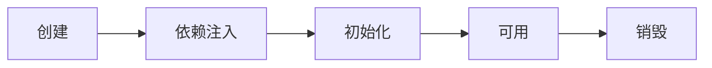

创建前后的增强

* postProcessBeforeInstantiation
  * 这里返回的对象若不为 null 会替换掉原本的 bean，并且仅会走 postProcessAfterInitialization 流程
* postProcessAfterInstantiation
  * 这里如果返回 false 会跳过依赖注入阶段

依赖注入前的增强

* postProcessProperties
  * 如 @Autowired、@Value、@Resource 

初始化前后的增强

* postProcessBeforeInitialization
  * 这里返回的对象会替换掉原本的 bean
  * 如 @PostConstruct、@ConfigurationProperties
* postProcessAfterInitialization 
  * 这里返回的对象会替换掉原本的 bean
  * 如代理增强

销毁之前的增强

* postProcessBeforeDestruction
  * 如 @PreDestroy 

#### 收获💡

1. Spring bean 生命周期各个阶段
2. 模板设计模式, 指大流程已经固定好了, 通过接口回调（bean 后处理器）在一些关键点前后提供扩展


#### 演示2 - 模板方法设计模式

##### 关键代码

```java
public class TestMethodTemplate {

    public static void main(String[] args) {
        MyBeanFactory beanFactory = new MyBeanFactory();
        beanFactory.addBeanPostProcessor(bean -> System.out.println("解析 @Autowired"));
        beanFactory.addBeanPostProcessor(bean -> System.out.println("解析 @Resource"));
        beanFactory.getBean();
    }

    // 模板方法  Template Method Pattern
    static class MyBeanFactory {
        public Object getBean() {
            Object bean = new Object();
            System.out.println("构造 " + bean);
            System.out.println("依赖注入 " + bean); // @Autowired, @Resource
            for (BeanPostProcessor processor : processors) {
                processor.inject(bean);
            }
            System.out.println("初始化 " + bean);
            return bean;
        }

        private List<BeanPostProcessor> processors = new ArrayList<>();

        public void addBeanPostProcessor(BeanPostProcessor processor) {
            processors.add(processor);
        }
    }
    
    static interface BeanPostProcessor {
        public void inject(Object bean); // 对依赖注入阶段的扩展
    }
}
```


#### 演示3 - bean 后处理器排序

##### 代码参考 

**com.itheima.a03.TestProcessOrder**

#### 收获💡

1. 实现了 PriorityOrdered 接口的优先级最高
2. 实现了 Ordered 接口与加了 @Order 注解的平级, 按数字升序
3. 其它的排在最后


### 4) Bean 后处理器

#### 演示1 - 后处理器作用

##### 代码参考 

**com.itheima.a04** 包

#### 收获💡

1. @Autowired 等注解的解析属于 bean 生命周期阶段（依赖注入, 初始化）的扩展功能，这些扩展功能由 bean 后处理器来完成
2. 每个后处理器各自增强什么功能
   * AutowiredAnnotationBeanPostProcessor 解析 @Autowired 与 @Value
   * CommonAnnotationBeanPostProcessor 解析 @Resource、@PostConstruct、@PreDestroy
   * ConfigurationPropertiesBindingPostProcessor 解析 @ConfigurationProperties
3. 另外 ContextAnnotationAutowireCandidateResolver 负责获取 @Value 的值，解析 @Qualifier、泛型、@Lazy 等


#### 演示2 - @Autowired bean 后处理器运行分析

##### 代码参考 

**com.itheima.a04.DigInAutowired**

#### 收获💡

1. AutowiredAnnotationBeanPostProcessor.findAutowiringMetadata 用来获取某个 bean 上加了 @Value @Autowired 的成员变量，方法参数的信息，表示为 InjectionMetadata
2. InjectionMetadata 可以完成依赖注入
3. InjectionMetadata 内部根据成员变量，方法参数封装为 DependencyDescriptor 类型
4. 有了 DependencyDescriptor，就可以利用 beanFactory.doResolveDependency 方法进行基于类型的查找


### 5) BeanFactory 后处理器

#### 演示1 - BeanFactory 后处理器的作用

##### 代码参考

**com.itheima.a05** 包

* ConfigurationClassPostProcessor 可以解析
  * @ComponentScan
  * @Bean
  * @Import
  * @ImportResource
* MapperScannerConfigurer 可以解析
  * Mapper 接口

#### 收获💡

1. @ComponentScan, @Bean, @Mapper 等注解的解析属于核心容器（即 BeanFactory）的扩展功能
2. 这些扩展功能由不同的 BeanFactory 后处理器来完成，其实主要就是补充了一些 bean 定义


#### 演示2 - 模拟解析 @ComponentScan

##### 代码参考 

**com.itheima.a05.ComponentScanPostProcessor**

#### 收获💡

1. Spring 操作元数据的工具类 CachingMetadataReaderFactory
2. 通过注解元数据（AnnotationMetadata）获取直接或间接标注的注解信息
3. 通过类元数据（ClassMetadata）获取类名，AnnotationBeanNameGenerator 生成 bean 名
4. 解析元数据是基于 ASM 技术


#### 演示3 - 模拟解析 @Bean

##### 代码参考 

**com.itheima.a05.AtBeanPostProcessor**

#### 收获💡

1. 进一步熟悉注解元数据（AnnotationMetadata）获取方法上注解信息


#### 演示4 - 模拟解析 Mapper 接口

##### 代码参考 

**com.itheima.a05.MapperPostProcessor**

#### 收获💡

1. Mapper 接口被 Spring 管理的本质：实际是被作为 MapperFactoryBean 注册到容器中
2. Spring 的诡异做法，根据接口生成的 BeanDefinition 仅为根据接口名生成 bean 名


### 6) Aware 接口

#### 演示 - Aware 接口及 InitializingBean 接口

##### 代码参考 

**com.itheima.a06** 包

#### 收获💡

1. Aware 接口提供了一种【内置】 的注入手段，例如
   * BeanNameAware 注入 bean 的名字
   * BeanFactoryAware 注入 BeanFactory 容器
   * ApplicationContextAware 注入 ApplicationContext 容器
   * EmbeddedValueResolverAware 注入 ${} 解析器
2. InitializingBean 接口提供了一种【内置】的初始化手段
3. 对比
   * 内置的注入和初始化不受扩展功能的影响，总会被执行
   * 而扩展功能受某些情况影响可能会失效
   * 因此 Spring 框架内部的类常用内置注入和初始化


#### 配置类 @Autowired 失效分析

Java 配置类不包含 BeanFactoryPostProcessor 的情况

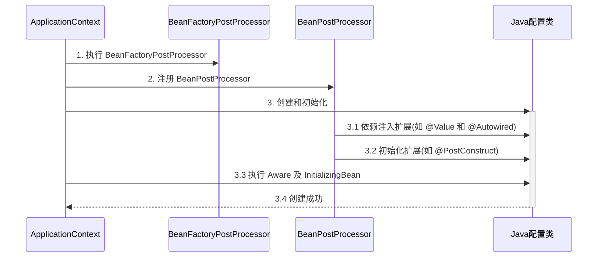

Java 配置类包含 BeanFactoryPostProcessor 的情况，因此要创建其中的 BeanFactoryPostProcessor 必须提前创建 Java 配置类，而此时的 BeanPostProcessor 还未准备好，导致 @Autowired 等注解失效

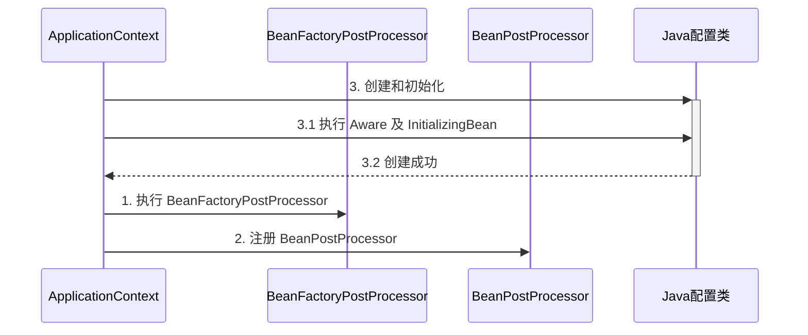

对应代码

```java
@Configuration
public class MyConfig1 {

    private static final Logger log = LoggerFactory.getLogger(MyConfig1.class);

    @Autowired
    public void setApplicationContext(ApplicationContext applicationContext) {
        log.debug("注入 ApplicationContext");
    }

    @PostConstruct
    public void init() {
        log.debug("初始化");
    }

    @Bean //  ⬅️ 注释或添加 beanFactory 后处理器对应上方两种情况
    public BeanFactoryPostProcessor processor1() {
        return beanFactory -> {
            log.debug("执行 processor1");
        };
    }

}
```

> ***注意***
>
> 解决方法：
>
> * 用内置依赖注入和初始化取代扩展依赖注入和初始化
> * 用静态工厂方法代替实例工厂方法，避免工厂对象提前被创建


### 7) 初始化与销毁

#### 演示 - 初始化销毁顺序

##### 代码参考 

**com.itheima.a07** 包

#### 收获💡

Spring 提供了多种初始化手段，除了课堂上讲的 @PostConstruct，@Bean(initMethod) 之外，还可以实现 InitializingBean 接口来进行初始化，如果同一个 bean 用了以上手段声明了 3 个初始化方法，那么它们的执行顺序是

1. @PostConstruct 标注的初始化方法
2. InitializingBean 接口的初始化方法
3. @Bean(initMethod) 指定的初始化方法


与初始化类似，Spring 也提供了多种销毁手段，执行顺序为

1. @PreDestroy 标注的销毁方法
2. DisposableBean 接口的销毁方法
3. @Bean(destroyMethod) 指定的销毁方法


### 8) Scope 

在当前版本的 Spring 和 Spring Boot 程序中，支持五种 Scope

* singleton，容器启动时创建（未设置延迟），容器关闭时销毁
* prototype，每次使用时创建，不会自动销毁，需要调用 DefaultListableBeanFactory.destroyBean(bean) 销毁
* request，每次请求用到此 bean 时创建，请求结束时销毁
* session，每个会话用到此 bean 时创建，会话结束时销毁
* application，web 容器用到此 bean 时创建，容器停止时销毁

有些文章提到有 globalSession 这一 Scope，也是陈旧的说法，目前 Spring 中已废弃


但要注意，如果在 singleton 注入其它 scope 都会有问题，解决方法有

* @Lazy
* @Scope(proxyMode = ScopedProxyMode.TARGET_CLASS)
* ObjectFactory
* ApplicationContext.getBean


#### 演示1 - request, session, application 作用域

##### 代码参考 

**com.itheima.a08** 包

* 打开不同的浏览器, 刷新 http://localhost:8080/test 即可查看效果
* 如果 jdk > 8, 运行时请添加 --add-opens java.base/java.lang=ALL-UNNAMED

#### 收获💡

1. 有几种 scope
2. 在 singleton 中使用其它几种 scope 的方法
3. 其它 scope 的销毁时机
   * 可以将通过 server.servlet.session.timeout=30s 观察 session bean 的销毁
   * ServletContextScope 销毁机制疑似实现有误


#### 分析 - singleton 注入其它 scope 失效

以单例注入多例为例

有一个单例对象 E

```java
@Component
public class E {
    private static final Logger log = LoggerFactory.getLogger(E.class);

    private F f;

    public E() {
        log.info("E()");
    }

    @Autowired
    public void setF(F f) {
        this.f = f;
        log.info("setF(F f) {}", f.getClass());
    }

    public F getF() {
        return f;
    }
}
```

要注入的对象 F 期望是多例

```java
@Component
@Scope("prototype")
public class F {
    private static final Logger log = LoggerFactory.getLogger(F.class);

    public F() {
        log.info("F()");
    }
}
```

测试

```java
E e = context.getBean(E.class);
F f1 = e.getF();
F f2 = e.getF();
System.out.println(f1);
System.out.println(f2);
```

输出

```
com.itheima.demo.cycle.F@6622fc65
com.itheima.demo.cycle.F@6622fc65
```

发现它们是同一个对象，而不是期望的多例对象


对于单例对象来讲，依赖注入仅发生了一次，后续再没有用到多例的 F，因此 E 用的始终是第一次依赖注入的 F

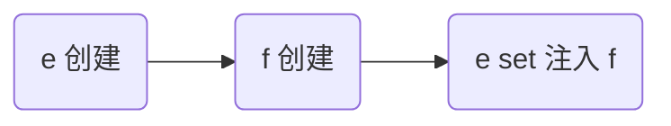

解决

* 仍然使用 @Lazy 生成代理
* 代理对象虽然还是同一个，但当每次**使用代理对象的任意方法**时，由代理创建新的 f 对象

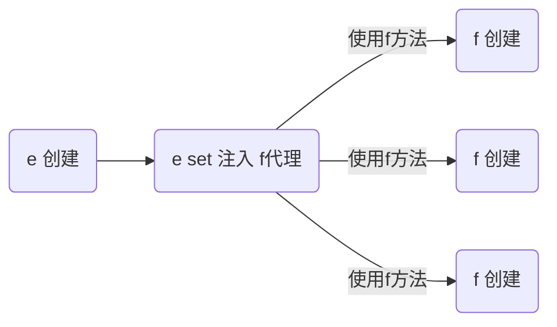

```java
@Component
public class E {

    @Autowired
    @Lazy
    public void setF(F f) {
        this.f = f;
        log.info("setF(F f) {}", f.getClass());
    }

    // ...
}
```

> ***注意***
>
> * @Lazy 加在也可以加在成员变量上，但加在 set 方法上的目的是可以观察输出，加在成员变量上就不行了
> * @Autowired 加在 set 方法的目的类似

输出

```
E: setF(F f) class com.itheima.demo.cycle.F$$EnhancerBySpringCGLIB$$8b54f2bc
F: F()
com.itheima.demo.cycle.F@3a6f2de3
F: F()
com.itheima.demo.cycle.F@56303b57
```

从输出日志可以看到调用 setF 方法时，f 对象的类型是代理类型


#### 演示2 - 4种解决方法

##### 代码参考 

**com.itheima.a08.sub** 包

* 如果 jdk > 8, 运行时请添加 --add-opens java.base/java.lang=ALL-UNNAMED

#### 收获💡

1. 单例注入其它 scope 的四种解决方法
   * @Lazy
   * @Scope(value = "prototype", proxyMode = ScopedProxyMode.TARGET_CLASS)
   * ObjectFactory
   * ApplicationContext
2. 解决方法虽然不同，但理念上殊途同归: 都是推迟其它 scope bean 的获取


# AOP

AOP 底层实现方式之一是代理，由代理结合通知和目标，提供增强功能

除此以外，aspectj 提供了两种另外的 AOP 底层实现：

* 第一种是通过 ajc 编译器在**编译** class 类文件时，就把通知的增强功能，织入到目标类的字节码中

* 第二种是通过 agent 在**加载**目标类时，修改目标类的字节码，织入增强功能
* 作为对比，之前学习的代理是**运行**时生成新的字节码

简单比较的话：

* aspectj 在编译和加载时，修改目标字节码，性能较高
* aspectj 因为不用代理，能突破一些技术上的限制，例如对构造、对静态方法、对 final 也能增强
* 但 aspectj 侵入性较强，且需要学习新的 aspectj 特有语法，因此没有广泛流行


### 9) AOP 实现之 ajc 编译器

代码参考项目 **demo6_advanced_aspectj_01**

#### 收获💡

1. 编译器也能修改 class 实现增强
2. 编译器增强能突破代理仅能通过方法重写增强的限制：可以对构造方法、静态方法等实现增强

> ***注意***
>
> * 版本选择了 java 8, 因为目前的 aspectj-maven-plugin 1.14.0 最高只支持到 java 16
> * 一定要用 maven 的 compile 来编译, idea 不会调用 ajc 编译器


### 10) AOP 实现之 agent 类加载

代码参考项目 **demo6_advanced_aspectj_02**

#### 收获💡

1. 类加载时可以通过 agent 修改 class 实现增强


### 11) AOP 实现之 proxy

#### 演示1 - jdk 动态代理

```java
public class JdkProxyDemo {

    interface Foo {
        void foo();
    }

    static class Target implements Foo {
        public void foo() {
            System.out.println("target foo");
        }
    }

    public static void main(String[] param) {
        // 目标对象
        Target target = new Target();
        // 代理对象
        Foo proxy = (Foo) Proxy.newProxyInstance(
                Target.class.getClassLoader(), new Class[]{Foo.class},
                (p, method, args) -> {
                    System.out.println("proxy before...");
                    Object result = method.invoke(target, args);
                    System.out.println("proxy after...");
                    return result;
                });
        // 调用代理
        proxy.foo();
    }
}
```

运行结果

```
proxy before...
target foo
proxy after...
```

#### 收获💡

* jdk 动态代理要求目标**必须**实现接口，生成的代理类实现相同接口，因此代理与目标之间是平级兄弟关系


#### 演示2 - cglib 代理

```java
public class CglibProxyDemo {

    static class Target {
        public void foo() {
            System.out.println("target foo");
        }
    }

    public static void main(String[] param) {
        // 目标对象
        Target target = new Target();
        // 代理对象
        Target proxy = (Target) Enhancer.create(Target.class, 
                (MethodInterceptor) (p, method, args, methodProxy) -> {
            System.out.println("proxy before...");
            Object result = methodProxy.invoke(target, args);
            // 另一种调用方法，不需要目标对象实例
//            Object result = methodProxy.invokeSuper(p, args);
            System.out.println("proxy after...");
            return result;
        });
        // 调用代理
        proxy.foo();
    }
}
```

运行结果与 jdk 动态代理相同

#### 收获💡

* cglib 不要求目标实现接口，它生成的代理类是目标的子类，因此代理与目标之间是子父关系
* 限制⛔：根据上述分析 final 类无法被 cglib 增强


### 12) jdk 动态代理进阶

#### 演示1 - 模拟 jdk 动态代理

```java
public class A12 {

    interface Foo {
        void foo();
        int bar();
    }

    static class Target implements Foo {
        public void foo() {
            System.out.println("target foo");
        }

        public int bar() {
            System.out.println("target bar");
            return 100;
        }
    }

    public static void main(String[] param) {
        // ⬇️1. 创建代理，这时传入 InvocationHandler
        Foo proxy = new $Proxy0(new InvocationHandler() {    
            // ⬇️5. 进入 InvocationHandler
            public Object invoke(Object proxy, Method method, Object[] args) throws Throwable{
                // ⬇️6. 功能增强
                System.out.println("before...");
                // ⬇️7. 反射调用目标方法
                return method.invoke(new Target(), args);
            }
        });
        // ⬇️2. 调用代理方法
        proxy.foo();
        proxy.bar();
    }
}
```

模拟代理实现

```java
import java.lang.reflect.InvocationHandler;
import java.lang.reflect.Method;
import java.lang.reflect.Proxy;
import java.lang.reflect.UndeclaredThrowableException;

// ⬇️这就是 jdk 代理类的源码, 秘密都在里面
public class $Proxy0 extends Proxy implements A12.Foo {

    public $Proxy0(InvocationHandler h) {
        super(h);
    }
    // ⬇️3. 进入代理方法
    public void foo() {
        try {
            // ⬇️4. 回调 InvocationHandler
            h.invoke(this, foo, new Object[0]);
        } catch (RuntimeException | Error e) {
            throw e;
        } catch (Throwable e) {
            throw new UndeclaredThrowableException(e);
        }
    }

    @Override
    public int bar() {
        try {
            Object result = h.invoke(this, bar, new Object[0]);
            return (int) result;
        } catch (RuntimeException | Error e) {
            throw e;
        } catch (Throwable e) {
            throw new UndeclaredThrowableException(e);
        }
    }

    static Method foo;
    static Method bar;
    static {
        try {
            foo = A12.Foo.class.getMethod("foo");
            bar = A12.Foo.class.getMethod("bar");
        } catch (NoSuchMethodException e) {
            throw new NoSuchMethodError(e.getMessage());
        }
    }
}
```

#### 收获💡

代理一点都不难，无非就是利用了多态、反射的知识

1. 方法重写可以增强逻辑，只不过这【增强逻辑】千变万化，不能写死在代理内部
2. 通过接口回调将【增强逻辑】置于代理类之外
3. 配合接口方法反射（是多态调用），就可以再联动调用目标方法
4. 会用 arthas 的 jad 工具反编译代理类
5. 限制⛔：代理增强是借助多态来实现，因此成员变量、静态方法、final 方法均不能通过代理实现


#### 演示2 - 方法反射优化

##### 代码参考 

**com.itheima.a12.TestMethodInvoke**

#### 收获💡

1. 前 16 次反射性能较低
2. 第 17 次调用会生成代理类，优化为非反射调用
3. 会用 arthas 的 jad 工具反编译第 17 次调用生成的代理类

> ***注意***
>
> 运行时请添加 --add-opens java.base/java.lang.reflect=ALL-UNNAMED --add-opens java.base/jdk.internal.reflect=ALL-UNNAMED


### 13) cglib 代理进阶

#### 演示 - 模拟 cglib 代理

##### 代码参考 

**com.itheima.a13** 包

#### 收获💡

和 jdk 动态代理原理查不多

1. 回调的接口换了一下，InvocationHandler 改成了 MethodInterceptor
2. 调用目标时有所改进，见下面代码片段
   1. method.invoke 是反射调用，必须调用到足够次数才会进行优化
   2. methodProxy.invoke 是不反射调用，它会正常（间接）调用目标对象的方法（Spring 采用）
   3. methodProxy.invokeSuper 也是不反射调用，它会正常（间接）调用代理对象的方法，可以省略目标对象


```java
public class A14Application {
    public static void main(String[] args) throws InvocationTargetException {

        Target target = new Target();
        Proxy proxy = new Proxy();
        
        proxy.setCallbacks(new Callback[]{(MethodInterceptor) (p, m, a, mp) -> {
            System.out.println("proxy before..." + mp.getSignature());
            // ⬇️调用目标方法(三种)
//            Object result = m.invoke(target, a);  // ⬅️反射调用
//            Object result = mp.invoke(target, a); // ⬅️非反射调用, 结合目标用
            Object result = mp.invokeSuper(p, a);   // ⬅️非反射调用, 结合代理用
            System.out.println("proxy after..." + mp.getSignature());
            return result;
        }});
        
        // ⬇️调用代理方法
        proxy.save();
    }
}
```

> ***注意***
>
> * 调用 Object 的方法, 后两种在 jdk >= 9 时都有问题, 需要 --add-opens java.base/java.lang=ALL-UNNAMED


### 14) cglib 避免反射调用

#### 演示 - cglib 如何避免反射

##### 代码参考 

**com.itheima.a13.ProxyFastClass**，**com.itheima.a13.TargetFastClass**

#### 收获💡

1. 当调用 MethodProxy 的 invoke 或 invokeSuper 方法时, 会动态生成两个类
   * ProxyFastClass 配合代理对象一起使用, 避免反射
   * TargetFastClass 配合目标对象一起使用, 避免反射 (Spring 用的这种)
2. TargetFastClass 记录了 Target 中方法与编号的对应关系
   - save(long) 编号 2
   - save(int) 编号 1
   - save() 编号 0
   - 首先根据方法名和参数个数、类型, 用 switch 和 if 找到这些方法编号
   - 然后再根据编号去调用目标方法, 又用了一大堆 switch 和 if, 但避免了反射
3. ProxyFastClass 记录了 Proxy 中方法与编号的对应关系，不过 Proxy 额外提供了下面几个方法
   * saveSuper(long) 编号 2，不增强，仅是调用 super.save(long)
   * saveSuper(int) 编号 1，不增强, 仅是调用 super.save(int)
   * saveSuper() 编号 0，不增强, 仅是调用 super.save()
   * 查找方式与 TargetFastClass 类似
4. 为什么有这么麻烦的一套东西呢？
   * 避免反射, 提高性能, 代价是一个代理类配两个 FastClass 类, 代理类中还得增加仅调用 super 的一堆方法
   * 用编号处理方法对应关系比较省内存, 另外, 最初获得方法顺序是不确定的, 这个过程没法固定死


### 15) jdk 和 cglib 在 Spring 中的统一

Spring 中对切点、通知、切面的抽象如下

* 切点：接口 Pointcut，典型实现 AspectJExpressionPointcut
* 通知：典型接口为 MethodInterceptor 代表环绕通知
* 切面：Advisor，包含一个 Advice 通知，PointcutAdvisor 包含一个 Advice 通知和一个 Pointcut

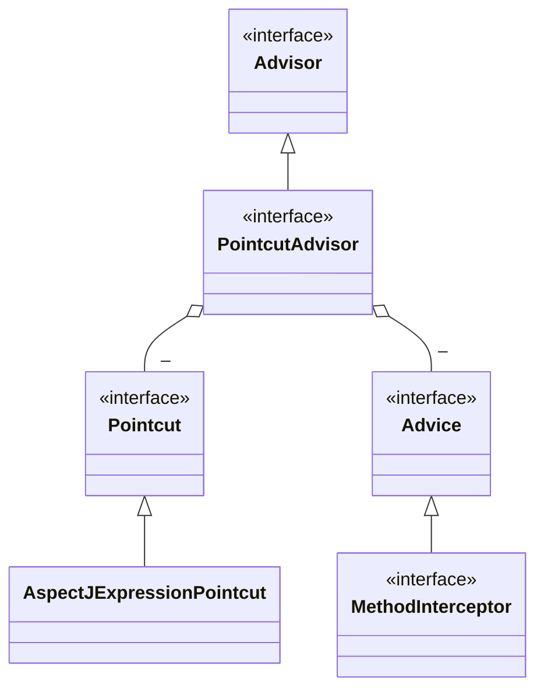

代理相关类图

* AopProxyFactory 根据 proxyTargetClass 等设置选择 AopProxy 实现
* AopProxy 通过 getProxy 创建代理对象
* 图中 Proxy 都实现了 Advised 接口，能够获得关联的切面集合与目标（其实是从 ProxyFactory 取得）
* 调用代理方法时，会借助 ProxyFactory 将通知统一转为环绕通知：MethodInterceptor

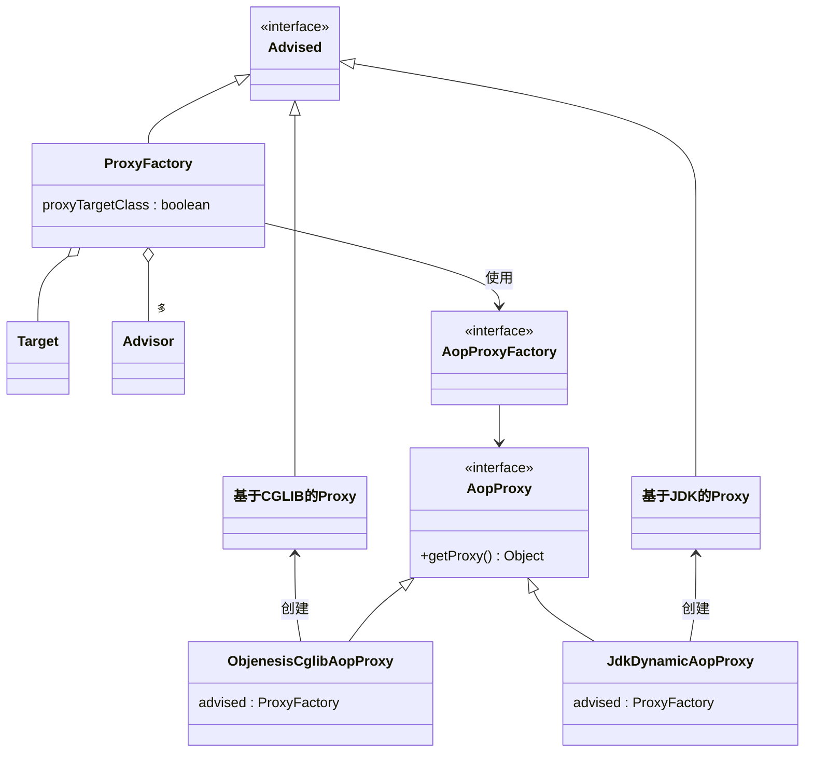


#### 演示 - 底层切点、通知、切面

##### 代码参考

**com.itheima.a15.A15**

#### 收获💡

1. 底层的切点实现
2. 底层的通知实现
3. 底层的切面实现
4. ProxyFactory 用来创建代理
   * 如果指定了接口，且 proxyTargetClass = false，使用 JdkDynamicAopProxy
   * 如果没有指定接口，或者 proxyTargetClass = true，使用 ObjenesisCglibAopProxy
     * 例外：如果目标是接口类型或已经是 Jdk 代理，使用 JdkDynamicAopProxy

> ***注意***
>
> * 要区分本章节提到的 MethodInterceptor，它与之前 cglib 中用的的 MethodInterceptor 是不同的接口


### 16) 切点匹配

#### 演示 - 切点匹配

##### 代码参考

**com.itheima.a16.A16**

#### 收获💡

1. 常见 aspectj 切点用法
2. aspectj 切点的局限性，实际的 @Transactional 切点实现


### 17) 从 @Aspect 到 Advisor

#### 演示1 - 代理创建器

##### 代码参考

**org.springframework.aop.framework.autoproxy** 包

#### 收获💡

1. AnnotationAwareAspectJAutoProxyCreator 的作用
   * 将高级 @Aspect 切面统一为低级 Advisor 切面
   * 在合适的时机创建代理
2. findEligibleAdvisors 找到有【资格】的 Advisors
   * 有【资格】的 Advisor 一部分是低级的, 可以由自己编写, 如本例 A17 中的 advisor3
   * 有【资格】的 Advisor 另一部分是高级的, 由解析 @Aspect 后获得
3. wrapIfNecessary
   * 它内部调用 findEligibleAdvisors, 只要返回集合不空, 则表示需要创建代理
   * 它的调用时机通常在原始对象初始化后执行, 但碰到循环依赖会提前至依赖注入之前执行


#### 演示2 - 代理创建时机

##### 代码参考

**org.springframework.aop.framework.autoproxy.A17_1**

#### 收获💡

1. 代理的创建时机
   * 初始化之后 (无循环依赖时)
   * 实例创建后, 依赖注入前 (有循环依赖时), 并暂存于二级缓存
2. 依赖注入与初始化不应该被增强, 仍应被施加于原始对象


#### 演示3 - @Before 对应的低级通知

##### 代码参考

**org.springframework.aop.framework.autoproxy.A17_2**

#### 收获💡

1. @Before 前置通知会被转换为原始的 AspectJMethodBeforeAdvice 形式, 该对象包含了如下信息
   1. 通知代码从哪儿来
   2. 切点是什么(这里为啥要切点, 后面解释)
   3. 通知对象如何创建, 本例共用同一个 Aspect 对象
2. 类似的还有
   1. AspectJAroundAdvice (环绕通知)
   2. AspectJAfterReturningAdvice
   3. AspectJAfterThrowingAdvice (环绕通知)
   4. AspectJAfterAdvice (环绕通知)


### 18) 静态通知调用

代理对象调用流程如下（以 JDK 动态代理实现为例）

* 从 ProxyFactory 获得 Target 和环绕通知链，根据他俩创建 MethodInvocation，简称 mi
* 首次执行 mi.proceed() 发现有下一个环绕通知，调用它的 invoke(mi)
* 进入环绕通知1，执行前增强，再次调用 mi.proceed() 发现有下一个环绕通知，调用它的 invoke(mi)
* 进入环绕通知2，执行前增强，调用 mi.proceed() 发现没有环绕通知，调用 mi.invokeJoinPoint() 执行目标方法
* 目标方法执行结束，将结果返回给环绕通知2，执行环绕通知2 的后增强
* 环绕通知2继续将结果返回给环绕通知1，执行环绕通知1 的后增强
* 环绕通知1返回最终的结果

图中不同颜色对应一次环绕通知或目标的调用起始至终结

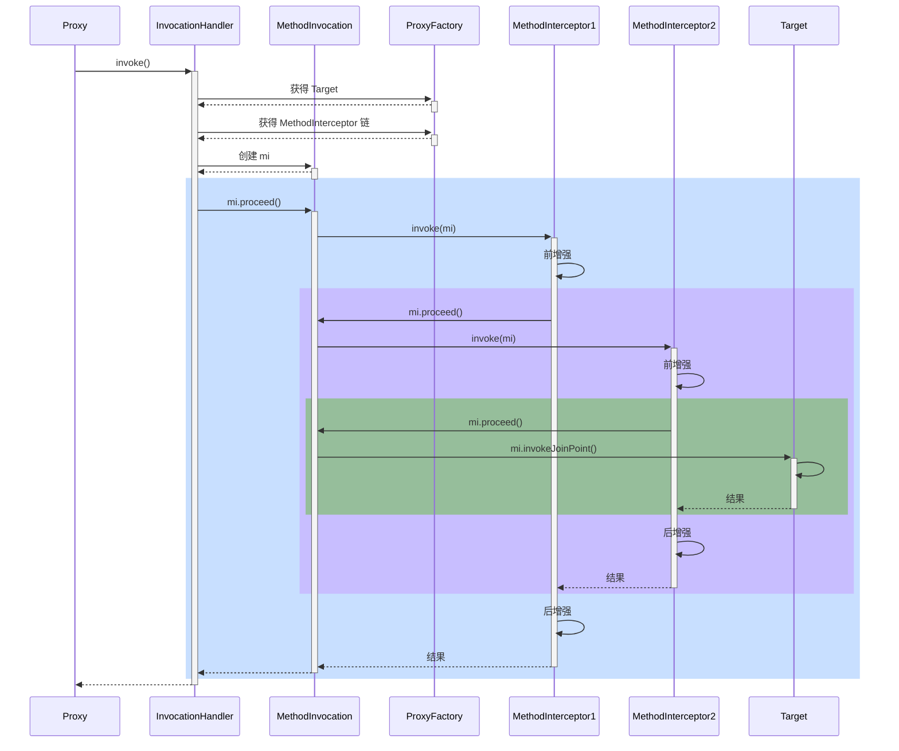


#### 演示1 - 通知调用过程

##### 代码参考

**org.springframework.aop.framework.A18**

#### 收获💡

代理方法执行时会做如下工作

1. 通过 proxyFactory 的 getInterceptorsAndDynamicInterceptionAdvice() 将其他通知统一转换为 MethodInterceptor 环绕通知
   - MethodBeforeAdviceAdapter 将 @Before AspectJMethodBeforeAdvice 适配为 MethodBeforeAdviceInterceptor
   - AfterReturningAdviceAdapter 将 @AfterReturning AspectJAfterReturningAdvice 适配为 AfterReturningAdviceInterceptor
   - 这体现的是适配器设计模式
2. 所谓静态通知，体现在上面方法的 Interceptors 部分，这些通知调用时无需再次检查切点，直接调用即可
3. 结合目标与环绕通知链，创建 MethodInvocation 对象，通过它完成整个调用


#### 演示2 - 模拟 MethodInvocation

##### 代码参考

**org.springframework.aop.framework.A18_1**

#### 收获💡

1. proceed() 方法调用链中下一个环绕通知
2. 每个环绕通知内部继续调用 proceed()
3. 调用到没有更多通知了, 就调用目标方法

MethodInvocation 的编程技巧在实现拦截器、过滤器时能用上


### 19) 动态通知调用

#### 演示 - 带参数绑定的通知方法调用

##### 代码参考

**org.springframework.aop.framework.autoproxy.A19**

#### 收获💡

1. 通过 proxyFactory 的 getInterceptorsAndDynamicInterceptionAdvice() 将其他通知统一转换为 MethodInterceptor 环绕通知
2. 所谓动态通知，体现在上面方法的 DynamicInterceptionAdvice 部分，这些通知调用时因为要为通知方法绑定参数，还需再次利用切点表达式
3. 动态通知调用复杂程度高，性能较低


# WEB

### 20) RequestMappingHandlerMapping 与 RequestMappingHandlerAdapter

RequestMappingHandlerMapping 与 RequestMappingHandlerAdapter 俩是一对，分别用来

* 处理 @RequestMapping 映射
* 调用控制器方法、并处理方法参数与方法返回值

#### 演示1 - DispatcherServlet 初始化

##### 代码参考

**com.itheima.a20** 包

#### 收获💡

1. DispatcherServlet 是在第一次被访问时执行初始化, 也可以通过配置修改为 Tomcat 启动后就初始化
2. 在初始化时会从 Spring 容器中找一些 Web 需要的组件, 如 HandlerMapping、HandlerAdapter 等，并逐一调用它们的初始化
3. RequestMappingHandlerMapping 初始化时，会收集所有 @RequestMapping 映射信息，封装为 Map，其中
   * key 是 RequestMappingInfo 类型，包括请求路径、请求方法等信息
   * value 是 HandlerMethod 类型，包括控制器方法对象、控制器对象
   * 有了这个 Map，就可以在请求到达时，快速完成映射，找到 HandlerMethod 并与匹配的拦截器一起返回给 DispatcherServlet
4. RequestMappingHandlerAdapter 初始化时，会准备 HandlerMethod 调用时需要的各个组件，如：
   * HandlerMethodArgumentResolver 解析控制器方法参数
   * HandlerMethodReturnValueHandler 处理控制器方法返回值


#### 演示2 - 自定义参数与返回值处理器

##### 代码参考

**com.itheima.a20.TokenArgumentResolver** ，**com.itheima.a20.YmlReturnValueHandler**

#### 收获💡

1. 体会参数解析器的作用
2. 体会返回值处理器的作用


### 21) 参数解析器

#### 演示 - 常见参数解析器

##### 代码参考

**com.itheima.a21** 包

#### 收获💡

1. 初步了解 RequestMappingHandlerAdapter 的调用过程
   1. 控制器方法被封装为 HandlerMethod
   2. 准备对象绑定与类型转换
   3. 准备 ModelAndViewContainer 用来存储中间 Model 结果
   4. 解析每个参数值
2. 解析参数依赖的就是各种参数解析器，它们都有两个重要方法
   * supportsParameter 判断是否支持方法参数
   * resolveArgument 解析方法参数
3. 常见参数的解析
   * @RequestParam
   * 省略 @RequestParam
   * @RequestParam(defaultValue)
   * MultipartFile
   * @PathVariable
   * @RequestHeader
   * @CookieValue
   * @Value
   * HttpServletRequest 等
   * @ModelAttribute
   * 省略 @ModelAttribute
   * @RequestBody
4. 组合模式在 Spring 中的体现
5. @RequestParam, @CookieValue 等注解中的参数名、默认值, 都可以写成活的, 即从 ${ } #{ }中获取


### 22) 参数名解析

#### 演示 - 两种方法获取参数名

##### 代码参考

**com.itheima.a22.A22**

#### 收获💡

1. 如果编译时添加了 -parameters 可以生成参数表, 反射时就可以拿到参数名
2. 如果编译时添加了 -g 可以生成调试信息, 但分为两种情况
   * 普通类, 会包含局部变量表, 用 asm 可以拿到参数名
   * 接口, 不会包含局部变量表, 无法获得参数名
     * 这也是 MyBatis 在实现 Mapper 接口时为何要提供 @Param 注解来辅助获得参数名


### 23) 对象绑定与类型转换

#### 底层第一套转换接口与实现

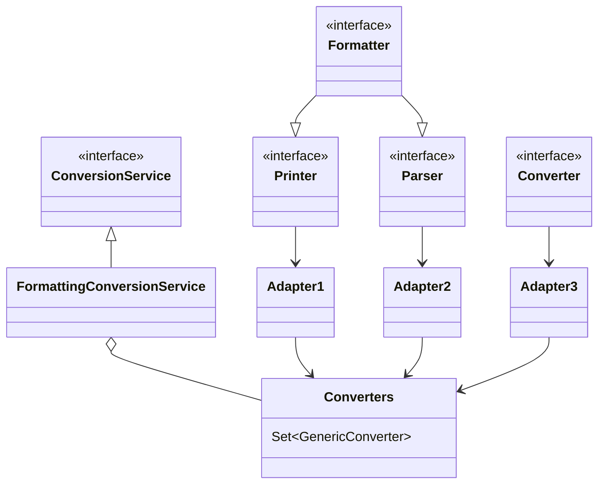

* Printer 把其它类型转为 String
* Parser 把 String 转为其它类型
* Formatter 综合 Printer 与 Parser 功能
* Converter 把类型 S 转为类型 T
* Printer、Parser、Converter 经过适配转换成 GenericConverter 放入 Converters 集合
* FormattingConversionService 利用其它们实现转换


#### 底层第二套转换接口

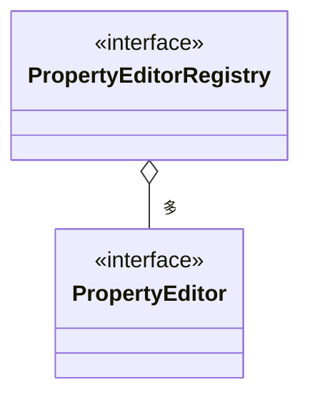

* PropertyEditor 把 String 与其它类型相互转换
* PropertyEditorRegistry 可以注册多个 PropertyEditor 对象
* 与第一套接口直接可以通过 FormatterPropertyEditorAdapter 来进行适配


#### 高层接口与实现

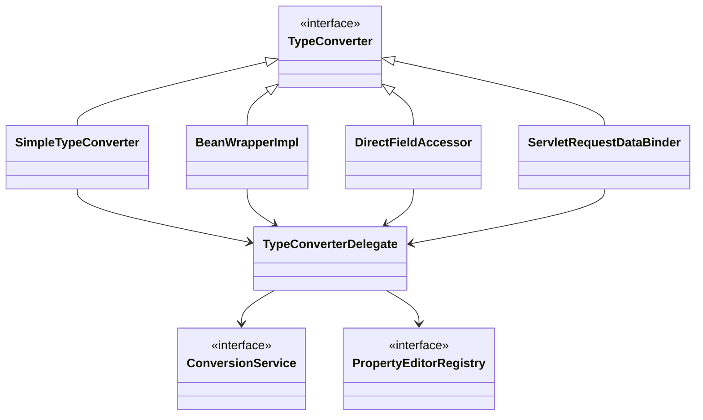

* 它们都实现了 TypeConverter 这个高层转换接口，在转换时，会用到 TypeConverter Delegate 委派ConversionService 与 PropertyEditorRegistry 真正执行转换（Facade 门面模式）
  * 首先看是否有自定义转换器, @InitBinder 添加的即属于这种 (用了适配器模式把 Formatter 转为需要的 PropertyEditor)
  * 再看有没有 ConversionService 转换
  * 再利用默认的 PropertyEditor 转换
  * 最后有一些特殊处理
* SimpleTypeConverter 仅做类型转换
* BeanWrapperImpl 为 bean 的属性赋值，当需要时做类型转换，走 Property
* DirectFieldAccessor 为 bean 的属性赋值，当需要时做类型转换，走 Field
* ServletRequestDataBinder 为 bean 的属性执行绑定，当需要时做类型转换，根据 directFieldAccess 选择走 Property 还是 Field，具备校验与获取校验结果功能


#### 演示1 - 类型转换与数据绑定

##### 代码参考

**com.itheima.a23** 包

#### 收获💡

基本的类型转换与数据绑定用法

* SimpleTypeConverter
* BeanWrapperImpl
* DirectFieldAccessor
* ServletRequestDataBinder


#### 演示2 - 数据绑定工厂

##### 代码参考

**com.itheima.a23.TestServletDataBinderFactory**

#### 收获💡

ServletRequestDataBinderFactory 的用法和扩展点

1. 可以解析控制器的 @InitBinder 标注方法作为扩展点，添加自定义转换器
   * 控制器私有范围
2. 可以通过 ConfigurableWebBindingInitializer 配置 ConversionService 作为扩展点，添加自定义转换器
   * 公共范围
3. 同时加了 @InitBinder 和 ConversionService 的转换优先级
   1. 优先采用 @InitBinder 的转换器
   2. 其次使用 ConversionService 的转换器
   3. 使用默认转换器
   4. 特殊处理（例如有参构造）


#### 演示3 - 获取泛型参数

##### 代码参考

**com.itheima.a23.sub** 包

#### 收获💡

1. java api 获取泛型参数
2. spring api 获取泛型参数


### 24) @ControllerAdvice 之 @InitBinder

#### 演示 - 准备 @InitBinder

**准备 @InitBinder** 在整个 HandlerAdapter 调用过程中所处的位置

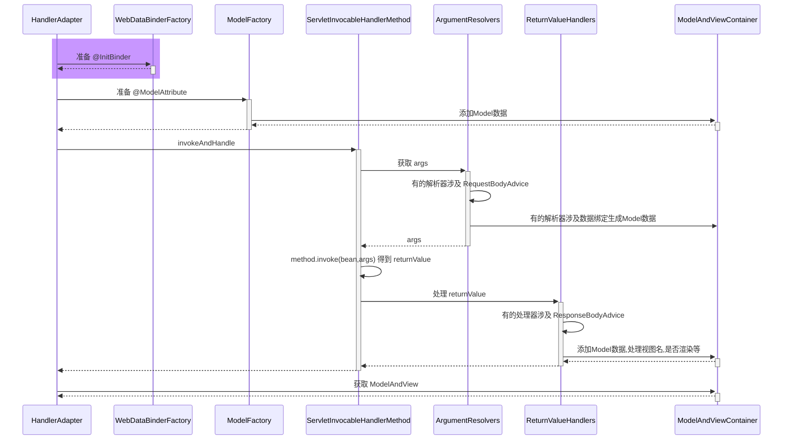

* RequestMappingHandlerAdapter 在图中缩写为 HandlerAdapter
* HandlerMethodArgumentResolverComposite 在图中缩写为 ArgumentResolvers
* HandlerMethodReturnValueHandlerComposite 在图中缩写为 ReturnValueHandlers

#### 收获💡

1. RequestMappingHandlerAdapter 初始化时会解析 @ControllerAdvice 中的 @InitBinder 方法
2. RequestMappingHandlerAdapter 会以类为单位，在该类首次使用时，解析此类的 @InitBinder 方法
3. 以上两种 @InitBinder 的解析结果都会缓存来避免重复解析
4. 控制器方法调用时，会综合利用本类的 @InitBinder 方法和 @ControllerAdvice 中的 @InitBinder 方法创建绑定工厂


### 25) 控制器方法执行流程

#### 图1

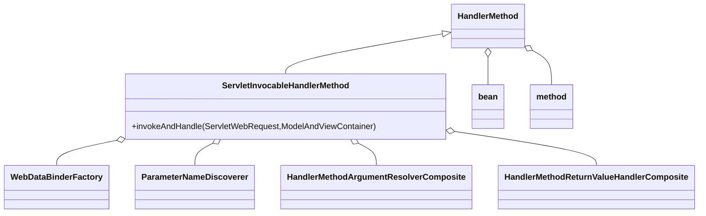

HandlerMethod 需要

* bean 即是哪个 Controller
* method 即是 Controller 中的哪个方法

ServletInvocableHandlerMethod 需要

* WebDataBinderFactory 负责对象绑定、类型转换
* ParameterNameDiscoverer 负责参数名解析
* HandlerMethodArgumentResolverComposite 负责解析参数
* HandlerMethodReturnValueHandlerComposite 负责处理返回值


#### 图2

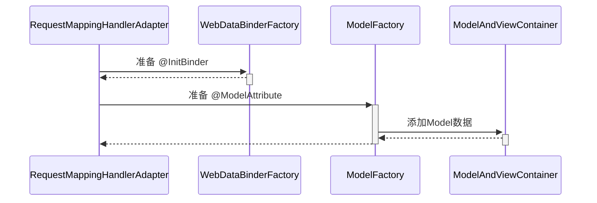

#### 图3

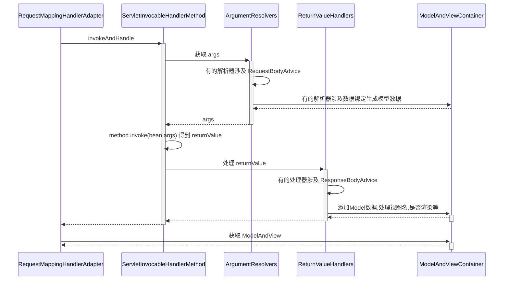


### 26) @ControllerAdvice 之 @ModelAttribute

#### 演示 - 准备 @ModelAttribute

##### 代码参考

**com.itheima.a26** 包

**准备 @ModelAttribute** 在整个 HandlerAdapter 调用过程中所处的位置

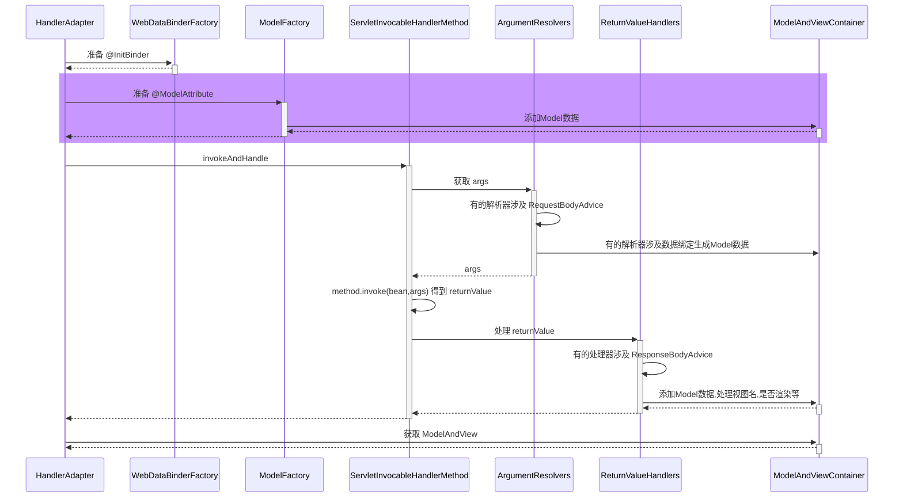

#### 收获💡

1. RequestMappingHandlerAdapter 初始化时会解析 @ControllerAdvice 中的 @ModelAttribute 方法
2. RequestMappingHandlerAdapter 会以类为单位，在该类首次使用时，解析此类的 @ModelAttribute 方法
3. 以上两种 @ModelAttribute 的解析结果都会缓存来避免重复解析
4. 控制器方法调用时，会综合利用本类的 @ModelAttribute 方法和 @ControllerAdvice 中的 @ModelAttribute 方法创建模型工厂


### 27) 返回值处理器

#### 演示 - 常见返回值处理器

##### 代码参考

**com.itheima.a27** 包

#### 收获💡

1. 常见的返回值处理器
   * ModelAndView，分别获取其模型和视图名，放入 ModelAndViewContainer
   * 返回值类型为 String 时，把它当做视图名，放入 ModelAndViewContainer
   * 返回值添加了 @ModelAttribute 注解时，将返回值作为模型，放入 ModelAndViewContainer
     * 此时需找到默认视图名
   * 返回值省略 @ModelAttribute 注解且返回非简单类型时，将返回值作为模型，放入 ModelAndViewContainer
     * 此时需找到默认视图名
   * 返回值类型为 ResponseEntity 时
     * 此时走 MessageConverter，并设置 ModelAndViewContainer.requestHandled 为 true
   * 返回值类型为 HttpHeaders 时
     * 会设置 ModelAndViewContainer.requestHandled 为 true
   * 返回值添加了 @ResponseBody 注解时
     * 此时走 MessageConverter，并设置 ModelAndViewContainer.requestHandled 为 true
2. 组合模式在 Spring 中的体现 + 1


### 28) MessageConverter

#### 演示 - MessageConverter 的作用

##### 代码参考

**com.itheima.a28.A28**

#### 收获💡

1. MessageConverter 的作用
   * @ResponseBody 是返回值处理器解析的
   * 但具体转换工作是 MessageConverter 做的
2. 如何选择 MediaType
   * 首先看 @RequestMapping 上有没有指定
   * 其次看 request 的 Accept 头有没有指定
   * 最后按 MessageConverter 的顺序, 谁能谁先转换


### 29) @ControllerAdvice 之 ResponseBodyAdvice

#### 演示 - ResponseBodyAdvice 增强

##### 代码参考

**com.itheima.a29** 包

**ResponseBodyAdvice 增强** 在整个 HandlerAdapter 调用过程中所处的位置

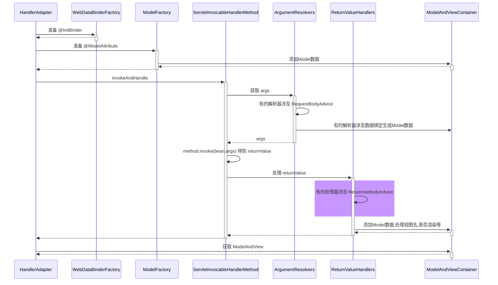

#### 收获💡

1. ResponseBodyAdvice 返回响应体前包装


### 30) 异常解析器

#### 演示 - ExceptionHandlerExceptionResolver

##### 代码参考

**com.itheima.a30.A30**

#### 收获💡

1. 它能够重用参数解析器、返回值处理器，实现组件重用
2. 它能够支持嵌套异常


### 31) @ControllerAdvice 之 @ExceptionHandler

#### 演示 - 准备 @ExceptionHandler

##### 代码参考

**com.itheima.a31** 包

#### 收获💡

1. ExceptionHandlerExceptionResolver 初始化时会解析 @ControllerAdvice 中的 @ExceptionHandler 方法
2. ExceptionHandlerExceptionResolver 会以类为单位，在该类首次处理异常时，解析此类的 @ExceptionHandler 方法
3. 以上两种 @ExceptionHandler 的解析结果都会缓存来避免重复解析


### 32) Tomcat 异常处理

* 我们知道 @ExceptionHandler 只能处理发生在 mvc 流程中的异常，例如控制器内、拦截器内，那么如果是 Filter 出现了异常，如何进行处理呢？

* 在 Spring Boot 中，是这么实现的：
  1. 因为内嵌了 Tomcat 容器，因此可以配置 Tomcat 的错误页面，Filter 与 错误页面之间是通过请求转发跳转的，可以在这里做手脚
  2. 先通过 ErrorPageRegistrarBeanPostProcessor 这个后处理器配置错误页面地址，默认为 `/error` 也可以通过 `${server.error.path}` 进行配置
  3. 当 Filter 发生异常时，不会走 Spring 流程，但会走 Tomcat 的错误处理，于是就希望转发至 `/error` 这个地址
     * 当然，如果没有 @ExceptionHandler，那么最终也会走到 Tomcat 的错误处理
  4. Spring Boot 又提供了一个 BasicErrorController，它就是一个标准 @Controller，@RequestMapping 配置为 `/error`，所以处理异常的职责就又回到了 Spring
  5. 异常信息由于会被 Tomcat 放入 request 作用域，因此 BasicErrorController 里也能获取到
  6. 具体异常信息会由 DefaultErrorAttributes 封装好
  7. BasicErrorController 通过 Accept 头判断需要生成哪种 MediaType 的响应
     * 如果要的不是 text/html，走 MessageConverter 流程
     * 如果需要 text/html，走 mvc 流程，此时又分两种情况
       * 配置了 ErrorViewResolver，根据状态码去找 View
       * 没配置或没找到，用 BeanNameViewResolver 根据一个固定为 error 的名字找到 View，即所谓的 WhitelabelErrorView

> ***评价***
>
> * 一个错误处理搞得这么复杂，就问恶心不？


#### 演示1 - 错误页处理

##### 关键代码

```java
@Bean // ⬅️修改了 Tomcat 服务器默认错误地址, 出错时使用请求转发方式跳转
public ErrorPageRegistrar errorPageRegistrar() {
    return webServerFactory -> webServerFactory.addErrorPages(new ErrorPage("/error"));
}

@Bean // ⬅️TomcatServletWebServerFactory 初始化前用它增强, 注册所有 ErrorPageRegistrar
public ErrorPageRegistrarBeanPostProcessor errorPageRegistrarBeanPostProcessor() {
    return new ErrorPageRegistrarBeanPostProcessor();
}
```

#### 收获💡

1. Tomcat 的错误页处理手段


#### 演示2 - BasicErrorController

##### 关键代码

```java
@Bean // ⬅️ErrorProperties 封装环境键值, ErrorAttributes 控制有哪些错误信息
public BasicErrorController basicErrorController() {
    ErrorProperties errorProperties = new ErrorProperties();
    errorProperties.setIncludeException(true);
    return new BasicErrorController(new DefaultErrorAttributes(), errorProperties);
}

@Bean // ⬅️名称为 error 的视图, 作为 BasicErrorController 的 text/html 响应结果
public View error() {
    return new View() {
        @Override
        public void render(
            Map<String, ?> model, 
            HttpServletRequest request, 
            HttpServletResponse response
        ) throws Exception {
            System.out.println(model);
            response.setContentType("text/html;charset=utf-8");
            response.getWriter().print("""
                    <h3>服务器内部错误</h3>
                    """);
        }
    };
}

@Bean // ⬅️收集容器中所有 View 对象, bean 的名字作为视图名
public ViewResolver viewResolver() {
    return new BeanNameViewResolver();
}
```

#### 收获💡

1. Spring Boot 中 BasicErrorController 如何工作


### 33) BeanNameUrlHandlerMapping 与 SimpleControllerHandlerAdapter

#### 演示 - 本组映射器和适配器

##### 关键代码

```java
@Bean
public BeanNameUrlHandlerMapping beanNameUrlHandlerMapping() {
    return new BeanNameUrlHandlerMapping();
}

@Bean
public SimpleControllerHandlerAdapter simpleControllerHandlerAdapter() {
    return new SimpleControllerHandlerAdapter();
}

@Bean("/c3")
public Controller controller3() {
    return (request, response) -> {
        response.getWriter().print("this is c3");
        return null;
    };
}
```

#### 收获💡

1. BeanNameUrlHandlerMapping，以 / 开头的 bean 的名字会被当作映射路径
2. 这些 bean 本身当作 handler，要求实现 Controller 接口
3. SimpleControllerHandlerAdapter，调用 handler
4. 模拟实现这组映射器和适配器


### 34) RouterFunctionMapping 与 HandlerFunctionAdapter

#### 演示 - 本组映射器和适配器

##### 关键代码

```java
@Bean
public RouterFunctionMapping routerFunctionMapping() {
    return new RouterFunctionMapping();
}

@Bean
public HandlerFunctionAdapter handlerFunctionAdapter() {
    return new HandlerFunctionAdapter();
}

@Bean
public RouterFunction<ServerResponse> r1() {
    //           ⬇️映射条件   ⬇️handler
    return route(GET("/r1"), request -> ok().body("this is r1"));
}
```

#### 收获💡

1. RouterFunctionMapping, 通过 RequestPredicate 条件映射
2. handler 要实现 HandlerFunction 接口
3. HandlerFunctionAdapter, 调用 handler


### 35) SimpleUrlHandlerMapping 与 HttpRequestHandlerAdapter

#### 演示1 - 本组映射器和适配器

##### 代码参考

**org.springframework.boot.autoconfigure.web.servlet.A35**

##### 关键代码

```java
@Bean
public SimpleUrlHandlerMapping simpleUrlHandlerMapping(ApplicationContext context) {
    SimpleUrlHandlerMapping handlerMapping = new SimpleUrlHandlerMapping();
    Map<String, ResourceHttpRequestHandler> map 
        = context.getBeansOfType(ResourceHttpRequestHandler.class);
    handlerMapping.setUrlMap(map);
    return handlerMapping;
}

@Bean
public HttpRequestHandlerAdapter httpRequestHandlerAdapter() {
    return new HttpRequestHandlerAdapter();
}

@Bean("/**")
public ResourceHttpRequestHandler handler1() {
    ResourceHttpRequestHandler handler = new ResourceHttpRequestHandler();
    handler.setLocations(List.of(new ClassPathResource("static/")));
    return handler;
}

@Bean("/img/**")
public ResourceHttpRequestHandler handler2() {
    ResourceHttpRequestHandler handler = new ResourceHttpRequestHandler();
    handler.setLocations(List.of(new ClassPathResource("images/")));
    return handler;
}
```

#### 收获💡

1. SimpleUrlHandlerMapping 不会在初始化时收集映射信息，需要手动收集
2. SimpleUrlHandlerMapping 映射路径
3. ResourceHttpRequestHandler 作为静态资源 handler
4. HttpRequestHandlerAdapter, 调用此 handler


#### 演示2 - 静态资源解析优化

##### 关键代码

```java
@Bean("/**")
public ResourceHttpRequestHandler handler1() {
    ResourceHttpRequestHandler handler = new ResourceHttpRequestHandler();
    handler.setLocations(List.of(new ClassPathResource("static/")));
    handler.setResourceResolvers(List.of(
        	// ⬇️缓存优化
            new CachingResourceResolver(new ConcurrentMapCache("cache1")),
        	// ⬇️压缩优化
            new EncodedResourceResolver(),
        	// ⬇️原始资源解析
            new PathResourceResolver()
    ));
    return handler;
}
```

#### 收获💡

1. 责任链模式体现
2. 压缩文件需要手动生成


#### 演示3 - 欢迎页

##### 关键代码

```java
@Bean
public WelcomePageHandlerMapping welcomePageHandlerMapping(ApplicationContext context) {
    Resource resource = context.getResource("classpath:static/index.html");
    return new WelcomePageHandlerMapping(null, context, resource, "/**");
}

@Bean
public SimpleControllerHandlerAdapter simpleControllerHandlerAdapter() {
    return new SimpleControllerHandlerAdapter();
}
```

#### 收获💡

1. 欢迎页支持静态欢迎页与动态欢迎页
2. WelcomePageHandlerMapping 映射欢迎页（即只映射 '/'）
   * 它内置的 handler ParameterizableViewController 作用是不执行逻辑，仅根据视图名找视图
   * 视图名固定为 forward:index.html
3. SimpleControllerHandlerAdapter, 调用 handler
   * 转发至 /index.html
   * 处理 /index.html 又会走上面的静态资源处理流程


#### 映射器与适配器小结

1. HandlerMapping 负责建立请求与控制器之间的映射关系
   * RequestMappingHandlerMapping (与 @RequestMapping 匹配)
   * WelcomePageHandlerMapping    (/)
   * BeanNameUrlHandlerMapping    (与 bean 的名字匹配 以 / 开头)
   * RouterFunctionMapping        (函数式 RequestPredicate, HandlerFunction)
   * SimpleUrlHandlerMapping      (静态资源 通配符 /** /img/**)
   * 之间也会有顺序问题, boot 中默认顺序如上
2. HandlerAdapter 负责实现对各种各样的 handler 的适配调用
   * RequestMappingHandlerAdapter 处理：@RequestMapping 方法
     * 参数解析器、返回值处理器体现了组合模式
   * SimpleControllerHandlerAdapter 处理：Controller 接口
   * HandlerFunctionAdapter 处理：HandlerFunction 函数式接口
   * HttpRequestHandlerAdapter 处理：HttpRequestHandler 接口 (静态资源处理)
   * 这也是典型适配器模式体现


### 36) mvc 处理流程

当浏览器发送一个请求 `http://localhost:8080/hello` 后，请求到达服务器，其处理流程是：

1. 服务器提供了 DispatcherServlet，它使用的是标准 Servlet 技术

   * 路径：默认映射路径为 `/`，即会匹配到所有请求 URL，可作为请求的统一入口，也被称之为**前控制器**
     * jsp 不会匹配到 DispatcherServlet
     * 其它有路径的 Servlet 匹配优先级也高于 DispatcherServlet
   * 创建：在 Boot 中，由 DispatcherServletAutoConfiguration 这个自动配置类提供 DispatcherServlet 的 bean
   * 初始化：DispatcherServlet 初始化时会优先到容器里寻找各种组件，作为它的成员变量
     * HandlerMapping，初始化时记录映射关系
     * HandlerAdapter，初始化时准备参数解析器、返回值处理器、消息转换器
     * HandlerExceptionResolver，初始化时准备参数解析器、返回值处理器、消息转换器
     * ViewResolver
2. DispatcherServlet 会利用 RequestMappingHandlerMapping 查找控制器方法

   * 例如根据 /hello 路径找到 @RequestMapping("/hello") 对应的控制器方法

   * 控制器方法会被封装为 HandlerMethod 对象，并结合匹配到的拦截器一起返回给 DispatcherServlet 

   * HandlerMethod 和拦截器合在一起称为 HandlerExecutionChain（调用链）对象
3. DispatcherServlet 接下来会：

   1. 调用拦截器的 preHandle 方法
   2. RequestMappingHandlerAdapter 调用 handle 方法，准备数据绑定工厂、模型工厂、ModelAndViewContainer、将 HandlerMethod 完善为 ServletInvocableHandlerMethod
      * @ControllerAdvice 全局增强点1️⃣：补充模型数据
      * @ControllerAdvice 全局增强点2️⃣：补充自定义类型转换器
      * 使用 HandlerMethodArgumentResolver 准备参数
        * @ControllerAdvice 全局增强点3️⃣：RequestBody 增强
      * 调用 ServletInvocableHandlerMethod 
      * 使用 HandlerMethodReturnValueHandler 处理返回值
        * @ControllerAdvice 全局增强点4️⃣：ResponseBody 增强
      * 根据 ModelAndViewContainer 获取 ModelAndView
        * 如果返回的 ModelAndView 为 null，不走第 4 步视图解析及渲染流程
          * 例如，有的返回值处理器调用了 HttpMessageConverter 来将结果转换为 JSON，这时 ModelAndView 就为 null
        * 如果返回的 ModelAndView 不为 null，会在第 4 步走视图解析及渲染流程
   3. 调用拦截器的 postHandle 方法
   4. 处理异常或视图渲染
      * 如果 1~3 出现异常，走 ExceptionHandlerExceptionResolver 处理异常流程
        * @ControllerAdvice 全局增强点5️⃣：@ExceptionHandler 异常处理
      * 正常，走视图解析及渲染流程
   5. 调用拦截器的 afterCompletion 方法


# Boot

### 37) Boot 骨架项目

如果是 linux 环境，用以下命令即可获取 spring boot 的骨架 pom.xml

```shell
curl -G https://start.spring.io/pom.xml -d dependencies=web,mysql,mybatis -o pom.xml
```

也可以使用 Postman 等工具实现

若想获取更多用法，请参考

```shell
curl https://start.spring.io
```


### 38) Boot War项目

步骤1：创建模块，区别在于打包方式选择 war


接下来勾选 Spring Web 支持


步骤2：编写控制器

```java
@Controller
public class MyController {

    @RequestMapping("/hello")
    public String abc() {
        System.out.println("进入了控制器");
        return "hello";
    }
}
```

步骤3：编写 jsp 视图，新建 webapp 目录和一个 hello.jsp 文件，注意文件名与控制器方法返回的视图逻辑名一致

```
src
	|- main
		|- java
		|- resources
		|- webapp
			|- hello.jsp
```

步骤4：配置视图路径，打开 application.properties 文件

```properties
spring.mvc.view.prefix=/
spring.mvc.view.suffix=.jsp
```

> 将来 prefix + 控制器方法返回值 + suffix 即为视图完整路径


#### 测试

如果用 mvn 插件 `mvn spring-boot:run` 或 main 方法测试

* 必须添加如下依赖，因为此时用的还是内嵌 tomcat，而内嵌 tomcat 默认不带 jasper（用来解析 jsp）

```xml
<dependency>
    <groupId>org.apache.tomcat.embed</groupId>
    <artifactId>tomcat-embed-jasper</artifactId>
    <scope>provided</scope>
</dependency>
```

也可以使用 Idea 配置 tomcat 来测试，此时用的是外置 tomcat

* 骨架生成的代码中，多了一个 ServletInitializer，它的作用就是配置外置 Tomcat 使用的，在外置 Tomcat 启动后，去调用它创建和运行 SpringApplication


#### 启示

对于 jar 项目，若要支持 jsp，也可以在加入 jasper 依赖的前提下，把 jsp 文件置入 `META-INF/resources` 


### 39) Boot 启动过程

阶段一：SpringApplication 构造

1. 记录 BeanDefinition 源
2. 推断应用类型
3. 记录 ApplicationContext 初始化器
4. 记录监听器
5. 推断主启动类

阶段二：执行 run 方法

1. 得到 SpringApplicationRunListeners，名字取得不好，实际是事件发布器

   * 发布 application starting 事件1️⃣

2. 封装启动 args

3. 准备 Environment 添加命令行参数（*）

4. ConfigurationPropertySources 处理（*）

   * 发布 application environment 已准备事件2️⃣

5. 通过 EnvironmentPostProcessorApplicationListener 进行 env 后处理（*）
   * application.properties，由 StandardConfigDataLocationResolver 解析
   * spring.application.json

6. 绑定 spring.main 到 SpringApplication 对象（*）

7. 打印 banner（*）

8. 创建容器

9. 准备容器

   * 发布 application context 已初始化事件3️⃣

10. 加载 bean 定义

    * 发布 application prepared 事件4️⃣

11. refresh 容器

    * 发布 application started 事件5️⃣

12. 执行 runner

    * 发布 application ready 事件6️⃣

    * 这其中有异常，发布 application failed 事件7️⃣

> 带 * 的有独立的示例

#### 演示 - 启动过程

**com.itheima.a39.A39_1** 对应 SpringApplication 构造

**com.itheima.a39.A39_2** 对应第1步，并演示 7 个事件

**com.itheima.a39.A39_3** 对应第2、8到12步

**org.springframework.boot.Step3**

**org.springframework.boot.Step4**

**org.springframework.boot.Step5**

**org.springframework.boot.Step6**

**org.springframework.boot.Step7**

#### 收获💡

1. SpringApplication 构造方法中所做的操作
   * 可以有多种源用来加载 bean 定义
   * 应用类型推断
   * 添加容器初始化器
   * 添加监听器
   * 演示主类推断
2. 如何读取 spring.factories 中的配置
3. 从配置中获取重要的事件发布器：SpringApplicationRunListeners
4. 容器的创建、初始化器增强、加载 bean 定义等
5. CommandLineRunner、ApplicationRunner 的作用
6. 环境对象
   1. 命令行 PropertySource
   2. ConfigurationPropertySources 规范环境键名称
   3. EnvironmentPostProcessor 后处理增强
      * 由 EventPublishingRunListener 通过监听事件2️⃣来调用
   4. 绑定 spring.main 前缀的 key value 至 SpringApplication
7. Banner 


### 40) Tomcat 内嵌容器

Tomcat 基本结构

```
Server
└───Service
    ├───Connector (协议, 端口)
    └───Engine
        └───Host(虚拟主机 localhost)
            ├───Context1 (应用1, 可以设置虚拟路径, / 即 url 起始路径; 项目磁盘路径, 即 docBase )
            │   │   index.html
            │   └───WEB-INF
            │       │   web.xml (servlet, filter, listener) 3.0
            │       ├───classes (servlet, controller, service ...)
            │       ├───jsp
            │       └───lib (第三方 jar 包)
            └───Context2 (应用2)
                │   index.html
                └───WEB-INF
                        web.xml
```

#### 演示1 - Tomcat 内嵌容器

##### 关键代码

```java
public static void main(String[] args) throws LifecycleException, IOException {
    // 1.创建 Tomcat 对象
    Tomcat tomcat = new Tomcat();
    tomcat.setBaseDir("tomcat");

    // 2.创建项目文件夹, 即 docBase 文件夹
    File docBase = Files.createTempDirectory("boot.").toFile();
    docBase.deleteOnExit();

    // 3.创建 Tomcat 项目, 在 Tomcat 中称为 Context
    Context context = tomcat.addContext("", docBase.getAbsolutePath());

    // 4.编程添加 Servlet
    context.addServletContainerInitializer(new ServletContainerInitializer() {
        @Override
        public void onStartup(Set<Class<?>> c, ServletContext ctx) throws ServletException {
            HelloServlet helloServlet = new HelloServlet();
            ctx.addServlet("aaa", helloServlet).addMapping("/hello");
        }
    }, Collections.emptySet());

    // 5.启动 Tomcat
    tomcat.start();

    // 6.创建连接器, 设置监听端口
    Connector connector = new Connector(new Http11Nio2Protocol());
    connector.setPort(8080);
    tomcat.setConnector(connector);
}
```


#### 演示2 - 集成 Spring 容器

##### 关键代码

```java
WebApplicationContext springContext = getApplicationContext();

// 4.编程添加 Servlet
context.addServletContainerInitializer(new ServletContainerInitializer() {
    @Override
    public void onStartup(Set<Class<?>> c, ServletContext ctx) throws ServletException {
        // ⬇️通过 ServletRegistrationBean 添加 DispatcherServlet 等
        for (ServletRegistrationBean registrationBean : 
             springContext.getBeansOfType(ServletRegistrationBean.class).values()) {
            registrationBean.onStartup(ctx);
        }
    }
}, Collections.emptySet());
```


### 41) Boot 自动配置

#### AopAutoConfiguration

Spring Boot 是利用了自动配置类来简化了 aop 相关配置

* AOP 自动配置类为 `org.springframework.boot.autoconfigure.aop.AopAutoConfiguration`
* 可以通过 `spring.aop.auto=false` 禁用 aop 自动配置
* AOP 自动配置的本质是通过 `@EnableAspectJAutoProxy` 来开启了自动代理，如果在引导类上自己添加了 `@EnableAspectJAutoProxy` 那么以自己添加的为准
* `@EnableAspectJAutoProxy` 的本质是向容器中添加了 `AnnotationAwareAspectJAutoProxyCreator` 这个 bean 后处理器，它能够找到容器中所有切面，并为匹配切点的目标类创建代理，创建代理的工作一般是在 bean 的初始化阶段完成的


#### DataSourceAutoConfiguration

* 对应的自动配置类为：org.springframework.boot.autoconfigure.jdbc.DataSourceAutoConfiguration
* 它内部采用了条件装配，通过检查容器的 bean，以及类路径下的 class，来决定该 @Bean 是否生效

简单说明一下，Spring Boot 支持两大类数据源：

* EmbeddedDatabase - 内嵌数据库连接池
* PooledDataSource - 非内嵌数据库连接池

PooledDataSource 又支持如下数据源

* hikari 提供的 HikariDataSource
* tomcat-jdbc 提供的 DataSource
* dbcp2 提供的 BasicDataSource
* oracle 提供的 PoolDataSourceImpl

如果知道数据源的实现类类型，即指定了 `spring.datasource.type`，理论上可以支持所有数据源，但这样做的一个最大问题是无法订制每种数据源的详细配置（如最大、最小连接数等）


#### MybatisAutoConfiguration

* MyBatis 自动配置类为 `org.mybatis.spring.boot.autoconfigure.MybatisAutoConfiguration`
* 它主要配置了两个 bean
  * SqlSessionFactory - MyBatis 核心对象，用来创建 SqlSession
  * SqlSessionTemplate - SqlSession 的实现，此实现会与当前线程绑定
  * 用 ImportBeanDefinitionRegistrar 的方式扫描所有标注了 @Mapper 注解的接口
  * 用 AutoConfigurationPackages 来确定扫描的包
* 还有一个相关的 bean：MybatisProperties，它会读取配置文件中带 `mybatis.` 前缀的配置项进行定制配置

@MapperScan 注解的作用与 MybatisAutoConfiguration 类似，会注册 MapperScannerConfigurer 有如下区别

* @MapperScan 扫描具体包（当然也可以配置关注哪个注解）
* @MapperScan 如果不指定扫描具体包，则会把引导类范围内，所有接口当做 Mapper 接口
* MybatisAutoConfiguration 关注的是所有标注 @Mapper 注解的接口，会忽略掉非 @Mapper 标注的接口

这里有同学有疑问，之前介绍的都是将具体类交给 Spring 管理，怎么到了 MyBatis 这儿，接口就可以被管理呢？

* 其实并非将接口交给 Spring 管理，而是每个接口会对应一个 MapperFactoryBean，是后者被 Spring 所管理，接口只是作为 MapperFactoryBean 的一个属性来配置


#### TransactionAutoConfiguration

* 事务自动配置类有两个：
  * `org.springframework.boot.autoconfigure.jdbc.DataSourceTransactionManagerAutoConfiguration`
  * `org.springframework.boot.autoconfigure.transaction.TransactionAutoConfiguration`

* 前者配置了 DataSourceTransactionManager 用来执行事务的提交、回滚操作
* 后者功能上对标 @EnableTransactionManagement，包含以下三个 bean
  * BeanFactoryTransactionAttributeSourceAdvisor 事务切面类，包含通知和切点
  * TransactionInterceptor 事务通知类，由它在目标方法调用前后加入事务操作
  * AnnotationTransactionAttributeSource 会解析 @Transactional 及事务属性，也包含了切点功能
* 如果自己配置了 DataSourceTransactionManager 或是在引导类加了 @EnableTransactionManagement，则以自己配置的为准


#### ServletWebServerFactoryAutoConfiguration

* 提供 ServletWebServerFactory


#### DispatcherServletAutoConfiguration

* 提供 DispatcherServlet
* 提供 DispatcherServletRegistrationBean


#### WebMvcAutoConfiguration

* 配置 DispatcherServlet 的各项组件，提供的 bean 见过的有
  * 多项 HandlerMapping
  * 多项 HandlerAdapter
  * HandlerExceptionResolver


#### ErrorMvcAutoConfiguration

* 提供的 bean 有 BasicErrorController


#### MultipartAutoConfiguration

* 它提供了 org.springframework.web.multipart.support.StandardServletMultipartResolver
* 该 bean 用来解析 multipart/form-data 格式的数据


#### HttpEncodingAutoConfiguration

* POST 请求参数如果有中文，无需特殊设置，这是因为 Spring Boot 已经配置了 org.springframework.boot.web.servlet.filter.OrderedCharacterEncodingFilter
* 对应配置 server.servlet.encoding.charset=UTF-8，默认就是 UTF-8
* 当然，它只影响非 json 格式的数据


#### 演示 - 自动配置类原理

##### 关键代码

假设已有第三方的两个自动配置类

```java
@Configuration // ⬅️第三方的配置类
static class AutoConfiguration1 {
    @Bean
    public Bean1 bean1() {
        return new Bean1();
    }
}

@Configuration // ⬅️第三方的配置类
static class AutoConfiguration2 {
    @Bean
    public Bean2 bean2() {
        return new Bean2();
    }
}
```

提供一个配置文件 META-INF/spring.factories，key 为导入器类名，值为多个自动配置类名，用逗号分隔

```properties
MyImportSelector=\
AutoConfiguration1,\
AutoConfiguration2
```

> ***注意***
>
> * 上述配置文件中 MyImportSelector 与 AutoConfiguration1，AutoConfiguration2 为简洁均省略了包名，自己测试时请将包名根据情况补全

引入自动配置

```java
@Configuration // ⬅️本项目的配置类
@Import(MyImportSelector.class)
static class Config { }

static class MyImportSelector implements DeferredImportSelector {
    // ⬇️该方法从 META-INF/spring.factories 读取自动配置类名，返回的 String[] 即为要导入的配置类
    public String[] selectImports(AnnotationMetadata importingClassMetadata) {
        return SpringFactoriesLoader
            .loadFactoryNames(MyImportSelector.class, null).toArray(new String[0]);
    }
}
```

#### 收获💡

1. 自动配置类本质上就是一个配置类而已，只是用 META-INF/spring.factories 管理，与应用配置类解耦
2. @Enable 打头的注解本质是利用了 @Import
3. @Import 配合 DeferredImportSelector 即可实现导入，selectImports 方法的返回值即为要导入的配置类名
4. DeferredImportSelector 的导入会在最后执行，为的是让其它配置优先解析


### 42) 条件装配底层

条件装配的底层是本质上是 @Conditional 与 Condition，这两个注解。引入自动配置类时，期望满足一定条件才能被 Spring 管理，不满足则不管理，怎么做呢？

比如条件是【类路径下必须有 dataSource】这个 bean ，怎么做呢？

首先编写条件判断类，它实现 Condition 接口，编写条件判断逻辑

```java
static class MyCondition1 implements Condition { 
    // ⬇️如果存在 Druid 依赖，条件成立
    public boolean matches(ConditionContext context, AnnotatedTypeMetadata metadata) {
        return ClassUtils.isPresent("com.alibaba.druid.pool.DruidDataSource", null);
    }
}
```

其次，在要导入的自动配置类上添加 `@Conditional(MyCondition1.class)`，将来此类被导入时就会做条件检查

```java
@Configuration // 第三方的配置类
@Conditional(MyCondition1.class) // ⬅️加入条件
static class AutoConfiguration1 {
    @Bean
    public Bean1 bean1() {
        return new Bean1();
    }
}
```

分别测试加入和去除 druid 依赖，观察 bean1 是否存在于容器

```xml
<dependency>
    <groupId>com.alibaba</groupId>
    <artifactId>druid</artifactId>
    <version>1.1.17</version>
</dependency>
```

#### 收获💡

1. 学习一种特殊的 if - else


## 其它

### 43) FactoryBean

#### 演示 - FactoryBean

##### 代码参考

**com.itheima.a43** 包

#### 收获💡

1. 它的作用是用制造创建过程较为复杂的产品, 如 SqlSessionFactory, 但 @Bean 已具备等价功能
2. 使用上较为古怪, 一不留神就会用错
   1. 被 FactoryBean 创建的产品
      * 会认为创建、依赖注入、Aware 接口回调、前初始化这些都是 FactoryBean 的职责, 这些流程都不会走
      * 唯有后初始化的流程会走, 也就是产品可以被代理增强
      * 单例的产品不会存储于 BeanFactory 的 singletonObjects 成员中, 而是另一个 factoryBeanObjectCache 成员中
   2. 按名字去获取时, 拿到的是产品对象, 名字前面加 & 获取的是工厂对象


### 44) @Indexed 原理

真实项目中，只需要加入以下依赖即可

```xml
<dependency>
    <groupId>org.springframework</groupId>
    <artifactId>spring-context-indexer</artifactId>
    <optional>true</optional>
</dependency>
```


#### 演示 - @Indexed

##### 代码参考

**com.itheima.a44** 包

#### 收获💡

1. 在编译时就根据 @Indexed 生成 META-INF/spring.components 文件
2. 扫描时
   * 如果发现 META-INF/spring.components 存在, 以它为准加载 bean definition
   * 否则, 会遍历包下所有 class 资源 (包括 jar 内的)
3. 解决的问题，在编译期就找到 @Component 组件，节省运行期间扫描 @Component 的时间


### 45) 代理进一步理解

#### 演示 - 代理

##### 代码参考

**com.itheima.a45** 包

#### 收获💡

1. spring 代理的设计特点

   * 依赖注入和初始化影响的是原始对象
     * 因此 cglib 不能用 MethodProxy.invokeSuper()

   * 代理与目标是两个对象，二者成员变量并不共用数据

2. static 方法、final 方法、private 方法均无法增强

   * 进一步理解代理增强基于方法重写


### 46) @Value 装配底层

#### 按类型装配的步骤

1. 查看需要的类型是否为 Optional，是，则进行封装（非延迟），否则向下走
2. 查看需要的类型是否为 ObjectFactory 或 ObjectProvider，是，则进行封装（延迟），否则向下走
3. 查看需要的类型（成员或参数）上是否用 @Lazy 修饰，是，则返回代理，否则向下走
4. 解析 @Value 的值
   1. 如果需要的值是字符串，先解析 ${ }，再解析 #{ }
   2. 不是字符串，需要用 TypeConverter 转换
5. 看需要的类型是否为 Stream、Array、Collection、Map，是，则按集合处理，否则向下走
6. 在 BeanFactory 的 resolvableDependencies 中找有没有类型合适的对象注入，没有向下走
7. 在 BeanFactory 及父工厂中找类型匹配的 bean 进行筛选，筛选时会考虑 @Qualifier 及泛型
8. 结果个数为 0 抛出 NoSuchBeanDefinitionException 异常 
9. 如果结果 > 1，再根据 @Primary 进行筛选
10. 如果结果仍 > 1，再根据成员名或变量名进行筛选
11. 结果仍 > 1，抛出 NoUniqueBeanDefinitionException 异常


#### 演示 - @Value 装配过程

##### 代码参考

**com.itheima.a46** 包

#### 收获💡

1. ContextAnnotationAutowireCandidateResolver 作用之一，获取 @Value 的值
2. 了解 ${ } 对应的解析器
3. 了解 #{ } 对应的解析器
4. TypeConvert 的一项体现


### 47) @Autowired 装配底层

#### 演示 - @Autowired 装配过程

##### 代码参考

**com.itheima.a47** 包

#### 收获💡

1. @Autowired 本质上是根据成员变量或方法参数的类型进行装配
2. 如果待装配类型是 Optional，需要根据 Optional 泛型找到 bean，再封装为 Optional 对象装配
3. 如果待装配的类型是 ObjectFactory，需要根据 ObjectFactory 泛型创建 ObjectFactory 对象装配
   * 此方法可以延迟 bean 的获取
4. 如果待装配的成员变量或方法参数上用 @Lazy 标注，会创建代理对象装配
   * 此方法可以延迟真实 bean 的获取
   * 被装配的代理不作为 bean
5. 如果待装配类型是数组，需要获取数组元素类型，根据此类型找到多个 bean 进行装配
6. 如果待装配类型是 Collection 或其子接口，需要获取 Collection 泛型，根据此类型找到多个 bean
7. 如果待装配类型是 ApplicationContext 等特殊类型
   * 会在 BeanFactory 的 resolvableDependencies 成员按类型查找装配
   * resolvableDependencies 是 map 集合，key 是特殊类型，value 是其对应对象
   * 不能直接根据 key 进行查找，而是用 isAssignableFrom 逐一尝试右边类型是否可以被赋值给左边的 key 类型
8. 如果待装配类型有泛型参数
   * 需要利用 ContextAnnotationAutowireCandidateResolver 按泛型参数类型筛选
9. 如果待装配类型有 @Qualifier
   * 需要利用 ContextAnnotationAutowireCandidateResolver 按注解提供的 bean 名称筛选
10. 有 @Primary 标注的 @Component 或 @Bean 的处理
11. 与成员变量名或方法参数名同名 bean 的处理


### 48) 事件监听器

#### 演示 - 事件监听器

##### 代码参考

**com.itheima.a48** 包

#### 收获💡

事件监听器的两种方式

1. 实现 ApplicationListener 接口
   * 根据接口泛型确定事件类型
2. @EventListener 标注监听方法
   * 根据监听器方法参数确定事件类型
   * 解析时机：在 SmartInitializingSingleton（所有单例初始化完成后），解析每个单例 bean


### 49) 事件发布器

#### 演示 - 事件发布器

##### 代码参考

**com.itheima.a49** 包

#### 收获💡

事件发布器模拟实现

1. addApplicationListenerBean 负责收集容器中的监听器
   * 监听器会统一转换为 GenericApplicationListener 对象，以支持判断事件类型
2. multicastEvent 遍历监听器集合，发布事件
   * 发布前先通过 GenericApplicationListener.supportsEventType 判断支持该事件类型才发事件
   * 可以利用线程池进行异步发事件优化
3. 如果发送的事件对象不是 ApplicationEvent 类型，Spring 会把它包装为 PayloadApplicationEvent 并用泛型技术解析事件对象的原始类型
   * 视频中未讲解

# 1.0 IOC

## IOC概念

1. 控制反转，把对象创建和对象之间得调用过程，交给Spring进行管理

2. 使用IOC目的：为了耦合度降低

## IOC底层原理

* XML解析、工厂模式、反射

## IOC基本实现

1. xml配置文件，配置创建对象

```xml
<bean id="dao" class="top.mnsx.springstudy"></bean>
```

2. 有service类和dao类，创建工厂类

```java
class UserFactory{
    public static UserDao getDao(){
        String classValue = class属性; // xml解析
        Class clazz = Class.forName(classValue); // 通过反射创建对象
        return (UserDao)clazz.newInstance();
    }
}
```

## IOC接口

1. IOC思想基于IOC容器完成，IOC容器底层就是对象工厂

2. Spring提供IOC容器实现方式：（两个接口）

    * BeanFactory——IOC容器基本实现，是Spring内部使用接口，不提供开发人员进行处理

      **加载配置文件时候不会创建对象，在获取对象（使用）才去创建对象**

    * ApplicationContext——BeanFactory接口得子接口，提供更强大得功能，一般由开发人员进行使用

​                **加载配置文件时候会把配置文件对象进行创建**

3. ApplicationContext

- ——ConfigurableApplicationContext

    * ——AbstractApplicationContext

        * ——AbstractRefreshableApplicationContext

            * ——AbstractXmlApplicationContext

            * **——FileSystemXmlApplicationContext——实现类**

            * **——ClassPathXmlApplicationContext——实现类**

## IOC操作Bean管理

1. Bean管理——两个操作
    1. Spring创建对象
    2. Spring注入属性
2. Bean管理操作有两种方式
    1. 基于xml配置文件方式实现
    2. 基于注解方式实现

## IOC操作Bean管理（基于XML方式）

1. 基于xml方式创建对象

    * 在spring配置文件中，使用bean标签，标签里面添加对应得属性，就可以实现对象创建

    * 在bean标签有很多属性，介绍常用得属性——

        * id属性——唯一标识

        - class属性——创建对象所在类的全路径

    * 创建对象时候，默认也是执行的无参构造方法完成对象创建

2. 基于xml方式注入属性

​       **DI：依赖注入，就是注入属性**

* 第一种注入方式——使用set方法进行注入

  1.创建类，定义属性和对应的set方法

```java
public class Book{
	private String bname;
    private String bauthor;
    
    public void setBname(String bname){
        this.bname = bname;
    }
    
    public void setBauthor(String bauthor){
        this.bauthor = bauthor;
    }
}
```

2. 在spring配置文件配置对象创建，配置属性注入

```xml
<!-- set方法注入属性 -->
<bean id="book" class="top.mnsx.springstudy.Book">
  <!-- 使用property完成属性注入
			 name：类里面属性名称
			 value：向属性注入的值
	-->
 <property name="bname" value="九阴真经"></property>
 <property name="bauthor" value="达摩神功"></property>
</bean>
```

* 第二种注入方式——使用有参构造方法进行注入

1. 创建类，定义属性和对应的构造方法

```java
public class Orders{
	private String oname;
    private String address;
    
    public Book(String oname, String address){
        this.oname = oname;
        this.address = address;
    }
}
```

2. 在spring配置文件配置对象创建，配置属性注入

```xml
<bean id="orders" class="top.mnsx.springstudy.Orders">
  <constructor-arg name="oname" value="电脑"></constructor-arg>
  <constructor-arg name="address" value="China"></constructor-arg>
</bean>
```

* set方法注入简化——p名称空间注入

1. 使用p名称注入，可以简化xml配置方式

2. 添加p名称空间

```xml
<beans xmlns:p="http://www.springgramework.org/schema/p"></beans>
```

3. 进行属性注入，在bean标签里面进行操作

```xml
<bean id="book" class="top.mnsx.springstudy.Book" p:bname="九阳神功" p:bauthor="无名氏"></bean>
```

## IOC操作Bean管理（xml注入其他类型属性）

1. 注入属性——字面量
    1. null值

```xml
<property name="address">
  <null/>
</property>
```

 2. 属性值含特殊符号

```xml
<!--使用转移符号-->
<property name="&lt; address &gt;"></property>
<!--使用CDATA-->
<property name="address">
  <value><![CDATA[<<南京>>]]></value>
</property>
```

2. 注入属性——外部Bean

    1. 创建两个类service类和dao类

    2. 在service调用dao里面的方法

    3. 在Spring配置文件中配置

```java
public class UserService {
    private UserDao userDao;
    public void setUserDao(UserDao userDao){
        this.userDao = userDao;
    }
   	public void add(){
        System.out.println("service add...");
        userDao.update();
    }
}

public interface UserDao{
    public void update();
}

public class UserDaoIpml{
    public void update(){
        System.out.println("dao add...");
    }
}
<bean id="userService" class="top.mnsx.springstudy.UserService">
  <property name="userDao" ref="userDaoImpl"></property>
</bean>
<bean id="userDao" class="top.mnsx.springstudy.UserDaoImpl"></bean>
```

3. 注入属性——内部Bean

    1. 一对多关系：部门与员工

    2. 再实体类之间表示一对多的关系，员工表示所属部门，使用对象类型属性进行表示

```java
public class Dept {
    private String dname;
    public void setDname(String dname) {
        this.dname = dname;
    }
}

public class Emp{
    private String ename;
    private String gender;
    private Dept dept;
    public void setEname(String ename) {
        this.ename = ename;
    }
    public void setGender(String gender) {
        this.gender = gender;
    }
    public void setDept(String dept){
        this.dept = dept;
    }
}
<bean id="emp" class="top.mnsx.springstudy.Emp">
  <property name="ename" value="lucy"></property>
  <property name="gender" value="女"></property>
  <property name="dept">
    <bean id="dept" class="top.mnsx.springstudy.Dept">
      <property name="dname" value="安保科"></property>
    </bean>
  </property>
```

4. 注入属性——级联赋值

   第一种写法

```java
public class Dept {
    private String dname;
    public void setDname(String dname) {
        this.dname = dname;
    }
}

public class Emp{
    private String ename;
    private String gender;
    private Dept dept;
    public void setEname(String ename) {
        this.ename = ename;
    }
    public void setGender(String gender) {
        this.gender = gender;
    }
    public void setDept(String dept){
        this.dept = dept;
    }
}
<bean id="emp" class="top.mnsx.springstudy.Emp">
  <property name="ename" value="lucy"></property>
  <property name="gender" value="女"></property>
  <property name="dept" ref="dept"></property>
</bean>
<bean id="dept" class="top.mnsx.springstudy.Dept">
  	<property name="dname" value="安保科"></property>
</bean>
```

第二种写法

```java
public class Dept {
    private String dname;
    public void setDname(String dname) {
        this.dname = dname;
    }
    public String getDname(){
        return dname;
    }
}

public class Emp{
    private String ename;
    private String gender;
    private Dept dept;
    public void setEname(String ename) {
        this.ename = ename;
    }
    public void setGender(String gender) {
        this.gender = gender;
    }
    public void setDept(String dept){
        this.dept = dept;
    }
}
<bean id="emp" class="top.mnsx.springstudy.Emp">
  <property name="ename" value="lucy"></property>
  <property name="gender" value="女"></property>
  <property name="dept.dname" ref="dept"></property>
</bean>
```

## IOC操作Bean管理（xml注入集合属性）

1. 注入数组类型属性
2. 注入List集合类型属性
3. 注入Map集合类型属性
4. 注入Set集合类型属性

```java
public class Stu {
    private String[] courses;
    
    private List<String> list;
    
    private Map<String, String> map;
    
    private Set<String> set;
    
    public void setSet(Set<String> set){
        this.set = set;
    }
    
    public void setCourses(String[] courses){
        this.courses = courses;
    }
    
    public void setList(List<String> list){
        this.list = list;
    }
    
    public void setMap(Map<String, Strintg> maps) {
        this.map = map;
    }
}
```

```xml
<bean id="stu" class="top.mnsx.springstudy.Stu">
    <property name="courses">
        <array>
    		<value>Java</value>
        	<value>Mysql</value>
    	</array>
    </property>
	<property name="list">
    	<list>
        	<value>张三</value>
            <value>校长</value>
        </list>
    </property>
    <property name="map">
    	<map>
        	<entry key="Java" value="java"></entry>
            <entry key="Mysql" value="mysql"></entry>
        </map>
    </property>
    <property name="set">
    	<set>
        	<value>Java</value>
            <value>Mysql</value>
        </set>
    </property>
</bean>
```

4. 在集合里卖弄设置对象类型值

```java
public class Course {
    private String cname;
    public void setCname(String cname){
        this.cname = cname;
    }
}

public class Stu {    
    private List<Course> courseList;

    public void setCourseList(List<Course> courseList) {
        this.courseList = courseList;
    }
}
```

```xml
<bean id="stu" class="top.mnsx.springstudy.Stu">
    <property name="courseList">
    	<list>
        	<ref bean="courseList1"></ref>
            <ref bean="courseList2"></ref>
        </list>
    </property>
</bean>
<bean id="courseList1" class="top.mnsx.springstudy.Course">
    <property name="cname" value="Spring5框架"></peroperty>
</bean>
<bean id="courseList2" class="top.mnsx.springstudy.Course">
    <property name="cname" value="Spring5框架"></peroperty>
</bean>
```

4. 把集合注入部分提取出来

```java
public class Book{
    private List<String> list;
    public setList(List<String> list){
    	this.list = list;
    }
}
```

* 引入util名称空间

```xml
<util:list id="bookList">
	<value>Java核心技术</value>
    <value>Java编程思想</value>
</util:list>

<bean id="book" class="top.mnsx.springstudy.Book">
	<property name="list" ref="bookList"></property>
</bean>
```

## IOC操作Bean管理（FactoryBean）

1. Spring有两种bean，一种普通bean，一种工厂bean（FacortyBean）
2. 普通bean：在配置文件中定义bean类型就是返回类型
3. 工厂bean：在配置文件定义bean类型可以和返回类型不一样

第一步：

第二步：

```java
public class MyBean implements FactoryBean<Course>{
    @Override
    public Course getObject() throws Exception{
        Course course = new Course();
        course.setCname("abc");
        return course;
    }
}
```

```xml
<bean id="myBean" class="top.mnsx.springstudy.MyBean">

</bean>
```

## IOC操作Bean管理（bean的作用域）

1. 在spring里面，设置创建bean实例可以是单实例、也可以是多实例对象

2. Spring中默认设置对象为单实例对象
    1. singleton 默认值 表示是单实例对象
    2. prototype 表示是多实例对象

```xml
<bean id="book" class="top.mnsx.springstudy.Book" scope="prototype">
	<property name="list" ref="bookList"></property>
</bean>
```

3. singleton和prototype的区别
    1. singleton是单实例、prototype是多实例
    2. 设置singleton时，加载spring配置文件的时候创建单实例对象，设置prototype时，调用getBean方法时，创建多实例对象

## IOC操作Bean管理（bean的生命周期）

1. 生命周期
    * 从对象创建到对象销毁的 过程
2. bean声明周期
    1. 通过构造器创建bean实例（无参数构造）
    2. 为bean属性设置值和对其他bean引用（调用set方法）
    3. 调用bean的初始化方法（需要配置初始化方法）
    4. bean可以使用（对象获取）
    5. 当容器关闭时候，调用bean销毁的方法（需要进行配置销毁的方法）

```java
//使用ApplicationContext的子类调用close方法手动关闭bean
ApplicationContext app = new ClassPathXmlApplicationContext("bean.xml");
(ClassPathXmlApplicationContext) app.close();
```

```xml
<!-- bean中使用init-method可以配置初始化方法，destroy-method可以配置终结方法 ——>
```

3. bean的后置处理器，bean的生命周期变成7步
    1. 通过构造器创建bean实例（无参数构造）
    2. 为bean属性设置值和对其他bean引用（调用set方法）
    3. 把bean的实例传递bean后置处理器中的方法
    4. 调用bean的初始化方法（需要配置初始化方法）
    5. 把bean的实例传递bean后置处理器中的方法
    6. bean可以使用（对象获取）
    7. 当容器关闭时候，调用bean销毁的方法（需要进行配置销毁的方法）

```java
// 创建类，实现接口
public class MyBeanPost implements BeanPostProcessor {
    @Override
    public Object postProcessBeforeInitialization(Object bean, String beanName) throws BeansException {
        return bean;
    }
    
    @Nullable
    public Ojbect postProcessAfterInitialization(Object bean, String beanName) throws BeansException {
        return bean;
    }
}
```

```xml
<bean id="myBeanPost" class="top.mnsx.springstudy.MyBeanPost"></bean>
```

## IOC操作Bean管理（xml自动装配）

1. 自动装配
    * 根据指定装配规则（属性名称或者属性类型），Spring自动匹配属性值进行注入

```xml
<!--
	bean标签属性autowired，配置自动装配
	autowire属性常用两个值——
	byName根据属性名称注入 注入值bean的id和类属性名称相同
	byType根据属性类型注入
-->
```

## IOC操作Bean管理（外部属性文件）

1. 直接配置数据库信息

```xml
<bean id="dataSourse" class="com.alibaba.druid.pool.DruidDataSource">
	<property name="driverClassName" value="com.mysql.jdbc.Driver"></property>
    <property name="url" value="jdbc:mySql://localhost:3306/userDb"></property>
    <property name="username" value="root"></property>
    <property name="password" value="root"></property>
</bean>
```

2. 引入外部属性文件

```properties
driver=com.mysql.jdbc.Driver
url=jdbc:mySql://localhost:3306/userDb"></property>
username=root
password=root
```

```xml
<!-- 配置context名称空间 -->
<context:property-placehoder location="classpath:jdbc.properties"/>
<bean id="dataSourse" class="com.alibaba.druid.pool.DruidDataSource">
	<property name="driverClassName" value="${jdbc.driver}"></property>
    <property name="url" value="${jdbc.url}"></property>
    <property name="username" value="${jdbc.username}"></property>
    <property name="password" value="${jdbc.password}"></property>
</bean>
```

## IOC操作Bean管理（基于注解方式）

1. 注解
    * 代码黎一些特殊的标记，格式：@注解名称（属性名称=属性值，属性名称=属性值...）
    * 使用注解，注解作用在类上，方法上，属性上
    * 使用目的：简化xml配置
2. Spring针对Bean管理中的创建对象提供注解
    1. @Component
    2. @Service
    3. @Controller
    4. @Repository

## IOC操作Bean管理（组件扫描配置）

1. 如果扫描多个包，多个包使用逗号隔开
2. 扫描包上层目录

```xml
<context:component-scan base-package="top.mnsx" user-default-filters="false">
	<context:include-filter type="annotation" expression="org.springframeword.stereotype.Controller"></context:include-filter>
</context:component-scan>
```

```xml
<context:component-scan base-package="top.mnsx">
	<context:exclude-filter type="annotation" expression="org.springframeword.stereotype.Controller"></context:include-filter>
</context:component-scan>
```

## IOC操作Bean管理（注入属性）

1. @Autowired —— 根据属性类型自动装配

   第一步：把Service和Dao对象创建，在Service和Dao中添加对象创建的注解

   第二步：在Service注入Dao对象，在Service类添加Dao类型属性，在属性上面使用注解

```java
public interface UserDao {
	public void add();
}

@Repostory
public class UserDaoImpl implements UserDao {
    public void add(){
        System.out.println("dao add...");
    }
}

public interface UserService {
    public void add();
}

@Service
public class UserServiceImpl implements UserService {
    @Autowired
    private UserDao userDao;

    public void add(){
        userDao.add();
        System.out.println("service add...");
    }
}
```

2. @Qualifier —— 根据属性名称注入

   @Qualifier必须要与@Autowired一起使用

```java
public interface UserDao {
	public void add();
}

@Repostory("userDao")
public class UserDaoImpl implements UserDao {
    public void add(){
        System.out.println("dao add...");
    }
}

public interface UserService {
    public void add();
}

@Service
public class UserServiceImpl implements UserService {
    @Autowired
    @Qualifier("userDao")
    private UserDao userDao;

    public void add(){
        userDao.add();
        System.out.println("service add...");
    }
}
```

3. @Resource —— 可以根据类型也可以根据名称注入

```java
public interface UserDao {
	public void add();
}

@Repostory("userDao")
public class UserDaoImpl implements UserDao {
    public void add(){
        System.out.println("dao add...");
    }
}

public interface UserService {
    public void add();
}

@Service
public class UserServiceImpl implements UserService {
    @Resource //属性注入
    @Resource(name = "userDao") //名称注入
    private UserDao userDao;

    public void add(){
        userDao.add();
        System.out.println("service add...");
    }
}
```

4. @Value —— 普通属性注入

```java
public interface UserService {
    public void add();
}

@Service
public class UserServiceImpl implements UserService {
	
    @Value(value = "hello");
    private String val;

    public void add(){
        System.out.println(val);
        System.out.println("service add...");
    }
}
```

## IOC操作Bean管理（完全注解开发）

1. 创建配置类，替代xml配置文件

```java
@Configuration //将当前类声明为配置类
@ComponentScan(backsePackage = "top.mnsx")
public class SpringConfig {
    
}
```

2. 编写测试类

```java
@Test
public void testService(){
    ApplicaitonContext context = new AnnotationConfigApplicationContext(SpringConfig.class);
    UserService userService = context.getBean("userService", UserService.class);
    System.out.println(userService);
    userService.add();
}
```

# AOP

## AOP（概念）

1. 面向切面编程（方面），利用AOP可以对业务逻辑得各个部分进行隔离，从而使得业务逻辑各部分之间得耦合度降低，提高程序得可重用性，同时提高了开发得效率
2. 不通过修改代码得方式，在主干功能里添加功能

## AOP（底层原理）

AOP底层使用动态代理

第一种 有接口得情况，使用JDK代理。创建接口实现类代理对象，增强类的方法

第二种 没有接口的情况，使用CGLIB动态代理。创建子类的代理对象，增强类的方法

## AOP（JDK动态代理）

1. 调用newProxyInstance方法
    * ClassLoader 类加载器
    * Class 增强方法所在类，这个类实现的接口，支持多个接口
    * 实现这个接口InvocationHandler，创建对象，写增强部分

2. 编写JDK动态代理

```java
public interface UserDao {
    public int add(int a, int b);
    
    public String update(String id);
}

public class UserDaoImpl implements UserDao{
	public int add(int a, int b){
        return a + b;
    }
    
    public String update(String id){
        return id;
    }
}

public class JDKProxy {
    public static void main(String[] args){
        Class[] interfaces = {UserDao.class};
        UserDao dao = (UserDao)Proxy.newProxyInstance(JDKProxy.class.getClassLoader, intefaces, new MyInvocationHandler());
        int result = dao.add(1, 2);
        System.out.println("result:" + result)
    }
}

public class MyIvocationHandler(){
    private UserDao userDao = new UserDaoImpl();
    
    public Object invoke(Object proxy, Mehtod, method, Object[] args) throws Throwable{
        		//可以通过Mehtod.getName判断使用的方法名
                System.out.println("方法执行之前...");
                
                Object res = method.invoke(userDao, args);
                
                System.out.println("方法执行之后...");
    }
}
```

## AOP(术语)

1. 连接点——类里可以被增强的方法

2. 切入点——实际被增强的方法就是切入点

3. 通知（增强）——实际增强的部分
    1. 前置通知——方法前执行
    2. 后置通知——方法后执行
    3. 环绕通知——方法前后都会执行
    4. 异常通知——报异常后通知
    5. 最终通知——finally，无论如何，结束时都会通知
4. 切面——切入点（切点） + 通知（增强）

## AOP操作（准备）

1. Spring框架一般基于AspectJ实现AOP操作

   AspectJ不是Spring的一部分，一般一起使用，而AspectJ是独立的AOP框架

2. 基于AspectJ实现AOP操作

    1. 基于XML配置文件实现
    2. 机遇与注解方式实现

3. 切入点表达式

   切入点表达式作用：知道对那个类的那个方法进行加强

   语法结构——execution(\[权限修饰符]\[返回值类型]\[类全路径]\[方法名称](\[参数列表]))

## AOP操作（AspectJ注解）

1. 创建类，在类里面定义方法

```java
public class User {
	public void add(){
        System.out.println("add...");
    }
}
```

2. 创建增强类（编写增强逻辑)

   在增强类里面，创建方法，让不同方法代表不同通知类型

```java
public class UserProxy {
	public void before() {
        System.out.println("before...");
    }
}
```

3. 进行通知的配置
    1. 在Spring的配置文件中，开启注解扫描
    2. 使用注解创建User和UserProxy对象
    3. 在增强类上面添加注释@Aspect
    4. 在spring配置文件中开启生成代理对象

4. 配置不同类型的通知

```java
@Component
@Aspect
public class UserProxy {
    @Before(value = "execution(* top.mnsx.springstudy.User.add(..))")
    public void before(){
        System.out.println("before...");
    }
    
    @After(value = "execution(* top.mnsx.springstudy.User.add(..))")
    public void after(){
        System.out.println("after...");
    }
    
    @AfterReturning(value = "execution(* top.mnsx.springstudy.User.add(..))")
    public void afterReturning(){
        System.out.println("afterReturning...");
    }
    
    @AfterThrowing(value = "execution(* top.mnsx.springstudy.User.add(..))")
    public void before(){
        int i = 1 / 0;
        System.out.println("afterThrowing...");
    }
    
    @Around(value = "execution(* top.mnsx.springstudy.User.add(..))")
    public void before(ProceedingJoinPoint proceedingJoinPoint) throws Throwable{
        System.out.println("around...");
        proceedingJoinPoint.proceed();
        System.out.println("after...");
    }
}
```

5. 相同的切入点抽取

```java
@Pointcut(value = "execution(* top.mnsx.sprintstudy.User.add(..))")
public void pointdemo() {
    
}

@Before(value = "pointdemo()")
public void before() {
    System.out.println("before...");
}
```

6. 有多个增强类对同一个方法进行增强，设置增强优先级

   在增强类上面添加注解@Order（数字类型值），数字类型值越小优先级越高

```java
@Component
@Aspect
@Order(1)
public class PersonProxy
```

## AOP(ApectJ配置文件)

```java
public class Book{
    public void buy(){
        System.our.println("buy...");
    }
}

public class BookProxy {
    public void before() {
        System.out.println("before...");
    }
}
```

```xml
<bean id="book" class="top.mnsx.springstudy.Book"></bean>
<bean id="bookProxy" class="top.mnsx.springstudy.BookProxy"></bean>
<aop:config>
	<aop:pointcut id="p" expression="execution(* top.mnsx.springstudy.Book.buy(..))"/>
    <aop:aspect ref="bookProxy">
    	<aop:before methos="before" pointcut-ref="p"/>
    </aop:aspect>
</aop:config>
```

**全注解开发**

```java
@Configuration
@componentScan(basePackages = {"top.mnsx"})
@EnableAspectJAutoProxy(proxyTargetClass = true)
public class ConfigAop {
    
}
```

# JDBCTemplate

Spring框架对JDBC进行封装，使用JDBCTemplate方便实现对数据库操作

```xml
<bean id="dataSource" class="com.alibaba.druid.pool.DruidDataSource" destroy-method="close">
      <property name="url" value="jdbc:mysql:///user_db"/>
      <property name="username" value="root"/>
      <property name="password" value="123123"/>
      <property name="driverClassName" value="com.mysql.cj.jdbc.Driver"/>
</bean>

<bean id="jdbcTemplate" class="org.Springframeword.jdbc.core.JdbcTemplate">
	<property name="dataSource" ref="dataSource"/>
</bean>
```

```java
@Service
public class BookService {
    @Autowired
    private BookDao bookDao;
}

@Repository
public class BookDaoImpl implements BookDao{
    @Autowried
    private JdbcTemplate jdbcTemplate;
    
    @Override
    public void add(Book book){
        String sql = "insert into t_book values(?, ?, ?)";
        jdbcTemplate.update(sql, book.getId(), book.getUsername, book.getUStatus);
        System.out.println(update);
    }

    @Override
    public void updateBook(Book book){
        String sql = "update t_book set username = ?, uStatus = ? where user_id = ?";
        Object[] args = {book.getUserName(), book.getUStatus(), book.getUserId()};
        int update = jdbcTemplate.update(sql, args);
        System.out.println(update);
    }
    
    @Override
    public void deleteBook(String id){
    	String sql = "delete from t_book where user_id = ?";
        int update = jdbcTemplate, update(sql, id);
        System.out.println(update);
    }
    
    @Override
    public void findCount(){
        String sql = "select count(*) from t_book";
        int count = jdbcTmemplate.queryForObject(sql, Integer.class);
        return count
    }
    
    @Override
    public Book findOne(String id){
        String sql = "select * from t_book where user_id = ?";
        Book book = jdbcTemplate.queryForObject(sql, new BeanPropertyRowMapper<Book>(Book.class), id);
        return book;
    }
    
    @Override
    public List<Book> findAllBook(){
        String sql = "select * from t_book";
        List<Book> bookList = jdbcTemplate.query(sql, new BeanPropertyRowMapper<Book>(Book.class));
        return bookList;
    }
    
    @Override
    public int[] batchAdd(List<Object[]>) batchArgs){
        String sql = "insert into t_book values(?, ?, ?)";
        int[] ints = jdbcTemplate.batchUpdate(sql, batchArgs);
        return ints;
    }
    
    @Override
    public int[] batchUpdate(List<Object[]> batchArgs){
        String sql = "update t_book set username = ?, uStatus = ? where user_id = ?";
        int[] ints = jdbcTemplate.batchUpdate(sql, batchArgs);
        return ints;
    }
    
    @Override
    public int[] batchDelete(List<Object[]> batchArgs){
        String sql = "delete from t_book where user_id = ?";
        int[] ints = jdbcTemplate.batchUpdate(sql, batchArgs);
        return ints;
    }
}

public interface BookDao {
    public void addBook(Book book);
    
    public void updateBook(Book book);
    
    public void deleteBook(Stirng id);
    
    public int findCount();
    
    public Book findOne();
    
    public List<Book> findAllBook(); 
    
    public int[] batchAdd(List<Object[]> batchArgs);
    
    public int[] batchUpdate(List<Object[]> bathcArgs);
    
    public int[] batchDelete(List<Object[]> bathcArgs);
}
```

```java
@Data
public class User {
    private String userId;
    private String username;
    private String uStatus
}
```

# Spring事务管理

## 事务概念

事务是数据库操作最基本单元，逻辑上一组操作，要么成功，如果有一个失败，所有操作都会失败

1. 事务四大特性（ACID）
    1. 原子性——过程中不可分割，要成成功要么失败
    2. 一致性——开始和结束，总量不变
    3. 隔离性——多事务操作，事务之间不会有影响
    4. 持久性——事务提交后，表中数据发生变化

```xml
<context:component-scan base-package="top.mnsx"></context:component-scan>

<bean id="dataSource" class="com.alibaba.druid.pool.DruidDataSource" destroy-method="close">
    <property name="url" value="jdbc:mysql:///user_db"/>
    <property name="username" value="root"/>
    <property name="password" value-"123123"/>
    <property name="driverClassName" value="com.mysql.jdbc.Driver"/>
</bean>

<bean id="jdbcTemplate" class="org.springframeword.jdbc.core.JdbcTemplate">
	<property name="dataSource" ref="dataSource"></property>
</bean>
```

```java
@Service
public class UserService {
    @Autowired
    private UserDao userDao;
    
    public void accountMoney() {
        userDao.reduceMoney();
        
        userDao.addMoney();
    }
}

@Repository
public class UserDao {
    @Autowired
    private JdbcTemplate jdbcTemplate;
    
    @Override
    public void reduceMoney() {
        String sql = "update t_account set money = money - ? where username = ?";
        jdbcTemplate.update(sql, 100, "lucy");
    }
    
    @Override
    public void addMoney() {
        String sql = "update t_account set money = money - ? where username = ?";
        jdbcTemplate.update(sql, 100, "marry");
    }
}

public class TestBook {
    @Test
    public void testAccount() {
        ApplicationContext context = new ClassPathXmlApplicationContext("bean.xml");
        UserService userService = context.getBean("userService", UserService.class);
        userService.accountMoney();
    }
}
```

## 事务操作（Spring事务管理介绍）

1. 事务添加到JavaEE三层结构里Service层（业务逻辑层）

2. 在Spring中进行事务管理操作
    1. 编程式事务管理——臃肿、冗余
    2. 声明式事务管理
3. 声明式事务管理
    1. 基于注解方式
    2. 基于xml配置文件
4. 在Spring进行声明式事务管理，底层使用AOP原理
5. Spring事务管理API
    * 提供一个接口，代表事务管理器，这个接口针对不同的框架提供了不同的实现类

## 事务操作（注解方式事务管理）

1. 在Spring配置文件中配置事务管理器

```xml
<bean id="transactionManager" class="org.springframeword.jdbc.datasource.DataSourceTransactionManager">
	<property name="dataSource" ref="dataSOurce"></property>
</bean>
```

2. 在Spring配置文件中，开启事务注释

```xml
//引入名称空间tx
<tx:annotation-driven manager="transactionManager"></tx:annotation-driven>
```

3. 在Service类上面加一个@Transaction注解

```java
@Transactional
@Service
public class UserService {
    @Autowired
    private UserDao userDao;
    
    public void accountMoney() {
        userDao.reduceMoney();
        
        userDao.addMoney();
    }
}
```

* 如果这个注解加到类上面，所有的方法都将被事务管理
* 如果加到方法上，该方法被事务管理

## 事务操作（声明式事务管理参数配置）

1. 在Service类上添加注解@Transactional，在这个注解里面可以配置事务的相关属性

2. propagation：事务传播行为

    * 多事务方法直接进行调用，这个过程事务是如何进行管理的

    * Spring框架事务传播行为有7种

        * REQUIRED：如果add本身有事务，调用update方法后，也是使用add方法黎面的事务，如果add本身没有事务，就会建一个新的事务

        * REQUIRED_NEW：使用add方法调用update方法，如果add无论是否有事务，都创建新的事务

          

3. ioslation：事务隔离级别

    * 事务有一个特性叫隔离性，多事务之间不会产生影响，不考虑隔离性会产生很多问题

    * 有三个读问题：脏读、不可重复读、虚（幻）读

        * 脏读：一个未提交的事务读取到另一个未提交事务的数据
        * 不可重复读：一个未提交的事务读取到另一个提交的事务的数据
        * 虚读：一个未提交事务读取到一个提交事务新添加的数据

    * 通过设置事务隔离性，来解决问题

      

4. timeout：超时时间
    * 事务需要在一定时间内进行提交，如果不提交进行回滚
    * 默认值为-1，设置时间以秒为单位进行计算

5. readOnly：是否只读
    * 读：查询操作， 写：添加修改删除操作
    * 默认值为false 表示可以查询，可以添加修改删除操作
    * 修改为true，不能进行写操作

6. rollbackFor：回滚
    * 设置出现了那些异常回滚

7. noRollbackFor：不回滚
    * 设置出现了那些异常不回滚

## 事务操作（XML声明式事务管理）

1. 创建事务管理器

```xml
<bean id="transactionManaget" class="org.springframework.jdbc.datasource.DataSourceTransactionManager">
	<property name="dataSource" ref="dataSource"></property>
</bean>
```

2. 配置通知

```xml
<tx:advice id="txAdvice">
	<tx:attributes>
    	<tx:methods name="accountMoney" propagation="REQUIED"/>
        <tx:methods name="account*"/></tx:methods>
    </tx:attributes>
</tx:advice>
```

3. 配置切入点和切面

```xml
<aop:config>
	<aop:pointcout id="pt" expression="execution(* top.mnsx.springstudy.UserService.*(..))"/>
    <aop:advisor advice-ref="txAdvice" pointcout-ref="pt"></aop:advisor>
</aop:config>
```

## 事务操作（完全注解）

1. 创建配置类，替代Spring配置文件

```java
@Configuration
@ComponentScan(basePackage="top.mnsx")
@EnableTransactionManagement
public class TxConfig {
	@Bean
    pbulic DruidDataSource getDruidDataSource(){
        DuridDataSource dataSource = new DruidDataSource();
        dataSource.setDriverClassName("top.mnsx.jdbc.Driver");
        dataSource.setUrl("jdbc:mysql:///user_db");
        dataSource.setUsername("root");
        dataSource.setPassword("123123");
        return dataSource;
    }
    
    @Bean
    public JdbcTemplate getJdbcTemplate(DataSource dataSource){
        JdbcTemplate jdbcTemplate = new JdbcTemplate();
        jdbc.setDataSource(dataSource);
        return jdbcTemplate;
    }
    
    @Bean
    public DataSourceTransactionManager getDataSoueceTransactionManager(){
        DataSourceTransactionManager dataSourceTransactionManager = new DataSourceTransactionManager();
        return dataSourceTransactionManager;
    }
}
```

# Spring5

## 整合日志框架

1. 整个Spring5框架代码基于Java8，运行时兼容JDK9，许多不建议使用的类和方法在代码库种被删除
2. Spring5.0框架自带通用的日志封装
    1. Spring5已经移除Log4jConfigListener， 官方建议使用Log4j2
    2. Spring5框架整合Log4j2

## Nullable注解

1. @Nullable注解可以使用在方法上面，属性上面，参数上面，表示方法返回可以为空，属性值可以为空，参数可以为空
2. 注解用在方法上，方法返回值可以为空

```java
@Nullable
String getId();
```

3. 注解使用在方法参数里，方法参数可以为空

```java
public <T> void registerBean(@Nullable String beanName){
    this.reader.registerBean(beanClass, beanName, supplication);
}
```

4. 注解使用在属性上面，属性可以为空

```java
@Nullable
private String bookName;
```

## 函数式风格 GenericApplicationContext

```java
@Test
public void testGenericApplicationContext() {
    //1. 创建GenericApplicationContext对象
    GenericApplicationContext context = new GenericApplicationContext();
    //2. 调用context的方法对象注册
    context.refresh();
    context.registerBean(User.class, ()-> new User());
    //3. 获取在Spring注册的对象
    context.getBean("user");
}
```

## Webflux——基本概念

1. Spring5新添加的模块，用于web开发，功能SpringMVC类似，Webflux使用当前比较流行的响应式编程

2. 使用传统web框架，比如SpringMVC，这些基于Servlet容器，Webflux是一种异步非阻塞的框架，异步非阻塞的框架，异步非阻塞的框架在Servlet3.1以后才支持，核心是基于Reactor的相关API实现的。

3. 异步非阻塞

    * 异步和同步

    * 非阻塞和阻塞

      针对的对象不同

      异步同步针对调用者，调用者发送请求，如果要等对方回应后做其他的事情就是同步，如果发送请求之后不等着对方回应就去做其他的事情就是异步

      阻塞和非阻塞针对被调用者，被调用者收到请求后，昨晚请求任务后才给出反馈就是阻塞，收到请求之手马上给出反馈然后就去做其他事情就是非阻塞

4. webflux特点

    1. 非阻塞式：在有限资源下，提高系统吞吐量和伸缩性，以Reacrot为基础实现响应式编程
    2. 函数式：Spring5框架基于java8框架，Webflux使用java8函数式编程方式实现路由请求

5. 比较SpringMVC和SpringWebFlux

   

    * 两个框架都可以使用注解方式，都运行在tomcat等容器中
    * SpringMVC采用命令式编程，Webflux采用异步响应式编程

## Webflux——响应式编程

响应式编程是一种面向数据流和变化传播的编程范式。这意味着可以在编程语言中很方便地表达静态或动态的数据流，而相关的计算模型会自动将变化的值通过数据流进行传播

Java8及其之前版本

提供的观察者模式两个类Observer和Observable

```java
public class ObserverDemo extends Observable {

    public static void main(String[] args) {
        ObserverDemo observerDemo = new ObserverDemo();
        //添加一个观察者
        observerDemo.addObserver((o, arg) -> {
            System.out.println("发送变化");
        });
        observerDemo.addObserver((o, arg) -> {
            System.out.println("手动被观察者通知，准备改变");
        });
        observerDemo.setChanged(); //监控到数据变化
        observerDemo.notifyObservers(); //通知
    }
}
```

**基于Reactor实现**

1. 响应式编程操作中，满足Reactor式满足Reactive规范框架
2. Reactor有两个核心类，Mono和Flux，这两个类实现了接口Publisher,提供了丰富操作符。Flux对象实现发布者，返回N个元素，Mono实现发布者，返回0或者1个元素
3. Flux和Mono都是数据流的发布者，使用Flux和Mono可以发出三种数据信号：元素值、错误信号、完成信号都代表终止信号，终止信号用户告诉订阅者数据流结束了，错误信号终止数据流同时把错误信息传递给订阅者

```xml
        <dependency>
            <groupId>io.projectreactor</groupId>
            <artifactId>reactor-core</artifactId>
            <version>3.3.14.RELEASE</version>
        </dependency>
```

```java
public class TestReactor {
    public static void main(String[] args) {
        //just方法直接声明
        Flux.just(1, 2, 3, 4);
        Mono.just(1);

        //其他方法
        Integer[] arr = {1, 2, 3, 4};
        Flux.fromArray(arr);

        List<Integer> list = Arrays.asList(arr);
        Flux.fromIterable(list);

        Stream<Integer> stream = list.stream();
        Flux.fromStream(stream);
    }
}
```

4. 三种信号特点
    * 错误信号和完成信号都是终止信号，不能共存的
    * 如果没有发送任何元素值，而是直接发送错误或者完成信号，表示空数据流
    * 如果没有错误信号，没有完成信号，表示是无限数据流

5. 调用just或者其他方法只是声明了数据流，数据流并没有发出，只是进行订阅之后才会触发数据流，不订阅什么都不会发生的

```java
        Flux.just(1, 2, 3, 4).subscribe(System.out::print);
        Mono.just(1).subscribe(System.out::print);
```

7. 操作符——对数据进行一道道操作成为操作符，比如工厂流水线
    * map 元素映射成新的元素
    * flatMap 元素映射成新的数据流——把每个元素转换成流，在把所有流合成大流

## SpringWebflux执行流程和核心API

SpringWebFlux基于Reactor，默认使用容器是Netty，Netty是高性能的NIO框架，异步非阻塞的框架

1. SpringWebFlux执行流程和SpringMvc相似

   SpringWebflux核心控制器DispatchHandler实现接口WebHandler

```java
 Mono<Void> handle(ServerWebExchange exchange);
```

2. SpringWebFlux里面DispatcherHandler，负责请求的处理
    * HanddlerMapping——请求查询到处理的方法
    * HandlerAdapter——真正负责请求处理
    * HandlerResultHandler——响应结果处理
3. SpringWebFlux是心啊函数式编程，两个接口：RouterFunction(路由处理)和HandlerFunction(处理函数)

## SpringWebFulx（基于注解编程模型）

使用注解编程模型方式，和之前SpringMVC使用相似的，只需要把相关依赖配置到项目中，Springboot自动配置相关运行容器，默认情况使用Netty容器

1. 引入SpringFlux依赖

```xml
        <dependency>
            <groupId>org.springframework.boot</groupId>
            <artifactId>spring-boot-starter-webflux</artifactId>
        </dependency>
```

2. 配置启动的端口号

```yaml
server:
  port: 8081
```

3. 创建实体类

```java
@Data
@AllArgsConstructor
public class User {
    private String username;
    private String gender;
    private Integer age;
}
```

4. 创建接口定义操作的方法

```java
public interface UserService {
    //根据Id查询
    Mono<User> getUserById(int id);

    //查询所有
    Flux<User> getAllUser();

    //添加用户
    Mono<Void> saveUserInfo(Mono<User> user);
}
```

5. 创建类实现了接口

```java
@Service
public class UserServiceImpl implements UserService {

    //创建map集合存储数据
    private final Map<Integer, User> users = new HashMap<>();

    public UserServiceImpl () {
        this.users.put(1, new User("lucy", "nan", 20));
        this.users.put(2, new User("mary", "nv", 30));
        this.users.put(3, new User("jack", "nv", 50));
    }

    @Override
    public Mono<User> getUserById(int id) {
        return Mono.justOrEmpty(this.users.get(id));
    }

    @Override
    public Flux<User> getAllUser() {
        return Flux.fromIterable(this.users.values());
    }

    @Override
    public Mono<Void> saveUserInfo(Mono<User> user) {
        return user.doOnNext(person -> {
            //向map集合里面放值
            int id = users.size() + 1;
            users.put(id, person);
        }).thenEmpty(Mono.empty());
    }
}
```

**说明**

SpringMvc方式实现，同步阻塞的方式，基于SpringMVC + Servlet + Tomcat

SpringWebFlux方式实现，异步非阻塞方式，基于SpringWebFlux + Reactor + Netty

## SpringWebflux（基于函数式编程模型）

1. 在使用函数式编程模型操作时候，需要自己初始化服务器
2. 基于函数式编程模式的时候有两个核心接口：RouterFunction（实现路由功能，请求转发给对应的handler）和HandlerFucntion（处理请求生成响应的数据）。核心任务定义两个函数式接口的实现并且启动需要的服务器

3. SpringWebflux请求和响应不再是ServletRequest和ServletResponse，而是serverRequest和ServerResponse

```java
public class UserHandler {
    private final UserService userService;
    public UserHandler(UserService userService){
        this.userService = userService;
    }

    //根据id查询
    public Mono<ServerResponse> getUserById(ServerRequest request) {
        //获取id
        int id = Integer.parseInt(request.pathVariable("id"));
        //空值处理
        Mono<ServerResponse> notFound = ServerResponse.notFound().build();
        //调用service方法获取数据
        Mono<User> userById = this.userService.getUserById(id);
        //把serById转换成流返回，使用Reactor操作符flatMap
        return userById.flatMap(person -> ServerResponse.ok().
                contentType(MediaType.APPLICATION_JSON).
                body(fromObject(person)).
                switchIfEmpty(notFound));
    }

    //查询所有
    public Mono<ServerResponse> getAllUsers() {
        //调用service得到结果
        Flux<User> users = this.userService.getAllUser();
        return ServerResponse.ok().contentType(MediaType.APPLICATION_JSON).body(users, User.class);
    }

    //添加
    public Mono<ServerResponse> saveUser(ServerRequest request) {
        Mono<User> userMono = request.bodyToMono(User.class);
        return ServerResponse.ok().build(this.userService.saveUserInfo(userMono));
    }
}

public class Server {

    //1 创建Router路由
    public RouterFunction<ServerResponse> routerFunction() {
        UserService userService = new UserServiceImpl();
        UserHandler handler = new UserHandler(userService);
        //设置路由
        return RouterFunctions.route(
                GET("/users/{id}").and(accept(APPLICATION_JSON)), handler::getUserById)
                .andRoute(GET("/users").and(accept(APPLICATION_JSON)), handler::getAllUsers);
    }

    //2 创建服务器完成适配
    public void createReactorServer() {
        RouterFunction<ServerResponse> route = routerFunction();
        HttpHandler httpHandler = toHttpHandler(route);
        ReactorHttpHandlerAdapter adapter = new ReactorHttpHandlerAdapter(httpHandler);

        //创建服务器
        HttpServer httpServer = HttpServer.create();
        httpServer.handle(adapter).bindNow();
    }
    
    public static void main(String[] args) throws IOException {
        Server server = new Server();
        server.createReactorServer();
        System.out.println("enter to exit");
        System.in.read();
    }
}
```

